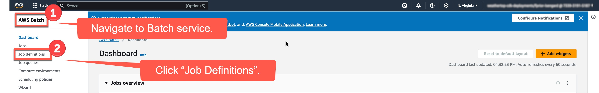
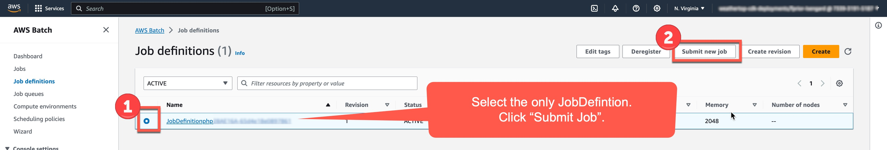
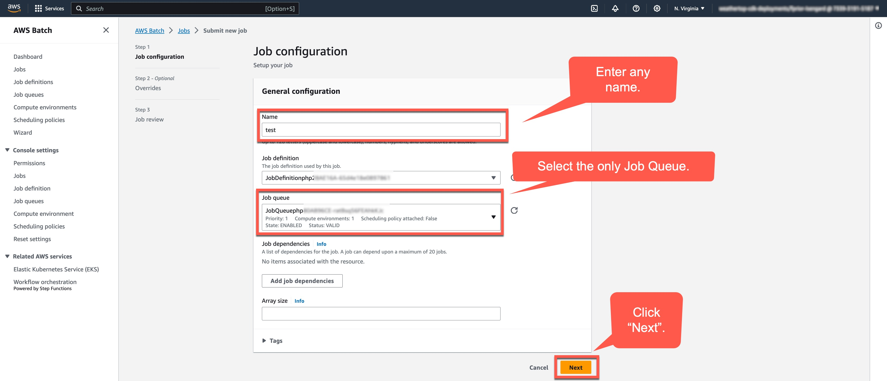
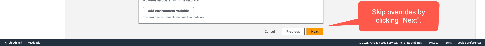
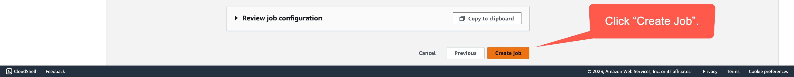
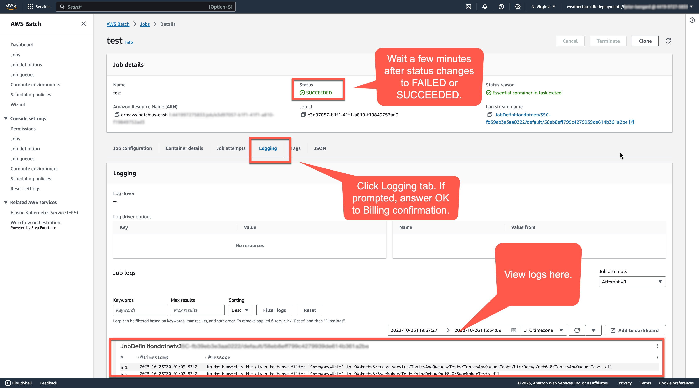

# Deployment Instructions
These instructions assume a "target account" (where tests will be invoked) of "python" per [this repository's configuration](config/targets.yaml).
You can replace Python with any of the other languages listed in this repository's configuration.

To request an alternate configuration for your own repository, please [submit an issue](https://github.com/awsdocs/aws-doc-sdk-examples/issues/new?labels=type%2Fenhancement&labels=Tools&title=%5BEnhancement%5D%3A+Weathertop+Customization+Request&&) with the `Tools` label.

## 1. Deploy Consumer Stack for your language (e.g. Python)
Admin will:
1. Set Python virtualenv within [sqs_lambda_to_batch_fargate directory](sqs_lambda_to_batch_fargate).
1. `export LANAUGE_NAME=python`.
1. Get Python account tokens.
2. `cdk bootstrap` and `cdk deploy`.

## 2. Enable Consumer Stack to receive event notifications
User will:
1. Set `status` to `enabled` in [targets.yaml](config/targets.yaml) for your language
1. Raise PR.

Admin will:
1. Approve and merge PR.
1. Set Python virtualenv within [eventbridge_rule_with_sns_fanout directory](eventbridge_rule_with_sns_fanout).
1. Get Admin account tokens.
1. `cdk bootstrap` and `cdk deploy`.
1. Request user [submit test job](#3-submit-test-job).

## 3. Submit test job
User will:
1. Log into console for Python account
1. Navigate to "Job Definitions".

1. Click "Submit Job".

1. Add name, select queue, and click "Next".

1. Click "Next".

1. Click "Create job".

1. [Validate results of test job](#3-optional-view-test-job-results)

## 3. Optional: View CloudWatch job results in Batch
1. Navigate to a job
1. When status is `SUCCEEDED` or `FAILED`, click "Logging" tab.
