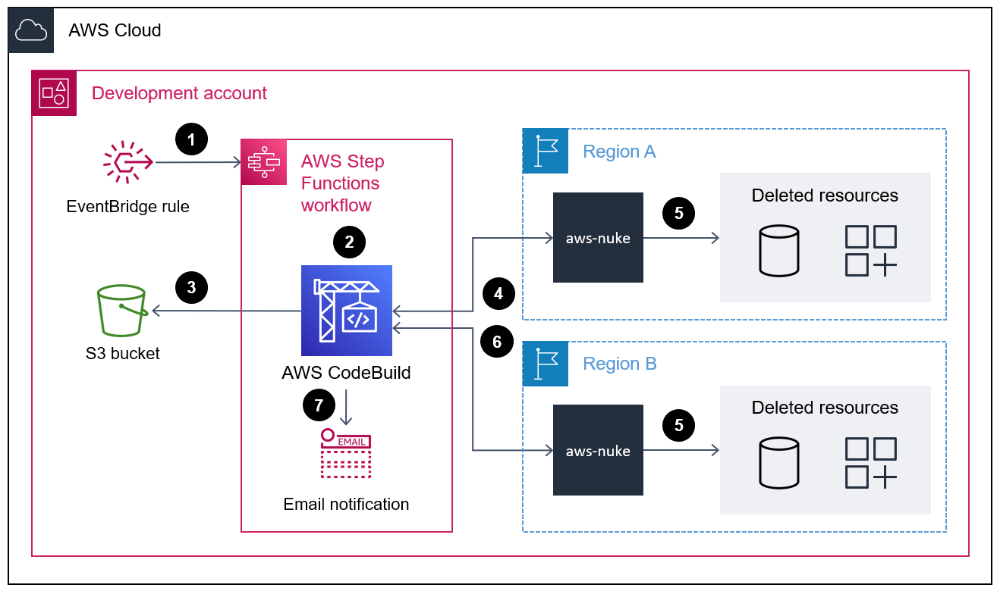

# aws-nuke for Weathertop

AWS Nuke is an open source tool created by [ekristen](https://github.com/ekristen/aws-nuke).

It searches for deleteable resources in the provided AWS account and deletes those which are not considered "Default" or "AWS-Managed", taking your account back to Day 1 with few exceptions.


## ⚠ Important
This is a very destructive tool! It should not be deployed without fully understanding the impact it will have on your AWS accounts.
Please use caution and configure this tool to delete unused resources only in your lower test/sandbox environment accounts.

## Overview

The code in this repository helps you set up the following architecture:



## Feature Outline

1. **Scheduled Trigger**: Amazon EventBridge invokes AWS Step Functions daily.
2. **Regional Scalability**: Runs AWS CodeBuild projects per region.
4. **Custom Config**: Pulls resource filters and region targets in [nuke_generic_config.yaml](nuke_generic_config.yaml).

## Prerequisites

1. **AWS-Nuke Binary**: Open-source library from [ekristen](https://github.com/ekristen/aws-nuke) staged in S3.  
2. **AWS Account Alias**: Must exist in the IAM Dashboard for the target  account.  
3. **AWS CodeBuild**: Required for runtime and compute.  
4. **AWS S3 Bucket**: Stores the nuke config file and AWS-Nuke binary (latest version).  
5. **AWS Step Functions**: Orchestrates multi-region parallel CodeBuild invocations.  
6. **AWS SNS Topic**: Sends daily resource cleanup reports and CodeBuild job statuses.  
7. **AWS EventBridge Rule**: Cron-based schedule to trigger the workflow with region inputs.  
8. **Network Connectivity**: Ensure VPC allows downloads from GitHub or stage the binary in S3/artifactory for restricted environments.

## Setup and Installation

* Clone the [repo](https://github.com/ekristen/aws-nuke).
* Determine the `id` of the account to be deployed for nuking.
* Narrow [filters](nuke_generic_config.yaml) for the resources/accounts you wish to nuke.
* Deploy the stack using the below command. You can run it in any desired region.
```sh
cdk bootstrap && cdk deploy
```

## Testing
Once stack is created, upload the [nuke generic config file](nuke_generic_config.yaml) and the [python script](cp nuke_config_update.py) to the S3 bucket using the commands below.

You can find the name of the S3 bucket generated from the CloudFormation console `Outputs` tab.
```sh
aws s3 cp nuke_generic_config.yaml --region us-east-1 s3://{your-bucket-name}
aws s3 cp nuke_config_update.py --region us-east-1 s3://{your-bucket-name}
```
* Run the stack manually by triggering the StepFunctions with the below sample input payload. (which is pre-configured in the EventBridge Target as a Constant JSON input). You can configure this to run in parallel on the required number of regions by updating the region_list parameter.

```sh
{
  "InputPayLoad": {
    "nuke_dry_run": "true",
    "nuke_version": "2.21.2",
    "region_list": [
      "global",
      "us-west-1",
      "us-east-1"
    ]
  }
}
```

## Other notes:
* The tool is currently configured to run at a schedule as desired typically off hours 3:00a EST. It can be easily configured with a rate() or cron() expression by editing the cfn template file

* The workflow also sends out a detailed report to an SNS topic with an active email subscription on what resources were deleted after the job is successful for each region which simplifies traversing and parsing the complex logs spit out by the aws-nuke binary. 

* If the workflow is successful, the stack will send out
  - One email for each of the regions where nuke CodeBuild job was invoked with details of the build execution , the list of resources which was deleted along with the log file path. 
  - The StepFunctions workflow also sends out another email when the whole Map state process completes successfully. Sample email template given below.

```sh
      Account Cleansing Process Completed;
      
        ------------------------------------------------------------------
        Summary of the process:
        ------------------------------------------------------------------
        DryRunMode                   : true
        Account ID                   : 123456789012
        Target Region                : us-west-1
        Build State                  : JOB SUCCEEDED
        Build ID                     : AccountNuker-NukeCleanser:4509a9b5
        CodeBuild Project Name       : AccountNuker-NukeCleanser
        Process Start Time           : Thu Feb 23 04:05:21 UTC 2023
        Process End Time             : Thu Feb 23 04:05:54 UTC 2023
        Log Stream Path              : AccountNuker-NukeCleanser/logPath
        ------------------------------------------------------------------
        ################ Nuke Cleanser Logs #################
      
        FAILED RESOURCES
      -------------------------------
      Total number of Resources that would be removed:
      3
      us-west-1 - SQSQueue - https://sqs.us-east-1.amazonaws.com/123456789012/test-nuke-queue - would remove
      us-west-1 - SNSTopic - TopicARN: arn:aws:sns:us-east-1:123456789012:test-nuke-topic - [TopicARN: "arn:aws:sns:us-east-1:123456789012:test-topic"] - would remove
      us-west-1 - S3Bucket - s3://test-nuke-bucket-us-west-1 - [CreationDate: "2023-01-25 11:13:14 +0000 UTC", Name: "test-nuke-bucket-us-west-1"] - would remove

```

## Monitoring queries

Use the `aws-cli` to get CloudWatch logs associated with your most recent nuclear activity.

```sh
# Get the current Unix timestamp
CURRENT_TIME=$(date +%s000)

# Get the timestamp from 5 minutes ago
FIVE_MINUTES_AGO=$(($(date +%s) - 300))000

# Filter log events using above date range
aws logs filter-log-events \
  --log-group-name AccountNuker-nuke-auto-account-cleanser \
  --start-time $FIVE_MINUTES_AGO --end-time $CURRENT_TIME \
  --log-stream-names "10409c89-a90f-4af7-9642-0df9bc9f0855" \
  --filter-pattern removed \
  --no-interleaved \
  --output text \
  --limit 5
```
