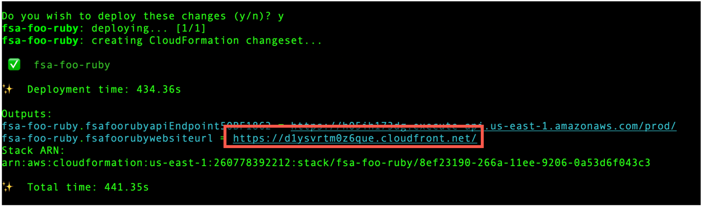

# Feedback Sentiment Analyzer (FSA)

Feedback Sentiment Analyzer (FSA) is an example application that showcases AWS services and SDKs. Built with ❤️ for you to explore, download, and deploy on your own!

## What it does
Specifically, this application solves a ficticious use case of a hotel in Paris, France, which receives feedback from guests via comment cards in a variety of foreign languages.

These comment cards are:
* uploaded through a web client
* transformed using a suite of machine learning services,
* and rendered through the same web client

---
## SDK implementations
This application has been implemented in the AWS SDKs below. Choose your language to explore, download, deploy, and run:
* [Ruby](../../ruby/cross-services/feedback-sentiment-analyzer/README.md)
---
## AWS services used

This application uses a suite of [machine learning services on AWS](https://aws.amazon.com/machine-learning/) to:
* extract text using [Amazon Textract](https://aws.amazon.com/textract/).
* detect sentiment using [Amazon Comprehend](https://aws.amazon.com/comprehend/).
* translate to French using [Amazon Translate](https://aws.amazon.com/translate/).
* synthesize to human-like speech using [Amazon Polly](https://aws.amazon.com/polly/).

Additionally, the application showcases:
* [Amazon S3](https://aws.amazon.com/s3/) to store images of comment cards
* [EventBridge](https://aws.amazon.com/eventbridge/) to relay events from Amazon S3
* [AWS Lambda](https://aws.amazon.com/lambda/) to execute business logic
* [Step Functions](https://aws.amazon.com/stepfunctions/) to orchestrate multiple Lambda functions 
* [Amazon DynamoDB](https://aws.amazon.com/dynamodb/) to store details about each comment
* [API Gateway](https://aws.amazon.com/apigw/) to route requests from frontend to backend
* [CloudFront](https://aws.amazon.com/cloudfront/) to distribute this application globally
* [Cognito](https://aws.amazon.com/cognito) to authenticate users
---
## Deployment instructions
This application is deployed using the [AWS Cloud Development Kit (CDK)](https://aws.amazon.com/cdk/).

1. Get [AWS credentials](https://docs.aws.amazon.com/cli/latest/userguide/cli-configure-files.html)
1. Set the environment variables below:
   * `FSA_NAME` - any text less than 10 characters.
   * `FSA_EMAIL` - a valid email address you own
   * `FSA_LANG` - any of the [implemented languages](#sdk-implementations) (lowercase)

   For example:

   _Bash_
   ```
   export FSA_NAME=foo
   export FSA_EMAIL=foo@bar.com
   export FSA_LANG=ruby
   ```
   _Windows cmd_
   ```
   set FSA_NAME=foo
   set FSA_EMAIL=foo@bar.com
   set FSA_LANG=ruby
   ```
   _Windows Powershell_
   ```
   $Env:FSA_NAME = foo
   $Env:FSA_EMAIL = foo@bar.com
   $Env:FSA_LANG = ruby
   ```
2. Run the commands below:
   ```
   cd cdk
   npm install
   cdk deploy
   ```
Once deployed, observe the `Output` in your terminal session.
Copy the CloudFront distribution URL, which will have `websiteurl` in the name.

Paste this URL into a browser session and begin uploading images representing comments.
---
## Application instructions
### Log in
To begin uploading images:
1. Check `FSA_EMAIL` for an email containing a temporary password.
2. Copy that password into the login modal.

3. Reset your password as prompted.

### Upload images


