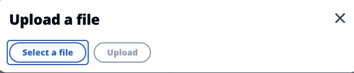
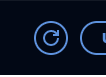

# Feedback Sentiment Analyzer (FSA)

Feedback Sentiment Analyzer (FSA) is an example application that showcases AWS services and SDKs. Built with ❤️ for you to explore, download, and deploy.

## What it does

Specifically, this application solves a fictitious use case of a hotel in New York City that receives guest feedback on comment cards in a variety of languages.

These comment cards are uploaded through a web client, transformed using a suite of machine learning services, and rendered through the same web client.

---

## SDK implementations

This application has been implemented with the following AWS SDKs. To deploy one of these implementations, follow the [Deployment instructions](#deployment-instructions).

- [Ruby](../../ruby/cross-services/feedback-sentiment-analyzer/README.md)

---

## AWS services used

This application uses a suite of [AWS machine learning services](https://aws.amazon.com/machine-learning/) to do the following:

- Extract text using [Amazon Textract](https://aws.amazon.com/textract/)
- Detect sentiment using [Amazon Comprehend](https://aws.amazon.com/comprehend/)
- Translate to English using [Amazon Translate](https://aws.amazon.com/translate/)
- Synthesize to human-like speech using [Amazon Polly](https://aws.amazon.com/polly/)

Additionally, the application showcases the following AWS services:

- [Amazon Simple Storage Service (Amazon S3)](https://aws.amazon.com/s3/) - Stores images of comment cards
- [Amazon EventBridge](https://aws.amazon.com/eventbridge/) - Relays events from Amazon S3
- [AWS Lambda](https://aws.amazon.com/lambda/) - Executes business logic
- [AWS Step Functions](https://aws.amazon.com/stepfunctions/) - Orchestrates multiple Lambda functions
- [Amazon DynamoDB](https://aws.amazon.com/dynamodb/) - Stores details about each comment
- [Amazon API Gateway](https://aws.amazon.com/apigw/) - Routes requests from frontend to backend
- [Amazon CloudFront](https://aws.amazon.com/cloudfront/) - Distributes this application globally
- [Amazon Cognito](https://aws.amazon.com/cognito) - Authenticates users

---

## Deployment instructions

This application is deployed using the [AWS Cloud Development Kit (AWS CDK)](https://aws.amazon.com/cdk/).

1. Get [AWS credentials](https://docs.aws.amazon.com/cli/latest/userguide/cli-configure-files.html).
1. Set the following environment variables:

   - `FSA_NAME` - Any text less than 10 characters
   - `FSA_EMAIL` - A valid email address that you own
   - `FSA_LANG` - Any of the [implemented languages](#sdk-implementations)

   For example:

   _Bash_

   ```
   export FSA_NAME=ana
   export FSA_EMAIL=ana@example.com
   export FSA_LANG=ruby
   ```

   _Windows cmd_

   ```
   set FSA_NAME=ana
   set FSA_EMAIL=ana@example.com
   set FSA_LANG=ruby
   ```

   _Windows Powershell_

   ```
   $Env:FSA_NAME = ana
   $Env:FSA_EMAIL = ana@example.com
   $Env:FSA_LANG = ruby
   ```

1. Run the following commands:
   ```
   cd cdk
   npm install
   cdk deploy
   ```
   After deploying, observe the `Output` in your terminal session.
   Copy the CloudFront distribution URL, which has `websiteurl` in the name.
   
   Paste this URL into a browser to launch the application.

---

## Application instructions

### Sign in

1. Choose `Sign in`.
2. Enter the the email from `FSA_EMAIL` into the `Username` field.
3. Enter the temporary password that was sent to you into the `Password` field.
   
4. Reset your password as prompted.

### Upload images

1. Signing in directs you to a landing page that says `No data found`.
   
2. Choose `Upload`.
3. Choose `Select a file`.
4. Select a PNG or JPEG image that contains a positive comment about the hotel. Negative comments are saved, but not returned to the frontend.
   
5. Choose `Upload`.

### Play the result

1. Wait. The image upload takes a minute or two to process.
2. Choose the `Refresh` button.
   
3. You should see a card with the original image, translated text, and a play button.
   
4. Choose the play button to listen to the translated audio.
