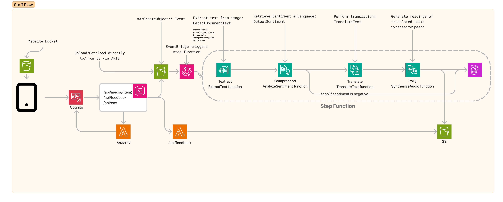

# FSA technical specification

This document contains the technical specifications for Feedback Sentiment Analyzer (FSA), a sample application that showcases AWS services and SDKs.

This document explains:

- Application inputs and outputs
- Underlying AWS components and their configurations
- Key cross-service integration details

See the [README.md](README.md) for an introduction to FSA.

---
### Table of Contents

- [User actions](#user-actions)
- [Application behavior](#application-behavior)
- [Diagram](#diagram)
- [Input routing](#input-routing)
- [Step Function configuration](#step-function-configuration)
  - [State machine Lambda functions](#state-machine-lambda-functions)
    - [Diagram](#diagram-1)
    * [Function inputs and outputs](#function-inputs-and-outputs)
      - [ExtractText](#extracttext)
      - [AnalyzeSentiment](#analyzesentiment)
      - [TranslateText](#translatetext)
      - [SynthesizeAudio](#synthesizeaudio)
- [GetFeedback Lambda function](#getfeedback-lambda-function-1)
- [Processing S3 events with EventBridge](#processing-s3-events-with-eventbridge)
- [Managing items in DynamoDB](#managing-items-in-dynamodb)
- [Other FSA material](#other-fsa-material)

---

## Diagram
This diagram represents the relationships between key FSA components. 



---

## User actions

This application receives three inputs from the frontend.

- authenticate user (uses `Cognito`)
- load page (uses `DynamoDB:GetItems`)
- upload image to S3 (`S3:PutObject`)

## Application behavior

This application produces two outputs from the backend:

- put new item in the database (uses `DynamoDB:PutItem`)
- put new synthesized audio to S3 (uses `S3:PutObject`)

---

## HTTP API specification

All the APIs are created by the CDK script. The endpoints are common to every language variation and do not need any additional implementation.

<details>
<summary><strong>PUT /api/media/{item}</strong></summary>
<br/>

> Create or update an object in Amazon S3. Creating or updating an image file will trigger the Step Function.

<table>
<tr>
<th>parameters</th>
<th>request body</th>
<th>response body</th>
</tr>
<tr>
<td>item - the object key of the item to get</td>
<td>JavaScript [File](https://developer.mozilla.org/en-US/docs/Web/API/File) object</td>
<td>Empty</td>
</tr>
</table>
</details>

<details>
<summary><strong>GET /api/media/{item}</strong></summary>
<br/>

> Get an object from Amazon S3.

<table>
<tr>
<th>parameters</th>
<th>request body</th>
<th>response body</th>
</tr>
<tr>
<td>item - the object key of the item to get</td>
<td>Empty</td>
<td>Empty</td>
</tr>
</table>
</details>

<details>
<summary><strong>GET /api/feedback</strong></summary>
<br/>

> Get the translated text, sentiment, and audio/image keys for an uploaded image. This data comes from Amazon DynamoDB. The database table is filled as a result of running the step function.

<table>
<tr>
<th>parameters</th>
<th>request body</th>
<th>response body</th>
</tr>
<tr>
<td>Empty</td>
<td>Empty</td>
<td>
<pre>
{
  "feedback": [
    {
      "sentiment": "POSITIVE",
      "text": "J'adore cet hôtel!",
      "audioUrl": "PXL_20230710_182358532.jpg.mp3",
      "imageUrl": "PXL_20230710_182358532.jpg"
    }
  ]
}
</pre>
</td>  
</tr>
</table>
</details>

<details>
<summary><strong>GET /api/env</strong></summary>
<br/>

> Get the environment variables required to connect to a Cognito hosted UI. The frontend calls this automatically to facilitate sign in.

<table>
<tr>
<th>parameters</th>
<th>request body</th>
<th>response body</th>
</tr>
<tr>
<td>Empty</td>
<td>Empty</td>
<td>
<pre>
{
"COGNITO_SIGN_IN_URL": "https://...",
"COGNITO_SIGN_OUT_URL": "https://..."
}
</pre>
</td>
</tr>
</table>
</details>

## Step Function configuration

When an image is uploaded through `Upload image` input route, a Step Function state machine is triggered.

This multi-state workflow is listed below in sequence:

1. Start
2. [ExtractText](#ExtractText) - extracts text from an image
2. [AnalyzeSentiment](#AnalyzeSentiment) - detects text sentiment
3. `ContinueIfPositive` (skip to 5 if sentiment `NEGATIVE`)
3. [TranslateText](#TranslateText) - translates text to French
4. [SynthesizeAudio](#SynthesizeAudio) - synthesizes human-like audio from text
5. `DynamoDB:PutItem` (see [table config](#managing-items-in-dynamodb))
6. Stop

The below diagram depicts this sequence.


### State machine Lambda functions

See below for the required inputs and outputs of each Lambda function.

### ExtractText
Uses Amazon Textract's [DetectDocumentText](https://docs.aws.amazon.com/textract/latest/dg/API_DetectDocumentText.html)
method to extract text from an image and return a unified text representation.

#### **Input**

Function will use data available on the [S3 event object](https://docs.aws.amazon.com/AmazonS3/latest/userguide/EventBridge.html).

For example:

```json
{
  "bucket": "my-s3-bucket",
  "region": "us-east-1",
  "object": "foo/bar.png"
}
```

#### **Output**

Function will return a string representing the text extracted.

For example:

```json
THIS HOTEL WAS GREAT
```

### AnalyzeSentiment
Uses Amazon Comprehend's [DetectSentiment](https://docs.aws.amazon.com/comprehend/latest/APIReference/API_DetectSentiment.html)
method to detect sentiment (`POSITIVE`, `NEUTRAL`, `MIXED`, or `NEGATIVE`).

#### **Input**

Function will use data available on the [Lambda event object](https://docs.aws.amazon.com/lambda/latest/dg/gettingstarted-concepts.html#gettingstarted-concepts-event).

For example:

```json
{
  "source_text": "THIS HOTEL WAS GREAT",
  "region": "us-east-1"
}
```

#### **Output**

Function will return a string representing the text extracted.

For example:

```json
{
  "sentiment": "POSITIVE",
  "language_code": "en"
}
```

### TranslateText
Uses Amazon Translate's [TranslateText](https://docs.aws.amazon.com/translate/latest/APIReference/API_TranslateText.html)
method to translate text to French and return in String format.

#### **Input**

Function will use data available on the [Lambda event object](https://docs.aws.amazon.com/lambda/latest/dg/gettingstarted-concepts.html#gettingstarted-concepts-event).

For example:

```json
{
    "source_language_code": "en"
    "region": "us-east-1",
    "extracted_text": "THIS HOTEL WAS GREAT"
}
```

#### **Output**

Function will return a string representing the text translated.

For example:

```json
CET HOTEL ÉTAIT RAVISSANT
```

### SynthesizeAudio
Uses Amazon Polly's [SynthesizeAudio](https://docs.aws.amazon.com/polly/latest/dg/API_SynthesizeSpeech.html)
method to converts input text into life-like speech

#### **Input**

Function will use data available on the [Lambda event object](https://docs.aws.amazon.com/lambda/latest/dg/gettingstarted-concepts.html#gettingstarted-concepts-event).

For example:

```json
{
  "bucket": "my-s3-bucket",
  "translated_text": "CET HOTEL ÉTAIT RAVISSANT",
  "region": "us-east-1",
  "object": "comment.png"
}
```

#### **Output**

Function will return a string representing the key of the newly-synthesized audio file.

For example:

```json
my-s3-bucket/audio.mp3
```

---

## GetFeedback Lambda function
Uses DynamoDB's [GetItem](https://docs.aws.amazon.com/amazondynamodb/latest/APIReference/API_GetItem.html)
method to get all records from [the table](#managing-items-in-dynamodb). Invoked by the frontend interace.

There is no input.

### **Output**

Function will return a JSON object `feedback` containing items. Each item will contain translated text and a link to its corresponding synthesized audio file.

For example:

```json
{
  "feedback": [
    {
      "sentiment": "POSITIVE",
      "text": "J'adore cet hôtel/",
      "audioUrl": "PXL_20230710_182358532.jpg.mp3",
      "imageUrl": "PXL_20230710_182358532.jpg"
    }
  ]
}
```

---

## Processing S3 events with EventBridge

This application relies on an [EventBridge rule](https://docs.aws.amazon.com/eventbridge/latest/userguide/eb-rules.html), which triggers the [Step Functions state machine](#step-function-configuration) when new images are uploaded to S3 by the frontend.

Specifically, the trigger is scoped to `ObjectCreated` events emitted by `my-s3-bucket`:

```json
eventPattern: {
        source: ["aws.s3"],
        detailType: ["Object Created"],
        detail: {
          bucket: {
            name: [<dynamic media bucket name>],
          },
          object: {
            key: [{ suffix: ".png" }, { suffix: ".jpeg" }, { suffix: ".jpg" }],
          },
        },
      }
```

---

## Managing items in DynamoDB

This application relies on an Amazon DynamoDB table using the schema detailed below.

| key               | purpose                                   | attribute | value                  |
| ----------------- | ----------------------------------------- | --------- | ---------------------- |
| `comment_key`     | Key of the scanned image.                 | `S`       | S3 object key          |
| `source_text`     | Extracted text from image.                | `S`       | Extracted text         |
| `sentiment`       | Comprehend sentiment score.               | `S`       | Comprehend JSON object |
| `source_language` | The language detected from the Text.      | `S`       | Language code          |
| `translated_text` | French version of 'text'.                 | `S`       | Translated text        |
| `audio_key`       | Key of the audio file generated by Polly. | `S`       | S3 object key          |

---

# Other FSA material

If technical details are not what you seek, try these instead:

- [High-level summary](README.md)
- [Deployment and development instructions](DEVELOPMENT.md)
- [Opinionated architecture overview](DESIGN.md)
