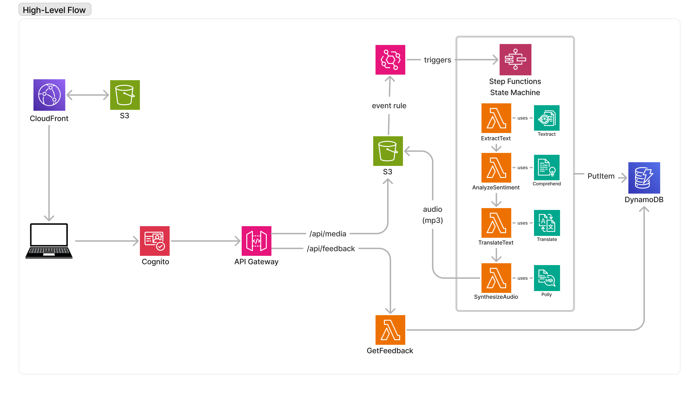
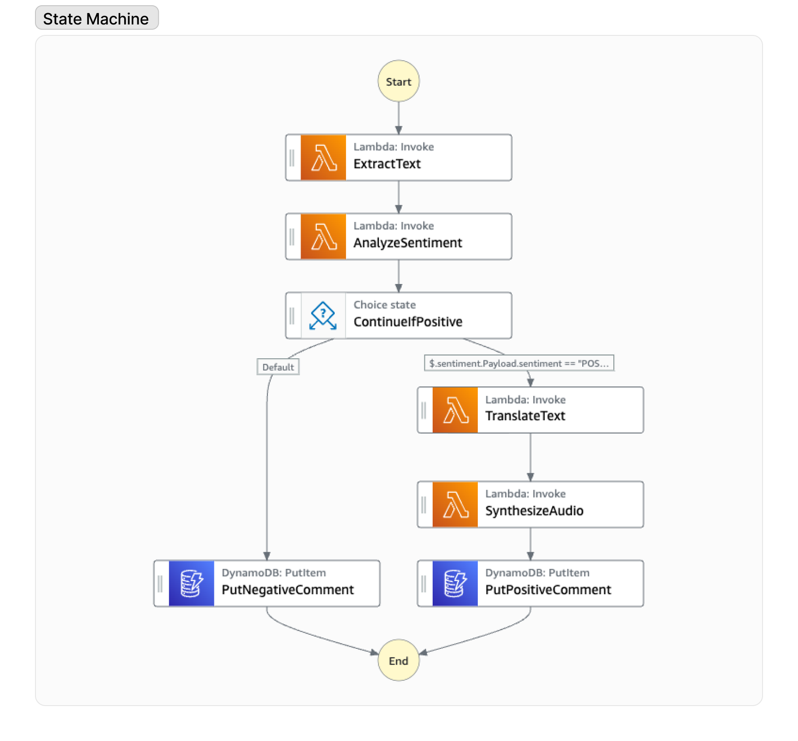

# FSA technical specification

This document contains the technical specifications for Feedback Sentiment Analyzer (FSA), a sample application that showcases AWS services and SDKs.

This document explains the following:

- Application inputs and outputs
- Underlying AWS components and their configurations
- Key cross-service integration details

For an introduction to FSA, see the [README.md](README.md).

---

### Table of contents

- [Relational diagram](#relational-diagram)
- [User actions](#user-actions)
- [Application behavior](#application-behavior)
- [HTTP API specification](#http-api-specification)
- [Step Functions configuration](#step-functions-configuration)
  - [State machine Lambda functions](#state-machine-lambda-functions)
    - [ExtractText](#extracttext)
    - [AnalyzeSentiment](#analyzesentiment)
    - [TranslateText](#translatetext)
    - [SynthesizeAudio](#synthesizeaudio)
- [GetFeedback Lambda function](#getfeedback-lambda-function)
- [Processing Amazon S3 events with EventBridge](#processing-amazon-s3-events-with-eventbridge)
- [Managing items in DynamoDB](#managing-items-in-dynamodb)
- [Other FSA material](#other-fsa-material)

---

## Relational diagram

This diagram represents the relationships between key FSA components.


1. The static website assets are hosted in an Amazon S3 bucket and served using Amazon CloudFront.
2. Amazon Cognito allows authenticated access to Amazon API Gateway.
3. Amazon API Gateway puts objects in an Amazon S3 bucket. This triggers an EventBridge rule that starts a Step Functions workflow.
4. The Step Functions workflow uses AWS Lambda, Amazon Textract, Amazon Comprehend, Amazon Translate, and Amazon Polly to perform the business logic.
5. Metadata is stored in Amazon DynamoDB. Audio files are stored in the same Amazon S3 bucket used in step 3.
6. Amazon API Gateway fetches the metadata from Amazon DynamoDB.

---

## User actions

This application receives three inputs from the frontend.

- Authenticate user (uses `Cognito`)
- Load page (uses `DynamoDB:GetItems`)
- Upload image to Amazon S3 (`S3:PutObject`)

## Application behavior

This application produces two outputs from the backend:

- Put new item in the database (uses `DynamoDB:PutItem`)
- Put new synthesized audio to Amazon S3 (uses `S3:PutObject`)

---

## HTTP API specification

All the APIs are created by the CDK script. The endpoints are common to every language variation and do not need any additional implementation.

<details>
<summary><strong>PUT /api/media/{item}</strong></summary>
<br/>

> Create or update an object in Amazon S3. Creating or updating an image file will trigger the Step Functions workflow.

<table>
<tr>
<th>parameters</th>
<th>request body</th>
<th>response body</th>
</tr>
<tr>
<td>item - the object key of the item to get</td>
<td>JavaScript <a href="https://developer.mozilla.org/en-US/docs/Web/API/File">File</a> object</td>
<td>Empty</td>
</tr>
</table>
</details>

<details>
<summary><strong>GET /api/media/{item}</strong></summary>
<br/>

> Get an object from Amazon S3.

<table>
<tr>
<th>parameters</th>
<th>request body</th>
<th>response body</th>
</tr>
<tr>
<td>item - the object key of the item to get</td>
<td>Empty</td>
<td>Empty</td>
</tr>
</table>
</details>

<details>
<summary><strong>GET /api/feedback</strong></summary>
<br/>

> Get the translated text, sentiment, and audio/image keys for an uploaded image. This data comes from Amazon DynamoDB. The database table is filled as a result of running the step function.

<table>
<tr>
<th>parameters</th>
<th>request body</th>
<th>response body</th>
</tr>
<tr>
<td>Empty</td>
<td>Empty</td>
<td>
<pre>
{
  "feedback": [
    {
      "sentiment": "POSITIVE",
      "text": "I love this hotel!",
      "audioUrl": "PXL_20230710_182358532.jpg.mp3",
      "imageUrl": "PXL_20230710_182358532.jpg"
    }
  ]
}
</pre>
</td>  
</tr>
</table>
</details>

<details>
<summary><strong>GET /api/env</strong></summary>
<br/>

> Get the environment variables required to connect to an Amazon Cognito hosted UI. The frontend calls this automatically to facilitate sign in.

<table>
<tr>
<th>parameters</th>
<th>request body</th>
<th>response body</th>
</tr>
<tr>
<td>Empty</td>
<td>Empty</td>
<td>
<pre>
{
"COGNITO_SIGN_IN_URL": "https://...",
"COGNITO_SIGN_OUT_URL": "https://..."
}
</pre>
</td>
</tr>
</table>
</details>

## Step Functions configuration

When an image is created or updated in an S3 media bucket, a Step Functions state machine is triggered.

The sequence of this multi-state workflow follows:

1. Start
2. [ExtractText](#ExtractText) - Extracts text from an image
3. [AnalyzeSentiment](#AnalyzeSentiment) - Detects text sentiment
4. `ContinueIfPositive` (Skip to 7 if sentiment is `NEGATIVE`)
5. [TranslateText](#TranslateText) - Translates text to English
6. [SynthesizeAudio](#SynthesizeAudio) - Synthesizes human-like audio from text
7. `DynamoDB:PutItem` (See [table config](#managing-items-in-dynamodb))
8. Stop

The following diagram depicts this sequence.


## State machine Lambda functions

Following are the required inputs and outputs of each Lambda function.

### ExtractText

Use the Amazon Textract [DetectDocumentText](https://docs.aws.amazon.com/textract/latest/dg/API_DetectDocumentText.html)
method to extract text from an image and return a unified text representation.

#### **Input**

Use the data available on the [Amazon S3 event object](https://docs.aws.amazon.com/AmazonS3/latest/userguide/EventBridge.html).

For example:

```json
{
  "bucket": "DOC-EXAMPLE-BUCKET",
  "region": "us-east-1",
  "object": "obj/ect.png"
}
```

#### **Output**

Returns a string representing the extracted text.

For example:

```
CET HÔTEL ÉTAIT SUPER
```

---

### AnalyzeSentiment

Use the Amazon Comprehend [DetectSentiment](https://docs.aws.amazon.com/comprehend/latest/APIReference/API_DetectSentiment.html)
method to detect sentiment (`POSITIVE`, `NEUTRAL`, `MIXED`, or `NEGATIVE`).

#### **Input**

Use the data available on the [Lambda event object](https://docs.aws.amazon.com/lambda/latest/dg/gettingstarted-concepts.html#gettingstarted-concepts-event).

For example:

```json
{
  "source_text": "CET HÔTEL ÉTAIT SUPER",
  "region": "us-east-1"
}
```

#### **Output**

Returns the determined sentiment and language code.

For example:

```json
{
  "sentiment": "POSITIVE",
  "language_code": "fr-FR"
}
```

---

### TranslateText

Use the Amazon Translate [TranslateText](https://docs.aws.amazon.com/translate/latest/APIReference/API_TranslateText.html)
method to translate text to English and return a string.

#### **Input**

Uses the data available on the [Lambda event object](https://docs.aws.amazon.com/lambda/latest/dg/gettingstarted-concepts.html#gettingstarted-concepts-event).

For example:

```json
{
  "source_language_code": "fr-FR",
  "region": "us-east-1",
  "extracted_text": "CET HÔTEL ÉTAIT SUPER"
}
```

#### **Output**

Returns an object containing the translated text.

For example:

```
{ translated_text: "THIS HOTEL WAS GREAT" }
```

---

### SynthesizeAudio

Uses the Amazon Polly [SynthesizeSpeech](https://docs.aws.amazon.com/polly/latest/dg/API_SynthesizeSpeech.html) method to convert input text into life-like speech. Store the synthesized audio in the provided Amazon S3 bucket with a content type of "audio/mpeg".

#### **Input**

Uses the data available on the [Lambda event object](https://docs.aws.amazon.com/lambda/latest/dg/gettingstarted-concepts.html#gettingstarted-concepts-event).

For example:

```json
{
  "bucket": "DOC-EXAMPLE-BUCKET",
  "translated_text": "THIS HOTEL WAS GREAT",
  "region": "us-east-1",
  "object": "comment.png"
}
```

#### **Output**

Return a string representing the key of the synthesized audio file. The key is the provided object name appended with ".mp3". This key will be sent to the frontend. The frontend will use the key to directly get the audio file from Amazon S3.

For example, if the object name was "image.jpg", the output would be "image.jpg.mp3".

---

## GetFeedback Lambda function

Uses the DynamoDB [GetItem](https://docs.aws.amazon.com/amazondynamodb/latest/APIReference/API_GetItem.html)
method to get all records from [the table](#managing-items-in-dynamodb). Invoked by the frontend interface.

There is no input.

### **Output**

Returns a JSON object with one property: `feedback`. `feedback` is an array of objects that contains four properties:

- sentiment - "POSITIVE" | "NEGATIVE" | "NEUTRAL"
- text - The original text translated to the destination language. (English by default)
- audioUrl - The Amazon S3 object key for the synthesized audio file.
- imageUrl - The original uploaded image.

For example:

```json
{
  "feedback": [
    {
      "sentiment": "POSITIVE",
      "text": "THIS HOTEL WAS GREAT",
      "audioUrl": "PXL_20230710_182358532.jpg.mp3",
      "imageUrl": "PXL_20230710_182358532.jpg"
    }
  ]
}
```

---

## Processing Amazon S3 events with EventBridge

This application relies on an [EventBridge rule](https://docs.aws.amazon.com/eventbridge/latest/userguide/eb-rules.html) to trigger the [Step Functions state machine](#step-functions-configuration) when new images are uploaded to Amazon S3 by the frontend.

Specifically, the trigger is scoped to `ObjectCreated` events emitted by `my-s3-bucket`:

```json
{
  "source": ["aws.s3"],
  "detailType": ["Object Created"],
  "detail": {
    "bucket": {
      "name": ["<dynamic media bucket name>"]
    },
    "object": {
      "key": [{"suffix": ".png"}, {"suffix": ".jpeg"}, {"suffix": ".jpg"}]
    }
  }
}
```

---

## Managing items in DynamoDB

This application relies on an Amazon DynamoDB table using the following schema.

| key               | purpose                                          | attribute | value                         |
| ----------------- | ------------------------------------------------ | --------- | ----------------------------- |
| `comment_key`     | Key of the scanned image.                        | `S`       | S3 object key                 |
| `source_text`     | Extracted text from image.                       | `S`       | Extracted text                |
| `sentiment`       | Amazon Comprehend sentiment score.               | `S`       | Amazon Comprehend JSON object |
| `source_language` | The language detected from the text.             | `S`       | Language code                 |
| `translated_text` | English version of 'text'.                       | `S`       | Translated text               |
| `audio_key`       | Key of the audio file generated by Amazon Polly. | `S`       | Amazon S3 object key          |

---

# Other FSA material

If technical details are not what you seek, try these instead:

- [High-level summary](README.md)
- [Deployment and development instructions](DEVELOPMENT.md)
