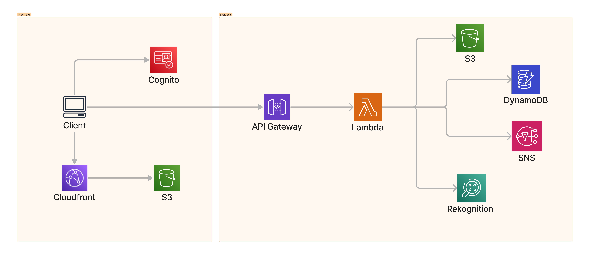

# Creating a photo asset management application using the SDK for LANGUAGE

## Overview

| Heading         | Description                                                                                                                                                                |
| --------------- | -------------------------------------------------------------------------------------------------------------------------------------------------------------------------- |
| Description     | Discusses how to develop a photo asset management application that lets users manage photos using labels. This application is developed by using the AWS SDK for LANGUAGE. |
| Audience        | Developer (intermediate)                                                                                                                                                   |
| Updated         | DATE                                                                                                                                                                       |
| Required skills | LANGUAGE, TOOLS                                                                                                                                                            |

## Purpose

You can create a Photo Asset Management (PAM) application that lets users upload images. The images are sent to Amazon Rekognition, which detects labels. Then, the images are stored using Amazon Simple Storage Service (Amazon S3) Intelligent-Tiering for cost savings. The labels are stored in an Amazon DynamoDB table. Later, users can request a bundle of images matching those labels. When images are requested, they are retrieved from Amazon S3, placed into a zip file, and a link to the zip file is sent to the user by using Amazon Simple Notification Service (Amazon SNS).

The following illustration shows the AWS services used in the PAM application.



As displayed in this illustration, the PAM application uses the following AWS services:

- Amazon Rekognition
- Amazon DynamoDB
- Amazon S3
- Amazon SNS
- AWS Lambda
- Amazon Cognito
- Amazon API Gateway

### Topics

- Prerequisites
- Understand the photo asset management application
- LANGUAGE SPECIFIC DETAILS
- Deploy the AWS resources

## Prerequisites

To complete the tutorial, you need the following:

- An AWS account
- LANGUAGE PREREQS

### Important

- The AWS services included in this document are included in the [AWS Free Tier](https://aws.amazon.com/free/?all-free-tier.sort-by=item.additionalFields.SortRank&all-free-tier.sort-order=asc).
- This code has not been tested in all AWS Regions. Some AWS services are available only in specific Regions. For more information, see [AWS Regional Services](https://aws.amazon.com/about-aws/global-infrastructure/regional-product-services).
- Running this code might result in charges to your AWS account.
- Be sure to delete all of the resources you create while going through this tutorial so that you won't be charged.
- Also make sure to properly set up your development environment. For information, see [LINK TO SETTING UP THE LANGUAGE SDK].

### Resource creation

The required AWS resources are created by using an AWS Cloud Development Kit (AWS CDK) script. This is discussed later in the document. There is no need to create any resources by using the AWS Management Console.

## Understand the photo asset management application

The front end of the PAM application is a React application that uses the [Cloudscape Design System](https://cloudscape.design/). The application supports uploading images to an S3 bucket by sending a request that generates a presigned Amazon S3 URL. The presigned URL is returned to the application and is used to upload an image.

After a user authenticates by using Amazon Cognito, the application displays all labels and the corresponding label count.


### What happens after an image is uploaded to an S3 bucket

After an image is uploaded into the storage bucket, an AWS Lambda function is automatically triggered that performs the following tasks:

1. Sends the image to Amazon Rekognition, which creates a series of labels.
2. Stores the label data in an Amazon DynamoDB table.

The following illustration shows the Amazon DynamoDB table storing label data. A label is the partition key which means it can only be added once. Each time an existing tag is detected, the count column is incremented.


The PAM application uses a lifecycle rule that places all images into an **Intelligent-Tiering** storage class at midnight. An Amazon S3 lifecycle configuration is a set of rules that define actions that Amazon S3 applies to a group of objects. For more information about an Amazon S3 lifecycle, see [Managing your storage lifecycle](https://docs.aws.amazon.com/AmazonS3/latest/userguide/object-lifecycle-mgmt.html).

The following illustration shows Amazon S3 objects that are stored in the storage class.


**Note**: For more information about Amazon S3 storage classes, see [Amazon S3 Storage Classes](https://aws.amazon.com/s3/storage-classes/).

To retrieve images, select the given labels and choose **Download**.


The application dynamically creates a .zip file, stores the file in the Amazon S3 working bucket, presigns the file, and sends a notification message by using Amazon SNS. The message contains the presigned URL that's used to download the file.


### Understand the AWS resources used by the PAM application

This section describes the AWS resources that the PAM application uses. You do not have to manually deploy any of these AWS resources, such as the AWS Lambda functions, by using the AWS Management Console. Instead, you can deploy all of them by running a provided AWS CDK script. Instructions on how to deploy these AWS resources are provided later in this document.

#### AWS Lambda functions

The backend of the PAM application is implemented by using these AWS Lambda functions:

- **Upload** - Uploads an image to an S3 bucket by using a presigned URL.
- **DetectLabelsFn** - An Amazon S3 trigger function that is invoked when an image is uploaded or copied to the S3 storage bucket.
- **LabelsFn** - Returns the labels and label count of images in the S3 storage bucket.
- **PrepareDownload** - Retrieves the keys of all images that correspond to the labels in the JSON data. Places all images in a zip file, presigns the zip file, and sends a notification message using Amazon SNS. The message contains a link to the zip file.

**Note**: These AWS Lambda names are short names. The full names that appear in the AWS Management Console depend on how you configure the provided AWS CDK script. Full names appear as {PAM_NAME}{Function Name}. For example, **MyApp-LambdasDetectLabelsFn**.

The following table describes the AWS Lambda functions used by this application.
| Function |Trigger | Input | Output | Uses |
| ------------- | ---------------------- | ---------------------------------| --------------------------------------------| ------------------------------------|
| Upload | APIG PUT /upload | See following example | See following example | Storage bucket |  
| DetectLabels | S3 PutObject jpeg | See following example | N/A | Labels table |
| PrepareDownload | APIG POST /download | {"labels": ["Mountain", "Lake"]} | N/A | Labels table / Working bucket |
| LabelsFn | APIG GET /labels | N/A | {"labels": {"maintain": {"count": 5}}} | Storage bucket, Labels table |  
| | | | | |

**Note**: The application logic required to build these AWS Lambda functions is discussed later in this document.

**Upload**

The following JSON represents the input for the **UploadFn** Lambda function.

```xml
{
  "body": "{\"file_name\":\"mountain.jpg\"}",
  "resource": "/upload",
  "path": "/upload",
  "httpMethod": "PUT"
}

```

You need to use this JSON if you want to test your AWS Lambda function by using the AWS Management Console. You specify the JSON in the **Event JSON** section, as shown in the following illustration.


This Lambda function returns JSON that contains the presigned URL that can be used to upload the .jpg file specified in the URL (in this example, mountain.jpg).

```xml
{
  "statusCode": 200,
  "headers": {
    "Access-Control-Allow-Origin": "*"
  },
  "body": "{\"url\":\"https://xxxxxxxxxxxx.amazonaws.com/xxxxxxxxxxxxxxx-mountain.jpg?X-Amz-Security-xxxxxxxxxxxxxxxxxxx\"}",
  "isBase64Encoded": false
 }
```

**LabelsFn**

The following JSON represents the input for the **LabelsFn** Lambda function.

```xml
  {
   "tags": "{}",
   "resource": "/labels",
   "path": "/labels",
   "httpMethod": "GET"
  }

```

#### API Gateway

API Gateway provides HTTP API routes for the **UploadFn**, **LabelsFn**, **Labels**, and **DownloadFn** AWS Lambda functions. Parameters for all routes are provided in the body of the request in a JSON object. The following table describes the API Gateway routes.
| Method | Route | Parameters | Example response | Lambda |
| ------------- | -----------------| --------------------------| --------------------------------------------------------------- | ----------------------------|
| PUT | /upload | filename: string | {"url": "presigned URL"} | UploadFn |
| GET | /labels | N/A | {"labels": {"maintain": {"count": 5}, "lake": {"count": 3}}} | LabelsFn |
| POST | /download | labels: string[] | {} (event) | DownloadFn |

#### S3 buckets

The PAM application uses two S3 buckets:

- **{NAME}-sdk-code-examples-pam-storage-bucket** - Used as the storage bucket.
- **{NAME}-sdk-code-examples-pam-working-bucket** - Used as the working bucket and provides zip download storage.

**Note**: The name value is defined when you run the AWS CDK script to set up the resources. This is discussed later in this document.

#### Amazon DynamoDB

The PAM application uses a DynamoDB table to track data. The Labels table named **{NAME}-SDKCodeExamplesPAM-Labels** contains the labels found by Amazon Rekognition. It has a simple primary key named **Label** with an attribute Label of type S.
**Note**: This Amazon DynamoDB table is created when you run the AWS CDK script to set up the resources. This is discussed later in this document.

## LANGUAGE SPECIFIC DETAILS

<!-- Fill in any details specific to your language. -->

## Deploy the AWS resources

At this point, you have completed all of the application business logic required for the PAM application to work. Now you need to deploy the AWS resources, including the AWS Lambda functions and API Gateway endpoints in order for the application to work. Instead of deploying all of the resources manually by using the AWS Management Console, you can use a provided AWS CDK script. Using the CDK script makes it more efficient to deploy the resources.

**Note**: For information about the AWS CDK, see [What is the AWS CDK](https://docs.aws.amazon.com/cdk/v2/guide/home.html).
For complete instuctions on how to run the supplied AWS CDK script, see [PAM CDK](https://github.com/awsdocs/aws-doc-sdk-examples/tree/main/resources/cdk/photo_asset_manager).

### Run the application

When you run the AWS CDK script, you can run the client application by using the Amazon CloudFront distribution URL as specified in the supplied AWS CDK instructions.

### Next steps

Congratulations! You have created and deployed the Photo Asset Management application. As stated at the beginning of this tutorial, be sure to delete all of the resources by following the AWS CDK instructions so that you won't continue to be charged for them.

For more AWS multiservice examples, see
[LINK TO LANGUAGE USE CASES].
