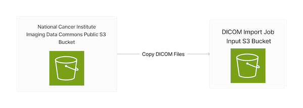

# Import HealthImaging Image Sets and Download Image Frames using the SDK for C++

## Overview

This workflow shows how to use the SDK for C++ to import DICOM files into
an AWS HealthImaging data store. It then shows how to download, decode and verify the image
frames created by the DICOM import.

Digital Imaging and Communications in Medicine (DICOM) is a technical standard for the digital storage and transmission of medical images and related information.

This workflow runs as a command-line application prompting for user input.

1. All the necessary resources are created from an AWS CloudFormation template.
   1. A HealthImaging data store.
   2. An Amazon Simple Storage Service (Amazon S3) input bucket for a DICOM import job.
   3. An Amazon S3 output bucket for a DICOM import job.
   4. An AWS Identity and Access Management (IAM) role with the appropriate permissions for a DICOM import job.


2. The user chooses a DICOM study to copy from the [National Cancer Institute Imaging Data Commons (IDC) Collections](https://registry.opendata.aws/nci-imaging-data-commons/)' public S3 bucket.
3. The chosen study is copied to the user's input S3 bucket.



4. A HealthImaging DICOM import job is run.


5. The workflow retrieves the IDs for the HealthImaging image frames created by the DICOM import job.


6. The HealthImaging image frames are downloaded, decoded to a bitmap format, and verified using a CRC32 checksum.
7. The created resources can then be deleted, if the user chooses.

## ⚠ Important

* Running this code might result in charges to your AWS account.
* Running the tests might result in charges to your AWS account.
* We recommend that you grant your code least privilege. At most, grant only the minimum permissions required to perform the task. For more information, see [Grant least privilege](https://docs.aws.amazon.com/IAM/latest/UserGuide/best-practices.html#grant-least-privilege).
* This code is not tested in every AWS Region. For more information, see [AWS Regional Services](https://aws.amazon.com/about-aws/global-infrastructure/regional-product-services).

## Scenario

### Prerequisites

#### Build system requirements.

* CMake - A C++ cross-platform build system.
* AWS SDK for C++. 
* vcpkg - An optional C/C++ dependency manager.

For CMake installation instructions, go to the following link [Get the Software](https://cmake.org/download/).

For AWS SDK for C++ installation instructions, go to the following link [Get started with the AWS SDK for C++](https://docs.aws.amazon.com/sdk-for-cpp/v1/developer-guide/getting-started.html).

*Note: you can speed up the SDK build by only building the libraries needed by this scenario. To do this, pass the following argument to CMake `-DBUILD_ONLY="cloudformation;s3;medical-imaging;sts"`*

vcpkg is the optional but recommended tool for installing the dependent libraries. The library dependencies can also be built and installed from the source code, or they can be installed using platform-specific package management software, such as `apt` for Linux.

For vpckg installation instructions, go to the following link [Get started with vcpkg](https://vcpkg.io/en/getting-started).

The following instructions assume vcpkg is installed.


#### Library dependencies.

* OpenJPEG - For decoding HTJ2K-encoded HealthImaging image frames.
* jsoncons - For JMESPath queries of JSON data.
* gzip-hpp - For decompressing downloaded HealthImaging image set metadata.
* boost-crc - For verifying decoded HealthImaging image frames.

CMake will install the library dependencies using the included [vckpg.json](vcpkg.json) file and vcpkg.


### Build and Run the Scenario

These instructions build and run the executable as a command-line application. 

*Note: Many Integrated Development Environments (IDEs), such as Visual Studio and CLion, support CMake and can also be used to build and run the scenario.*

Open a terminal in the directory `cpp/example_code/medical-imaging/imaging_set_and_frames_workflow`.

Execute the following commands. You will need the path where vcpkg is installed.

```shell
mkdir build
cd build
cmake .. -DCMAKE_TOOLCHAIN_FILE=[path to vcpkg]/scripts/buildsystems/vcpkg.cmake -DCMAKE_BUILD_TYPE=Debug
cmake --build . --config=Debug
./run_medical_image_sets_and_frames_workflow
```


## Additional resources

* [HealthImaging User Guide](https://docs.aws.amazon.com/healthimaging/latest/devguide/what-is.html)
* [HealthImaging API Reference](https://docs.aws.amazon.com/healthimaging/latest/APIReference/Welcome.html)
* [SDK for C++ HealthImaging reference](https://sdk.amazonaws.com/cpp/api/LATEST/aws-cpp-sdk-medical-imaging/html/annotated.html)

---

Copyright Amazon.com, Inc. or its affiliates. All Rights Reserved.

SPDX-License-Identifier: Apache-2.0