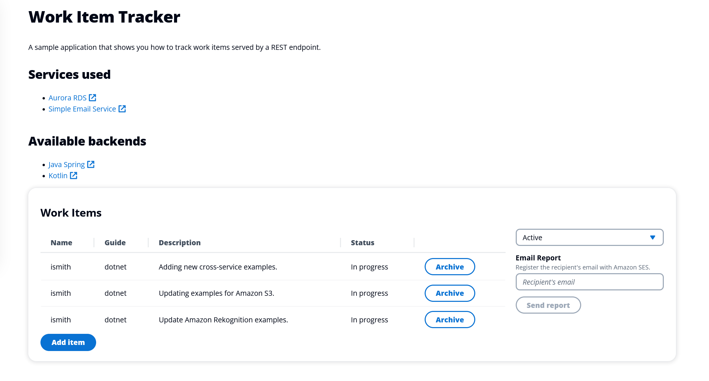
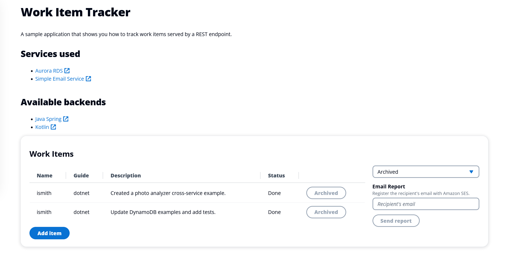
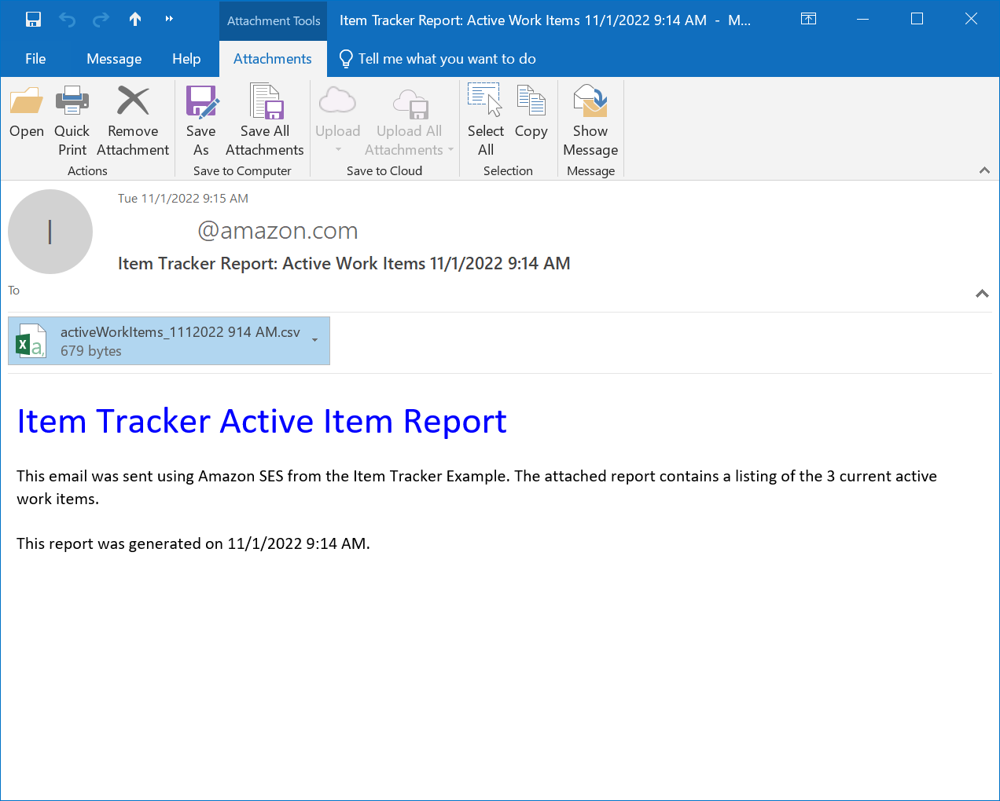

# Track work items in an Aurora Serverless database with the SDK for .NET (v3)

## Overview

This example shows you how to use the AWS SDK for .NET (v3) to create a REST service that lets you do the following:

- Read, write, and update work items that are stored in an Amazon Aurora Serverless database.
- Use Amazon Simple Email Service (Amazon SES) to send email reports of work items.

## ⚠️ Important

- Running this code might result in charges to your AWS account.
- Running the tests might result in charges to your AWS account.
- We recommend that you grant your code least privilege. At most, grant only the minimum permissions required to perform the task. For more information, see [Grant least privilege](https://docs.aws.amazon.com/IAM/latest/UserGuide/best-practices.html#grant-least-privilege).
- This code is not tested in every AWS Region. For more information, see [AWS Regional Services](https://aws.amazon.com/about-aws/global-infrastructure/regional-product-services).

## Prerequisites

To run the code in this example, you need the following:

+ An AWS account.
+ .NET 6
+ To set up your development environment,
see [Setting up your AWS SDK for .NET environment](https://docs.aws.amazon.com/sdk-for-net/v3/developer-guide/net-dg-setup.html). 

## Create the resources

Using the AWS AWS Cloud Development Kit (AWS CDK), you can set up the resources required for this example. For more information, see [CDK instructions](https://github.com/awsdocs/aws-doc-sdk-examples/tree/main/resources/cdk/aurora_serverless_app/README.md).

### Create the database table

After you have created the Aurora DB cluster and database, create a table to contain work items. You can do this by using either the AWS Command Line Interface (AWS CLI) or the AWS Management Console.
AWS CLI

Use the AWS CLI to create the work_items table by running the following command at a command prompt. Before you run, replace the following values with the output from the CloudFormation setup script:

- **CLUSTER_ARN** — Replace with the ARN of the Aurora DB cluster, such as `arn:aws:rds:us-west-2:123456789012:cluster:doc-example-aurora-app-docexampleauroraappcluster-15xfvaEXAMPLE`.
- **SECRET_ARN** — Replace with the ARN of the secret that contains your database credentials, such as `arn:aws:secretsmanager:us-west-2:123456789012:secret:docexampleauroraappsecret8B-xI1R8EXAMPLE-hfDaaj`.
- **DATABASE** — Replace with the name of the database, such as `auroraappdb`.

Tip: The caret ^ is the line continuation character for a Windows command prompt. If you run this command on another platform, replace the caret with the line continuation character for that platform.

```
aws rds-data execute-statement ^
    --resource-arn "CLUSTER_ARN" ^
    --database "DATABASE" ^
    --secret-arn "SECRET_ARN" ^
    --sql "CREATE TABLE items (id VARCHAR(45), description VARCHAR(400), guide VARCHAR(45), status VARCHAR(400), name VARCHAR(45), archived BOOLEAN);"
```

### Verified email address

To email reports from the app, you must register at least one email address with Amazon SES. This verified email is specified as the sender for emailed reports.

1. In a browser, navigate to the Amazon SES console.
1. If necessary, select your AWS Region.
1. Select Verified identities.
1. Select Create identity.
1. Select Email address.
1. Enter an email address you own.
1. Select Create identity.
1. You will receive an email from Amazon Web Services that contains instructions on how to verify the email with Amazon SES. Follow the instructions in the email to complete verification.

Tip: For this example, you can use the same email account for both the sender and the recipient.

## Build the code

This application has two parts: a user interface that uses React.js and a
RESTful API created with C# and .NET 6. The React user interface is a single-page
application (SPA) that interacts with the C# RESTful API by making `GET`, `PUT`, and
`POST` requests.

### RESTful API

The API uses the [AmazonRDSDataServiceClient](https://docs.aws.amazon.com/sdkfornet/v3/apidocs/items/RDSDataService/TRDSDataServiceClient.html)
object to perform CRUD operations on an Aurora Serverless database. The API
returns JSON data in an HTTP response, as shown in the following illustration.


#### Configure the application
Before you run the .NET application, set the configuration values for your Aurora serverless
database, and your verified email address in the `appsettings.json` file. Alternatively, add an `appsettings.development.json` file
with your local settings.

#### Run the application
After the example compiles, you can run it from the command line. To do so,
navigate to the folder that contains the .csproj file and run the following
command:

```
dotnet run
```

Alternatively, you can run the example from within your IDE.

#### Tests

⚠️ Running the tests might result in charges to your AWS account.

The solution includes a test project. To run the tests, navigate to the folder that contains the test project and then issue the following command:

```
dotnet test
```

Alternatively, you can open the example solution and use the Visual Studio Test Runner to run the tests.

### Aurora Item Tracker user interface
To start the React web application, you can download files from the following GitHub repository. Included in this repository are instructions on how to set up the project. Click the following link to access the GitHub location [Item Tracker web client](https://github.com/awsdocs/aws-doc-sdk-examples/tree/main/resources/clients/react/item-tracker/README.md).  

When the web application is running, you will see something like the following.


#### Use the React web application

A user can perform these tasks using the web application:

1. View all items
1. View active items only
1. View archived items only
1. Add a new item
1. Change an active item into an archived item.
1. Send a report as an email attachment

The web application displays *active*, *archived*, or all items. For example, the following illustration shows the React application displaying active data.



Here is the React application displaying archived data.



The user can insert a new item into the **items** table from the user interface in the React front end application. In the following image, you can see the new item form. 


The user can enter an email recipient in the **Email** text field and choose **Send Report**. The recipient will get an email something like the following.



⚠️ **Important!** You must update the email **sender** address with a verified email address. Otherwise, the email is not sent. For more information, see [Verifying email addresses in Amazon SES](https://docs.aws.amazon.com/ses/latest/DeveloperGuide/verify-email-addresses.html).       

Active items are selected from the database and used to dynamically create a .csv document. Then, the application uses **Amazon SES** to email the document to the email address entered. The following image shows an example of a report.


## Delete the resources

To avoid charges, delete all the resources that you created for this tutorial.

If you created the resources using the CDK script provided, you can delete the resources by running the script with the following command:

```
cdk destroy
```

If you created your resources through the AWS Management Console, or modified them by running the app, you must use the console to delete them.

**Note**: By running the app, you modified the table, so you must delete these resources manually through the console before you can delete the stack.

## Next steps

Congratulations! You have created and run a RESTful C# API that manages data in an Amazon Aurora serverless database, explored the database through the React frontend web application, and sent reports using Amazon SES.

## Additional resources

- [Amazon Aurora User Guide](https://docs.aws.amazon.com/AmazonRDS/latest/AuroraUserGuide/CHAP_AuroraOverview.html)
- [Amazon RDS User Guide](https://docs.aws.amazon.com/AmazonRDS/latest/UserGuide/Welcome.html)
- [Amazon SES Developer Guide](https://docs.aws.amazon.com/ses/latest/dg/Welcome.html)
- [RDS Data Service API Reference](https://docs.aws.amazon.com/rdsdataservice/latest/APIReference/Welcome.html)
- [Amazon SES API Reference](https://docs.aws.amazon.com/ses/latest/APIReference/Welcome.html)
- [Amazon RDS Data Service .NET API Reference](https://docs.aws.amazon.com/sdkfornet/v3/apidocs/items/RDSDataService/NRDSDataService.html)
- [Amazon SES .NET API Reference](https://docs.aws.amazon.com/sdkfornet/v3/apidocs/items/SimpleEmail/NSimpleEmail.html)

For more AWS multiservice examples, see
[usecases](https://github.com/awsdocs/aws-doc-sdk-examples/tree/master/dotnetv3/cross-service).


