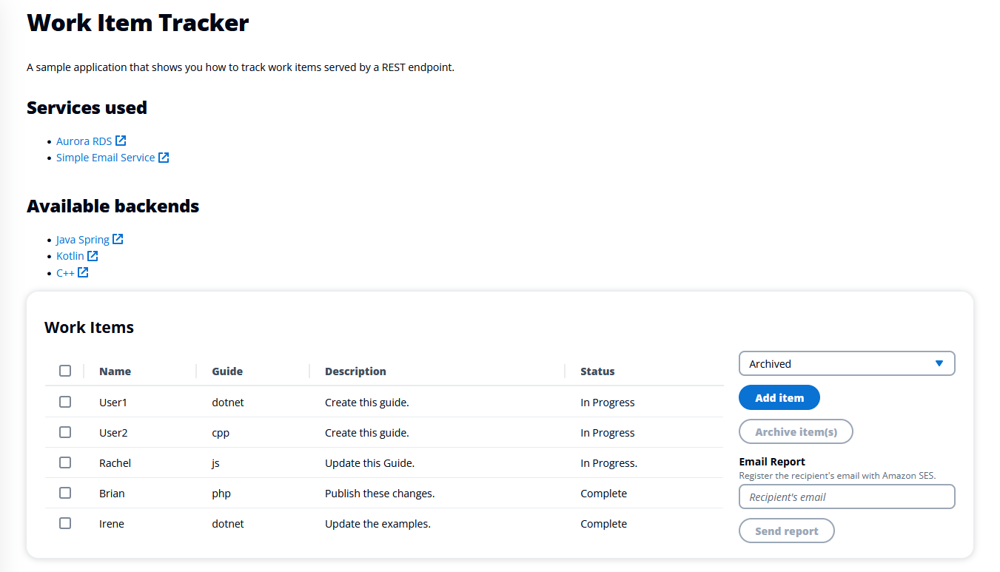

# Track work items in a DynamoDB table with the SDK for .NET (v3)

## Overview

This example shows you how to use the AWS SDK for .NET (v3) to create a REST service that lets you do the following:

- Read, write, and update work items that are stored in an Amazon DynamoDB table.
- Use Amazon Simple Email Service (Amazon SES) to send email reports of work items.

## ⚠️ Important

- Running this code might result in charges to your AWS account.
- Running the tests might result in charges to your AWS account.
- We recommend that you grant your code least privilege. At most, grant only the minimum permissions required to perform the task. For more information, see [Grant least privilege](https://docs.aws.amazon.com/IAM/latest/UserGuide/best-practices.html#grant-least-privilege).
- This code is not tested in every AWS Region. For more information, see [AWS Regional Services](https://aws.amazon.com/about-aws/global-infrastructure/regional-product-services).

## Prerequisites

To run the code in this example, you need the following:

+ An AWS account.
+ .NET 6
+ To set up your development environment,
see [Setting up your AWS SDK for .NET environment](https://docs.aws.amazon.com/sdk-for-net/v3/developer-guide/net-dg-setup.html). 

## Create the resources

Follow the instructions in the
[README for the DynamoDB application](https://github.com/awsdocs/aws-doc-sdk-examples/tree/main/resources/cdk/dynamodb-item-tracker/README.md).
to use the AWS Cloud Development Kit (AWS CDK) or AWS Command Line Interface
(AWS CLI) to create and manage the table resource used in this example.

### Verified email address

To email reports from the app, you must register at least one email address with Amazon SES. This verified email is specified as the sender for emailed reports.

1. In a browser, navigate to the Amazon SES console.
1. If necessary, select your AWS Region.
1. Select Verified identities.
1. Select Create identity.
1. Select Email address.
1. Enter an email address that you own.
1. Select Create identity.
1. You will receive an email from Amazon Web Services that contains instructions on how to verify the email with Amazon SES. Follow the instructions in the email to complete verification.

Tip: For this example, you can use the same email account for both the sender and the recipient.

## Build the code

This application has two parts: a user interface that uses React and a
RESTful API created with C# and .NET 6. The React user interface is a single-page
application (SPA) that interacts with the C# RESTful API by making `GET`, `PUT`, and
`POST` requests.

### RESTful API

The API uses the [DynamoDBContext](https://docs.aws.amazon.com/sdkfornet/v3/apidocs/items/DynamoDBv2/TDynamoDBContext.html)
object to perform CRUD operations on a DynamoDB table. The API
returns JSON data in an HTTP response, as shown in the following illustration.


#### Configure the application
Before you run the .NET application, set the configuration values for your DynamoDB table, 
and your verified sender email address in the `appsettings.json` file. Alternatively, add an `appsettings.development.json` file
with your local settings.

#### Run the application
After the example compiles, you can run it from the command line. To do so,
navigate to the folder that contains the .csproj file and run the following
command:

```
dotnet run
```

Alternatively, you can run the example from within your IDE.

### DynamoDB Item Tracker user interface
The .NET application is intended to be used with the [Item Tracker web client](https://github.com/awsdocs/aws-doc-sdk-examples/tree/main/resources/clients/react/elwing).
Follow the instructions in the [README](https://github.com/awsdocs/aws-doc-sdk-examples/tree/main/resources/clients/react/elwing/README.md) to set up and run this client.
The client expects the API to be available at `http://localhost:8080/api`, which can be configured in `launchSettings.json`.

When the web application is running, you will see something like the following.


#### Use the React web application

A user can perform the following tasks using the web application:

1. View all items.
1. View active items only.
1. View archived items only.
1. Add a new item.
1. Change an active item into an archived item.
1. Send a report as an email attachment.

The web application displays active, archived, or all items. For example, the following illustration shows the React application displaying active data.


Here is the React application displaying archived data.



The user can insert a new item into the work item table from the user interface in the React front end application. In the following image, you can see the new item form. 


The user can enter an email recipient in the **Email** text field and choose **Send Report**. The recipient will get an email like the following.


Active items are selected from the database and used to dynamically create a .csv document. Then, the application uses **Amazon SES** to email the document to the email address entered. The following image shows an example of a report.


## Delete the resources

To avoid charges, delete all the resources that you created for this tutorial.
Follow the instructions in the [Destroying resources](../../../resources/cdk/dynamodb-item-tracker/README.md#destroy-resources)
section of the README for the DynamoDB sample application.

## Next steps

Congratulations! You have used the AWS SDK for .NET (v3) to create a REST service that manages data in an Amazon DynamoDB table, explored the database through the React frontend web application, and sent reports using Amazon SES.

## Additional resources

- [Amazon DynamoDB Developer Guide](http://docs.aws.amazon.com/amazondynamodb/latest/developerguide/)
- [Amazon SES Developer Guide](https://docs.aws.amazon.com/ses/latest/dg/Welcome.html)
- [DynamoDB API Reference](http://docs.aws.amazon.com/amazondynamodb/latest/APIReference/)
- [Amazon SES API Reference](https://docs.aws.amazon.com/ses/latest/APIReference/Welcome.html)
- [Amazon DynamoDB .NET API Reference](https://docs.aws.amazon.com/sdkfornet/v3/apidocs/items/DynamoDBv2/TDynamoDBClient.html)
- [Amazon SES .NET API Reference](https://docs.aws.amazon.com/sdkfornet/v3/apidocs/items/SimpleEmail/NSimpleEmail.html)

For more AWS multiservice examples, see
[cross-service](https://github.com/awsdocs/aws-doc-sdk-examples/tree/master/dotnetv3/cross-service).


