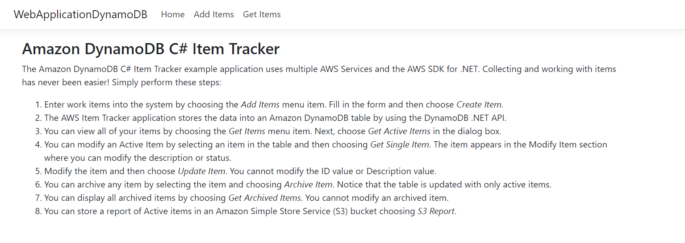
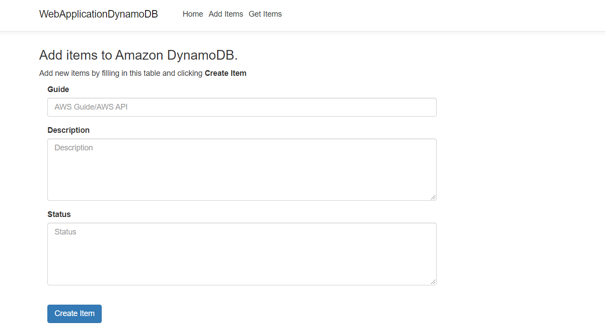
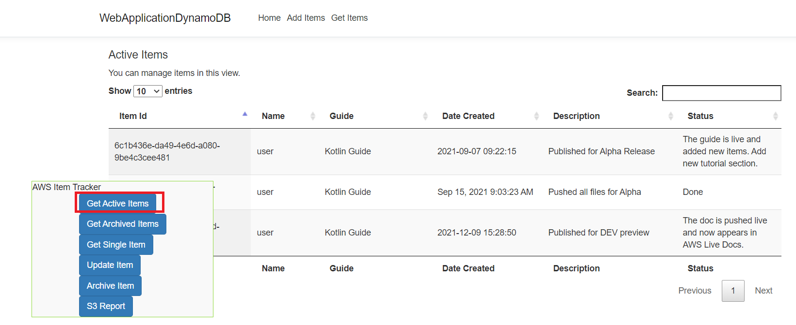
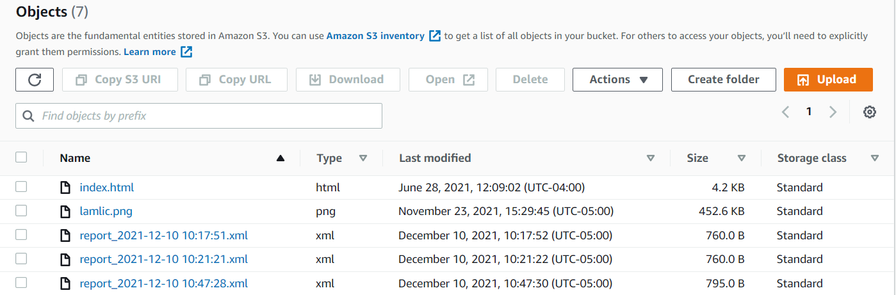
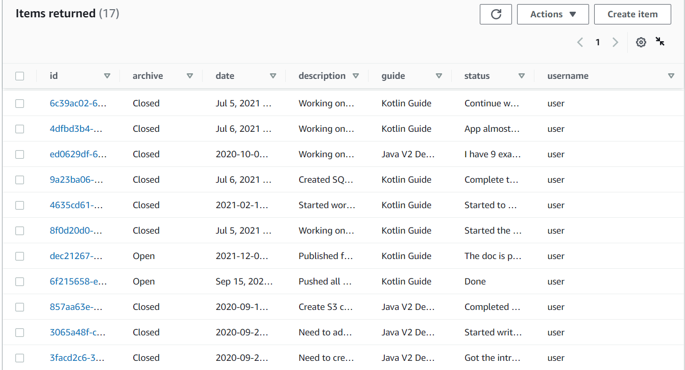
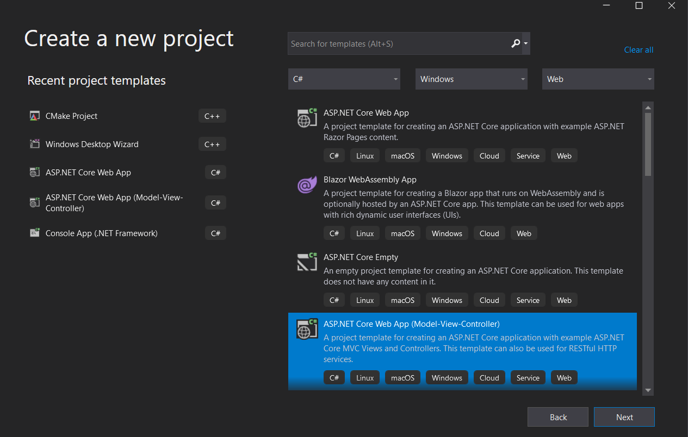
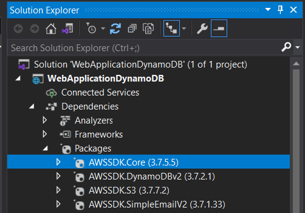
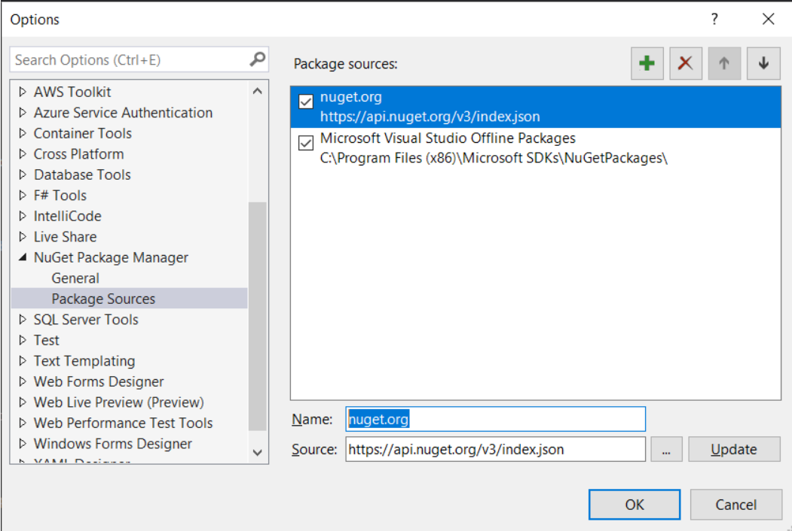
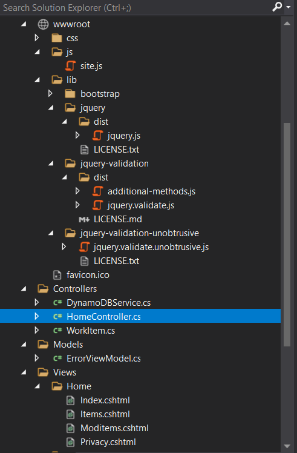
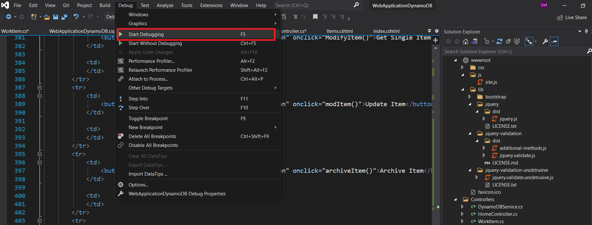

#  Create an Amazon DynamoDB web application by using the AWS SDK for .NET

## Purpose

You can develop a dynamic web application that tracks and reports on work items by using the following AWS services:

+ Amazon DynamoDB to store the data
+ Amazon Simple Storage Service (Amazon S3) to store reports

**Note:** In this tutorial, the AWS SDK for .NET is used to access Amazon S3 and DynamoDB.

The application you create is named **DynamoDB Item Tracker**. It uses .NET API operations to build a model, different views, and a controller. For more information, see [Understanding Models, Views, and Controllers (C#)](https://docs.microsoft.com/en-us/aspnet/mvc/overview/older-versions-1/overview/understanding-models-views-and-controllers-cs).

**Note:** All of the .NET code required to complete this tutorial is located in this GitHub repository. You can also copy the code from this tutorial.  

#### Topics

+ Prerequisites
+ Understand the item tracker application
+ Create a Visual Studio project 
+ Add the AWS Packages
+ Create the .NET  code
+ Create the HTML files
+ Run the application

## Prerequisites

To complete the tutorial, you need the following:

- An AWS account. For more information, see the [AWS SDKS and Tools Reference Guide](https://docs.aws.amazon.com/sdkref/latest/guide/overview.html).
- A .NET IDE. This tutorial uses Microsoft Visual Studio.
- .NET Core 5.0 or later.
- AWS SDK for .NET 3.5 or later.
- You must also set up your .NET developer environment. For more information, see [Setting up your AWS SDK for .NET environment](https://docs.aws.amazon.com/sdk-for-net/v3/developer-guide/net-dg-setup.html). 

### ⚠️ Important

+ The AWS services used by this application are included in the [AWS Free Tier](https://aws.amazon.com/free/?all-free-tier.sort-by=item.additionalFields.SortRank&all-free-tier.sort-order=asc).
+  This code has not been tested in all AWS Regions. Some AWS services are available only in specific Regions. For more information, see [AWS Regional Services](https://aws.amazon.com/about-aws/global-infrastructure/regional-product-services). 
+ Running this code might result in charges to your AWS account. 
+ Be sure to delete all of the resources that you create while going through this tutorial so that you won't be charged.

### Creating the resources

Create a DynamoDB table named **Work** that contains a partition key named **id**. For more information, see [Create a Table](https://docs.aws.amazon.com/amazondynamodb/latest/developerguide/getting-started-step-1.html). 

## Understand the DynamoDB Item Tracker application

The **DynamoDB Item Tracker** application uses a model that is based on a work item. The model contains the following attributes:

+ **date** - The start date of the item.
+ **description** - The description of the item.
+ **guide** - The deliverable that this item has an impact on.
+ **username** - The person who performs the work item.
+ **status** - The status of the item.
+ **archive** - Whether this item is completed or is still being worked on.

The following figure shows the **Home** page.



#### Application functionality
A user can perform the following tasks in the **DynamoDB Item Tracker** application:

+ Enter an item
+ View all active items
+ View archived items that are complete
+ Convert an active item to an archived item
+ Modify active items
+ Store an XML report in an S3 bucket

The following figure shows the new item section.



A user can retrieve *active* or *archive* items. For example, a user can choose **Get Active Items** to get a dataset that's retrieved from the DynamoDB **Work** table and displayed in the web application.



The user can choose **S3 Report**. Active items are queried from the **Work** table and then the application uses the Amazon S3 .NET API to store the report in an S3 bucket, as shown in the following illustration. 



#### Work table
The DynamoDB table is named **Work** and contains the following fields:

+ **id** - Represents the key.
+ **date** - Specifies the date the item was created.
+ **description** - A value that describes the item.
+ **guide** - A value that represents the deliverable being worked on.
+ **status** - A value that describes the status.
+ **username** - A value that represents the user who entered the item.
+ **archive** - A value that represents whether this is an active or archive item.

The following figure shows the **Work** table.



## Create a Visual Studio project

Create a Net Web App project using Visual Studio. Name it **WebApplicationDynamoDB**.



Perform the following steps. 

1. In Visual Studio, choose **File**, **New**, **Project**.

2. In the New Project dialog box, choose **ASP .NET Core Web App**.

3. Choose **Next**.

4. In the **Project Name** field, enter **WebApplicationDynamoDB**.  

5. Choose **Next**.

6. Make sure to set the Target Framework to .NET Core 5.0 (or make sure that the current version of .NET Core is selected). 

6. Choose **Create**.
 
## Add the AWS packages

At this point, you have a new project. You must add the required AWS packages to your project. They are **AWSSDK.Core**, **AWSSDK.DynamoDB**, and **AWSSDK.S3**, as shown in the following illustration.



After you add the packages, you can use the AWS SDK for .NET in your project. 

1. In the Solution Explorer, choose or right-click the project name, **WebApplicationDynamoDB**.

2. Select **Manage NuGet Packages...**.

3. When the NuGet packages dialog opens, choose **Browse**.

4. In the **Search** field, enter **AWSSDK.Core**.  

5. Select the **AWSSDK.Core** package from the list. Then, in the right pane, choose **Install**.

**Note**: Repeat this process for the **AWSSDK.DynamoDB** and **AWSSDK.S3** packages. 

**Tip**: If you don't see the AWS packages after you add them, confirm that your NuGet is properly configured to use **nuget.org**. The following illustration shows **nuget.org** with source **https://api.nuget.org/v3/index.json** selected under the **Package Sources** for **NuGet Package Manager**. 



## Create the classes

By default, most of the .NET classes that you use to build this AWS application are created. Notice the project structure of your application.



 You work with these .NET classes:

+ **HomeController** - Used as the .NET controller that handles HTTP requests. 
+ **DynamoDBService** - Used to invoke DynamoDB operations by using the DynamoDB .NET API. This also uses the Amazon S3 API to store reports in an S3 bucket. You need to create this class in the same namespace as the **HomeController**. 
+ **WorkItem** - Used as the model for the application. 

**Note**: You need to add the **DynamoDBService** and  **WorkItem** classes to your project. 

### HomeController class

The following C# code represents the **HomeController** class. Because the Async version of the AWS SDK for .NET is used, notice that the controller methods must use **async** keywords and the return values are defined using **Task**. 

```cs
   using System.Diagnostics;
   using System.Threading.Tasks;
   using Microsoft.AspNetCore.Mvc;
   using Microsoft.Extensions.Logging;
   using WebApplicationDynamoDB.Models;

   namespace WebApplicationDynamoDB.Controllers
   {
    public class HomeController : Controller
    {
        private readonly ILogger<HomeController> _logger;

        public HomeController(ILogger<HomeController> logger)
        {
            _logger = logger;
        }

        [HttpPost]
        public async Task<ActionResult> GetRecord(string id)
        {
            var dbService = new DynamoDBService();
            var xml = await dbService.GetSingleItem(id);
            return Content(xml);
        }

        [HttpPost]
        public async Task<ActionResult> ModRecord(string id, string status)
        {
            var dbService = new DynamoDBService();
            var val = await dbService.ModStatus(id, status);
            return Content(val);
        }

        [HttpPost]
        public async Task<ActionResult> Archive(string id)
        {
            var dbService = new DynamoDBService();
            dbService.ArchiveItemEC(id);
            return Content(id);
        }

        [HttpPost]
        public async Task<ActionResult> AddRecord(string guide, string description, string status)
        {
            var dbService = new DynamoDBService();
            var value = await dbService.AddNewRecord(description, guide, status);
            return Content(value);
        }

        [HttpGet]
        public async Task<ActionResult> PutReport()
        {
            var dbService = new DynamoDBService();
            dbService.S3Report();
            return Content("Report was successfully sent to Amazon S3");
        }

        [HttpGet]
        public async Task<ActionResult> GetActiveItems()
        {
           var dbService = new DynamoDBService();
           var xml = await dbService.GetItems("Open");
           return Content(xml);
        }

        [HttpGet]
        public async Task<ActionResult> GetClosedItems()
        {
            var dbService = new DynamoDBService();
            var xml = await dbService.GetItems("Closed");
            return Content(xml);
        }

        public IActionResult Index()
        {
            return View();
        }

        public IActionResult Privacy()
        {
            return View();
        }

        public IActionResult Items()
        {
            return View();
        }

        public IActionResult Moditems()
        {
            return View();
        }

        [ResponseCache(Duration = 0, Location = ResponseCacheLocation.None, NoStore = true)]
        public IActionResult Error()
        {
            return View(new ErrorViewModel { RequestId = Activity.Current?.Id ?? HttpContext.TraceIdentifier });
        }
    }
  }


```

### Create DynamoDBService class

The **DynamoDBService** class uses the AWS SDK for .NET to interact with the **Work** table. It adds new items, updates items, and performs queries. In the following code example, notice the use of an **ExpressionAttributeValues** object. This object is used to query either Open or Closed items. For example, in the **GetActiveItems** method, only Open items are retrieved from the Amazon DynamoDB table. 

```cs
   using System;
   using System.Collections.Generic;
   using System.Threading.Tasks;
   using System.Xml;
   using Amazon;
   using Amazon.DynamoDBv2;
   using Amazon.DynamoDBv2.DocumentModel;
   using Amazon.DynamoDBv2.Model;
   using Amazon.S3;
   using Amazon.S3.Model;

   namespace WebApplicationDynamoDB.Controllers
   {
    public class DynamoDBService
    {
        public async void ArchiveItemEC(string id)
        {
            var client = new AmazonDynamoDBClient(RegionEndpoint.USEast1);
            await UpdateRecord(client, id);
        }

        public async void S3Report()
        {
            var client = new AmazonDynamoDBClient(RegionEndpoint.USEast1);
            var xml = await GetActiveItems(client, "Open");
            await UploadObject(xml);
        }

        public async Task<string> GetSingleItem(string id)
        {
            var client = new AmazonDynamoDBClient();
            var xml = await GetItemAsync(client, id);
            return xml;
        }

        public async Task<string> ModSingleItem(string id)
        {
            var client = new AmazonDynamoDBClient();
            var xml = await GetItemAsync(client, id);
            return xml;
        }

        public async Task<string> ModStatus(string id, string status)
        {
            var client = new AmazonDynamoDBClient(RegionEndpoint.USWest2);
            await UpdateStatus(client, id, status);
            return "Item " + id + " was succefully updated";
        }

        public async Task UpdateStatus(AmazonDynamoDBClient client, string id, string status)
        {
            Table workTable = Table.LoadTable(client, "Work");
            var myGuid = Guid.NewGuid().ToString();

            // Add the new record to the Amazon DynamoDB table.
            var record = new Document();
            record["id"] = id;
            record["status"] = status;
            await workTable.UpdateItemAsync(record);
        }

        public async Task<string> GetItems(string status)
        {
            var client = new AmazonDynamoDBClient(RegionEndpoint.USEast1);
            var xml = await GetActiveItems(client, status);
            return xml;
        }

        public async Task<string> AddNewRecord(string description, string guide, string status)
        {
            var client = new AmazonDynamoDBClient(RegionEndpoint.USEast1);
            var guid = await InsertRecord(client, description, guide, status);
            return guid;
        }

        public async Task UploadObject(string report)
        {
            var bucketName = "<Enter your bucket name>";
            var s3Client = new AmazonS3Client(RegionEndpoint.USEast1);

            // Make sure that the report name is unique.
            var reportName = "report_" + DateTime.Now.ToString("yyyy-MM-dd HH:mm:ss") + ".xml";

            var putRequest = new PutObjectRequest
            {
                BucketName = bucketName,
                Key = reportName,
                ContentBody = report,
                ContentType = "text/xml",
            };

            putRequest.Metadata.Add("x-amz-meta-title", "someTitle");
            PutObjectResponse response = await s3Client.PutObjectAsync(putRequest);
        }

        public async Task UpdateRecord(AmazonDynamoDBClient client, string id)
        {
            Table workTable = Table.LoadTable(client, "Work");
            var myGuid = Guid.NewGuid().ToString();

            // Add the new record to the DynamoDB table.
            var record = new Document();
            record["id"] = id;
            record["archive"] = "Close";
            await workTable.UpdateItemAsync(record);
        }

        public async Task<string> GetActiveItems(AmazonDynamoDBClient client, string status)
        {
            var request = new ScanRequest
            {
                TableName = "Work",
                ExpressionAttributeValues = new Dictionary<string, AttributeValue>
                {
                    {
                        ":val", new AttributeValue
                     {
                         S = status
                     }
                    }
                },
                ExpressionAttributeNames = new Dictionary<string, string>
                {
                    {
                        "#archive", "archive"
                    }
                },
                FilterExpression = "#archive = :val",
            };

            var response = await client.ScanAsync(request);
            WorkItem workItem;
            List<WorkItem> workList = new List<WorkItem>();
            foreach (Dictionary<string, AttributeValue> item
                     in response.Items)
            {
                Console.WriteLine("\nScanThreadTableUsePaging - printing.....");
                var index = 0;

                workItem = new WorkItem();
                foreach (KeyValuePair<string, AttributeValue> kvp in item)
                {
                    string attributeName = kvp.Key;
                    AttributeValue value = kvp.Value;

                    // Populate the WorkItem instance.
                    switch (index)
                    {
                        case 0:
                            workItem.Date = value.S;
                            break;

                        case 1:
                            workItem.Status = value.S;
                            break;

                        case 2:
                            workItem.Name = value.S;
                            break;

                        case 3:
                            break;

                        case 4:
                            workItem.Description = value.S;
                            break;

                        case 5:
                            workItem.Id = value.S;
                            break;

                        case 6:
                            workItem.Guide = value.S;
                            break;
                    }

                    index++;
                }

                // Push the WorkItem to the collection.
                workList.Add(workItem);
            }

            var xml = GenerateXML(workList);
            return xml;
        }

        // Convert the list to XML to pass back to the view.
        private string GenerateXML(List<WorkItem> workList)
        {
            XmlDocument doc = new XmlDocument();
            XmlNode docNode = doc.CreateXmlDeclaration("1.0", "UTF-8", null);
            doc.AppendChild(docNode);

            XmlNode subsNode = doc.CreateElement("Items");
            doc.AppendChild(subsNode);

            // Iterate through the collection.
            foreach (WorkItem item in workList)
            {
                XmlNode subNode = doc.CreateElement("Item");
                subsNode.AppendChild(subNode);

                XmlNode id = doc.CreateElement("Id");
                id.AppendChild(doc.CreateTextNode(item.Id));
                subNode.AppendChild(id);

                XmlNode name = doc.CreateElement("Name");
                name.AppendChild(doc.CreateTextNode(item.Name));
                subNode.AppendChild(name);

                XmlNode date = doc.CreateElement("Date");
                date.AppendChild(doc.CreateTextNode(item.Date));
                subNode.AppendChild(date);

                XmlNode description = doc.CreateElement("Description");
                description.AppendChild(doc.CreateTextNode(item.Description));
                subNode.AppendChild(description);

                XmlNode guide = doc.CreateElement("Guide");
                guide.AppendChild(doc.CreateTextNode(item.Guide));
                subNode.AppendChild(guide);

                XmlNode status = doc.CreateElement("Status");
                status.AppendChild(doc.CreateTextNode(item.Status));
                subNode.AppendChild(status);
            }

            return doc.OuterXml;
        }

        public async Task<string> InsertRecord(IAmazonDynamoDB client, string description, string guide, string status)
        {
            Table workTable = Table.LoadTable(client, "Work");
            var myGuid = Guid.NewGuid().ToString();

            // Add the new record to the Amazon DynamoDB table.
            var record = new Document();
            record["id"] = myGuid;
            record["archive"] = "Open";
            record["date"] = DateTime.Now.ToString("yyyy-MM-dd HH:mm:ss");
            record["description"] = description;
            record["guide"] = guide;
            record["status"] = status;
            record["username"] = "user";

            await workTable.PutItemAsync(record);
            return myGuid;
        }

        public async Task<string> GetItemAsync(IAmazonDynamoDB client, string id)
        {
            var response = await client.QueryAsync(new QueryRequest
            {
                TableName = "Work",
                KeyConditionExpression = "id = :v_Id",
                ExpressionAttributeValues = new Dictionary<string, AttributeValue>
               {
                {
                ":v_Id",
                new AttributeValue
                {
                  S = id,
                }
                },
               },
            });

            WorkItem workItem;
            List<WorkItem> workList = new List<WorkItem>();
            foreach (Dictionary<string, AttributeValue> item
                     in response.Items)
            {
                Console.WriteLine("\nScanThreadTableUsePaging - printing.....");
                var index = 0;
                workItem = new WorkItem();
                foreach (KeyValuePair<string, AttributeValue> kvp in item)
                {
                    string attributeName = kvp.Key;
                    AttributeValue value = kvp.Value;

                    // Populate the WorkItem instance.
                    switch (index)
                    {
                        case 0:
                            workItem.Date = value.S;
                            break;

                        case 1:
                            workItem.Status = value.S;
                            break;

                        case 2:
                            workItem.Name = value.S;
                            break;

                        case 3:
                            break;

                        case 4:
                            workItem.Description = value.S;
                            break;

                        case 5:
                            workItem.Id = value.S;
                            break;

                        case 6:
                            workItem.Guide = value.S;
                            break;
                    }

                    index++;
                }

                // Push the WorkItem to the collection.
                workList.Add(workItem);
            }

            var xml = GenerateXML(workList);
            return xml;
        }
      }
    }
```
**Note**:Make sure to enter your S3 bucket name in the **bucketName** variable. 

### Create the WorkItem class

The following C# code represents the **WorkItem** class.

```cs
  using System;

   namespace WebApplicationDynamoDB.Controllers
   {
    public class WorkItem
    {
        public string Id { get; set; }

        public string Name { get; set; }

        public string Guide { get; set; }

        public string Date { get; set; }

        public string Description { get; set; }

        public string Status { get; set; }
     }
   }

 ```

## Create the HTML files

At this point, you have created all of the C# files required for the **DynamoDB Item Tracker** application. Now, create the HTML files that are required for the application's graphical user interface (GUI). 

+ **Index.cshtml**
+ **Items.cshtml**
+ **ModItems.html**

The **index.cshtml** file is used as the application's home view. The **Items.cshtml** file represents the view for adding an item to the system. The **ModItems.html** file is used to view and modify the items.

#### Index.cshtml

The following HTML code represents the **Index.cshtml** file. This file represents the application's home view.

```html
    @{
    ViewData["Title"] = "Home Page";
}

   <div class="container">

    <h3>Amazon DynamoDB C# Item Tracker</h3>
    <p>The Amazon DynamoDB C# Item Tracker example application uses multiple AWS services and the AWS SDK for .NET. Collecting and working with items has never been easier! Perform the following steps:<p>
        <ol>
            <li>Enter work items into the system by choosing the <i>Add Items</i> menu item. Fill in the form and then choose <i>Create Item</i>.</li>
            <li>The AWS Item Tracker application stores the data in an Amazon DynamoDB table by using the DynamoDB .NET API.</li>
            <li>You can view all of your items by choosing the <i>Get Items</i> menu item. Next, choose <i>Get Active Items</i> in the dialog box.</li>
            <li>You can modify an Active Item by selecting an item in the table and then choosing <i>Get Single Item</i>. The item appears in the Modify Item section where you can modify the description or status.</li>
            <li>Modify the item and then choose <i>Update Item</i>. You cannot modify the ID value or Description value.</li>
            <li>You can archive any item by selecting the item and choosing <i>Archive Item</i>. Notice that the table is updated with only active items.</li>
            <li>You can display all archived items by choosing <i>Get Archived Items</i>. You cannot modify an archived item.</li>
            <li>You can store a report of Active items in an Amazon Simple Storagee Service (Amazon S3) bucket choosing <i>S3 Report</i>.</li>
        </ol>
    <div>
```

#### Items.cshtml

The following code represents the **Items.cshtml** file that lets users add new items.

```html
   <head>
    <script src="https://code.jquery.com/jquery-1.11.1.min.js"></script>
    <script src="https://code.jquery.com/ui/1.11.1/jquery-ui.min.js"></script>
    <script src="https://cdn.datatables.net/v/dt/dt-1.10.20/datatables.min.js"></script>
    <link rel="stylesheet" href="https://maxcdn.bootstrapcdn.com/bootstrap/3.3.7/css/bootstrap.min.css" />
    <link rel="stylesheet" href="https://cdn.datatables.net/v/dt/dt-1.10.20/datatables.min.css" />
   </head>

  <script>

    $(function () {

        $("#SendButton").click(function ($e) {

            var guide = $('#guide').val();
            var description = $('#description').val();
            var status = $('#status').val();

            //var description = $("textarea#description").val();
            if (description.length > 350) {
                alert("Description has too many characters");
                return;
            }

            //var status = $("textarea#status").val();
            if (status.length > 350) {
                alert("Status has too many characters");
                return;
            }

            $.ajax('AddRecord', {
                type: 'POST',  // http GET method
                data: 'guide=' + guide + '&description=' + description + '&status=' + status,
                success: function (data, status, xhr) {

                    alert("You have successfully added item " + data)
                },
                error: function (jqXhr, textStatus, errorMessage) {
                    $('p').append('Error' + errorMessage);
                }
            });

        });// END of the Send button click
    });
   </script>


   <h3>Add items to Amazon DynamoDB</h3>
   <p>Add new items by filling in this table and choosing <b>Create Item</b>.</p>

   <div class="col-lg-8 mx-auto">
             
              <div class="control-group">
                  <div class="form-group floating-label-form-group controls mb-0 pb-2">
                        <label>Guide</label>
                        <input class="form-control" id="guide" type="guide" placeholder="AWS Guide/AWS API" required="required" data-validation-required-message="Please enter the AWS guide.">
                        <p class="help-block text-danger"></p>
                    </div>
                </div>
                <div class="control-group">
                    <div class="form-group floating-label-form-group controls mb-0 pb-2">
                        <label>Description</label>
                        <textarea class="form-control" id="description" rows="5" placeholder="Description" required="required" data-validation-required-message="Please enter a description."></textarea>
                        <p class="help-block text-danger"></p>
                    </div>
                </div>
                <div class="control-group">
                    <div class="form-group floating-label-form-group controls mb-0 pb-2">
                        <label>Status</label>
                        <textarea class="form-control" id="status" rows="5" placeholder="Status" required="required" data-validation-required-message="Please enter the status."></textarea>
                        <p class="help-block text-danger"></p>
                    </div>
                </div>
                <br>
                <button type="submit" class="btn btn-primary btn-xl" id="SendButton">Create Item</button>
          </div>
```

#### ModItems.html

The following code represents the **ModItems.html** file. This file lets users modify items and send reports.

```html
	@{
    ViewData["Title"] = "Home Page";
   }

   <head>
     <script src="https://code.jquery.com/jquery-1.11.1.min.js"></script>
     <script src="https://code.jquery.com/ui/1.11.1/jquery-ui.min.js"></script>
     <script src="https://cdn.datatables.net/v/dt/dt-1.10.20/datatables.min.js"></script>
     <link rel="stylesheet" href="https://maxcdn.bootstrapcdn.com/bootstrap/3.3.7/css/bootstrap.min.css" />
     <link rel="stylesheet" href="https://cdn.datatables.net/v/dt/dt-1.10.20/datatables.min.css" />
   </head>

   <script>
    $(function () {
        $.noConflict();

        $("#dialogtemplate2").dialog({
            autoOpen: true,
            closeOnEscape: false,
            draggable: true,
            dialogClass: 'custom-ui-widget-header-warning',
        });

        $('#myTable').DataTable({
            scrollY: "500px",
            scrollX: true,
            scrollCollapse: true,
            paging: true,
            columnDefs: [
                { width: 200, targets: 0 }
            ],
            fixedColumns: true
        });

        var table = $('#myTable').DataTable();
        $('#myTable tbody').on('click', 'tr', function () {
            if ($(this).hasClass('selected')) {
                $(this).removeClass('selected');
            }
            else {
                table.$('tr.selected').removeClass('selected');
                $(this).addClass('selected');
            }
        });
    });

    function GetItems() {
       
        $.ajax('GetActiveItems', {
            type: 'GET',
            success: function (data, status, xhr) {

                var xml = data;
                var oTable = $('#myTable').dataTable();
                oTable.fnClearTable(true);
                $(xml).find('Item').each(function () {

                    var $field = $(this);
                    var id = $field.find('Id').text();
                    var name = $field.find('Name').text();
                    var guide = $field.find('Guide').text();
                    var date = $field.find('Date').text();
                    var description = $field.find('Description').text();
                    var status = $field.find('Status').text();

                    //Set the new data
                    oTable.fnAddData([
                        id,
                        name,
                        guide,
                        date,
                        description,
                        status, ,]
                    );
                });

            },
            error: function (jqXhr, textStatus, errorMessage) {
                $('p').append('Error' + errorMessage);
            }

        });

        document.getElementById("info3").innerHTML = "Active Items";
    }


    function GetClosedItems() {


        $.ajax('GetClosedItems', {
            type: 'GET',
            success: function (data, status, xhr) {

                var xml = data;
                var oTable = $('#myTable').dataTable();
                oTable.fnClearTable(true);
                $(xml).find('Item').each(function () {

                    var $field = $(this);
                    var id = $field.find('Id').text();
                    var name = $field.find('Name').text();
                    var guide = $field.find('Guide').text();
                    var date = $field.find('Date').text();
                    var description = $field.find('Description').text();
                    var status = $field.find('Status').text();

                    //Set the new data.
                    oTable.fnAddData([
                        id,
                        name,
                        guide,
                        date,
                        description,
                        status, ,]
                    );
                });

            },
            error: function (jqXhr, textStatus, errorMessage) {
                $('p').append('Error' + errorMessage);
            }
        });
        document.getElementById("info3").innerHTML = "Archive Items";
    }


    function ModifyItem() {
        var table = $('#myTable').DataTable();
        var myId = "";
        var arr = [];
        $.each(table.rows('.selected').data(), function () {

            var value = this[0];
            myId = value;
        });

        if (myId == "") {
            alert("Select a row");
            return;
        }

        // Need to check that it's not an Archive item.
        var h3Val = document.getElementById("info3").innerHTML;
        if (h3Val == "Archive Items") {
            alert("You cannot modify an Archived item");
            return;
        }

        $.ajax('GetRecord', {
            type: 'POST',
            data: 'id=' + myId,
            success: function (data, status, xhr) {

                var xml = data;
                $(xml).find('Item').each(function () {

                    var $field = $(this);
                    var id = $field.find('Id').text();
                    var description = $field.find('Description').text();
                    var status = $field.find('Status').text();

                    // Set the fields.
                    $('#id').val(id);
                    $('#description').val(description);
                    $('#status').val(status);

                });
                
            },
            error: function (jqXhr, textStatus, errorMessage) {
                $('p').append('Error' + errorMessage);
            }
        });
      }

    function archiveItem() {
        var table = $('#myTable').DataTable();
        var myId = "";
        var arr = [];
        $.each(table.rows('.selected').data(), function () {

            var value = this[0];
            myId = value;
        });

        if (myId == "") {
            alert("Select a row");
            return;
        }

        // Need to check that it's not an Archive item.
        var h3Val = document.getElementById("info3").innerHTML;
        if (h3Val == "Archive Items") {
            alert("You cannot modify an Archived item");
            return;
        }

        $.ajax('Archive', {
            type: 'POST',
            data: 'id=' + myId,
            success: function (data, status, xhr) {
                alert("Item " + data + " is achived now");
                //Refresh the grid
                GetItems();

            },
            error: function (jqXhr, textStatus, errorMessage) {
                $('p').append('Error' + errorMessage);
            }
        });
      }

    function Report() {

        $.ajax('PutReport', {
            type: 'GET',
            success: function (data, status, xhr) {

                alert(data);

            },
            error: function (jqXhr, textStatus, errorMessage) {
                $('p').append('Error' + errorMessage);
            }

        });
    }

    function modItem() {
        var id = $('#id').val();
        var description = $('#description').val();
        var status = $('#status').val();

      if (status.length > 350) {
            alert("Status has too many characters");
            return;
        }

        $.ajax('ModRecord', {
            type: 'POST',
            data: 'id=' + id + '&status=' + status,
            success: function (data, status, xhr) {

                alert(data)
                $('#id').val("");
                $('#description').val("");
                $('#status').val("");

                //Refresh the grid.
                GetItems();

            },
            error: function (jqXhr, textStatus, errorMessage) {
                $('p').append('Error' + errorMessage);
            }
        });
    }
  </script>

  <style>

    .ui-dialog-titlebar-close {
        display: none;
    }
    .custom-ui-widget-header-warning {
        background: #F9F9F9;
        border: 1px solid #90d93f;
        color: #222222;
        border: 3 none;
        overflow: auto;
        position: relative;
        padding: 0 !important;

    }
  </style>

 <div class="container">

    <h4 id="info3">Get Items</h4>
    <p>You can manage items in this view.</p>

    <table id="myTable" class="display" style="width:100%">
        <thead>
            <tr>
                <th>Item Id</th>
                <th>Name</th>
                <th>Guide</th>
                <th>Date Created</th>
                <th>Description</th>
                <th>Status</th>
            </tr>
        </thead>
        <tbody>
            <tr>
                <td>item11/td>
                <td>Scott</td>
                <td>Java DEV Guide </td>
                <td>Dec 7. 2021</td>
                <td>Added SOS to guide</td>
                <td>Stated the JOB</td>
            </tr>
        </tbody>
        <tfoot>
            <tr>
                <th>Item Id</th>
                <th>Name</th>
                <th>Guide</th>
                <th>Date Created</th>
                <th>Description</th>
                <th>Status</th>
            </tr>
        </tfoot>
        <div id="success3"></div>
    </table>

   </div>
   <br>
   <div id="modform" class="container">

    <h3>Modify an item</h3>
    <p>You can modify items.</p>

    <form>
        <div class="control-group">
            <div class="form-group floating-label-form-group controls mb-0 pb-2">
                <label>ID</label>
                <input class="form-control" id="id" type="id" placeholder="Id" readonly data-validation-required-message="Item Id.">
                <p class="help-block text-danger"></p>
            </div>
        </div>
        <div class="control-group">
            <div class="form-group floating-label-form-group controls mb-0 pb-2">
                <label>Description</label>
                <textarea class="form-control" id="description" rows="5" placeholder="Description" required="required" data-validation-required-message="Description.">    </textarea>
                <p class="help-block text-danger"></p>
            </div>
        </div>
        <div class="control-group">
            <div class="form-group floating-label-form-group controls mb-0 pb-2">
                <label>Status</label>
                <textarea class="form-control" id="status" rows="5" placeholder="Status" required="required" data-validation-required-message="Status"></textarea>
                <p class="help-block text-danger"></p>
            </div>
        </div>
        <br>
    </form>
   </div>
   <div id="dialogtemplate2" border="4" title="AWS Item Tracker">

    <table align="center">
               
        <tr>
            <td>
                <button class="btn btn-primary btn-xl" type="button" onclick="GetItems()">Get Active Items</button>
            </td>

            <td>
            </td>
        </tr>
        <tr>
            <td>
                <button class="btn btn-primary btn-xl" type="button" onclick="GetClosedItems()">Get Archived Items</button>
            </td>

            <td>
            </td>
        </tr>
        <tr>
            <td>
                <button class="btn btn-primary btn-xl" type="button" onclick="ModifyItem()">Get Single Item</button>
            </td>

            <td>
            </td>
        </tr>
        <tr>
            <td>
                <button class="btn btn-primary btn-xl" type="button" onclick="modItem()">Update Item</button>
            </td>

            <td>
            </td>
        </tr>
        <tr>
            <td>
                <button class="btn btn-primary btn-xl" type="button" onclick="archiveItem()">Archive Item</button>
            </td>

            <td>
            </td>
        </tr>
        <tr>
            <td>
                <button class="btn btn-primary btn-xl" type="button" id="reportbutton" onclick="Report()">S3 Report </button>
            </td>

            <td>
            </td>
        </tr>
       </table>
     </div>
 ```
	
## Run the application

Using the Visual Studio IDE, you can run your application.



### Next steps
Congratulations, you have created the DynamoDB Item Tracker application that interacts with AWS services. As stated at the beginning of this tutorial, be sure to delete all of the resources that you created so that you won't be charged.
