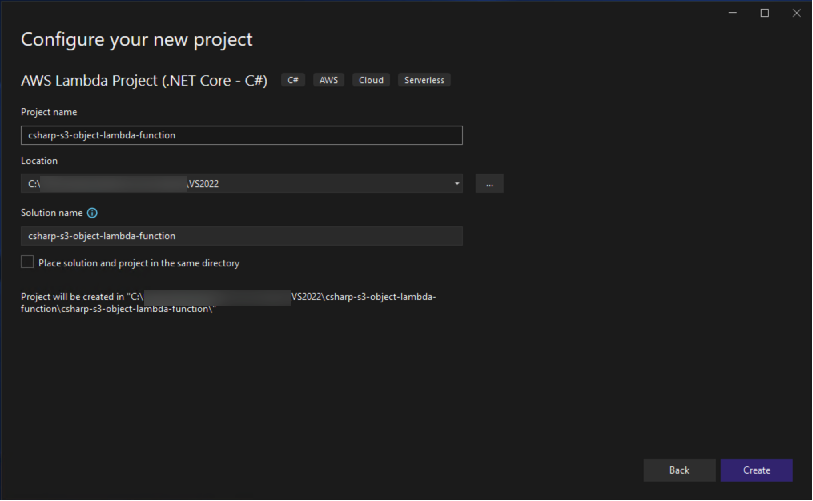
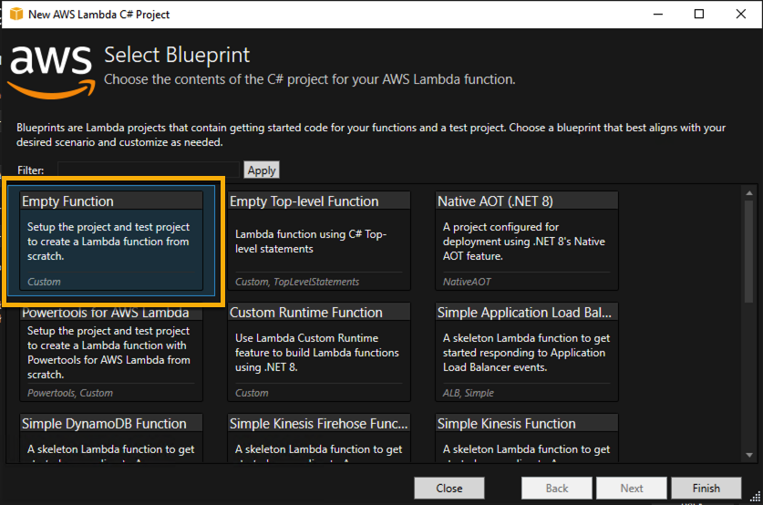
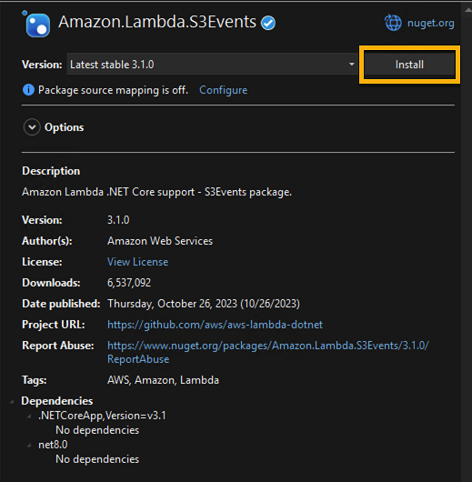
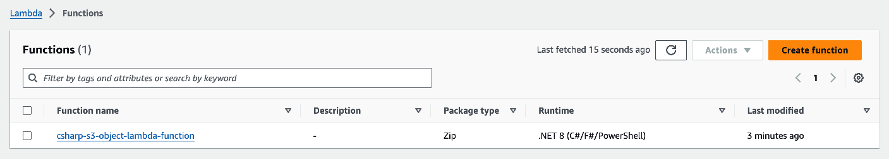
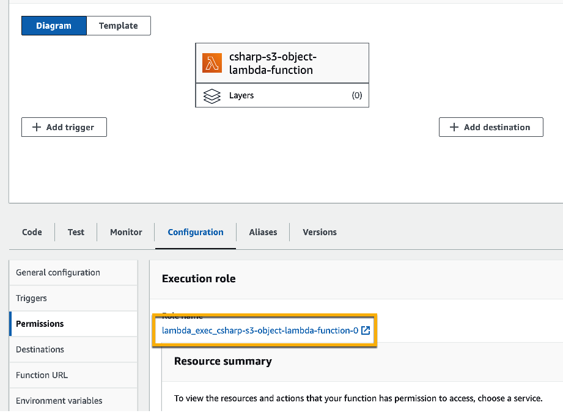
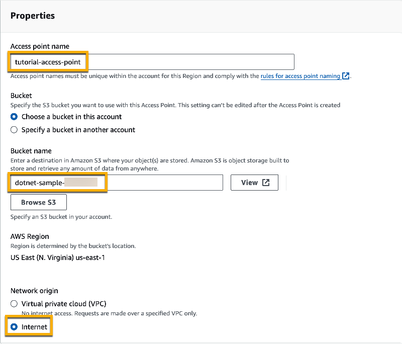
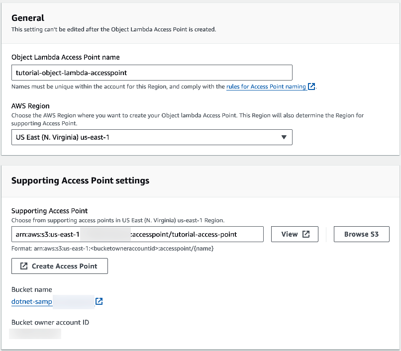
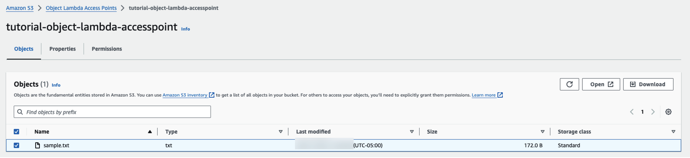
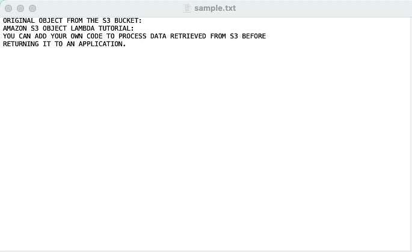

# Transforming data for your application with S3 Object Lambda


## Overview

In this tutorial, you learn how to add custom code to standard S3 GET requests to modify the requested object retrieved from S3 so that the object suits the needs of the requesting client or application. Specifically, you learn how to transform all the text in the original object stored in S3 to uppercase through S3 Object Lambda.


## Prerequisites

- An AWS account. For more information, see the [AWS SDKS and Tools Reference Guide](https://docs.aws.amazon.com/sdkref/latest/guide/overview.html).
- Visual Studio 2022 with .NET 8.0
- AWS Toolkit for Visual Studio Extension
- AWS CLI Install and Configured

## Create an IAM user with permissions in your AWS account

## Create an S3 bucket

Refer to [Create an S3 bucket](https://docs.aws.amazon.com/AmazonS3/latest/userguide/tutorial-s3-object-lambda-uppercase.html#ol-upper-step1)

(or)

Use CLI

```cmd
aws s3api create-bucket --bucket amzn-s3-demo-bucket --region us-east-1
```

## Upload a file to the S3 bucket

Upload a text file to the S3 bucket. This text file contains the original data that you will transform to uppercase later in this tutorial.

For example, you can upload a tutorial.txt file that contains the following text:

```
Amazon S3 Object Lambda Tutorial:
You can add your own code to process data retrieved from S3 before 
returning it to an application.
```

Refer to [Upload a file to the S3 bucket](https://docs.aws.amazon.com/AmazonS3/latest/userguide/tutorial-s3-object-lambda-uppercase.html#ol-upper-step2)

or

Use CLI

```cmd
aws s3 cp tutorial.txt s3://amzn-s3-demo-bucket
```

## Create an S3 access point

Refer to [Create an S3 access point](https://docs.aws.amazon.com/AmazonS3/latest/userguide/tutorial-s3-object-lambda-uppercase.html#ol-upper-step3)

or

Use CLI

```cmd
aws s3control create-access-point --bucket amzn-s3-demo-bucket --name amzn-s3-demo-bucket-ACCESSPOINT --account-id 111122223333
```


## Create a Lambda Function

To transform original data, create a Lambda function for use with your S3 Object Lambda Access Point.

### Create a Lambda function in Visual Studio

1. Create a New Project


2. Create an AWS Lambda Project


3. Give a Project Name - csharp-s3-object-lambda-function.csproj



4. Choose Empty Function Blueprint



5. Install Nuget Package - AWSSDK.S3 & Amazon.Lambda.S3Events

  
 

6. Update the Function Code

```csharp
public class Function
{
    IAmazonS3 S3Client { get; set; }

    public Function()
    {
        S3Client = new AmazonS3Client();
    }
    public Function(IAmazonS3 s3Client)
    {
        this.S3Client = s3Client;
    }

    public async Task<HttpResponseMessage> FunctionHandler(S3ObjectLambdaEvent s3Event, ILambdaContext context)
    {
        try
        {
            var objectContext = s3Event.GetObjectContext;
            var s3Url = objectContext.InputS3Url;
            var requestRoute = objectContext.OutputRoute;
            var requestToken = objectContext.OutputToken;
            context.Logger.LogInformation(objectContext.InputS3Url.ToString());

            var httpClient = new HttpClient();

            var response = await httpClient.GetAsync(s3Url);
            var responseBody = await response.Content.ReadAsStringAsync();
            var transformedObject = responseBody.ToUpper();

            var writeGetObjectResponseRequest = new Amazon.S3.Model.WriteGetObjectResponseRequest
            {
                Body = GenerateStreamFromString(transformedObject),
                RequestRoute = requestRoute,
                RequestToken = requestToken
            };

            await S3Client.WriteGetObjectResponseAsync(writeGetObjectResponseRequest);

            return new HttpResponseMessage(System.Net.HttpStatusCode.OK);
        }
        catch (Exception e)
        {
            context.Logger.LogError(e.Message);
            context.Logger.LogError(e.StackTrace);
            throw;
        }
    }

    public static MemoryStream GenerateStreamFromString(string value)
    {
        return new MemoryStream(Encoding.UTF8.GetBytes(value ?? ""));
    }
}
```

7. Add Using statement for Amazon.Lambda.S3Event

```csharp
using Amazon.Lambda.S3Events;
```

8. Right Click the Project in the Solution Explorer and choose "Publish to AWS Lambda".


9. Choose Create a new function and give a name to the Lambda function and click Next.


10. Choose Role as New Role based on AWSLambdaBasicExecutionRole and click upload.


11. Validate Lambda in AWS Console.


12. Navigate to the Permission and go to IAM by clicking the Role name Link.


13. Update the Permission with "AmazonS3ObjectLambdaExecutionRolePolicy".


## Create an S3 Object Lambda Access Point

Refer to [Create an S3 Object Lambda Access Point](https://docs.aws.amazon.com/AmazonS3/latest/userguide/tutorial-s3-object-lambda-uppercase.html#ol-upper-step6)


Create Access Point, give it a Name (ex: tutorial-access-point), Choose the Bucket we created earlier and select the Network Origin as Internet.



Create Object Lambda Access Point, 

Give it a Name (ex: tutorial-object-lambda-accesspoint), Choose the Access Point we created in the previous step,



For S3 APIs, to retrieve objects from the S3 bucket for Lambda function to process, select GetObject and choose the Lambda we deployed.


And leave the rest as default click "Create Object Lambda Access Point".


## View the transformed data in your S3 Object Lambda Access Point

Refer to [View the transformed data in your S3 Object Lambda Access Point](https://docs.aws.amazon.com/AmazonS3/latest/userguide/tutorial-s3-object-lambda-uppercase.html#ol-upper-step6)

Navigate to the Object Lambda Access Point in AWS S3 Console created, 



Open or Download the file, file should have the transaformed content.




## Clean up

If you transformed your data through S3 Object Lambda only as a learning exercise, delete the AWS resources that you allocated so that you no longer accrue charges.

Refer to [Clean up](https://docs.aws.amazon.com/AmazonS3/latest/userguide/tutorial-s3-object-lambda-uppercase.html#ol-upper-step8)

