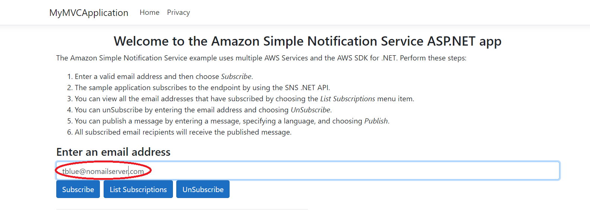
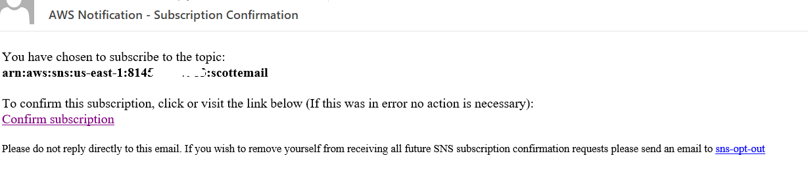
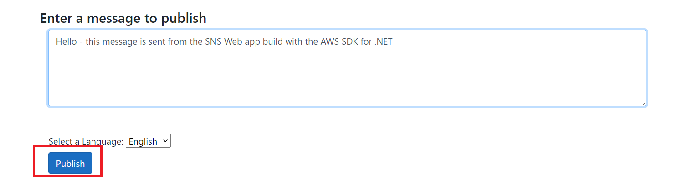
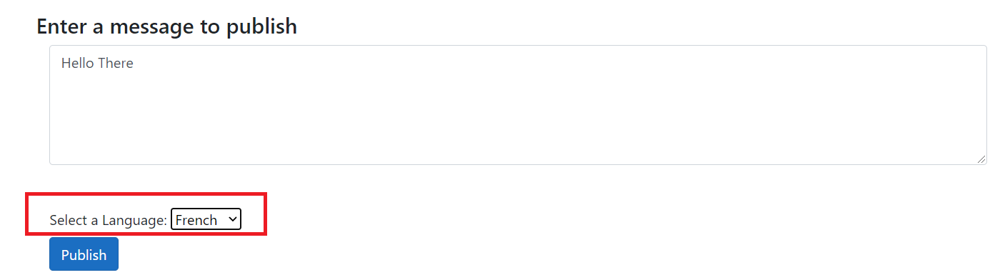
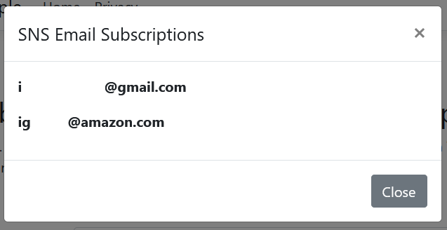
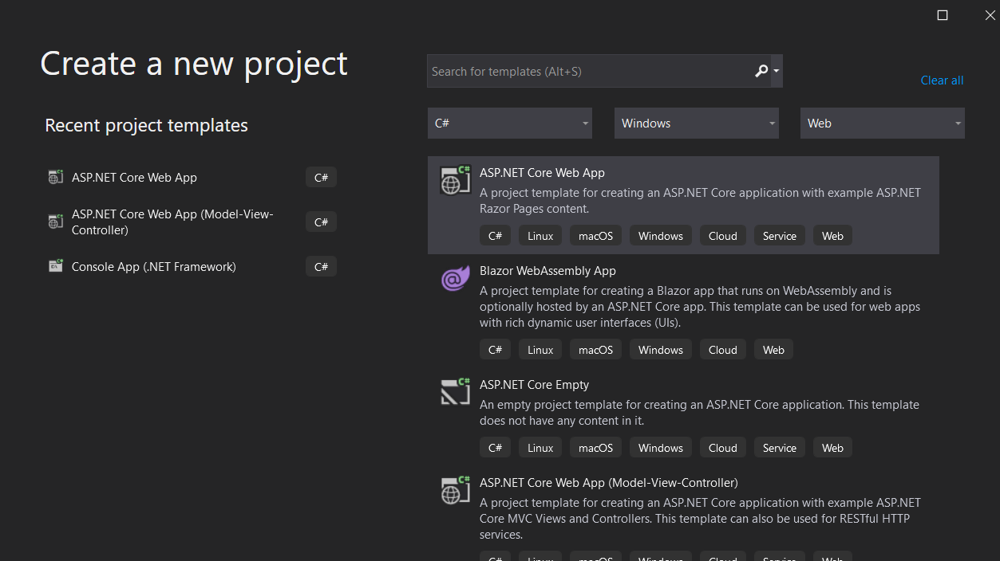
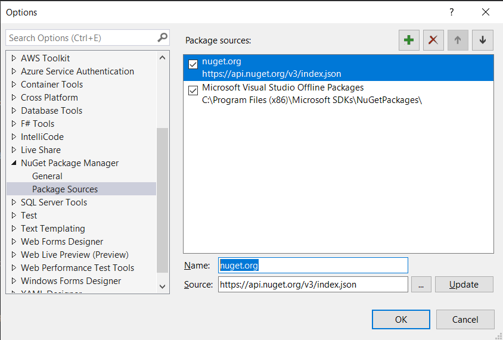

# Cross-service example: Creating a publish/subscription web application that translates messages using the AWS SDK for .NET

## Purpose

The application created in this AWS tutorial is an ASP.NET MVC application that lets a user subscribe to an Amazon Simple Notification Service (Amazon SNS) topic by entering a valid email address. A user can enter many emails and all of them are subscribed to the given SNS topic (once the email recipients confirm the subscription). The user can publish a message, and optionally translate it to  that results in all subscribed emails receiving the message. This example uses the following AWS services:

- Amazon Simple Notification Service (Amazon SNS)
- Amason Translate

**Note**: Amazon SNS is a managed service that provides message delivery from publishers to subscribers (also known as producers and consumers). For more information, see [What is Amazon SNS?](https://docs.aws.amazon.com/sns/latest/dg/welcome.html)

### Topics

- [Prerequisites](#prerequisites)
- [Understand the application](#understand-the-application)
- [Create a .NET Web App project](#create-the-project)
- [Add the AWS Packages](#add-the-aws-packages)
- [Create the classes](#create-the-classes)
- [Modify the cshtml file](#modify-the-cshtml-file)
- [Create the JS File](#create-the-js-file)
- [Run the application](#run-the-application)
- [Next Steps](#next-steps)

## Prerequisites

To complete the tutorial, you need the following:

- An AWS account. For more information see [AWS SDKS and Tools Reference Guide](https://docs.aws.amazon.com/sdkref/latest/guide/overview.html)
- A .NET IDE. This tutorial uses Microsoft Visual Studio
- .NET Core 5.0 or greater
- AWS SDK for .NET 3.5 or later

## ⚠️ Important

+ The AWS services included used by this application are included in the [AWS Free Tier](https://aws.amazon.com/free/?all-free-tier.sort-by=item.additionalFields.SortRank&all-free-tier.sort-order=asc).
+  This code has not been tested in all AWS Regions. Some AWS services are available only in specific regions. For more information, see [AWS Regional Services](https://aws.amazon.com/about-aws/global-infrastructure/regional-product-services). 
+ Running this code might result in charges to your AWS account. 
+ Be sure to terminate all of the resources you create while going through this tutorial to ensure that you’re not charged.

## Creating the resources

Create an Amazon SNS queue that is used in the .NET code. For information, see [Creating an Amazon SNS topic](https://docs.aws.amazon.com/sns/latest/dg/sns-create-topic.html).

In addition, make sure that you setup your .NET developer environment before following along with this tutorial. For more information, see [Setting up your AWS SDK for .NET environment](https://docs.aws.amazon.com/sdk-for-net/v3/developer-guide/net-dg-setup.html). 

## Understand the application

To subscribe to an Amazon SNS topic, the user enters a valid email address into the web application. 



The specified email address recieves an email message that asks the recipient to confirm the subscription. 



Once the email recipient accepts the confirmation, that email is subscribed to the specific SNS topic and recieves published messages. To publish a message, a user enters the message into the web application and then chooses the **Publish** button. 



This application lets a user specify the language of the message that is sent. For example, the user can select **French** from the dropdown field and then the message appears in that language to all subscribed users. 



**Note**: The Amazon Translate Service is used to translate the body of the message. The code is shown later in this document. 

This example application lets you view all of the subscribed email recipients by choosing the **List Subscriptions** button, as shown in the following illustration.




## Create the project

Create a Net Web App project using Visual Studio named **SNSApplication**.



1. In Visual Studio, choose **File**, **New**, **Project**.

2. In the New Project dialog box, choose **ASP .NET Core Web App**.

3. Choose **Next**.

4. In the **Project Name** field, specify **SubscribePublishTranslate**.  

5. Choose **Next**.

6. Make sure that the Target Framework is set to .NET Core 5.0 (or the current version of .NET Core) has been selected. 

6. Choose **Create**.

## Add the AWS Packages

At this point, you have a new project named **SubscribePublishTranslate**. You must add the required AWS packages to your project, as shown in this illustration.


Once you add the packages, you can use the AWS SDK for .NET in your project. 

1. In the Solution Explorer, right-click the project name, **SubscribePublishTranslate**.

2. Select **Manage NuGet Packages...**.

3. When the NuGet packages dialog opens, choose **Browse**.

4. In the **Search** field, specify **AWSSDK.Core**.  

5. Select the AWSSDK.Core package from the list, and then click the **Install** button in the right-hand pane.


**Note**: Repeat this process for the **AWSSDK.Simplenotificationservice** and **AWSSDK.Translate** packages. 

**Tip**: If you do not see these AWS Packages, then ensure that your NuGet is properly configured to use **nuget.org**, as shown in this illustration. 



 ## Create the classes
 
 By default, most of the .NET classes that you use to build this AWS application are created. Notice the project structure of your application. 
 
 
 
 You work with these .NET classes:

+ **HomeController** - Used as the .NET controller that handles HTTP requests. 
+ **SnsService** - Used to invoke Amazon SNS operations by using the Amazon SNS .NET API This also uses the Amazon Translate API to translate messages. You need to create this class in the same location as the **HomeController**. 

**Note**: You need to add the **SnsService** class to your project. 

### HomeController class

The following C# code represents the **HomeController** class. Becasue the Async version of the AWS SDK for .NET is used, notice that the controller methods have to use **async** keywords and the return values are defined using **Task**. 

```csharp
namespace SNSExample.Controllers
{
    using System.Diagnostics;
    using System.Threading.Tasks;
    using Microsoft.AspNetCore.Mvc;
    using Microsoft.Extensions.Logging;
    using SNSExample.Models;

    public class HomeController : Controller
    {
        private readonly ILogger<HomeController> _logger;

        public HomeController(ILogger<HomeController> logger)
        {
            _logger = logger;
        }

        [HttpPost]
        public async Task<ActionResult> PublishMessage(string body, string lang)
        {
            var snsService = new SnsService();
            var id = await snsService.PubTopic(body, lang);
            return Content($"Message {id} was successfully published");
        }

        [HttpPost]
        public async Task<ActionResult> RemoveEmailSub(string email)
        {
            var snsService = new SnsService();
            var msg = await snsService.UnSubEmail(email);
            return Content(msg);
        }

        [HttpPost]
        public async Task<ActionResult> AddEmailSub(string email)
        {
            var snsService = new SnsService();
            var arn = await snsService.SubEmail(email);
            return Content(arn);
        }

        [HttpGet]
        public async Task<ActionResult> GetAjaxValue()
        {
            var snsService = new SnsService();
            var xml = await snsService.GetSubs();
            return Content(xml);
        }

        public IActionResult Index()
        {
            return View();
        }

        public IActionResult Privacy()
        {
            return View();
        }

        [ResponseCache(Duration = 0, Location = ResponseCacheLocation.None, NoStore = true)]
        public IActionResult Error()
        {
            return View(new ErrorViewModel { RequestId = Activity.Current?.Id ?? HttpContext.TraceIdentifier });
        }
    }
}
```

### SnsService class

The following C# code represents the **SnsService** class. This class uses the AWS .NET SNS API to interact with Amazon SNS. For example, the **subEmail** method uses the email address to subscribe to the Amazon SNS topic. Likewise, the **unSubEmail** method unsubscibes from the Amazon SNS topic. The **pubTopic** publishes a message. The **TranslateBody** method uses the Amazon Translate Service to translate the message if requested by the user.  

In the code for the SnsService controller, be sure to change the AWS Region in the constructor call for the client object to the region where your rescources are defined. For example, in the first l ine of the UnSubEmail method, change:

```csharp
var client = new AmazonSimpleNotificationServiceClient(RegionEndpoint.USEast2);
```

to:

```csharp
var client = new AmazonSimpleNotificationServiceClient(RegionEndpoint.USWest2);
```
or whatever AWS region is appropriate for you.

Here is the code for the SnsService:

```csharp
namespace SNSExample.Controllers
{
    using System.Collections.Generic;
    using System.Threading.Tasks;
    using System.Xml;
    using Amazon;
    using Amazon.SimpleNotificationService;
    using Amazon.SimpleNotificationService.Model;
    using Amazon.Translate;
    using Amazon.Translate.Model;

    public class SnsService
    {
        private static readonly string TopicArn = "<PUT TOPIC ARN HERE>";

        public async Task<string> UnSubEmail(string email)
        {
            var client = new AmazonSimpleNotificationServiceClient(RegionEndpoint.USEast2);
            var arnValue = await GetSubArn(client, email);
            await RemoveSub(client, arnValue);
            return $"{email} was successfully deleted!";
        }

        public async Task<string> PubTopic(string body, string lang)
        {
            var client = new AmazonSimpleNotificationServiceClient(RegionEndpoint.USEast2);
            var message = string.Empty;

            switch (lang.ToLower())
            {
                case "french":
                    message = TranslateBody(body, "fr");
                    break;
                case "spanish":
                    message = TranslateBody(body, "es");
                    break;
                default:
                    message = body;
                    break;
            }

            var msgId = await PublishMessage(client, message);
            return msgId;
        }

        public async Task<string> SubEmail(string email)
        {
            var client = new AmazonSimpleNotificationServiceClient(RegionEndpoint.USEast2);
            var subArn = await SubscribeEmail(client, email);
            return subArn;
        }

        public async Task<string> GetSubs()
        {
            var client = new AmazonSimpleNotificationServiceClient(RegionEndpoint.USEast2);
            var subscriptions = await GetSubscriptionsListAsync(client);
            var val = DisplaySubscriptionList(subscriptions);
            return val;
        }

        public static async Task<string> RemoveSub(IAmazonSimpleNotificationService client, string subArn)
        {
            var request = new UnsubscribeRequest();
            request.SubscriptionArn = subArn;
            await client.UnsubscribeAsync(request);

            return string.Empty;
        }

        public static async Task<string> GetSubArn(IAmazonSimpleNotificationService client, string email)
        {
            var request = new ListSubscriptionsByTopicRequest();
            request.TopicArn = TopicArn;
            var subArn = string.Empty;

            var response = await client.ListSubscriptionsByTopicAsync(request);
            List<Subscription> allSubs = response.Subscriptions;

            // Get the ARN Value for this subscription.
            foreach (Subscription sub in allSubs)
            {
                if (sub.Endpoint.Equals(email))
                {
                    subArn = sub.SubscriptionArn;
                    return subArn;
                }
            }

            return string.Empty;
        }

        public static async Task<string> PublishMessage(IAmazonSimpleNotificationService client, string body)
        {
            var request = new PublishRequest();
            request.Message = body;
            request.TopicArn = TopicArn;

            var response = await client.PublishAsync(request);

            return response.MessageId;
        }

        public static async Task<string> SubscribeEmail(IAmazonSimpleNotificationService client, string email)
        {
            var request = new SubscribeRequest();
            request.Protocol = "email";
            request.Endpoint = email;
            request.TopicArn = TopicArn;
            request.ReturnSubscriptionArn = true;

            var response = await client.SubscribeAsync(request);

            return response.SubscriptionArn;
        }

        public static async Task<List<Subscription>> GetSubscriptionsListAsync(IAmazonSimpleNotificationService client)
        {
            var request = new ListSubscriptionsByTopicRequest
            {
                TopicArn = TopicArn,
            };
            var response = await client.ListSubscriptionsByTopicAsync(request);
            return response.Subscriptions;
        }

        public string DisplaySubscriptionList(List<Subscription> subscriptionList)
        {
            var email = string.Empty;
            List<string> emailList = new List<string>();
            foreach (var subscription in subscriptionList)
            {
                emailList.Add(subscription.Endpoint);
                email = subscription.Endpoint;
            }

            var xml = GenerateXML(emailList);
            return xml;
        }

        // Convert the list to XML to pass back to the view.
        private string GenerateXML(List<string> subsList)
        {
            XmlDocument doc = new XmlDocument();
            XmlNode docNode = doc.CreateXmlDeclaration("1.0", "UTF-8", null);
            doc.AppendChild(docNode);

            XmlNode subsNode = doc.CreateElement("Subs");
            doc.AppendChild(subsNode);

            // Iterate through the collection.
            foreach (string sub in subsList)
            {
                XmlNode subNode = doc.CreateElement("Sub");
                subsNode.AppendChild(subNode);

                XmlNode email = doc.CreateElement("email");
                email.AppendChild(doc.CreateTextNode(sub));
                subNode.AppendChild(email);
            }

            return doc.OuterXml;
        }

        private string TranslateBody(string msg, string lan)
        {
            var translateClient = new AmazonTranslateClient(RegionEndpoint.USEast2);
            var request = new TranslateTextRequest
            {
                SourceLanguageCode = "en",
                TargetLanguageCode = lan,
                Text = msg,
            };

            var response = translateClient.TranslateTextAsync(request);
            return response.Result.TranslatedText;
        }
    }
}
```

**Note:** Make sure that you assign the SNS topic ARN to the **topicArn** data member. Otherwise, your code will not work. 

## Modify the cshtml file

At this point, you have created all of the .NET classes required for this example application. Now modify the index.cshtml file required for the application's view. This file exists in the Views/Home folder, as shown in this illustration. 


### index.cshtml
The **index.cshtml** file is the application's home view. 

```html
@{
  ViewData["Title"] = "Home Page";
}

<div class="container">
  <div class="text-center">
    <h1>Amazon Web Services</h1>
    <h2>Subscribe, publish, and translate example</h2>
  </div>

  <div class="row">
    <div class="col-md-12 mx-auto">
      <p>
        This example uses the AWS SDK for .NET. to use Amazon Simple
        Notification Service (Amazon SNS) and Amazon Translate to allow
        users to subscribe, unsubscribe, and translate message for an
        Amazon SNS queue.
      </p>
    </div>
  </div>

  <div class="row">
    <div class="col-md-4 mx-auto">
      <p><strong>To subscribe:</strong></p>
      <ol>
        <li>Enter a valid email address and then choose the <em>Subscribe</em> button.</li>
        <li>The sample application subscribes to the endpoint by using the SNS .NET API.</li>
      </ol>
      <p><strong>To unsubscribe:</strong></p>
      <ol>
        <li>Enter a valid email address and then choose the <em>Unsubscribe</em> button.</li>
        <li>The sample application unsubscribes from the endpoint by using the SNS .NET API.</li>
      </ol>
      <p>To view the email addresses subscribed to the queue, choose the <em>List Subscriptions</em> button.</p>
    </div>
    <div class="col-md-8 mx-auto">
      <h3>Enter an email address</h3>
      <input type="email" class="form-control" id="inputEmail1" aria-describedby="emailHelp" placeholder="Enter email">
      <div class="clearfix mt-2">
        <button type="button" class="btn btn-primary" onclick="subEmail() ">
          Subscribe
        </button>
        <button type="button" class="btn btn-primary" onclick="subscribe()">
          List Subscriptions
        </button>
        <button type="button" class="btn btn-primary" onclick="delSub()">
          UnSubscribe
        </button>
      </div>
    </div>
  </div>

  <hr style="width:50%;margin-left:auto;margin-right:auto;">

  <div class="row">
    <div class="col-md-4 mx-auto">
      <p><strong>To publish a message:</strong></p>
      <ol>
        <li>Enter the message you want to send.</li>
        <li>Select the language: English, French, or Spanish.</li>
        <li>Select the <em>Publish</em> button.</li>
      </ol>
    </div>
    <div class="col-md-8 mx-auto">
      <h3>Enter a message to publish</h3>
      <div class="control-group">
        <div class="form-group">
          <textarea class="form-control" id="body" rows="5" placeholder="Body" required="required" data-validation-required-message="Please enter a description."></textarea>
          <p class="help-block text-danger"></p>
        </div>
      </div>
      <div class="clearfix mt-2">
        <label for="lang">Select a Language:</label>
        <select name="lang" id="lang">
          <option>English</option>
          <option>French</option>
          <option>Spanish</option>
        </select>
        <button type="submit" class="btn btn-primary" id="SendButton">Publish</button>
      </div>
    </div>
  </div>

  <!-- Modal -->
  <div class="modal fade" id="myModal" tabindex="-1" role="dialog" aria-labelledby="exampleModalLongTitle" aria-hidden="true">
    <div class="modal-dialog" role="document">
      <div class="modal-content">
        <div class="modal-header">
          <h5 class="modal-title" id="exampleModalLongTitle">SNS Email Subscriptions</h5>
          <button type="button" class="close" data-dismiss="modal" aria-label="Close">
            <span aria-hidden="true">&times;</span>
          </button>
        </div>
        <div class="modal-body">

        </div>
        <div class="modal-footer">
          <button type="button" class="btn btn-secondary" data-dismiss="modal">Close</button>
        </div>
      </div>
    </div>
  </div>
</div> 

```

### Create the JS File

This application has a **site.js** file that is located in the JS folder and is used to send requests to the .NET Controller. Add the following JavaScript code to this file.  

```javascript
$(function () {
    $("#SendButton").click(function ($e) {

        var body = $('#body').val();
        var lang = $('#lang option:selected').text();
        if (body == '') {
            alert("Please enter text");
            return;
        }

        $.ajax('home/PublishMessage', {
            type: 'POST',
            data: 'lang=' + lang + '&body=' + body,
            success: function (data, status, xhr) {

                alert(data)
                $('#body').val("");
            },
            error: function (jqXhr, textStatus, errorMessage) {
                $('p').append('Error' + errorMessage);
            }
        });
    });
});

function subEmail() {
    var mail = $('#inputEmail1').val();
    var result = validate(mail)
    if (result == false) {
        alert(mail + " is not valid. Please specify a valid email.");
        return;
    }

    $.ajax('home/AddEmailSub', {
        type: 'POST',
        data: 'email=' + mail,
        success: function (data, status, xhr) {
            alert("Subscription validation is " + data)
        },
        error: function (jqXhr, textStatus, errorMessage) {
            $('p').append('Error' + errorMessage);
        }
    });
}

function delSub(event) {
    var mail = $('#inputEmail1').val();
    var result = validate(mail)

    if (result == false) {
        alert(mail + " is not valid. Please specify a valid email");
        return;
    }

    $.ajax('home/RemoveEmailSub', {
        type: 'POST',  // http GET method
        data: 'email=' + mail,
        success: function (data, status, xhr) {

            alert(data);
        },
        error: function (jqXhr, textStatus, errorMessage) {
            $('p').append('Error' + errorMessage);
        }
    });
}

function subscribe() {

    $.ajax({
        url: 'home/GetAjaxValue',
        success: function (data, status, xhr) {

            $('.modal-body').empty();
            var xml = data;
            $(xml).find('Sub').each(function () {

                var $field = $(this);
                var email = $field.find('email').text();

                // Append this data to the main list.
                $('.modal-body').append("<p><b>" + email + "</b></p>");
            });
            $("#myModal").modal();
        },
        error: function (jqXhr, textStatus, errorMessage) {
            $('p').append('Error' + errorMessage);
        }
    });
}

function validateEmail(email) {
    const re = /^(([^<>()[\]\\.,;:\s@\"]+(\.[^<>()[\]\\.,;:\s@\"]+)*)|(\".+\"))@((\[[0-9]{1,3}\.[0-9]{1,3}\.[0-9]{1,3}\.[0-9]{1,3}\])|(([a-zA-Z\-0-9]+\.)+[a-zA-Z]{2,}))$/;
    return re.test(email);
}

function validate(email) {
    const $result = $("#result");

    if (validateEmail(email)) {
        return true;
    } else {
        return false;
    }
} 
```

## Run the application

You can run your application from your IDE. The home page will look like the following. 


### Next steps
Congratulations! You have created a .NET MVC application that contains subscription and publish functionality. When you're done working with the example, remember to terminate all of the resources you created while following this tutorial to ensure that your won't be charged.

Copyright (c) Amazon.com, Inc. or its affiliates. All Rights Reserved. SPDX-License-Identifier: Apache-2.0
