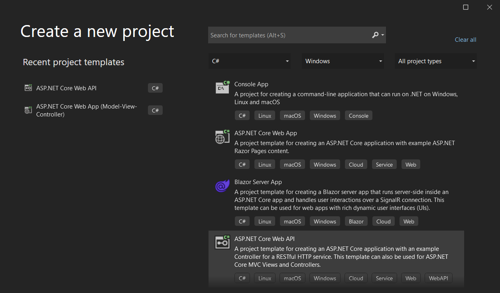
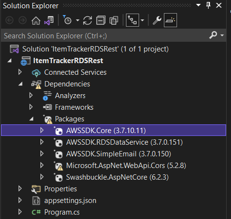
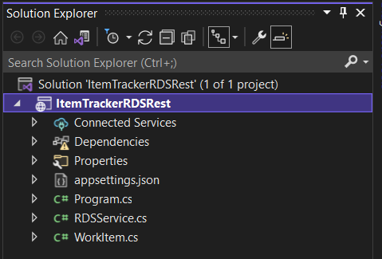

# Creating a React and ASP.NET Core application that queries Amazon Aurora Serverless data

## Overview

| Heading      | Description |
| ----------- | ----------- |
| Description | Discusses how to develop a React application that uses an ASP.NET Core API to query Amazon Aurora Serverless data. The ASP.NET Core API uses the AWS SDK for .NET (v3) to invoke AWS services.   |
| Audience   |  Developer (intermediate)        |
| Updated   | 6/14/2022        |
| Required skills   | C#, JavaScript  |

## Purpose

You can develop a dynamic web application that tracks and reports on work items by using the following AWS services:

+ Amazon Aurora Serverless database
+ Amazon Simple Email Service (Amazon SES) 

The application you create is a decoupled React application that uses a minimal web API built with ASP.NET Core to return Amazon Aurora Serverless data. That is, the React application is a single-page application (SPA) that interacts with the web API by making RESTful GET and POST requests. The ASP.NET Core Web API uses an [AmazonRDSDataServiceClient](https://docs.aws.amazon.com/sdkfornet/v3/apidocs/items/RDSDataService/TRDSDataServiceClient.html) object to perform CRUD operations on the Aurora Serverless database. Then, the web API returns JSON data, as shown in the following illustration. 


**Note:** You can only use the **AmazonRDSDataServiceClient** object for an Aurora Serverless DB cluster or Aurora PostgreSQL. For more information, see [Using the Data API for Aurora Serverless](https://docs.aws.amazon.com/AmazonRDS/latest/AuroraUserGuide/data-api.html).  

#### Topics

+ Prerequisites
+ Understand the AWS Tracker application
+ Create a Visual Studio project
+ Add the AWS packages
+ Create the .NET code
+ Create the React front end

## Prerequisites

To complete the tutorial, you need the following:

- An AWS account. For more information, see the [AWS SDKS and Tools Reference Guide](https://docs.aws.amazon.com/sdkref/latest/guide/overview.html).
- A .NET IDE. This tutorial uses Microsoft Visual Studio 2022.
- .NET Core 6.0 or later.
- AWS SDK for .NET 3.5 or later.
- You must also set up your .NET developer environment. For more information, see [Setting up your AWS SDK for .NET environment](https://docs.aws.amazon.com/sdk-for-net/v3/developer-guide/net-dg-setup.html). 


### ⚠️ Important

+ The AWS services used by this application are included in the [AWS Free Tier](https://aws.amazon.com/free/?all-free-tier.sort-by=item.additionalFields.SortRank&all-free-tier.sort-order=asc).
+  This code has not been tested in all AWS Regions. Some AWS services are available only in specific Regions. For more information, see [AWS Regional Services](https://aws.amazon.com/about-aws/global-infrastructure/regional-product-services). 
+ Running this code might result in charges to your AWS account. 
+ Be sure to delete all of the resources that you create while going through this tutorial so that you won't be charged.

### Creating the resources

You can create the required resources using either of these ways:

- Using the AWS Management console
- Using the AWS Cloud Development Kit

#### Using the AWS Management console

Create an Aurora Serverless database named **jobs**. Next, create a table named **Work** that contains the following fields:

+ **idwork** - A VARCHAR(45) value that represents the PK.
+ **date** - A date value that specifies the date the item was created.
+ **description** - A VARCHAR(400) value that describes the item.
+ **guide** - A VARCHAR(45) value that represents the deliverable being worked on.
+ **status** - A VARCHAR(400) value that describes the status.
+ **username** - A VARCHAR(45) value that represents the user who entered the item.
+ **archive** - A TINYINT(4) value that represents whether this is an active or archive item.

The following figure shows the **Work** table in the Amazon Relational Database Service (Amazon RDS) console.


For more information, see [Creating an Aurora Serverless v1 DB cluster](https://docs.aws.amazon.com/AmazonRDS/latest/AuroraUserGuide/aurora-serverless.create.html).

**Note**: When creating the **Work** table, add some active and archived records. These records are used when you test the Rest API.                     

To successfully connect to the database using the **AmazonRDSDataServiceClient** object, set up an AWS Secrets Manager secret to use for authentication. For more information, see [Rotate Amazon RDS database credentials automatically with AWS Secrets Manager](https://aws.amazon.com/blogs/security/rotate-amazon-rds-database-credentials-automatically-with-aws-secrets-manager/). 

To use the **AmazonRDSDataServiceClient** object, you must have the following two Amazon Resource Name (ARN) values: 

+ The ARN of an Aurora Serverless database.
+ The ARN of a Secrets Manager secret to use for database access.

**Note:** You must set up inbound rules for the security group to connect to the database. You can set up an inbound rule for your development environment. Setting up an inbound rule essentially means enabling an IP address to use the database. After you set up the inbound rules, you can connect to the database from the REST endpoint. For information about setting up security group inbound rules, see [Controlling Access with Security Groups](https://docs.aws.amazon.com/AmazonRDS/latest/UserGuide/Overview.RDSSecurityGroups.html).  

#### Using the AWS Cloud Development Kit

Using the AWS AWS Cloud Development Kit (AWS CDK), you can set up the resources required for this tutorial. For more information, see [CDK instructions](https://github.com/awsdocs/aws-doc-sdk-examples/tree/main/resources/cdk/aurora_serverless_app/README.md).

## Understand the AWS Tracker React application 

A user can perform the following tasks using the React application:

+ View all active items.
+ View archived items that are complete.
+ Add a new item. 
+ Convert an active item into an archived item.
+ Send a report to an email recipient.

The React SPA displays *active* and *archive* items. For example, the following illustration shows the React application displaying active data.


Likewise, the following illustration shows the React application displaying archived data.


The React SPA also lets a user enter a new item. 


The user can enter an email recipient into the **Manager** text field and choose **Send Report**.


Active items are queried from the database and sent within an email message. 

## Create a Visual Studio project

Create an ASP.NET Core Web API project using Visual Studio 2022. 



Perform the following steps. 

1. In Visual Studio, choose **File**, **New**, **Project**.

2. In the New Project dialog box, choose **ASP .NET Core Web App API**.

3. Choose **Next**.

4. In the **Project Name** field, enter **ItemTrackerRDSRest**.  

5. Choose **Next**.

6. Make sure to set the Target Framework to .NET Core 6.0. 

7. Remove Use controllers (uncheck to use minimal APIs).

6. Choose **Create**.
 

## Add the AWS packages

At this point, you have a new project. You must add the required AWS packages to your project. They are **AWSSDK.Core**, **AWSSDK.RDSDataService**, and **AWSSDK.SimpleEmail**, as shown in the following illustration.



After you add the packages, you can use the AWS SDK for .NET in your project. 

1. In the Solution Explorer, choose or right-click the project name, **ItemTrackerRDSRest**.

2. Select **Manage NuGet Packages...**.

3. When the NuGet packages dialog opens, choose **Browse**.

4. In the **Search** field, enter **AWSSDK.Core**.  

5. Select the **AWSSDK.Core** package from the list. Then, in the right pane, choose **Install**.

**Note**: Repeat this process for the **AWSSDK.RDSDataService** and **AWSSDK.SimpleEmail** packages. 

**Tip**: If you don't see the AWS packages after you add them, confirm that your NuGet is properly configured to use **nuget.org**. The following illustration shows **nuget.org** with source **https://api.nuget.org/v3/index.json** selected under the **Package Sources** for **NuGet Package Manager**. 


## Create the classes

By default, the **Program.cs** file is created. You need to add **RDSService.cs** and **WorkItem.cs**. Notice the project structure of your application.



The following .cs files go into this package:

+ **Program.cs** - Represents the logic that handles REST requests.
+ **RDSService** - Uses the **RDSDataClient** to retrieve a dataset from the **Work** table. 
+ **WorkItem** - Represents the application's data model.

### Program class 

The following C# code represents the **Program.cs** file. Notice that **/api/items/active** handles a GET request that returns all active items from the **Work** table. Likewise, **/api/items/archive** handles a GET request that returns all archive items from the **Work** table. Notice the use of the **AddCors**. This code lets the Rest API  accept requests from different domains (for example, it accepts a request from a React application running on port 3000).

```csharp
using ItemTrackerRDSRest;
var myAllowSpecificOrigins = "AllowCORS";
var builder = WebApplication.CreateBuilder(args);

builder.Services.AddCors(options =>
{
    options.AddPolicy(name: "AllowCORS", builder =>
    {
        builder.AllowAnyOrigin()
               .AllowAnyMethod()
               .AllowAnyHeader();
    });
});

var app = builder.Build();
app.UseCors(myAllowSpecificOrigins);

app.MapGet("/api/items/{state}", async (string state) =>
{
    var database = new RDSService();
    List<WorkItem> data = new List<WorkItem>();
    if (state == "active")
    {
        data = await database.GetItemsData(0);
    }
    else
    {
        data = await database.GetItemsData(1);
    }

    return data;
});

app.MapPut("/api/report/{email}", async (string email) =>
{
    var database = new RDSService();
    var myreport = await database.GetItemsReport(0);
    database.SendMessage(myreport, email);
    return "Report sent to " + email;
});

app.MapPut("/api/mod/{id}", async (string id) =>
{
    var database = new RDSService();
    var msg = await database.FlipItemArchive(id);
    return msg;
});

app.MapPost("/api/add", async (string guide, string description, string status) =>
{
    var database = new RDSService();
    var myWork = new WorkItem();
    myWork.Guide = guide;
    myWork.Description = description;
    myWork.Status = status;
    myWork.Name = "User";
    var msg = await database.injestNewSubmission(myWork);
    return msg;
});

app.Run();

```    

### RDSDataClient class

The following C# code represents the **RDSService** class that retrieves data from the **Work** table. Notice that you are required to specify ARN values for Secrets Manager and the Amazon Aurora Serverless database (as discussed in the Creating the resources section). Without both of these values, your code won't work. To query data by using the **AmazonRDSDataServiceClient**, you must create an **ExecuteStatementRequest** object and specify both ARN values, the database name, and the SQL statement.

```csharp
 using System.Xml;
 using Amazon;
 using Amazon.RDSDataService;
 using Amazon.RDSDataService.Model;
 using Amazon.SimpleEmail;
 using Amazon.SimpleEmail.Model;

 namespace ItemTrackerRDSRest
 {
    public class RDSService
    {

        private string secretArcVal = "<Enter Value>";
        private string resourceArnVal = "<Enter Value>";

        public string SecretArcVal
        {
            get => secretArcVal;
            set => secretArcVal = value;
        }

        public string ResourceArnVal
        {
            get => resourceArnVal;
            set => resourceArnVal = value;
        }

        // Get Items data from the database.
        public async Task<List<WorkItem>> GetItemsData(int arch)
        {
            var dataClient = new AmazonRDSDataServiceClient(RegionEndpoint.USEast1);
            var username = "User";
            List<WorkItem> records = new List<WorkItem>();
            var sqlStatement = "Select * FROM work where username = '" + username + "' and archive = " + arch + string.Empty;

            // Use trailing comma in multi-line initializers.
            var sqlRequest = new ExecuteStatementRequest
            {
                SecretArn = this.SecretArcVal,
                Sql = sqlStatement,
                Database = "jobs",
                ResourceArn = this.ResourceArnVal
            };

            CancellationToken token = CancellationToken.None;
            var response = await dataClient.ExecuteStatementAsync(sqlRequest, token);
            List<List<Field>> dataList = response.Records;
            var index = 0;

            foreach (var list in dataList)
            {
                var item = new WorkItem();
                index = 0;

                foreach (object myField in list)
                {
                    Field field = (Field)myField;
                    var value = field.StringValue;

                    if (index == 0)
                    {
                        item.Id = value;
                    }
                    else if (index == 1)
                    {
                        item.Date = value;
                    }
                    else if (index == 2)
                    {
                        item.Description = value;
                    }
                    else if (index == 3)
                    {
                        item.Guide = value;
                    }
                    else if (index == 4)
                    {
                        item.Status = value;
                    }
                    else if (index == 5)
                    {
                        item.Name = value;
                    }

                    // Increment the index.
                    index++;
                }

                records.Add(item);
            }

            return records;
        }

        // Inject a new submission.
        public async Task<string> injestNewSubmission(WorkItem item)
        {
            var dataClient = new AmazonRDSDataServiceClient(RegionEndpoint.USEast1);
            var workId = Guid.NewGuid().ToString();
            var name = "user";
            var sqlDate = DateTime.Now.ToString("yyyy-MM-dd HH:mm:ss");
            var guide = item.Guide;
            var description = item.Description;
            var status = item.Status;
            int arc = 0;

            var sqlStatement = "INSERT INTO work (idwork, username,date,description, guide, status, archive) VALUES('" + workId + "', '" + name + "', '" + sqlDate + "','" + description + "','" + guide + "','" + status + "','" + arc + "');";
            var sqlRequest = new ExecuteStatementRequest
            {
                SecretArn = this.SecretArcVal,
                Sql = sqlStatement,
                Database = "jobs",
                ResourceArn = this.ResourceArnVal,
            };

            CancellationToken token = CancellationToken.None;
            await dataClient.ExecuteStatementAsync(sqlRequest, token);
            return "Item " + workId + " was successfully inserted into the database";
        }
        
        // Gets data to place into an emial message.
        public async Task<string> GetItemsReport(int arch)
        {
            var dataClient = new AmazonRDSDataServiceClient(RegionEndpoint.USEast1);
            var username = "User";
            List<WorkItem> records = new List<WorkItem>();
            var sqlStatement = "Select * FROM work where username = '" + username + "' and archive = " + arch + string.Empty;

            var sqlRequest = new ExecuteStatementRequest
            {
                SecretArn = this.SecretArcVal,
                Sql = sqlStatement,
                Database = "jobs",
                ResourceArn = this.ResourceArnVal
            };

            CancellationToken token = CancellationToken.None;
            var response = await dataClient.ExecuteStatementAsync(sqlRequest, token);
            List<List<Field>> dataList = response.Records;
            var index = 0;

            foreach (var list in dataList)
            {
                var item = new WorkItem();
                index = 0;

                foreach (object myField in list)
                {
                    Field field = (Field)myField;
                    string value = field.StringValue;

                    if (index == 0)
                    {
                        item.Id = value;
                    }
                    else if (index == 1)
                    {
                        item.Date = value;
                    }
                    else if (index == 2)
                    {
                        item.Description = value;
                    }
                    else if (index == 3)
                    {
                        item.Guide = value;
                    }
                    else if (index == 4)
                    {
                        item.Status = value;
                    }
                    else if (index == 5)
                    {
                        item.Name = value;
                    }

                    // Increment the index.
                    index++;
                }

                records.Add(item);
            }

            string xml = this.GenerateXML(records);
            return xml;
        }

        // Modfies a record in the Work table.
        public async Task<string> FlipItemArchive(string id)
        {
            var dataClient = new AmazonRDSDataServiceClient(RegionEndpoint.USEast1);
            int arc = 1;

            // Specify the SQL statement to update data.
            var sqlStatement = "update work set archive = '" + arc + "' where idwork ='" + id + "' ";
            var sqlRequest = new ExecuteStatementRequest
            {
                SecretArn = this.SecretArcVal,
                Sql = sqlStatement,
                Database = "jobs",
                ResourceArn = this.ResourceArnVal
            };

            CancellationToken token = CancellationToken.None;
            await dataClient.ExecuteStatementAsync(sqlRequest, token);
            return "Item " + id + " was successfully updated";
        }

        // Converts the list to XML.
        private string GenerateXML(List<WorkItem> workList)
        {
            XmlDocument doc = new XmlDocument();
            XmlNode docNode = doc.CreateXmlDeclaration("1.0", "UTF-8", null);
            doc.AppendChild(docNode);

            XmlNode subsNode = doc.CreateElement("Items");
            doc.AppendChild(subsNode);

            // Iterate through the collection.
            foreach (WorkItem item in workList)
            {
                XmlNode subNode = doc.CreateElement("Item");
                subsNode.AppendChild(subNode);

                XmlNode id = doc.CreateElement("Id");
                id.AppendChild(doc.CreateTextNode(item.Id));
                subNode.AppendChild(id);

                XmlNode name = doc.CreateElement("Name");
                name.AppendChild(doc.CreateTextNode(item.Name));
                subNode.AppendChild(name);

                XmlNode date = doc.CreateElement("Date");
                date.AppendChild(doc.CreateTextNode(item.Date));
                subNode.AppendChild(date);

                XmlNode description = doc.CreateElement("Description");
                description.AppendChild(doc.CreateTextNode(item.Description));
                subNode.AppendChild(description);

                XmlNode guide = doc.CreateElement("Guide");
                guide.AppendChild(doc.CreateTextNode(item.Guide));
                subNode.AppendChild(guide);

                XmlNode status = doc.CreateElement("Status");
                status.AppendChild(doc.CreateTextNode(item.Status));
                subNode.AppendChild(status);
            }

            return doc.OuterXml;
        }

        // Sends an email message using SES.
        public async void SendMessage(string text, string toAddress)
        {
            var sesClient = new AmazonSimpleEmailServiceClient(RegionEndpoint.USWest2);
            var sender = "<Enter Value>";
            var emailList = new List<string>();
            emailList.Add(toAddress);

            var destination = new Destination
            {
                ToAddresses = emailList
            };

            var content = new Content
            {
                Data = text
            };

            var sub = new Content
            {
                Data = "Amazon Report"
            };

            var body = new Body
            {
                Text = content
            };

            var message = new Message
            {
                Subject = sub,
                Body = body
            };

            var request = new SendEmailRequest
            {
                Message = message,
                Destination = destination,
                Source = sender
            };

            try
            {
                await sesClient.SendEmailAsync(request);
            }
            catch (Exception ex)
            {
                Console.WriteLine(ex.Message);
            }
        }
    }
  }
```

**Note**: Update three variables with valid values: **secretArcVal**, **resourceArnVal**, and **sender**.

### WorkItem class

The following C# code represents the **WorkItem** class.

```csharp
namespace ItemTrackerRDSRest
{
    public class WorkItem
    {
        public string Id { get; set; }

        public string Name { get; set; }

        public string Guide { get; set; }

        public string Date { get; set; }

        public string Description { get; set; }

        public string Status { get; set; }
    }
}
```

## Run the application 

You can run your REST API that supports the following URLs. 

- /api/items/{state} - A GET request that returns all active or archive data items from the **Work** table. 
- /api/mod/{id} - A PUT request that converts the specified data item to an archived item. 
- /api/add - A POST request that adds a new item to the database. 
- /api/report/{email} - A PUT request that creates a report of active items and emails the report. 

**Note**: The React SPA created in the next section consumes all of these URLs. 

Confirm that the REST API works by viewing the active items. Enter the following URL into a browser. 

http://localhost:5179/api/items/active

The following illustration shows the JSON data returned from the REST API. 


## Create the React front end

You can create the React SPA that consumes the JSON data returned from the Spring REST API. To create the React SPA, you can download files from the following Github repository. Included in this repository are instructions on how to set up the project. For more information, see [Work item tracker web client](https://github.com/awsdocs/aws-doc-sdk-examples/tree/main/resources/clients/react/item-tracker/README.md).  

You must modify the **AWSServices.js** file so that your React requests work with your .NET backend. Update this file to include this code.

```javascript

// Copyright Amazon.com, Inc. or its affiliates. All Rights Reserved.
// SPDX-License-Identifier: Apache-2.0

/**
 * Sends REST requests to get work items, add new work items, modify work items,
 * and send an email report.
 *
 * The base URL of the REST service is stored in config.json. If necessary, update this
 * value to your endpoint.
 */

import axios from 'axios'
import configData from './config.json'


/**
 * Sends a POST request to add a new work item.
 *
 * @param item: The work item to add.
 * @returns {Promise<void>}
 */
export const addWorkItem = async (item) => {
  let status = item.status;
  let description = item.description;
  let guide = item.guide;
  await axios.post(`${configData.BASE_URL}/api/add?guide=`+ guide + `&description=`+ description + `&status=`+ status);
};
 
 /**
  * Sends a GET request to retrieve work items that are in the specified state.
  *
  * @param state: The state of work items to retrieve. Can be either 'active' or 'archive'.
  * @returns {Promise<AxiosResponse<any>>}: The list of work items that have the
  *                                         specified state.
  */
 export const getWorkItems = async (state) => {
   return await axios.get(`${configData.BASE_URL}/api/items/${state}`);
 };
 
 /**
  * Sends a PUT request to archive an active item.
  *
  * @param itemId: The ID of the item to archive.
  * @returns {Promise<void>}
  */
 export const archiveItem = async (itemId) => {
   await axios.put(`${configData.BASE_URL}/api/mod/${itemId}`);
 }
 
 /**
  * Sends a PUT request to email a report of work items.
  *
  * @param email: The report recipient's email address.
  * @returns {Promise<void>}
  */
 export const mailItem = async (email) => {
   await axios.put(`${configData.BASE_URL}/api/report/${email}`);
 }

```

### Next steps
Congratulations, you have created a decoupled React application that consumes data from a REST API. The REST API uses the AWS SDK for .NET (v3) to invoke AWS services. As stated at the beginning of this tutorial, be sure to delete all of the resources that you create during this tutorial so that you won't continue to be charged.

For more AWS multiservice examples, see
[usecases](https://github.com/awsdocs/aws-doc-sdk-examples/tree/main/dotnetv3/cross-service).


