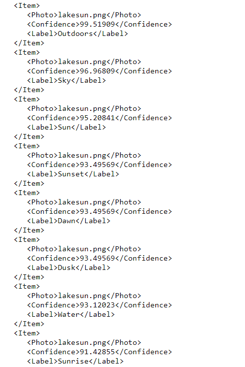
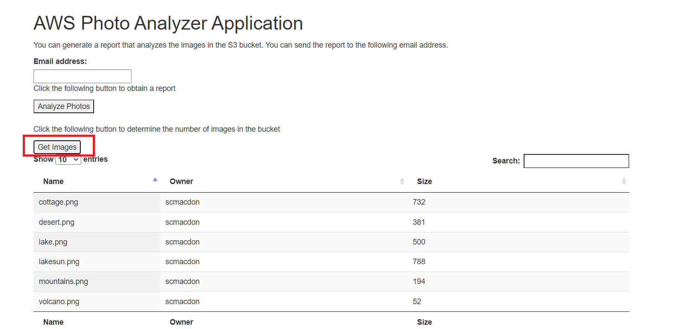
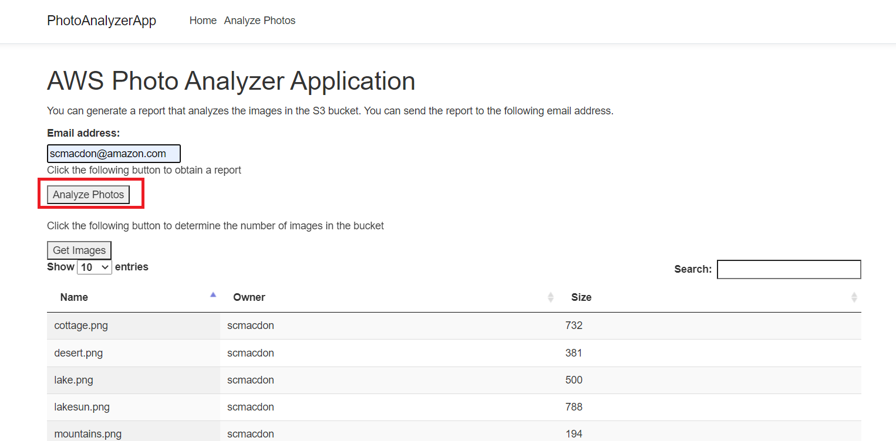
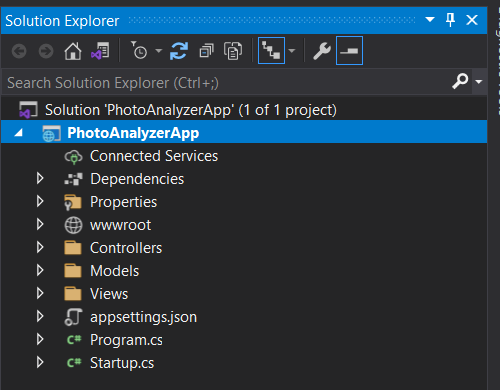
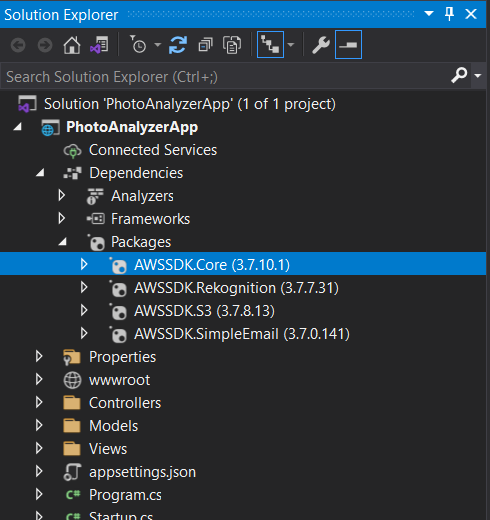
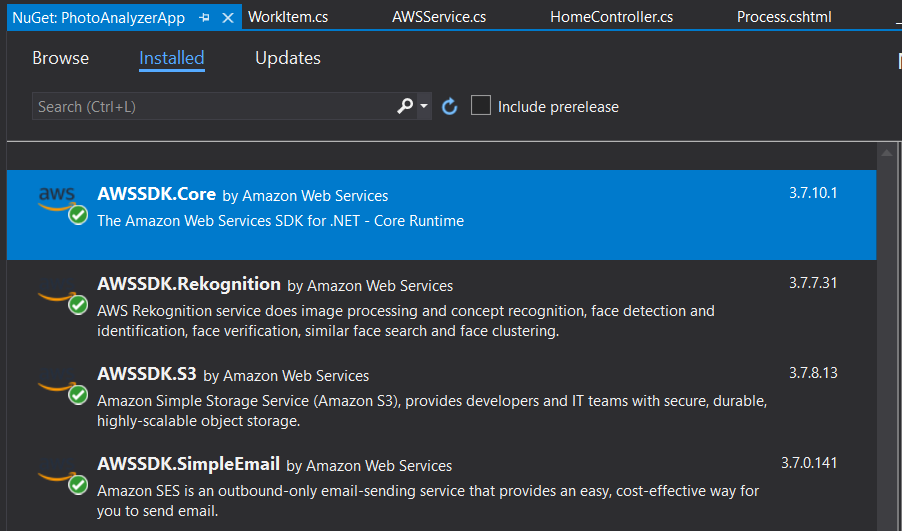
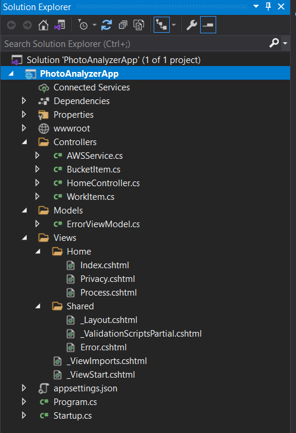
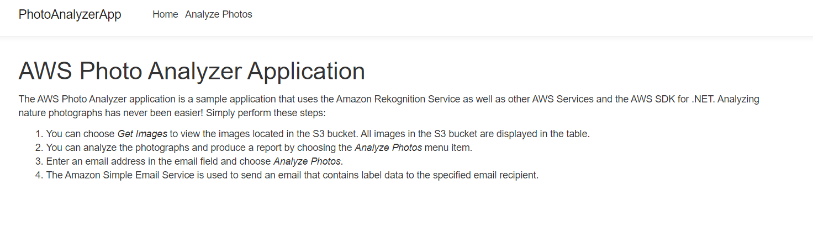

# Creating a dynamic web application that analyzes photos using the AWS SDK for .NET

## Purpose

You can create a dynamic web application that analyzes nature images located in an Amazon Simple Storage service (Amazon S3) bucket by using the Amazon Rekognition service and the AWS SDK for .NET. After analyzing the images in the S3 bucket, the application generates a report that breaks down each image into a series of labels. For example, the following image shows a lake at sunrise.


After the application analyzes the images, it uses the Amazon Simple Email service (Amazon SES) to send an email message that contains the label data, as shown in the following illustration. For example, some labels for the preceding photo are **Outdoors**, **Sky**, and **Sun**.  



In this tutorial, you use the following AWS services:

*	Amazon Rekognition
*	Amazon S3
*	Amazon SES

### Topics

- [Prerequisites](#prerequisites)
- [Understand the application](#understand-the-application)
- [Create a .NET Web App project](#create-the-project)
- [Add the AWS packages](#add-the-aws-packages)
- [Create the classes](#create-the-classes)
- [Modify the CSHTML file](#modify-the-cshtml-file)
- [Run the application](#run-the-application)
- [Next steps](#next-steps)

## Prerequisites

To complete the tutorial, you need the following:

- An AWS account. For more information, see the [AWS SDKS and Tools Reference Guide](https://docs.aws.amazon.com/sdkref/latest/guide/overview.html).
- A .NET IDE. This tutorial uses Microsoft Visual Studio.
- .NET Core 5.0 or greater.
- AWS SDK for .NET 3.5 or later.

## ⚠️ Important

+ The AWS services used by this application are included in the [AWS Free Tier](https://aws.amazon.com/free/?all-free-tier.sort-by=item.additionalFields.SortRank&all-free-tier.sort-order=asc).
+  This code has not been tested in all AWS Regions. Some AWS services are available only in specific Regions. For more information, see [AWS Regional Services](https://aws.amazon.com/about-aws/global-infrastructure/regional-product-services). 
+ Running this code might result in charges to your AWS account. 
+ Be sure to delete all of the resources that you create while going through this tutorial to ensure that you’re not charged.

## Creating the resources

Create an S3 bucket named **photos[somevalue]** and upload five or six nature images. Be sure to use this bucket name in your Amazon S3 .NET code. For more information about creating a bucket, see [Creating a bucket](https://docs.aws.amazon.com/AmazonS3/latest/gsg/CreatingABucket.html).

In addition, make sure that you set up your .NET developer environment before following along with this tutorial. For more information, see [Setting up your AWS SDK for .NET environment](https://docs.aws.amazon.com/sdk-for-net/v3/developer-guide/net-dg-setup.html). 

## Understand the AWS Photo Analyzer application

The AWS Photo Analyzer application supports viewing the images that are analyzed. To view the images, choose **Get Images**. 



To generate a report, enter an email address and choose **Analyze Photos**.



## Create the project

Create a MVC .Net Web App project using Visual Studio. Name it **PhotoAnalyzerApp**.



1. In Visual Studio, choose **File**, **New**, **Project**.

2. In the New Project dialog box, choose **ASP .NET Core Web App**.

3. Choose **Next**.

4. In the **Project Name** field, enter **PhotoAnalyzerApp**.  

5. Choose **Next**.

6. Make sure that the Target Framework is set to .NET Core 5.0 (or make sure that the current version of .NET Core is selected). 

6. Choose **Create**.

## Add the AWS packages

At this point, you have a new project named **PhotoAnalyzerApp**. You must add the required AWS packages to your project. They are **AWSSDK.Core**, **AWSSDK.Rekognition**, **AWSSDK.S3**, and **AWSSDK.SimpleEmail**, as shown in the following illustration.



After you add the packages, you can use the AWS SDK for .NET in your project. 

1. In the Solution Explorer, choose or right-click the project name, **PhotoAnalyzerApp**.

2. Select **Manage NuGet Packages...**.

3. When the NuGet packages dialog opens, choose **Browse**.

4. In the **Search** field, enter **AWSSDK.Core**.  

5. Select the **AWSSDK.Core** package from the list. Then, in the right pane, choose **Install**. After installation, you can see the package.



**Note**: Repeat this process to add the **AWSSDK.Rekognition**, **AWSSDK.S3**, and **AWSSDK.SimpleEmail** packages. 

**Tip**: If you don't see the AWS packages after you add them, confirm that your NuGet is properly configured to use **nuget.org**. The following illustration shows **nuget.org** with source **https://api.nuget.org/v3/index.json** selected under the **Package Sources** for **NuGet Package Manager**. 


 ## Create the classes
 
 The following illustration shows the structure of this .NET project. 
 
 
 
 **Note**: To keep this tutorial simple, the .NET classes are placed in the same namespace as the Controller. However, you can place them in other namespaces if you prefer. 
 
 You work with the following .NET classes:

+ **HomeController** - Used as the .NET controller that handles HTTP requests. 
+ **AWSService** - Used to invoke service operations by using the Amazon S3, Amazon Rekognition, and Amazon SES .NET API operations. You can create this class in the same location as the **HomeController**.
+ **BucketItem** -  Used as a model that stores S3 bucket information.   
+ **WorkItem**  - Used as a model that stores Amazon Rekognition data.

**Note**: You need to add the **AWSService**,  **BucketItem**, and  **WorkItem** classes to your project.

### HomeController class

The following C# code represents the **HomeController** class. Because the Async version of the AWS SDK for .NET is used, notice that the controller methods have to use **async** keywords and the return values are defined using **Task**. 

```csharp
using System;
using System.Collections.Generic;
using System.Diagnostics;
using System.Linq;
using System.Threading.Tasks;
using Microsoft.AspNetCore.Mvc;
using Microsoft.Extensions.Logging;
using PhotoAnalyzerApp.Models;

namespace PhotoAnalyzerApp.Controllers
{
    public class HomeController : Controller
    {
        private readonly ILogger<HomeController> _logger;
        private string bucketName = "<Enter your bucket name>";

        [HttpGet]
        public async Task<ActionResult> GetObjects()
        {
           var awsService = new AWSService();
           var xml = await awsService.ListBucketObjects(bucketName);
           return Content(xml);
        }

        [HttpPost]
        public async Task<ActionResult> GetReport(string email)
        {
            var myemail = email;
            var awsService = new AWSService();
            List<List<WorkItem>> myList = new List<List<WorkItem>>();
            var myNameList = await awsService.ListBucketNames(bucketName);
            foreach (var obName in myNameList)
            {
                List<WorkItem> labelList = await awsService.DetectLabels(bucketName, obName);
                myList.Add(labelList);
            }

            // Now we have a list of WorkItems describing the photos in the S3 bucket.
            var xmlReport = awsService.GenerateXMLFromList(myList);
            awsService.SendMessage(xmlReport, myemail);
            return Content("Report was sent with " + myList.Count() + " items.");
        }

        public HomeController(ILogger<HomeController> logger)
        {
            _logger = logger;
        }

        public IActionResult Index()
        {
            return View();
        }

        public IActionResult Process()
        {
            return View();
        }

        public IActionResult Privacy()
        {
            return View();
        }

        [ResponseCache(Duration = 0, Location = ResponseCacheLocation.None, NoStore = true)]
        public IActionResult Error()
        {
            return View(new ErrorViewModel { RequestId = Activity.Current?.Id ?? HttpContext.TraceIdentifier });
        }
    }
}

```

**Note**: Be sure to specify the bucket name for the **bucketName** variable. 
### AWSService class

The following C# code represents the **AWSService** class. This class uses the AWS .NET Rekognition API to analyze photos retrieved from an S3 bucket. The **DetectLabels** method returns a **List** object where each element is a **WorkItem** object that stores the label data. Likewise, the **ListBucketNames** method uses the Amazon S3 API to return a **List** object where each element is a string that specifies the object name. The **SendMessage** method uses the Amazon SES API to send an email message that contains the label data.  

Here is the code for **AWSService**.

```csharp
using System;
using System.Collections.Generic;
using System.Threading.Tasks;
using System.Xml;
using Amazon;
using Amazon.Rekognition;
using Amazon.Rekognition.Model;
using Amazon.S3;
using Amazon.S3.Model;
using Amazon.SimpleEmail;
using Amazon.SimpleEmail.Model;

namespace PhotoAnalyzerApp.Controllers
{
    public class AWSService
    {
        public async void SendMessage(string text, string toAddress)
        {
            var sesClient = new AmazonSimpleEmailServiceClient(RegionEndpoint.USWest2);
            var sender = "<Enter a valid email address>";
            var emailList = new List<string>();
            emailList.Add(toAddress);

            var destination = new Destination
            {
                ToAddresses = emailList
            };

            var content = new Content
            {
                Data = text
            };

            var sub = new Content
            {
                Data = "Amazon Rekognition Report"
            };

            var body = new Body
            {
                Text = content
            };

            var message = new Message
            {
                Subject = sub,
                Body = body
            };

            var request = new SendEmailRequest
            {
                Message = message,
                Destination = destination,
                Source = sender
            };

            try
            {
                await sesClient.SendEmailAsync(request);
            }
            catch (Exception ex)
            {
                Console.WriteLine(ex.Message);
            }
        }

        // Uses the Amazon Rekognition service to detect labels within an image.
        public async Task<List<WorkItem>> DetectLabels(string bucketName, string photo)
        {
            var rekognitionClient = new AmazonRekognitionClient(RegionEndpoint.USWest2);
            var labelList = new List<WorkItem>();
            var detectlabelsRequest = new DetectLabelsRequest
            {
                Image = new Image()
                {
                    S3Object = new Amazon.Rekognition.Model.S3Object()
                    {
                        Name = photo,
                        Bucket = bucketName,
                    },
                },
                MaxLabels = 10,
                MinConfidence = 75F,
            };

            try
            {
                DetectLabelsResponse detectLabelsResponse = await rekognitionClient.DetectLabelsAsync(detectlabelsRequest);
                Console.WriteLine("Detected labels for " + photo);
                WorkItem workItem;
                foreach (Label label in detectLabelsResponse.Labels)
                {
                    workItem = new WorkItem();
                    workItem.Key = photo;
                    workItem.Confidence = label.Confidence.ToString();
                    workItem.Name = label.Name;
                    labelList.Add(workItem);
                }

                return labelList;
            }
            catch (Exception ex)
            {
                Console.WriteLine(ex.Message);
            }

            return null;
        }

        // Returns object names in the S3 bucket.
        public async Task<List<string>> ListBucketNames(string bucketName)
        {
            var s3Client = new AmazonS3Client(RegionEndpoint.USWest2);
            var obList = new List<Amazon.S3.Model.S3Object>();
            var obName = new List<string>();

            var listRequest = new ListObjectsRequest
            {
                BucketName = bucketName,
            };

            ListObjectsResponse response = await s3Client.ListObjectsAsync(listRequest);
            obList = response.S3Objects;
            foreach (var myobj in obList)
                obName.Add(myobj.Key);
            return obName;
        }

        // Returns information about all images in the given S3 bucket.
        public async Task<string> ListBucketObjects(string bucketName)
        {
            var s3Client = new AmazonS3Client(RegionEndpoint.USWest2);
            var obList = new List<Amazon.S3.Model.S3Object>();
            var obName = new List<BucketItem>();

            var listRequest = new ListObjectsRequest
            {
                BucketName = bucketName,
            };

            ListObjectsResponse response = await s3Client.ListObjectsAsync(listRequest);
            obList = response.S3Objects;
            BucketItem myItem;

            foreach (var myobj in obList)
            {
                myItem = new BucketItem();
                myItem.Key = myobj.Key;
                myItem.Owner = myobj.Owner.DisplayName;
                long sizeLg = myobj.Size / 1024;
                myItem.Size = sizeLg.ToString();
                obName.Add(myItem);
            }

            var xml = GenerateXML(obName);
            return xml;
        }

        // Convert the list to XML to pass back to the view.
        private string GenerateXML(List<BucketItem> obList)
        {
            XmlDocument doc = new XmlDocument();
            XmlNode docNode = doc.CreateXmlDeclaration("1.0", "UTF-8", null);
            doc.AppendChild(docNode);

            XmlNode subsNode = doc.CreateElement("Items");
            doc.AppendChild(subsNode);

            // Iterate through the collection.
            foreach (BucketItem item in obList)
            {
                XmlNode subNode = doc.CreateElement("Item");
                subsNode.AppendChild(subNode);

                XmlNode name = doc.CreateElement("Key");
                name.AppendChild(doc.CreateTextNode(item.Key));
                subNode.AppendChild(name);

                XmlNode owner = doc.CreateElement("Owner");
                owner.AppendChild(doc.CreateTextNode(item.Owner));
                subNode.AppendChild(owner);

                XmlNode size = doc.CreateElement("Size");
                size.AppendChild(doc.CreateTextNode(item.Size));
                subNode.AppendChild(size);
            }

            return doc.OuterXml;
        }

        // Convert the list to XML to pass back to the view.
        public string GenerateXMLFromList(List<List<WorkItem>> obList)
        {
            XmlDocument doc = new XmlDocument();
            XmlNode docNode = doc.CreateXmlDeclaration("1.0", "UTF-8", null);
            doc.AppendChild(docNode);

            XmlNode subsNode = doc.CreateElement("Items");
            doc.AppendChild(subsNode);

            // Iterate through the outer list.
            foreach (var listItem in obList)
            {
                // Iterate through the collection of WorkItem objects.
                foreach (WorkItem item in listItem)
                {
                    XmlNode subNode = doc.CreateElement("Item");
                    subsNode.AppendChild(subNode);

                    XmlNode name = doc.CreateElement("Photo");
                    name.AppendChild(doc.CreateTextNode(item.Key));
                    subNode.AppendChild(name);

                    XmlNode owner = doc.CreateElement("Confidence");
                    owner.AppendChild(doc.CreateTextNode(item.Confidence));
                    subNode.AppendChild(owner);

                    XmlNode size = doc.CreateElement("Label");
                    size.AppendChild(doc.CreateTextNode(item.Name));
                    subNode.AppendChild(size);
                }
            }

            return doc.OuterXml;
        }
    }
}

```

**Note**: Update the email sender address with a verified email address. For more information, see [Verifying an identity for Amazon SES sending authorization](https://docs.aws.amazon.com/ses/latest/dg/sending-authorization-identity-owner-tasks-verification.html).

### WorkItem class

Here is the code for **WorkItem**.

```csharp
using System;
using System.Collections.Generic;
using System.Linq;
using System.Threading.Tasks;

namespace PhotoAnalyzerApp.Controllers
{
    public class WorkItem
    {
        public string Key { get; set; }
        public string Name { get; set; }
        public string Confidence { get; set; }
    }
}

```

### BucketItem class

Here is the code for **BucketItem**.

```csharp
using System;
using System.Collections.Generic;
using System.Linq;
using System.Threading.Tasks;

namespace PhotoAnalyzerApp.Controllers
{
    public class BucketItem
    {
        public string Key { get; set; }
        public string Owner { get; set; }
        public string Size { get; set; }
    }
}

```

## Modify the CSHTML file

At this point, you have created all of the .NET classes required for this example application. Now, modify the index.cshtml file required for the application's view. This file exists in the Views/Home folder, as shown in this illustration. 

### index.cshtml
The **index.cshtml** file is the application's home view. 

```html

  @{
    ViewData["Title"] = "Home Page";
  }
  <head>
    <script src="https://code.jquery.com/jquery-1.11.1.min.js"></script>
    <script src="https://code.jquery.com/ui/1.11.1/jquery-ui.min.js"></script>
    <link rel="stylesheet" href="https://maxcdn.bootstrapcdn.com/bootstrap/3.3.7/css/bootstrap.min.css" />
 </head>

 <h1 class="display-4">AWS Photo Analyzer application</h1>
 <p>
    The AWS Photo Analyzer application is a sample application that uses Amazon Rekognition, other AWS services, and the AWS SDK for .NET.
    Analyzing nature photographs has never been easier! Perform the following steps:
 <p>

    <ol>
        <li>You can choose <i>Get Images</i> to view the images located in the S3 bucket. All images in the S3 bucket are displayed in the table. </li>
        <li>You can analyze the photographs and produce a report by choosing the <i>Analyze Photos</i> menu item. </li>
        <li>Enter an email address in the email field and choose <i>Analyze Photos</i>.  </li>
        <li>Amazon SES is used to send an email that contains label data to the specified email recipient.</li>
    </ol>
```

### process.cshtml

Create a second CSHTML file named **Process.cshtml** that is located in the same folder as **Index.cshtml**. Add the following code to this file.  

```html
@{
    ViewData["Title"] = "Process Page";
}

<head>
    <script src="https://code.jquery.com/jquery-1.11.1.min.js"></script>
    <script src="https://code.jquery.com/ui/1.11.1/jquery-ui.min.js"></script>
    <script src="https://cdn.datatables.net/v/dt/dt-1.10.20/datatables.min.js"></script>
    <link rel="stylesheet" href="https://maxcdn.bootstrapcdn.com/bootstrap/3.3.7/css/bootstrap.min.css" />
    <link rel="stylesheet" href="https://cdn.datatables.net/v/dt/dt-1.10.20/datatables.min.css" />
</head>

<script>

    $(function () {

        $.noConflict();

        $("#bar").hide()

        $('#myTable').DataTable({
            scrollY: "500px",
            scrollX: true,
            scrollCollapse: true,
            paging: true,
            columnDefs: [
                { width: 200, targets: 0 }
            ],
            fixedColumns: true
        });


    });

    function GetReport() {

        // Post the values to the controller.
        $("#bar").show()
        var email = $('#email').val();
        if (email == "") {
            alert("Please enter an email address");
            return;
        }

        $.ajax('GetReport', {
            type: 'POST',  // http method
            data: 'email=' + email,  // data to submit
            success: function (data, status, xhr) {

                $("#bar").hide()
                alert(data);
            },

        });
    }

    function ProcessImages() {

        // Post the values to the controller.
        $("#bar").show()
        var email = $('#email').val();

        $.ajax('GetObjects', {
            type: 'GET',  // http method
            success: function (data, status, xhr) {
                $("#bar").hide()
                var xml = data
                var oTable = $('#myTable').dataTable();
                oTable.fnClearTable(true);
                $(xml).find('Item').each(function () {

                    var $field = $(this);
                    var key = $field.find('Key').text();
                    var name = $field.find('Owner').text();
                    var size = $field.find('Size').text();

                    //Set the new data.
                    oTable.fnAddData([
                        key,
                        name,
                        size]
                    );
                });
            },
        });
    }
</script>

<h1 class="display-4">AWS Photo Analyzer Application</h1>
<p>You can generate a report that analyzes the images in the S3 bucket. You can send the report to the following email address. </p>
<label for="email">Email address:</label>
<br>
<input type="text" id="email" name="email" value="">
<br>
<div id="bar" class="progress">
    <div class="progress-bar progress-bar-striped active" role="progressbar"
         aria-valuenow="40" aria-valuemin="0" aria-valuemax="100" style="width:90%">
        Generating report
    </div>
</div>
<p>Choose the following button to get a report</p>
<button onclick="GetReport()">Analyze Photos</button>

<div>
    <br>

    <p>Choose the following button to determine the number of images in the bucket</p>

    <button onclick="ProcessImages()">Get Images</button>
    <table id="myTable" class="display" style="width:100%">
        <thead>
            <tr>
                <th>Name</th>
                <th>Owner</th>
                <th>Size</th>
            </tr>
        </thead>
        <tbody>
            <tr>
                <td>No data</td>
                <td>No data</td>
                <td>No data</td>
            </tr>
        </tbody>
        <tfoot>
            <tr>
                <th>Name</th>
                <th>Owner</th>
                <th>Size</th>
            </tr>
        </tfoot>
        <div id="success3"></div>
    </table>

</div>
```

**Note**: Update the menu by adding this code to the **Layout.cshtml** file.

```html
    <li class="nav-item">
         <a class="nav-link text-dark" asp-area="" asp-controller="Home" asp-action="Process">Analyze Photos</a>
    </li>
```
## Run the application

You can run your application from your IDE. The home page looks like the following image. 




### Next steps
Congratulations! You have created a .NET MVC application that analyzes photos located in an S3 bucket. When you're done working with the example, remember to delete all of the resources that you created while following this tutorial to ensure that you won't be charged.

Copyright (c) Amazon.com, Inc. or its affiliates. All Rights Reserved. SPDX-License-Identifier: Apache-2.0
