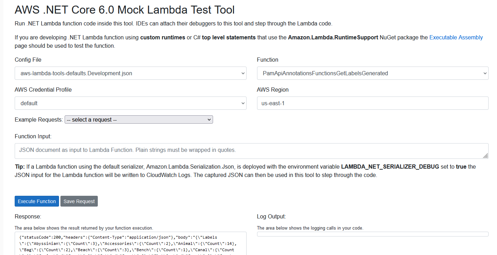

#  Create a photo asset management application with the SDK for .NET (v3)

## Overview

This example shows you how to use the AWS SDK for .NET (v3) to create a photo management application using AWS services and a serverless architecture.

The Photo Asset Management (PAM) example app uses Amazon Rekognition to categorize images, which are stored with Amazon S3 Intelligent-Tiering for cost savings. Users can upload new images that are analyzed with label detection. Those labels are then stored in an Amazon DynamoDB table. Users can later request a bundle of images associated with a list of labels. When images are requested, they are retrieved from Amazon Simple Storage Service (Amazon S3), zipped, and the user is sent a link to download the resulting zip file.
For more details on the complete application, see the [PAM application directory](https://github.com/awsdocs/aws-doc-sdk-examples/tree/main/applications/photo-asset-manager) in this repository.

### Frontend
The frontend is a single React app that uses the Cloudscape Design System. With the React app, users can authenticate with an Amazon Cognito flow. The app is deployed to an Amazon Simple Storage Service (Amazon S3) bucket using the provided AWS Cloud Development Kit (AWS CDK) stacks. It is publicly exposed by using an Amazon CloudFront distribution. The name is dynamically created during the AWS CDK deployment.

### Backend

The backend of the PAM application is implemented with these AWS Lambda functions:

- **Labels** - Serverless API endpoint that returns the labels and label count of images in the S3 storage bucket.
- **Upload** - Serverless API endpoint that returns a presigned URL for uploading an image.
- **DetectLabelsFunction** - Amazon S3 event function that is invoked when an image object is created in an S3 storage bucket. The new image is analyzed using AWS Rekognition, and label information is stored in a DynamoDB table.
- **DownloadFunction** - Amazon API Gateway function that combines images into a zip file in an S3 storage bucket with a presigned URL for download, and sends a notification message using Amazon Simple Notification Service (Amazon SNS).

## ⚠️ Important
* Running this code might result in charges to your AWS account.
* Running the tests might result in charges to your AWS account.
* We recommend that you grant your code least privilege. At most, grant only the minimum permissions required to perform the task. For more information, see [Grant least privilege](https://docs.aws.amazon.com/IAM/latest/UserGuide/best-practices.html#grant-least-privilege).
* This code is not tested in every AWS Region. For more information, see [AWS Regional Services](https://aws.amazon.com/about-aws/global-infrastructure/regional-product-services).

## Prerequisites

To run the code in this example, you need the following:

+ An AWS account.
+ .NET 6.
+ Docker Desktop.
+ NodeJS 18+.
+ To set up your development environment,
  see [Setting up your AWS SDK for .NET environment](https://docs.aws.amazon.com/sdk-for-net/v3/developer-guide/net-dg-setup.html).

## Create the resources

Follow the instructions in the
[README for the Photo Asset Manager application CDK](https://github.com/awsdocs/aws-doc-sdk-examples/blob/main/applications/photo-asset-manager/cdk/README.md).
to use the AWS Cloud Development Kit (AWS CDK) or AWS Command Line Interface
(AWS CLI) to create and manage the resources used in this example. You must be running Docker in order to complete the steps for the AWS CDK.

## Build the code

The Visual Studio solution **PhotoAssetManager.sln** includes several projects with different purposes for this example. The Lambda functions included in the solution also use [Powertools for AWS Lambda (.NET)](https://github.com/aws-powertools/powertools-lambda-dotnet) for enhanced logging. 

- **PamApi** - A Lambda Serverless API project that includes an ApiController for the serverless endpoints, a Swagger UI for development environments, and separate Download and DetectLabels functions. 
  - This is the project that will be packaged and deployed when using the `dotnet` language option when setting up the CDK stack.
- **PamApiAnnotations** - A [Lambda Annotations](https://github.com/aws/aws-lambda-dotnet/blob/master/Libraries/src/Amazon.Lambda.Annotations/README.md) project that includes a version of the serverless endpoints that use Lambda Annotations for .NET.
  - This is the project that will be packaged and deployed when using the `dotnetla` language option when setting up the CDK stack.
- **PamServices** - A C# library project that includes shared classes and custom services and business logic.
  - The services in this project are injected into the API projects' dependency injection setup in the Startup.cs files.
- **PamServices.Test** - An XUnit test project with unit tests for the PamServices project classes.

### Local development
The PamApi project includes a Swagger integration and setup, with additional test endpoints that can be used for investigating the various application functionality.
You can access this UI by running the `PamApi` project from Visual Studio in debug mode. 

For local development, you will also need to set the following environment variables that are automatically set for you during the AWS CDK deployment.

* LABELS_TABLE_NAME
* STORAGE_BUCKET_NAME
* WORKING_BUCKET_NAME
* NOTIFICATION_TOPIC

For local debugging of the `PamApiAnnotations` project and the `Download` and 
`DetectLabels` functions, you can use the [Mock Lambda Test Tool](https://github.com/aws/aws-lambda-dotnet/blob/master/Tools/LambdaTestTool/README.md).
To run the tool for debugging, select the tool from the `Debug` menu in Visual Studio.

### Application notes
* The maximum pixel size for analysis is 10000x10000. Larger images will not be analyzed.
* Some email clients do not support the long length download URLs. You might need to remove spaces from the URL before downloading.

## Delete the resources

To avoid charges, delete all the resources that you created for this tutorial.
Follow the instructions in the [README for the Photo Asset Manager application cdk](https://github.com/awsdocs/aws-doc-sdk-examples/blob/main/applications/photo-asset-manager/cdk/README.md)
to clean up the resources for the CDK stacks.

## Next steps

Congratulations! You have created and deployed a Photo Asset Management application.

## Additional resources

- [AWS SDK for .NET Developer Guide](https://docs.aws.amazon.com/sdk-for-net/v3/developer-guide/welcome.html)
- [AWS Lambda Developer Guide](https://docs.aws.amazon.com/lambda/latest/dg/lambda-csharp.html)
- [Amazon API Gateway Developer Guide](https://docs.aws.amazon.com/apigateway/latest/developerguide/welcome.html)
- [Amazon Rekognition Developer Guide](https://docs.aws.amazon.com/rekognition/latest/dg/what-is.html)
- [Amazon DynamoDB Developer Guide](http://docs.aws.amazon.com/amazondynamodb/latest/developerguide/)
- [Amazon Simple Storage Service User Guide](https://docs.aws.amazon.com/AmazonS3/latest/userguide/Welcome.html)
- [Amazon Simple Notification Service Developer Guide](https://docs.aws.amazon.com/sns/latest/dg/welcome.html)

For more AWS multiservice examples, see
[cross-service](https://github.com/awsdocs/aws-doc-sdk-examples/tree/master/dotnetv3/cross-service).
