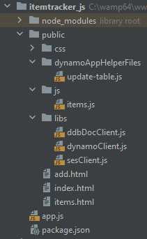
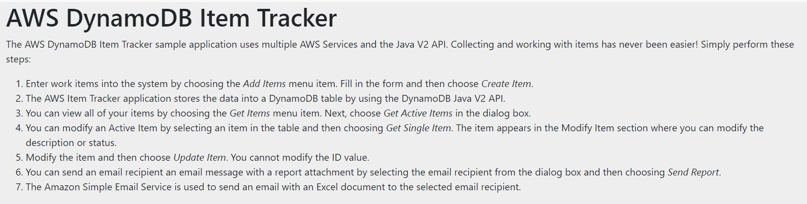
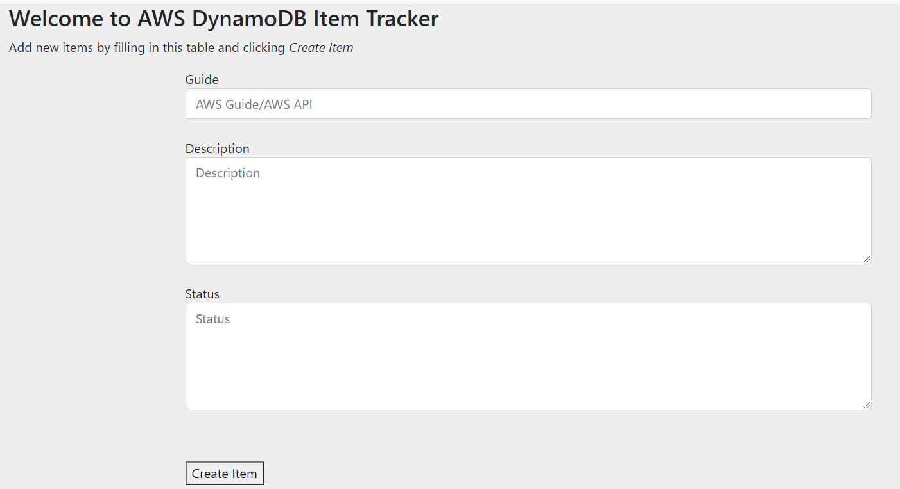
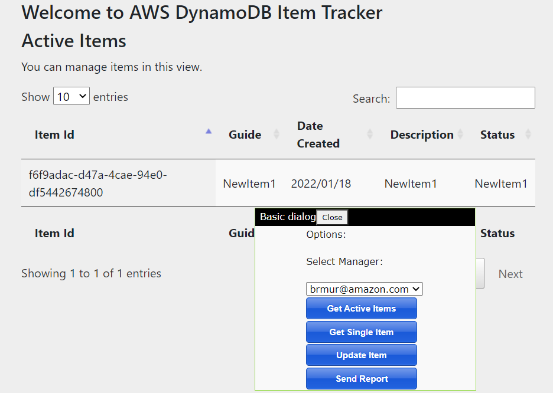

#  Creating the Amazon DynamoDB web application item tracker

## Purpose
You can develop a web application that tracks and reports on work items by using the following AWS services:

+ Amazon DynamoDB to store the data
+ Amazon Simple Email Service (Amazon SES) to send email messages

**Note:** In this tutorial, we use the AWS SDK for JavaScript version 3 to access Amazon SES and Amazon DynamoDB.

The application you create is named **DynamoDB Item Tracker**, and uses the [Express web framework for Node.js](https://expressjs.com/).

This tutorial guides you through creating the **DynamoDB Item Tracker** application. It shows you how to deploy the app locally. Amazon provides a range of deployment services that you can use alternatively. For more information, see  

The following figure shows you the structure of the project.




#### Topics

+ [Prerequisites](#prerequisites)
+ [Understand the AWS tracker application](#understand)
+ [Getting Started](#createProject)
+ [Creat the App.js](#appJS)
+ [Create the JavaScript files](#JavaScript)
+ [Create the HTML files](#HTML)

## <a name="prerequisites"></a>Prerequisites
To complete the tutorial, you need the following:

+ An AWS account
+ A JavaScript IDE 

### Important

+ The AWS services included in this document are included in the [AWS Free Tier](https://aws.amazon.com/free/?all-free-tier.sort-by=item.additionalFields.SortRank&all-free-tier.sort-order=asc).
+  This code has not been tested in all AWS Regions. Some AWS services are available only in specific regions. For more information, see [AWS Regional Services](https://aws.amazon.com/about-aws/global-infrastructure/regional-product-services).
+ Running this code might result in charges to your AWS account.
+ Be sure to terminate the resources you create while going through this tutorial to ensure that you’re not charged.


### <a name="createTheResources"></a>Create the resources
You can create the AWS resources required for this cross-service example using either of the following:
- [Amazon CloudFormation](#create-the-resources-using-amazon-cloudformation)
- [The AWS Management Console](#create-the-resources-using-the-aws-management-console)

### Create the resources using Amazon CloudFormation
You can run a single Amazon CloudFormation script to provision all the required resources for this example.

1. Install and configure the AWS CLI following the instructions in the AWS CLI User Guide.

2. Open the AWS Command Console from the *./photo-analyzer* folder.

3. Run the following command, replacing *STACK_NAME* with a unique name for the stack.
```
aws cloudformation create-stack --stack-name STACK_NAME --template-body file://setup.yaml --capabilities CAPABILITY_IAM
```
**Important**: The stack name must be unique within an AWS Region and AWS account. You can specify up to 128 characters, and numbers and hyphens are allowed.

4. Open [AWS CloudFormation in the AWS Management Console](https://aws.amazon.com/cloudformation/), and open the **Stacks** page.


5. Choose the **Resources** tab. The **Physical ID** of the **IDENTITY_POOL_ID** you require for this cross-service example is displayed.


For more information on the create-stack command parameters, see the [AWS CLI Command Reference guide](https://docs.aws.amazon.com/cli/latest/reference/cloudformation/create-stack.html), and the [AWS CloudFormation User Guide](https://docs.aws.amazon.com/AWSCloudFormation/latest/UserGuide/using-cfn-cli-creating-stack.html).

### Create the resources using the AWS Management Console

#### Create an unauthenticated user role
1. Open [AWS Cognito in the AWS Management Console](https://aws.amazon.com/cloudformation/), and open the *Stacks* page.
2. Choose **Manage Identity Pools**.
3. Choose **Create new identity pool**.
4. In the **Identity pool name** field, give your identity pool a name.
5. Select the **Enable access to unauthenticated identities** checkbox.
6. Choose **Create Pool**.
7. Choose **Allow**.
8. Take note of the **Identity pool ID**, which is highlighted in red in the **Get AWS Credentials** section.


9.Choose **Edit identity pool**.
10. Take note of the name of the role in the **Unauthenticated role** field.

#### Adding permissions to an unauthenticated user role
1. Open [IAM in the AWS Management Console](https://aws.amazon.com/iam/), and open the *Roles* page.
2. Search for the unauthenticated role you just created.
3. Open the role.
4. Click the down arrow beside the policy name.
5. Choose **Edit Policy**.
6. Choose the **JSON** tab.
7. Delete the existing content, and paste the code below into it.
```json
{
    "Version": "2012-10-17",
    "Statement": [
        {
            "Action": [
                "lambda:InvokeFunction",
                "mobileanalytics:PutEvents",
                "cognito-sync:*"
            ],
            "Resource": "*",
            "Effect": "Allow"
        },
        {
            "Action": "ses:*",
            "Resource": "*",
            "Effect": "Allow"
        },
        {
            "Action": "dynamodb:*",
            "Resource": "*",
            "Effect": "Allow"
        }
    ]
}
```
8. Choose **Review Policy**.
9. Choose **Save Changes**.

### Verify to and from email address on Amazon SES
This example requires a minimum of two verified email address.

To verify and email address:

1. Open [AWS SES in the AWS Management Console](https://aws.amazon.com/SES/), and open the **Email Addresses** page.
2. Choose **Verify a New Email Address**.
3. Enter a working email address, and choose **Verify This Email Address**.
4. Open the email in your email application, and verify it.

Create an Amazon DynamoDB table named **Work** with a key named **id**. For information, see [Create a Table](https://docs.aws.amazon.com/amazondynamodb/latest/developerguide/getting-started-step-1.html).

In addition, make sure that you setup your Java developer environment before following along with this tutorial. For more information, see [Get started with the AWS SDK for Java 2.x](https://docs.aws.amazon.com/sdk-for-java/latest/developer-guide/get-started.html). .


## <a name="understand"></a>Understand the AWS tracker application
The **DynamoDB Item Tracker** application uses a model that is based on a work item and contains these attributes:

+ **date** - The start date of the item.
+ **description** - The description of the item.
+ **guide** - The deliverable that this item has an impact on.
+ **username** - The person who performs the work item.
+ **status** - The status of the item.
+ **archive** - Whether this item is completed or is still being worked on.

When a user opens the application, they see the **Home** page.



#### Application functionality
A user can perform these tasks in the **DynamoDB Item Tracker** application:

+ Enter an item
+ View all items
+ Modify items
+ Send a report to an email recipient

The following figure shows the new item section.



A user can retrieve *active* or *archive* items. For example, a user can choose **Get Active Items** to get a dataset that's retrieved from the DynamoDB **Work** table and displayed in the web application.



The user can select the email recipient from the **Select Manager** list and choose **Send Report** (see the List in the previous figure). The email contains
a link to the Amazon DynamoDB table, where the user can download the items to a .CSV file by selecting **Actions** - **Download CSV**.


#### Work table
The DynamoDB table is named **Work** and contains the following fields:

+ **id** - Represents the key.
+ **date** - Specifies the date the item was created.
+ **description** - A value that describes the item.
+ **guide** - A value that represents the deliverable being worked on.
+ **status** - A value that describes the status.

The following figure shows the **Work** table.

## <a name="createProject"></a>Run the app

1. Clone the [AWS Code Examples Repository](https://github.com/awsdocs/aws-doc-sdk-examples) to your local environment.
   See [the Github documentation](https://docs.github.com/en/github/creating-cloning-and-archiving-repositories/cloning-a-repository) for
   instructions.

2. Install the dependencies listed in the [root]/javascriptv3/example_code/cross-services/ddb-item-tracker/package.json.

**Note**: These include both AWS SDK for JavaScript v3 client modules and third-party Node.js modules.
```
npm install node -g 
cd javascriptv3/example_code/cross-services/ddb-item-tracker
npm install
```

3. Start the app.
```
node app.js
```
The app is now running at [http://localhost:3000/index.html](http://localhost:3000).


## <a name="appJS"></a>The project files

- **images**: contains images used by this tutorial. You can safely delete it from your project.
- **public folder**: contains most of the code for the app. See [Folder in the public folder](#public) for more details.
- **app.js**: the main file in the app. It interacts with the Express web framework to execute code. See [app.js file](#appjs) for more details.
- **package.json**: defines functional attributes of a project that npm uses to install dependencies.

### <a name="public"></a>Folders in the **public** folder

#### <a name="css"></a>'css' folder
Contains the CSS style files for the app.
#### <a name="dynamoAppHelperFiles"></a>'dynamoAppHelperFiles' folder
Contains script that creates a table using the AWS SDK for JavaScript (v3).

To create the table for the app:
1. Update the **dynamoClient.js** as described in [libs](#libs)
2. Update the client files in the **libs** folder as described in ### Folders in the **public** folder
3. Change **TABLE_NAME** to **Work**,  and enter the following in the command line:
```
  cd javascriptv3/example_code/cross-services/ddb-item-tracker/public/dynamoAppHelperFiles
  node create-table.js
```
#### <a name="js"></a>'js' folder
Contains **items.js folder**, which contains all the functions triggers by buttons in the app.
- **GetItems()** - sends an Ajax post request to the '/request' route defined in the **app.js**, which returns all the items in the table.
The items are then posted to the UI table using [DataTables](https://cdn.datatables.net/).
```javascript
function GetItems() {
        $.ajax("/request", {
                type: 'POST',
                success: function (data, status, xhr) {
                    console.log('it works');
                    console.log('data.Items', data.Items);

                // Enable the buttons.
                $('#singlebutton').prop("disabled",false);
                $('#updatebutton').prop("disabled",false);
                $('#reportbutton').prop("disabled",false);
                $('#reportbutton').css("color", "#FFFFFF");
                $('#singlebutton').css("color", "#FFFFFF");
                $('#updatebutton').css("color", "#FFFFFF");


               $('#myTable').dataTable({
                        "bAutoWidth" : false,
                        "aaData" : data.Items,
                   "bDestroy": true,
                        "columns" : [ {
                            "data" : "id"
                        }, {
                            "data" : "guide"
                        }, {
                            "data" : "date"
                        } , {
                            "data" : "description"
                        }, {
                            "data" : "status"
                        }    ]
                    });
                    document.getElementById("info3").innerHTML = "Active Items";
                },
            error: function (jqXhr, textStatus, errorMessage) {
                $('p').append('Error' + errorMessage);
            }
        });
};
```
- **Report()** - sends an Ajax post request to the '/report' route defined in the **app.js**, which sends an email with a link
to the Amazon DynamoDB table to a selected user.
```javascript
function Report() {
    // Get the email address.
    const e = document.getElementById("manager");
    const value = e.options[e.selectedIndex].value;// get selected option value
    const email = e.options[e.selectedIndex].text;

    $.ajax('/report', {
        type: 'POST',
        data: 'email=' + email,
        success: function (data, status, xhr) {
            alert('Email message sent.');
        },
        error: function (jqXhr, textStatus, errorMessage) {
            $('p').append('Error' + errorMessage);
        }
    });
};
```
- **GetSingleItem()** - gets the selected table item's details and puts them in the **Modify item** form on the UI.
```javascript
function GetSingleItem() {
    if (!document.getElementsByClassName('selected').length)
    {
        alert("Please select an item from the table");
        return;
    }
    const id = document.getElementsByClassName('selected')[0].childNodes[0].innerHTML
    document.getElementById('id').value = id;
    const description = document.getElementsByClassName('selected')[0].childNodes[4].innerHTML
    document.getElementById('description').value = description;
    const status = document.getElementsByClassName('selected')[0].childNodes[3].innerHTML
    document.getElementById('status').value = status;
    $('#modform').show()
};
```
- **UpdateItem()** - gets the updated item's details from the **Modify item** form on the UI and updates them in the **Work** table. To do this
it sends an Ajax post request to the '/changewi' route defined in the **app.js**
```javascript
function UpdateItem()
{
    $("#modform").show();
   const id = document.getElementById('id').value;
    const description = document.getElementById('description').value
    const status = document.getElementById('status').value;

    if (id == "")
    {
        alert("Please select an item from the table");
        return;
    }

    if (description.length > 350)
    {
        alert("Description has too many characters");
        return;
    }

    if (status.length > 350)
    {
        alert("Status has too many characters");
        return;
    }

    $.ajax('/changewi', {
        type: 'POST',
        data: 'id=' + id + '&description=' + description+ '&status=' + status,
        success: function (data, status, xhr) {

            var msg = event.target.responseText;
            alert("You have successfully modified the item.");
            console.log('modified', data.id)

            $('#id').val("");
            $('#description').val("");
            $('#status').val("");

            //Refresh the grid.
            GetItems();

        },
        error: function (jqXhr, textStatus, errorMessage) {
            $('p').append('Error' + errorMessage);
        }
    });
};

```
- **addItem()** - gets the new item's details from the **Add item** form and adds the item to the **Work** table. To do this, 
it sends an Ajax post request to the '/add' route defined in the **app.js**.
```javascript
function addItem(){

        const guide = document.getElementById('guide').value
        const description = document.getElementById('description').value
        const status = document.getElementById('status').value

        //var description = $("textarea#description").val();
        if (description.length > 350)
        {
            alert("Description has too many characters");
            return;
        }
        if (description.length == 0)
        {
            alert("Enter a description.");
            return;
        }
        if (guide.length == 0)
        {
            alert("Enter a guide.");
            return;
        }
        if (status.length == 0)
        {
            alert("Enter a status.");
            return;
        }
        //var status = $("textarea#status").val();
        if (status.length > 350)
        {
            alert("Status has too many characters");
            return;
        }

        $.ajax('/add', {
            type: 'POST',  // http GET method
            data: 'guide=' + guide + '&description=' + description+ '&status=' + status,
            success: function (data) {
                alert("You have successfully added the item.")
                console.log("You have successfully added the item.")
                location.reload();
            },
            error: function (jqXhr, textStatus, errorMessage) {
                console.log('An error!')
                $('p').append('Error' + errorMessage);
            }
        });
    };
```

#### <a name="libs"></a>'libs' folder
Contains a javascript files for each AWS SDK for JavaScript module clients required for the app:
- **ddbDocClient.js** - creates a client for the Amazon DynamoDB Document Client. Update **REGION** to your 
AWS Region.
- **dynamoClient.js** - creates a client for the Amazon DynamoDB. Update **REGION** to your
  AWS Region, and **IDENTITY_POOL_ID** with the Amazon Cognito Idenfity Pool Id you created in [Create the resources](#createTheResources).
- **sesClient.js** - creates a client for the Amazon SES. Update **REGION** to your
  AWS Region, and **IDENTITY_POOL_ID** with the Amazon Cognito Idenfity Pool Id you created in [Create the resources](#createTheResources).

### <a name="appjs"></a>app.js file

The first section imports all the require modules.
```javascript
import express from 'express';
import {v4 as uuidv4} from 'uuid';
const port = process.env.PORT || 3000;
const app = express();
import bodyParser from 'body-parser';
import path from 'path';
import {fileURLToPath} from 'url';
const __filename = fileURLToPath(import.meta.url);
import { UpdateCommand, PutCommand, ScanCommand } from "@aws-sdk/lib-dynamodb";
import { dynamoClient } from "./public/libs/dynamoClient.js";
import { ddbDocClient } from "./public/libs/ddbDocClient.js";
import { SendEmailCommand } from "@aws-sdk/client-ses";
import { sesClient, REGION } from "./public/libs/sesClient.js";
```
The next section sets the path for the public directory.
```javascript
const __dirname = path.dirname(__filename);
const static_path = path.join(__dirname, "/public");
app.use(express.static(static_path));
app.use(express.urlencoded({ extended: true }));
```
The next section defines the tablename. Replace **TABLE_NAME** with the name of the Amazon DynamoDB table (for example, **Work**).
```javascript
const tableName = 'TABLE_NAME';
```
The next section registers bodyParser before it is used.

```javascript
app.use(bodyParser.json());
```
The next section defines the '/add' route, which adds a new item to the table using the Amazon DynamoDB Document Client.
```javascript
app.post("/add", (req, res) => {
    const body = req.body;
    const id = uuidv4();
    const d = new Date();
    const month = d.getMonth() + 1;
    const day = d.getDate();
    const todaydate = d.getFullYear() + '/' +
        (month < 10 ? '0' : '') + month + '/' +
        (day < 10 ? '0' : '') + day;
    const params = {
        TableName: tableName,
        Item: {
            id: id,
            guide: body.guide,
            description: body.description,
            status: body.status,
            date: todaydate
        }
    };
    const run = async () => {
        try {
            const data = await ddbDocClient.send(new PutCommand(params));
            console.log("Added item:", JSON.stringify(data, null, 2));
            console.log(data);
            res.contentType = "application/json";
            res.send(data);
        } catch (err) {
            console.error("Unable to add item. Error JSON:", JSON.stringify(err, null, 2));
        }
    };
    run();
});
```
The next section defines the '/request' route, which gets all the items from the table using the Amazon DynamoDB Document Client.
```javascript
app.post("/request", (req, res) => {
    var params = {
        TableName: tableName
    };

    const run = async () => {
        try {
            const data = await ddbDocClient.send(new ScanCommand(params));
            console.log('data', data);
            res.send(data);
        } catch (err) {
            console.log("Error", err);
        }
    }
    run();
});
```
The next section defines the '/changewi' route, which updates a selected item on the table using the Amazon DynamoDB Document Client.

```javascript
app.post("/changewi", (req, res) => {
    const body = req.body;
    console.log(req.body)
    var params = {
        TableName: tableName,
        Key: {
            "id": req.body.id
        },
        UpdateExpression: 'set #description=:d, #status=:s',
        ExpressionAttributeValues: {
            ':d': req.body.description,
            ':s': req.body.status
        },
        ExpressionAttributeNames: {
            '#description': "description",
            '#status': "status"
        }
    };
    const run = async () => {
        try {
            const data = await ddbDocClient.send(new UpdateCommand(params));
            res.contentType = "application/json";
            res.send(data);
        } catch (err) {
            console.error(err);
        }
    };
    run();
});
```
The next section defines the '/report' route, which sends an email to a selected user the table using the Amazon SES.

```javascript
app.post("/report", (req, res) => {
    // Helper function to send an email to user.
    // Set the parameters
    console.log('This is the email address: ', req.body.email)
    const params = {
        Destination: {
            /* required */
            CcAddresses: [
                /* more items */
            ],
            ToAddresses: [
                req.body.email, //RECEIVER_ADDRESS
                /* more To-email addresses */
            ],
        },
        Message: {
            /* required */
            Body: {
                /* required */
                Html: {
                    Charset: "UTF-8",
                    Data:
                        "<h1>Hello!</h1>" +
                        "<p> The Amazon DynamoDB table " +
                        tableName +
                        " has been updated with PPE information <a href='https://" +
                        REGION +
                        ".console.aws.amazon.com/dynamodb/home?region=" +
                        REGION +
                        "#item-explorer?table=" +
                        tableName +
                        "'>here.</a></p>"
                },
            },
            Subject: {
                Charset: "UTF-8",
                Data: "PPE image report ready.",
            },
        },
        Source: "brmur@amazon.com",
        ReplyToAddresses: [
            /* more items */
        ],
    };
    const run = async () => {
        try {
            const data = await sesClient.send(new SendEmailCommand(params));
            console.log("Success. Email sent.", data);
            res.contentType = "application/json";
            res.send(data);
        } catch (err) {
            console.log("Error", err);
        }
    };
    run();
});
```
The final section binds and listens the connections on the specified host and port, which in this case is 3000, 
as defined at the top of **app.js**.
```javascript
app.listen(port, () => {
    console.log(`Listening on port ${port}`);
})
```


## <a name="JavaScript"></a>Create the JavaScript files

## <a name="HTML"></a>Create the HTML files
