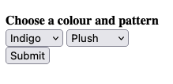
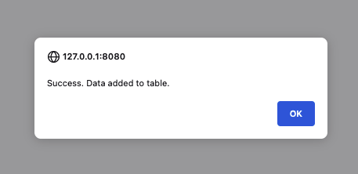

# Create a web app that invokes a Lambda function

This tutorial shows you how to use the AWS SDK for JavaScript (V3) and the AWS Management Console to create and run a web application that inserts records into Amazon DynamoDB.

**Services used**

- Amazon Cognito
- AWS Lambda
- Amazon DynamoDB
- AWS Identity and Access Management (IAM)

**Cost to complete**: The AWS services included in this document are included in the [AWS Free Tier](https://aws.amazon.com/free/?all-free-tier.sort-by=item.additionalFields.SortRank&all-free-tier.sort-order=asc).

**Note**: Be sure to terminate all of the resources after you have completed this tutorial to ensure that you are not charged.

## Prerequisites

To build this cross-service example, you need the following:

- An AWS account. For more information, see the [AWS SDKs and Tools Reference Guide](https://docs.aws.amazon.com/sdkref/latest/guide/overview.html).
- A NodeJS environment.

## ⚠ Important

- We recommend that you grant this code least privilege, or at most the minimum permissions required to perform the task. For more information, see [Grant Least Privilege](https://docs.aws.amazon.com/IAM/latest/UserGuide/best-practices.html#grant-least-privilege) in the _AWS Identity and Access Management User Guide_.
- This code has not been tested in all AWS Regions. Some AWS services are available only in specific [Regions](https://aws.amazon.com/about-aws/global-infrastructure/regional-product-services).
- Running this code might result in charges to your AWS account. We recommend you destroy the resources when you are finished.

## Create the resources

**Note:** In the following sections, the links to the console take a best guess at your intended Region. Make sure to create the resources in the same Region.

### Create an identity pool and guest role

1. Open [Amazon Cognito in the AWS Management Console](https://console.aws.amazon.com/cognito/).
1. Select `Identity pools` in the sidebar.
1. Choose `Create identity pool`.
1. Select the `Guest access` check box.
1. Choose `Next`.
1. Select `Create a new IAM role`.
1. Enter a role name in the `IAM role` field.
1. Choose `Next`.
1. Enter a name for the identity pool.
1. Choose `Next`.
1. Review the information and choose `Create identity pool`.

### Add permissions to the guest role

1. Open [IAM in the AWS Management Console](https://console.aws.amazon.com/iam).
2. Select `Roles` in the sidebar.
3. Search for the guest role created in the preceding section.
4. Choose the role link.
5. Expand the default permissions policy on the `Permissions` tab.
6. Choose the `Edit` button.
7. Replace the existing policy JSON with the following JSON. This allows a user with the guest role to invoke the Lambda.

```json
{
  "Version": "2012-10-17",
  "Statement": [
    {
      "Action": "lambda:InvokeFunction",
      "Resource": "*",
      "Effect": "Allow"
    }
  ]
}
```

8. Choose `Next`.
9. Choose `Save Changes`.

### Create a DynamoDB table

1. Open [DynamoDB in the AWS Management Console](https://console.aws.amazon.com/dynamodbv2).
2. Choose `Create table`.
3. Enter `lambda-for-browser` in the `Table name` field. The name of the table must match with `TableName` in `./frontend/src/index.js`.
4. For the `Partition key`, enter the key name `Id` and the type of `Number`.
5. Keep the `Sort key` blank. There are no queries in this example, so it's irrelevant.
6. Keep `Default settings` selected.
7. Choose `Create table`.

### Bundle the Lambda function

The backend will have access to the SDK through its runtime. Bundling is not necessary for the backend code, but it's done here to keep the code smaller and more organized.

**Note:** The AWS SDK packages are excluded from the bundle. This is configured in `./lambda/webpack.config.js`.

1. Replace `IDENTITY_POOL_ID` in `lambda/src/ddbClient.js` with the ID of the identity pool created in [Create an Identity pool and guest role](#create-an-identity-pool-and-guest-role).
2. `cd lambda`
3. `npm i`
4. `npm run build`
5. Create a compressed `.zip` file from `lambda/dist/index.mjs`.

### Deploy the Lambda function

1. Open [Lambda in the AWS Management Console](https://console.aws.amazon.com/lambda/home).
2. Choose `Create function`.
3. Enter the name `examplePutItem` in the `Function name` field. This name must match `FunctionName` in `frontend/src/index.js`.
4. Expand the `Change default execution role` section.
5. Select `Create a new role from AWS policy templates`.
6. Enter a name in the `Role name` field.
7. Select the `Simple microservice permissions` option to grant the Lambda function access to DynamoDB.
8. Choose `Create function`.
9. In the `Code` tab of the function page, choose `Upload from` and select `.zip file`.
10. Choose `Upload` and select the `.zip` file created in step 4 of [Bundle the Lambda function](#bundle-the-lambda-function).
11. Choose `Save`.
12. (Optional) Test the function in the console by choosing `Test` and providing the following `Event JSON`. If the test is successful, you will see the created record in the DynamoDB table.

```json
{
  "Item": {
    "Id": 1001,
    "Color": "tangerine",
    "Pattern": "solid"
  },
  "TableName": "lambda-for-browser"
}
```

## Bundle and run the frontend

The frontend code must be bundled in order to include the browser-compatible AWS SDK for JavaScript.

1. Replace `IDENTITY_POOL_ID` in `frontend/src/lambdaClient.js` with the ID of the identity pool created in [Create an Identity pool and guest role](#create-an-identity-pool-and-guest-role).
2. Replace `REGION` in `frontend/src/lambdaClient.js` with the Region that is hosting the resources for this example.
3. `cd frontend`
4. `npm i`
5. `npm run build`
6. Launch an HTTP server at `dist`. For example, `npx http-server ./dist`.
7. Navigate to the address of the server in your browser.
8. Choose a color and pattern.



9. Choose `Submit`.
10. If the insertion was successful, you should see a success message.


