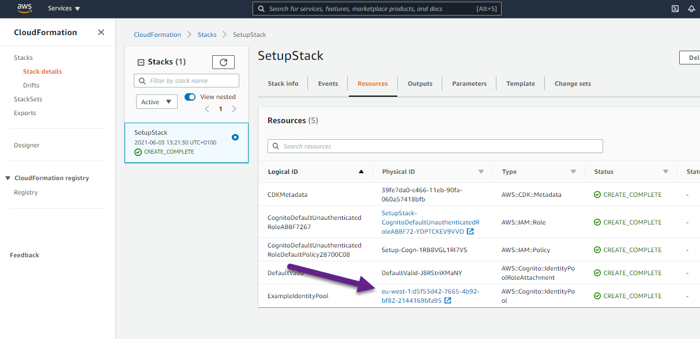
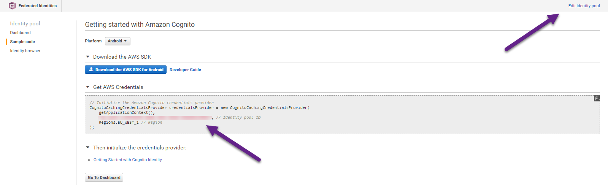

# Creating a Publish/Subscription Application

## Purpose

You can create a web application that has subscription and publish functionality by using the Amazon Simple Notification Service (Amazon SNS). The application created in this AWS tutorial lets a user subscribe to an Amazon SNS topic by entering a valid email address. A user can enter many emails and all of them are subscribed to the given SNS topic (once the email recipients confirm the subscription). The user can publish a message that results in all subscribed emails receiving the message. 

**Note**: Amazon SNS is a managed service that provides message delivery from publishers to subscribers (also known as producers and consumers). For more information, see [What is Amazon SNS?](https://docs.aws.amazon.com/sns/latest/dg/welcome.html)

To subscribe to an Amazon SNS topic, the user enters a valid email address into the web application. 


The specified email address recieves an email message that lets the recipient confirm the subscription. 


Once the email recipient accepts the confirmation, that email is subscribed to the specific SNS topic and recieves published messages. To publish a message, a user enters the message into the web applicaiton and then chooses the **Publish** button. 


This example application lets you view all of the subscribed email recipients by choosing the **List Subscriptions** button, as shown in the following illustration.


## Prerequisites

To build this cross-service example, you need the following:

* An AWS account. For more information see [AWS SDKs and Tools Reference Guide](https://docs.aws.amazon.com/sdkref/latest/guide/overview.html).
* A project environment to run this Node JavaScript example, and install the required AWS SDK for JavaScript and third-party modules.  For instructions, see [Create a Node.js project environment](#create-a-nodejs-project-environment) on this page.
* The following AWS resources:
    - An unauthenticated AWS Identity and Access Management (IAM) user role with the following permissions:
        - sns:*

**Note**: An unauthenticated role enables you to provide permissions to unauthenticated users to use the AWS Services. To create an authenticated role, see [Amazon Cognito Identity Pools (Federated Identities)](https://docs.aws.amazon.com/cognito/latest/developerguide/cognito-identity.html).    
 
For instructions on creating the minimum resources required for this tutorial, see [Create the resources](#create-the-resources) on this page.

## ⚠ Important
* We recommend that you grant this code least privilege, or at most the minimum permissions required to perform the task. For more information, see [Grant Least Privilege](https://docs.aws.amazon.com/IAM/latest/UserGuide/best-practices.html#grant-least-privilege) in the *AWS Identity and Access Management User Guide*. 
* This code has not been tested in all AWS Regions. Some AWS services are available only in specific [Regions](https://aws.amazon.com/about-aws/global-infrastructure/regional-product-services).
* Running this code might result in charges to your AWS account. We recommend you destroy the resources when you are finished. For instructions, see [Destroying the resources](#destroying-the-resources).
* Running the unit tests might result in charges to your AWS account.
* This tutorial is written to work with the specific versions defined in the *package.json*. If you change these versions, the tutorial may not work correctly.


## Create the resources
You can create the AWS resources required for this cross-service example using either of the following:
- [The Amazon CloudFormation](#create-the-resources-using-amazon-cloudformation)
- [The AWS Management Console](#create-the-resources-using-the-aws-management-console)

### Create the resources using Amazon CloudFormation
To run the stack using the AWS CLI:

1. Install and configure the AWS CLI following the instructions in the AWS CLI User Guide.

2. Open the AWS Command Console from the *./sns-sample-app* folder.

3. Run the following command, replacing *STACK_NAME* with a unique name for the stack.
```
aws cloudformation create-stack --stack-name STACK_NAME --template-body file://setup.yaml --capabilities CAPABILITY_IAM
```
**Important**: The stack name must be unique within an AWS Region and AWS account. You can specify up to 128 characters, and numbers and hyphens are allowed.

4. Open [AWS CloudFormation in the AWS Management Console](https://aws.amazon.com/cloudformation/), and open the **Stacks** page.


5. Choose the **Resources** tab. The **Physical ID** of the **IDENTITY_POOL_ID** you require for this cross-service example is displayed.



For more information on the create-stack command parameters, see the [AWS CLI Command Reference guide](https://docs.aws.amazon.com/cli/latest/reference/cloudformation/create-stack.html), and the [AWS CloudFormation User Guide](https://docs.aws.amazon.com/AWSCloudFormation/latest/UserGuide/using-cfn-cli-creating-stack.html).

### Create the resources using the AWS Management Console
####Create an unauthenticated user role
4. Open [AWS Cognito in the AWS Management Console](https://aws.amazon.com/cloudformation/), and open the *Stacks* page.
5. Choose **Manage Identity Pools**.
6. Choose **Create new identity pool**.
7. In the **Identity pool name** field, give your identity pool a name.
7. Select the **Enable access to unauthenticated identities** checkbox.
8. Choose **Create Pool**.
9. Choose **Allow**.
10. Take note of the **Identity pool ID**, which is highlighted in red in the **Get AWS Credentials** section.



11.Choose **Edit identity pool**.
12. Take note of the name of the role in the **Unauthenticated role** field.

####Adding permissions to an unauthenticated user role
13. Open [IAM in the AWS Management Console](https://aws.amazon.com/iam/), and open the *Roles* page.
14. Search for the unauthenticated role you just created.
15. Open the role. 
16. Click the down arrow beside the policy name.
17. Choose **Edit Policy**.
18. Choose the **JSON** tab.
18. Delete the existing content, and paste the code below into it.
```json
{
    "Version": "2012-10-17",
    "Statement": [
        {
            "Action": [
                "mobileanalytics:PutEvents",
                "cognito-sync:*"
            ],
            "Resource": "*",
            "Effect": "Allow"
        },
        {
            "Action": "sns:*",
            "Resource": "*",
            "Effect": "Allow"
        }
    ]
}
```
19. Choose **Review Policy**.
20. Choose **Save Changes**.   

### Verifying an email address on Amazon SES 
1. Open [AWS SES in the AWS Management Console](https://aws.amazon.com/SES/), and open the **Email Addresses** page.
2. Choose **Verify a New Email Address**.
3. Enter a working email address, and choose **Verify This Email Address**.
4. Open the email in your email application, and verify it.

## Create a Node.js project environment

1. Clone the [AWS Code Samples repo](https://github.com/awsdocs/aws-doc-sdk-examples) to your local environment. 
See [the Github documentation](https://docs.github.com/en/github/creating-cloning-and-archiving-repositories/cloning-a-repository) for 
instructions.

2. Run the following commands in sequence in the AWS CLI command line to install the AWS service client modules and third-party modules listed in the *package.json*:

```
npm install node -g
cd javascriptv3/example_code/cross-services/sns-sample-app
npm install
```
## Building the code
This app runs from the browser, so we create the interface using HTML and CSS. 
The app uses JavaScript to provide basic interactive features, and Node.js to invoke the AWS Services.

### Creating the HTML and CSS
In **index.html**, the **head** section loads [JQuery](https://jquery.com/) and [BootStrap](https://getbootstrap.com/) libraries. 
It also loads **stlyes.css**, which applies styles to the HTML,
and the **main.js**, which contains the following JavaScript and Node.js functions used in the app.

**Note**: **main.js** is a bundled file containing all the required JavaScript. You'll create this later in the tutorial.

The remaining code defines the interface features, including a table and buttons.

```html
<!DOCTYPE html>
<html xmlns:th="https://www.thymeleaf.org" lang="">
<head>
    <meta charset="UTF-8" />
    <title>Subscription</title>

    <script src="https://code.jquery.com/jquery-1.12.4.min.js"></script>
     <script src="https://maxcdn.bootstrapcdn.com/bootstrap/4.0.0/js/bootstrap.min.js"></script>
    <link rel="stylesheet" href="https://maxcdn.bootstrapcdn.com/bootstrap/4.5.2/css/bootstrap.min.css"/>
    <script src="./js/main.js" ></script>
    <link rel="stylesheet" href="../css/styles.css"  />
</head>
<body>
<header th:replace="layout :: site-header"/>
<div class="container">
    <h3>Welcome to the Amazon Simple Notification Service example app</h3>
    <p>Now is: <b th:text="${execInfo.now.time}"></b></p>
    <div class="row">
        <div class="col">
            <h4>Enter an email address<h3>
                <input type="email" class="form-control" id="inputEmail1" aria-describedby="emailHelp" placeholder="Enter email">
                <div class="clearfix mt-40">

                    <!-- Button trigger modal -->
                    <button type="button"  onclick="subEmail() "class="btn btn-primary" >
                        Subscribe
                    </button>
                    <button type="button" class="btn btn-primary" onclick="getSubs()">
                        List Subscriptions
                    </button>
                    <button type="button" onclick="delSub()" class="btn btn-primary" >
                        UnSubscribe
                    </button>

                    <!-- Modal -->
                    <div class="modal fade" id="myModal" tabindex="-1" role="dialog" aria-labelledby="exampleModalLongTitle" aria-hidden="true">
                        <div class="modal-dialog" role="document">
                            <div class="modal-content">
                                <div class="modal-header">
                                    <h5 class="modal-title" id="exampleModalLongTitle">SNS Email Subscriptions</h5>
                                    <button type="button" class="close" data-dismiss="modal" aria-label="Close">
                                        <span aria-hidden="true">&times;</span>
                                    </button>
                                </div>
                                <div class="modal-body">

                                </div>
                                <div class="modal-footer">
                                    <button type="button" class="btn btn-secondary" data-dismiss="modal">Close</button>
                                </div>
                            </div>
                        </div>
                    </div>
                </div>
        </div>
     </div>
    <hr style="width:50%;text-align:left;margin-left:0">
    <h4>Enter a message to publish</h4>
    <div class="col-lg-12 mx-auto">
        <div class="control-group">
            <div class="form-group floating-label-form-group controls mb-0 pb-2">
                <textarea class="form-control" id="body" rows="5" placeholder="Body" required="required" data-validation-required-message="Please enter a description."></textarea>
                <p class="help-block text-danger"></p>
            </div>
        </div>
        <br>
        <button type="submit" class="btn btn-primary btn-xl" onclick="sendMessage()" id="SendButton">Publish</button>
    </div>
</div>
<script src="./js/main.js" ></script>
</body>
</html>
```
### Creating the JavaScript and Node.js
The **./src/libs/** folders contains a file for each of the AWS Service client required. You must
replace "REGION" with your AWS Region, and replace "IDENTITY_POOL_ID" with the Amazon Cognito identity pool id
you created in [Create the resources](#create-the-resources) on this page. 
 
 
```javascript
import { CognitoIdentityClient } from "@aws-sdk/client-cognito-identity";
import { fromCognitoIdentityPool } from "@aws-sdk/credential-provider-cognito-identity";
import { SNSClient } from "@aws-sdk/client-sns";

const REGION = "REGION";
const IDENTITY_POOL_ID = "IDENTITY_POOL_ID"; // An Amazon Cognito Identity Pool ID.

// Create an Amazon Comprehend service client object.
const snsClient = new SNSClient({
    region: REGION,
    credentials: fromCognitoIdentityPool({
        client: new CognitoIdentityClient({ region: REGION }),
        identityPoolId: IDENTITY_POOL_ID,
    }),
});

export { snsClient };
```
In **./src/index.js**, you first import all the required AWS Service and third party modules, and set global parameters.
```javascript
import {
  SubscribeCommand,
  ListSubscriptionsByTopicCommand,
  ListSubscriptionsCommand,
  UnsubscribeCommand,
    PublishCommand
} from "@aws-sdk/client-sns";
import { snsClient } from "../libs/snsClient.js";

// Set global parameters.
const TOPIC_ARN = "TOPIC_ARN";
```

Next, you define the following functions: 

- *subEmail* - subscribe an email to the Amazon SNS topic.
- *getSubs* - list the emails subscribed to the Amazon SNS topic.
- *delSub* - remove an email from being subscribed to the Amazon SNS topic.
- *sendMessage* - send an email to all email addresses subscribed to the Amazon SNS topic.

**Note:** *loadItems* and *validate* are helper functions.
```javascript
// Subscribe the email address to the Amazon SNS topic.
const subEmail = async () => {
  const userEmail = document.getElementById("inputEmail1").value;
  var result = validate(userEmail);
  if (result == false) {
    alert(userEmail + " is not valid. Please specify a valid email");
    return;
  }
  // Set the parameters
  const params = {
    Protocol: "email" /* required */,
    TopicArn: TOPIC_ARN, //TOPIC_ARN
    Endpoint: userEmail, //EMAIL_ADDRESS
  };
  try {
    const data = await snsClient.send(new SubscribeCommand(params));
    console.log("Success.", data);
    return data; // For unit tests.
  } catch (err) {
    console.log("Error", err.stack);
  }
};
// Expose function to browser.
window.subEmail = subEmail;

function loadItems(event) {
  var subNum = event.target.responseText;
  alert("Subscription validation is " + subNum);
}

// Helper function to validate email addresses.
function validateEmail(email) {
  const re = /^(([^<>()[\]\\.,;:\s@\"]+(\.[^<>()[\]\\.,;:\s@\"]+)*)|(\".+\"))@((\[[0-9]{1,3}\.[0-9]{1,3}\.[0-9]{1,3}\.[0-9]{1,3}\])|(([a-zA-Z\-0-9]+\.)+[a-zA-Z]{2,}))$/;
  return re.test(email);
}

// Helper function to validate email addresses.
function validate(email) {
  const $result = $("#result");

  if (validateEmail(email)) {
    return true;
  } else {
    return false;
  }
}

// List subscriptions to the Amazon SNS topic.
const getSubs = async () => {
  const params = {
    TopicArn: TOPIC_ARN,
  };
  try {
    const data = await snsClient.send(
      new ListSubscriptionsByTopicCommand(params)
    );
    console.log("Success.", data.Subscriptions[0].SubscriptionArn);
    var alertBody = "";
    for (let i = 0; i < data.Subscriptions.length; i++) {
      alertBody +=
        "Owner: " +
        data.Subscriptions[i].Owner +
        "\n" +
        "Email: " +
        data.Subscriptions[i].Endpoint +
        "\n" +
        "\n";
    }
    alert(alertBody);
  } catch (err) {
    console.log("Error", err.stack);
  }
};
// Expose function to browser.
window.getSubs = getSubs;

// Unsubscribe email subscription from Amazon SNS topic.
const delSub = async () => {
  const userEmail = document.getElementById("inputEmail1").value;
  var result = validate(userEmail);
  if (result == false) {
    alert(userEmail + " is not valid. Please specify a valid email");
    return;
  }
  try {
    const data = await snsClient.send(new ListSubscriptionsCommand({}));
    console.log("Success.", data.Subscriptions[0].Endpoint);
    var alertBody = "";
    for (let i = 0; i < data.Subscriptions.length; i++) {
      if (data.Subscriptions[i].Endpoint == userEmail) {
        try {
          const params = {
            SubscriptionArn: data.Subscriptions[i].SubscriptionArn,
          };
          const result = await snsClient.send(new UnsubscribeCommand(params));
          console.log("Subscription deleted.", result);
        } catch (err) {
          console.log("Error", err.stack);
        }
      }
    }
  } catch (err) {
    console.log("Error", err.stack);
  }
};
// Expose function to browser.
window.delSub = delSub;

// Send message to all emails subscribed to the Amazon SNS topic.
const sendMessage = async () => {
  const messageText = document.getElementById("body").value;
  if (messageText == "") {
    alert("Please enter text");
    return;
  }
  const params = {
    Message: messageText,
    TopicArn: TOPIC_ARN,
  };
  try {
    const data = await snsClient.send(new PublishCommand(params));
    alert("Message published.");
  } catch (err) {
    console.log("Error", err.stack);
  }
};
// Expose function to browser.
window.sendMessage = sendMessage;
```

**Important**: You must bundle all the JavaScript and Node.js code required for the app into a single
 file (**main.js**) to run the app. For instructions, see [Bundling the scripts](#bundling-the-scripts).


### Bundling the scripts
This is a static site consisting only of HTML, CSS, and client-side JavaScript. 
However, a build step is required to enable the modules to work natively in the browser.

To bundle the JavaScript and Node.js for this example in a single file named main.js, 
enter the following commands in sequence in the AWS CLI command line:

```
cd javascriptv3/example_code/cross-services/sns-sample-app/src
webpack index.js --mode development --target web --devtool false -o main.js
```
## Run the app
Open the index.html in your favorite browser, and follow the onscreen instructions.

## Destroying the resources
4. Open [AWS CloudFormation in the AWS Management Console](https://aws.amazon.com/cloudformation/), and open the *Stacks* page.


5. Select the stack you created in [Create the resources](#create-the-resources) on this page.

6. Choose **Delete**.

### Next steps
Congratulations! You have created and deployed the Amazon Simple Notification Service example app. 
For more AWS multiservice examples, see
[usecases](https://github.com/awsdocs/aws-doc-sdk-examples/tree/master/javav2/usecases).
