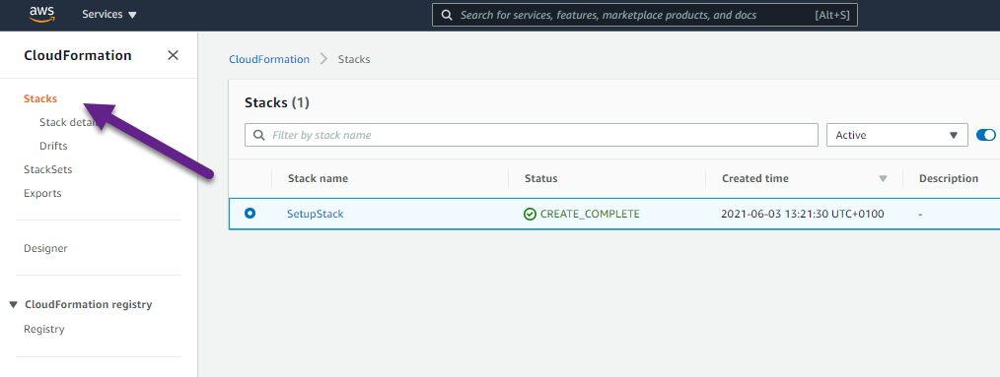

# Cross-service example: Building an Amazon Transcribe streaming app

## Purpose
The cross-service example demonstrates how to build an app that records and transcribes an audio stream in real-time. It
also demonstrates how to translate the transcription and send it via email to your contacts. The app uses the following
AWS services:
- [Amazon Transcribe](https://aws.amazon.com/transcribe/)
- [Amazon Comprehend](https://aws.amazon.com/comprehend/)
- [Amazon Translate](https://aws.amazon.com/translate/)
- [Amazon Simple Email Services (SES)](https://aws.amazon.com/ses/)

The JavaScript SDK Transcribe Streaming client encapsulates the API into a JavaScript 
library that can be run on browsers, Node.js and potentially React Native. By default, 
the client uses HTTP/2 connection on Node.js, and uses WebSocket connection on browsers 
and React Native.


## Prerequisites

To build this cross-service example, you need the following:

* An AWS account. For more information see [AWS SDKs and Tools Reference Guide](https://docs.aws.amazon.com/sdkref/latest/guide/overview.html).
* A project environment to run this Node JavaScript example, and install the required AWS SDK for JavaScript and third-party modules.  For instructions, see [Create a Node.js project environment](#create-a-nodejs-project-environment) on this page.
* At least one email address verified on Amazon SES. For instructions, see [Verifying an email address on Amazon SES](#verifying-an-email-address-on-amazon-ses).
* The following AWS resources:
    - An unauthenticated AWS Identity and Access Management (IAM) user role with the following permissions:
        - ses:SendEmail
        - transcribe:StartStreamTranscriptionWebSocket
        - comprehend:DetectDominantLanguage
        - translate: TranslateText

**Note**: An unauthenticated role enables you to provide permissions to unauthenticated users to use the AWS Services. To create an authenticated role, see [Amazon Cognito Identity Pools (Federated Identities)](https://docs.aws.amazon.com/cognito/latest/developerguide/cognito-identity.html).    
 
 For instructions on creating the minimum resources required for this tutorial, see [Create the resources](#create-the-resources) on this page.


## ⚠ Important
* We recommend that you grant this code least privilege, or at most the minimum permissions required to perform the task. For more information, see [Grant Least Privilege](https://docs.aws.amazon.com/IAM/latest/UserGuide/best-practices.html#grant-least-privilege) in the *AWS Identity and Access Management User Guide*. 
* This code has not been tested in all AWS Regions. Some AWS services are available only in specific [Regions](https://aws.amazon.com/about-aws/global-infrastructure/regional-product-services).
* Running this code might result in charges to your AWS account. We recommend you destroy the resources when you are finished. For instructions, see [Destroying the resources](#destroying-the-resources).
* Running the unit tests might result in charges to your AWS account.

## Create the resources
You can create the AWS resources required for this cross-service example using either of the following:
- [The Amazon CloudFormation](#create-the-resources-using-amazon-cloudformation)
- [The AWS Management Console](#create-the-resources-using-the-aws-management-console)

### Create the resources using Amazon CloudFormation
To run the stack using the AWS CLI:

1. Install and configure the AWS CLI following the instructions in the AWS CLI User Guide.

2. Open the AWS Command Console from the *./transcribe-streaming-app* folder.

3. Run the following command, replacing *STACK_NAME* with a unique name for the stack.
```
aws cloudformation create-stack --stack-name STACK_NAME --template-body file://setup.yaml --capabilities CAPABILITY_IAM
```
**Important**: The stack name must be unique within an AWS Region and AWS account. You can specify up to 128 characters, and numbers and hyphens are allowed.

4. Open [AWS CloudFormation in the AWS Management Console](https://aws.amazon.com/cloudformation/), and open the **Stacks** page.



5. Choose the **Resources** tab. The **Physical ID** of the **IDENTITY_POOL_ID** you require for this cross-service example is displayed.


For more information on the create-stack command parameters, see the [AWS CLI Command Reference guide](https://docs.aws.amazon.com/cli/latest/reference/cloudformation/create-stack.html), and the [AWS CloudFormation User Guide](https://docs.aws.amazon.com/AWSCloudFormation/latest/UserGuide/using-cfn-cli-creating-stack.html).

### Create the resources using the AWS Management Console
####Create an unauthenticated user role
4. Open [AWS Cognito in the AWS Management Console](https://aws.amazon.com/cloudformation/), and open the *Stacks* page.
5. Choose **Manage Identity Pools**.
6. Choose **Create new identity pool**.
7. In the **Identity pool name** field, give your identity pool a name.
7. Select the **Enable access to unauthenticated identities** checkbox.
8. Choose **Create Pool**.
9. Choose **Allow**.
10. Take note of the **Identity pool ID**, which is highlighted in red in the **Get AWS Credentials** section.


11.Choose **Edit identity pool**.
12. Take note of the name of the role in the **Unauthenticated role** field.

####Adding permissions to an unauthenticated user role
13. Open [IAM in the AWS Management Console](https://aws.amazon.com/iam/), and open the *Roles* page.
14. Search for the unauthenticated role you just created.
15. Open the role. 
16. Click the down arrow beside the policy name.
17. Choose **Edit Policy**.
18. Choose the **JSON** tab.
18. Delete the existing content, and paste the code below into it.
```json
{
    "Version": "2012-10-17",
    "Statement": [
        {
            "Action": [
                "mobileanalytics:PutEvents",
                "cognito-sync:*"
            ],
            "Resource": "*",
            "Effect": "Allow"
        },
        {
            "Action": "ses:SendEmail",
            "Resource": "*",
            "Effect": "Allow"
        },
        {
            "Action": "transcribe:StartStreamTranscriptionWebSocket",
            "Resource": "*",
            "Effect": "Allow"
        },
        {
            "Action": "comprehend:DetectDominantLanguage",
            "Resource": "*",
            "Effect": "Allow"
        },
        {
            "Action": "translate:TranslateText",
            "Resource": "*",
            "Effect": "Allow"
        }
    ]
}
```
19. Choose **Review Policy**.
20. Choose **Save Changes**.   

### Verifying an email address on Amazon SES 
1. Open [AWS SES in the AWS Management Console](https://aws.amazon.com/SES/), and open the *Email Addresses* page.
2. Choose **Verify a New Email Address**.
3. Enter a working email address, and choose **Verify This Email Address**.
4. Open the email in your email application, and verify it.

## Create a Node.js project environment

1. Clone the [AWS Code Samples repo](https://github.com/awsdocs/aws-doc-sdk-examples) to your local environment. 
See [the Github documentation](https://docs.github.com/en/github/creating-cloning-and-archiving-repositories/cloning-a-repository) for 
instructions.

2. Run the following commands in sequence in the terminal to install the AWS service client modules and third-party modules listed in the *package.json*:

```
npm install node -g
cd javascriptv3/example_code/cross-services/transcribe-streaming-app
npm install
```
## Building the code
This app runs from the browser, so we create the interface using HTML and CSS. 
The app uses JavaScript to provide basic interactive features, and Node.js to invoke the AWS Services.

### Creating the HTML and CSS
In **index.html**, the **head** section invoke the **recorder.css**, which applies styles to the HTML,
and the **index.js**, which contains JavaScript and Node.js functions used in the app.

Each button on the interface invokes one of these functions when clicked.

### Creating the JavaScript and Node.js
The **./src/libs/** folders contains a file for each of the AWS Service clients required. In the **awsID.js** file, you must
replace "REGION" with your AWS Region (e.g. us-west-2), and replace "IDENTITY_POOL_ID" with the Amazon Cognito identity pool id you created in [Create the resources](#create-the-resources) on this page.

**./src/index.js** imports all the required AWS Service and third party modules and contains the UI logic of the app.

Note: When using the app, make sure you use an email address you verified on Amazon SES in [Create the resources](#create-the-resources) on this page. 

**Important**: You must bundle all the JavaScript and Node.js code required for the app into a single
 file (**main.js**) to run the app.

### Bundling the scripts
This is a static site consisting only of HTML, CSS, and client-side JavaScript. 
However, a build step is required to enable the modules to work natively in the browser.

To bundle the JavaScript and Node.js for this example in a single file named main.js, 
enter the following commands in sequence in the AWS CLI command line:

```
cd javascriptv3/example_code/cross-services/transcribe-streaming-app/
npm run build
```
This will create a minified js file called **main.js** in the src folder.
## Run the app
Open the index.html in src in your favorite browser, and follow the onscreen instructions.

## Destroying the resources
4. Open [AWS CloudFormation in the AWS Management Console](https://aws.amazon.com/cloudformation/), and open the *Stacks* page.


5. Select the stack you created in [Create the resources](#create-the-resources) on this page.

6. Choose **Delete**.
