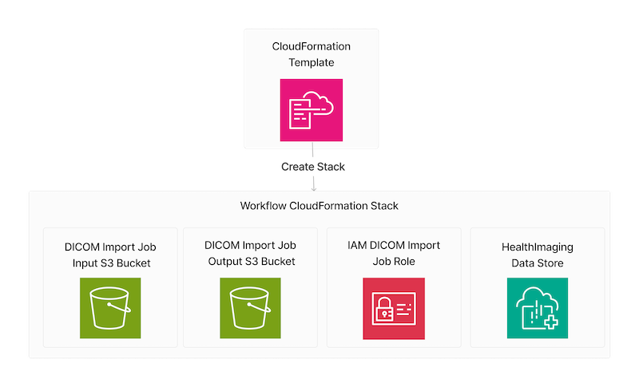
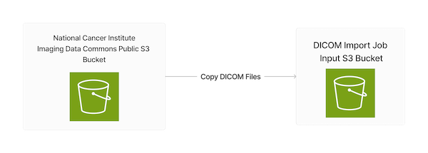
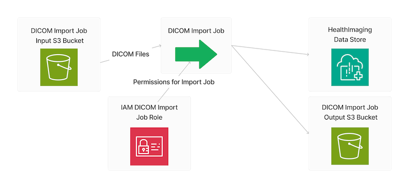
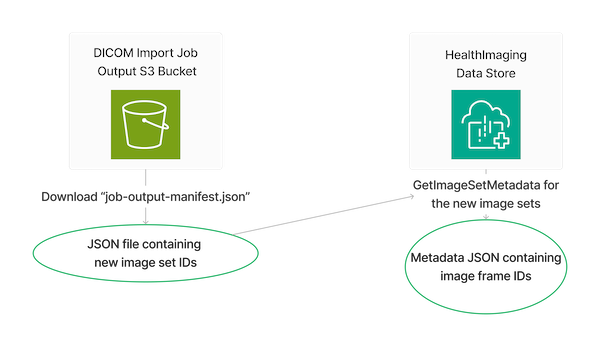

# Import HealthImaging Image Sets and Download Image Frames using the AWS SDK for JavaScript

## Overview

This workflow shows how to use the AWS SDK for JavaScript to import DICOM files into an AWS HealthImaging data store. It then shows how to download, decode, and verify the image frames created by the DICOM import.

Digital Imaging and Communications in Medicine (DICOM) is a technical standard for the digital storage and transmission of medical images and related information.

This workflow runs as a command-line application prompting for user input.

1. All the necessary resources are created from an AWS CloudFormation template.
   1. A HealthImaging data store.
   2. An Amazon Simple Storage Service (Amazon S3) input bucket for a DICOM import job.
   3. An Amazon S3 output bucket for a DICOM import job.
   4. An AWS Identity and Access Management (IAM) role with the appropriate permissions for a DICOM import job.

2. The user chooses a DICOM study to copy from the [National Cancer Institute Imaging Data Commons (IDC) Collections](https://registry.opendata.aws/nci-imaging-data-commons/)' public S3 bucket.

3. The chosen study is copied to the user's input S3 bucket.

4. A HealthImaging DICOM import job is run.

5. The workflow retrieves the IDs for the HealthImaging image frames created by the DICOM import job.

6. The HealthImaging image frames are downloaded, decoded to a bitmap format, and verified using a CRC32 checksum.

7. The created resources can then be deleted, if the user chooses.

## ⚠ Important

- Running this code might result in charges to your AWS account.
- Running the tests might result in charges to your AWS account.
- We recommend that you grant your code least privilege. At most, grant only the minimum permissions required to perform the task. For more information, see [Grant least privilege](https://docs.aws.amazon.com/IAM/latest/UserGuide/best-practices.html#grant-least-privilege).
- This code is not tested in every AWS Region. For more information, see [AWS Regional Services](https://aws.amazon.com/about-aws/global-infrastructure/regional-product-services).

## Scenario

### Prerequisites

For information on prerequisites for running this scenario, see the main [JavaScript V3 README.md](../../../../README.md).

### Run the Scenario

To run the scenario, follow these steps:

1. Clone the [AWS Code Examples Repository](https://github.com/awsdocs/aws-doc-sdk-examples) to your local environment.
2. Navigate to the `javascriptv3/example_code/medical-imaging/scenarios/health-image-sets` directory.
3. Run the scenario by running `node index.js --scenario <deploy | demo | destroy> [-h|--help] [-y|--yes] [-v|--verbose]`

### Deploy
This step will prompt you for a name for the CloudFormation stack and the datastore. It will then deploy the stack.

### Demo
This step copies images from the public bucket, imports them into your datastore, and runs a checksum validation to ensure data integrity.

### Destroy
This step deletes the image sets from the datastore and deletes the CloudFormation stack. It does not delete saved state that is output from the intermediary steps. Those are left behind for reference. You can delete them by running `rm *state.json` in this directory.

## Additional Resources

- [HealthImaging User Guide](https://docs.aws.amazon.com/healthimaging/latest/devguide/what-is.html)
- [HealthImaging API Reference](https://docs.aws.amazon.com/healthimaging/latest/APIReference/Welcome.html)
- [AWS SDK for JavaScript Documentation](https://docs.aws.amazon.com/AWSJavaScriptSDK/latest/index.html)

---

Copyright Amazon.com, Inc. or its affiliates. All Rights Reserved.

SPDX-License-Identifier: Apache-2.0