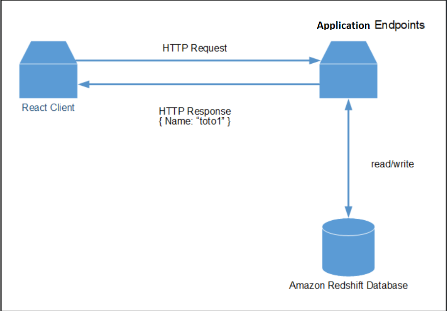
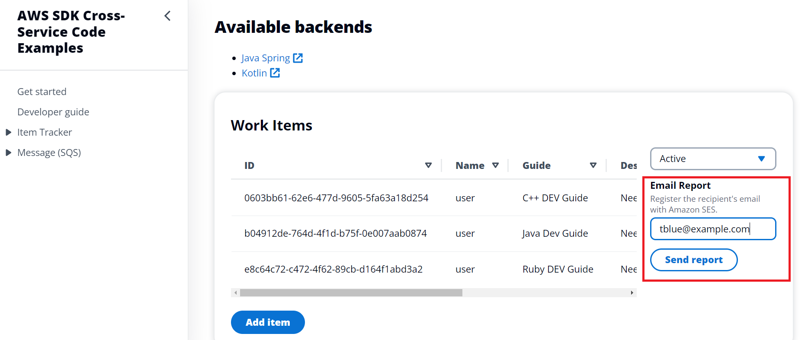
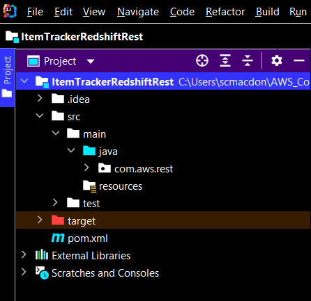

# Building an Amazon Redshift Web Application with Spring Boot

## Overview

| Heading      | Description |
| ----------- | ----------- |
| Description | Discusses how to develop a Spring Boot application that queries Amazon Redshift data. The Spring Boot application uses the AWS SDK for Java (v2) to invoke AWS services and is used by a React application that displays the data. The React application uses Cloudscape. For information, see [Cloudscape](https://cloudscape.design/).    |
| Audience   |  Developer (intermediate)        |
| Updated   | 10/13/2022        |
| Required skills   | Java, Maven, JavaScript  |

## Purpose

You can develop a dynamic web application that tracks and reports on work items by using the following AWS services:

+ Amazon Redshift
+ Amazon Simple Email Service (Amazon SES). (The SDK for Java (v2) is used to access Amazon SES.)

The application you create is a decoupled React application that uses Spring Boot and the Amazon Redshift Java API to return Amazon Redshift data. That is, the React application interacts with a Spring Boot application by making HTTP requests. The Spring Boot application uses a [RedshiftDataClient](https://sdk.amazonaws.com/java/api/latest/software/amazon/awssdk/services/redshiftdata/RedshiftDataClient.html) object to perform CRUD operations on the Amazon Redshift database. Then, the Spring application returns JSON data in an HTTP response, as shown in the following illustration. 



#### Topics

+ Prerequisites
+ Understand the AWS Tracker application
+ Create an IntelliJ project named ItemTrackerRedshiftRest
+ Add the Spring POM dependencies to your project
+ Create the Java classes
+ Create the React front end

## Prerequisites

To complete the tutorial, you need the following:

+ An AWS account.
+ A Java IDE to build the Spring REST API. This tutorial uses the IntelliJ IDE.
+ Java JDK 11. (The code in this example uses APIs that are available in JDK 11).
+ Maven 3.6 or later.
+ Set up your development environment. For more information, 
see [Get started with the SDK for Java](https://docs.aws.amazon.com/sdk-for-java/latest/developer-guide/setup.html). 

### Important

+ The AWS services in this document are included in the [AWS Free Tier](https://aws.amazon.com/free/?all-free-tier.sort-by=item.additionalFields.SortRank&all-free-tier.sort-order=asc).
+  This code has not been tested in all AWS Regions. Some AWS services are available only in specific Regions. For more information, see [AWS Regional Services](https://aws.amazon.com/about-aws/global-infrastructure/regional-product-services). 
+ Running this code might result in charges to your AWS account. 
+ Be sure to delete all of the resources that you create during this tutorial so that you won't be charged.

### Creating the resources

To create the required resources, create an Amazon Redshift cluster and then create a database named **dev**. Next, create a table named **Work** that contains the following fields:

+ **idwork** - A VARCHAR(45) value that represents the PK.
+ **date** - A date value that specifies the date the item was created.
+ **description** - A VARCHAR(400) value that describes the item.
+ **guide** - A VARCHAR(45) value that represents the deliverable being worked on.
+ **status** - A VARCHAR(400) value that describes the status.
+ **username** - A VARCHAR(45) value that represents the user who entered the item.
+ **archive** - A TINYINT(4) value that represents whether this is an active or archive item.

The following image shows the Amazon Redshift **Work** table.


To use the **RedshiftDataClient** object, you must have the following Amazon Redshift values: 

+ The name of the database (for example, dev)
+ The name of the database user that you configured
+ The name of the Amazon Redshift cluster (for example, redshift-cluster-1)

For more information, see [Getting started with Amazon Redshift clusters and data loading](https://docs.aws.amazon.com/redshift/latest/gsg/database-tasks.html).


## Understand the AWS Tracker React application 

A user can perform the following tasks using the React application:

+ View all active items.
+ View archived items that are complete.
+ Add a new item. 
+ Convert an active item into an archived item.
+ Send a report to an email recipient.

The React application displays *active* and *archive* items. For example, the following illustration shows the React application displaying active data.


Likewise, the following illustration shows the React application displaying archived data.


The React application lets a user convert an active item to an archived item by clicking the following button. 


The React application also lets a user enter a new item. 


The user can enter an email recipient into the **Email Report** text field and choose **Send report**.



Active items are queried from the database and used to dynamically create an Excel document. Then, the application uses Amazon SES to email the document to the selected email recipient. The following image shows an example of a report.
## Creating an IntelliJ project named ItemTrackerRedshiftRest

1. In the IntelliJ IDE, choose **File**, **New**, **Project**.
2. In the Project SDK, choose 11.
3. In the **New Project** dialog box, choose **Maven**, and then choose **Next**.
4. For **GroupId**, enter **aws-spring**.
5. For **ArtifactId**, enter **ItemTrackerRedshiftRest**.
6. Choose **Next**.
7. Choose **Finish**.

## Adding the POM dependencies to your project

At this point, you have a new project named **ItemTrackerRedshiftRest**.



**Note:** Make sure to use Java 11 (as shown in the following example).

Confirm that the **pom.xml** file looks like the following example.

```xml
<?xml version="1.0" encoding="UTF-8"?>
<project xmlns="http://maven.apache.org/POM/4.0.0"
         xmlns:xsi="http://www.w3.org/2001/XMLSchema-instance"
         xsi:schemaLocation="http://maven.apache.org/POM/4.0.0 http://maven.apache.org/xsd/maven-4.0.0.xsd">
    <modelVersion>4.0.0</modelVersion>
    <groupId>org.example</groupId>
    <artifactId>ItemTrackerRedshiftRest</artifactId>
    <version>1.0-SNAPSHOT</version>
    <parent>
        <groupId>org.springframework.boot</groupId>
        <artifactId>spring-boot-starter-parent</artifactId>
        <version>2.7.4</version>
        <relativePath/> <!-- lookup parent from repository -->
    </parent>
    <properties>
        <project.build.sourceEncoding>UTF-8</project.build.sourceEncoding>
        <java.version>11</java.version>
    </properties>
    <dependencyManagement>
        <dependencies>
            <dependency>
                <groupId>software.amazon.awssdk</groupId>
                <artifactId>bom</artifactId>
                <version>2.17.146</version>
                <type>pom</type>
                <scope>import</scope>
            </dependency>
        </dependencies>
    </dependencyManagement>
    <dependencies>
        <dependency>
            <groupId>org.junit.jupiter</groupId>
            <artifactId>junit-jupiter-api</artifactId>
            <version>5.9.0</version>
            <scope>test</scope>
        </dependency>
        <dependency>
            <groupId>org.apache.maven.plugins</groupId>
            <artifactId>maven-clean-plugin</artifactId>
            <version>3.2.0</version>
            <type>maven-plugin</type>
        </dependency>
        <dependency>
            <groupId>org.junit.jupiter</groupId>
            <artifactId>junit-jupiter-engine</artifactId>
            <version>5.9.0</version>
            <scope>test</scope>
        </dependency>
        <dependency>
            <groupId>org.junit.platform</groupId>
            <artifactId>junit-platform-commons</artifactId>
            <version>1.9.0</version>
        </dependency>
        <dependency>
            <groupId>org.junit.platform</groupId>
            <artifactId>junit-platform-launcher</artifactId>
            <version>1.9.0</version>
            <scope>test</scope>
        </dependency>
        <dependency>
            <groupId>software.amazon.awssdk</groupId>
            <artifactId>ses</artifactId>
        </dependency>
        <dependency>
            <groupId>org.assertj</groupId>
            <artifactId>assertj-core</artifactId>
            <version>3.23.1</version>
            <scope>test</scope>
        </dependency>
        <dependency>
            <groupId>software.amazon.awssdk</groupId>
            <artifactId>redshift</artifactId>
        </dependency>
        <dependency>
            <groupId>software.amazon.awssdk</groupId>
            <artifactId>redshiftdata</artifactId>
        </dependency>
        <dependency>
            <groupId>software.amazon.awssdk</groupId>
            <artifactId>protocol-core</artifactId>
        </dependency>
        <dependency>
            <groupId>jakarta.mail</groupId>
            <artifactId>jakarta.mail-api</artifactId>
            <version>2.0.1</version>
        </dependency>
        <dependency>
            <groupId>com.sun.mail</groupId>
            <artifactId>jakarta.mail</artifactId>
            <version>1.6.5</version>
        </dependency>
        <dependency>
            <groupId>mysql</groupId>
            <artifactId>mysql-connector-java</artifactId>
            <scope>runtime</scope>
        </dependency>
        <dependency>
            <groupId>net.sourceforge.jexcelapi</groupId>
            <artifactId>jxl</artifactId>
            <version>2.6.12</version>
        </dependency>
        <dependency>
            <groupId>commons-io</groupId>
            <artifactId>commons-io</artifactId>
            <version>2.6</version>
        </dependency>
        <dependency>
            <groupId>org.springframework.boot</groupId>
            <artifactId>spring-boot-starter-web</artifactId>
        </dependency>
        <dependency>
            <groupId>org.springframework.boot</groupId>
            <artifactId>spring-boot-starter-test</artifactId>
            <scope>test</scope>
            <exclusions>
                <exclusion>
                    <groupId>org.junit.vintage</groupId>
                    <artifactId>junit-vintage-engine</artifactId>
                </exclusion>
            </exclusions>
        </dependency>
        <dependency>
            <groupId>org.springframework.data</groupId>
            <artifactId>spring-data-commons</artifactId>
            <version>2.7.3</version>
        </dependency>
    </dependencies>
    <build>
        <plugins>
            <plugin>
                <groupId>org.springframework.boot</groupId>
                <artifactId>spring-boot-maven-plugin</artifactId>
            </plugin>
        </plugins>
    </build>
</project>
```

## Create the Java classes

Create a Java package in the **main/java** folder named **com.aws.rest**. The following Java files go into this package:

+ **App** - The entry point into the Spring boot application.  
+ **MainController** - Represents the Spring Controller that handles HTTP requests to handle data operations.
+ **ReportController** - Represents a second Spring Controller that handles HTTP requests that generates a report.
+ **WorkItemRepository** - A Spring class that uses the AWS SDK for Java (v2) that performs database operations. 
+ **WorkItem** - Represents the application's data model.
+ **WriteExcel** - Uses the Java Excel API to dynamically create a report. (This does not use AWS SDK for Java API operations).

### App class 

The following Java code represents the **App** class. This is the entry point into a Spring boot application. 
```java
package com.aws.rest;

import org.springframework.boot.SpringApplication;
import org.springframework.boot.autoconfigure.SpringBootApplication;

@SpringBootApplication
public class App {
        public static void main(String[] args) {
        SpringApplication.run(App.class, args);
    }
}
```    

### MainController class

The following Java code represents the **MainController** class, which handles HTTP requests for the application. Notice the use of the **CrossOrigin** annotation. This annotation lets the controller accept requests from different domains. 

```java
package com.aws.rest;

import org.springframework.beans.factory.annotation.Autowired;
import org.springframework.context.annotation.ComponentScan;
import org.springframework.web.bind.annotation.CrossOrigin;
import org.springframework.web.bind.annotation.GetMapping;
import org.springframework.web.bind.annotation.PathVariable;
import org.springframework.web.bind.annotation.PostMapping;
import org.springframework.web.bind.annotation.PutMapping;
import org.springframework.web.bind.annotation.RequestBody;
import org.springframework.web.bind.annotation.RequestMapping;
import org.springframework.web.bind.annotation.RequestParam;
import org.springframework.web.bind.annotation.RestController;
import java.time.LocalDateTime;
import java.util.List;
import java.util.Map;
import java.util.UUID;
import java.util.stream.Collectors;
import java.util.stream.StreamSupport;

@ComponentScan(basePackages = {"com.aws.services"})
@CrossOrigin(origins = "*")
@RestController
@RequestMapping("api/items")
public class MainController {
    private final WorkItemRepository repository;

    @Autowired
    MainController(
        WorkItemRepository repository
    ) {
        this.repository = repository;
    }

    @GetMapping("" )
    public List<WorkItem> getItems(@RequestParam(required=false) String archived) {
        Iterable<WorkItem> result;
        if (archived != null && archived.compareTo("false")==0)
           result = repository.getData("0");
        else if (archived != null && archived.compareTo("true")==0)
            result = repository.getData("1");
        else
            result = repository.getData("");

        return StreamSupport.stream(result.spliterator(), false)
            .collect(Collectors.toUnmodifiableList());
    }

    @PutMapping("{id}:archive")
    public String modUser(@PathVariable String id) {
        repository.flipItemArchive(id);
        return id +" was archived";
    }

    @PostMapping("")
    public String addItem(@RequestBody Map<String, String> payload) {
        String name = payload.get("name");
        String guide = payload.get("guide");
        String description = payload.get("description");

        WorkItem item = new WorkItem();
        String workId = UUID.randomUUID().toString();
        String date = LocalDateTime.now().toString();
        item.setId(workId);
        item.setGuide(guide);
        item.setDescription(description);
        item.setName(name);
        item.setDate(date);
        item.setStatus(WorkItemRepository.active);
        return repository.injectNewSubmission(item);
    }
}
```

### ReportController class

The following Java code represents the **ReportController** class. 

```java
package com.aws.rest;

import jxl.write.WriteException;
import org.springframework.beans.factory.annotation.Autowired;
import org.springframework.web.bind.annotation.CrossOrigin;
import org.springframework.web.bind.annotation.PutMapping;
import org.springframework.web.bind.annotation.RequestBody;
import org.springframework.web.bind.annotation.RequestMapping;
import org.springframework.web.bind.annotation.RestController;
import java.io.IOException;
import java.io.InputStream;
import java.util.Map;


@CrossOrigin(origins = "*")
@RestController
@RequestMapping("api/items:report")
public class ReportController {

    private final WorkItemRepository repository;

    private final WriteExcel writeExcel;

    private final WriteExcel.SendMessages sm;
    @Autowired()
    ReportController(
        WorkItemRepository repository,
        WriteExcel writeExcel,
        WriteExcel.SendMessages sm
    ) {
        this.repository = repository;
        this.writeExcel = writeExcel;
        this.sm = sm;
    }

    @PutMapping("")
    public String sendReport(@RequestBody Map<String, String> body) {
        var list = repository.findAllWithStatus(WorkItemRepository.active);
        try {
            InputStream is = writeExcel.write(list);
            sm.sendReport(is, body.get("email"));
            return "Report generated & sent";
        } catch (IOException | WriteException e) {
            e.printStackTrace();
        }
        return "Failed to generate report";
    }
}
```

### WorkItemRepository class

The following Java code represents the **WorkItemRepository** class. Notice that you are required to specify three values (database, database user, and clusterId value) to use the RedshiftDataClient object (as discussed in the Creating the resources section). Without all of these values, your code won't work. To use the RedshiftDataClient, you must create an ExecuteStatementRequest object and specify these values.

In addition, notice the use of [Class SqlParameter](https://sdk.amazonaws.com/java/api/latest/software/amazon/awssdk/services/redshiftdata/model/SqlParameter.html) when using SQL statemenets. For example, in the **getData** method, you build a list of **SqlParameter** objects used to get records from the database.

```java
package com.aws.rest;

import org.springframework.stereotype.Component;
import software.amazon.awssdk.auth.credentials.ProfileCredentialsProvider;
import software.amazon.awssdk.regions.Region;
import software.amazon.awssdk.services.redshiftdata.RedshiftDataClient;
import software.amazon.awssdk.services.redshiftdata.model.DescribeStatementRequest;
import software.amazon.awssdk.services.redshiftdata.model.DescribeStatementResponse;
import software.amazon.awssdk.services.redshiftdata.model.ExecuteStatementRequest;
import software.amazon.awssdk.services.redshiftdata.model.ExecuteStatementResponse;
import software.amazon.awssdk.services.redshiftdata.model.GetStatementResultRequest;
import software.amazon.awssdk.services.redshiftdata.model.GetStatementResultResponse;
import software.amazon.awssdk.services.redshiftdata.model.RedshiftDataException;
import software.amazon.awssdk.services.redshiftdata.model.SqlParameter;
import java.text.ParseException;
import java.text.SimpleDateFormat;
import java.time.LocalDateTime;
import java.time.format.DateTimeFormatter;
import java.util.Date;
import java.util.List;
import java.util.UUID;
import java.util.stream.Collectors;

@Component
public class WorkItemRepository  {
    static final String active = "0";
    static final String archived = "1";
    static final String username = "user";


    // Specify the database name, the database user, and the cluster Id value.
    private static final String database = "dev";
    private static final String dbUser ="awsuser";
    private static final String clusterId = "redshift-cluster-1";

    RedshiftDataClient getClient() {

        Region region = Region.US_WEST_2;
        return RedshiftDataClient.builder()
            .region(region)
            .credentialsProvider(ProfileCredentialsProvider.create())
            .build();
    }

    List<WorkItem> getResults(String statementId) {
        try {
            GetStatementResultRequest resultRequest = GetStatementResultRequest.builder()
                .id(statementId)
                .build();

            GetStatementResultResponse response = getClient().getStatementResult(resultRequest);
            return response
                .records()
                .stream()
                .map(WorkItem::from)
                .collect(Collectors.toUnmodifiableList());

        } catch (RedshiftDataException e) {
            System.err.println(e.getMessage());
            System.exit(1);
        }
        return null;
    }

    // Update the work table.
    void flipItemArchive(String sqlStatement,  List<SqlParameter> parameters ) {
        try {
            ExecuteStatementRequest statementRequest = ExecuteStatementRequest.builder()
                .clusterIdentifier(clusterId)
                .database(database)
                .dbUser(dbUser)
                .sql(sqlStatement)
                .parameters(parameters)
                .build();

            getClient().executeStatement(statementRequest);

        } catch (RedshiftDataException e) {
            System.err.println(e.getMessage());
            System.exit(1);
        }
    }

    void checkStatement(String sqlId ) {
        try {
            DescribeStatementRequest statementRequest = DescribeStatementRequest.builder()
                .id(sqlId)
                .build() ;

            // Wait until the sql statement processing is finished.
            String status;
            while (true) {
                DescribeStatementResponse response = getClient().describeStatement(statementRequest);
                status = response.statusAsString();
                System.out.println("..."+status);

                if (status.compareTo("FINISHED") == 0) {
                    break;
                }
                Thread.sleep(500);
            }
            System.out.println("The statement is finished!");

        } catch (RedshiftDataException | InterruptedException e) {
            System.err.println(e.getMessage());
            System.exit(1);
        }
    }

    ExecuteStatementResponse execute(String sqlStatement, List<SqlParameter> parameters) {
        ExecuteStatementRequest sqlRequest = ExecuteStatementRequest.builder()
            .clusterIdentifier(clusterId)
            .database(database)
            .dbUser(dbUser)
            .sql(sqlStatement)
            .parameters(parameters)
            .build();
        return getClient().executeStatement(sqlRequest);
    }

    ExecuteStatementResponse executeAll(String sqlStatement) {
        ExecuteStatementRequest sqlRequest = ExecuteStatementRequest.builder()
            .clusterIdentifier(clusterId)
            .database(database)
            .dbUser(dbUser)
            .sql(sqlStatement)
            .build();
        return getClient().executeStatement(sqlRequest);
    }


    SqlParameter param(String name, String value) {
        return SqlParameter.builder().name(name).value(value).build();
    }

    // Update the work table.
    public void flipItemArchive(String id ) {
        String arc = "1";
        String sqlStatement = "update work set archive = :arc where idwork =:id ";
        List<SqlParameter> parameters = List.of(
            param("arc", arc),
            param("id", id)
        );

        flipItemArchive(sqlStatement,parameters);
    }

    // Return items from the work table.
    public List<WorkItem> getData(String arch) {
        String sqlStatement;
        List<SqlParameter> parameters;

        // Get all records from the Amazon Redshift table.
        if (arch.compareTo("") == 0) {
            sqlStatement = "SELECT idwork, date, description, guide, status, username FROM work";
            ExecuteStatementResponse response = executeAll(sqlStatement);
            String id = response.id();
            System.out.println("The identifier of the statement is "+id);
            checkStatement(id);
            return getResults(id);
        } else {
            sqlStatement = "SELECT idwork, date, description, guide, status, username " +
                "FROM work WHERE username = :username and archive = :arch ;";

            parameters = List.of(
                param("username", username),
                param("arch", arch)
            );
            ExecuteStatementResponse response = execute(sqlStatement,parameters);
            String id = response.id();
            System.out.println("The identifier of the statement is "+id);
            checkStatement(id);
            return getResults(id);
        }
    }

    public String injectNewSubmission(WorkItem item) {
        try {
            String name = item.getName();
            String guide = item.getGuide();
            String description = item.getDescription();
            String status = item.getStatus();
            String archived = "0";
            UUID uuid = UUID.randomUUID();
            String workId = uuid.toString();

            DateTimeFormatter dtf = DateTimeFormatter.ofPattern("yyyy/MM/dd HH:mm:ss");
            LocalDateTime now = LocalDateTime.now();
            String sDate1 = dtf.format(now);
            Date date1 = new SimpleDateFormat("yyyy/MM/dd").parse(sDate1);
            java.sql.Date sqlDate = new java.sql.Date(date1.getTime());

            String sql = "INSERT INTO work (idwork, username, date, description, guide, status, archive) VALUES" +
                "(:idwork, :username, :date, :description, :guide, :status, :archive);";
            List<SqlParameter> paremeters = List.of(
                param("idwork", workId),
                param("username", name),
                param("date", sqlDate.toString()),
                param("description", description),
                param("guide", guide),
                param("status", status),
                param("archive", archived)
            );

            ExecuteStatementResponse result = execute(sql, paremeters);
            System.out.println(result.toString());
            return workId;
        } catch (ParseException e) {
            e.printStackTrace();
        }
        return "";
    }
}

```

### WorkItem class

The following Java code represents the **WorkItem** class.   

```java
package com.aws.rest;

import software.amazon.awssdk.services.redshiftdata.model.Field;

import java.util.List;

public class WorkItem {
    private String id;
    private String name;
    private String guide;
    private String date;
    private String description;
    private String status;

    public static WorkItem from(List<Field> fields) {
        var item = new WorkItem();
        for (int i = 0; i <= 5; i++) {
            String value = fields.get(i).stringValue();
            switch (i) {
                case 0:
                    item.setId(value);
                    break;
                case 1:
                    item.setDate(value);
                    break;
                case 2:
                    item.setDescription(value);
                    break;
                case 3:
                    item.setGuide(value);
                    break;
                case 4:
                    item.setStatus(value);
                    break;
                case 5:
                    item.setName(value);
                    break;
            }
        }
        return item;
    }

    public void setId(String id) {
        this.id = id;
    }

    public String getId() {
        return this.id;
    }

    public void setStatus(String status) {
        this.status = status;
    }

    public String getStatus() {
        return this.status;
    }

    public void setDescription(String description) {
        this.description = description;
    }

    public String getDescription() {
        return this.description;
    }


    public void setDate(String date) {
        this.date = date;
    }

    public String getDate() {
        return this.date;
    }

    public void setName(String name) {
        this.name = name;
    }

    public String getName() {
        return this.name;
    }

    public void setGuide(String guide) {
        this.guide = guide;
    }

    public String getGuide() {
        return this.guide;
    }
}
```
### WriteExcel class

The **WriteExcel** class dynamically creates an Excel report with the data marked as active. In addition, notice the use of the **SendMessage** class that uses the Amazon SES Java API to send email messages. The following code represents this class.

```java
  package com.aws.rest;

import jxl.CellView;
import jxl.Workbook;
import jxl.WorkbookSettings;
import jxl.format.UnderlineStyle;
import jxl.write.Label;
import jxl.write.WritableCellFormat;
import jxl.write.WritableFont;
import jxl.write.WritableSheet;
import jxl.write.WritableWorkbook;
import jxl.write.WriteException;
import org.apache.commons.io.IOUtils;
import org.springframework.stereotype.Component;
import software.amazon.awssdk.core.SdkBytes;
import software.amazon.awssdk.services.ses.SesClient;
import software.amazon.awssdk.services.ses.model.RawMessage;
import software.amazon.awssdk.services.ses.model.SendRawEmailRequest;
import software.amazon.awssdk.services.ses.model.SesException;
import javax.activation.DataHandler;
import javax.activation.DataSource;
import javax.mail.Message;
import javax.mail.MessagingException;
import javax.mail.Session;
import javax.mail.internet.InternetAddress;
import javax.mail.internet.MimeBodyPart;
import javax.mail.internet.MimeMessage;
import javax.mail.internet.MimeMultipart;
import javax.mail.util.ByteArrayDataSource;
import java.io.ByteArrayInputStream;
import java.io.ByteArrayOutputStream;
import java.io.IOException;
import java.io.InputStream;
import java.nio.ByteBuffer;
import java.util.Locale;
import java.util.Properties;

@Component
public class WriteExcel {
    static WritableCellFormat times ;
    static WritableCellFormat timesBoldUnderline;

    static {
        try {
            WritableFont times10pt = new WritableFont(WritableFont.TIMES, 10);
            times = new WritableCellFormat(times10pt);
            times.setWrap(true);

            WritableFont times10ptBoldUnderline = new WritableFont(WritableFont.TIMES, 10, WritableFont.BOLD, false, UnderlineStyle.SINGLE);
            timesBoldUnderline = new WritableCellFormat(times10ptBoldUnderline);
            timesBoldUnderline.setWrap(true);
        } catch (WriteException e) {
            e.printStackTrace();
        }
    }

    public InputStream write(Iterable<WorkItem> items) throws IOException, WriteException {
        ByteArrayOutputStream os = new ByteArrayOutputStream();
        WorkbookSettings wbSettings = new WorkbookSettings();
        wbSettings.setLocale(new Locale("en", "US"));

        WritableWorkbook workbook = Workbook.createWorkbook(os, wbSettings);
        workbook.createSheet("Work Item Report", 0);
        WritableSheet excelSheet = workbook.getSheet(0);

        addLabels(excelSheet);
        fillContent(excelSheet, items);

        workbook.write();
        workbook.close();

        return new ByteArrayInputStream(os.toByteArray());
    }

    private void addLabels(WritableSheet sheet) throws WriteException {
        CellView cv = new CellView();
        cv.setFormat(timesBoldUnderline);
        cv.setAutosize(true);

        addCaption(sheet, 0, 0, "Writer");
        addCaption(sheet, 1, 0, "Date");
        addCaption(sheet, 2, 0, "Guide");
        addCaption(sheet, 3, 0, "Description");
        addCaption(sheet, 4, 0, "Status");
    }

    private void addCaption(WritableSheet sheet, int column, int row, String s) throws WriteException {
        Label label = new Label(column, row, s, timesBoldUnderline);
        int cc = s.length();
        sheet.setColumnView(column, cc);
        sheet.addCell(label);
    }

    private void addField(WritableSheet sheet, int column, int row, String s) throws WriteException {
        Label label = new Label(column, row, s, timesBoldUnderline);
        int cc = s.length();
        cc = cc > 200 ? 150 : cc + 6;
        sheet.setColumnView(column, cc);
        sheet.addCell(label);
    }

    private void fillContent(WritableSheet sheet, Iterable<WorkItem> items) throws WriteException {
        int row = 2;
        for (WorkItem item : items) {
            addField(sheet, 0, row, item.getName());
            addField(sheet, 1, row, item.getDate());
            addField(sheet, 2, row, item.getGuide());
            addField(sheet, 3, row, item.getDescription());
            addField(sheet, 4, row, item.getStatus());
            row += 1;
        }
    }

    @Component
    public static class SendMessages {
        private static String sender = "<ENTER VALUE>"; // CHANGE THIS VALUE.
        private static String subject = "Weekly AWS Status Report";
        private static String bodyText = "Hello,\r\n\r\nPlease see the attached file for a weekly update.";
        private static String bodyHTML = "<!DOCTYPE html><html lang=\"en-US\"><body><h1>Hello!</h1><p>Please see the attached file for a weekly update.</p></body></html>";
        private static String attachmentName = "WorkReport.xls";

        public void sendReport(InputStream is, String emailAddress) throws IOException {
            byte[] fileContent = IOUtils.toByteArray(is);

            try {
                send(makeEmail(fileContent, emailAddress));
            } catch (MessagingException e) {
                e.printStackTrace();
            }
        }

        public void send(MimeMessage message) throws MessagingException, IOException {
            ByteArrayOutputStream outputStream = new ByteArrayOutputStream();
            message.writeTo(outputStream);
            ByteBuffer buf = ByteBuffer.wrap(outputStream.toByteArray());
            byte[] arr = new byte[buf.remaining()];
            buf.get(arr);
            SdkBytes data = SdkBytes.fromByteArray(arr);
            RawMessage rawMessage = RawMessage.builder().data(data).build();
            SendRawEmailRequest rawEmailRequest = SendRawEmailRequest.builder().rawMessage(rawMessage).build();

            try {
                System.out.println("Attempting to send an email through Amazon SES...");
                SesClient client = SesClient.builder().region(App.region).build();
                client.sendRawEmail(rawEmailRequest);
            } catch (SesException e) {
                e.printStackTrace();
            }
        }

        private MimeMessage makeEmail(byte[] attachment, String emailAddress) throws MessagingException {
            Session session = Session.getDefaultInstance(new Properties());
            MimeMessage message = new MimeMessage(session);

            message.setSubject(subject, "UTF-8");
            message.setFrom(new InternetAddress(sender));
            message.setRecipients(Message.RecipientType.TO, InternetAddress.parse(emailAddress));

            MimeBodyPart textPart = new MimeBodyPart();
            textPart.setContent(bodyText, "text/plain; charset=UTF-8");

            MimeBodyPart htmlPart = new MimeBodyPart();
            htmlPart.setContent(bodyHTML, "text/html; charset=UTF-8");

            MimeMultipart msgBody = new MimeMultipart("alternative");
            msgBody.addBodyPart(textPart);
            msgBody.addBodyPart(htmlPart);

            MimeBodyPart wrap = new MimeBodyPart();
            wrap.setContent(msgBody);

            MimeMultipart msg = new MimeMultipart("mixed");
            msg.addBodyPart(wrap);

            MimeBodyPart att = new MimeBodyPart();
            DataSource fds = new ByteArrayDataSource(attachment, "application/vnc.openxmlformats-officedocument.spreadsheetml.sheet");
            att.setDataHandler(new DataHandler(fds));
            att.setFileName(attachmentName);

            msg.addBodyPart(att);

            message.setContent(msg);

            return message;
        }
    }
}
```
**Note:** Notice that the **SendMessages** is part of this Java file. You must update the email **sender** address with a verified email address. Otherwise, the email is not sent. For more information, see [Verifying email addresses in Amazon SES](https://docs.aws.amazon.com/ses/latest/DeveloperGuide/verify-email-addresses.html).       

## Run the application 

Using the IntelliJ IDE, you can run your Spring REST API. The first time you run it, choose the run icon in the main class. The Spring API supports the following URLs. 

- /api/items - A GET request that returns all data items from the **Work** table. 
- /api/items?archived=true - A GET request that returns either active or archive data items from the **Work** table. 
- /api/items/{id}:archive - A PUT request that converts the specified data item to an archived item. 
- /api/items - A POST request that adds a new item to the database. 
- api/items:report - A POST request that creates a report of active items and emails the report. 

**Note**: The React application created in the next section consumes all of these URLs. 

Confirm that the Spring REST API works by viewing the Active items. Enter the following URL into a browser. 

http://localhost:8080/api/items

The following illustration shows the JSON data returned from the Spring REST API. 


## Create the React front end

You can create the React application that consumes the JSON data returned from the Spring REST API. To create the React application, you can download files from the following GitHub repository. Included in this repository are instructions on how to set up the project. Click the following link to access the GitHub location [Work item tracker web client](https://github.com/awsdocs/aws-doc-sdk-examples/tree/main/resources/clients/react/elwing).  

### Update BASE_URL

You must ensure that the **BASE_URL** is correct. In the **config.json** file, ensure this value references your Spring application.

```javascript
{
  "BASE_URL": "http://localhost:8080/api"
}
```
  
### Next steps
Congratulations, you have created a decoupled React application that consumes data from a Spring Boot application. The Spring Boot application uses the AWS SDK for Java (v2) to invoke AWS services. As stated at the beginning of this tutorial, be sure to delete all of the resources that you create during this tutorial so that you won't continue to be charged.

For more AWS multiservice examples, see
[usecases](https://github.com/awsdocs/aws-doc-sdk-examples/tree/master/javav2/usecases).

