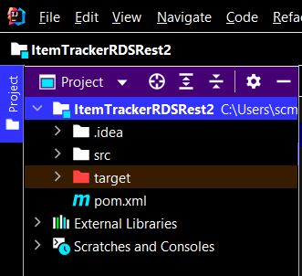

# Creating a React and Spring REST application that queries Amazon Aurora Serverless data

## Overview

| Heading      | Description |
| ----------- | ----------- |
| Description | Discusses how to develop a Spring REST API that queries Amazon Aurora Serverless data. The Spring REST API uses the AWS SDK for Java (v2) to invoke AWS services and is used by a React application that displays the data.   |
| Audience   |  Developer (intermediate)        |
| Updated   | 6/09/2022        |
| Required skills   | Java, Maven, JavaScript  |

## Purpose

You can develop a dynamic web application that tracks and reports on work items by using the following AWS services:

+ Amazon Aurora Serverless database
+ Amazon Simple Email Service (Amazon SES). (The SDK for Java (v2) is used to access Amazon SES.)

The application you create is a decoupled React application that uses a Spring REST API to return Amazon Aurora Serverless data. That is, the React application is a single-page application (SPA) that interacts with a Spring REST API by making RESTful GET and POST requests. The Spring REST API uses an [RdsDataClient](https://sdk.amazonaws.com/java/api/latest/software/amazon/awssdk/services/rdsdata/RdsDataClient.html) object to perform CRUD operations on the Aurora Serverless database. Then, the Spring REST API returns JSON data in an HTTP response, as shown in the following illustration. 


**Note:** You can only use the **RdsDataClient** object for an Aurora Serverless DB cluster or Aurora PostgreSQL. For more information, see [Using the Data API for Aurora Serverless](https://docs.aws.amazon.com/AmazonRDS/latest/AuroraUserGuide/data-api.html).  

#### Topics

+ Prerequisites
+ Understand the AWS Tracker application
+ Create an IntelliJ project named ItemTrackerRDS
+ Add the Spring POM dependencies to your project
+ Create the Java classes
+ Create the React front end

## Prerequisites

To complete the tutorial, you need the following:

+ An AWS account.
+ A Java IDE to build the Spring REST API. This tutorial uses the IntelliJ IDE.
+ Java JDK 1.8.
+ Maven 3.6 or later.
+ Set up your development environment. For more information, 
see [Get started with the SDK for Java](https://docs.aws.amazon.com/sdk-for-java/latest/developer-guide/setup.html). 

### Important

+ The AWS services in this document are included in the [AWS Free Tier](https://aws.amazon.com/free/?all-free-tier.sort-by=item.additionalFields.SortRank&all-free-tier.sort-order=asc).
+  This code has not been tested in all AWS Regions. Some AWS services are available only in specific Regions. For more information, see [AWS Regional Services](https://aws.amazon.com/about-aws/global-infrastructure/regional-product-services). 
+ Running this code might result in charges to your AWS account. 
+ Be sure to delete all of the resources that you create during this tutorial so that you won't be charged.

### Creating the resources

You can use one of the following ways to create the required AWS resources:

- Using the AWS Management console
- Using the AWS Cloud Development Kit

#### Using the AWS Management console

Create an Aurora Serverless database named **jobs**. Next, create a table named **Work** that contains the following fields:

+ **idwork** - A VARCHAR(45) value that represents the PK.
+ **date** - A date value that specifies the date the item was created.
+ **description** - A VARCHAR(400) value that describes the item.
+ **guide** - A VARCHAR(45) value that represents the deliverable being worked on.
+ **status** - A VARCHAR(400) value that describes the status.
+ **username** - A VARCHAR(45) value that represents the user who entered the item.
+ **archive** - A TINYINT(4) value that represents whether this is an active or archive item.

The following figure shows the **Work** table in the Amazon Relational Database Service (Amazon RDS) console.


For more information, see [Creating an Aurora Serverless v1 DB cluster](https://docs.aws.amazon.com/AmazonRDS/latest/AuroraUserGuide/aurora-serverless.create.html).

To successfully connect to the database using the **RdsDataClient** object, set up an AWS Secrets Manager secret to use for authentication. For more information, see [Rotate Amazon RDS database credentials automatically with AWS Secrets Manager](https://aws.amazon.com/blogs/security/rotate-amazon-rds-database-credentials-automatically-with-aws-secrets-manager/). 

To use the **RdsDataClient** object, you must have the following two Amazon Resource Name (ARN) values: 

+ The ARN of an Aurora Serverless database.
+ The ARN of a Secrets Manager secret to use for database access.

**Note:** You must set up inbound rules for the security group to connect to the database. You can set up an inbound rule for your development environment. Setting up an inbound rule essentially means enabling an IP address to use the database. After you set up the inbound rules, you can connect to the database from the REST endpoint. For information about setting up security group inbound rules, see [Controlling Access with Security Groups](https://docs.aws.amazon.com/AmazonRDS/latest/UserGuide/Overview.RDSSecurityGroups.html).  

#### Using the AWS Cloud Development Kit

Using the AWS AWS Cloud Development Kit (AWS CDK), you can set up the resources required for this tutorial. For more information, see [CDK instructions](https://github.com/awsdocs/aws-doc-sdk-examples/tree/main/resources/cdk/aurora_serverless_app/README.md).

## Understand the AWS Tracker React application 

A user can perform the following tasks using the React application:

+ View all active items.
+ View archived items that are complete.
+ Add a new item. 
+ Convert an active item into an archived item.
+ Send a report to an email recipient.

The React SPA displays *active* and *archive* items. For example, the following illustration shows the React application displaying active data.


Likewise, the following illustration shows the React application displaying archived data.


The React SPA also lets a user enter a new item. 


The user can enter an email recipient into the **Manager** text field and choose **Send Report**.


Active items are queried from the database and used to dynamically create an Excel document. Then, the application uses Amazon SES to email the document to the selected email recipient. The following image shows an example of a report.


## Create an IntelliJ project named ItemTrackerRDSRest

1. In the IntelliJ IDE, choose **File**, **New**, **Project**.
2. In the **New Project** dialog box, choose **Maven**, and then choose **Next**.
3. For **GroupId**, enter **aws-spring**.
4. For **ArtifactId**, enter **ItemTrackerRDSRest**.
6. Choose **Next**.
7. Choose **Finish**.

## Add the POM dependencies to your project

At this point, you have a new project named **ItemTrackerRDSRest**.



**Note:** Make sure to use Java 1.8 (as shown in the following example).

Confirm that the **pom.xml** file looks like the following example.

```xml
  <?xml version="1.0" encoding="UTF-8"?>
<project xmlns="http://maven.apache.org/POM/4.0.0"
         xmlns:xsi="http://www.w3.org/2001/XMLSchema-instance"
         xsi:schemaLocation="http://maven.apache.org/POM/4.0.0 http://maven.apache.org/xsd/maven-4.0.0.xsd">
    <modelVersion>4.0.0</modelVersion>
    <groupId>org.example</groupId>
    <artifactId>ItemTrackerRDSRest</artifactId>
    <version>1.0-SNAPSHOT</version>
    <parent>
        <groupId>org.springframework.boot</groupId>
        <artifactId>spring-boot-starter-parent</artifactId>
        <version>2.0.4.RELEASE</version>
        <relativePath /> <!-- lookup parent from repository -->
    </parent>
    <properties>
        <project.build.sourceEncoding>UTF-8</project.build.sourceEncoding>
        <java.version>1.8</java.version>
    </properties>
    <dependencyManagement>
        <dependencies>
            <dependency>
                <groupId>software.amazon.awssdk</groupId>
                <artifactId>bom</artifactId>
                <version>2.17.146</version>
                <type>pom</type>
                <scope>import</scope>
            </dependency>
        </dependencies>
    </dependencyManagement>
    <dependencies>
        <dependency>
            <groupId>org.junit.jupiter</groupId>
            <artifactId>junit-jupiter-api</artifactId>
            <version>5.8.2</version>
            <scope>test</scope>
        </dependency>
        <dependency>
            <groupId>org.junit.jupiter</groupId>
            <artifactId>junit-jupiter-engine</artifactId>
            <version>5.8.2</version>
            <scope>test</scope>
        </dependency>
        <dependency>
            <groupId>org.junit.platform</groupId>
            <artifactId>junit-platform-commons</artifactId>
            <version>1.8.2</version>
        </dependency>
        <dependency>
            <groupId>org.junit.platform</groupId>
            <artifactId>junit-platform-launcher</artifactId>
            <version>1.8.2</version>
            <scope>test</scope>
        </dependency>
        <dependency>
            <groupId>software.amazon.awssdk</groupId>
            <artifactId>ses</artifactId>
        </dependency>
        <dependency>
            <groupId>org.assertj</groupId>
            <artifactId>assertj-core</artifactId>
            <version>3.22.0</version>
            <scope>test</scope>
        </dependency>
        <dependency>
            <groupId>software.amazon.awssdk</groupId>
            <artifactId>rdsdata</artifactId>
        </dependency>
         <dependency>
            <groupId>software.amazon.awssdk</groupId>
            <artifactId>protocol-core</artifactId>
        </dependency>
        <dependency>
            <groupId>jakarta.mail</groupId>
            <artifactId>jakarta.mail-api</artifactId>
            <version>2.0.1</version>
        </dependency>
        <dependency>
            <groupId>com.sun.mail</groupId>
            <artifactId>jakarta.mail</artifactId>
            <version>1.6.5</version>
        </dependency>
        <dependency>
            <groupId>mysql</groupId>
            <artifactId>mysql-connector-java</artifactId>
            <scope>runtime</scope>
        </dependency>
        <dependency>
            <groupId>net.sourceforge.jexcelapi</groupId>
            <artifactId>jxl</artifactId>
            <version>2.6.10</version>
        </dependency>
        <dependency>
            <groupId>commons-io</groupId>
            <artifactId>commons-io</artifactId>
            <version>2.6</version>
        </dependency>
        <dependency>
            <groupId>org.springframework.boot</groupId>
            <artifactId>spring-boot-starter-web</artifactId>
        </dependency>
        <dependency>
            <groupId>org.springframework.boot</groupId>
            <artifactId>spring-boot-starter-test</artifactId>
            <scope>test</scope>
            <exclusions>
                <exclusion>
                    <groupId>org.junit.vintage</groupId>
                    <artifactId>junit-vintage-engine</artifactId>
                </exclusion>
            </exclusions>
        </dependency>
    </dependencies>
    <build>
        <plugins>
            <plugin>
                <groupId>org.springframework.boot</groupId>
                <artifactId>spring-boot-maven-plugin</artifactId>
            </plugin>
        </plugins>
    </build>
</project>
```

## Create the Java classes

Create a Java package in the **main/java** folder named **com.aws.rest**. 


The following Java files go into this package:

+ **App** - The entry point into the Spring boot application.  
+ **MainController** - Represents the Spring Controller that handles REST requests.
+ **RetrieveItems** -  Uses the **RDSDataClient** to retrieve a dataset from the **Work** table. 
+ **InjectWorkService** - Uses the **RDSDataClient** to inject a new item into the **Work** table. 
+ **SendMessage** - Uses the **software.amazon.awssdk.services.ses.SesClient** object to send email messages.
+ **WorkItem** - Represents the application's data model.
+ **WriteExcel** - Uses the Java Excel API to dynamically create a report. (This does not use AWS SDK for Java API operations).

### App class 

The following Java code represents the **App** class. This is the entry point into a Spring boot application.  

```java
   package com.aws.rest;

   import org.springframework.boot.SpringApplication;
   import org.springframework.boot.autoconfigure.SpringBootApplication;

   @SpringBootApplication
   public class App {
     public static void main(String[] args) throws Throwable {
        SpringApplication.run(App.class, args);
     }
   }
```    

### MainController class

The following Java code represents the **MainController** class, which handles HTTP requests for the application. Notice the use of the **CrossOrigin** annotation. This annotation lets the controller accept requests from different domains. 

```java
package com.aws.rest;

import org.springframework.beans.factory.annotation.Autowired;
import org.springframework.web.bind.annotation.GetMapping;
import org.springframework.web.bind.annotation.CrossOrigin;
import org.springframework.web.bind.annotation.RestController;
import org.springframework.web.bind.annotation.RequestMapping;
import org.springframework.web.bind.annotation.PostMapping;
import org.springframework.web.bind.annotation.RequestBody;
import java.io.IOException;
import java.util.List;
import java.util.Map;

@CrossOrigin(origins = "*")
@RestController
@RequestMapping("api/")
public class MainController {

    @Autowired
    RetrieveItems ri;

    @Autowired
    WriteExcel writeExcel;

    @Autowired
    SendMessage sm;

    @Autowired
    InjectWorkService iw;

    @GetMapping("items/{state}")
    public List< WorkItem > getItems(@PathVariable String state) {
        if (state.compareTo("active") == 0)
            return ri.getItemsDataSQLReport(0);
        else
            return ri.getItemsDataSQLReport(1);
    }
    
    // Flip an item from Active to Archive.
    @PutMapping("mod/{id}")
    public String modUser(@PathVariable String id) {
        ri.flipItemArchive(id);
        return id +" was archived";
    }

    // Adds a new item to the database.
    @PostMapping("add")
    String addItems(@RequestBody Map<String, Object> payLoad) {
        String name = "user";
        String guide =  (String)payLoad.get("guide");
        String description =  (String)payLoad.get("description");
        String status = (String)payLoad.get("status");

        // Create a Work Item object to pass to the injestNewSubmission method.
        WorkItem myWork = new WorkItem();
        myWork.setGuide(guide);
        myWork.setDescription(description);
        myWork.setStatus(status);
        myWork.setName(name);

        iw.injestNewSubmission(myWork);
        return "Item added";
    }

    @PutMapping("report/{email}")
    public String sendReport(@PathVariable String email){
        List<WorkItem> theList = ri.getItemsDataSQLReport(0);
        java.io.InputStream is = writeExcel.exportExcel(theList);

        try {
            sm.sendReport(is, email);

        }catch (IOException e) {
            e.getStackTrace();
        }
        return "Report is created";
    }
}


```

### RetrieveItems class

The following Java code represents the **RetrieveItems** class that retrieves data from the **Work** table. Notice that you are required to specify ARN values for Secrets Manager and the Amazon Aurora Serverless database (as discussed in the Creating the resources section). Without both of these values, your code won't work. To use the **RDSDataClient**, you must create an **ExecuteStatementRequest** object and specify both ARN values, the database name, and the SQL statement used to retrieve data from the **Work** table.

```java
     package com.aws.rest;
 
     import java.io.StringWriter;
     import java.util.ArrayList ;
     import java.util.List;
     import org.springframework.stereotype.Component;
     import org.w3c.dom.Document;
     import javax.xml.parsers.DocumentBuilder;
     import javax.xml.parsers.DocumentBuilderFactory;
     import org.w3c.dom.Element;
     import software.amazon.awssdk.regions.Region;
     import software.amazon.awssdk.services.rdsdata.RdsDataClient;
     import software.amazon.awssdk.services.rdsdata.model.*;
     import javax.xml.parsers.ParserConfigurationException;
     import javax.xml.transform.Transformer;
     import javax.xml.transform.TransformerException;
     import javax.xml.transform.TransformerFactory;
     import javax.xml.transform.dom.DOMSource;
     import javax.xml.transform.stream.StreamResult;

     @Component
     public class RetrieveItems {

     private final String secretArn = "<Enter value>" ;
     private final String resourceArn = "<Enter value>" ;

   private RdsDataClient getClient() {

        Region region = Region.US_EAST_1;
        RdsDataClient dataClient = RdsDataClient.builder()
                .region(region)
                .build();

        return dataClient;
    }

    public void flipItemArchive(String id ) {

        RdsDataClient dataClient = getClient();
        int arc = 1;

        try {
            // Specify the SQL statement to query data.
            String sqlStatement = "update work set archive = '"+arc+"' where idwork ='" +id + "' ";
            ExecuteStatementRequest sqlRequest = ExecuteStatementRequest.builder()
                    .secretArn(secretArn)
                    .sql(sqlStatement)
                    .database("jobs")
                    .resourceArn(resourceArn)
                    .build();

            dataClient.executeStatement(sqlRequest);
        } catch (RdsDataException e) {
            e.printStackTrace();
        }
    }

    // Get Items data from the database.
    public List<WorkItem> getItemsDataSQLReport(int arch) {

        RdsDataClient dataClient = getClient();
        String username = "User";
        List<WorkItem>records = new ArrayList<>();

        try {
            String sqlStatement = "Select * FROM work where username = '" +username +"' and archive = " + arch +"";
            ExecuteStatementRequest sqlRequest = ExecuteStatementRequest.builder()
                    .secretArn(secretArn)
                    .sql(sqlStatement)
                    .database("jobs")
                    .resourceArn(resourceArn)
                    .build();

            ExecuteStatementResponse response = dataClient.executeStatement(sqlRequest);
            List<List<Field>> dataList = response.records();

            WorkItem workItem ;
            int index = 0 ;

            // Get the records.
            for (List list: dataList) {

                // New WorkItem object.
                workItem = new WorkItem();
                index = 0;
                for (Object myField : list) {

                    Field field = (Field) myField;
                    String value = field.stringValue();

                    if (index == 0)
                        workItem.setId(value);

                    else if (index == 1)
                        workItem.setDate(value);

                    else if (index == 2)
                        workItem.setDescription(value);

                    else if (index == 3)
                        workItem.setGuide(value);

                    else if (index == 4)
                        workItem.setStatus(value);

                    else if (index == 5)
                        workItem.setName(value);

                    // Increment the index.
                    index++;
                }

                // Push the object to the List.
                records.add(workItem);
            }

            return records;

        } catch (RdsDataException e) {
            e.printStackTrace();
        }
        return null;
    }
}
```

### InjectWorkService class

The following Java code represents the **InjectWorkService** class. Notice that you need to specify ARN values for the secret manager and the Amazon Serverless Aurora database (as discussed in the *Creating the resources* section). Without both of these values, your code does not work. To use the **DSDataClient**, you need to create an **ExecuteStatementRequest** object and specify both ARN values, the database name, and the SQL statement used to submit data to the work table.

```java
     package com.aws.rest;

import java.text.ParseException;
import java.text.SimpleDateFormat;
import java.time.LocalDateTime;
import java.time.format.DateTimeFormatter;
import java.util.Date;
import java.util.UUID;
import org.springframework.stereotype.Component;
import software.amazon.awssdk.regions.Region;
import software.amazon.awssdk.services.rdsdata.RdsDataClient;
import software.amazon.awssdk.services.rdsdata.model.ExecuteStatementRequest;
import software.amazon.awssdk.services.rdsdata.model.RdsDataException;

@Component
public class InjectWorkService {

        private String secretArn = "<Enter value>" ;
        private String resourceArn = "<Enter value>" ;

        // Returns a RdsDataClient object.
        private RdsDataClient getClient() {

                Region region = Region.US_EAST_1;
                RdsDataClient dataClient = RdsDataClient.builder()
                        .region(region)
                        .build();

                return dataClient;
        }

        // Inject a new submission.
        public String injestNewSubmission(WorkItem item) {

                RdsDataClient dataClient = getClient();

                try {

                        // Convert rev to int.
                        String name = item.getName();
                        String guide = item.getGuide();
                        String description = item.getDescription();
                        String status = item.getStatus();
                        int arc = 0;

                        // Generate the work item ID.
                        UUID uuid = UUID.randomUUID();
                        String workId = uuid.toString();

                        // Date conversion.
                        SimpleDateFormat dateFormat = new SimpleDateFormat("yyyy-MM-dd");
                        DateTimeFormatter dtf = DateTimeFormatter.ofPattern("yyyy/MM/dd HH:mm:ss");
                        LocalDateTime now = LocalDateTime.now();
                        String sDate1 = dtf.format(now);
                        Date date1 = new SimpleDateFormat("yyyy/MM/dd").parse(sDate1);
                        java.sql.Date sqlDate = new java.sql.Date( date1.getTime());

                        // Inject an item into the system.
                        String insert = "INSERT INTO work (idwork, username,date,description, guide, status, archive) VALUES('"+workId+"', '"+name+"', '"+sqlDate+"','"+description+"','"+guide+"','"+status+"','"+arc+"');";
                        ExecuteStatementRequest sqlRequest = ExecuteStatementRequest.builder()
                                .secretArn(secretArn)
                                .sql(insert)
                                .database("jobs")
                                .resourceArn(resourceArn)
                                .build();
                        dataClient.executeStatement(sqlRequest);
                        return workId;

                } catch (RdsDataException | ParseException e) {
                        e.printStackTrace();
                }
                return null;
        }

        // Modifies an existing record.
        public String modifySubmission(String id, String desc, String status) {

                RdsDataClient dataClient = getClient();
                try {

                        String query = "update work set description = '"+desc+"', status = '"+status+"' where idwork = '" +id +"'";
                        ExecuteStatementRequest sqlRequest = ExecuteStatementRequest.builder()
                                .secretArn(secretArn)
                                .sql(query)
                                .database("jobs")
                                .resourceArn(resourceArn)
                                .build();
                        dataClient.executeStatement(sqlRequest);
                        return id;

                } catch (RdsDataException e) {
                        e.printStackTrace();
                }
                return null;
        }
}
```

### SendMessage class
The **SendMessage** class uses the AWS SDK for Java (v2) SES API to send an email message with an attachment (the Excel document) to an email recipient. Before you can send the email message, the email address that you're sending it to must be verified. For more information, see [Verifying an email address](https://docs.aws.amazon.com/ses/latest/DeveloperGuide//verify-email-addresses-procedure.html).

The following Java code represents the **SendMessage** class. Notice that an **EnvironmentVariableCredentialsProvider** is used. 

```java
    package com.aws.services;

    import org.apache.commons.io.IOUtils;
    import software.amazon.awssdk.auth.credentials.EnvironmentVariableCredentialsProvider;
    import software.amazon.awssdk.regions.Region;
    import software.amazon.awssdk.services.ses.SesClient;
    import javax.activation.DataHandler;
    import javax.activation.DataSource;
    import javax.mail.Message;
    import javax.mail.MessagingException;
    import javax.mail.Session;
    import javax.mail.internet.InternetAddress;
    import javax.mail.internet.MimeMessage;
    import javax.mail.internet.MimeMultipart;
    import javax.mail.internet.MimeBodyPart;
    import javax.mail.util.ByteArrayDataSource;
    import java.io.ByteArrayOutputStream;
    import java.io.IOException;
    import java.io.InputStream;
    import java.nio.ByteBuffer;
    import java.util.Properties;
    import software.amazon.awssdk.core.SdkBytes;
    import software.amazon.awssdk.services.ses.model.SendRawEmailRequest;
    import software.amazon.awssdk.services.ses.model.RawMessage;
    import software.amazon.awssdk.services.ses.model.SesException;
    import org.springframework.stereotype.Component;

    @Component
    public class SendMessages {

     private String sender = "<ENTER A VALID SEND EMAIL ADDRESS>";

     // The subject line for the email.
     private String subject = "Weekly AWS Status Report";

     // The email body for recipients with non-HTML email clients.
     private String bodyText = "Hello,\r\n" + "Please see the attached file for a weekly update.";

     // The HTML body of the email.
     private String bodyHTML = "<html>" + "<head></head>" + "<body>" + "<h1>Hello!</h1>"
            + "<p>Please see the attached file for a weekly update.</p>" + "</body>" + "</html>";

     public void sendReport(InputStream is, String emailAddress ) throws IOException {

        // Convert the InputStream to a byte[].
        byte[] fileContent = IOUtils.toByteArray(is);

        try {
            send(fileContent,emailAddress);
        } catch (MessagingException e) {
            e.getStackTrace();
        }
    }

    public void send(byte[] attachment, String emailAddress) throws MessagingException, IOException {

        MimeMessage message = null;
        Session session = Session.getDefaultInstance(new Properties());

        // Create a new MimeMessage object.
        message = new MimeMessage(session);

        // Add subject and from and to lines.
        message.setSubject(subject, "UTF-8");
        message.setFrom(new InternetAddress(sender));
        message.setRecipients(Message.RecipientType.TO, InternetAddress.parse(emailAddress));

        // Create a multipart/alternative child container.
        MimeMultipart msgBody = new MimeMultipart("alternative");

        // Create a wrapper for the HTML and text parts.
        MimeBodyPart wrap = new MimeBodyPart();

        // Define the text part.
        MimeBodyPart textPart = new MimeBodyPart();
        textPart.setContent(bodyText, "text/plain; charset=UTF-8");

        // Define the HTML part.
        MimeBodyPart htmlPart = new MimeBodyPart();
        htmlPart.setContent(bodyHTML, "text/html; charset=UTF-8");

        // Add the text and HTML parts to the child container.
        msgBody.addBodyPart(textPart);
        msgBody.addBodyPart(htmlPart);

        // Add the child container to the wrapper object.
        wrap.setContent(msgBody);

        // Create a multipart/mixed parent container.
        MimeMultipart msg = new MimeMultipart("mixed");

        // Add the parent container to the message.
        message.setContent(msg);

        // Add the multipart/alternative part to the message.
        msg.addBodyPart(wrap);

        // Define the attachment.
        MimeBodyPart att = new MimeBodyPart();
        DataSource fds = new ByteArrayDataSource(attachment, "application/vnd.openxmlformats-officedocument.spreadsheetml.sheet");
        att.setDataHandler(new DataHandler(fds));

        String reportName = "WorkReport.xls";
        att.setFileName(reportName);

        // Add the attachment to the message.
        msg.addBodyPart(att);

       // Send the email.
        try {
            System.out.println("Attempting to send an email through Amazon SES " + "using the AWS SDK for Java...");

            Region region = Region.US_WEST_2;
            SesClient client = SesClient.builder()
                    .region(region)
                    .build();

            ByteArrayOutputStream outputStream = new ByteArrayOutputStream();
            message.writeTo(outputStream);

            ByteBuffer buf = ByteBuffer.wrap(outputStream.toByteArray());

            byte[] arr = new byte[buf.remaining()];
            buf.get(arr);

            SdkBytes data = SdkBytes.fromByteArray(arr);

            RawMessage rawMessage = RawMessage.builder()
                    .data(data)
                    .build();

            SendRawEmailRequest rawEmailRequest = SendRawEmailRequest.builder()
                    .rawMessage(rawMessage)
                    .build();

            client.sendRawEmail(rawEmailRequest);

        } catch (SesException e) {
            System.err.println(e.awsErrorDetails().errorMessage());
            System.exit(1);
        }
        System.out.println("Email sent with attachment");
       }
      }
```

**Note:** You must update the email **sender** address with a verified email address. Otherwise, the email is not sent. For more information, see [Verifying email addresses in Amazon SES](https://docs.aws.amazon.com/ses/latest/DeveloperGuide/verify-email-addresses.html).       


### WorkItem class

The following Java code represents the **WorkItem** class.   

```java
    package com.aws.entities;

    public class WorkItem {

     private String id;
     private String name;
     private String guide ;
     private String date;
     private String description;
     private String status;

     public void setId (String id) {
         this.id = id;
     }

     public String getId() {
         return this.id;
     }

     public void setStatus (String status) {
        this.status = status;
     }

     public String getStatus() {
       return this.status;
     }

     public void setDescription (String description) {
        this.description = description;
     }

     public String getDescription() {
       return this.description;
     }

     public void setDate (String date) {
       this.date = date;
     }

     public String getDate() {
       return this.date;
     }

     public void setName (String name) {
       this.name = name;
     }

     public String getName() {
       return this.name;
     }

     public void setGuide (String guide) {
      this.guide = guide;
     }

     public String getGuide() {
      return this.guide;
      }
     }
```
### WriteExcel class

The **WriteExcel** class dynamically creates an Excel report with the data marked as active. The following code represents this class.

```java
   package com.aws.rest;

   import jxl.CellView;
   import jxl.Workbook;
   import jxl.WorkbookSettings;
   import jxl.format.UnderlineStyle;
   import jxl.write.Label;
   import jxl.write.Number;
   import jxl.write.WritableCellFormat;
   import jxl.write.WritableFont;
   import jxl.write.WritableSheet;
   import jxl.write.WritableWorkbook;
   import jxl.write.WriteException;
   import org.springframework.stereotype.Component;
   import java.io.IOException;
   import java.util.List;
   import java.util.Locale;

   @Component
   public class WriteExcel {

    private WritableCellFormat timesBoldUnderline;
    private WritableCellFormat times;

    // Returns an InputStream that represents the Excel report.
    public java.io.InputStream exportExcel( List<WorkItem> list) {

        try {
            java.io.InputStream is = write( list);
            return is ;
        } catch(WriteException | IOException e) {
            e.printStackTrace();
        }
        return null;
    }

    // Generates the report and returns an InputStream.
    public java.io.InputStream write( List<WorkItem> list) throws IOException, WriteException {
        java.io.OutputStream os = new java.io.ByteArrayOutputStream() ;
        WorkbookSettings wbSettings = new WorkbookSettings();

        wbSettings.setLocale(new Locale("en", "EN"));

        // Creates a Workbook and passes the OutputStream.
        WritableWorkbook workbook = Workbook.createWorkbook(os, wbSettings);
        workbook.createSheet("Work Item Report", 0);
        WritableSheet excelSheet = workbook.getSheet(0);
        createLabel(excelSheet) ;
        int size = createContent(excelSheet, list);

        // Closes the workbook.
        workbook.write();
        workbook.close();

        // Gets an InputStream that represents the report.
        java.io.ByteArrayOutputStream stream = new java.io.ByteArrayOutputStream();
        stream = (java.io.ByteArrayOutputStream)os;
        byte[] myBytes = stream.toByteArray();
        java.io.InputStream is = new java.io.ByteArrayInputStream(myBytes) ;

        return is ;
    }

    // Creates Headings in the Excel spreadsheet.
    private void createLabel(WritableSheet sheet)
            throws WriteException {
        
        WritableFont times10pt = new WritableFont(WritableFont.TIMES, 10);
        times = new WritableCellFormat(times10pt);
        times.setWrap(true);

        // Creates a bold font with underlining.
        WritableFont times10ptBoldUnderline = new WritableFont(WritableFont.TIMES, 10, WritableFont.BOLD, false,
                UnderlineStyle.SINGLE);
        timesBoldUnderline = new WritableCellFormat(times10ptBoldUnderline);
        timesBoldUnderline.setWrap(true);

        CellView cv = new CellView();
        cv.setFormat(times);
        cv.setFormat(timesBoldUnderline);
        cv.setAutosize(true);

        // Writes a few headers.
        addCaption(sheet, 0, 0, "Writer");
        addCaption(sheet, 1, 0, "Date");
        addCaption(sheet, 2, 0, "Guide");
        addCaption(sheet, 3, 0, "Description");
        addCaption(sheet, 4, 0, "Status");
    }

    // Writes the Work Item Data to the Excel report.
    private int createContent(WritableSheet sheet, List<WorkItem> list) throws WriteException {

        int size = list.size() ;
        for (int i = 0; i < size; i++) {

            WorkItem wi = list.get(i);
            String name = wi.getName();
            String guide = wi.getGuide();
            String date = wi.getDate();
            String des = wi.getDescription();
            String status = wi.getStatus();

            // First column.
            addLabel(sheet, 0, i+2, name);
            
            // Second column.
            addLabel(sheet, 1, i+2, date);

            // Third column.
            addLabel(sheet, 2, i+2,guide);

            // Forth column.
            addLabel(sheet, 3, i+2, des);

            // Fifth column.
            addLabel(sheet, 4, i+2, status);
        }

       return size;
    }

    private void addCaption(WritableSheet sheet, int column, int row, String s)
            throws WriteException {
        Label label;
        label = new Label(column, row, s, timesBoldUnderline);

        int cc = countString(s);
        sheet.setColumnView(column, cc);
        sheet.addCell(label);
    }

    private void addNumber(WritableSheet sheet, int column, int row,
                           Integer integer) throws WriteException {
        Number number;
        number = new Number(column, row, integer, times);
        sheet.addCell(number);
    }

    private void addLabel(WritableSheet sheet, int column, int row, String s)
            throws WriteException {
        Label label;
        label = new Label(column, row, s, times);
        int cc = countString(s);
        if (cc > 200)
            sheet.setColumnView(column, 150);
        else
            sheet.setColumnView(column, cc+6);

        sheet.addCell(label);

    }

    private int countString (String ss) {
        int count = 0;
        for(int i = 0; i < ss.length(); i++) {
            if(ss.charAt(i) != ' ')
                count++;
        }
        return count;
    }
    }
   }

```


## Run the application 

Using the IntelliJ IDE, you can run your Spring REST API. The first time you run it, choose the run icon in the main class. The Spring API supports the following URLs. 

- /api/items/{state} - A GET request that returns all active or archive data items from the **Work** table. 
- /api/mod/{id} - A PUT request that converts the specified data item to an archived item. 
- /api/add - A POST request that adds a new item to the database. 
- /api/report/{email} - A PUT request that creates a report of active items and emails the report. 

**Note**: The React SPA created in the next section consumes all of these URLs. 

Confirm that the Spring REST API works by viewing the Active items. Enter the following URL into a browser. 

http://localhost:8080/api/items/active

The following illustration shows the JSON data returned from the Spring REST API. 


## Create the React front end

You can create the React SPA that consumes the JSON data returned from the Spring REST API. To create the React SPA, you can download files from the following Github repository. Included in this repository are instructions on how to set up the project. For more information, see [Work item tracker web client](https://github.com/awsdocs/aws-doc-sdk-examples/tree/main/resources/clients/react/item-tracker/README.md).  

You must modify the **AWSServices.js** file so that your React requests work with your Java backend. Update this file to include this code.

```javascript

/**
 * Sends REST requests to get work items, add new work items, modify work items,
 * and send an email report.
 *
 * The base URL of the REST service is stored in config.json. If necessary, update this
 * value to your endpoint.
 */

 import axios from 'axios'
 import configData from './config.json'
 
 /**
  * Sends a POST request to add a new work item.
  *
  * @param item: The work item to add.
  * @returns {Promise<void>}
  */
 export const addWorkItem = async (item) => {
        let status = item.status;
        let description = item.description;
        let guide = item.guide;
        let payload = { status: item.status, description: item.description , guide: item.guide};
        await axios.post(`${configData.BASE_URL}/api/add`, payload);
 };
 
 /**
  * Sends a GET request to retrieve work items that are in the specified state.
  *
  * @param state: The state of work items to retrieve. Can be either 'active' or 'archive'.
  * @returns {Promise<AxiosResponse<any>>}: The list of work items that have the
  *                                         specified state.
  */
 export const getWorkItems = async (state) => {
   return await axios.get(`${configData.BASE_URL}/api/items/${state}`);
 };
 
 /**
  * Sends a PUT request to archive an active item.
  *
  * @param itemId: The ID of the item to archive.
  * @returns {Promise<void>}
  */
 export const archiveItem = async (itemId) => {
   await axios.put(`${configData.BASE_URL}/api/mod/${itemId}`);
 }
 
 /**
  * Sends a POST request to email a report of work items.
  *
  * @param email: The report recipient's email address.
  * @returns {Promise<void>}
  */
 export const mailItem = async (email) => {
   await axios.put(`${configData.BASE_URL}/api/report/${email}`);
 }

```
  
### Next steps
Congratulations, you have created a decoupled React application that consumes data from a Spring REST API. The Spring REST API uses the AWS SDK for Java (v2) to invoke AWS services. As stated at the beginning of this tutorial, be sure to delete all of the resources that you create during this tutorial so that you won't continue to be charged.

For more AWS multiservice examples, see
[usecases](https://github.com/awsdocs/aws-doc-sdk-examples/tree/master/javav2/usecases).


