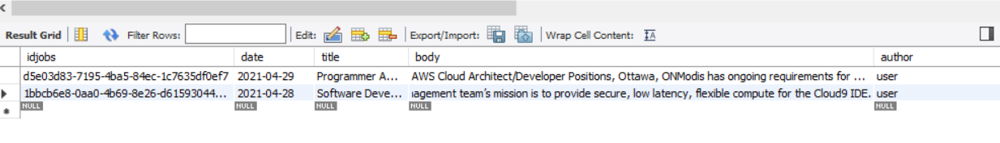
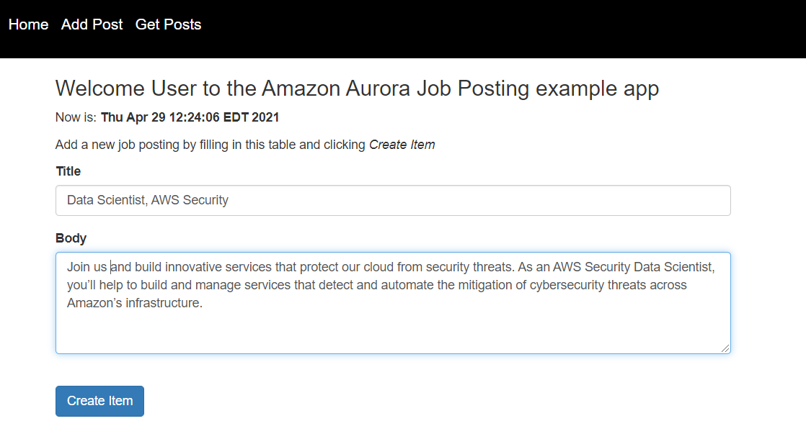
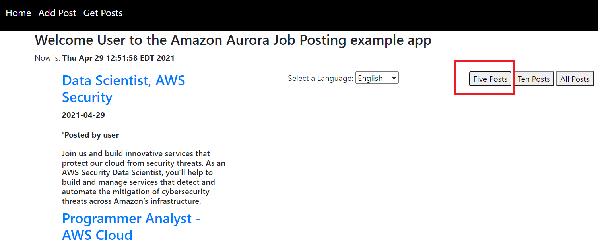
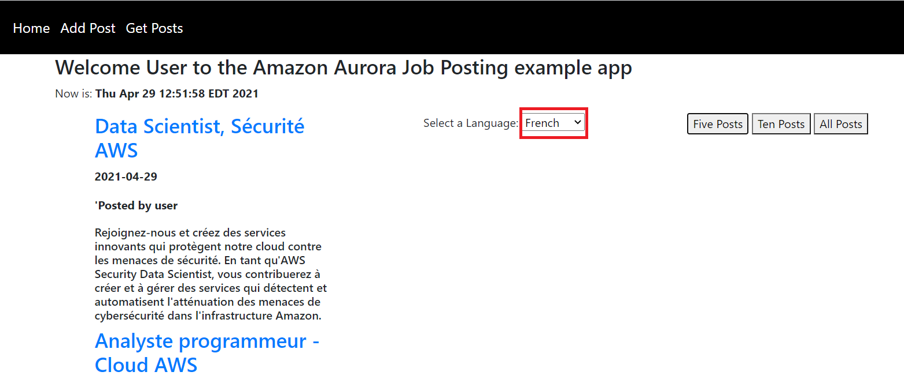
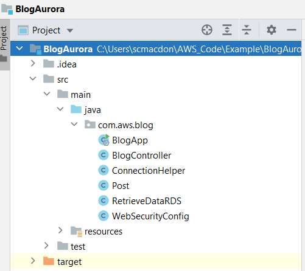

# Creating a Job Posting Site using Amazon Aurora and Amazon Translation Services

## Purpose
You can create a dynamic web application that stores and queries data by using Amazon Aurora. The application created in this AWS tutorial is a job posting web application that lets an employer, an administrator, or human resources staff alert employees or the public about a job opening within a company.

**Note**: Amazon Aurora (Aurora) is a fully managed relational database engine that's compatible with MySQL and PostgreSQL. For more information, see [What is Amazon Aurora?](https://docs.aws.amazon.com/AmazonRDS/latest/AuroraUserGuide/CHAP_AuroraOverview.html).

The data is stored in an Amazon Aurora table named **jobs**, as shown in this illustration. 



The **jobs** table contains these fields: 

- **idjobs**- a varchar field that stores a GUID value and represents the PK.
- **date**- a date field that represents the date when the record was added. 
- **title**- a varchar field that represents the title. 
- **body**- a varchar field that represents the body. 
- **author**-a varchar field that represents the author. 

The application you create uses Spring Boot APIs to build a model, different views, and a controller. This web application also lets a user submit a new job posting that is then stored into the **jobs** table, as shown in this illustation. 



This example application lets you view the posts by choosing the **Get Posts** menu item and choosing one of the available buttons. For example, you can view five recent posts by choosing the **Five Posts** button, as shown in the following illustration.



This application also supports viewing the result set in different languages. For example, if a user wants to view the result set in French, they can choose French from the dropdown field and the data is translated to the given language by using the Amazon Translate Service, as shown in this illustration. 



#### Topics

+ Prerequisites
+ Create an IntelliJ project 
+ Add the POM dependencies to your project
+ Set up the Java packages in your project
+ Create the Java classes
+ Create the HTML files
+ Package the application into a JAR file
+ Deploy the application to Elastic Beanstalk


## Prerequisites

To complete the tutorial, you need the following:

+ An AWS account
+ A Java IDE (this tutorial uses the IntelliJ IDE)
+ Java JDK 1.8
+ Maven 3.6 or later

### Important

+ The AWS services included in this document are included in the [AWS Free Tier](https://aws.amazon.com/free/?all-free-tier.sort-by=item.additionalFields.SortRank&all-free-tier.sort-order=asc).
+  This code has not been tested in all AWS Regions. Some AWS services are available only in specific regions. For more information, see [AWS Regional Services](https://aws.amazon.com/about-aws/global-infrastructure/regional-product-services). 
+ Running this code might result in charges to your AWS account. 
+ Be sure to terminate all of the resources you create while going through this tutorial to ensure that you’re not charged.

### Creating the resources

An Amazon Aurora table named **jobs** that contains the fields described in this tutorial. For information about creating an Amazon Aurora table, see [Getting started with Amazon Aurora](https://docs.aws.amazon.com/AmazonRDS/latest/AuroraUserGuide/CHAP_GettingStartedAurora.html). Set Public access when you create the Aurora database. 

**Note**: You must set up inbound rules for the security group to connect to the database. You can set up one inbound rule for your development environment and another for Elastic Beanstalk (which will host the application). Setting up an inbound rule essentially means enabling an IP address to use the database. Once you set up the inbound rules, you can connect to the database from a client such as MySQL Workbench. For information about setting up security group inbound rules, see [Controlling Access with Security Groups](https://docs.aws.amazon.com/AmazonRDS/latest/UserGuide/Overview.RDSSecurityGroups.html).

## Create an IntelliJ project named BlogAurora

Create an IntelliJ project that is used to create the web application.

1. In the IntelliJ IDE, choose **File**, **New**, **Project**.

2. In the New Project dialog box, choose **Maven**.

3. Choose **Next**.

4. In **GroupId**, enter **spring-aws**.

5. In **ArtifactId**, enter **BlogAurora**.

6. Choose **Next**.

7. Choose **Finish**.

## Add the POM dependencies to your project

At this point, you have a new project named **BlogAurora**. Ensure that the pom.xml file resembles the following code.

```xml
     <?xml version="1.0" encoding="UTF-8"?>
     <project xmlns="http://maven.apache.org/POM/4.0.0"
         xmlns:xsi="http://www.w3.org/2001/XMLSchema-instance"
         xsi:schemaLocation="http://maven.apache.org/POM/4.0.0 http://maven.apache.org/xsd/maven-4.0.0.xsd">
     <modelVersion>4.0.0</modelVersion>
     <groupId>aws-spring</groupId>
     <artifactId>BlogAurora</artifactId>
     <version>1.0-SNAPSHOT</version>
     <packaging>jar</packaging>
     <parent>
        <groupId>org.springframework.boot</groupId>
        <artifactId>spring-boot-starter-parent</artifactId>
        <version>2.0.4.RELEASE</version>
        <relativePath /> <!-- lookup parent from repository -->
     </parent>
     <properties>
        <project.build.sourceEncoding>UTF-8</project.build.sourceEncoding>
        <java.version>1.8</java.version>
     </properties>
     <dependencyManagement>
        <dependencies>
            <dependency>
                <groupId>software.amazon.awssdk</groupId>
                <artifactId>bom</artifactId>
                <version>2.15.14</version>
                <type>pom</type>
                <scope>import</scope>
            </dependency>
        </dependencies>
     </dependencyManagement>
     <dependencies>
        <dependency>
            <groupId>org.assertj</groupId>
            <artifactId>assertj-core</artifactId>
            <version>3.8.0</version>
            <scope>test</scope>
        </dependency>
        <dependency>
            <groupId>org.springframework.boot</groupId>
            <artifactId>spring-boot-starter-thymeleaf</artifactId>
        </dependency>
        <dependency>
            <groupId>mysql</groupId>
            <artifactId>mysql-connector-java</artifactId>
            <version>8.0.21</version>
        </dependency>
        <dependency>
            <groupId>software.amazon.awssdk</groupId>
            <artifactId>translate</artifactId>
        </dependency>
        <dependency>
            <groupId>org.webjars</groupId>
            <artifactId>bootstrap</artifactId>
            <version>3.3.7</version>
        </dependency>
        <dependency>
            <groupId>org.webjars</groupId>
            <artifactId>jquery</artifactId>
            <version>3.2.1</version>
        </dependency>
        <dependency>
            <groupId>commons-io</groupId>
            <artifactId>commons-io</artifactId>
            <version>2.6</version>
        </dependency>
        <dependency>
            <groupId>org.springframework.boot</groupId>
            <artifactId>spring-boot-starter-web</artifactId>
        </dependency>
        <dependency>
            <groupId>org.springframework.boot</groupId>
            <artifactId>spring-boot-starter-security</artifactId>
        </dependency>
        <dependency>
            <groupId>org.springframework.security</groupId>
            <artifactId>spring-security-test</artifactId>
            <scope>test</scope>
        </dependency>
        <dependency>
            <groupId>org.springframework.boot</groupId>
            <artifactId>spring-boot-starter-test</artifactId>
            <scope>test</scope>
            <exclusions>
                <exclusion>
                    <groupId>org.junit.vintage</groupId>
                    <artifactId>junit-vintage-engine</artifactId>
                </exclusion>
            </exclusions>
        </dependency>
     </dependencies>
     <build>
        <plugins>
            <plugin>
                <groupId>org.springframework.boot</groupId>
                <artifactId>spring-boot-maven-plugin</artifactId>
            </plugin>
        </plugins>
     </build>
    </project>
```

 ## Create the Java classes
 
 Create a Java package in the main/java folder named **com.aws.blog**. This Java classes go into this package. 
 
 
 
 Create these Java classes:

+ **BlogApp** - Used as the base class for the Spring Boot application.
+ **BlogController** - Used as the Spring Boot controller that handles HTTP requests. 
+ **ConnectionHelper** - Used to open a connection to the Aurora database. 
+ **Post** - Used as the applications model that stores application data.
+ **RetrieveDataRDS** - Used as the Spring Service that uses the Java JDBC API and the Amazon Translate Java API V2. 
+ **WebSecurityConfig** - The role of this class is to set up an in-memory user store that contains a single user (the user name is **user** and the password is **password**).

### BlogApp class

The following Java code represents the **BlogApp** class.

```java
     package com.aws.blog;

     import org.springframework.boot.SpringApplication;
     import org.springframework.boot.autoconfigure.SpringBootApplication;

     @SpringBootApplication
     public class BlogApp {

     public static void main(String[] args) throws Throwable {
        SpringApplication.run(BlogApp.class, args);
      }
     }
```

### BlogController class

The following Java code represents the **BlogController** class.

```java
     package com.aws.blog;

     import org.springframework.security.core.context.SecurityContextHolder;
     import org.springframework.stereotype.Controller;
     import org.springframework.ui.Model;
     import org.springframework.web.bind.annotation.GetMapping;
     import org.springframework.web.bind.annotation.RequestMapping;
     import org.springframework.web.bind.annotation.ResponseBody;
     import org.springframework.web.bind.annotation.RequestMethod;
     import javax.servlet.http.HttpServletRequest;
     import javax.servlet.http.HttpServletResponse;
     import org.springframework.beans.factory.annotation.Autowired;

    @Controller
    public class BlogController {

    @Autowired
    RetrieveDataRDS rdsData;

    @GetMapping("/")
    public String root() {
        return "index";
    }

    @GetMapping("/add")
    public String add() {
        return "add";
    }

    @GetMapping("/posts")
    public String post() {
        return "post";
    }

    @GetMapping("/login")
    public String login(Model model) {
        return "login";
    }

    // Adds a new item to the database.
    @RequestMapping(value = "/addPost", method = RequestMethod.POST)
    @ResponseBody
    String addItems(HttpServletRequest request, HttpServletResponse response) {

        String name = getLoggedUser();
        String title = request.getParameter("title");
        String body = request.getParameter("body");
        return rdsData.addRecord(name, title, body);
     }

    // Queries items from the Aurora database.
    @RequestMapping(value = "/getPosts", method = RequestMethod.POST)
    @ResponseBody
    String getPosts(HttpServletRequest request, HttpServletResponse response) {

        String num = request.getParameter("number");
        String lang = request.getParameter("lang");
        return rdsData.getPosts(lang,Integer.parseInt(num));
    }

    private String getLoggedUser() {

        // Get the logged-in user.
        org.springframework.security.core.userdetails.User user2 = (org.springframework.security.core.userdetails.User) SecurityContextHolder.getContext().getAuthentication().getPrincipal();
        return user2.getUsername();
     }
    }

```

### Post class

The following Java code represents the **Post** class.

```java
    package com.aws.blog;

    public class Post {

    private String id;
    private String title;
    private String body;
    private String author;
    private String date ;

    public void setDate(String date) {
        this.date = date;
    }

    public String getDate() {
        return this.date ;
    }


    public void setAuthor(String author) {
        this.author = author;
    }

    public String getAuthor() {
        return this.author ;
    }


    public void setBody(String body) {
        this.body = body;
    }

    public String getBody() {
        return this.body ;
    }

    public void setTitle(String title) {
        this.title = title;
    }

    public String getTitle() {
        return this.title ;
    }

    public void setId(String id) {
        this.id = id;
    }

    public String getId() {
        return this.id ;
     }
    }
```

### RetrieveDataRDS class

The following Java code represents the **RetrieveDataRDS** class. This class uses the Java JDBC API (V2) to interact with data located the **jobs** table.  For example, the **getPosts** method returns a result set that is queried from the **jobs** table and displayed in the view. Likewise, the **addRecord** method adds a new record to the **jobs** table. This class also uses the Amazon Translate Java V2 API to translation the result set if requested by the user. 

```java
     package com.aws.blog;

     import org.springframework.stereotype.Component;
     import software.amazon.awssdk.auth.credentials.EnvironmentVariableCredentialsProvider;
     import software.amazon.awssdk.regions.Region;
     import org.w3c.dom.Document;
     import org.w3c.dom.Element;
     import software.amazon.awssdk.services.translate.TranslateClient;
     import software.amazon.awssdk.services.translate.model.TranslateException;
     import software.amazon.awssdk.services.translate.model.TranslateTextRequest;
     import software.amazon.awssdk.services.translate.model.TranslateTextResponse;
     import javax.xml.parsers.DocumentBuilder;
     import javax.xml.parsers.DocumentBuilderFactory;
     import javax.xml.parsers.ParserConfigurationException;
     import javax.xml.transform.Transformer;
     import javax.xml.transform.TransformerException;
     import javax.xml.transform.TransformerFactory;
     import javax.xml.transform.dom.DOMSource;
     import javax.xml.transform.stream.StreamResult;
     import java.io.StringWriter;
     import java.text.ParseException;
     import java.text.SimpleDateFormat;
     import java.time.LocalDateTime;
     import java.time.format.DateTimeFormatter;
     import java.util.ArrayList;
     import java.util.Date;
     import java.util.List;
     import java.util.UUID;
     import java.sql.*;

     @Component
     public class RetrieveDataRDS {

    // Add a new record to the Amazon Aurora table.
    public String addRecord(String author, String title, String body) {

        Connection c = null;

        try {

            // Create a Connection object
            c = ConnectionHelper.getConnection();

            UUID uuid = UUID.randomUUID();
            String id = uuid.toString();

            // Date conversion.
            DateTimeFormatter dtf = DateTimeFormatter.ofPattern("yyyy/MM/dd HH:mm:ss");
            LocalDateTime now = LocalDateTime.now();
            String sDate1 = dtf.format(now);
            Date date1 = new SimpleDateFormat("yyyy/MM/dd").parse(sDate1);
            java.sql.Date sqlDate = new java.sql.Date( date1.getTime());

            // Use prepared statements
            PreparedStatement ps = null;

            // Inject an item into the system
            String insert = "INSERT INTO jobs (idjobs, date,title,body, author) VALUES(?,?,?,?,?);";
            ps = c.prepareStatement(insert);
            ps.setString(1, id);
            ps.setDate(2, sqlDate);
            ps.setString(3, title);
            ps.setString(4, body);
            ps.setString(5, author );
            ps.execute();

            return id;

        } catch (ParseException | SQLException e) {
            System.err.println(e.getMessage());
            System.exit(1);
        }
        return null;
      }


       // Returns a collection from the Aurora table.
       public String getPosts(String lang, int num) {

        Connection c = null;

        try {

            // Create a Connection object
            c = ConnectionHelper.getConnection();

            String sqlStatement="";
            if (num ==5)
                sqlStatement = "Select * from jobs order by date DESC LIMIT 5 ; ";
            else if (num ==10)
                sqlStatement = "Select * from jobs order by date DESC LIMIT 10 ; ";
            else
                sqlStatement = "Select * from jobs order by date DESC" ;

            PreparedStatement pstmt = null;
            ResultSet rs = null;
            List<Post> posts = new ArrayList<>();
            Post post = null;

            pstmt = c.prepareStatement(sqlStatement);
            rs = pstmt.executeQuery();
            String title = "";
            String body = "";

            while (rs.next()) {

                post = new Post();
                post.setId(rs.getString(1));
                post.setDate(rs.getDate(2).toString());

                title = rs.getString(3);
                if (!lang.equals("English"))
                    title = translateText(title, lang);

                post.setTitle(title);
                body= rs.getString(4);
                if (!lang.equals("English"))
                    body = translateText(body, lang);

                post.setBody(body);
                post.setAuthor(rs.getString(5));

                // Push post to the list
                posts.add(post);
            }

            return convertToString(toXml(posts));

        } catch ( SQLException e) {
            System.err.println(e.getMessage());
            System.exit(1);
        }
        return "";
    }


    private String translateText(String text, String lang) {

        Region region = Region.US_WEST_2;
        TranslateClient translateClient = TranslateClient.builder()
                .credentialsProvider(EnvironmentVariableCredentialsProvider.create())
                .region(region)
                .build();
        String transValue = "";
        try {

            if (lang.compareTo("French")==0) {

                TranslateTextRequest textRequest = TranslateTextRequest.builder()
                        .sourceLanguageCode("en")
                        .targetLanguageCode("fr")
                        .text(text)
                        .build();

                TranslateTextResponse textResponse = translateClient.translateText(textRequest);
                transValue = textResponse.translatedText();

            } else if (lang.compareTo("Russian")==0) {

                TranslateTextRequest textRequest = TranslateTextRequest.builder()
                        .sourceLanguageCode("en")
                        .targetLanguageCode("ru")
                        .text(text)
                        .build();

                TranslateTextResponse textResponse = translateClient.translateText(textRequest);
                transValue = textResponse.translatedText();


            } else if (lang.compareTo("Japanese")==0) {

                TranslateTextRequest textRequest = TranslateTextRequest.builder()
                        .sourceLanguageCode("en")
                        .targetLanguageCode("ja")
                        .text(text)
                        .build();

                TranslateTextResponse textResponse = translateClient.translateText(textRequest);
                transValue = textResponse.translatedText();


            } else if (lang.compareTo("Spanish")==0) {

                TranslateTextRequest textRequest = TranslateTextRequest.builder()
                        .sourceLanguageCode("en")
                        .targetLanguageCode("es")
                        .text(text)
                        .build();

                TranslateTextResponse textResponse = translateClient.translateText(textRequest);
                transValue = textResponse.translatedText();

            } else {

                TranslateTextRequest textRequest = TranslateTextRequest.builder()
                        .sourceLanguageCode("en")
                        .targetLanguageCode("zh")
                        .text(text)
                        .build();

                TranslateTextResponse textResponse = translateClient.translateText(textRequest);
                transValue = textResponse.translatedText();
            }

            return transValue;

        } catch (TranslateException e) {
            System.err.println(e.getMessage());
            System.exit(1);
        }

        return "";
      }

     // Convert the list to XML to pass back to the view.
     private Document toXml(List<Post> itemsList) {

        try {
            DocumentBuilderFactory factory = DocumentBuilderFactory.newInstance();
            DocumentBuilder builder = factory.newDocumentBuilder();
            Document doc = builder.newDocument();

            // Start building the XML.
            Element root = doc.createElement("Items");
            doc.appendChild(root);

            // Iterate through the collection.
            for (Post post : itemsList) {

                Element item = doc.createElement("Item");
                root.appendChild(item);

                // Set Id.
                Element id = doc.createElement("Id");
                id.appendChild(doc.createTextNode(post.getId()));
                item.appendChild(id);

                // Set Date.
                Element name = doc.createElement("Date");
                name.appendChild(doc.createTextNode(post.getDate()));
                item.appendChild(name);

                // Set Title.
                Element date = doc.createElement("Title");
                date.appendChild(doc.createTextNode(post.getTitle()));
                item.appendChild(date);

                // Set Content.
                Element desc = doc.createElement("Content");
                desc.appendChild(doc.createTextNode(post.getBody()));
                item.appendChild(desc);

                // Set Author.
                Element guide = doc.createElement("Author");
                guide.appendChild(doc.createTextNode(post.getAuthor()));
                item.appendChild(guide);
            }

            return doc;

        }catch(ParserConfigurationException e){
            e.printStackTrace();
        }
        return null;
    ,}

     private String convertToString(Document xml) {
        try {
            Transformer transformer = TransformerFactory.newInstance().newTransformer();
            StreamResult result = new StreamResult(new StringWriter());
            DOMSource source = new DOMSource(xml);
            transformer.transform(source, result);
            return result.getWriter().toString();

        } catch(TransformerException ex) {
            ex.printStackTrace();
        }
        return null;
      }
     }
```

### ConnectionHelper class

The following Java code represents the **ConnectionHelper** class.

```java
    package com.aws.jdbc;

    import java.sql.Connection;
    import java.sql.DriverManager;
    import java.sql.SQLException;

    public class ConnectionHelper {

      private String url;
      private static ConnectionHelper instance;

      private ConnectionHelper() {
          url = "jdbc:mysql://localhost:3306/mydb?useSSL=false";
       }

      public static Connection getConnection() throws SQLException {
         if (instance == null) {
            instance = new ConnectionHelper();
         }
         try {

            Class.forName("com.mysql.jdbc.Driver").newInstance();
            return DriverManager.getConnection(instance.url, "root","root");
        } catch (SQLException | ClassNotFoundException | InstantiationException | IllegalAccessException e) {
            e.getStackTrace();
        }
        return null;
    	}

       public static void close(Connection connection) {
         try {
            if (connection != null) {
                connection.close();
            }
        } catch (SQLException e) {
            e.printStackTrace();
        }
      }
     }
```

**Note:** The **URL** value is **localhost:3306**. Replace this value is modified with the endpoint of the Aurora database. You must also ensure that you specify the user name and password for your Aurora instance; otherwise your connection does not work.


### WebSecurityConfig class

The following Java code represents the **WebSecurityConfig** class. The role of this class is to ensure only authenticated users can view the application.

```java
     package com.aws.blog;

     import org.springframework.context.annotation.Bean;
     import org.springframework.context.annotation.Configuration;
     import org.springframework.security.config.annotation.authentication.builders.AuthenticationManagerBuilder;
     import org.springframework.security.config.annotation.web.builders.HttpSecurity;
     import org.springframework.security.config.annotation.web.configuration.EnableWebSecurity;
     import org.springframework.security.config.annotation.web.configuration.WebSecurityConfigurerAdapter;
     import org.springframework.security.crypto.bcrypt.BCryptPasswordEncoder;
     import org.springframework.security.crypto.password.PasswordEncoder;
     import org.springframework.security.web.util.matcher.AntPathRequestMatcher;

     @Configuration
     @EnableWebSecurity
     public class WebSecurityConfig extends WebSecurityConfigurerAdapter {
    
    @Override
    protected void configure(HttpSecurity http) throws Exception {
        http
                .authorizeRequests()
                .antMatchers(
                        "/js/**",
                        "/css/**",
                        "/img/**",
                        "/webjars/**").permitAll()
                .anyRequest().authenticated()
                .and()
                .formLogin()
                .loginPage("/login")
                .permitAll()
                .and()
                .logout()
                .invalidateHttpSession(true)
                .clearAuthentication(true)
                .logoutRequestMatcher(new AntPathRequestMatcher("/logout"))
                .logoutSuccessUrl("/login?logout")
                .permitAll();

          http.csrf().disable();
         }


       @Override
       protected void configure(AuthenticationManagerBuilder auth) throws Exception {
        auth.inMemoryAuthentication()
                .passwordEncoder(passwordEncoder())
                .withUser("user")
                .password(passwordEncoder().encode("password"))
                .roles("USER");
       }

      @Bean
      public PasswordEncoder passwordEncoder() {
        return new BCryptPasswordEncoder();
      }
     }
```    
**Note**: In this example, the user credentials to log into the application are **user** and **password**.    

## Create the HTML file

At this point, you have created all of the Java files required for this example application. Now create HTML files that are required for the application's view. Under the resource folder, create a **templates** folder, and then create the following HTML files:

+ index.html
+ layout.html
+ post.html
+ add.html
+ login.html

### index.html
The **index.html** file is the application's home view. 

```html
    <!DOCTYPE html>
    <html xmlns:th="http://www.thymeleaf.org" xmlns:sec="http://www.thymeleaf.org/thymeleaf-extras-springsecurity3">

    <head>
    <meta charset="utf-8" />
    <meta http-equiv="X-UA-Compatible" content="IE=edge" />
    <meta name="viewport" content="width=device-width, initial-scale=1" />

    <link rel="stylesheet" th:href="|https://maxcdn.bootstrapcdn.com/bootstrap/3.3.7/css/bootstrap.min.css|"/>
    <link rel="stylesheet" href="../public/css/styles.css" th:href="@{/css/styles.css}" />
    <link rel="icon" href="../public/img/favicon.ico" th:href="@{/img/favicon.ico}" />

    <title>AWS Job Posting Example</title>
    </head>

    <body>
    <header th:replace="layout :: site-header"/>
    <div class="container">

    <h3>Welcome <span sec:authentication="principal.username">User</span> to the Amazon Redshift Job Posting example app</h3>
    <p>Now is: <b th:text="${execInfo.now.time}"></b></p>

    <h2>Amazon Redshift Job Posting Example</h2>

    <p>The Amazon Redshift Job Posting Example application uses multiple AWS Services and the Java V2 API. Perform these steps:<p>

    <ol>
        <li>Enter work items into the system by choosing the <i>Add Posts</i> menu item. Fill in the form and then choose <i>Create Item</i>.</li>
        <li>The sample application stores the data by using the Amazon Redshift Java API V2.</li>
        <li>You can view the items by choosing the <i>Get Posts</i> menu item. Next, select a language.</li>
        <li>You can view the items by chooing either the <b>Five Posts</b>, <b>Ten Posts</b>, or <b>All Posts</b> button. </li>
        <li>The items appear in the page from newest to oldest.</li>
    </ol>
    <div>
    </body>
    </html>
```
	    
### layout.html
The following code represents the **layout.html** file that represents the application's menu.

```html
     <!DOCTYPE html>
     <html xmlns:th="http://www.thymeleaf.org" xmlns:sec="http://www.thymeleaf.org/thymeleaf-extras-springsecurity3">
     <head th:fragment="site-head">
     <meta charset="UTF-8" />
     <link rel="icon" href="../public/img/favicon.ico" th:href="@{/img/favicon.ico}" />
     <script th:src="|https://code.jquery.com/jquery-1.12.4.min.js|"></script>
     <meta th:include="this :: head" th:remove="tag"/>
    </head>
    <body>
     <!-- th:hef calls a controller method - which returns the view -->
     <header th:fragment="site-header">
     <a href="#" style="color: white" th:href="@{/}">Home</a>
     <a href="#" style="color: white" th:href="@{/add}">Add Post</a>
     <a href="#"  style="color: white" th:href="@{/posts}">Get Posts</a>
     <div id="logged-in-info">

        <form method="post" th:action="@{/logout}">
            <input type="submit"  value="Logout"/>
        </form>
    </div>
    </header>
    <h1>Welcome</h1>
    <body>
    <p>Welcome to  AWS Blog application.</p>
    </body>
    </html>
```

### add.html
The **add.html** file is the application's view that lets users post new items. 

```html
      <!DOCTYPE html>
      <html xmlns:th="http://www.thymeleaf.org" xmlns:sec="http://www.thymeleaf.org/thymeleaf-extras-springsecurity3">

     <head>
     <meta charset="UTF-8" />
     <title>Blog</title>

     <script th:src="|https://code.jquery.com/jquery-1.12.4.min.js|"></script>
     <script src="../public/js/contact_me.js" th:src="@{/js/contact_me.js}"></script>
     <link rel="stylesheet" th:href="|https://maxcdn.bootstrapcdn.com/bootstrap/3.3.7/css/bootstrap.min.css|"/>
     <link rel="stylesheet" href="../public/css/styles.css" th:href="@{/css/styles.css}" />
     <link rel="icon" href="../public/img/favicon.ico" th:href="@{/img/favicon.ico}" />
     </head>

     <body>
     <header th:replace="layout :: site-header"/>
     <div class="container">
     <h3>Welcome <span sec:authentication="principal.username">User</span> to the Amazon Redshift Job Posting example app</h3>
     <p>Now is: <b th:text="${execInfo.now.time}"></b></p>
     <p>Add a new job posting by filling in this table and clicking <i>Create Item</i></p>

     <div class="row">
        <div class="col-lg-8 mx-auto">
                <div class="control-group">
                    <div class="form-group floating-label-form-group controls mb-0 pb-2">
                        <label>Title</label>
                        <input class="form-control" id="title" placeholder="Title" required="required" data-validation-required-message="Please enter the AWS Guide.">
                        <p class="help-block text-danger"></p>
                    </div>
                </div>
                <div class="control-group">
                    <div class="form-group floating-label-form-group controls mb-0 pb-2">
                        <label>Body</label>
                        <textarea class="form-control" id="body" rows="5" placeholder="Body" required="required" data-validation-required-message="Please enter a description."></textarea>
                        <p class="help-block text-danger"></p>
                    </div>
                </div>
                <br>
                <button type="submit" class="btn btn-primary btn-xl" id="SendButton">Create Item</button>
            </div>
       </div>
       </div>
      </body>
     </html>
```

### post.html
The **post.html** file is the application's view that displays the items in the specific language. 

```html
    <!DOCTYPE html>
     <html xmlns:th="http://www.thymeleaf.org" xmlns:sec="http://www.thymeleaf.org/thymeleaf-extras-springsecurity3">

     <head>
     <meta charset="UTF-8" />
     <title>Blog</title>

     <script th:src="|https://code.jquery.com/jquery-1.12.4.min.js|"></script>
     <script th:src="|https://cdnjs.cloudflare.com/ajax/libs/popper.js/1.12.9/umd/popper.min.js|"></script>
     <script th:src="|https://maxcdn.bootstrapcdn.com/bootstrap/4.0.0/js/bootstrap.min.js|"></script>
     <link rel="stylesheet" th:href="|https://maxcdn.bootstrapcdn.com/bootstrap/4.5.2/css/bootstrap.min.css|"/>
     <script src="../public/js/contact_me.js" th:src="@{/js/contact_me.js}"></script>
     <link rel="stylesheet" href="../public/css/styles.css" th:href="@{/css/styles.css}" />
     <link rel="icon" href="../public/img/favicon.ico" th:href="@{/img/favicon.ico}" />
     </head>

     <body>
     <header th:replace="layout :: site-header"/>

    <div class="container">
     <h3>Welcome <span sec:authentication="principal.username">User</span> to the Amazon Redshift Job Posting example app</h3>
     <p>Now is: <b th:text="${execInfo.now.time}"></b></p>

     <div  id ="progress"  class="progress">
      <div class="progress-bar progress-bar-striped progress-bar-animated" style="width:90%">
        Retrieving Amazon Aurora Data...
      </div>
     </div>

    <div class="row">
        <div class="col">
            <div class="col-lg-10">
                <div class="clearfix mt-40">
                    <ul class="xsearch-items">
                    </ul>
                </div>
            </div>
        </div>
        <div class="col-4">
            <label for="lang">Select a Language:</label>
            <select name="lang" id="lang">
                <option>English</option>
                <option>French</option>
                <option>Spanish</option>
                <option>Russian</option>
                <option>Chinese</option>
                <option>Japanese</option>
            </select>
        </div>
        <div>
            <button type="button" onclick="getPosts(5)">Five Posts</button>
            <button type="button" onclick="getPosts(10)">Ten Posts</button>
            <button type="button" onclick="getPosts(0)">All Posts</button>
        </div>
     </div>
     </div>
     </div>
     </body>
    </html>
```

### login.html
The **login.html** file is the application's login page. 

```html
     <!DOCTYPE html>
     <html xmlns="http://www.w3.org/1999/xhtml" xmlns:th="https://www.thymeleaf.org">

    <head>
     <title>AWS Blog Example</title>
     <style>
        body {font-family: Arial, Helvetica, sans-serif;}
        form {border: 3px solid #f1f1f1;}

        input[type=text], input[type=password] {
            width: 100%;
            padding: 12px 20px;
            margin: 8px 0;
            display: inline-block;
            border: 1px solid #ccc;
            box-sizing: border-box;
        }

        button {
            background-color: #4CAF50;
            color: white;
            padding: 14px 20px;
            margin: 8px 0;
            border: none;
            cursor: pointer;
            width: 100%;
        }

        button:hover {
            opacity: 0.8;
        }

        .cancelbtn {
            width: auto;
            padding: 10px 18px;
            background-color: #f44336;
        }

        .imgcontainer {
            text-align: center;
            margin: 24px 0 12px 0;
        }

        img.avatar {
            width: 40%;
            border-radius: 50%;
        }

        .container {
            padding: 16px;
        }

        span.psw {
            float: right;
            padding-top: 16px;
        }

        /* Change styles for span and cancel button on extra small screens */
        @media screen and (max-width: 300px) {
            span.psw {
                display: block;
                float: none;
            }
            .cancelbtn {
                width: 100%;
            }
        }
    </style>
    </head>
    <body>
    <div th:if="${param.error}">
     Invalid username and password.
    </div>
    <div th:if="${param.logout}">
     You have been logged out.
    </div>
    <form th:action="@{/login}" method="post">
     <div class="container">
        <label for="username"><b>Username</b></label>
        <input type="text" placeholder="Enter Username" id="username" name="username" value ="user" required>

        <label for="password"><b>Password</b></label>
        <input type="password" placeholder="Enter Password" id ="password" name="password" value ="password" required>

        <button type="submit">Login</button>

     </div>

     <div class="container" style="background-color:#f1f1f1">
        <button type="button" class="cancelbtn">Cancel</button>
        <span class="psw">Forgot <a href="#">password?</a></span>
      </div>
    </form>
    </body>
    </html>
```

### Create the JS File

This application has a **contact_me.js** file that is used to send requests to the Spring Controller. Place this file in the **resources\public\js** folder. 

```javascript
    $(function() {

    $('#progress').hide();

    $("#SendButton" ).click(function($e) {

        var title = $('#title').val();
        var body = $('#body').val();

        $.ajax('/addPost', {
            type: 'POST',  // http method
            data: 'title=' + title + '&body=' + body ,  // data to submit
            success: function (data, status, xhr) {

                alert("You have successfully added an item")

                $('#title').val("");
                $('#body').val("");

            }
        });

    } );// END of the Send button click

    function loadNewItems(event) {
        var msg = event.target.responseText;
        alert("You have successfully added item "+msg)

        $('#title').val("");
        $('#body').val("");
     }
    } );

    function getDataValue() {
     var radioValue = $("input[name='optradio']:checked").val();
     return radioValue;
    }

    function getPosts(num){

    $('.xsearch-items').empty()
    $('#progress').show();
    var lang = $('#lang option:selected').text();

    $.ajax('/getPosts', {
        type: 'POST',  // http method
        data: 'lang=' + lang+"&number=" + num ,  // data to submit
        success: function (data, status, xhr) {

            var xml = data;
            $('#progress').hide();
            $(xml).find('Item').each(function () {

                var $field = $(this);
                var id = $field.find('Id').text();
                var date = $field.find('Date').text();
                var title = $field.find('Title').text();
                var body = $field.find('Content').text();
                var author = $field.find('Author').text();

                // Append this data to the main list.
                $('.xsearch-items').append("<className='search-item'>");
                $('.xsearch-items').append("<div class='search-item-content'>");
                $('.xsearch-items').append("<h3 class='search-item-caption'><a href='#'>" + title + "</a></h3>");
                $('.xsearch-items').append("<className='search-item-meta mb-15'>");
                $('.xsearch-items').append("<className='list-inline'>");
                $('.xsearch-items').append("<p><b>" + date + "</b></p>");
                $('.xsearch-items').append("<p><b>'Posted by " + author + "</b></p>");
                $('.xsearch-items').append("<div>");
                $('.xsearch-items').append("<h6>" + body + "</h6>");
                $('.xsearch-items').append("</div>");
            });
           }
       });
      }
```

## Create a JAR file for the application

Package up the project into a .jar (JAR) file that you can deploy to Elastic Beanstalk by using the following Maven command.

	mvn package

The JAR file is located in the target folder.

The POM file contains the **spring-boot-maven-plugin** that builds an executable JAR file that includes the dependencies. Without the dependencies, the application does not run on Elastic Beanstalk. For more information, see [Spring Boot Maven Plugin](https://www.baeldung.com/executable-jar-with-maven).

## Deploy the application to Elastic Beanstalk

Sign in to the AWS Management Console, and then open the Elastic Beanstalk console. An application is the top-level container in Elastic Beanstalk that contains one or more application environments (for example prod, qa, and dev, or prod-web, prod-worker, qa-web, qa-worker).

If this is your first time accessing this service, you will see a **Welcome to AWS Elastic Beanstalk** page. Otherwise, you’ll see the Elastic Beanstalk Dashboard, which lists all of your applications.

#### To deploy the application to Elastic Beanstalk

1. Open the Elastic Beanstalk console at https://console.aws.amazon.com/elasticbeanstalk/home.
2. In the navigation pane, choose  **Applications**, and then choose **Create a new application**. This opens a wizard that creates your application and launches an appropriate environment.
3. On the **Create New Application** page, enter the following values:
   + **Application Name** - Redshift App
   + **Description** - A description for the application
4. Choose **Create**.
5. Choose **Create a new environment**.
6. Choose **Web server environment**.
7. Choose **Select**.
8. In the **Environment information** section, leave the default values.
9. In the **Platform** section, choose **Managed platform**.
10. For **Platform**, choose **Java** (accept the default values for the other fields).
11. In the **Application code** section, choose **Upload your code**.
12. Choose **Local file**, and then select **Choose file**. Browse to the JAR file that you created.  
13. Choose **Create environment**. You'll see the application being created. When you’re done, you will see the application state the **Health** is **Ok** .
14. To change the port that Spring Boot listens on, add an environment variable named **SERVER_PORT**, with the value **5000**.
11. Add a variable named **AWS_ACCESS_KEY_ID**, and then specify your access key value.
12. Add a variable named **AWS_SECRET_ACCESS_KEY**, and then specify your secret key value. After the variables are configured, you'll see the URL for accessing the application.

**Note:** If you don't know how to set variables, see [Environment properties and other software settings](https://docs.aws.amazon.com/elasticbeanstalk/latest/dg/environments-cfg-softwaresettings.html).

To access the application, open your browser and enter the URL for your application. 

### Next steps
Congratulations! You have created a Spring Boot application that uses the Amazon Aurora to create an example job posting application. As stated at the beginning of this tutorial, be sure to terminate all of the resources you create while going through this tutorial to ensure that you’re not charged.

For more AWS multiservice examples, see
[usecases](https://github.com/awsdocs/aws-doc-sdk-examples/tree/master/javav2/usecases).

