# Creating an ETL workflow by using AWS Step Functions and the AWS SDK for Java

## Overview

| Heading      | Description |
| ----------- | ----------- |
| Description | Discusses how to develop an extract, transform, and load (ETL) workflow that extracts data from a given source, transforms the data, and loads the data into a target source by using the AWS SDK for Java (v2).   |
| Audience   |  Developer (beginner)        |
| Updated   | 5/5/2022        |
| Required skills   | Java, Maven  |

## Purpose
An Extract, Transform, and Load (ETL) workflow extracts data from a given source, transforms the data, and loads the data into a target source. You can create an ETL workflow by using AWS Step Functions and the AWS SDK for Java V2. In this AWS tutorial, population data located in a Microsoft Excel spreadsheet and stored in an Amazon Simple Storage Service (Amazon S3) bucket is retrieved, transformed to another format, and stored in an Amazon DyanmoDB table named **Country**. 

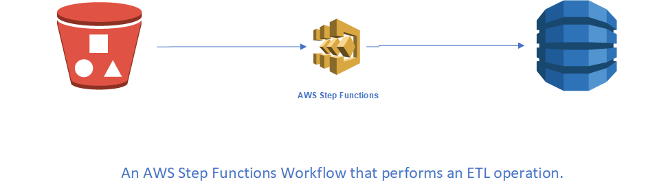

The following illustration shows the population data located in a Microsoft Excel spreadsheet. 

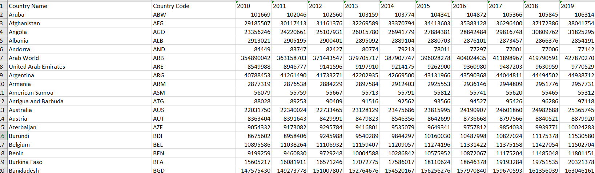

After the workflow successfully runs the ETL job, population data is stored in an Amazon DynamoDB table, as shown in this illustation. 

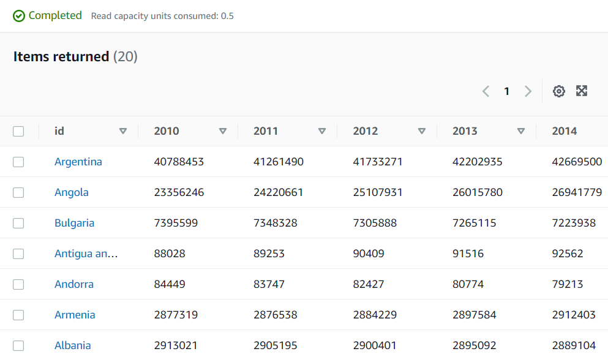

**Note**: You can also create ETL logic by using AWS Glue. 

## Topics

+ Prerequisites
+ Understand the workflow
+ Create an IAM role that is used to execute Lambda functions
+ Create a workflow by using AWS Step functions
+ Create an IntelliJ project 
+ Add the POM dependencies to your project
+ Create Lambda functions by using the Lambda Java runtime API
+ Package the project that contains Lambda functions
+ Deploy Lambda functions
+ Add Lambda functions to workflows
+ Invoke the workflow from the AWS Console

## Prerequisites

To complete the tutorial, you need the following:

+ An AWS account
+ A Java IDE (this tutorial uses the IntelliJ IDE)
+ Java JDK 1.8
+ Maven 3.6 or later


### Important

+ The AWS services included in this document are included in the [AWS Free Tier](https://aws.amazon.com/free/?all-free-tier.sort-by=item.additionalFields.SortRank&all-free-tier.sort-order=asc).
+  This code has not been tested in all AWS Regions. Some AWS services are available only in specific regions. For more information, see [AWS Regional Services](https://aws.amazon.com/about-aws/global-infrastructure/regional-product-services). 
+ Running this code might result in charges to your AWS account. 
+ Be sure to terminate all of the resources you create while going through this tutorial to ensure that you’re not charged.

### Creating the resources

The AWS Services used in this AWS tutorial are:

 - Amazon S3 Service
 - Amazon DynamoDB
 - AWS Step Functions
 
Each workflow step is implemented by using an AWS Lambda function. Lambda is a compute service that enables you to run code without provisioning or managing servers.

**Note**: You can create Lambda functions in various programming languages. For this tutorial, Lambda functions are implemented by using the Lambda Java API. For more information about Lambda, see  [What is AWS Lambda](https://docs.aws.amazon.com/lambda/latest/dg/welcome.html). 

You need to create these resources prior to starting this tutorial:

+ An Amazon S3 bucket that contains a Microsoft Excel document that contains poplation data. Create a Microsoft Excel document similiar to the previous illustration and put in example numbers for population data.  For information about creating an Amazon S3 bucket, see [Creating a bucket](https://docs.aws.amazon.com/AmazonS3/latest/userguide/create-bucket-overview.html).
+ An Amazon DynamoDB table named **Country** that contains a partition key named **id**. For information about creating an Amazon DynamoDB table, see [Create a Table](https://docs.aws.amazon.com/amazondynamodb/latest/developerguide/getting-started-step-1.html). 

## Understand the workflow

The following figure shows the workflow you'll create with this tutorial, which performs the ETL operation.  

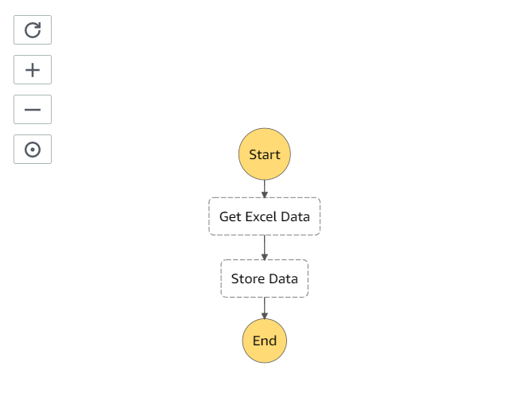

The following describes each step in the workflow:

+ **Start** - Initiates the workflow.
+ **Get Excel Data** – Retrieves an Excel file from an Amazon S3 bucket by using the Amazon S3 Java API. This step dynamically creates XML that contains the population data and passes the XML to the next step. 
+ **Store Data** – Parses the XML that contains the population data. For each item in the XML, this step adds a record to an Amazon DynamoDB table by using the Amazon DynamoDB Java API.   
+ **End** - Stops the workflow.

## Create an IAM role that's used to execute Lambda functions

Create the following two IAM roles:

+ **lambda-support** - Used to invoke Lamdba functions.
+ **workflow-support** - Used to enable Step Functions to invoke the workflow.

This tutorial uses the Amazon S3 and Amazon DynamoDB. The **lambda-support** role has to have policies that enable it to invoke these Amazon services from a Lambda function.

#### To create an IAM role

1. Open the AWS Management Console. When the page loads, enter **IAM** in the search box, and then choose **IAM** to open the IAM console.

2. In the navigation pane, choose **Roles**, and on the **Roles** page, choose **Create Role**.

3. Choose **AWS service**, and then choose **Lambda**.

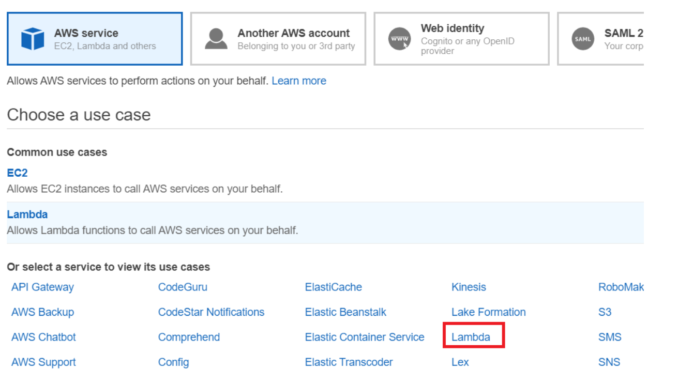

4. Choose **Permissions**.

5. Search for **AWSLambdaBasicExecutionRole**.

6. Choose **Next Tags**.

7. Choose **Review**.

8. Name the role **lambda-support**.

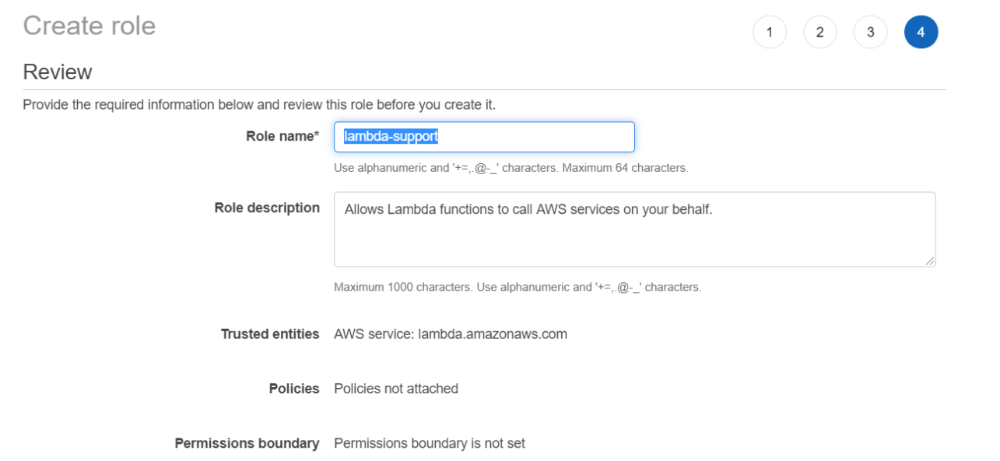

9. Choose **Create role**.

10. Choose **lambda-support** to view the overview page.

11. Choose **Attach Policies**.

12. Search for **AmazonS3FullAccess**, and then choose **Attach policy**.

13. Search for **AmazonDynamoDBFullAccess**, and then choose **Attach policy**. When you're done, you can see the permissions.

**Note**: Repeat this process to create **workflow-support**. For step three, instead of choosing **Lambda**, choose **Step Functions**. You don't need to perform steps 11-13.  
## Create a serverless workflow by using AWS Step functions

To define a workflow that performs an ETL operation by using AWS Step Functions, you create an Amazon States Language (JSON-based) document to define your state machine. An Amazon States Language document describes each step. After you define the document, AWS Step Functions provides a visual representation of the workflow. The following figure shows a visual representation of the workflow.


Workflows can pass data between steps. For example, the **Get Excel Data** dynamically creates XML and passes the XML to the **Store Data** step. The following illustration shows the output of the **Get Excel Data** step.

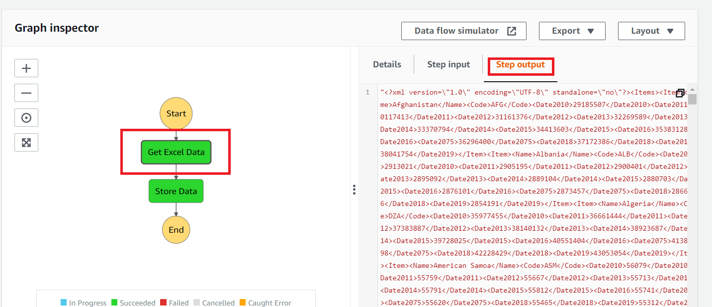

**Note**: Later in this tutorial, you'll create application logic in the Lambda function to read data from the Amazon S3 bucket.  

#### To create a workflow

1. Open the Step Functions console at https://us-west-2.console.aws.amazon.com/states/home.

2. Choose **Create State Machine**.

3. Select **Write your workflow in code**. In the **Type** area, choose **Standard**.

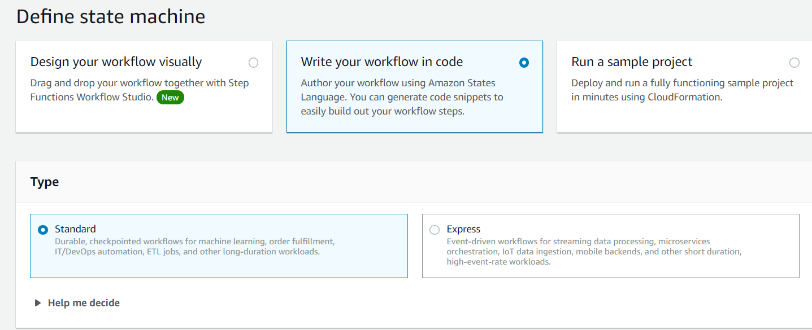

4. Specify the Amazon States Language document by entering the following code.

       {
        "Comment": "An AWS Step Functions state machine that performs an ETL job.",
        "StartAt": "Get Excel Data",
        "States": {
           "Get Excel Data": {
           "Type": "Task",
           "Resource": "arn:aws:lambda:REGION:ACCOUNT_ID:function:FUNCTION_NAME",
           "Next": "Store Data"
          },
           "Store Data": {
           "Type": "Task",
           "Resource": "arn:aws:lambda:REGION:ACCOUNT_ID:function:FUNCTION_NAME",
           "End": true
           }
          }
        }

**Note:** Don't worry about the errors related to the Lambda resource values. You update these values later in this tutorial.

5. Choose **Next**.

6. In the name field, enter **ETLStateMachine**.

7. In the **Permission** section, choose **Choose an existing role**.  

8. Choose **workflow-support** (the IAM role that you created).

9. Choose **Create state machine**. A message appears that states the state machine was successfully created.


## Create an IntelliJ project named ETL_Lambda

Create an IntelliJ project that is used to create the web application.

1. In the IntelliJ IDE, choose **File**, **New**, **Project**.

2. In the New Project dialog box, choose **Maven**.

3. Choose **Next**.

4. In **GroupId**, enter **org.example**.

5. In **ArtifactId**, enter **ETL_Lambda**.

6. Choose **Next**.

7. Choose **Finish**.

## Add the POM dependencies to your project

At this point, you have a new project named **ETL_Lambda**. Ensure that the pom.xml file resembles the following code.

```xml
    <?xml version="1.0" encoding="UTF-8"?>
<project xmlns="http://maven.apache.org/POM/4.0.0"
         xmlns:xsi="http://www.w3.org/2001/XMLSchema-instance"
         xsi:schemaLocation="http://maven.apache.org/POM/4.0.0 http://maven.apache.org/xsd/maven-4.0.0.xsd">
    <modelVersion>4.0.0</modelVersion>
    <groupId>org.example</groupId>
    <artifactId>ETL_Lambda</artifactId>
    <version>1.0-SNAPSHOT</version>
    <properties>
        <maven.compiler.source>8</maven.compiler.source>
        <maven.compiler.target>8</maven.compiler.target>
    </properties>
    <dependencyManagement>
        <dependencies>
            <dependency>
                <groupId>software.amazon.awssdk</groupId>
                <artifactId>bom</artifactId>
                <version>2.17.136</version>
                <type>pom</type>
                <scope>import</scope>
            </dependency>
        </dependencies>
    </dependencyManagement>
    <dependencies>
        <dependency>
            <groupId>org.junit.jupiter</groupId>
            <artifactId>junit-jupiter-api</artifactId>
            <version>5.4.2</version>
            <scope>test</scope>
        </dependency>
        <dependency>
            <groupId>org.junit.jupiter</groupId>
            <artifactId>junit-jupiter-engine</artifactId>
            <version>5.4.2</version>
            <scope>test</scope>
        </dependency>
        <dependency>
            <groupId>org.junit.platform</groupId>
            <artifactId>junit-platform-commons</artifactId>
            <version>1.4.0</version>
        </dependency>
        <dependency>
            <groupId>org.junit.platform</groupId>
            <artifactId>junit-platform-launcher</artifactId>
            <version>1.4.0</version>
            <scope>test</scope>
        </dependency>
        <dependency>
            <groupId>software.amazon.awssdk</groupId>
            <artifactId>dynamodb</artifactId>
        </dependency>
        <dependency>
            <groupId>software.amazon.awssdk</groupId>
            <artifactId>dynamodb-enhanced</artifactId>
        </dependency>
        <dependency>
            <groupId>org.jdom</groupId>
            <artifactId>jdom</artifactId>
            <version>2.0.2</version>
        </dependency>
        <dependency>
            <groupId>com.amazonaws</groupId>
            <artifactId>aws-lambda-java-core</artifactId>
            <version>1.2.1</version>
        </dependency>
        <dependency>
            <groupId>software.amazon.awssdk</groupId>
            <artifactId>s3</artifactId>
        </dependency>
        <dependency>
            <groupId>org.assertj</groupId>
            <artifactId>assertj-core</artifactId>
            <version>3.8.0</version>
            <scope>test</scope>
        </dependency>
        <dependency>
            <groupId>software.amazon.awssdk</groupId>
            <artifactId>protocol-core</artifactId>
        </dependency>
        <dependency>
            <groupId>junit</groupId>
            <artifactId>junit</artifactId>
            <version>4.5</version>
            <scope>test</scope>
        </dependency>
       <dependency>
            <groupId>net.sourceforge.jexcelapi</groupId>
            <artifactId>jxl</artifactId>
            <version>2.6.12</version>
        </dependency>
        <dependency>
            <groupId>commons-io</groupId>
            <artifactId>commons-io</artifactId>
            <version>2.6</version>
        </dependency>
    </dependencies>
    <build>
        <plugins>
            <plugin>
                <artifactId>maven-surefire-plugin</artifactId>
                <version>2.22.2</version>
            </plugin>
            <plugin>
                <groupId>org.apache.maven.plugins</groupId>
                <artifactId>maven-shade-plugin</artifactId>
                <version>3.2.2</version>
                <configuration>
                    <createDependencyReducedPom>false</createDependencyReducedPom>
                </configuration>
                <executions>
                    <execution>
                        <phase>package</phase>
                        <goals>
                            <goal>shade</goal>
                        </goals>
                    </execution>
                </executions>
            </plugin>
            <plugin>
                <groupId>org.apache.maven.plugins</groupId>
                <artifactId>maven-compiler-plugin</artifactId>
                <version>3.8.1</version>
                <configuration>
                    <source>1.8</source>
                    <target>1.8</target>
                </configuration>
            </plugin>
        </plugins>
    </build>
</project>
```

 ## Create the Java classes
 
 Create a Java package in the main/java folder named **com.etl.example**. The Java classes go into this package. 
 
 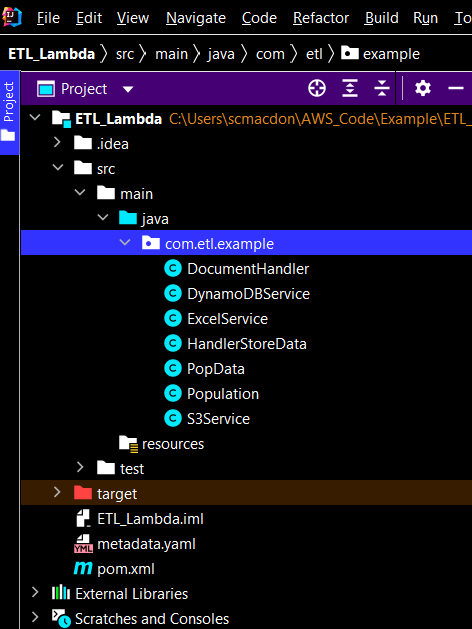
 
 Create these Java classes:

+ **DocumentHandler** - Used as the first step in the workflow that retrieves the Microsoft Excel document and dynamically creates XML that contains the data.
+ **DynamoDBService** - Uses the Amazon DynamoDB Java V2 API to store population data into a DynamoDB table. The Amazon DynamoDB Enhanced Client is used. For more information about the Enhanced Client, see [Map items in DynamoDB tables](https://docs.aws.amazon.com/sdk-for-java/latest/developer-guide/examples-dynamodb-enhanced.html). 
+ **ExcelService** - Uses the **jxl.Workbook** (not an AWS Java API) to read data from a Microsoft Excel spreadsheet. 
+ **HandlerStoreData** - Used as the second step in the workflow. 
+ **PopData** - Used as a model that stores population data. 
+ **Population** - Used as the data mapping class for the Amazon DynamoDB Java API (V2) Enchanced Client. 
+ **S3Service** - Uses the Amazon S3 Java API (V2) to read the Microsoft Excel document and returns a byte array.  

### DocumentHandler class

The following Java code represents the **DocumentHandler** class.

```java
    package com.etl.example;

import com.amazonaws.services.lambda.runtime.Context;
import com.amazonaws.services.lambda.runtime.LambdaLogger;
import jxl.read.biff.BiffException;
import java.io.IOException;
import java.util.Map;

public class DocumentHandler {

    public String handleRequest(Map<String,String> event, Context context) throws IOException, BiffException {

        LambdaLogger logger = context.getLogger();
        logger.log("Getting excel doc from the Amazon S3 bucket");

        // Get the Amazon S3 bucket name and MS Excel file name.
        String bucketName = event.get("bucketname");
        String object = event.get("objectname");

        // Get the XML that contains the Pop data.
        ExcelService excel = new ExcelService();
        String xml = excel.getData(bucketName, object);
        return xml;
    }
}

```

### DynamoDBService class

The following Java code represents the **DynamoDBService** class. This class uses the Amazon DynamoDB Java API (V2) to populate the **Country** table. 

```java
    package com.etl.example;

    import org.jdom2.Document;
    import org.jdom2.JDOMException;
    import org.jdom2.input.SAXBuilder;
    import org.xml.sax.InputSource;
    import software.amazon.awssdk.enhanced.dynamodb.DynamoDbEnhancedClient;
    import software.amazon.awssdk.enhanced.dynamodb.DynamoDbTable;
    import software.amazon.awssdk.enhanced.dynamodb.TableSchema;
    import software.amazon.awssdk.regions.Region;
    import software.amazon.awssdk.services.dynamodb.DynamoDbClient;
    import software.amazon.awssdk.services.dynamodb.model.DynamoDbException;
    import java.util.List;
    import java.io.IOException;
    import java.io.StringReader;

    public class DynamoDBService {

     int recNum = 1;

     private DynamoDbClient getClient() {

        // Create a DynamoDbClient object.
        Region region = Region.US_EAST_1;
        DynamoDbClient ddb = DynamoDbClient.builder()
                .region(region)
                .build();

        return ddb;
     }

     public void injectETLData(String myDom)  throws JDOMException, IOException {

        SAXBuilder builder = new SAXBuilder();
        Document jdomDocument = builder.build(new InputSource(new StringReader(myDom)));
        org.jdom2.Element root = ((org.jdom2.Document) jdomDocument).getRootElement();
        PopData pop = new PopData();
        List<org.jdom2.Element> items = root.getChildren("Item");

        for (org.jdom2.Element element : items) {

            pop.setName( element.getChildText("Name"));
            pop.setCode(element.getChildText("Code"));
            pop.set2010(element.getChildText("Date2010"));
            pop.set2011(element.getChildText("Date2011"));
            pop.set2012(element.getChildText("Date2012"));
            pop.set2013(element.getChildText("Date2013"));
            pop.set2014(element.getChildText("Date2014"));
            pop.set2015(element.getChildText("Date2015"));
            pop.set2016(element.getChildText("Date2016"));
            pop.set2017(element.getChildText("Date2017"));
            pop.set2018(element.getChildText("Date2018"));
            pop.set2019(element.getChildText("Date2019"));
            setItem(pop) ;
        }
    }

    public void setItem(PopData pop) {

        // Create a DynamoDbEnhancedClient.
        DynamoDbClient ddb = getClient();

        DynamoDbEnhancedClient enhancedClient = DynamoDbEnhancedClient.builder()
                .dynamoDbClient(ddb)
                .build();

        try {

            // Create a DynamoDbTable object.
            DynamoDbTable<Population> workTable = enhancedClient.table("Country", TableSchema.fromBean(Population.class));

             // Populate the table.
            Population record = new Population();
            String name = pop.getName();
            String code = pop.getCode();

            record.setId(name);
            record.setCode(code);
            record.set2010(pop.get2010());
            record.set2011(pop.get2011());
            record.set2012(pop.get2012());
            record.set2013(pop.get2013());
            record.set2014(pop.get2014());
            record.set2015(pop.get2015());
            record.set2016(pop.get2016());
            record.set2017(pop.get2017());
            record.set2018(pop.get2018());
            record.set2019(pop.get2019());

            // Put the data into the Amazon DynamoDB table.
            workTable.putItem(record);
            System.out.println("Added record "+recNum);
            recNum ++;

        } catch (DynamoDbException e) {
            System.err.println(e.getMessage());
            System.exit(1);
        }
      }
     }
```
**Note** Make sure that you created a **Customer** table as described at the start of this AWS tutorial. Otherwise, your code does not work.

### ExcelService class

The following Java code represents the **ExcelService** class that uses the **jxl.Workbook** Java API.

```java
    package com.etl.example;

    import jxl.Cell;
    import jxl.Sheet;
    import jxl.Workbook;
    import java.io.ByteArrayInputStream;
    import java.io.InputStream;
    import java.util.ArrayList;
    import java.util.Comparator;
    import java.util.List;
    import jxl.read.biff.BiffException;
    import org.w3c.dom.Document;
    import org.w3c.dom.Element;
    import javax.xml.parsers.DocumentBuilder;
    import javax.xml.parsers.DocumentBuilderFactory;
    import javax.xml.parsers.ParserConfigurationException;
    import javax.xml.transform.Transformer;
    import javax.xml.transform.TransformerException;
    import javax.xml.transform.TransformerFactory;
    import javax.xml.transform.dom.DOMSource;
    import javax.xml.transform.stream.StreamResult;
    import java.io.*;

    public class ExcelService {

    public String getData(String bucketName, String object) throws IOException, BiffException {

    // Get the Excel speadsheet from the Amazon S3 bucket.
    S3Service s3Service = new S3Service();
    byte[] data = s3Service.getObjectBytes(bucketName, object);
    InputStream inputStrean = new ByteArrayInputStream(data);

    List<PopData> myList = new ArrayList() ;
    System.out.println("Retrieving data from the Excel Spreadsheet");
    Workbook wb = Workbook.getWorkbook(inputStrean);
    Sheet sheet = wb.getSheet(0);

    try{

        // Read the data from the excel spreadsheet.
        Sheet s=wb.getSheet(0);
        int b = s.getColumns();
        System.out.println("The No. of Columns in the Sheet are = " + b);
        int a = s.getRows();
        System.out.println("The No. of Rows in the sheet are = " +a);

        PopData popData = null;

        // Loop through the rows in the spreadsheet.
        for (int zz = 0 ; zz <a; zz++) {
        
        // Get the first cell.
        System.out.println(zz);

        Cell[] row = sheet.getRow(zz);
        
        if (zz ==0)
            System.out.println("Not 1st row");
        else {
            popData = new PopData();

            for (Cell cell : row) {
                // Column header names.
                //System.out.println(cell.toString());

                int colIndex =  cell.getColumn();
                String val = cell.getContents();

                switch(colIndex) {
                    case 0:
                        popData.setName(val);
                        break;

                    case 1:
                        popData.setCode(val);
                        break;

                    case 2:
                        popData.set2010(val);
                        break;

                    case 3:
                        popData.set2011(val);
                        break;

                    case 4:
                        popData.set2012(val);
                        break;

                    case 5:
                        popData.set2013(val);
                        break;

                    case 6:
                        popData.set2014(val);
                        break;

                    case 7:
                        popData.set2015(val);
                        break;

                    case 8:
                        popData.set2016(val);
                        break;

                    case 9:
                        popData.set2017(val);
                        break;

                    case 10:
                        popData.set2018(val);
                        break;

                    default: {
                        popData.set2019(val);
                        myList.add(popData);
                    }
                }
            }
          }
        }

        myList.sort(Comparator.comparing(PopData::getName));
        String transformXML  = convertToString(toXml(myList));
        return transformXML;

      }catch (Exception e) {
        e.printStackTrace();
      }

     return "";
     }

    // Convert population data into XML.
    private static Document toXml(List<PopData> itemList) {

        try {
        DocumentBuilderFactory factory = DocumentBuilderFactory.newInstance();
        DocumentBuilder builder = factory.newDocumentBuilder();
        Document doc = builder.newDocument();

        // Start building the XML.
        Element root = doc.createElement( "Items" );
        doc.appendChild( root );

        // Get the elements from the collection.
        int custCount = itemList.size();

        // Iterate through the collection.
        for ( int index=0; index < custCount; index++) {

          PopData myItem = itemList.get(index);
          Element item = doc.createElement( "Item" );
          root.appendChild( item );

          // Set Name.
          Element id = doc.createElement( "Name" );
          id.appendChild( doc.createTextNode(myItem.getName() ) );
          item.appendChild( id );

          // Set Code.
          Element name = doc.createElement( "Code" );
          name.appendChild( doc.createTextNode(myItem.getCode()) );
          item.appendChild( name );

          // Set 2010.
          Element ob2010 = doc.createElement( "Date2010" );
          ob2010.appendChild( doc.createTextNode(myItem.get2010() ) );
          item.appendChild( ob2010 );

          // Set 2011.
          Element ob2011 = doc.createElement( "Date2011" );
          ob2011.appendChild( doc.createTextNode(myItem.get2011()) );
          item.appendChild( ob2011 );

          // Set 2012.
          Element ob2012 = doc.createElement( "Date2012" );
          ob2012.appendChild( doc.createTextNode(myItem.get2012() ) );
          item.appendChild( ob2012 );

          // Set 2013.
          Element ob2013 = doc.createElement( "Date2013" );
          ob2013.appendChild( doc.createTextNode(myItem.get2013()) );
          item.appendChild( ob2013 );

          // Set 2014.
          Element ob2014 = doc.createElement( "Date2014" );
          ob2014.appendChild( doc.createTextNode(myItem.get2014()) );
          item.appendChild( ob2014 );

          // Set 2015.
          Element ob2015 = doc.createElement( "Date2015" );
          ob2015.appendChild( doc.createTextNode(myItem.get2015()) );
          item.appendChild( ob2015 );

          // Set 2016.
          Element ob2016 = doc.createElement( "Date2016" );
          ob2016.appendChild( doc.createTextNode(myItem.get2016()) );
          item.appendChild( ob2016 );

          // Set 2017.
          Element ob2017 = doc.createElement( "Date2017" );
          ob2017.appendChild( doc.createTextNode(myItem.get2017()) );
          item.appendChild( ob2017 );

          // Set 2018.
          Element ob2018 = doc.createElement( "Date2018" );
          ob2018.appendChild( doc.createTextNode(myItem.get2018()) );
          item.appendChild( ob2018 );

          // Set 2019
          Element ob2019 = doc.createElement( "Date2019" );
          ob2019.appendChild( doc.createTextNode(myItem.get2019()) );
          item.appendChild( ob2019 );
        }

        return doc;
        } catch(ParserConfigurationException e) {
        e.printStackTrace();
        }
        return null;
        }

      private static String convertToString(Document xml) {
        try {
        Transformer transformer = TransformerFactory.newInstance().newTransformer();
        StreamResult result = new StreamResult(new StringWriter());
        DOMSource source = new DOMSource(xml);
        transformer.transform(source, result);
        return result.getWriter().toString();

        } catch(TransformerException ex) {
        ex.printStackTrace();
        }
        return null;
        }
  }
```

### HandlerStoreData class

The following Java code represents the **HandlerStoreData** class. This class represents the second step in the workflow. 

```java
    package com.etl.example;

    import com.amazonaws.services.lambda.runtime.Context;
    import com.amazonaws.services.lambda.runtime.RequestHandler;
    import com.amazonaws.services.lambda.runtime.LambdaLogger;
    import org.jdom2.JDOMException;
    import java.io.IOException;

    public class HandlerStoreData  implements RequestHandler<String, String>{

     @Override
     public String handleRequest(String event, Context context) {

        LambdaLogger logger = context.getLogger();
        String xml = event ;
        DynamoDBService storeData = new DynamoDBService();
        try {

            storeData.injectETLData(xml);
            logger.log("data stored:");
        } catch (JDOMException | IOException e) {
            e.printStackTrace();
        }
        return "Data is stored successfully.";
      }
     }
```

### PopData class

The following Java code represents the **PopData** class.

```java
    package com.etl.example;

    // Stores the data model for this use case.
    public class PopData {

    private String countryName;
    private String countryCode;
    private String pop2010;
    private String pop2011;
    private String pop2012;
    private String pop2013;
    private String pop2014;
    private String pop2015;
    private String pop2016;
    private String pop2017;
    private String pop2018;
    private String pop2019;


    public void set2019(String num) {
        this.pop2019 = num;
    }

    public String get2019() {
        return this.pop2019;
    }

    public void set2018(String num) {
        this.pop2018 = num;
    }

    public String get2018() {
        return this.pop2018;
    }


    public void set2017(String num) {
        this.pop2017 = num;
    }

    public String get2017() {
        return this.pop2017;
    }


    public void set2016(String num) {
        this.pop2016 = num;
    }

    public String get2016() {
        return this.pop2016;
    }

    public void set2015(String num) {
        this.pop2015 = num;
    }

    public String get2015() {
        return this.pop2015;
    }

    public void set2014(String num) {
        this.pop2014 = num;
    }

    public String get2014() {
        return this.pop2014;
    }


    public void set2013(String num) {
        this.pop2013 = num;
    }

    public String get2013() {
        return this.pop2013;
    }


    public void set2012(String num) {
        this.pop2012 = num;
    }

    public String get2012() {
        return this.pop2012;
    }

    public void set2011(String num) {
        this.pop2011 = num;
    }

    public String get2011() {
        return this.pop2011;
    }


    public void set2010(String num) {
        this.pop2010 = num;
    }

    public String get2010() {
        return this.pop2010;
    }

    public void setCode(String code) {
        this.countryCode = code;
    }

    public String getCode() {
        return this.countryCode;
    }

    public void setName(String name) {
        this.countryName = name;
    }

    public String getName() {
        return this.countryName ;
    }
   }
```

### Population class

The following Java code represents the **Population** class. The class is used for data mapping for the Amazon DynamoDB Java API Enhanced Client. 

```java
     package com.etl.example;

     import software.amazon.awssdk.enhanced.dynamodb.mapper.annotations.DynamoDbBean;
     import software.amazon.awssdk.enhanced.dynamodb.mapper.annotations.DynamoDbPartitionKey;

     @DynamoDbBean
     public class Population {

     public String id;
     public String code;
     public String pop2010;
     public String pop2011;
     public String pop2012;
     public String pop2013;
     public String pop2014;
     public String pop2015;
     public String pop2016;
     public String pop2017;
     public String pop2018;
     public String pop2019;


     public void setId(String name) {
        this.id = name;
     }

     @DynamoDbPartitionKey
     public String getId() {
        return this.id ;
    }


    public void set2019(String num) {
        this.pop2019 = num;
    }

    public String get2019() {
        return this.pop2019;
    }

    public void set2018(String num) {
        this.pop2018 = num;
    }

    public String get2018() {
        return this.pop2018;
    }


    public void set2017(String num) {
        this.pop2017 = num;
    }

    public String get2017() {
        return this.pop2017;
    }


    public void set2016(String num) {
        this.pop2016 = num;
    }

    public String get2016() {
        return this.pop2016;
    }

    public void set2015(String num) {
        this.pop2015 = num;
    }

    public String get2015() {
        return this.pop2015;
    }


    public void set2014(String num) {
        this.pop2014 = num;
    }

    public String get2014() {
        return this.pop2014;
    }


    public void set2013(String num) {
        this.pop2013 = num;
    }

    public String get2013() {
        return this.pop2013;
    }


    public void set2012(String num) {
        this.pop2012 = num;
    }

    public String get2012() {
        return this.pop2012;
    }

    public void set2011(String num) {
        this.pop2011 = num;
    }

    public String get2011() {
        return this.pop2011;
    }


    public void set2010(String num) {
        this.pop2010 = num;
    }

    public String get2010() {
        return this.pop2010;
    }

    public void setCode(String code) {
        this.code = code;
    }

    public String getCode() {
        return this.code;
    }
  }
```
    
### S3Service class

The following Java code represents the **S3Service** class. This class contains a method named **getObjectBytes** that accepts the bucket name and object name (which represents the Microsoft Excel file) and returns a byte array. 

```java
    package com.etl.example;

    import software.amazon.awssdk.core.ResponseBytes;
    import software.amazon.awssdk.regions.Region;
    import software.amazon.awssdk.services.s3.S3Client;
    import software.amazon.awssdk.services.s3.model.GetObjectRequest;
    import software.amazon.awssdk.services.s3.model.GetObjectResponse;
    import software.amazon.awssdk.services.s3.model.S3Exception;

    public class S3Service {

    private S3Client getClient() {

        Region region = Region.US_EAST_1;
        S3Client s3 = S3Client.builder()
                .region(region)
                .build();

        return s3;
      }

     public byte[] getObjectBytes (String bucketName, String keyName) {

        try {
            S3Client s3 = getClient();
            GetObjectRequest objectRequest = GetObjectRequest
                    .builder()
                    .key(keyName)
                    .bucket(bucketName)
                    .build();

            ResponseBytes<GetObjectResponse> objectBytes = s3.getObjectAsBytes(objectRequest);
            byte[] data = objectBytes.asByteArray();
            return data;

         } catch (S3Exception e) {
            System.err.println(e.awsErrorDetails().errorMessage());
            System.exit(1);
        }
        return null;
      }
    }
```

## Package the project that contains the Lambda functions

Package up the project into a .jar (JAR) file that you can deploy as a Lambda function by using the following Maven command.

    mvn package

The JAR file is located in the **target** folder (which is a child folder of the project folder).

## Deploy the Lambda functions

1. Open the Lambda console at https://us-west-2.console.aws.amazon.com/lambda/home.

2. Choose **Create Function**.

3. Choose **Author from scratch**.

4. In the **Basic** information section, enter **ETL** as the name.

5. In the **Runtime**, choose **Java 8**.

6. Choose **Use an existing role**, and then choose **lambda-support** (the IAM role that you created).

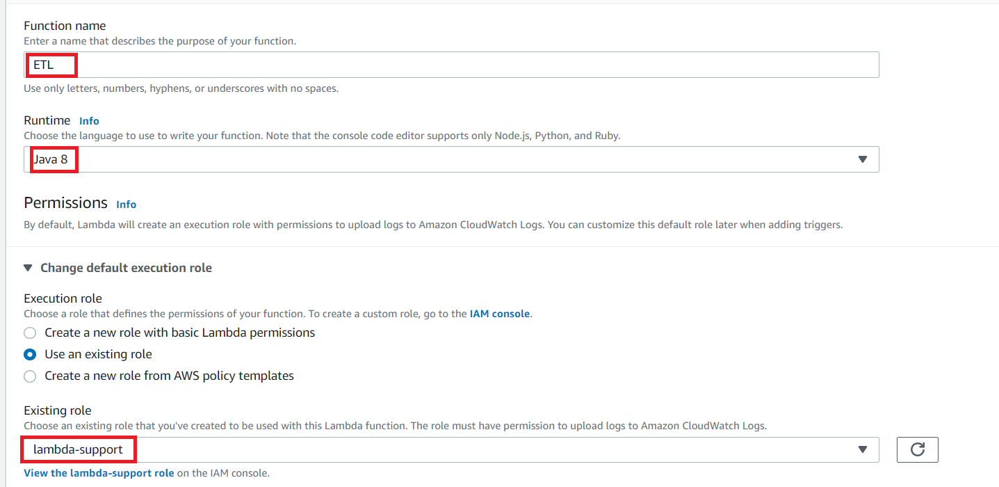

7. Choose **Create function**.

8. For **Code entry type**, choose **Upload a .zip or .jar file**.

9. Choose **Upload**, and then browse to the JAR file that you created.  

10. For **Handler**, enter the fully qualified name of the function, for example, **com.etl.example.DocumentHandler::handleRequest** (**com.etl.example.DocumentHandler** specifies the package and class followed by :: and method name).

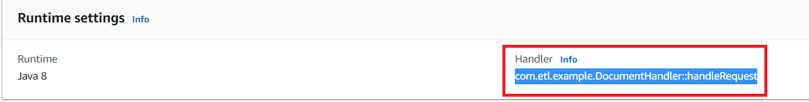

11. Choose **Save.**

12. Repeat this procedure for the **HandlerStoreData** class. Name the corresponding Lambda function **ETLStoreData**. When you finish, you will have two Lambda functions that you can reference in the Amazon States Language document.  

**Note**: It's recommended that you increase the timeout value for the Lambda functions. For more information, see [Configuring functions in the console](https://docs.aws.amazon.com/lambda/latest/dg/configuration-console.html).

## Add the Lambda functions to workflows

Open the Lambda console. Notice that you can view the Lambda Amazon Resource Name (ARN) value in the upper-right corner.

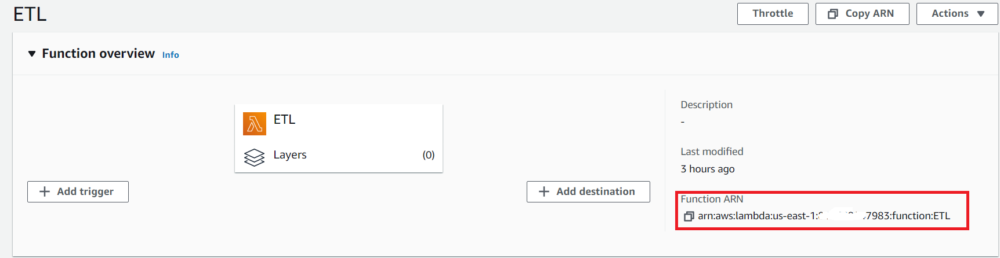

Copy the value and then paste it into step 1 of the Amazon States Language document, located in the Step Functions console.

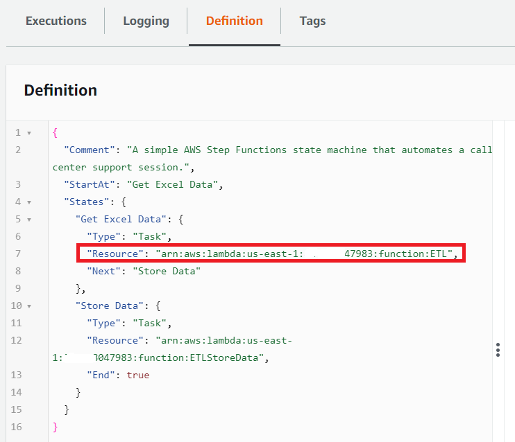

Update the Resource for the **Store Data** step with the ARN of the **ETLStoreData** Lambda function. This is how you hook in Lambda functions created by using Java Lambda runtime API into a workflow created by using AWS Step Functions.

## Execute your workflow by using the Step Functions console

You can invoke the workflow on the Step Functions console.  An execution receives JSON input. For this example, you can pass the following JSON data to the workflow.  

     {
      "bucketname": "<Enter your Amazon S3 bucket name>",
      "objectname": "<Enter the MS Excel document>"
     }

**Note**: Ensure that you specify the correct Amazon S3 bucket name and the Excel document that contains population data. These values are used by the **DocumentHandler** class and are input into the workflow. 

#### To execute your workflow

1. On the Step Functions console, choose **Start execution**.

2. In the **Input** section, pass the JSON data. View the workflow. As each step is completed, it turns green.

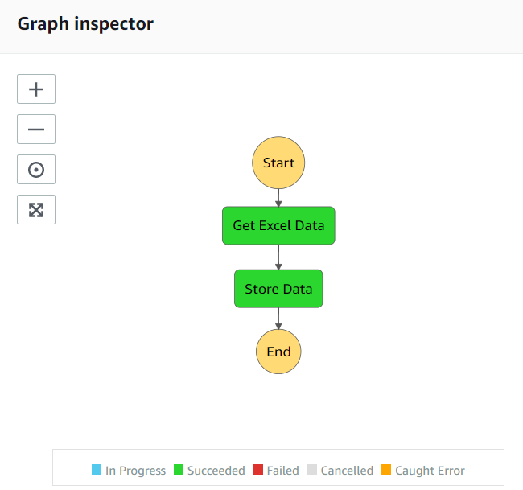

If the step turns red, an error occurred. You can click the step and view the logs that are accessible from the right side.

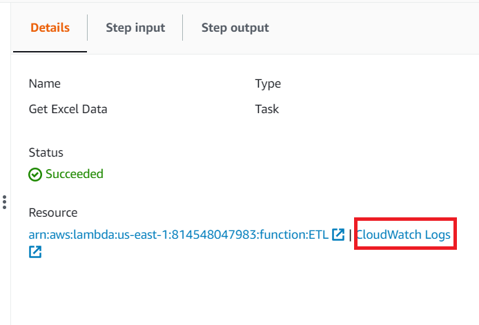

When the workflow is finished, you can view the data in the DynamoDB table (as shown at the start of this AWS tutorial).

### Next steps
Congratulations! You have created a workflow that performs an ETL operation. As stated at the beginning of this tutorial, be sure to terminate all of the resources you create while going through this tutorial to ensure that you’re not charged.

For more AWS multiservice examples, see
[usecases](https://github.com/awsdocs/aws-doc-sdk-examples/tree/master/javav2/usecases).
