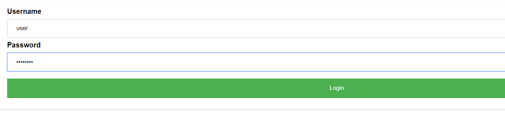
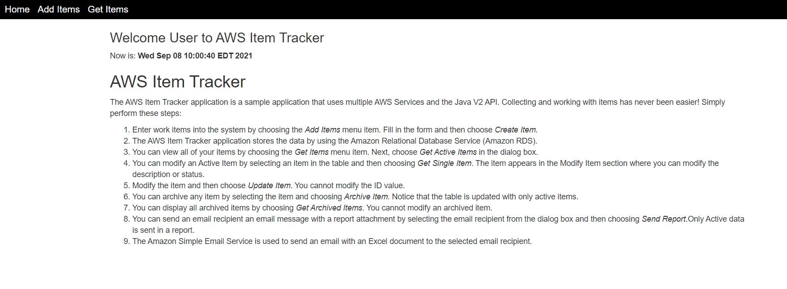
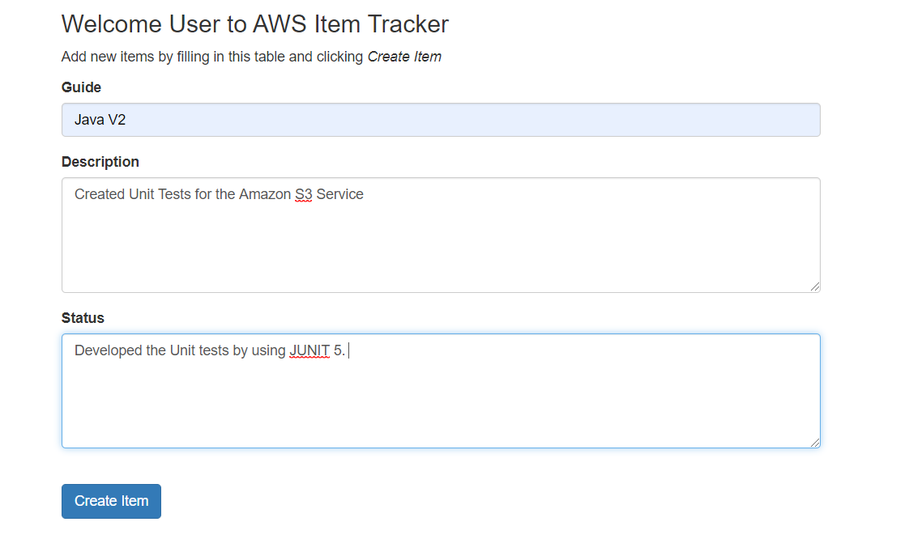
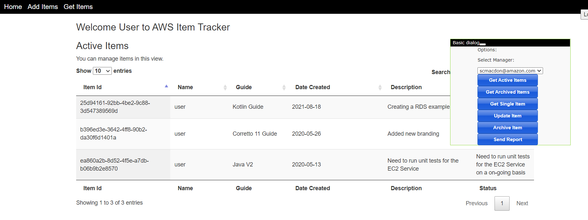
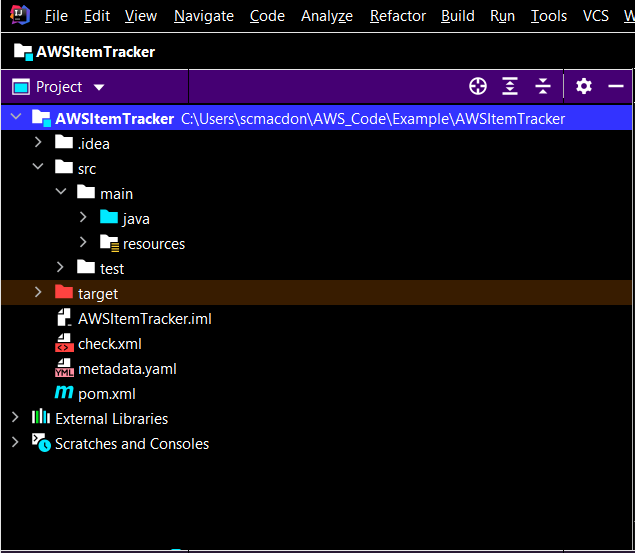
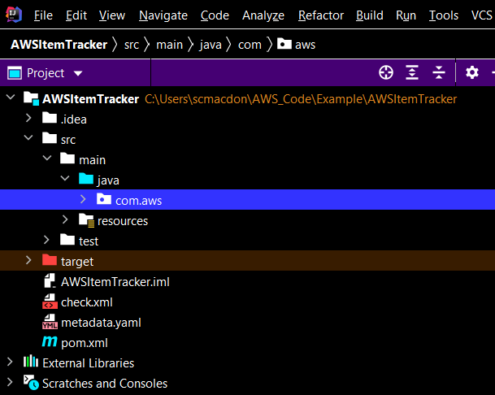
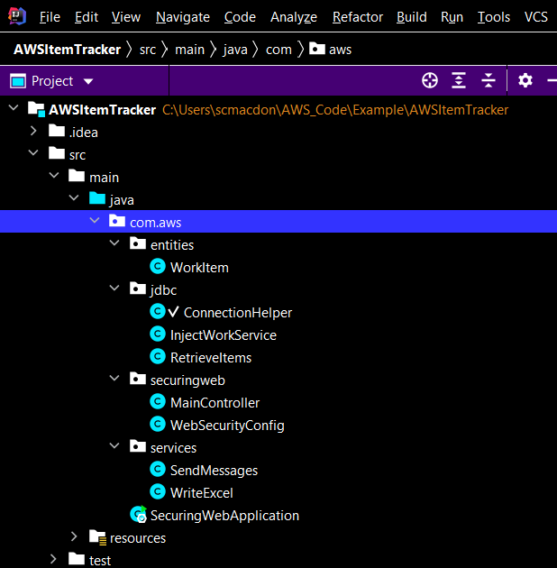

#  Creating the Amazon Relational Database Service item tracker

## Overview

| Heading      | Description |
| ----------- | ----------- |
| Description | Discusses how to develop a dynamic web application that tracks and reports on Amazon Relational Database Service (Amazon RDS) data.     |
| Audience   |  Developer (beginner / intermediate)        |
| Updated   | 3/15/2022        |
| Required skills   | Java, Maven  |

## Purpose

You can develop a web application that tracks and reports on work items by using the following AWS services:

+ Amazon Relational Database Service (Amazon RDS)
+ Amazon Simple Email Service (the AWS SDK for Java SDK version 2 is used to access Amazon SES)

The application you create is named *AWS Tracker*, and uses Spring Boot APIs to build a model, different views, and a controller. This application requires a user to log in. For more information, see [Spring Boot](https://www.tutorialspoint.com/spring_boot/index.htm).

#### Topics

+ Prerequisites
+ Understand the AWS Tracker application
+ Create an IntelliJ project named AWSItemTracker
+ Add the Spring POM dependencies to your project
+ Setup the Java packages in your project
+ Create the Java classes
+ Create the HTML files
+ Create script files
+ Run the application

## Prerequisites

To complete the tutorial, you need the following:

+ An AWS account
+ A Java IDE (this tutorial uses the IntelliJ IDE)
+ Java JDK 1.8
+ Maven 3.6 or later

### Important

+ The AWS services included in this document are included in the [AWS Free Tier](https://aws.amazon.com/free/?all-free-tier.sort-by=item.additionalFields.SortRank&all-free-tier.sort-order=asc).
+  This code has not been tested in all AWS Regions. Some AWS services are available only in specific regions. For more information, see [AWS Regional Services](https://aws.amazon.com/about-aws/global-infrastructure/regional-product-services). 
+ Running this code might result in charges to your AWS account. 
+ Be sure to terminate all of the resources you create while going through this tutorial to ensure that you’re not charged.

### Creating the resources

Create an Amazon RDS MySQL DB instance that has a table named **Work** and a primary key named **idwork** (this table is described in a following section). For information about creating an Amazon RDS database, see [Creating a MySQL DB instance and connecting to a database on a MySQL DB instance](https://docs.aws.amazon.com/AmazonRDS/latest/UserGuide/CHAP_GettingStarted.CreatingConnecting.MySQL.html). 

After you create the database, in the **Connectivity & security** section, view the **Endpoint** and **Port** of the DB instance. You need these values when you create a connection to the database using the Java JDBC API (this is shown later in this tutorial). 


      
**Note:** You must set up an inbound rule for the security group to connect to the database from your development environment. Setting up an inbound rule essentially means enabling an IP address to use the database. After you set up an inbound rule, you can connect to the database from a client such as MySQL Workbench. For more information, see [Controlling Access with Security Groups](https://docs.aws.amazon.com/AmazonRDS/latest/UserGuide/Overview.RDSSecurityGroups.html).  

In addition, make sure that you set up your Java developer environment before following along with this tutorial. For more information, see [Get started with the AWS SDK for Java 2.x](https://docs.aws.amazon.com/sdk-for-java/latest/developer-guide/get-started.html). 

## Understand the AWS Tracker application

The AWS Tracker application uses a model that is based on a work item and contains these attributes:

+ **date** - The start date of the item.
+ **description** - The description of the item.
+ **guide** - The deliverable that this item has an impact on.
+ **username** - The person who performs the work item.
+ **status** - The status of the item.
+ **archive** - Whether this item is completed or is still being worked on.

**Note**: The username is the user who logs into this application. In this example, the username is named **user**. 

The following figure shows the login page.



When a user logs into the system, they see the **Home** page.



#### Application functionality

A user can perform these tasks in the AWS Tracker application:

+ Enter an item into the system
+ View all active items
+ View archived items that are complete
+ Modify active items
+ Send a report to an email recipient

The following figure shows the new item section.



A user can retrieve *active* or *archive* items. For example, a user can choose **Get Active Items** to get a dataset that's retrieved from an Amazon RDS database and displayed in the web application.



The user can select the email recipient from the **Select Manager** list and choose **Send Report** (see the dropdown in the previous figure). Active items are queried from the database and used to dynamically create an Excel document. Then the application uses Amazon SES to email the document to the selected email recipient. The following figure is an example of a report.


#### Work table
The database is MySQL and contains a table named **Work**. The table contains the following fields:

+ **idwork** - A VARCHAR(45) value that represents the PK.
+ **date** - A date value that specifies the date the item was created.
+ **description** - A VARCHAR(400) value that describes the item.
+ **guide** - A VARCHAR(45) value that represents the deliverable being worked on.
+ **status** - A VARCHAR(400) value that describes the status.
+ **username** - A VARCHAR(45) value that represents the user who entered the item.
+ **archive** - A TINYINT(4) value that represents whether this is an active or archive item.

The following figure shows the **work** table.


## Create an IntelliJ project named AWSItemTracker

1. In the IntelliJ IDE, choose **File**, **New**, **Project**.
2. In the **New Project** dialog box, choose **Maven**, and then choose **Next**.
3. For **GroupId**, enter **aws-spring**.
4. For **ArtifactId**, enter **AWSItemTracker**.
6. Choose **Next**.
7. Choose **Finish**.

## Add the POM dependencies to your project

At this point, you have a new project named **AWSItemTracker**.



**Note:** Ensure that you are using Java 1.8 (as shown below).

Ensure that the **pom.xml** file looks like the following.

```xml
     <?xml version="1.0" encoding="UTF-8"?>
     <project xmlns="http://maven.apache.org/POM/4.0.0"
         xmlns:xsi="http://www.w3.org/2001/XMLSchema-instance"
         xsi:schemaLocation="http://maven.apache.org/POM/4.0.0 http://maven.apache.org/xsd/maven-4.0.0.xsd">
     <modelVersion>4.0.0</modelVersion>

     <groupId>aws-spring</groupId>
     <artifactId>AWSItemTracker</artifactId>
     <version>1.0-SNAPSHOT</version>
     <packaging>jar</packaging>

     <parent>
        <groupId>org.springframework.boot</groupId>
        <artifactId>spring-boot-starter-parent</artifactId>
        <version>2.0.4.RELEASE</version>
        <relativePath /> <!-- lookup parent from repository -->
     </parent>

     <properties>
        <project.build.sourceEncoding>UTF-8</project.build.sourceEncoding>
        <java.version>1.8</java.version>
     </properties>
     <dependencyManagement>
        <dependencies>
            <dependency>
                <groupId>software.amazon.awssdk</groupId>
                <artifactId>bom</artifactId>
                <version>2.10.30</version>
                <type>pom</type>
                <scope>import</scope>
            </dependency>
        </dependencies>
     </dependencyManagement>
     <dependencies>
        <dependency>
            <groupId>org.junit.jupiter</groupId>
            <artifactId>junit-jupiter-api</artifactId>
            <version>5.4.2</version>
            <scope>test</scope>
        </dependency>
        <dependency>
            <groupId>org.junit.jupiter</groupId>
            <artifactId>junit-jupiter-engine</artifactId>
            <version>5.4.2</version>
            <scope>test</scope>
        </dependency>
        <dependency>
            <groupId>org.junit.platform</groupId>
            <artifactId>junit-platform-commons</artifactId>
            <version>1.4.0</version>
        </dependency>
        <dependency>
            <groupId>org.junit.platform</groupId>
            <artifactId>junit-platform-launcher</artifactId>
            <version>1.4.0</version>
            <scope>test</scope>
        </dependency>
        <dependency>
            <groupId>software.amazon.awssdk</groupId>
            <artifactId>ses</artifactId>
        </dependency>
        <dependency>
            <groupId>org.mockito</groupId>
            <artifactId>mockito-all</artifactId>
            <version>1.10.19</version>
            <scope>test</scope>
        </dependency>
        <dependency>
            <groupId>org.assertj</groupId>
            <artifactId>assertj-core</artifactId>
            <version>3.8.0</version>
            <scope>test</scope>
        </dependency>
        <dependency>
            <groupId>org.mockito</groupId>
            <artifactId>mockito-core</artifactId>
            <version>2.13.0</version>
            <scope>test</scope>
        </dependency>
        <dependency>
            <groupId>javax.mail</groupId>
            <artifactId>javax.mail-api</artifactId>
            <version>1.6.2</version>
        </dependency>
        <dependency>
            <groupId>software.amazon.awssdk</groupId>
            <artifactId>protocol-core</artifactId>
        </dependency>
        <dependency>
            <groupId>junit</groupId>
            <artifactId>junit</artifactId>
            <version>4.5</version>
            <scope>test</scope>
        </dependency>
        <dependency>
            <groupId>javax.mail</groupId>
            <artifactId>javax.mail-api</artifactId>
            <version>1.5.5</version>
        </dependency>
        <dependency>
            <groupId>com.sun.mail</groupId>
            <artifactId>javax.mail</artifactId>
            <version>1.5.5</version>
        </dependency>
        <dependency>
            <groupId>org.springframework.boot</groupId>
            <artifactId>spring-boot-starter-thymeleaf</artifactId>
        </dependency>
        <!-- bootstrap and jquery -->
        <dependency>
            <groupId>org.webjars</groupId>
            <artifactId>bootstrap</artifactId>
            <version>3.3.7</version>
        </dependency>
        <dependency>
            <groupId>org.webjars</groupId>
            <artifactId>jquery</artifactId>
            <version>3.2.1</version>
        </dependency>
        <!-- mysql connector -->
        <dependency>
            <groupId>mysql</groupId>
            <artifactId>mysql-connector-java</artifactId>
            <scope>runtime</scope>
        </dependency>
        <dependency>
            <groupId>net.sourceforge.jexcelapi</groupId>
            <artifactId>jxl</artifactId>
            <version>2.6.10</version>
        </dependency>
        <dependency>
            <groupId>commons-io</groupId>
            <artifactId>commons-io</artifactId>
            <version>2.6</version>
        </dependency>
        <dependency>
            <groupId>org.springframework.boot</groupId>
            <artifactId>spring-boot-starter-web</artifactId>
        </dependency>
        <dependency>
            <groupId>org.springframework.boot</groupId>
            <artifactId>spring-boot-starter-security</artifactId>
        </dependency>
        <dependency>
            <groupId>org.springframework.security</groupId>
            <artifactId>spring-security-test</artifactId>
            <scope>test</scope>
        </dependency>
        <dependency>
            <groupId>org.springframework.boot</groupId>
            <artifactId>spring-boot-starter-test</artifactId>
            <scope>test</scope>
            <exclusions>
                <exclusion>
                    <groupId>org.junit.vintage</groupId>
                    <artifactId>junit-vintage-engine</artifactId>
                </exclusion>
            </exclusions>
        </dependency>
       </dependencies>
       <build>
        <plugins>
            <plugin>
                <groupId>org.springframework.boot</groupId>
                <artifactId>spring-boot-maven-plugin</artifactId>
            </plugin>
        </plugins>
      </build>
     </project>
```

## Set up the Java packages in your project

Create a Java package in the **main/java** folder named **com.aws**.



The Java files go into the following subpackages.



These packages contain the following:

+ **entities** - Contains Java files that represent the model. In this example, the model class is named **WorkItem**.
+ **jdbc** - Contains Java files that use the JDBC API to interact with the RDS database.
+ **services** - Contains Java files that invoke AWS services. For example, the **software.amazon.awssdk.services.ses.SesClient** object is used to send email messages.
+ **securingweb** - Contains Java files required for Spring security.

## Create the Java classes

Create the Java classes, including the Spring classes. In this application, a Java class sets up an in-memory user store that contains a single user (the user name is **user** and the password is **password**.)

### Create the Spring classes

Create a Java package named **com.aws.securingweb**. Next, create these classes in this package:

+ **MainController**
+ **WebSecurityConfig**

#### SecuringWebApplication class
The following Java code represents the **SecuringWebApplication** class. This is the entry point into a Spring boot application. Create this class in the **com.aws** package. 

```java
    package com.aws;

    import org.springframework.boot.SpringApplication;
    import org.springframework.boot.autoconfigure.SpringBootApplication;

    @SpringBootApplication
    public class SecuringWebApplication {

    public static void main(String[] args) throws Throwable {
        SpringApplication.run(SecuringWebApplication.class, args);
     }
    }
```

#### WebSecurityConfig class
The following Java code represents the **WebSecurityConfig** class. The role of this class is to ensure only authenticated users can view the application. Create this class in the **com.aws.securingweb** package. 

```java
    package com.aws.securingweb;

    import org.springframework.context.annotation.Bean;
    import org.springframework.context.annotation.Configuration;
    import org.springframework.security.config.annotation.authentication.builders.AuthenticationManagerBuilder;
    import org.springframework.security.config.annotation.web.builders.HttpSecurity;
    import org.springframework.security.config.annotation.web.configuration.EnableWebSecurity;
    import org.springframework.security.config.annotation.web.configuration.WebSecurityConfigurerAdapter;
    import org.springframework.security.crypto.bcrypt.BCryptPasswordEncoder;
    import org.springframework.security.crypto.password.PasswordEncoder;
    import org.springframework.security.web.util.matcher.AntPathRequestMatcher;

    @Configuration
    @EnableWebSecurity
    public class WebSecurityConfig extends WebSecurityConfigurerAdapter {
    @Override
    protected void configure(HttpSecurity http) throws Exception {
        http
                .authorizeRequests()
                .antMatchers(
                        "/js/**",
                        "/css/**",
                        "/img/**",
                        "/webjars/**").permitAll()
                .anyRequest().authenticated()
                .and()
                .formLogin()
                .loginPage("/login")
                .permitAll()
                .and()
                .logout()
                .invalidateHttpSession(true)
                .clearAuthentication(true)
                .logoutRequestMatcher(new AntPathRequestMatcher("/logout"))
                .logoutSuccessUrl("/login?logout")
                .permitAll();

        http.csrf().disable();
    }

    @Override
    protected void configure(AuthenticationManagerBuilder auth) throws Exception {
        auth.inMemoryAuthentication()
                .passwordEncoder(passwordEncoder())
                .withUser("user")
                .password(passwordEncoder().encode("password"))
                .roles("USER");
    }

    @Bean
    public PasswordEncoder passwordEncoder() {
        return new BCryptPasswordEncoder();
    }
    }
```
**Note**: In this example, the user credentials to log into the application are **user** and **password**.  

### Create the main controller class

In the **com.aws.securingweb** package, create the controller class named **MainController**. This class handles the HTTP requests. For example, when a POST operation is made, the **MainController** handles the request and returns a dataset that is displayed in the view. The dataset is obtained from the MySQL database located in the AWS Cloud.

The following Java code represents the **MainController** class.

```java
    package com.aws.securingweb;

    import com.aws.entities.WorkItem;
    import com.aws.jdbc.RetrieveItems;
    import org.springframework.beans.factory.annotation.Autowired;
    import org.springframework.security.core.context.SecurityContextHolder;
    import org.springframework.stereotype.Controller;
    import org.springframework.ui.Model;
    import org.springframework.web.bind.annotation.GetMapping;
    import org.springframework.web.bind.annotation.RequestMapping;
    import org.springframework.web.bind.annotation.ResponseBody;
    import org.springframework.web.bind.annotation.RequestMethod;
    import com.aws.jdbc.InjectWorkService;
    import com.aws.services.WriteExcel;
    import com.aws.services.SendMessages;
    import javax.servlet.http.HttpServletRequest;
    import javax.servlet.http.HttpServletResponse;
    import java.io.IOException;
    import java.util.List;

    @Controller
    public class MainController {

    @GetMapping("/")
    public String root() {
        return "index";
    }

    @GetMapping("/login")
    public String login(Model model) {
        return "login";
    }

    @GetMapping("/add")
    public String designer() {
        return "add";
    }

    @GetMapping("/items")
    public String items() {
        return "items";
    }

    @Autowired
    InjectWorkService iw;

    @Autowired
    WriteExcel writeExcel;

    @Autowired
    SendMessages sm;

    @Autowired
    RetrieveItems ri ;

    // Adds a new item to the database.
    @RequestMapping(value = "/add", method = RequestMethod.POST)
    @ResponseBody
    String addItems(HttpServletRequest request, HttpServletResponse response) {

        //Get the Logged in User.
        String name = getLoggedUser();

        String guide = request.getParameter("guide");
        String description = request.getParameter("description");
        String status = request.getParameter("status");

        // Create a Work Item object to pass to the injestNewSubmission method.
        WorkItem myWork = new WorkItem();
        myWork.setGuide(guide);
        myWork.setDescription(description);
        myWork.setStatus(status);
        myWork.setName(name);

        iw.injestNewSubmission(myWork);
        return "Item added";
    }

    // Builds and emails a report.
    @RequestMapping(value = "/report", method = RequestMethod.POST)
    @ResponseBody
    String getReport(HttpServletRequest request, HttpServletResponse response) {

        //Get the Logged in User.
        String name = getLoggedUser();

        String email = request.getParameter("email");
        List<WorkItem> theList = ri.getItemsDataSQLReport(name);
        java.io.InputStream is = writeExcel.exportExcel(theList);

        try {
            sm.sendReport(is, email);

        }catch (IOException e) {
          e.getStackTrace();
            }
        return "Report is created";
     }

     // Archives a work item.
     @RequestMapping(value = "/archive", method = RequestMethod.POST)
     @ResponseBody
     String archieveWorkItem(HttpServletRequest request, HttpServletResponse response) {
        String id = request.getParameter("id");
        ri.flipItemArchive(id );
        return id ;
     }

     // Modifies the value of a work item.
     @RequestMapping(value = "/changewi", method = RequestMethod.POST)
     @ResponseBody
     String changeWorkItem(HttpServletRequest request, HttpServletResponse response) {
        String id = request.getParameter("id");
        String description = request.getParameter("description");
        String status = request.getParameter("status");
        String value = iw.modifySubmission(id, description, status);
        return value;
     }

     // Retrieve all items for a given user.
     @RequestMapping(value = "/retrieve", method = RequestMethod.POST)
     @ResponseBody
     String retrieveItems(HttpServletRequest request, HttpServletResponse response) {

        //Get the Logged in User.
        String name = getLoggedUser();
        String type = request.getParameter("type");

        //Pass back all data from the database.
        String xml="";

        if (type.equals("active")) {
            xml = ri.getItemsDataSQL(name);
            return xml;
        } else {
            xml = ri.getArchiveData(name);
            return xml;
        }
      }

     // Returns a work item to modify.
     @RequestMapping(value = "/modify", method = RequestMethod.POST)
     @ResponseBody
     String modifyWork(HttpServletRequest request, HttpServletResponse response) {
        String id = request.getParameter("id");
        String xmlRes = ri.getItemSQL(id) ;
        return xmlRes;
      }

     private String getLoggedUser() {
        org.springframework.security.core.userdetails.User user2 = (org.springframework.security.core.userdetails.User) SecurityContextHolder.getContext().getAuthentication().getPrincipal();
        String name = user2.getUsername();
        return name;
      }
    }
```

### Create the WorkItem class

Create a Java package named **com.aws.entities**. Next, create a class, named **WorkItem**, that represents the application model.  

```java
    package com.aws.entities;

    public class WorkItem {

     private String id;
     private String name;
     private String guide ;
     private String date;
     private String description;
     private String status;

     public void setId (String id) {
         this.id = id;
     }

     public String getId() {
         return this.id;
     }

     public void setStatus (String status) {
        this.status = status;
     }

     public String getStatus() {
       return this.status;
     }

     public void setDescription (String description) {
        this.description = description;
     }

     public String getDescription() {
       return this.description;
     }

     public void setDate (String date) {
       this.date = date;
     }

     public String getDate() {
       return this.date;
     }

     public void setName (String name) {
       this.name = name;
     }

     public String getName() {
       return this.name;
     }

     public void setGuide (String guide) {
      this.guide = guide;
     }

     public String getGuide() {
      return this.guide;
      }
     }
```

### Create the JDBC Classes

Create a Java package named **com.aws.jdbc**. Next, create these Java classes that are required to perform database operations:

+ **ConnectionHelper** - Creates a connection to the RDS MySQL instance.
+ **InjectWorkService** - Injects items into the MySQL instance.
+ **RetrieveItems** - Retrieves items from the MySQL instance.

**Note**: This tutorial uses the JDBC API to interact with the MySQL instance.   

#### ConnectionHelper class

The following Java code represents the **ConnectionHelper** class.

```java
    package com.aws.jdbc;

    import java.sql.Connection;
    import java.sql.DriverManager;
    import java.sql.SQLException;

    public class ConnectionHelper {

      private String url;
      private static ConnectionHelper instance;

      private ConnectionHelper() {
          url = "jdbc:mysql://localhost:3306/mydb?useSSL=false";
       }

      public static Connection getConnection() throws SQLException {
         if (instance == null) {
            instance = new ConnectionHelper();
         }
         try {

            Class.forName("com.mysql.jdbc.Driver").newInstance();
            return DriverManager.getConnection(instance.url, "root","root");
        } catch (SQLException | ClassNotFoundException | InstantiationException | IllegalAccessException e) {
            e.getStackTrace();
        }
        return null;
    	}

       public static void close(Connection connection) {
         try {
            if (connection != null) {
                connection.close();
            }
        } catch (SQLException e) {
            e.printStackTrace();
        }
      }
     }
```

**Note:** The **URL** value is **localhost:3306**. Replace this value with the endpoint value you obtained while setting up the Amazon RDS database; otherwise, your code does not work. You must also ensure that you specify the user name and password for your RDS instance.

#### InjectWorkService class

The following Java code represents the **InjectWorkService** class.

```java
    package com.aws.jdbc;

    import java.sql.Connection;
    import java.sql.PreparedStatement;
    import java.sql.SQLException;
    import java.text.ParseException;
    import java.text.SimpleDateFormat;
    import java.time.LocalDateTime;
    import java.time.format.DateTimeFormatter;
    import java.util.Date;
    import java.util.UUID;
    import com.aws.entities.WorkItem;
    import org.springframework.stereotype.Component;

    @Component
    public class InjectWorkService {

      // Inject a new submission.
      public String modifySubmission(String id, String desc, String status) {

	Connection c = null;
        int rowCount= 0;

	try {

	  // Create a Connection object.
          c = ConnectionHelper.getConnection();

          // Use prepared statements.
          PreparedStatement ps = null;

          String query = "update work set description = ?, status = ? where idwork = '" +id +"'";
          ps = c.prepareStatement(query);
          ps.setString(1, desc);
          ps.setString(2, status);
          ps.execute();
          return id;
      } catch (SQLException e) {
            e.printStackTrace();
        } finally {
            ConnectionHelper.close(c);
        }
        return null;
    }

    // Inject a new submission.
    public String injestNewSubmission(WorkItem item) {

       Connection c = null;
       int rowCount= 0;
       try {

          // Create a Connection object.
          c = ConnectionHelper.getConnection();

         // Use a prepared statement.
         PreparedStatement ps = null;

        // Convert rev to int.
        String name = item.getName();
        String guide = item.getGuide();
        String description = item.getDescription();
        String status = item.getStatus();

        // Generate the work item ID.
        UUID uuid = UUID.randomUUID();
        String workId = uuid.toString();

        // Date conversion.
        SimpleDateFormat dateFormat = new SimpleDateFormat("yyyy-MM-dd");
        DateTimeFormatter dtf = DateTimeFormatter.ofPattern("yyyy/MM/dd HH:mm:ss");
        LocalDateTime now = LocalDateTime.now();
        String sDate1 = dtf.format(now);
        Date date1 = new SimpleDateFormat("yyyy/MM/dd").parse(sDate1);
        java.sql.Date sqlDate = new java.sql.Date( date1.getTime());

        // Inject an item into the system.
        String insert = "INSERT INTO work (idwork, username,date,description, guide, status, archive) VALUES(?,?, ?,?,?,?,?);";
        ps = c.prepareStatement(insert);
        ps.setString(1, workId);
        ps.setString(2, name);
        ps.setDate(3, sqlDate);
        ps.setString(4, description);
        ps.setString(5, guide );
        ps.setString(6, status );
        ps.setBoolean(7, false);
        ps.execute();
        return workId;

     } catch (SQLException | ParseException e) {
            e.printStackTrace();
        } finally {
            ConnectionHelper.close(c);
        }
        return null;
      }
    }
```

#### RetrieveItems class

The following Java code represents the **RetrieveItems** class.

```java
    package com.aws.jdbc;

    import java.io.StringWriter;
    import java.sql.Connection;
    import java.sql.ResultSet;
    import java.sql.Statement;
    import java.sql.PreparedStatement;
    import java.sql.SQLException;
    import java.util.ArrayList ;
    import java.util.List;
    import com.aws.entities.WorkItem;
    import org.springframework.stereotype.Component;
    import org.w3c.dom.Document;
    import javax.xml.parsers.DocumentBuilder;
    import javax.xml.parsers.DocumentBuilderFactory;
    import org.w3c.dom.Element;
    import javax.xml.parsers.ParserConfigurationException;
    import javax.xml.transform.Transformer;
    import javax.xml.transform.TransformerException;
    import javax.xml.transform.TransformerFactory;
    import javax.xml.transform.dom.DOMSource;
    import javax.xml.transform.stream.StreamResult;


    @Component
    public class RetrieveItems {

        // Retrieves an item based on the ID
        public String flipItemArchive(String id ) {

        Connection c = null;
        String query = "";

        try {

	    // Create a Connection object.
            c = ConnectionHelper.getConnection();

            ResultSet rs = null;
            Statement s = c.createStatement();
            Statement scount = c.createStatement();

            // Use prepared statements.
            PreparedStatement pstmt = null;
            PreparedStatement ps = null;

            // Specify the SQL statement to query data.
            query = "update work set archive = ? where idwork ='" +id + "' ";

            PreparedStatement updateForm = c.prepareStatement(query);
            updateForm.setBoolean(1, true);
            updateForm.execute();

        } catch (SQLException e) {
            e.printStackTrace();
        } finally {
            ConnectionHelper.close(c);
        }
        return null;
    }


    // Retrieves archive data from the MySQL database.
    public String getArchiveData(String username) {

        Connection c = null;

        // Define a list in which work items are stored.
        List<WorkItem> itemList = new ArrayList<WorkItem>();
        int rowCount = 0;
        String query = "";
        WorkItem item = null;

        try {
            // Create a Connection object.
            c = ConnectionHelper.getConnection();

            ResultSet rs = null;
            Statement s = c.createStatement();
            Statement scount = c.createStatement();

            // Use prepared statements.
            PreparedStatement pstmt = null;
            PreparedStatement ps = null;

            int arch = 1;

            // Specify the SQL statement to query data.
            query = "Select idwork,username,date,description,guide,status FROM work where username = '" +username +"' and archive = " +arch +"";
            pstmt = c.prepareStatement(query);
            rs = pstmt.executeQuery();

            while (rs.next()) {
                // For each record, create a WorkItem object.
                item = new WorkItem();

                // Populate the WorkItem object.
                item.setId(rs.getString(1));
                item.setName(rs.getString(2));
                item.setDate(rs.getDate(3).toString().trim());
                item.setDescription(rs.getString(4));
                item.setGuide(rs.getString(5));
                item.setStatus(rs.getString(6));

                // Push the WorkItem object to the list.
                itemList.add(item);
            }

            return convertToString(toXml(itemList));

        } catch (SQLException e) {
            e.printStackTrace();
        } finally {
            ConnectionHelper.close(c);
        }
        return null;
    }

    // Retrieves an item based on the ID.
    public String getItemSQL(String id ) {

        Connection c = null;

        // Define a list in which all work items are stored.
        String query = "";
        String status="" ;
        String description="";

        try {
            // Create a Connection object.
            c = ConnectionHelper.getConnection();

            ResultSet rs = null;
            Statement s = c.createStatement();
            Statement scount = c.createStatement();

            // Use prepared statements.
            PreparedStatement pstmt = null;
            PreparedStatement ps = null;

            // Specify the SQL statement to query data.
            query = "Select description, status FROM work where idwork ='" +id + "' ";
            pstmt = c.prepareStatement(query);
            rs = pstmt.executeQuery();

            while (rs.next()) {
                description = rs.getString(1);
                status = rs.getString(2);
            }
            return convertToString(toXmlItem(id,description,status));


        } catch (SQLException e) {
            e.printStackTrace();
        } finally {
            ConnectionHelper.close(c);
        }
        return null;
    }

    // Get Items data from MySQL
    public List<WorkItem> getItemsDataSQLReport(String username) {

        Connection c = null;

        // Define a list in which all work items are stored.
        List<WorkItem> itemList = new ArrayList<WorkItem>();
        int rowCount = 0;
        String query = "";
        WorkItem item = null;

        try {
            // Create a Connection object.
            c = ConnectionHelper.getConnection();

            ResultSet rs = null;
            Statement s = c.createStatement();
            Statement scount = c.createStatement();

            // Use prepared statements.
            PreparedStatement pstmt = null;
            PreparedStatement ps = null;

            int arch = 0;

            // Specify the SQL statement to query data.
            query = "Select idwork,username,date,description,guide,status FROM work where username = '" +username +"' and archive = " +arch +"";
            pstmt = c.prepareStatement(query);
            rs = pstmt.executeQuery();

            while (rs.next()) {
                // For each record-- create a WorkItem instance.
                item = new WorkItem();

                // Populate WorkItem with data from MySQL.
                item.setId(rs.getString(1));
                item.setName(rs.getString(2));
                item.setDate(rs.getDate(3).toString().trim());
                item.setDescription(rs.getString(4));
                item.setGuide(rs.getString(5));
                item.setStatus(rs.getString(6));

                // Push the WorkItem Object to the list.
                itemList.add(item);
            }
            return itemList;

        } catch (SQLException e) {
            e.printStackTrace();
        } finally {
            ConnectionHelper.close(c);
        }
        return null;
    }


    // Get Items Data from MySQL.
    public String getItemsDataSQL(String username) {

        Connection c = null;

        // Define a list in which all work items are stored.
        List<WorkItem> itemList = new ArrayList<WorkItem>();
        int rowCount = 0;
        String query = "";
        WorkItem item = null;
        try {
            // Create a Connection object
            c = ConnectionHelper.getConnection();

            ResultSet rs = null;
            Statement s = c.createStatement();
            Statement scount = c.createStatement();

            // Use prepared statements.
            PreparedStatement pstmt = null;
            PreparedStatement ps = null;

            int arch = 0;

            // Specify the SQL statement to query data.
            query = "Select idwork,username,date,description,guide,status FROM work where username = '" +username +"' and archive = " +arch +"";
            pstmt = c.prepareStatement(query);
            rs = pstmt.executeQuery();

            while (rs.next()) {

                // For each record-- create a WorkItem instance.
                item = new WorkItem();

                // Populate WorkItem object with data.
                item.setId(rs.getString(1));
                item.setName(rs.getString(2));
                item.setDate(rs.getDate(3).toString().trim());
                item.setDescription(rs.getString(4));
                item.setGuide(rs.getString(5));
                item.setStatus(rs.getString(6));

                // Push the WorkItem Object to the list.
                itemList.add(item);
            }
            return convertToString(toXml(itemList));

        } catch (SQLException e) {
            e.printStackTrace();
        } finally {
            ConnectionHelper.close(c);
        }
        return null;
    }

    // Convert Work item data retrieved from MySQL
    // into XML to pass back to the view.
    private Document toXml(List<WorkItem> itemList) {

        try {
            DocumentBuilderFactory factory = DocumentBuilderFactory.newInstance();
            DocumentBuilder builder = factory.newDocumentBuilder();
            Document doc = builder.newDocument();

            // Start building the XML.
            Element root = doc.createElement( "Items" );
            doc.appendChild( root );

            // Get the elements from the collection.
            int custCount = itemList.size();

            // Iterate through the collection.
            for ( int index=0; index < custCount; index++) {

                // Get the WorkItem object from the collection.
                WorkItem myItem = itemList.get(index);

                Element item = doc.createElement( "Item" );
                root.appendChild( item );

                // Set Id.
                Element id = doc.createElement( "Id" );
                id.appendChild( doc.createTextNode(myItem.getId() ) );
                item.appendChild( id );

                // Set Name.
                Element name = doc.createElement( "Name" );
                name.appendChild( doc.createTextNode(myItem.getName() ) );
                item.appendChild( name );

                // Set Date.
                Element date = doc.createElement( "Date" );
                date.appendChild( doc.createTextNode(myItem.getDate() ) );
                item.appendChild( date );

                // Set Description.
                Element desc = doc.createElement( "Description" );
                desc.appendChild( doc.createTextNode(myItem.getDescription() ) );
                item.appendChild( desc );

                // Set Guide.
                Element guide = doc.createElement( "Guide" );
                guide.appendChild( doc.createTextNode(myItem.getGuide() ) );
                item.appendChild( guide );

                // Set Status.
                Element status = doc.createElement( "Status" );
                status.appendChild( doc.createTextNode(myItem.getStatus() ) );
                item.appendChild( status );
            }

            return doc;
        } catch(ParserConfigurationException e) {
            e.printStackTrace();
        }
        return null;
    }

        private String convertToString(Document xml) {
         try {
            Transformer transformer = TransformerFactory.newInstance().newTransformer();
            StreamResult result = new StreamResult(new StringWriter());
            DOMSource source = new DOMSource(xml);
            transformer.transform(source, result);
            return result.getWriter().toString();

        } catch(TransformerException ex) {
            ex.printStackTrace();
        }
        return null;
    }


       // Convert Work item data retrieved from MySQL into an XML schema to pass back to client.
       private Document toXmlItem(String id2, String desc2, String status2) {

        try {
            DocumentBuilderFactory factory = DocumentBuilderFactory.newInstance();
            DocumentBuilder builder = factory.newDocumentBuilder();
            Document doc = builder.newDocument();

            // Start building the XML.
            Element root = doc.createElement( "Items" );
            doc.appendChild( root );

            Element item = doc.createElement( "Item" );
            root.appendChild( item );

            // Set Id.
            Element id = doc.createElement( "Id" );
            id.appendChild( doc.createTextNode(id2 ) );
            item.appendChild( id );

            // Set Description.
            Element desc = doc.createElement( "Description" );
            desc.appendChild( doc.createTextNode(desc2 ) );
            item.appendChild( desc );

            // Set Status.
            Element status = doc.createElement( "Status" );
            status.appendChild( doc.createTextNode(status2 ) );
            item.appendChild( status );

            return doc;

        } catch(ParserConfigurationException e) {
            e.printStackTrace();
        }
        return null;
      }
     }
```

### Create the service classes

The service classes contain Java application logic that uses AWS services. In this section, you create these classes:

+ **SendMessages** - Uses the Amazon SES API to send email messages.
+ **WriteExcel** - Uses the Java Excel API to dynamically create a report (this does not use AWS SDK for Java APIs).

#### SendMessage class
The **SendMessage** class uses the AWS SDK for Java V2 SES API to send an email message with an attachment (the Excel document) to an email recipient. An email address that you send an email message to must be verified. For information, see [Verifying an email address](https://docs.aws.amazon.com/ses/latest/DeveloperGuide//verify-email-addresses-procedure.html).

The following Java code represents the **SendMessage** class. 

```java
    package com.aws.services;

    import org.apache.commons.io.IOUtils;
    import software.amazon.awssdk.auth.credentials.EnvironmentVariableCredentialsProvider;
    import software.amazon.awssdk.regions.Region;
    import software.amazon.awssdk.services.ses.SesClient;
    import javax.activation.DataHandler;
    import javax.activation.DataSource;
    import javax.mail.Message;
    import javax.mail.MessagingException;
    import javax.mail.Session;
    import javax.mail.internet.InternetAddress;
    import javax.mail.internet.MimeMessage;
    import javax.mail.internet.MimeMultipart;
    import javax.mail.internet.MimeBodyPart;
    import javax.mail.util.ByteArrayDataSource;
    import java.io.ByteArrayOutputStream;
    import java.io.IOException;
    import java.io.InputStream;
    import java.nio.ByteBuffer;
    import java.util.Properties;
    import software.amazon.awssdk.core.SdkBytes;
    import software.amazon.awssdk.services.ses.model.SendRawEmailRequest;
    import software.amazon.awssdk.services.ses.model.RawMessage;
    import software.amazon.awssdk.services.ses.model.SesException;
    import org.springframework.stereotype.Component;

    @Component
    public class SendMessages {

     private String sender = "<ENTER A VALID SEND EMAIL ADDRESS>";

     // The subject line for the email.
     private String subject = "Weekly AWS Status Report";

     // The email body for recipients with non-HTML email clients.
     private String bodyText = "Hello,\r\n" + "Please see the attached file for a weekly update.";

     // The HTML body of the email.
     private String bodyHTML = "<html>" + "<head></head>" + "<body>" + "<h1>Hello!</h1>"
            + "<p>Please see the attached file for a weekly update.</p>" + "</body>" + "</html>";

     public void sendReport(InputStream is, String emailAddress ) throws IOException {

        // Convert the InputStream to a byte[].
        byte[] fileContent = IOUtils.toByteArray(is);

        try {
            send(fileContent,emailAddress);
        } catch (MessagingException e) {
            e.getStackTrace();
        }
    }

    public void send(byte[] attachment, String emailAddress) throws MessagingException, IOException {

        MimeMessage message = null;
        Session session = Session.getDefaultInstance(new Properties());

        // Create a new MimeMessage object.
        message = new MimeMessage(session);

        // Add subject, from and to lines.
        message.setSubject(subject, "UTF-8");
        message.setFrom(new InternetAddress(sender));
        message.setRecipients(Message.RecipientType.TO, InternetAddress.parse(emailAddress));

        // Create a multipart/alternative child container.
        MimeMultipart msgBody = new MimeMultipart("alternative");

        // Create a wrapper for the HTML and text parts.
        MimeBodyPart wrap = new MimeBodyPart();

        // Define the text part.
        MimeBodyPart textPart = new MimeBodyPart();
        textPart.setContent(bodyText, "text/plain; charset=UTF-8");

        // Define the HTML part.
        MimeBodyPart htmlPart = new MimeBodyPart();
        htmlPart.setContent(bodyHTML, "text/html; charset=UTF-8");

        // Add the text and HTML parts to the child container.
        msgBody.addBodyPart(textPart);
        msgBody.addBodyPart(htmlPart);

        // Add the child container to the wrapper object.
        wrap.setContent(msgBody);

        // Create a multipart/mixed parent container.
        MimeMultipart msg = new MimeMultipart("mixed");

        // Add the parent container to the message.
        message.setContent(msg);

        // Add the multipart/alternative part to the message
        msg.addBodyPart(wrap);

        // Define the attachment.
        MimeBodyPart att = new MimeBodyPart();
        DataSource fds = new ByteArrayDataSource(attachment, "application/vnd.openxmlformats-officedocument.spreadsheetml.sheet");
        att.setDataHandler(new DataHandler(fds));

        String reportName = "WorkReport.xls";
        att.setFileName(reportName);

        // Add the attachment to the message.
        msg.addBodyPart(att);

       // Send the email.
        try {
            System.out.println("Attempting to send an email through Amazon SES " + "using the AWS SDK for Java...");

            Region region = Region.US_WEST_2;
            SesClient client = SesClient.builder()
                    .region(region)
                    .build();

            ByteArrayOutputStream outputStream = new ByteArrayOutputStream();
            message.writeTo(outputStream);

            ByteBuffer buf = ByteBuffer.wrap(outputStream.toByteArray());
            byte[] arr = new byte[buf.remaining()];
            buf.get(arr);

            SdkBytes data = SdkBytes.fromByteArray(arr);
            RawMessage rawMessage = RawMessage.builder()
                    .data(data)
                    .build();

            SendRawEmailRequest rawEmailRequest = SendRawEmailRequest.builder()
                    .rawMessage(rawMessage)
                    .build();

            client.sendRawEmail(rawEmailRequest);

        } catch (SesException e) {
            System.err.println(e.awsErrorDetails().errorMessage());
            System.exit(1);
        }
        System.out.println("Email sent with attachment");
      }
     }
```

**Note:** Update the email **sender** address with a verified email address; otherwise, the email is not sent. For information, see [Verifying email addresses in Amazon SES](https://docs.aws.amazon.com/ses/latest/DeveloperGuide/verify-email-addresses.html).       

#### WriteExcel class

The **WriteExcel** class dynamically creates an Excel report with the MySQL data marked as active. The following code represents this class.

```java
    package com.aws.services;

    import jxl.CellView;
    import jxl.Workbook;
    import jxl.WorkbookSettings;
    import jxl.format.UnderlineStyle;
    import jxl.write.Label;
    import jxl.write.Number;
    import jxl.write.WritableCellFormat;
    import jxl.write.WritableFont;
    import jxl.write.WritableSheet;
    import jxl.write.WritableWorkbook;
    import jxl.write.WriteException;
    import com.aws.entities.WorkItem;
    import org.springframework.stereotype.Component;
    import java.io.IOException;
    import java.util.List;
    import java.util.Locale;

    @Component
    public class WriteExcel {

    private WritableCellFormat timesBoldUnderline;
    private WritableCellFormat times;

    // Returns an InputStream that represents the Excel report.
    public java.io.InputStream exportExcel( List<WorkItem> list) {

        try {
            java.io.InputStream is = write( list);
            return is ;
        } catch(WriteException | IOException e) {
            e.printStackTrace();
        }
        return null;
    }

    // Generates the report and returns an inputstream.
    public java.io.InputStream write( List<WorkItem> list) throws IOException, WriteException {
        java.io.OutputStream os = new java.io.ByteArrayOutputStream() ;
        WorkbookSettings wbSettings = new WorkbookSettings();

        wbSettings.setLocale(new Locale("en", "EN"));

        // Create a Workbook - pass the OutputStream.
        WritableWorkbook workbook = Workbook.createWorkbook(os, wbSettings);
        workbook.createSheet("Work Item Report", 0);
        WritableSheet excelSheet = workbook.getSheet(0);
        createLabel(excelSheet) ;
        int size = createContent(excelSheet, list);

        // Close the workbook.
        workbook.write();
        workbook.close();

        // Get an inputStream that represents the Report.
        java.io.ByteArrayOutputStream stream = new java.io.ByteArrayOutputStream();
        stream = (java.io.ByteArrayOutputStream)os;
        byte[] myBytes = stream.toByteArray();
        java.io.InputStream is = new java.io.ByteArrayInputStream(myBytes) ;

        return is ;
    }

    // Create Headings in the Excel spreadsheet.
    private void createLabel(WritableSheet sheet)
            throws WriteException {
       
        WritableFont times10pt = new WritableFont(WritableFont.TIMES, 10);
        times = new WritableCellFormat(times10pt);
        times.setWrap(true);

        // Create a bold font with underlining.
        WritableFont times10ptBoldUnderline = new WritableFont(WritableFont.TIMES, 10, WritableFont.BOLD, false,
                UnderlineStyle.SINGLE);
        timesBoldUnderline = new WritableCellFormat(times10ptBoldUnderline);
        timesBoldUnderline.setWrap(true);

        CellView cv = new CellView();
        cv.setFormat(times);
        cv.setFormat(timesBoldUnderline);
        cv.setAutosize(true);

        // Write a few headers.
        addCaption(sheet, 0, 0, "Writer");
        addCaption(sheet, 1, 0, "Date");
        addCaption(sheet, 2, 0, "Guide");
        addCaption(sheet, 3, 0, "Description");
        addCaption(sheet, 4, 0, "Status");
    }

    // Write the Work Item Data to the Excel report.
    private int createContent(WritableSheet sheet, List<WorkItem> list) throws WriteException {

        int size = list.size() ;

        // Add customer data to the Excel report.
        for (int i = 0; i < size; i++) {

            WorkItem wi = list.get(i);

            // Get the work item values.
            String name = wi.getName();
            String guide = wi.getGuide();
            String date = wi.getDate();
            String des = wi.getDescription();
            String status = wi.getStatus();

            // Set the columns.
            addLabel(sheet, 0, i+2, name);
            addLabel(sheet, 1, i+2, date);
            addLabel(sheet, 2, i+2,guide);
            addLabel(sheet, 3, i+2, des);
            addLabel(sheet, 4, i+2, status);
        }
        return size;
    }

    private void addCaption(WritableSheet sheet, int column, int row, String s)
            throws WriteException {
        Label label;
        label = new Label(column, row, s, timesBoldUnderline);

        int cc = countString(s);
        sheet.setColumnView(column, cc);
        sheet.addCell(label);
    }

    private void addNumber(WritableSheet sheet, int column, int row,
                           Integer integer) throws WriteException {
        Number number;
        number = new Number(column, row, integer, times);
        sheet.addCell(number);
    }

    private void addLabel(WritableSheet sheet, int column, int row, String s)
            throws WriteException {
        Label label;
        label = new Label(column, row, s, times);
        int cc = countString(s);
        if (cc > 200)
            sheet.setColumnView(column, 150);
        else
            sheet.setColumnView(column, cc+6);

        sheet.addCell(label);

    }

    private int countString (String ss) {
        int count = 0;
        //Counts each character except space
        for(int i = 0; i < ss.length(); i++) {
            if(ss.charAt(i) != ' ')
                count++;
        }
        return count;
     }
    }
```

## Create the HTML files

At this point, you have created all of the Java files required for the AWS Tracking application. Now you create the HTML files that are required for the application's graphical user interface (GUI). Under the **resource** folder, create a **templates** folder and then create the following HTML files:

+ **login.html**
+ **index.html**
+ **add.html**
+ **items.html**
+ **layout.html**

The **login.html** file is the login page where a user logs into the application. This HTML file contains a form that sends a request to the **/login** handler that is defined in the **MainController** class. After a successful login, the **index.html** file is used as the application's home view. The **add.html** file represents the view for adding an item to the system. The **items.html** file is used to view and modify the items. Finally, the **layout.html** file represents the menu visible in all views.  

#### login.html

The following HTML code represents the login form.

```html
    	<!DOCTYPE html>
	<html xmlns="http://www.w3.org/1999/xhtml" xmlns:th="https://www.thymeleaf.org"
        xmlns:sec="https://www.thymeleaf.org/thymeleaf-extras-springsecurity3">
	<head>
    	<title>Spring Security Example </title>
    	<style>
         body {font-family: Arial, Helvetica, sans-serif;}
         form {border: 3px solid #f1f1f1;}

         input[type=text], input[type=password] {
            width: 100%;
            padding: 12px 20px;
            margin: 8px 0;
            display: inline-block;
            border: 1px solid #ccc;
            box-sizing: border-box;
          }

          button {
            background-color: #4CAF50;
            color: white;
            padding: 14px 20px;
            margin: 8px 0;
            border: none;
            cursor: pointer;
            width: 100%;
           }

        button:hover {
            opacity: 0.8;
        }

        .cancelbtn {
            width: auto;
            padding: 10px 18px;
            background-color: #f44336;
        }

        .imgcontainer {
            text-align: center;
            margin: 24px 0 12px 0;
        }

        img.avatar {
            width: 40%;
            border-radius: 50%;
        }

        .container {
            padding: 16px;
        }

        span.psw {
            float: right;
            padding-top: 16px;
        }

        /* Change styles for span and cancel button on extra small screens */
        @media screen and (max-width: 300px) {
            span.psw {
                display: block;
                float: none;
            }
            .cancelbtn {
                width: 100%;
            }
          }
    	</style>
	</head>
	<body>
	 <div th:if="${param.error}">
    	   Invalid username and password.
	</div>
   	<div th:if="${param.logout}">
     	  You have been logged out.
	</div>
	<form th:action="@{/login}" method="post">
    	<div class="container">
        <label for="username"><b>Username</b></label>
        <input type="text" placeholder="Enter Username" id="username" name="username" value ="user" required>

        <label for="password"><b>Password</b></label>
        <input type="password" placeholder="Enter Password" id ="password" name="password" value ="password" required>

        <button type="submit">Login</button>

       </div>

       <div class="container" style="background-color:#f1f1f1">
        <button type="button" class="cancelbtn">Cancel</button>
        <span class="psw">Forgot <a href="#">password?</a></span>
       </div>
       </form>

       </body>
      </html>
```

#### index.html

The following HTML code represents the **index.html** file. This file represents the application's home view.

```html
    <!DOCTYPE html>
    <html xmlns:th="http://www.thymeleaf.org" xmlns:sec="http://www.thymeleaf.org/thymeleaf-extras-springsecurity3">

    <head>
      <meta charset="utf-8" />
      <meta http-equiv="X-UA-Compatible" content="IE=edge" />
      <meta name="viewport" content="width=device-width, initial-scale=1" />

      <link rel="stylesheet" th:href="|https://maxcdn.bootstrapcdn.com/bootstrap/3.3.7/css/bootstrap.min.css|"/>
      <link rel="stylesheet" href="../public/css/styles.css" th:href="@{/css/styles.css}" />
      <link rel="icon" href="../public/img/favicon.ico" th:href="@{/img/favicon.ico}" />

      <title>AWS Item Tracker</title>
     </head>

     <body>
      <header th:replace="layout :: site-header"/>
      <div class="container">

      <h3>Welcome <span sec:authentication="principal.username">User</span> to AWS Item Tracker</h3>
      <p>Now is: <b th:text="${execInfo.now.time}"></b></p>

      <h2>AWS Item Tracker</h2>

      <p>The AWS Item Tracker application is a sample application that uses multiple AWS services and the Java V2 API. Collecting and  working with items has never been easier! Simply perform these steps:<p>

     <ol>
    <li>Enter work items into the system by choosing the <b>Add Items</b> menu item. Fill in the form and then choose <b>Create Item</b>.</li>
    <li>The AWS Item Tracker application stores the data by using the Amazon Relational Database Service (Amazon RDS).</li>
    <li>You can view all of your items by choosing the <b>Get Items</b> menu item. Next, choose <b>Get Active Items</b> in the dialog box.</li>
    <li>You can modify an Active Item by selecting an item in the table and then choosing <b>Get Single Item</b>. The item appears in the Modify Item section where you can modify the description or status.</li>
    <li>Modify the item and then choose <b>Update Item</b>. You cannot modify the ID value. </li>
    <li>You can archive any item by selecting the item and choosing <b>Archive Item</b>. Notice that the table is updated with only active items.</li>
    <li>You can display all archived items by choosing <b>Get Archived Items</b>. You cannot modify an archived item.</li>
    <li>You can send an email recipient an email message with a report attachment by selecting the email recipient from the dialog box and then choosing <b>Send Report</b>.Only Active data is sent in a report.</li>
    <li>The Amazon Simple Email Service is used to send an email with an Excel document to the selected email recipient.</li>
    </ol>
    <div>
    </body>
    </html>
```
	     
#### add.html

The following code represents the **add.html** file that enables users to add new items.

```html
	<html xmlns:th="http://www.thymeleaf.org" xmlns:sec="http://www.thymeleaf.org/thymeleaf-extras-springsecurity3">
	<html>
	<head>
    	<title>Add Items</title>
    	<script th:src="|https://code.jquery.com/jquery-1.12.4.min.js|"></script>
    	<script th:src="|https://code.jquery.com/ui/1.11.4/jquery-ui.min.js|"></script>
    	<script src="../public/js/contact_me.js" th:src="@{/js/contact_me.js}"></script>

    	<!-- CSS files -->
    	<link rel="stylesheet" th:href="|https://maxcdn.bootstrapcdn.com/bootstrap/3.3.7/css/bootstrap.min.css|"/>
    	<link rel="stylesheet" href="../public/css/styles.css" th:href="@{/css/styles.css}" />
	</head>
	<body>
	<header th:replace="layout :: site-header"/>
	<div class="container">
	<h3>Welcome <span sec:authentication="principal.username">User</span> to AWS Item Tracker</h3>
    	<p>Add new items by filling in this table and clicking <b>Create Item</b></p>

	<div class="row">
    	<div class="col-lg-8 mx-auto">

        <form>
            <div class="control-group">
                <div class="form-group floating-label-form-group controls mb-0 pb-2">
                    <label>Guide</label>
                    <input class="form-control" id="guide" type="guide" placeholder="AWS Guide/AWS API" required="required" data-validation-required-message="Please enter the AWS Guide.">
                    <p class="help-block text-danger"></p>
                </div>
            </div>
            <div class="control-group">
                <div class="form-group floating-label-form-group controls mb-0 pb-2">
                    <label>Description</label>
                    <textarea class="form-control" id="description" rows="5" placeholder="Description" required="required" data-validation-required-message="Please enter a description."></textarea>
                    <p class="help-block text-danger"></p>
                </div>
            </div>
            <div class="control-group">
                <div class="form-group floating-label-form-group controls mb-0 pb-2">
                    <label>Status</label>
                    <textarea class="form-control" id="status" rows="5" placeholder="Status" required="required" data-validation-required-message="Please enter the status."></textarea>
                    <p class="help-block text-danger"></p>
                </div>
            </div>
            <br>
            <button type="submit" class="btn btn-primary btn-xl" id="SendButton">Create Item</button>
        </form>
    	</div>
	</div>
	</div>
	</body>
	</html>
```
		
#### items.html

The following code represents the **items.html** file. This file enables users to modify items and send reports.

```html
	<!DOCTYPE html>
	<html xmlns:th="http://www.thymeleaf.org" xmlns:sec="http://www.thymeleaf.org/thymeleaf-extras-springsecurity3">
	<html>
	<head>
    	  <title>Modify Items</title>

    	  <script th:src="|https://code.jquery.com/jquery-1.12.4.min.js|"></script>
    	  <script th:src="|https://code.jquery.com/ui/1.11.4/jquery-ui.min.js|"></script>
    	  <script th:src="|https://cdn.datatables.net/v/dt/dt-1.10.20/datatables.min.js|"></script>
    	  <script th:src="|https://maxcdn.bootstrapcdn.com/bootstrap/3.4.1/js/bootstrap.min.js|"></script>
    	  <script src="../public/js/items.js" th:src="@{/js/items.js}"></script>

    	  <!-- CSS files  -->
    	  <link rel="stylesheet" th:href="|https://maxcdn.bootstrapcdn.com/bootstrap/3.3.7/css/bootstrap.min.css|"/>
    	  <link rel="stylesheet" th:href="|https://cdn.datatables.net/v/dt/dt-1.10.20/datatables.min.css|"/>
    	  <link rel="stylesheet" href="../public/css/styles.css" th:href="@{/css/styles.css}" />
    	  <link rel="stylesheet" href="../public/css/col.css" th:href="@{/css/col.css}" />
    	  <link rel="stylesheet" href="../public/css/button.css" th:href="@{/css/button.css}" />
    	  <link rel="stylesheet" href="../public/css/all.min.css" th:href="@{/css/all.min.css}" />

	</head>
	<body>
	<header th:replace="layout :: site-header"/>

	<div class="container">

    	<h3>Welcome <span sec:authentication="principal.username">User</span> to AWS Item Tracker</h3>
    	<h3 id="info3">Get Items</h3>
	<p>You can manage items in this view.</p>

    	<table id="myTable" class="display" style="width:100%">
        <thead>
        <tr>
            <th>Item Id</th>
            <th>Name</th>
            <th>Guide</th>
            <th>Date Created</th>
            <th>Description</th>
            <th>Status</th>
        </tr>
        </thead>
        <tbody>
        <tr>
            <td>No Data</td>
            <td>No Data</td>
            <td>No Data </td>
            <td>No Data</td>
            <td>No Data</td>
            <td>No Data</td>
        </tr>
        </tbody>
        <tfoot>
        <tr>
            <th>Item Id</th>
            <th>Name</th>
            <th>Guide</th>
            <th>Date Created</th>
            <th>Description</th>
            <th>Status</th>
        </tr>
        </tfoot>
        <div id="success3"></div>
    </table>

    </div>
    <br>
    <div id="modform" class="container">

    <h3>Modify an Item</h3>
    <p>You can modify items.</p>

    <form>
        <div class="control-group">
            <div class="form-group floating-label-form-group controls mb-0 pb-2">
                <label>ID</label>
                <input class="form-control" id="id" type="id" placeholder="Id" readonly data-validation-required-message="Item Id.">
                <p class="help-block text-danger"></p>
            </div>
        </div>
        <div class="control-group">
            <div class="form-group floating-label-form-group controls mb-0 pb-2">
                <label>Description</label>
                <textarea class="form-control" id="description" rows="5" placeholder="Description" required="required" data-validation-required-message="Description."></textarea>
                <p class="help-block text-danger"></p>
            </div>
        </div>
        <div class="control-group">
            <div class="form-group floating-label-form-group controls mb-0 pb-2">
                <label>Status</label>
                <textarea class="form-control" id="status" rows="5" placeholder="Status" required="required" data-validation-required-message="Status"></textarea>
                <p class="help-block text-danger"></p>
            </div>
        </div>
        <br>
      </form>

     </div>

     <div id="dialogtemplate2" border="2" title="Basic dialog">

    <table  align="center">
        <tr>
        <td>
                <p>Options:</p>
            </td>
            <td>

            </td>
        </tr>
        <tr>
            <td>
                <p>Select Manager:</p>
            </td>
            <td>

            </td>
        </tr>
        <tr>
            <td>
                <select id="manager">
                   <option value="scmacdon@amazon.com">tblue@nomail.com</option>
                   <option value="susfer@amazon.com">swhite@nomail.com</option>
                </select>
            </td>
            <td>

            </td>
        </tr>

        <tr>

        <tr>
            <td>
                <button class="shiny-blue" type="button" onclick="GetItems()">Get Active Items</button>
            </td>

            <td>

            </td>
        </tr>
        <tr>
            <td>
                <button class="shiny-blue" type="button" onclick="GetArcItems()">Get Archived Items</button>
            </td>

            <td>

            </td>
        </tr>
        <tr>
            <td>
                <button class="shiny-blue" type="button" onclick="ModifyItem()">Get Single Item</button>
            </td>

            <td>

            </td>
        </tr>
        <tr>
            <td>
                <button class="shiny-blue" type="button" onclick="modItem()">Update Item</button>
            </td>

            <td>

            </td>
        </tr>
        <tr>
            <td>
                <button class="shiny-blue" type="button" onclick="archiveItem()">Archive Item</button>
            </td>

            <td>

            </td>
        </tr>
        <tr>
            <td>
                <button class="shiny-blue" type="button" id="reportbutton" onclick="Report()">Send Report</button>
            </td>

            <td>

            </td>
        </tr>
    </table>
    </div>

    <style>

    .ui-widget {
        font-family: Verdana,Arial,sans-serif;
        font-size: .8em;
    }

    .ui-widget-content {
        background: #F9F9F9;
        border: 1px solid #90d93f;
        color: #222222;
    }

    .ui-dialog {
        left: 0;
        outline: 0 none;
        padding: 0 !important;
        position: absolute;
        top: 0;
    }

    #success {
        padding: 0;
        margin: 0;
    }

    .ui-dialog .ui-dialog-content {
        background: none repeat scroll 0 0 transparent;
        border: 0 none;
        overflow: auto;
        position: relative;
        padding: 0 !important;
    }

    .ui-widget-header {
        background: #000;
        border: 0;
        color: #fff;
        font-weight: normal;
    }

    .ui-dialog .ui-dialog-titlebar {
        padding: 0.1em .5em;
        position: relative;
        font-size: 1em;
    }

	</style>

	</body>
	</html>
```
**Note:** Replace the default email addresses with real email addresses in this file.

#### layout.html

The following code represents the **layout.html** file that represents the application's menu.

```html
	<!DOCTYPE html>
	<html xmlns:th="http://www.thymeleaf.org" xmlns:sec="http://www.thymeleaf.org/thymeleaf-extras-springsecurity3">
	<head th:fragment="site-head">
    	 <meta charset="UTF-8" />
    	 <link rel="icon" href="../public/img/favicon.ico" th:href="@{/img/favicon.ico}" />
    	 <script th:src="|https://code.jquery.com/jquery-1.12.4.min.js|"></script>
    	 <meta th:include="this :: head" th:remove="tag"/>
	</head>
	<body>
	<!-- th:hef calls a controller method - which returns the view -->
	<header th:fragment="site-header">
      	<a href="#" style="color: white" th:href="@{/}">Home</a>
    	<a href="#" style="color: white" th:href="@{/add}">Add Items</a>
    	<a href="#"  style="color: white" th:href="@{/items}">Get Items</a>
    	<div id="logged-in-info">

        <form method="post" th:action="@{/logout}">
            <input type="submit"  value="Logout"/>
        </form>
         </div>
	</header>
	<h1>Welcome</h1>
	<body>
	<p>Welcome to  AWS Item Tracker.</p>
	</body>
	</html>
```
		
## Create script files

Both the **add** and **items** views use script files to communicate with the Spring controller. You have to ensure that these files are part of your project; otherwise, your application doesn’t work.

+ **items.js**
+ **contact_me.js**

Both files contain application logic that sends a request to the Spring MainController. In addition, these files handle the response and set the data in the view.

#### items.js file

The following JavaScript code represents the **items.js** file that is used in the **items.html** view.

```javascript
     $(function() {

      $( "#dialogtemplate2" ).dialog();
      $('#myTable').DataTable( {
        scrollY:        "500px",
        scrollX:        true,
        scrollCollapse: true,
        paging:         true,
        columnDefs: [
            { width: 200, targets: 0 }
        ],
        fixedColumns: true
     } );

     var table = $('#myTable').DataTable();
     $('#myTable tbody').on( 'click', 'tr', function () {
        if ( $(this).hasClass('selected') ) {
            $(this).removeClass('selected');
        }
        else {
            table.$('tr.selected').removeClass('selected');
            $(this).addClass('selected');
        }
     } );


     // Disable the reportbutton
     $('#reportbutton').prop("disabled",true);
     $('#reportbutton').css("color", "#0d010d");
    });


    function modItem() {
        var id = $('#id').val();
        var description = $('#description').val();
        var status = $('#status').val();

        if (id == "") {
            alert("Please select an item from the table");
            return;
        }

        if (description.length > 350) {
            alert("Description has too many characters");
            return;
        }

        if (status.length > 350) {
            alert("Status has too many characters");
            return;
        }

     $.ajax('/changewi', {
        type: 'POST',
        data: 'id=' + id + '&description=' + description+ '&status=' + status,
        success: function (data, status, xhr) {

            var msg = event.target.responseText;
            alert("You have successfully modfied item "+msg)

            $('#id').val("");
            $('#description').val("");
            $('#status').val("");

            //Refresh the grid.
            GetItems();

        },
        error: function (jqXhr, textStatus, errorMessage) {
            $('p').append('Error' + errorMessage);
        }
      });
     }
 
    // Populate the table with work items.
    function GetItems() {
     var type="active";

     $.ajax('/retrieve', {
        type: 'POST',
        data: 'type=' + type,
        success: function (data, status, xhr) {

            // Enable the buttons.
            $('#singlebutton').prop("disabled",false);
            $('#updatebutton').prop("disabled",false);
            $('#reportbutton').prop("disabled",false);
            $('#reportbutton').css("color", "#FFFFFF");
            $('#singlebutton').css("color", "#FFFFFF");
            $('#updatebutton').css("color", "#FFFFFF");
            $('#archive').prop("disabled",false);
            $('#archive').css("color", "#FFFFFF");

            $("#modform").show();

            var xml = data;
            var oTable = $('#myTable').dataTable();
            oTable.fnClearTable(true);

            $(xml).find('Item').each(function () {

                var $field = $(this);
                var id = $field.find('Id').text();
                var name = $field.find('Name').text();
                var guide = $field.find('Guide').text();
                var date = $field.find('Date').text();
                var description = $field.find('Description').text();
                var status = $field.find('Status').text();

                //Set the new data.
                oTable.fnAddData( [
                    id,
                    name,
                    guide,
                    date,
                    description,
                    status,,]
                );
             });

            document.getElementById("info3").innerHTML = "Active Items";

          },
          error: function (jqXhr, textStatus, errorMessage) {
            $('p').append('Error' + errorMessage);
         }
        });
       }

     function ModifyItem() {
      var table = $('#myTable').DataTable();
      var myId="";
      var arr = [];
      $.each(table.rows('.selected').data(), function() {

        var value = this[0];
        myId = value;
      });

      if (myId == "") {
        alert("You need to select a row");
        return;
     }

     //Need to check its not an Archive item.
     var h3Val =  document.getElementById("info3").innerHTML;
     if (h3Val=="Archive Items") {
        alert("You cannot modify an Archived item");
        return;
      }

      $.ajax('/modify', {
        type: 'POST',
        data: 'id=' + myId,
        success: function (data, status, xhr) {

            var xml = data;
            $(xml).find('Item').each(function () {

                var $field = $(this);
                var id = $field.find('Id').text();
                var description = $field.find('Description').text();
                var status = $field.find('Status').text();

                //Set the fields
                $('#id').val(id);
                $('#description').val(description);
                $('#status').val(status);
            });
          },
          error: function (jqXhr, textStatus, errorMessage) {
            $('p').append('Error' + errorMessage);
          }
        });
      }

     function Report() {
     var email = $('#manager option:selected').text();
     $.ajax('/report', {
        type: 'POST',
        data: 'email=' + email,
        success: function (data, status, xhr) {
            alert(data);

        },
        error: function (jqXhr, textStatus, errorMessage) {
            $('p').append('Error' + errorMessage);
        }
      });
     }


    function GetArcItems() {
     var type="archive";
     $.ajax('/retrieve', {
        type: 'POST',
        data: 'type=' + type,
        success: function (data, status, xhr) {
            // Disable buttons when Achive button
            $('#reportbutton').prop("disabled", true);
            $('#reportbutton').css("color", "#0d010d");
            $('#singlebutton').prop("disabled", true);
            $('#singlebutton').css("color", "#0d010d");
            $('#updatebutton').prop("disabled", true);
            $('#updatebutton').css("color", "#0d010d");
            $('#archive').prop("disabled", true);
            $('#archive').css("color", "#0d010d");

            $("#modform").hide();

            var xml = event.target.responseText;
            var oTable = $('#myTable').dataTable();
            oTable.fnClearTable(true);

            $(xml).find('Item').each(function () {

                var $field = $(this);
                var id = $field.find('Id').text();
                var name = $field.find('Name').text();
                var guide = $field.find('Guide').text();
                var date = $field.find('Date').text();
                var description = $field.find('Description').text();
                var status = $field.find('Status').text();

                //Set the new data.
                oTable.fnAddData([
                    id,
                    name,
                    guide,
                    date,
                    description,
                    status, ,]
                 );
              });

             document.getElementById("info3").innerHTML = "Archive Items";
           },
           error: function (jqXhr, textStatus, errorMessage) {
            $('p').append('Error' + errorMessage);
         }
        });
       }

      function archiveItem() {
       var table = $('#myTable').DataTable();
       var myId="";
       var arr = [];
       $.each(table.rows('.selected').data(), function() {
         var value = this[0];
         myId = value;
      });

      if (myId == "") {
        alert("You need to select a row");
        return;
      }

      $.ajax('/archive', {
        type: 'POST',
        data: 'id=' + myId,
        success: function (data, status, xhr) {
            alert("Item " + data + " is achived now");
            //Refresh the grid
            GetItems();

        },
        error: function (jqXhr, textStatus, errorMessage) {
            $('p').append('Error' + errorMessage);
        }
       });
      }
```

 #### contact_me.js file

The following JavaScript code represents the **contact_me.js** file that is used in the **add.html** view.

```javascript
	$(function() {

        $("#SendButton" ).click(function($e) {

          var guide = $('#guide').val();
          var description = $('#description').val();
          var status = $('#status').val();

          if (description.length > 350) {
            alert("Description has too many characters");
            return;
          }

          if (status.length > 350) {
            alert("Status has too many characters");
            return;
          }

          $.ajax('/add', {
            type: 'POST',
            data: 'guide=' + guide + '&description=' + description+ '&status=' + status,
            success: function (data, status, xhr) {

                alert("You have successfully added item "+data)
            },
            error: function (jqXhr, textStatus, errorMessage) {
                $('p').append('Error' + errorMessage);
            }
           });
          } );
         } );
```

**Note:** There are other CSS files located in the GitHub repository that you must add to your project. Ensure all of the files under the resources folder are included in your project.

## Run the application

Using the IntelliJ IDE, you can run your application. The first time you run the Spring Boot application, click the run icon in the Spring Boot main class, as shown in this illustration. 


**Note**: You can deploy this Spring Boot application by using AWS Elastic Beanstalk. If you do deploy this application to AWS Elastic Beanstalk, you need to set up an additional inbound rule. For information about deploying a web application, see [Creating your first AWS Java web application](https://github.com/awsdocs/aws-doc-sdk-examples/tree/main/javav2/usecases/creating_first_project).

### Next steps
Congratulations, you have created and deployed a Spring Boot application that interacts with Amazon RDS (and other AWS services). As stated at the beginning of this tutorial, be sure to terminate all of the resources you create while going through this tutorial to ensure that you’re no longer charged.

For more AWS multiservice examples,
[usecases](https://github.com/awsdocs/aws-doc-sdk-examples/tree/master/javav2/usecases).

