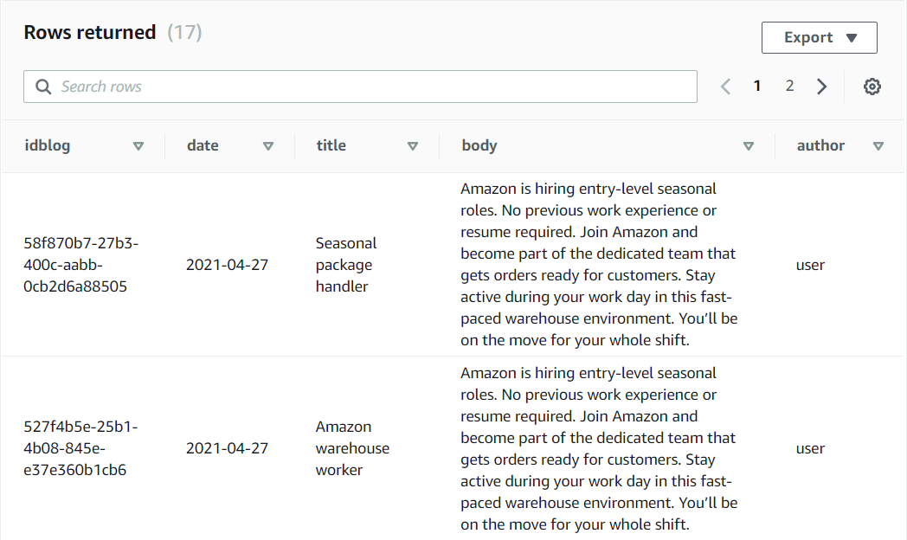
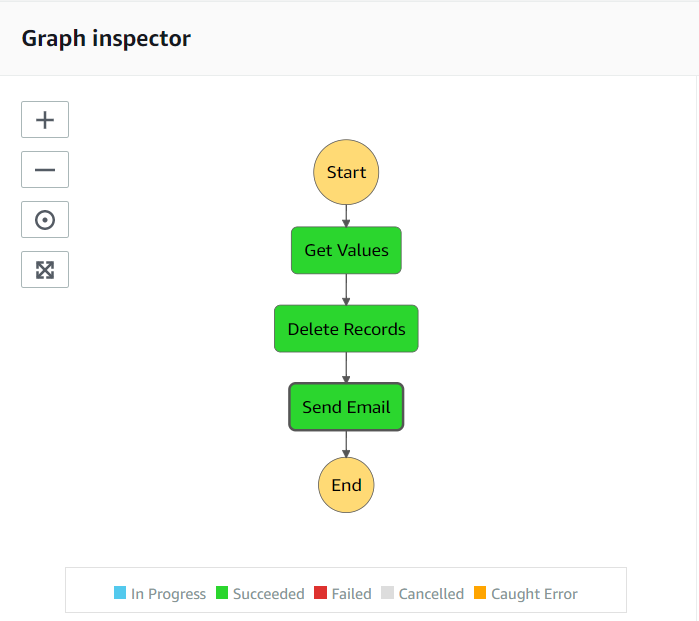
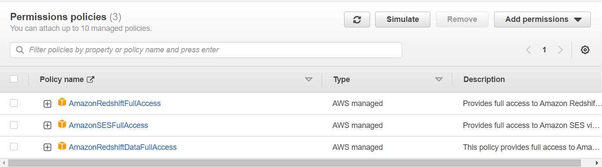
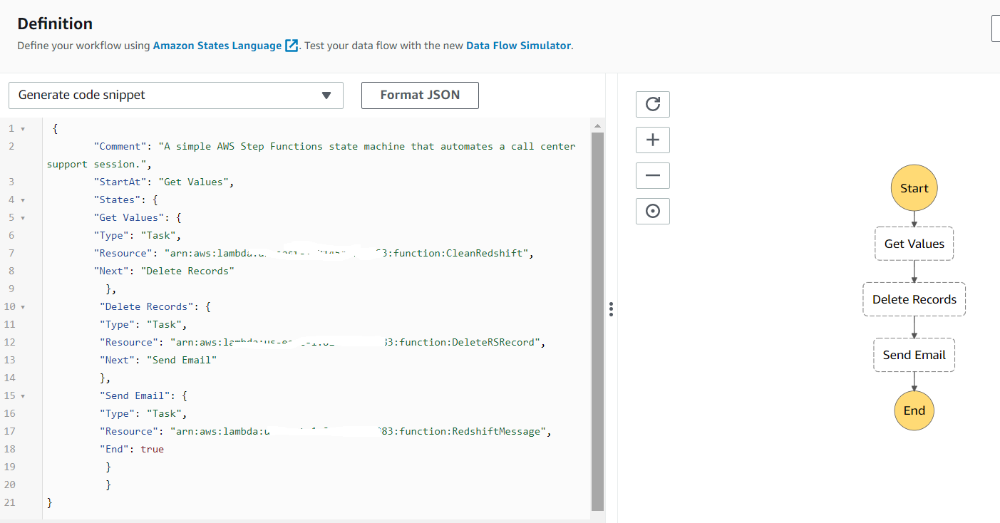
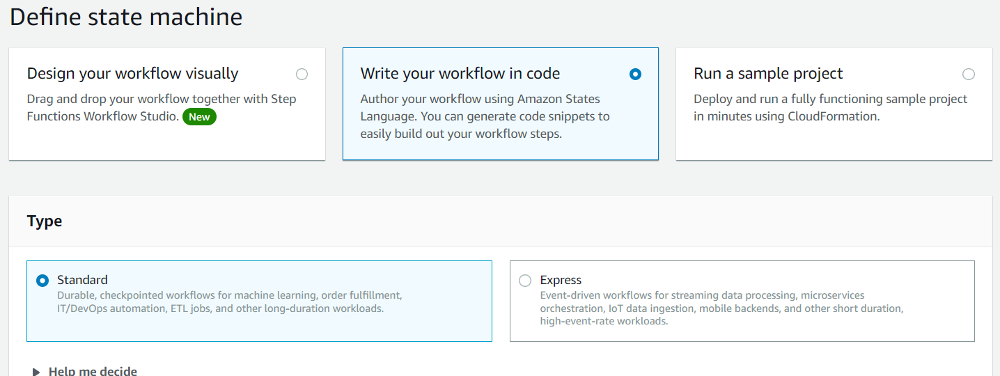
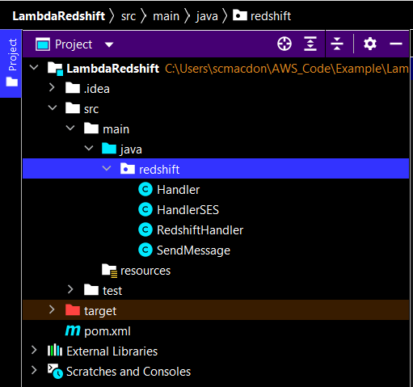
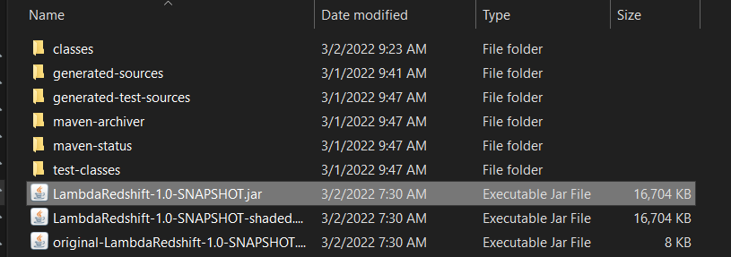
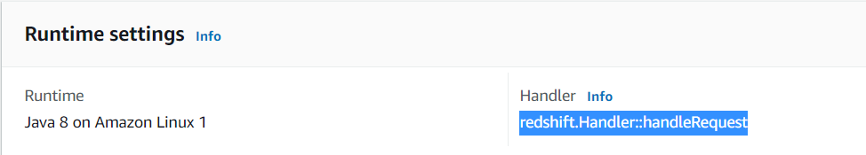
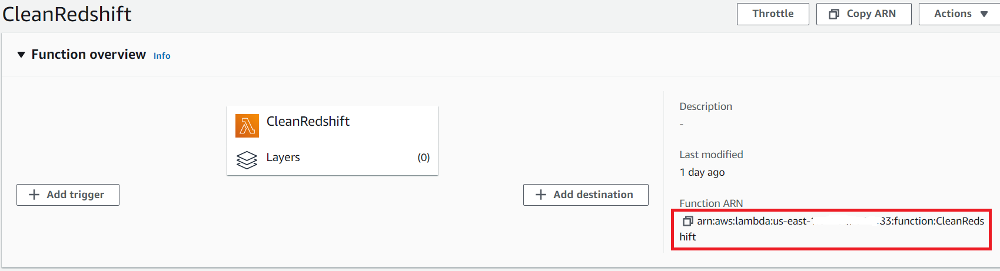
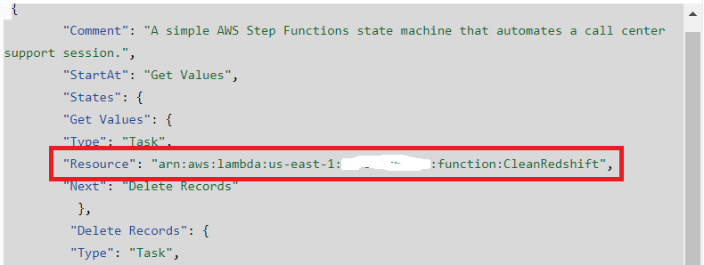

#  Create an AWS serverless workflow that modifies Amazon Redshift data by using the AWS SDK for Java

## Overview

| Heading      | Description |
| ----------- | ----------- |
| Description | Discusses how to develop a workflow using AWS Step Functions that can modify Amazon Redshift data using the AWS SDK for Java V2.     |
| Audience   |  Developer (beginner / intermediate)        |
| Updated   | 3/02/2022        |
| Required skills   | Java, Maven  |

## Purpose
You can create an AWS serverless workflow by using the AWS SDK for Java Version 2 and AWS Step Functions.
Each workflow step is implemented by using an AWS Lambda function. Lambda is a compute service that enables you to run
code without provisioning or managing servers.

**Note:** You can create Lambda functions in various programming languages. For this tutorial, Lambda functions are
implemented by using the Lambda Java API. For more information about Lambda, see
[What is AWS Lambda](https://docs.aws.amazon.com/lambda/latest/dg/welcome.html).

In this tutorial, you create a workflow that modifies Amazon Redshift data. Each workflow step performs an operation. This tutorial shows you how to use AWS SDK for Java V2 to process workflow data. For example, you'll learn how to read data that's passed to the workflow, how to pass data between steps, and how to invoke AWS services from the workflow.

#### Topics

+ Prerequisites
+ Understand the workflow
+ Create an IAM role to use to execute Lambda functions
+ Create a workflow by using AWS Step Functions
+ Create an IntelliJ project
+ Add the POM dependencies to your project
+ Create Lambda functions by using the Lambda API
+ Package the project that contains Lambda functions
+ Deploy Lambda functions
+ Add Lambda functions to the workflow
+ Invoke the workflow from the AWS Management Console

## Prerequisites

To complete the tutorial, you need the following:

+ An AWS account
+ A Java IDE (this tutorial uses the IntelliJ IDE)
+ Java JDK 1.8
+ Maven 3.6 or later

### Important

+ The AWS services included in this document are included in the [AWS Free Tier](https://aws.amazon.com/free/?all-free-tier.sort-by=item.additionalFields.SortRank&all-free-tier.sort-order=asc).
+  This code has not been tested in all AWS Regions. Some AWS services are available only in specific Regions. For more information, see [AWS Regional Services](https://aws.amazon.com/about-aws/global-infrastructure/regional-product-services). 
+ Running this code might result in charges to your AWS account. 
+ Be sure to delete all of the resources that you create during this tutorial so that you won't continue to be charged when you're done.

### Creating the resources

Create an Amazon Redshift table named **blog** that contains the fields described in this tutorial. For information about creating an Amazon Redshift table, see [Getting started using databases](https://docs.aws.amazon.com/redshift/latest/dg/c_intro_to_admin.html).

## Understand the workflow

The data that the workflow modifies is stored in an Amazon Redshift table named **blog**, as shown in this illustration. 



The **blog** table contains these fields: 

- **idblog** - A varchar field that stores a GUID value and represents the PK.
- **date** - A date field that represents the date when the record was added. 
- **title** - A varchar field that represents the title. 
- **body** - A varchar field that represents the body. 
- **author** - A varchar field that represents the author. 

**Note**: For more information about supported field data types, see [Data types](https://docs.aws.amazon.com/redshift/latest/dg/c_Supported_data_types.html). 

The following figure shows the workflow that you will create with this tutorial.



The following is what happens at each step in the workflow:
+ **Start** - Initiates the workflow.
+ **Get Values** – Gets the unique values of the Amazon Redshift records to delete and passes the values to the next step in the workflow.
+ **Delete Records** – Deletes the records that correspond to the unique values by using the Amazon Redshift Data Client Java API. 
+ **Send Email** – Sends an email message to a database administrator using Amazon Simple Email Service (Amazon SES). Informs them that Amazon Redshift records were deleted.
+ **End** - Stops the workflow.

## Create an IAM role to use to execute Lambda functions

Create the following AWS Identity and Access Management (IAM) roles:
+ **lambda-support** - Used to invoke Lambda functions.
+ **workflow-support** - Used to enable AWS Step Functions to invoke the workflow.

This tutorial uses the Amazon Redshift and Amazon SES services. The **lambda-support** role must have policies that enable it to invoke these services from a Lambda function.  
#### To create an IAM role

1. Open the AWS Management Console. Enter **IAM** in the search box, and then choose **IAM** to open the IAM console.

2. In the navigation pane, choose **Roles**, and on the **Roles** page, choose **Create Role**.

3. Select **AWS service**, and then select **Lambda**.

4. Choose **Next**.

5. Under **Permissions policies**, search for and select **AWSLambdaBasicExecutionRole**.

6. Choose **Next**.

7. Name the role **lambda-support**.

8. Choose **Create role**.

9. Choose **lambda-support** to view the overview page.

10. Choose **Add permissions**, **Attach policies**.

11. Search for **AmazonRedshiftFullAccess**, and then choose **Attach policy**.

12. Search for **AmazonRedshiftDataFullAccess**, and then choose **Attach policy**.

13. Search for **AmazonSESFullAccess**, and then choose **Attach policy**. When you're done, you can see the permissions policies.



14. Repeat this process to create an IAM role named **workflow-support**. For step three, instead of selecting **Lambda**, select **Step Functions**. You don't need to perform steps 10-13.  

## Create a serverless workflow by using Step Functions

You can create a workflow that modifies Amazon Redshift data. To define a workflow by using Step Functions, you create an Amazon States Language (JSON-based) document to define your state machine. An Amazon States Language document describes each step. After you define the document, Step Functions provides a visual representation of the workflow. The following figure shows the Amazon States Language document and the visual representation of the workflow.



Workflows can pass data between steps. For example, the **Get Values** step gets the unique value (passed to the workflow) and passes it to the **Delete Records** step. Later in this tutorial, you will create application logic in the Lambda function to read and process the data values.  

#### To create a workflow

1. Open the AWS Step Functions console at https://us-west-2.console.aws.amazon.com/states/home.

2. Choose **Create state machine**.

3. Select **Write your workflow in code**. In the **Type** area, select **Standard**.



4. Specify the Amazon States Language document by entering the following code.

```json
      {
        "Comment": "An AWS Step Functions state machine that modifies Amazon Redshift data.",
        "StartAt": "Get Values",
        "States": {
        "Get Values": {
        "Type": "Task",
        "Resource": "arn:aws:lambda:REGION:ACCOUNT_ID:function:FUNCTION_NAME",
        "Next": "Delete Records"
          },
         "Delete Records": {
         "Type": "Task",
         "Resource": "arn:aws:lambda:REGION:ACCOUNT_ID:function:FUNCTION_NAME",
         "Next": "Send Email"
         },
         "Send Email": {
         "Type": "Task",
         "Resource": "arn:aws:lambda:REGION:ACCOUNT_ID:function:FUNCTION_NAME",
         "End": true
          }
          }
}
         
```
**Note:** Don't worry about the errors related to the Lambda resource values. You'll update these values later in this tutorial.

5. Choose **Next**.

6. In the name field, enter **MyRedshiftMachine**.

7. In the **Permission** section, choose **Choose an existing role**.  

8. Choose **workflow-support** (the IAM role that you created).

9. Choose **Create state machine**. A message appears, confirming that the state machine was successfully created.

## Create an IntelliJ project named LambdaRedshift

1. In the IntelliJ IDE, choose **File**, **New**, **Project**.

2. In the **New Project** dialog box, choose **Maven**, and then choose **Next**.

3. For **GroupId**, enter **LambdaRedshift**.

4. For **ArtifactId**, enter **LambdaRedshift**.

5. Choose **Next**.

6. Choose **Finish**.

## Add the POM dependencies to your project

At this point, you have a new project named **LambdaRedshift**. Add the following code to your pom.xml file.

```xml
      <?xml version="1.0" encoding="UTF-8"?>
      <project xmlns="http://maven.apache.org/POM/4.0.0"
         xmlns:xsi="http://www.w3.org/2001/XMLSchema-instance"
         xsi:schemaLocation="http://maven.apache.org/POM/4.0.0 http://maven.apache.org/xsd/maven-4.0.0.xsd">
      <modelVersion>4.0.0</modelVersion>
      <groupId>org.example</groupId>
      <artifactId>LambdaRedshift</artifactId>
      <version>1.0-SNAPSHOT</version>
      <properties>
        <project.build.sourceEncoding>UTF-8</project.build.sourceEncoding>
        <maven.compiler.source>1.8</maven.compiler.source>
        <maven.compiler.target>1.8</maven.compiler.target>
    </properties>
    <dependencyManagement>
        <dependencies>
            <dependency>
                <groupId>software.amazon.awssdk</groupId>
                <artifactId>bom</artifactId>
                <version>2.17.136</version>
                <type>pom</type>
                <scope>import</scope>
            </dependency>
        </dependencies>
    </dependencyManagement>
    <dependencies>
        <dependency>
            <groupId>com.amazonaws</groupId>
            <artifactId>aws-lambda-java-core</artifactId>
            <version>1.2.1</version>
        </dependency>
        <dependency>
            <groupId>com.google.code.gson</groupId>
            <artifactId>gson</artifactId>
            <version>2.8.6</version>
        </dependency>
        <dependency>
            <groupId>org.apache.logging.log4j</groupId>
            <artifactId>log4j-api</artifactId>
            <version>2.17.0</version>
        </dependency>
        <dependency>
            <groupId>org.apache.logging.log4j</groupId>
            <artifactId>log4j-core</artifactId>
            <version>2.17.0</version>
            <scope>test</scope>
        </dependency>
        <dependency>
            <groupId>org.apache.logging.log4j</groupId>
            <artifactId>log4j-slf4j18-impl</artifactId>
            <version>2.17.0</version>
            <scope>test</scope>
        </dependency>
        <dependency>
            <groupId>org.junit.jupiter</groupId>
            <artifactId>junit-jupiter-api</artifactId>
            <version>5.8.2</version>
            <scope>test</scope>
        </dependency>
        <dependency>
            <groupId>org.junit.jupiter</groupId>
            <artifactId>junit-jupiter-engine</artifactId>
            <version>5.8.2</version>
            <scope>test</scope>
        </dependency>
        <dependency>
            <groupId>software.amazon.awssdk</groupId>
            <artifactId>ses</artifactId>
        </dependency>
        <dependency>
            <groupId>software.amazon.awssdk</groupId>
            <artifactId>redshift</artifactId>
        </dependency>
        <dependency>
            <groupId>software.amazon.awssdk</groupId>
            <artifactId>redshiftdata</artifactId>
        </dependency>
	<dependency>
            <groupId>javax.mail</groupId>
            <artifactId>javax.mail-api</artifactId>
            <version>1.5.5</version>
        </dependency>
        <dependency>
            <groupId>com.sun.mail</groupId>
            <artifactId>javax.mail</artifactId>
            <version>1.5.5</version>
        </dependency>    
    </dependencies>
    <build>
        <plugins>
            <plugin>
                <artifactId>maven-surefire-plugin</artifactId>
                <version>2.22.2</version>
            </plugin>
            <plugin>
                <groupId>org.apache.maven.plugins</groupId>
                <artifactId>maven-shade-plugin</artifactId>
                <version>3.2.2</version>
                <configuration>
                    <createDependencyReducedPom>false</createDependencyReducedPom>
                </configuration>
                <executions>
                    <execution>
                        <phase>package</phase>
                        <goals>
                            <goal>shade</goal>
                        </goals>
                    </execution>
                </executions>
            </plugin>
            <plugin>
                <groupId>org.apache.maven.plugins</groupId>
                <artifactId>maven-compiler-plugin</artifactId>
                <version>3.8.1</version>
                <configuration>
                    <source>1.8</source>
                    <target>1.8</target>
                </configuration>
            </plugin>
          </plugins>
         </build>
       </project>
```

## Create Lambda functions by using the AWS SDK for Java

Use the Lambda runtime API to create the Java classes that define the Lambda functions. In this example, there are three workflow steps that each correspond to a Java class. 
The following figure shows the Java classes in the project. Notice that all Java classes are located in a package named **redshift**.



To create a Lambda function by using the Lambda runtime API, you implement **com.amazonaws.services.lambda.runtime.RequestHandler**. The application logic that's executed when the workflow step is invoked is located in the **handleRequest** API operation. The return value of this operation is passed to the next step in a workflow.

Create these Java classes, which are described in the following sections:
+ **Handler** - The first step in the workflow. Retrieves the unique ID value.  
+ **RedshiftHandler** - The second step in the workflow. Uses the **RedshiftDataClient** object to delete an Amazon Redshift record. 
+ **HandlerSES** - The third step in the workflow. Sends an email message to a database administrator.
+ **SendMessage** - Uses the Amazon SES API operation to send an email message.

### Handler class

This Java code represents the **Handler** class. The class creates a Lambda function that reads the unique ID value that is passed to the workflow. Notice that you can log messages to Amazon CloudWatch Logs by using a **LambdaLogger** object. The **handleRequest** API operation passes the unique ID value to the second step in the workflow.

```java
     package redshift;

    import com.amazonaws.services.lambda.runtime.Context;
    import com.amazonaws.services.lambda.runtime.RequestHandler;
    import com.amazonaws.services.lambda.runtime.LambdaLogger;
    import com.google.gson.Gson;
    import com.google.gson.GsonBuilder;
    import java.util.Map;

    // Handler value: example.Handler
    public class Handler implements RequestHandler<Map<String,String>, String>{

    @Override
    public String handleRequest(Map<String,String> event, Context context)
    {
        LambdaLogger logger = context.getLogger();
        Gson gson = new GsonBuilder().create();

        // Log execution details
        logger.log("ENVIRONMENT VARIABLES: " + gson.toJson(System.getenv()));
        logger.log("CONTEXT: " + gson.toJson(context));
        logger.log("EVENT Data: " + gson.toJson(event));

        String myID = event.get("inputID1");
        logger.log("Record to delete: " + myID);
        return myID;
      }
    }
```

### RedshiftHandler class

The **RedshiftHandler** class is the second step in the workflow and uses the **RedshiftDataClient** object to delete a record.

```java
     package redshift;

    import software.amazon.awssdk.regions.Region;
    import software.amazon.awssdk.services.redshiftdata.model.*;
    import software.amazon.awssdk.services.redshiftdata.RedshiftDataClient;
    import com.amazonaws.services.lambda.runtime.Context;
    import com.amazonaws.services.lambda.runtime.RequestHandler;
    import com.amazonaws.services.lambda.runtime.LambdaLogger;

    public class RedshiftHandler implements RequestHandler<String, String> {

     String clusterId = "<ENTER VALUE>";
     String database = "<ENTER VALUE>";
     String dbUser = "<ENTER VALUE>";

    @Override
    public String handleRequest(String event, Context context) {
        LambdaLogger logger = context.getLogger();
        String val = event ;
        delPost(val);
        logger.log("The Amazon Redshift record that was deleted is " +val);
        return val;
        }

    private RedshiftDataClient getClient() {

        Region region = Region.US_WEST_2;
        RedshiftDataClient redshiftDataClient = RedshiftDataClient.builder()
                .region(region)
                .build();

        return redshiftDataClient;
     }

    public void delPost(String id) {

        try {

            RedshiftDataClient redshiftDataClient = getClient();
            String sqlStatement = "DELETE FROM blog WHERE idblog = '" + id + "'";

            ExecuteStatementRequest statementRequest = ExecuteStatementRequest.builder()
                    .clusterIdentifier(clusterId)
                    .database(database)
                    .dbUser(dbUser)
                    .sql(sqlStatement)
                    .build();

            redshiftDataClient.executeStatement(statementRequest);

        } catch (RedshiftDataException e) {
            System.err.println(e.getMessage());
            System.exit(1);
        }
      } 
    }

```

**Note** - Be sure to specify valid values for **clusterId**, **database**, and **dbUser** variables. Otherwise, the code doesn't work. 

### HandlerSES class

The **HandlerSES** class is the third step in the workflow and creates a **SendMessage** object. An email message is sent to an employee to notify them about the change to the Amazon Redshift database.

 ```java
      package redshift;

import com.amazonaws.services.lambda.runtime.Context;
import com.amazonaws.services.lambda.runtime.LambdaLogger;
import com.amazonaws.services.lambda.runtime.RequestHandler;
import software.amazon.awssdk.regions.Region;
import software.amazon.awssdk.services.ses.SesClient;

public class HandlerSES implements RequestHandler<String, String> {

    @Override
    public String handleRequest(String event, Context context)
    {
        LambdaLogger logger = context.getLogger();
        String val = event ;

        SendMessage msg = new SendMessage();
        String sender = "<Enter value>" ;
        String recipient = "<Enter value>" ;
        String subject = "Deleted Amazon Redshift Record" ;

        Region region = Region.US_EAST_1;
        SesClient client = SesClient.builder()
                .region(region)
                .build();

        // The HTML body of the email
        String bodyHTML = "<html>" + "<head></head>" + "<body>" + "<h1>Hello!</h1>"
                + "<p> Amazon Redshift record "+val +" was deleted!</p>" + "</body>" + "</html>";

        try {
            msg.sendMessage(client, sender, recipient, subject, bodyHTML);

        } catch (javax.mail.MessagingException e)
        {
            e.getStackTrace();
        }

        return "Ok" ;
      }
    }

```

**Note** - Be sure to specify valid values for **sender** and **recipient** variables. Otherwise, the code doesn't work. 


### SendMessage class

The following Java class represents the **SendMessage** class. This class uses the Amazon SES API operation to send an email message to the employee. Any email address that you send a message to must be verified. For more information, see [Verifying an email address](https://docs.aws.amazon.com/ses/latest/DeveloperGuide//verify-email-addresses-procedure.html).

 ```java
      package redshift;

     import software.amazon.awssdk.services.ses.SesClient;
     import software.amazon.awssdk.services.ses.model.*;
     import software.amazon.awssdk.services.ses.model.Body;
     import javax.mail.MessagingException;

     public class SendMessage {

     public static void sendMessage(SesClient client,
                                   String sender,
                                   String recipient,
                                   String subject,
                                   String bodyHTML
     ) throws MessagingException {

        Destination destination = Destination.builder()
                .toAddresses(recipient)
                .build();

        Content content = Content.builder()
                .data(bodyHTML)
                .build();

        Content sub = Content.builder()
                .data(subject)
                .build();

        Body body = Body.builder()
                .html(content)
                .build();

        software.amazon.awssdk.services.ses.model.Message msg = Message.builder()
                .subject(sub)
                .body(body)
                .build();

        SendEmailRequest emailRequest = SendEmailRequest.builder()
                .destination(destination)
                .message(msg)
                .source(sender)
                .build();

        try {
            System.out.println("Attempting to send an email through Amazon SES " + "using the AWS SDK for Java...");
            client.sendEmail(emailRequest);

        } catch (SesException e) {
            System.err.println(e.awsErrorDetails().errorMessage());
            System.exit(1);
        }
      } 
    }

 ```
 
## Package the project that contains the Lambda functions

Package up the project into a .jar (JAR) file that you can deploy as a Lambda function by using the following Maven command.

    mvn package

The JAR file is located in the **target** folder (which is a child folder of the project folder).



## Deploy the Lambda functions

Note: This section describes how to deploy a Lambda function by using the AWS Management Console. However, if you prefer to use the AWS SDK for Java, see <https://github.com/awsdocs/aws-doc-sdk-examples/blob/main/javav2/example_code/lambda/src/main/java/com/example/lambda/CreateFunction.java>.

1. Open the Lambda console at https://us-west-2.console.aws.amazon.com/lambda/home.

2. Choose **Create function**.

3. Select **Author from scratch**.

4. In the **Basic information** section, under **Function name**, enter **CleanRedshift**.

5. For **Runtime**, choose **Java 8**.

6. Choose **Change default execution role**, then select **Use an existing role**.

7. Choose **lambda-support** (the IAM role that you created).

8. Choose **Create function**.

9. For **Code entry type**, choose **Upload a .zip or .jar file**.

10. Choose **Upload**, and then browse to the JAR file that you created. 

11. For **Handler**, enter the fully qualified name of the function. For example, **redshift.Handler::handleRequest** (**redshift.Handler** specifies the package and class followed by :: and the API operation).



12. Choose **Save.**

13. Repeat this procedure for the **HandlerSES** and **RedshiftHandler** classes. Name the corresponding Lambda functions **DeleteRSRecord** and **RedshiftMessage**. When you finish, you will have three Lambda functions that you can reference in the Amazon States Language document.  

## Add the Lambda functions to the workflow

Open the Lambda console. Notice that you can view the Lambda Amazon Resource Name (ARN) value in the upper-right corner.



Copy the value. In the Step Functions console, paste the value into step 1 of the Amazon States Language document.



Update the resource for the **Delete Records** and **Send Email** steps. This is how you hook in Lambda functions created by using the AWS SDK for Java into a workflow created by using Step Functions.

## Execute your workflow by using the Step Functions console

You can invoke the workflow on the Step Functions console.  An execution receives JSON input. For this example, you can pass the following JSON data to the workflow.  

      {
        "inputID1": "5f376586-ca17-4a9c-b1e0-1b520e46b089"
      }

**Note**: Make sure that the value that you specify corresponds to a PK value of a record. 

#### To execute your workflow

1. On the Step Functions console, choose **Start execution**.

2. In the **Input** section, pass the JSON data. View the workflow. As each step is completed, it turns green.


If the step turns red, an error occurred. You can click the step and view the logs that are accessible from the right side.

When the workflow is finished, the Amazon Redshift record that corresponds to the unique value is deleted. 

### Next steps
Congratulations, you have created an AWS serverless workflow by using the AWS SDK for Java. Be sure to delete all of the resources that you created during this tutorial so that you won't continue to be charged.

For more AWS multiservice examples, see
[usecases](https://github.com/awsdocs/aws-doc-sdk-examples/tree/master/javav2/usecases).
