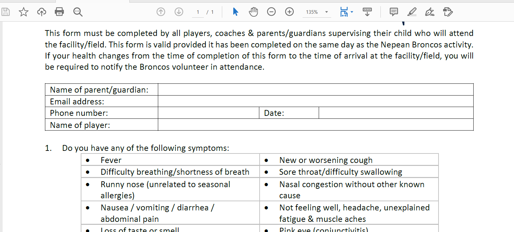
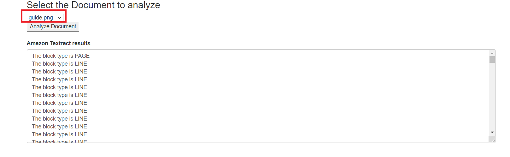
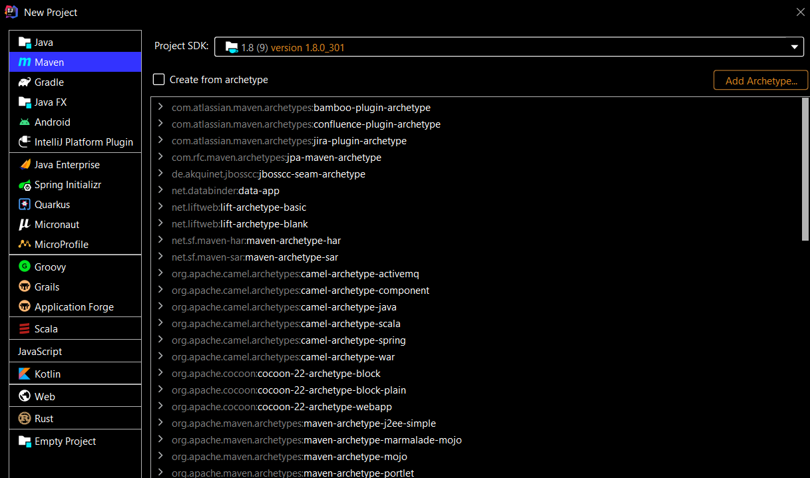
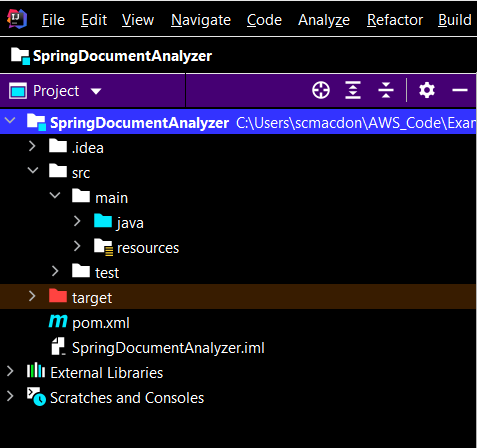

#  Creating an AWS document analyzer application using the AWS SDK for Java

## Purpose

You can create an AWS application that analyzes PDF document images located in an Amazon Simple Storage Service (Amazon S3) bucket by using the Amazon Textract service. The following information can be returned in Block objects.

- The lines and words of detected text
- The relationships between the lines and words of detected text
- The page that the detected text appears on
- The location of the lines and words of text on the document page

For example, the following image shows a PDF document that represents a health form.



After the application analyzes this document, it creates this data:

* The block type is PAGE
* The block type is LINE
* The block type is LINE
* The block type is LINE
* The block type is WORD
* The block type is WORD
* The block type is WORD

In this tutorial, you create a Spring Boot application named **AWS Document Analyzer**. The Spring Boot APIs are used to build a model, different views, and a controller. For more information, see [Spring Boot](https://www.tutorialspoint.com/spring_boot/index.htm).

This application uses the following AWS services:
*	Amazon Textract
*	Amazon S3

#### Topics

+ Prerequisites
+ Understand the AWS document analyzer application
+ Create an IntelliJ project named SpringPhotoAnalyzer
+ Add the POM dependencies to your project
+ Create the Java classes
+ Create the HTML files
+ Create the script files
+ Package the project into a JAR file
+ Deploy the application to AWS Elastic Beanstalk

## Prerequisites

To complete the tutorial, you need the following:

+ An AWS account
+ A Java IDE (this tutorial uses the IntelliJ IDE)
+ Java JDK 1.8
+ Maven 3.6 or later

### Important

+ The AWS services included in this document are included in the [AWS Free Tier](https://aws.amazon.com/free/?all-free-tier.sort-by=item.additionalFields.SortRank&all-free-tier.sort-order=asc).
+  This code has not been tested in all AWS Regions. Some AWS services are available only in specific regions. For more information, see [AWS Regional Services](https://aws.amazon.com/about-aws/global-infrastructure/regional-product-services). 
+ Running this code might result in charges to your AWS account. 
+ Be sure to terminate all of the resources you create while going through this tutorial to ensure that you’re not charged.

### Creating the resources

Create an Amazon S3 bucket named **doc[somevalue]**. Be sure to use this bucket name in your Amazon S3 Java code. Place a few PNG images of a PDF document in the bucket. This application reads the PNG images and displays them in the web application. For information, see [Creating a bucket](https://docs.aws.amazon.com/AmazonS3/latest/gsg/CreatingABucket.html).

## Understand the AWS document analyzer application

The following illustration shows the Home page of the application. 


The AWS document analyzer application supports uploading PDF images to an Amazon S3 bucket. 


After the PDF image is uploaded, you can select the image from a drop down field. Then choose the **Analyze Document** button and the results are displayed in the web application. 



## Create an IntelliJ project named SpringDocumentAnalyzer

The first step is to create an Maven project.



1. In the IntelliJ IDE, choose **File**, **New**, **Project**.
2. In the **New Project** dialog box, choose **Maven**, and then choose **Next**.
3. For **GroupId**, enter **aws-spring**.
4. For **ArtifactId**, enter **SpringDocumentAnalyzer**.
6. Choose **Next**.
7. Choose **Finish**.

## Add the POM dependencies to your project

At this point, you have a new project named **SpringDocumentAnalyzer**.



  **Note:** Ensure that you are using Java 1.8 (as shown in the following **pom.xml** file).

Add the Spring Boot dependencies. The **pom.xml** file looks like the following.

```xml
      <?xml version="1.0" encoding="UTF-8"?>
      <project xmlns="http://maven.apache.org/POM/4.0.0"
         xmlns:xsi="http://www.w3.org/2001/XMLSchema-instance"
         xsi:schemaLocation="http://maven.apache.org/POM/4.0.0 http://maven.apache.org/xsd/maven-4.0.0.xsd">
     <modelVersion>4.0.0</modelVersion>

     <groupId>org.example</groupId>
     <artifactId>SpringDocumentAnalyzer</artifactId>
     <version>1.0-SNAPSHOT</version>

     <parent>
        <groupId>org.springframework.boot</groupId>
        <artifactId>spring-boot-starter-parent</artifactId>
        <version>2.0.4.RELEASE</version>
        <relativePath/> <!-- lookup parent from repository -->
     </parent>
     <properties>
        <java.version>1.8</java.version>
     </properties>
     <dependencyManagement>
        <dependencies>
            <dependency>
                <groupId>software.amazon.awssdk</groupId>
                <artifactId>bom</artifactId>
                <version>2.10.54</version>
                <type>pom</type>
                <scope>import</scope>
            </dependency>
        </dependencies>
     </dependencyManagement>
     <dependencies>
        <dependency>
            <groupId>org.springframework.boot</groupId>
            <artifactId>spring-boot-starter-thymeleaf</artifactId>
        </dependency>
        <dependency>
            <groupId>org.springframework.boot</groupId>
            <artifactId>spring-boot-starter-web</artifactId>
        </dependency>
        <dependency>
            <groupId>net.sourceforge.jexcelapi</groupId>
            <artifactId>jxl</artifactId>
            <version>2.6.10</version>
        </dependency>
        <dependency>
            <groupId>commons-io</groupId>
            <artifactId>commons-io</artifactId>
            <version>2.6</version>
        </dependency>
        <dependency>
            <groupId>javax.mail</groupId>
            <artifactId>javax.mail-api</artifactId>
            <version>1.5.5</version>
        </dependency>
        <dependency>
            <groupId>software.amazon.awssdk</groupId>
            <artifactId>textract</artifactId>
        </dependency>
        <dependency>
            <groupId>org.springframework.boot</groupId>
            <artifactId>spring-boot-starter-test</artifactId>
            <scope>test</scope>
            <exclusions>
                <exclusion>
                    <groupId>org.junit.vintage</groupId>
                    <artifactId>junit-vintage-engine</artifactId>
                </exclusion>
            </exclusions>
        </dependency>
        <dependency>
            <groupId>software.amazon.awssdk</groupId>
            <artifactId>dynamodb</artifactId>
        </dependency>
        <dependency>
            <groupId>software.amazon.awssdk</groupId>
            <artifactId>ses</artifactId>
        </dependency>
        <dependency>
            <groupId>software.amazon.awssdk</groupId>
            <artifactId>rekognition</artifactId>
        </dependency>
        <dependency>
            <groupId>software.amazon.awssdk</groupId>
            <artifactId>s3</artifactId>
        </dependency>
     </dependencies>
     <build>
        <plugins>
            <plugin>
                <groupId>org.springframework.boot</groupId>
                <artifactId>spring-boot-maven-plugin</artifactId>
            </plugin>
        </plugins>
     </build>
   </project>
```

## Create the Java classes

Create a Java package in the **main/java** folder named **com.aws.example**. The Java files go into this package.


Create these Java classes:

+ **DocumentApplication** - Used as the base class for the Spring Boot application.
+ **DocumentController** - Used as the Spring Boot controller that handles HTTP requests..   
+ **S3Service** - Uses the Amazon S3 API to perform S3 operations.
+ **TextractService** -Uses the Amazon Textract API to perform document operations.


### DocumentApplication class

The following Java code represents the **DocumentApplication** class.

```java
    package com.aws.example;

    import org.springframework.boot.SpringApplication;
    import org.springframework.boot.autoconfigure.SpringBootApplication;

    @SpringBootApplication
    public class DocumentApplication {

    public static void main(String[] args) {
        SpringApplication.run(DocumentApplication.class, args);
     }
    }
```

### DocumentController class

The following Java code represents the **DocumentController** class.

```java
    package com.aws.example;

    import org.springframework.beans.factory.annotation.Autowired;
    import org.springframework.stereotype.Controller;
    import org.springframework.web.bind.annotation.*;
    import javax.servlet.http.HttpServletRequest;
    import javax.servlet.http.HttpServletResponse;
    import org.springframework.web.servlet.ModelAndView;
    import org.springframework.web.multipart.MultipartFile;
    import org.springframework.web.servlet.view.RedirectView;
    import java.io.IOException;

    @Controller
    public class DocumentController {

     private String bucketName = "scottdocbucket";

     @Autowired
     S3Service s3Service;

     @Autowired
     TextractService textractService;

     @GetMapping("/")
     public String root() {
        return "index";
     }

    @GetMapping("/process")
    public String process() {
        return "process";
    }

    @RequestMapping(value = "/getdocs", method = RequestMethod.GET)
    @ResponseBody
    String getDoc(HttpServletRequest request, HttpServletResponse response) {
        return s3Service.ListAllObjects(bucketName);
    }


    @RequestMapping(value = "/analyzeDoc", method = RequestMethod.POST)
    @ResponseBody
    String getImages(HttpServletRequest request, HttpServletResponse response) {

        String name = request.getParameter("name");

        // Get the byte[] from a PDF document image in an Amazon S3 bucket.
        byte[] obBytes = s3Service.getObjectBytes(bucketName, name);

        // Analyzes the PDF image.
        String xmlResults = textractService.analyzeDoc(obBytes);
        return xmlResults ;
     }

    // Upload a Document to analyze.
    @RequestMapping(value = "/upload", method = RequestMethod.POST)
    @ResponseBody
    public ModelAndView singleFileUpload(@RequestParam("file") MultipartFile file) {

        try {

            byte[] bytes = file.getBytes();
            String name =  file.getOriginalFilename() ;

           // Put the posted PDF file into the bucket.
           s3Service.putObject(bytes, bucketName, name);

        } catch (IOException e) {
            e.printStackTrace();
        }
        return new ModelAndView(new RedirectView("process"));
      }
    }
```
### S3Service class

The following class uses the Amazon S3 API to perform S3 operations. For example, the **getObjectBytes** method returns a byte array that represents the image. Be sure to replace the bucket name in this code example with your bucket name.

```java
    package com.aws.example;

    import org.springframework.stereotype.Component;
    import org.w3c.dom.Document;
    import org.w3c.dom.Element;
    import software.amazon.awssdk.core.ResponseBytes;
    import software.amazon.awssdk.core.sync.RequestBody;
    import software.amazon.awssdk.regions.Region;
    import software.amazon.awssdk.services.s3.S3Client;
    import software.amazon.awssdk.services.s3.model.*;
    import javax.xml.parsers.DocumentBuilder;
    import javax.xml.parsers.DocumentBuilderFactory;
    import javax.xml.parsers.ParserConfigurationException;
    import javax.xml.transform.Transformer;
    import javax.xml.transform.TransformerException;
    import javax.xml.transform.TransformerFactory;
    import javax.xml.transform.dom.DOMSource;
    import javax.xml.transform.stream.StreamResult;
    import java.io.StringWriter;
    import java.util.ArrayList;
    import java.util.List;
    import java.util.ListIterator;

    @Component
    public class S3Service {

    S3Client s3 ;

    // Create the S3Client object.
    private S3Client getClient() {

        Region region = Region.US_EAST_1 ;
        S3Client s3 = S3Client.builder()
                .region(region)
                .build();

        return s3;
    }

    // Get the byte[] from this Amazon S3 object.
    public byte[] getObjectBytes (String bucketName, String keyName) {

        s3 = getClient();

        try {
            GetObjectRequest objectRequest = GetObjectRequest
                    .builder()
                    .key(keyName)
                    .bucket(bucketName)
                    .build();

            ResponseBytes<GetObjectResponse> objectBytes = s3.getObjectAsBytes(objectRequest);
            byte[] data = objectBytes.asByteArray();
            return data;

        } catch (S3Exception e) {
            System.err.println(e.awsErrorDetails().errorMessage());
            System.exit(1);
        }
        return null;
    }

    // Returns the names of all images and data within an XML document.
    public String ListAllObjects(String bucketName) {

        s3 = getClient();


        List bucketItems = new ArrayList<String>();

        try {
            ListObjectsRequest listObjects = ListObjectsRequest
                    .builder()
                    .bucket(bucketName)
                    .build();

            ListObjectsResponse res = s3.listObjects(listObjects);
            List<S3Object> objects = res.contents();

            for (ListIterator iterVals = objects.listIterator(); iterVals.hasNext(); ) {
                S3Object myValue = (S3Object) iterVals.next();
                // Push the key to  the list.
                bucketItems.add(myValue.key());
            }

            return convertToString(toXml(bucketItems));

        } catch (S3Exception e) {
            System.err.println(e.awsErrorDetails().errorMessage());
            System.exit(1);
        }
        return null ;
    }


    // Places a PDF object into an Amazon S3 bucket.
    public String putObject(byte[] data, String bucketName, String objectKey) {

        s3 = getClient();

        try {
            PutObjectResponse response = s3.putObject(PutObjectRequest.builder()
                            .bucket(bucketName)
                            .key(objectKey)
                            .build(),
                    RequestBody.fromBytes(data));

            return response.eTag();

        } catch (S3Exception e) {
            System.err.println(e.getMessage());
            System.exit(1);
        }
        return "";
    }

    // Convert items into XML to pass back to the view.
    private Document toXml(List<String> itemList) {

        try {
            DocumentBuilderFactory factory = DocumentBuilderFactory.newInstance();
            DocumentBuilder builder = factory.newDocumentBuilder();
            Document doc = builder.newDocument();

            // Start building the XML.
            Element root = doc.createElement( "Docs" );
            doc.appendChild( root );

            // Get the elements from the collection.
            int custCount = itemList.size();

            // Iterate through the collection.
            for ( int index=0; index < custCount; index++) {

                // Get the WorkItem object from the collection.
                String docName = itemList.get(index);

                Element item = doc.createElement( "Doc" );
                root.appendChild( item );

                // Set Key.
                Element id = doc.createElement( "Key" );
                id.appendChild( doc.createTextNode(docName) );
                item.appendChild( id );
            }

            return doc;
        } catch(ParserConfigurationException e) {
            e.printStackTrace();
        }
        return null;
    }

    private String convertToString(Document xml) {
        try {
            Transformer transformer = TransformerFactory.newInstance().newTransformer();
            StreamResult result = new StreamResult(new StringWriter());
            DOMSource source = new DOMSource(xml);
            transformer.transform(source, result);
            return result.getWriter().toString();

        } catch(TransformerException ex) {
            ex.printStackTrace();
        }
        return null;
    }
}
```

### TextractService class

The following Java code represents the **TextractService** class. 

```java
    package com.aws.example;

    import org.springframework.stereotype.Component;
    import org.w3c.dom.Element;
    import software.amazon.awssdk.core.SdkBytes;
    import software.amazon.awssdk.regions.Region;
    import software.amazon.awssdk.services.textract.TextractClient;
    import software.amazon.awssdk.services.textract.model.AnalyzeDocumentRequest;
    import software.amazon.awssdk.services.textract.model.Document;
    import software.amazon.awssdk.services.textract.model.FeatureType;
    import software.amazon.awssdk.services.textract.model.AnalyzeDocumentResponse;
    import software.amazon.awssdk.services.textract.model.Block;
    import software.amazon.awssdk.services.textract.model.TextractException;
    import javax.xml.parsers.DocumentBuilder;
    import javax.xml.parsers.DocumentBuilderFactory;
    import javax.xml.parsers.ParserConfigurationException;
    import javax.xml.transform.Transformer;
    import javax.xml.transform.TransformerException;
    import javax.xml.transform.TransformerFactory;
    import javax.xml.transform.dom.DOMSource;
    import javax.xml.transform.stream.StreamResult;
    import java.io.StringWriter;
    import java.util.ArrayList;
    import java.util.Iterator;
    import java.util.List;

    @Component
    public class TextractService {


    public String analyzeDoc(byte[] bytes) {


        List myList = new ArrayList<String>();
        try {
            Region region = Region.US_EAST_2;
            TextractClient textractClient = TextractClient.builder()
                    .region(region)
                    .build();

            SdkBytes sourceBytes = SdkBytes.fromByteArray(bytes);

            // Get the input Document object as bytes
            Document myDoc = Document.builder()
                    .bytes(sourceBytes)
                    .build();

            List<FeatureType> featureTypes = new ArrayList<FeatureType>();
            featureTypes.add(FeatureType.FORMS);
            featureTypes.add(FeatureType.TABLES);

            AnalyzeDocumentRequest analyzeDocumentRequest = AnalyzeDocumentRequest.builder()
                    .featureTypes(featureTypes)
                    .document(myDoc)
                    .build();

            AnalyzeDocumentResponse analyzeDocument = textractClient.analyzeDocument(analyzeDocumentRequest);
            List<Block> docInfo = analyzeDocument.blocks();
            Iterator<Block> blockIterator = docInfo.iterator();

            while(blockIterator.hasNext()) {
                Block block = blockIterator.next();
                myList.add("The block type is " +block.blockType().toString());
            }

            return convertToString(toXml(myList));
     
         } catch (TextractException  e) {

            System.err.println(e.getMessage());
            System.exit(1);
        }

        return "" ;
      }

      // Convert items into XML to pass back to the view.
      private org.w3c.dom.Document toXml(List<String> itemList) {

        try {
            DocumentBuilderFactory factory = DocumentBuilderFactory.newInstance();
            DocumentBuilder builder = factory.newDocumentBuilder();
            org.w3c.dom.Document doc = builder.newDocument();

            // Start building the XML.
            Element root = doc.createElement( "Items" );
            doc.appendChild( root );

            // Get the elements from the collection.
            int custCount = itemList.size();

            // Iterate through the collection.
            for ( int index=0; index < custCount; index++) {

                String itemValue = itemList.get(index);

                Element item = doc.createElement( "Item" );
                root.appendChild( item );

                // Set Key.
                Element id = doc.createElement( "Doc" );
                id.appendChild( doc.createTextNode(itemValue) );
                item.appendChild( id );
            }

            return doc;
        } catch(ParserConfigurationException e) {
            e.printStackTrace();
        }
        return null;
       }

      private String convertToString(org.w3c.dom.Document xml) {
        try {
            Transformer transformer = TransformerFactory.newInstance().newTransformer();
            StreamResult result = new StreamResult(new StringWriter());
            DOMSource source = new DOMSource(xml);
            transformer.transform(source, result);
            return result.getWriter().toString();

         } catch(TransformerException ex) {
            ex.printStackTrace();
         }
        return null;
      }
     }
```

## Create the HTML files

At this point, you have created all of the Java files required for the AWS Document Analyzer application. Now you create the HTML files that are required for the application's graphical user interface (GUI). Under the **resource** folder, create a **templates** folder, and then create the following HTML files:

+ index.html
+ process.html
+ layout.html

The **index.html** file is the application's home view. The **process.html** file represents the view for viewing the data. The **layout.html** file represents the menu that's visible in all views.

### index.html

The following HTML represents the **index.html** file.

```html
    <!DOCTYPE html>
    <html xmlns:th="http://www.thymeleaf.org">

    <head>
     <meta charset="utf-8" />
     <meta http-equiv="X-UA-Compatible" content="IE=edge" />
     <meta name="viewport" content="width=device-width, initial-scale=1" />

     <link rel="stylesheet" th:href="|https://maxcdn.bootstrapcdn.com/bootstrap/3.3.7/css/bootstrap.min.css|"/>
     <script th:src="|https://code.jquery.com/jquery-1.12.4.min.js|"></script>
     <script th:src="|https://code.jquery.com/ui/1.11.4/jquery-ui.min.js|"></script>
     <link rel="stylesheet" href="../public/css/styles.css" th:href="@{/css/styles.css}" />
     <link rel="icon" href="../public/images/favicon.ico" th:href="@{/images/favicon.ico}" />
      </head>
    <body>
    <header th:replace="layout :: site-header"/>
    <div class="container">

     <h2>AWS Document Analyzer Application</h2>

     <p>The AWS Document Analyzer application is a sample application that uses the Amazon Textract Service as well as other AWS Services and the Java V2 SDK.
        Analyzing PDF documents has never been easier! Simply perform these steps:<p>

     <ol>
        <li>You can upload a PDF document to an Amazon S3 bucket by choosing the <i>Upload Documents</i> menu item.</li>
        <li>Choose <i>Choose File</i> and browse to a PDF document located on your local desktop.</li>
        <li>Choose <i>Upload</i> to upload the PDF document to an Amazon S3 bucket.</li>
        <li>You can choose <i>Get Documents</i> to view the PDF documents located in the Amazon S3 bucket. All documents in the Amazon S3 bucket are displayed in the drop-down field. </li>
        <li>You can analyze a given PDF document by choosing the <i>Analyze Documents</i> menu item. </li>
        <li>Select a PDF document from the drop-down field and choose <i>Analyze Document</i>. The results are displaced in the application.  </li>
     </ol>
     </div>
    </body>
    </html>
```

### process.html

The following HTML represents the **process.html** file.

```html
     <html xmlns:th="http://www.thymeleaf.org">
     <head>
     <meta charset="utf-8" />
     <script th:src="|https://cdnjs.cloudflare.com/ajax/libs/popper.js/1.12.9/umd/popper.min.js|"></script>
     <script th:src="|https://code.jquery.com/jquery-1.12.4.min.js|"></script>
     <script th:src="|https://code.jquery.com/ui/1.11.4/jquery-ui.min.js|"></script>
     <script src="https://maxcdn.bootstrapcdn.com/bootstrap/3.3.6/js/bootstrap.min.js"></script>
     <link href="https://maxcdn.bootstrapcdn.com/bootstrap/3.3.6/css/bootstrap.min.css" rel="stylesheet"/>
     <script src="../public/js/message.js" th:src="@{/js/items.js}"></script>
     <link rel="stylesheet" href="../public/css/styles.css" th:href="@{/css/styles.css}" />
     <link rel="icon" href="../public/images/favicon.ico" th:href="@{/images/favicon.ico}" />
    </head>

    <body>
     <header th:replace="layout :: site-header"/>

    <div class="container">
     <h2>AWS Document Analyzer Application</h2>
     <div>
        <p>Upload a PDF document to an Amazon S3 Bucket</p>

        <form method="POST" onsubmit="myFunction()" action="/upload" enctype="multipart/form-data">
            <input type="file" name="file"/>
            <input type="submit" value="Submit" />
        </form>
     </div>
     <div>
     <h3>Select the Document to analyze</h3>
        <div class="dropdown">
            <select name="docs" id="docs">

            </select>
    </div>
        <button onclick="analyeDoc()">Analyze Document </button>
    </div>
     <div>
        <br>
       <div class="form-group">
            <label for="textarea1">Amazon Textract results</label>
            <textarea class="form-control" id="textarea1" rows="3"></textarea>
        </div>
    </div>
    </div>
    </body>
    </html>
```

### layout.html

The following HTML represents the **layout.html** file for the application's menu.

```html
     <!DOCTYPE html>
      <html xmlns:th="http://www.thymeleaf.org">
     <head th:fragment="site-head">
      <meta charset="UTF-8" />
      <script th:src="|https://code.jquery.com/jquery-1.12.4.min.js|"></script>
      <meta th:include="this :: head" th:remove="tag"/>
      </head>
     <body>
    <header th:fragment="site-header">
     <a href="#" style="color: white" th:href="@{/}">Home</a>
     <a href="#"  style="color: white" th:href="@{/process}">Analyze Documents</a>
    </header>

```
## Create script files

The process view use a script file to communicate with the Spring controller. You have to ensure that this file is part of your project; otherwise, your application won't work.

### items.js

The following JavaScript represents the **items.js** file.

```javascript
    $(function() {

    getDocNames() ;
    } );


    function myFunction() {
      alert("The PDF document was submitted");
    }

    function analyeDoc() {

     // Get the doc
     var name = $("#docs").val();

     $.ajax('/analyzeDoc', {
        type: 'POST',  // http method
        data: 'name=' + name ,  // data to submit
        success: function (data, status, xhr) {
            var xml = data
            $(xml).find('Item').each(function () {

                var $field = $(this);
                var doc = $field.find('Doc').text();

                var oldValue = $("#textarea1").val();

                if (oldValue === "") {
                    $("#textarea1").val(doc);
                } else {
                    $("#textarea1").val(oldValue + "\n" + doc);
                }
           });
        },
        error: function (jqXhr, textStatus, errorMessage) {
            $('p').append('Error' + errorMessage);
        }
      });
      }

     function getDocNames() {

     // Clear the current drop down.
     $("#docs").empty()

       $.ajax('/getdocs', {
         type: 'GET',  // http method
         success: function (data, status, xhr) {

            var xml = data;
            $(xml).find('Doc').each(function () {
               var $field = $(this);
               var name = $field.find('Key').text();

              $('#docs').append($('<option/>', {
                    value: name,
                    text : name
                }));
            });
           },
        error: function (jqXhr, textStatus, errorMessage) {
            $('p').append('Error' + errorMessage);
        }
      });
     }
```

**Note:** There are other CSS files located in the GitHub repository that you must add to your project. Ensure all of the files under the **resources** folder are included in your project.   

## Run the application

Using the IntelliJ IDE, you can run your application. The first time you run the Spring Boot application, you can run the application by clicking the run icon in the Spring Boot main class, as shown in this illustration. 


### Next steps
Congratulations! You have created and deployed the AWS Document Analyzer application. As stated at the beginning of this tutorial, be sure to terminate all of the resources you create while going through this tutorial to ensure that you’re no longer charged for them.

For more AWS multiservice examples, see
[usecases](https://github.com/awsdocs/aws-doc-sdk-examples/tree/master/javav2/usecases).
