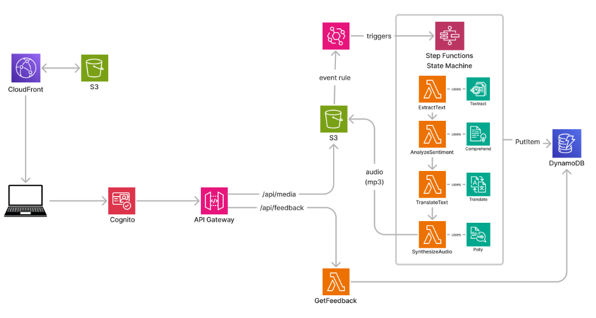
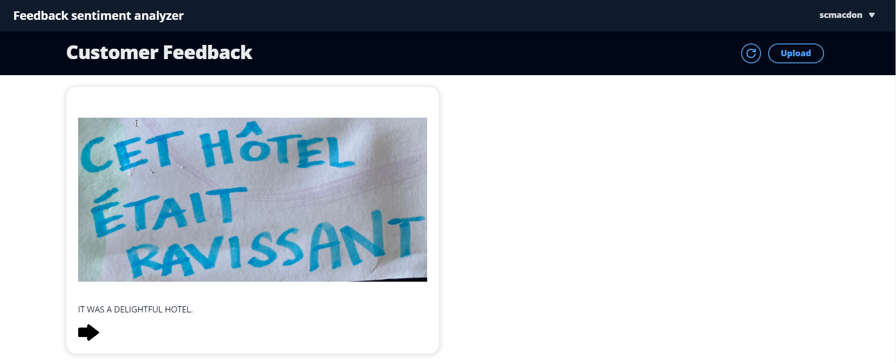
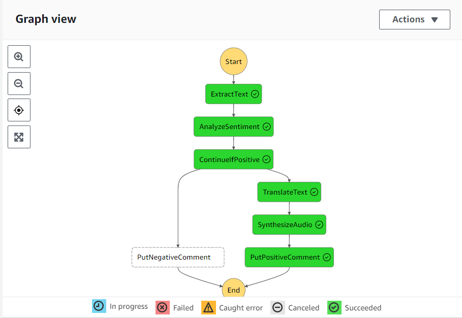
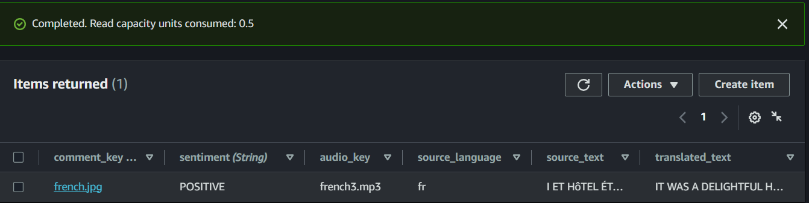

#  Creating a Feedback Sentiment Analyzer application using the SDK for Java

## Overview

| Heading      | Description |
| -----------  | ----------- |
| Description  | Discusses how to develop a Feedback Sentiment Analyzer application using [Machine Learning AWS services](https://aws.amazon.com/machine-learning/). The application solves a fictitious use case of a hotel that receives guest feedback on comment cards in a variety of languages. The application is developed by using the AWS SDK for Java (v2) and asynchronous service clients. For information, see [Asynchronous programming](https://docs.aws.amazon.com/sdk-for-java/latest/developer-guide/asynchronous.html).     |
| Audience     |  Developer (intermediate / advanced)        |
| Updated      | 9/12/2023        |
| Required skills   | Java, Maven  |

## Purpose

You can develop a sample application for a Feedback Sentiment Analyzer (FSA) that accomplishes the following tasks:

1. Hosts static website assets in an Amazon Simple Storage Service (Amazon S3) bucket, and uses an Amazon CloudFront distribution to serve the website.
2. Implements authenticated access to Amazon API Gateway through Amazon Cognito.
3. Configures Amazon API Gateway to deposit items into an S3 bucket, subsequently triggering an Amazon EventBridge rule that initiates an AWS Step Functions workflow.
4. The Step Functions workflow leverages AWS Lambda, Amazon Textract, Amazon Comprehend, Amazon Translate, and Amazon Polly to execute the core business logic.
5. Metadata gets stored within Amazon DynamoDB, while audio files are stored in the same S3 bucket referenced in step 3.
6. Amazon API Gateway retrieves the metadata from Amazon DynamoDB.




As displayed in the preceding illustration, the FSA application uses the following AWS services:

* Amazon Textract - Extracts text
* Amazon Comprehend - Detects sentiment
* Amazon Translate - Translates to English
* Amazon Polly - Synthesizes to human-like speech

#### Topics

+ Prerequisites
+ Understand the Feedback Sentiment Analyzer application
+ Create an IntelliJ project
+ Add the POM dependencies to your project
+ Create the Java classes
+ Deploy the AWS resources

## Prerequisites

To complete the tutorial, you need the following:

+ An AWS account
+ A Java IDE (this tutorial uses the IntelliJ IDE)
+ Java JDK 11
+ Maven 3.6 or later

### Important

+ The AWS services included in this document are included in the [AWS Free Tier](https://aws.amazon.com/free/?all-free-tier.sort-by=item.additionalFields.SortRank&all-free-tier.sort-order=asc).
+  This code has not been tested in all AWS Regions. Some AWS services are available only in specific Regions. For more information, see [AWS Regional Services](https://aws.amazon.com/about-aws/global-infrastructure/regional-product-services). 
+ Running this code might result in charges to your AWS account. 
+ Be sure to delete all of the resources you create while going through this tutorial so that you won't be charged.
+ Also make sure to properly set up your development environment. For information, see [Setting up the AWS SDK for Java 2.x](https://docs.aws.amazon.com/sdk-for-java/latest/developer-guide/setup.html).

### Resource creation

The required AWS resources are created by using an AWS Cloud Development Kit (AWS CDK) script. This is discussed later in the document. There is no need to create any resources by using the AWS Management Console. 

## Understand the Feedback Sentiment Analyzer application

The front end of the FSA application is a React application that uses the [Cloudscape Design System](https://cloudscape.design/). The application supports uploading images that contain text to an S3 bucket. The text represents comments made by a customer in various languages, such as French.

After a user authenticates by using Amazon Cognito, the application displays all uploaded images, the translated text, and a button that lets the user hear the audio (which was created by using Amazon Polly). 



### What happens after an image is uploaded to an S3 bucket

After an image is uploaded into the storage bucket, an EventBridge rule is triggered that starts a Step Functions workflow.



The following descibes each step in the workflow. 

- **ExtractText** - Extracts text from the image. The text can be in another language such as French. 
- **AnalyzeSentiment** - Retrieves the sentiment of the text. For example, it can determine if the text is positive or negative.
- **ContinueIfPositive** - Routes the workflow based on the sentiment value. If the value is positive, the the next step is TranslateText.
- **TranslateText** - Translates the text into English.
- **SynthesizeAudio** - Converts the English text into an MP3 audio file and places the audio file into an S3 bucket.
- **PutPositiveComment** - Places the data into an Amazon DynamoDB table.

**Note**: The client React application does not display any data until the workflow successfully completes and data is stored in the S3 bucket and DynamoDB table. 

The following illustration shows the Amazon DynamoDB table storing the values. 



**Note**: This DynamoDB table is created when you run the AWS CDK script to set up the resources. This is discussed later in this document. 	

### Understand the AWS resources used by the FSA application 	

This section describes the AWS resources that the FSA application uses. You do not have to manually deploy any of these AWS resources, such as the AWS Lambda functions, by using the AWS Management Console. Instead, you can deploy all of them by running a provided AWS CDK script. Instructions on how to deploy these AWS resources are provided later in this document. 

#### AWS Lambda functions

The backend of the FSA application is implemented by using these AWS Lambda functions created by using the AWS SDK for Java (v2):

- **ExtractText** 
- **AnalyzeSentiment** 
- **TranslateText**
- **SynthesizeAudio** 

**Note**: These AWS Lambda names are short names. The full names that appear in the AWS Management Console depend on how you configure the provided AWS CDK script. Full names appear as {NAME}{Function Name}. For example, **fsa-user-java-SynthesizeAudio134971D4-x8Q5178Y4ZBH**.

## Create an IntelliJ project

1. In the IntelliJ IDE, choose **File**, **New**, **Project**.
2. In the **New Project** dialog box, choose **Maven**, and then choose **Next**.
3. For **GroupId**, enter **aws-fsa**.
4. For **ArtifactId**, enter **fsa_app**.
6. Choose **Next**.
7. Choose **Finish**.

## Add the POM dependencies to your project

At this point, you have a new project named **fsa_app**.

**Note:** Be sure to use Java 11 (as shown in the following **pom.xml** file).

Make sure that the **pom.xml** file looks like the following.

```xml
 <?xml version="1.0" encoding="UTF-8"?>
<project xmlns="http://maven.apache.org/POM/4.0.0"
         xmlns:xsi="http://www.w3.org/2001/XMLSchema-instance"
         xsi:schemaLocation="http://maven.apache.org/POM/4.0.0 http://maven.apache.org/xsd/maven-4.0.0.xsd">
    <modelVersion>4.0.0</modelVersion>
    <groupId>org.example</groupId>
    <artifactId>creating_fsa_app</artifactId>
    <version>1.0-SNAPSHOT</version>
    <properties>
        <maven.compiler.source>11</maven.compiler.source>
        <maven.compiler.target>11</maven.compiler.target>
        <project.build.sourceEncoding>UTF-8</project.build.sourceEncoding>
    </properties>
    <dependencyManagement>
        <dependencies>
            <dependency>
                <groupId>software.amazon.awssdk</groupId>
                <artifactId>bom</artifactId>
                <version>2.20.45</version>
                <type>pom</type>
                <scope>import</scope>
            </dependency>
            <dependency>
                <groupId>org.apache.logging.log4j</groupId>
                <artifactId>log4j-bom</artifactId>
                <version>2.19.0</version>
                <type>pom</type>
                <scope>import</scope>
            </dependency>
        </dependencies>
    </dependencyManagement>
    <dependencies>
        <dependency>
            <groupId>software.amazon.awssdk</groupId>
            <artifactId>dynamodb</artifactId>
        </dependency>
         <dependency>
            <groupId>commons-logging</groupId>
            <artifactId>commons-logging</artifactId>
            <version>1.2</version>
        </dependency>
        <dependency>
            <groupId>software.amazon.awssdk</groupId>
            <artifactId>apache-client</artifactId>
            <exclusions>
                <exclusion>
                    <groupId>commons-logging</groupId>
                    <artifactId>commons-logging</artifactId>
                </exclusion>
            </exclusions>
        </dependency>
        <dependency>
            <groupId>software.amazon.awssdk</groupId>
            <artifactId>s3</artifactId>
        </dependency>
        <dependency>
            <groupId>software.amazon.awssdk.crt</groupId>
            <artifactId>aws-crt</artifactId>
            <version>0.25.1</version>
        </dependency>
        <dependency>
            <groupId>org.apache.logging.log4j</groupId>
            <artifactId>log4j-core</artifactId>
        </dependency>
        <dependency>
            <groupId>org.apache.logging.log4j</groupId>
            <artifactId>log4j-api</artifactId>
        </dependency>
        <dependency>
            <groupId>org.apache.logging.log4j</groupId>
            <artifactId>log4j-slf4j2-impl</artifactId>
        </dependency>
        <dependency>
            <groupId>org.apache.logging.log4j</groupId>
            <artifactId>log4j-1.2-api</artifactId>
        </dependency>
        <dependency>
            <groupId>com.amazonaws</groupId>
            <artifactId>aws-lambda-java-events</artifactId>
            <version>3.11.1</version>
        </dependency>
        <dependency>
            <groupId>software.amazon.awssdk</groupId>
            <artifactId>textract</artifactId>
        </dependency>
         <dependency>
            <groupId>software.amazon.awssdk</groupId>
            <artifactId>s3control</artifactId>
        </dependency>
        <dependency>
            <groupId>com.amazonaws</groupId>
            <artifactId>aws-lambda-java-core</artifactId>
            <version>1.2.2</version>
        </dependency>
        <dependency>
            <groupId>software.amazon.awssdk</groupId>
            <artifactId>translate</artifactId>
        </dependency>
        <dependency>
            <groupId>software.amazon.awssdk</groupId>
            <artifactId>comprehend</artifactId>
        </dependency>
        <dependency>
            <groupId>org.json</groupId>
            <artifactId>json</artifactId>
            <version>20230227</version>
        </dependency>
        <dependency>
            <groupId>software.amazon.awssdk</groupId>
            <artifactId>polly</artifactId>
        </dependency>
        <dependency>
            <groupId>org.apache.maven.surefire</groupId>
            <artifactId>surefire-booter</artifactId>
            <version>3.0.0-M3</version>
        </dependency>
        <dependency>
            <groupId>software.amazon.awssdk</groupId>
            <artifactId>lambda</artifactId>
        </dependency>
        <dependency>
            <groupId>commons-io</groupId>
            <artifactId>commons-io</artifactId>
            <version>2.7</version>
        </dependency>
        <dependency>
            <groupId>software.amazon.awssdk</groupId>
            <artifactId>s3-transfer-manager</artifactId>
            <version>2.20.26</version>
        </dependency>
        <dependency>
            <groupId>org.junit.jupiter</groupId>
            <artifactId>junit-jupiter-engine</artifactId>
            <version>5.9.0</version>
            <scope>test</scope>
        </dependency>
        <dependency>
            <groupId>com.googlecode.json-simple</groupId>
            <artifactId>json-simple</artifactId>
            <version>1.1</version>
        </dependency>
        <dependency>
            <groupId>org.junit.jupiter</groupId>
            <artifactId>junit-jupiter-api</artifactId>
            <version>5.9.0</version>
            <scope>test</scope>
        </dependency>
    </dependencies>
    <build>
        <plugins>
            <plugin>
                <artifactId>maven-surefire-plugin</artifactId>
                <version>2.22.2</version>
            </plugin>
            <plugin>
                <groupId>org.apache.maven.plugins</groupId>
                <artifactId>maven-shade-plugin</artifactId>
                <version>3.3.0</version>
                <configuration>
                    <createDependencyReducedPom>false</createDependencyReducedPom>
                </configuration>
                <executions>
                    <execution>
                        <phase>package</phase>
                        <goals>
                            <goal>shade</goal>
                        </goals>
                    </execution>
                </executions>
            </plugin>
        </plugins>
    </build>
</project>
```

## Create the Java classes

Create a Java package in the **main/java** folder named **com.example.fsa**. The Java files go into sub-packages.

### Handlers package

Create these Java classes in the **com.example.fsa.handlers** package. These Java classes use the AWS Lambda Java runtime API to build the AWS Lambda functions described earlier in this document. Each class represents a handler for a separate AWS Lambda function. For more information about the AWS Lambda Java runtime API, see [AWS Lambda function handler in Java](https://docs.aws.amazon.com/lambda/latest/dg/java-handler.html).

+ **AnalyzeSentimentHandler** - The handler for the **AnalyzeSentiment** Lambda function. 
+ **ExtractTextHandler** - The handler for the **ExtractText** Lambda function.
+ **SynthesizeAudioHandler** - The handler for the **fnSynthesizeAudio** Lambda function. 
+ **TranslateTextHandler** - The handler for the **TranslateText** Lambda function. 

#### AnalyzeSentimentHandler class

The following is the **AnalyzeSentimentHandler** class. 

```java
package com.example.fsa.handlers;

import com.amazonaws.services.lambda.runtime.Context;
import com.amazonaws.services.lambda.runtime.RequestHandler;
import com.example.fsa.services.DetectSentimentService;
import org.json.simple.JSONObject;
import java.util.Map;

public class AnalyzeSentimentHandler implements RequestHandler<Map<String, Object>, JSONObject> {

    @Override
    public JSONObject handleRequest(Map<String, Object> requestObject, Context context) {
        String sourceText = (String) requestObject.get("source_text");
        context.getLogger().log("Extracted text: " +sourceText);
        DetectSentimentService detectSentimentService = new DetectSentimentService();
        JSONObject jsonOb = detectSentimentService.detectSentiments(sourceText);
        context.getLogger().log("JSON: " + jsonOb.toJSONString());
        return jsonOb;
    }
}

```

#### ExtractTextHandler class

The following Java code represents the **S3Handler** class. 

```java
package com.example.fsa.handlers;

import com.amazonaws.services.lambda.runtime.Context;
import com.amazonaws.services.lambda.runtime.RequestHandler;
import com.example.fsa.services.ExtractTextService;
import java.util.Map;

public class ExtractTextHandler implements RequestHandler<Map<String, Object>, String>{

    @Override
    public String handleRequest(Map<String, Object> requestObject, Context context) {
        // Get the Amazon Simple Storage Service (Amazon S3) bucket and object key from the Amazon EventBridge event.
        ExtractTextService textService = new ExtractTextService();
        String bucket = (String) requestObject.get("bucket");
        String fileName = (String) requestObject.get("object");
        context.getLogger().log("*** Bucket: " + bucket + ", fileName: " + fileName);
        String extractedText = textService.getCardText(bucket, fileName);
        context.getLogger().log("*** Text: " + extractedText);
        return extractedText;
    }
}


```

#### SynthesizeAudioHandler class

The following Java code represents the **SynthesizeAudioHandler** class. 

```java
package com.example.fsa.handlers;

import com.amazonaws.services.lambda.runtime.Context;
import com.amazonaws.services.lambda.runtime.RequestHandler;
import com.example.fsa.services.PollyService;
import com.example.fsa.services.S3Service;
import java.io.IOException;
import java.io.InputStream;
import java.util.Map;

public class SynthesizeAudioHandler implements RequestHandler<Map<String, Object>, String> {
    @Override
    public String handleRequest(Map<String, Object> requestObject, Context context) {
        S3Service s3Service = new S3Service();
        PollyService pollyService = new PollyService();
        String translatedText = (String) requestObject.get("translated_text");
        String bucket = (String) requestObject.get("bucket");
        String key = (String) requestObject.get("object");
        key = key + ".mp3"; // Appends ".mp3" to the existing value of key
        context.getLogger().log("*** Translated Text: " +translatedText +" and new key is "+key);
        try {
            InputStream is = pollyService.synthesize(translatedText);
            String audioFile = s3Service.putAudio(is, bucket, key);
            context.getLogger().log("You have successfully added the " +audioFile +"  in "+bucket);
            return audioFile ;
        } catch (IOException e) {
            throw new RuntimeException(e);
        }
    }
}

```

#### TranslateTextHandler class

The following Java code represents the **TranslateTextHandler** class. 

```java
package com.example.fsa.handlers;

import com.amazonaws.services.lambda.runtime.Context;
import com.amazonaws.services.lambda.runtime.RequestHandler;
import com.example.fsa.services.TranslateService;
import org.json.simple.JSONObject;
import java.util.Map;

public class TranslateTextHandler implements RequestHandler<Map<String, Object>, JSONObject> {

    @Override
    public JSONObject handleRequest(Map<String, Object> requestObject, Context context) {
        TranslateService translateService = new TranslateService();
        String sourceText = (String) requestObject.get("extracted_text");
        String lanCode = (String) requestObject.get("source_language_code");
        context.getLogger().log("sourceText: " + sourceText + "lang code: "+lanCode);
        String translatedText = translateService.translateText(lanCode, sourceText);
        context.getLogger().log("Translated text : " + translatedText);
        JSONObject jsonResponse = new JSONObject();
        jsonResponse.put("translated_text", translatedText);
        return jsonResponse;
    }
}
```

### Services package

Create these Java classes in the **com.example.fsa.services** package. These Java classes use the AWS SDK for Java (v2) asynchronous service clients to perform various AWS operations. For example, the **TextractAsyncClient** class translates the given text into English.  

+ **DetectSentimentService** - Uses the **ComprehendAsyncClient** to detect the sentimant of text.   
+ **ExtractTextService** - Uses the **TextractAsyncClient** to extract text from an image located in an S3 bucket.  
+ **PollyService** -  Uses the **PollyAsyncClient** to convert text into an MP3 audio file.
+ **S3Service** - Uses the **S3TransferManager** to place an audio file into an S3 bucket.
+ **TranslateService** - Uses the **TranslateAsyncClient** to translate text into English. 

 #### DetectSentimentService class

 The following Java code represents the **DetectSentimentService** class. 

```java
package com.example.fsa.services;

import org.json.simple.JSONObject;
import software.amazon.awssdk.regions.Region;
import software.amazon.awssdk.services.comprehend.ComprehendAsyncClient;
import software.amazon.awssdk.services.comprehend.model.ComprehendException;
import software.amazon.awssdk.services.comprehend.model.DetectDominantLanguageRequest;
import software.amazon.awssdk.services.comprehend.model.DetectDominantLanguageResponse;
import software.amazon.awssdk.services.comprehend.model.DetectSentimentRequest;
import software.amazon.awssdk.services.comprehend.model.DetectSentimentResponse;
import software.amazon.awssdk.services.comprehend.model.DominantLanguage;
import java.util.List;
import java.util.concurrent.CompletableFuture;

public class DetectSentimentService {

    private static ComprehendAsyncClient comprehendAsyncClient;
    private static synchronized ComprehendAsyncClient getComprehendAsyncClient() {
        if (comprehendAsyncClient == null) {
            comprehendAsyncClient = ComprehendAsyncClient.builder()
                .region(Region.US_EAST_1)
                .build();
        }
        return comprehendAsyncClient;
    }

    public JSONObject detectSentiments(String text){
        try {
            String languageCode = detectTheDominantLanguage(text);
            DetectSentimentRequest detectSentimentRequest = DetectSentimentRequest.builder()
                .text(text)
                .languageCode(languageCode)
                .build();

            CompletableFuture<?> future  = getComprehendAsyncClient().detectSentiment(detectSentimentRequest);
            future.join();

            // Wait for the operation to complete and get the result
            DetectSentimentResponse detectSentimentResult = (DetectSentimentResponse) future.join();
            JSONObject jsonObject = new JSONObject();
            jsonObject.put("sentiment", detectSentimentResult.sentimentAsString());
            jsonObject.put("language_code", languageCode);
            return jsonObject;

        } catch (ComprehendException e) {
            System.err.println(e.awsErrorDetails().errorMessage());
            throw e;
        }
    }

    public String detectTheDominantLanguage(String text){
        try {
            DetectDominantLanguageRequest request = DetectDominantLanguageRequest.builder()
                .text(text)
                .build();

            CompletableFuture<?> future = getComprehendAsyncClient().detectDominantLanguage(request);
            future.join();

            DetectDominantLanguageResponse resp = (DetectDominantLanguageResponse) future.join();
            List<DominantLanguage> allLanList = resp.languages();
            if (!allLanList.isEmpty()) {
                DominantLanguage firstLanguage = allLanList.get(0);
                return firstLanguage.languageCode();
            } else {
                return "No languages found";
            }

        } catch (ComprehendException e) {
            System.out.println(e.getMessage());
            throw e;
        }
    }
}

```

#### ExtractTextService class

The following Java code represents the **ExtractTextService** class. 

```java
 package com.example.fsa.services;

import software.amazon.awssdk.core.exception.SdkClientException;
import software.amazon.awssdk.regions.Region;
import software.amazon.awssdk.services.textract.model.BlockType;
import software.amazon.awssdk.services.textract.model.Document;
import software.amazon.awssdk.services.textract.model.DetectDocumentTextRequest;
import software.amazon.awssdk.services.textract.model.DetectDocumentTextResponse;
import software.amazon.awssdk.services.textract.model.Block;
import software.amazon.awssdk.services.textract.TextractAsyncClient;
import software.amazon.awssdk.services.textract.model.S3Object;
import software.amazon.awssdk.services.textract.model.TextractException;

import java.util.concurrent.CompletableFuture;

public class ExtractTextService {

    private static TextractAsyncClient textractAsyncClient;

    private static synchronized TextractAsyncClient getTextractAsyncClient() {
        if (textractAsyncClient == null) {
            textractAsyncClient = TextractAsyncClient.builder()
                .region(Region.US_EAST_1)
                .build();
        }
        return textractAsyncClient;
    }

    public String getCardText(String bucketName, String obName) {
        try {
            S3Object s3Object = S3Object.builder()
                .bucket(bucketName)
                .name(obName)
                .build();

            Document myDoc = Document.builder()
                .s3Object(s3Object)
                .build();

            DetectDocumentTextRequest detectDocumentTextRequest = DetectDocumentTextRequest.builder()
                .document(myDoc)
                .build();

            StringBuilder completeText = new StringBuilder();
            CompletableFuture<?> future = getTextractAsyncClient().detectDocumentText(detectDocumentTextRequest);
            future.join();

            DetectDocumentTextResponse textResponse = (DetectDocumentTextResponse) future.join();
            for (Block block : textResponse.blocks()) {
                if (block.blockType() == BlockType.WORD) {
                    if (completeText.length() == 0) {
                        completeText.append(block.text());
                    } else {
                        completeText.append(" ").append(block.text());
                    }
                }
            }
            return completeText.toString();

        } catch (TextractException e) {
            System.err.println(e.awsErrorDetails().errorMessage());
            throw e; // Re-throw the exception.
        } catch (SdkClientException e) {
            System.err.println(e.getMessage());
            throw e; // Re-throw the exception.
        }
    }
}

```

 #### PollyService class

 The following Java code represents the **PollyService** class. This code performs the following tasks:

+ It starts by creating a **DescribeVoicesRequest** object, which is used to request information about available voices for speech synthesis. 

+ It then initiates an asynchronous request to the Polly service to describe available voices using the **PollyAsyncClient** object's **describeVoices** method. This returns a **CompletableFuture<?>** called future.

+ The code uses **future.join()** to block and wait for the completion of the asynchronous request. This ensures that the voice description information is available before proceeding.

+ After the request is complete, it casts the result to a **DescribeVoicesResponse** object called describeVoicesResult.

+ The code then filters the list of available voices to find a voice named **Joanna** using Java streams. 

+ Once it has found the desired voice (in this case, "Joanna"), it constructs a **SynthesizeSpeechRequest** object. This request is used to synthesize speech from the input text. It specifies the input text, output format (MP3), and the voice to be used (based on the previously found "Joanna").

+ Another asynchronous request is initiated using **PollyAsyncClient** object's **synthesizeSpeech** method. This request is used to synthesize the speech, and it returns a CompletableFuture<ResponseInputStream<SynthesizeSpeechResponse>> called **audioFuture**.

+ The code then blocks and waits for the completion of the audio synthesis request using audioFuture.join().

+ Finally, it returns the resulting **InputStream** containing the synthesized audio.

```java
package com.example.fsa.services;

import software.amazon.awssdk.core.ResponseInputStream;
import software.amazon.awssdk.core.async.AsyncResponseTransformer;
import software.amazon.awssdk.regions.Region;
import software.amazon.awssdk.services.polly.PollyAsyncClient;
import software.amazon.awssdk.services.polly.model.DescribeVoicesRequest;
import software.amazon.awssdk.services.polly.model.PollyException;
import software.amazon.awssdk.services.polly.model.SynthesizeSpeechRequest;
import software.amazon.awssdk.services.polly.model.SynthesizeSpeechResponse;
import software.amazon.awssdk.services.polly.model.Voice;
import software.amazon.awssdk.services.polly.model.DescribeVoicesResponse;
import software.amazon.awssdk.services.polly.model.OutputFormat;
import java.io.IOException;
import java.io.InputStream;
import java.util.concurrent.CompletableFuture;

public class PollyService {
    private static PollyAsyncClient pollyAsyncClient;

    private static synchronized PollyAsyncClient getPollyAsyncClient() {
        if (pollyAsyncClient == null) {
            Region region = Region.US_EAST_1;
            pollyAsyncClient = PollyAsyncClient.builder()
                .region(region)
                .build();
        }
        return pollyAsyncClient;
    }

    public InputStream synthesize(String text) throws IOException {
        try {
            DescribeVoicesRequest describeVoicesRequest = DescribeVoicesRequest.builder()
                .engine("neural")
                .build();

            CompletableFuture<?> future  = getPollyAsyncClient().describeVoices(describeVoicesRequest);
            DescribeVoicesResponse describeVoicesResult = (DescribeVoicesResponse) future.join();
            Voice voice = describeVoicesResult.voices().stream()
                .filter(v -> v.name().equals("Joanna"))
                .findFirst()
                .orElseThrow(() -> new RuntimeException("Voice not found"));

            SynthesizeSpeechRequest request = SynthesizeSpeechRequest.builder()
                .text(text)
                .outputFormat(OutputFormat.MP3)
                .voiceId(voice.id())
                .build();

            CompletableFuture<ResponseInputStream<SynthesizeSpeechResponse>> audioFuture = getPollyAsyncClient().synthesizeSpeech(request, AsyncResponseTransformer.toBlockingInputStream());
            InputStream audioInputStream = audioFuture.join();
            return audioInputStream;

        } catch (PollyException e) {
            System.err.println(e.awsErrorDetails().errorMessage());
            throw e;
        }
    }
}

```

#### S3Service class

The following Java code represents the **S3Service** class. This example uses the [Amazon S3 Transfer Manager API](https://sdk.amazonaws.com/java/api/latest/software/amazon/awssdk/transfer/s3/S3TransferManager.html#upload(software.amazon.awssdk.transfer.s3.model.UploadRequest)) to upload a .mp3 file to an S3 bucket. This code performs the following tasks: 

+ It configures the **S3TransferManager** instance by specifying the S3 client to use, which is obtained from the **getS3AsyncClient()** method.

+ It creates a **BlockingInputStreamAsyncRequestBody** named body, which is used to provide the data to be uploaded to S3. It is initialized with a null input stream, indicating that the stream will be provided later.

+ It creates an **Upload** instance by using the **transferManager.upload()** method. The **Upload** object is responsible for managing the upload operation.

+ Finally, it waits for the completion of the upload operation using **upload.completionFuture().join()**, ensuring that the upload is finished before returning.

```java
package com.example.fsa.services;

import software.amazon.awssdk.core.async.AsyncRequestBody;
import software.amazon.awssdk.core.async.BlockingInputStreamAsyncRequestBody;
import software.amazon.awssdk.regions.Region;
import software.amazon.awssdk.services.s3.S3AsyncClient;
import software.amazon.awssdk.services.s3.model.S3Exception;
import software.amazon.awssdk.transfer.s3.S3TransferManager;
import software.amazon.awssdk.transfer.s3.model.Upload;
import java.io.IOException;
import java.io.InputStream;

public class S3Service {

    private static S3AsyncClient s3AsyncClient;

    private static synchronized S3AsyncClient getS3AsyncClient() {
        if (s3AsyncClient == null) {
            s3AsyncClient = S3AsyncClient.crtBuilder()
                .region(Region.US_EAST_1)
                .build();
        }
        return s3AsyncClient;
    }

    // Put the audio file into the Amazon S3 bucket.
    public String putAudio(InputStream is, String bucketName, String key) throws S3Exception, IOException {
        try {
            S3TransferManager transferManager = S3TransferManager.builder()
                .s3Client(getS3AsyncClient())
                .build();

            // 'null' indicates a stream will be provided later.
            BlockingInputStreamAsyncRequestBody body = AsyncRequestBody.forBlockingInputStream(null); 
            Upload upload = transferManager.upload(builder -> builder
                .requestBody(body)
                .putObjectRequest(req -> req.bucket(bucketName).key(key))
                .build());

            body.writeInputStream(is);
            upload.completionFuture().join();
            return key;

        } catch (S3Exception e) {
            System.err.println(e.getMessage());
            throw e;
        }
    }
}


```

#### TranslateService class

The following Java code represents the **TranslateService** class.

```java
 package com.example.fsa.services;

import software.amazon.awssdk.regions.Region;
import software.amazon.awssdk.services.translate.TranslateAsyncClient;
import software.amazon.awssdk.services.translate.model.TranslateException;
import software.amazon.awssdk.services.translate.model.TranslateTextRequest;
import software.amazon.awssdk.services.translate.model.TranslateTextResponse;

import java.util.concurrent.CompletableFuture;

public class TranslateService {

    private static TranslateAsyncClient translateAsyncClient;

    private static synchronized TranslateAsyncClient getTranslateAsyncClient() {
        if (translateAsyncClient == null) {
            translateAsyncClient = TranslateAsyncClient.builder()
                .region(Region.US_EAST_1)
                .build();
        }
        return translateAsyncClient;
    }

    public String translateText(String lanCode, String text) {
        try {
            TranslateTextRequest textRequest = TranslateTextRequest.builder()
                .sourceLanguageCode(lanCode)
                .targetLanguageCode("en")
                .text(text)
                .build();

            CompletableFuture<?> future = getTranslateAsyncClient().translateText(textRequest);
            TranslateTextResponse textResponse = (TranslateTextResponse) future.join();
            return textResponse.translatedText();

        } catch (TranslateException e) {
            System.err.println(e.awsErrorDetails().errorMessage());
            throw e;
        }
    }
}

```

## Deploy the AWS resources

At this point, you have completed all of the application Java business logic required for the FSA application to work. Now you need to deploy the AWS resources, including the AWS Lambda functions and API Gateway endpoints. 

Instead of deploying all of the resources manually by using the AWS Management Console, you can use a provided AWS CDK script. The script makes it more efficient to deploy the resources. 

**Note**: For information about the AWS CDK, see [What is the AWS CDK](https://docs.aws.amazon.com/cdk/v2/guide/home.html).
		
For complete instuctions on how to run the supplied AWS CDK script, see [Feedback Sentiment Analyzer (FSA)](https://github.com/awsdocs/aws-doc-sdk-examples/blob/main/applications/feedback_sentiment_analyzer/README.md).

### Check permissions for the Lambda roles

Each Lambda function has a role used to invoke the Lambda function. For example, the **AnalyzeSentiment** function has the following role.

**java-AnalyzeSentimentServiceR-14R5C2CE32WCM**

**Note**: The exact name of the role depends on how you configured the AWS CDK script.

Make sure each role has the correct service permission to invoke the corresponding AWS service. Otherwise, you may encounter an error message such as:

      user: arn:aws:sts::xxxx:assumed-role/fsa-user-java-fnTranslateTextServiceRole41F86E1F-7K31GKO5HOUF is not authorized to perform: comprehend:DetectDominantLanguage because no identity-based policy allows the comprehend:DetectDominantLanguage action

**Note**: For information about how to modify a role's permission, see [Using service-linked roles](https://docs.aws.amazon.com/IAM/latest/UserGuide/using-service-linked-roles.html).

### Check the Lambda configuration options

Check the Lambda configuration options and if desired you can modify values such as the timeout value and adjust the memory allocated to each function. For more information, see [Configuring Lambda function options](https://docs.aws.amazon.com/lambda/latest/dg/configuration-function-common.html).

### Run the application

After you run the AWS CDK script, you can run the client application by using the Amazon Cloudfront distribution URL as specified in the supplied AWS CDK instructions. After you upload an image using the React client, a workflow is invoked and you can view its progress using AWS Step Functions. When it successfully completes, each step is green, you will see a .mp3 file in the S3 bucket, and you will see a new record in the Amazon DynamoDB table. 

### Next steps
Congratulations! You have created and deployed the FSA application. As stated at the beginning of this tutorial, delete all of the resources by following the AWS CDK instructions so that you won't continue to be charged for them.

For more AWS multiservice examples, see
[usecases](https://github.com/awsdocs/aws-doc-sdk-examples/tree/master/javav2/usecases).

