#  Using Amazon API Gateway to invoke  Lambda functions

## Overview
| Heading      | Description |
| ----------- | ----------- |
| Description | Dicusses how to develop an AWS Lambda function using the Java run-time API and then how to invoke it by using Amazon API Gateway.  |
| Audience   |  Developer (beginner / intermediate)        |
| Updated   | 1/14/2022        |
| Required Skills   | Java, Maven  |

## Purpose
You can invoke an AWS Lambda function by using Amazon API Gateway, which is an AWS service for creating, publishing, maintaining, monitoring, and securing REST, HTTP, and WebSocket APIs at scale. API developers can create APIs that access AWS or other web services, as well as data stored in the AWS Cloud. As an API Gateway developer, you can create APIs for use in your own client applications. For more information, see [What is Amazon API Gateway](https://docs.aws.amazon.com/apigateway/latest/developerguide/welcome.html).

Lambda is a compute service that enables you to run code without provisioning or managing servers. You can create Lambda functions in various programming languages. For more information about AWS Lambda, see
[What is AWS Lambda](https://docs.aws.amazon.com/lambda/latest/dg/welcome.html).

In this tutorial, you create a Lambda function by using the AWS Lambda Java runtime API. This example invokes different AWS services to perform a specific use case. For example, assume that an organization sends a mobile text message to its employees that congratulates them at the one year anniversary date, as shown in this illustration.


This tutorial shows you how to use Java logic to create a solution that performs this use case.  For example, you'll learn how to read a database to determine which employees have reached the one year anniversary date, how to process the data, and send out a text message all by using a Lambda function. Then you’ll learn how to use Amazon API Gateway to invoke this Lambda function by using a Rest endpoint. For example, you can invoke the Lambda function by using this curl command:  
  
      curl -XGET "https://xxxxqjko1o3.execute-api.us-east-1.amazonaws.com/cronstage/employee" 

This AWS tutorial uses an Amazon DynamoDB table named **Employee** that contains these fields. 

-	**Id** – the key for the table.
-	**first** – the employee’s first name.
-	**phone** – the employee’s phone number.
-	**startDate** – the employee’s start date.

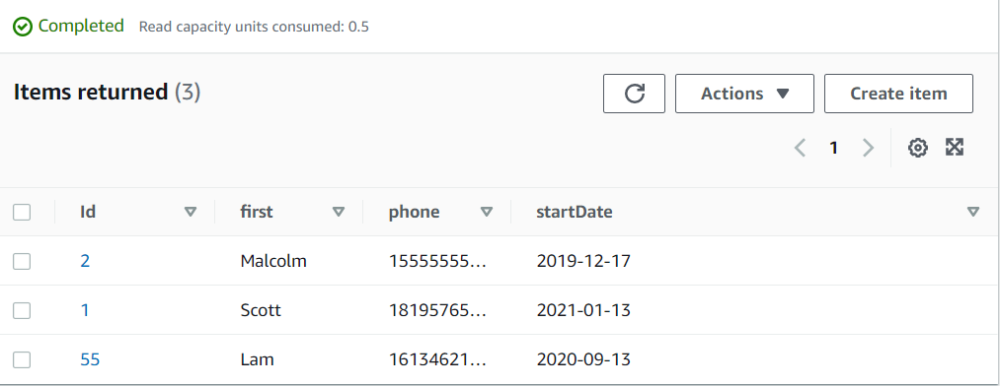

**Note**: To learn how to invoke an AWS Lambda function using scheduled events, see [Creating scheduled events to invoke Lambda functions](https://github.com/awsdocs/aws-doc-sdk-examples/tree/master/javav2/usecases/creating_scheduled_events).

#### Topics
+	Prerequisites
+	Create an AWS Identity and Access Management (IAM) role that is used to execute Lambda functions
+	Create an IntelliJ project named **LambdaCronFunctions**
+	Add the POM dependencies to your project
+	Create an AWS Lambda function by using the AWS Lambda runtime API
+	Package the project that contains the AWS Lambda function
+	Deploy the AWS Lambda function
+	Configure Amazon API Gateway to invoke the Lambda function

## Prerequisites
To follow along with this tutorial, you need the following:
+ An AWS Account with proper credentials.
+ A Java IDE (for this tutorial, the IntelliJ IDE is used).
+ Java 1.8 JDK.
+ Maven 3.6 or higher.

### Important

+ The AWS services included in this document are included in the [AWS Free Tier](https://aws.amazon.com/free/?all-free-tier.sort-by=item.additionalFields.SortRank&all-free-tier.sort-order=asc).
+  This code has not been tested in all AWS Regions. Some AWS services are available only in specific regions. For more information, see [AWS Regional Services](https://aws.amazon.com/about-aws/global-infrastructure/regional-product-services). 
+ Running this code might result in charges to your AWS account. 
+ Be sure to terminate all of the resources you create while going through this tutorial to ensure that you’re not charged.

### Creating the resources

An Amazon DynamoDB table named **Employee** with a key named **Id** and the fields shown in the previous illustration. Make sure you enter the correct data, including a valid mobile phone that you want to test this use case with. To learn how to create a DynamoDB table, see [Create a Table](https://docs.aws.amazon.com/amazondynamodb/latest/developerguide/getting-started-step-1.html).

## Create an IAM role that's used to execute Lambda functions

Create the following IAM role:

+ **lambda-support** - Used to invoke Lamdba functions.

This tutorial uses the DynamoDB and Amazon SNS services. The **lambda-support** role has to have policies that enable it to invoke these services from a Lambda function.  

#### To create an IAM role

1. Open the AWS Management Console. When the page loads, enter **IAM** in the search box, and then choose **IAM** to open the IAM console.

2. In the navigation pane, choose **Roles**, and on the **Roles** page, choose **Create Role**.

3. Choose **AWS service**, and then choose **Lambda**.


4. Choose **Permissions**.

5. Search for **AWSLambdaBasicExecutionRole**.

6. Choose **Next Tags**.

7. Choose **Review**.

8. Name the role **lambda-support**.


9. Choose **Create role**.

10. Choose **lambda-support** to view the overview page.

11. Choose **Attach Policies**.

12. Search for **AmazonDynamoDBFullAccess**, and then choose **Attach policy**.

13. Search for **AmazonSNSFullAccess**, and then choose **Attach policy**. When you're done, you can see the permissions.


## Create an IntelliJ project named LambdaCronFunctions

1. In the IntelliJ IDE, choose **File**, **New**, **Project**.

2. In the **New Project** dialog box, choose **Maven**, and then choose **Next**.

3. For **GroupId**, enter **LambdaCronFunctions**.

4. For **ArtifactId**, enter **LambdaCronFunctions**.

5. Choose **Next**.

6. Choose **Finish**.

## Add the POM dependencies to your project

At this point, you have a new project named **LambdaCronFunctions**.

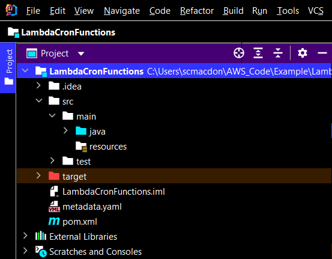

The pom.xml file looks like the following.

```xml
   <?xml version="1.0" encoding="UTF-8"?>
   <project xmlns="http://maven.apache.org/POM/4.0.0"
         xmlns:xsi="http://www.w3.org/2001/XMLSchema-instance"
         xsi:schemaLocation="http://maven.apache.org/POM/4.0.0 http://maven.apache.org/xsd/maven-4.0.0.xsd">
   <modelVersion>4.0.0</modelVersion>
   <groupId>LambdaCronFunctions</groupId>
   <artifactId>LambdaCronFunctions</artifactId>
   <version>1.0-SNAPSHOT</version>
   <packaging>jar</packaging>
   <name>java-basic-function</name>
   <properties>
     <project.build.sourceEncoding>UTF-8</project.build.sourceEncoding>
     <maven.compiler.source>1.8</maven.compiler.source>
     <maven.compiler.target>1.8</maven.compiler.target>
   </properties>
   <dependencies>
    <dependency>
        <groupId>com.amazonaws</groupId>
        <artifactId>aws-lambda-java-core</artifactId>
        <version>1.2.1</version>
    </dependency>
    <dependency>
        <groupId>com.google.code.gson</groupId>
        <artifactId>gson</artifactId>
        <version>2.8.9</version>
    </dependency>
    <dependency>
        <groupId>org.apache.logging.log4j</groupId>
        <artifactId>log4j-api</artifactId>
        <version>2.17.0</version>
    </dependency>
    <dependency>
        <groupId>org.apache.logging.log4j</groupId>
        <artifactId>log4j-core</artifactId>
        <version>2.17.0</version>
        <scope>test</scope>
    </dependency>
    <dependency>
        <groupId>org.apache.logging.log4j</groupId>
        <artifactId>log4j-slf4j18-impl</artifactId>
        <version>2.17.0</version>
        <scope>test</scope>
    </dependency>
    <dependency>
        <groupId>org.junit.jupiter</groupId>
        <artifactId>junit-jupiter-api</artifactId>
        <version>5.8.2</version>
        <scope>test</scope>
    </dependency>
    <dependency>
        <groupId>org.junit.jupiter</groupId>
        <artifactId>junit-jupiter-engine</artifactId>
        <version>5.8.2</version>
        <scope>test</scope>
    </dependency>
    <dependency>
        <groupId>com.googlecode.json-simple</groupId>
        <artifactId>json-simple</artifactId>
        <version>1.1.1</version>
    </dependency>
    <dependency>
        <groupId>software.amazon.awssdk</groupId>
        <artifactId>dynamodb-enhanced</artifactId>
        <version>2.17.110</version>
    </dependency>
    <dependency>
        <groupId>software.amazon.awssdk</groupId>
        <artifactId>dynamodb</artifactId>
        <version>2.17.110</version>
    </dependency>
    <dependency>
        <groupId>software.amazon.awssdk</groupId>
        <artifactId>sns</artifactId>
        <version>2.17.110</version>
    </dependency>
    <dependency>
        <groupId>org.apache.maven.plugins</groupId>
        <artifactId>maven-surefire-plugin</artifactId>
        <version>3.0.0-M5</version>
        <type>maven-plugin</type>
    </dependency>
  </dependencies>
  <build>
    <plugins>
         <plugin>
            <groupId>org.apache.maven.plugins</groupId>
            <artifactId>maven-shade-plugin</artifactId>
            <version>3.2.2</version>
            <configuration>
                <createDependencyReducedPom>false</createDependencyReducedPom>
            </configuration>
            <executions>
                <execution>
                    <phase>package</phase>
                    <goals>
                        <goal>shade</goal>
                    </goals>
                </execution>
            </executions>
        </plugin>
        <plugin>
            <groupId>org.apache.maven.plugins</groupId>
            <artifactId>maven-compiler-plugin</artifactId>
            <version>3.8.1</version>
            <configuration>
                <source>1.8</source>
                <target>1.8</target>
            </configuration>
        </plugin>
    </plugins>
    </build>
   </project>
```    

## Create a Lambda function by using the AWS Lambda runtime Java API

Use the AWS Lambda runtime Java API to create the Java class that defines the Lamdba function. In this example, there is one Java class for the Lambda function and two extra classes required for this use case. The following figure shows the Java classes in the project. Notice that all Java classes are located in a package named **com.aws.example**. 

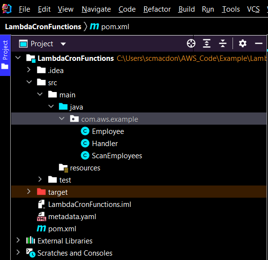

Create these Java classes:

+ **Handler** - used as the Lambda function that performs the use case described in this AWS tutorial. The application logic that's executed is located in the **handleRequest** method. 
+ **ScanEmployees** - uses the Amazon DynamoDB Java V2 API to scan the **Employee** table using an **Expression** object. This class also uses the Amazon Simple Notification Service (Amazon SNS) Java V2 API to send a message to an employee.
+ **Employee** - a Java class that is used with the DynamoDB Enhanced client. The fields in this class match the columns in the **Employee** table. 

### Handler class

This Java code represents the **Handler** class. The class creates a **ScanEmployees** object and invokes the **sendEmployeMessage** method. Notice that you can log messages to Amazon CloudWatch logs by using a **LambdaLogger** object.

```java
    package com.aws.example;

    import com.amazonaws.services.lambda.runtime.Context;
    import com.amazonaws.services.lambda.runtime.LambdaLogger;

    /**
    *  This is the entry point for the Lambda function
    */

    public class Handler {

     public Void handleRequest(Context context) {
        LambdaLogger logger = context.getLogger();
        ScanEmployees scanEmployees = new ScanEmployees();
       Boolean ans =  scanEmployees.sendEmployeMessage();
        if (ans)
            logger.log("Messages sent: " + ans);
        return null;
    }
}
```

### ScanEmployees class
The **ScanEmployees** class uses both Amazon DynamoDB Java V2 API and the Amazon SNS Java V2 API. In the following code example, notice the use of an **Expression** object. This object is used to return employees that have a start date one year ago. For each employee returned, a text message is sent using the **SnsClient** object's **publish** method.  

```java
     package com.aws.example;

     import software.amazon.awssdk.enhanced.dynamodb.DynamoDbEnhancedClient;
     import software.amazon.awssdk.enhanced.dynamodb.DynamoDbTable;
     import software.amazon.awssdk.enhanced.dynamodb.Expression;
     import software.amazon.awssdk.enhanced.dynamodb.TableSchema;
     import software.amazon.awssdk.enhanced.dynamodb.model.ScanEnhancedRequest;
     import software.amazon.awssdk.regions.Region;
     import software.amazon.awssdk.services.dynamodb.DynamoDbClient;
     import software.amazon.awssdk.services.dynamodb.model.AttributeValue;
     import software.amazon.awssdk.services.sns.SnsClient;
     import software.amazon.awssdk.services.sns.model.PublishRequest;
     import software.amazon.awssdk.services.sns.model.SnsException;
     import java.text.DateFormat;
     import java.text.SimpleDateFormat;
     import java.time.LocalDateTime;
     import java.time.ZoneId;
     import java.time.format.DateTimeFormatter;
     import java.util.*;

    /*
     Sends a text message to any employee that reached the one year anniversary mark
    */

    public class ScanEmployees {

       public Boolean sendEmployeMessage() {

         Boolean send = false;
         String myDate = getDate();

        Region region = Region.US_WEST_2;
        DynamoDbClient ddb = DynamoDbClient.builder()
                .region(region)
                .build();

        // Create a DynamoDbEnhancedClient and use the DynamoDbClient object
        DynamoDbEnhancedClient enhancedClient = DynamoDbEnhancedClient.builder()
                .dynamoDbClient(ddb)
                .build();

        // Create a DynamoDbTable object based on Employee
        DynamoDbTable<Employee> table = enhancedClient.table("Employee", TableSchema.fromBean(Employee.class));

        try {
            AttributeValue attVal = AttributeValue.builder()
                .s(myDate)
                .build();

            // Get only items in the Employee table that match the date
            Map<String, AttributeValue> myMap = new HashMap<>();
            myMap.put(":val1", attVal);

            Map<String, String> myExMap = new HashMap<>();
            myExMap.put("#startDate", "startDate");

            Expression expression = Expression.builder()
                .expressionValues(myMap)
                .expressionNames(myExMap)
                .expression("#startDate = :val1")
                .build();

            ScanEnhancedRequest enhancedRequest = ScanEnhancedRequest.builder()
                .filterExpression(expression)
                .limit(15) // you can increase this value
                .build();

            // Get items in the Employee table
            Iterator<Employee> employees = table.scan(enhancedRequest).items().iterator();

            while (employees.hasNext()) {
                Employee employee = employees.next();
                String first = employee.getFirst();
                String phone = employee.getPhone();

                // Send an anniversary message!
                sentTextMessage(first, phone);
                send = true;
            }
        } catch (DynamoDbException e) {
            System.err.println(e.getMessage());
            System.exit(1);
        }
        return send;
      }


    // Use the Amazon SNS Service to send a text message
    private void sentTextMessage(String first, String phone) {

        SnsClient snsClient = SnsClient.builder()
                .region(Region.US_WEST_2)
                .build();
        String message = first +" happy one year anniversary. We are very happy that you have been working here for a year! ";

        try {
            PublishRequest request = PublishRequest.builder()
                    .message(message)
                    .phoneNumber(phone)
                    .build();

            snsClient.publish(request);
        } catch (SnsException e) {
            System.err.println(e.awsErrorDetails().errorMessage());
            System.exit(1);
        }
    }

    public String getDate() {

        String DATE_FORMAT = "yyyy-MM-dd";
        DateFormat dateFormat = new SimpleDateFormat(DATE_FORMAT);
        DateTimeFormatter dateFormat8 = DateTimeFormatter.ofPattern(DATE_FORMAT);

        Date currentDate = new Date();
        System.out.println("date : " + dateFormat.format(currentDate));
        LocalDateTime localDateTime = currentDate.toInstant().atZone(ZoneId.systemDefault()).toLocalDateTime();
        System.out.println("localDateTime : " + dateFormat8.format(localDateTime));

        localDateTime = localDateTime.minusYears(1);
        String ann = dateFormat8.format(localDateTime);
        return ann;
     }
    }
```

### Employee class

The **Employee** class is used with the DynamoDB enhanced client and maps the **Employee** data members to items in the **Employee** table. Notice that this class uses the **@DynamoDbBean** annotation.

```java
     package com.aws.example;

     import software.amazon.awssdk.enhanced.dynamodb.mapper.annotations.DynamoDbBean;
     import software.amazon.awssdk.enhanced.dynamodb.mapper.annotations.DynamoDbPartitionKey;
     import software.amazon.awssdk.enhanced.dynamodb.mapper.annotations.DynamoDbSortKey;

    @DynamoDbBean
    public class Employee {

     private String Id;
     private String first;
     private String phone;
     private String startDate;

     public void setId(String id) {
        this.Id = id;
     }

     @DynamoDbPartitionKey
     public String getId() {
        return this.Id;
     }

     public void setStartDate(String startDate) {
        this.startDate = startDate;
     }

     @DynamoDbSortKey
     public String getStartDate() {
        return this.startDate;
     }

     public void setPhone(String phone) {
        this.phone = phone;
     }
    
    public String getPhone() {
        return this.phone;
     }
   
     public void setFirst(String first) {
        this.first = first;
     }
    
     public String getFirst() {
        return this.first;
     }
    }
```

## Package the project that contains the Lambda functions

Package up the project into a .jar (JAR) file that you can deploy as a Lambda function by using the following Maven command.

    mvn package

The JAR file is located in the **target** folder (which is a child folder of the project folder).

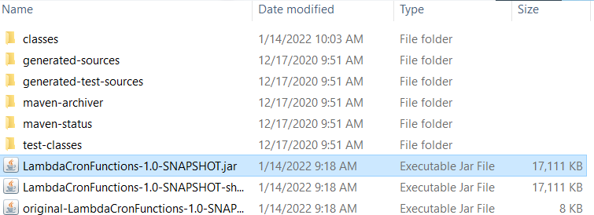

**Note**: Notice the use of the **maven-shade-plugin** in the project’s POM file. This plugin is responsible for creating a JAR that contains the required dependencies. If you attempt to package up the project without this plugin, the required dependences are not included in the JAR file and you will encounter a **ClassNotFoundException**. 

## Deploy the Lambda function

1. Open the Lambda console at https://us-east-1.console.aws.amazon.com/lambda/home.

2. Choose **Create Function**.

3. Choose **Author from scratch**.

4. In the **Basic** information section, enter **cron** as the name.

5. In the **Runtime**, choose **Java 8**.

6. Choose **Use an existing role**, and then choose **lambda-support** (the IAM role that you created).


7. Choose **Create function**.

8. For **Code entry type**, choose **Upload a .zip or .jar file**.

9. Choose **Upload**, and then browse to the JAR file that you created.  

10. For **Handler**, enter the fully qualified name of the function, for example, **com.aws.example.Handler::handleRequest** (**com.aws.example.Handler** specifies the package and class followed by :: and method name).

11. Choose **Save.**


## Configure Amazon API Gateway to invoke the Lambda function

You can use the Amazon Gateway API console to create a Rest endpoint for the Lambda function. Once done, you are able to invoke the Lambda function using a Restful call.

1. Sign in to the Amazon API Gateway console at https://console.aws.amazon.com/apigateway.

2. Under Rest API, choose **Build**.

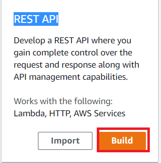

3. Select **New API**.

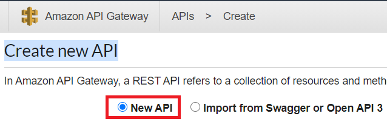

4. Specify **Employee** as the API name and provide a description.

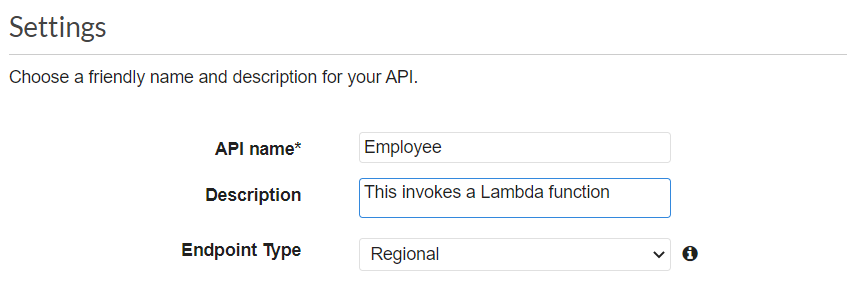

5. Choose **Create API**. 

6. Choose **Resources** under the **Employee** section. 

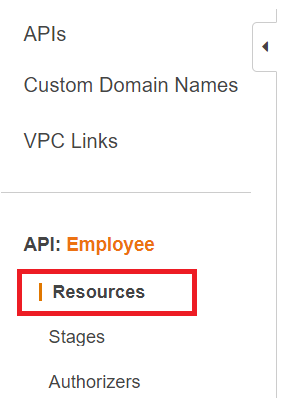

7. From the **Actions** dropdown, choose **Create Resources**. 

8. In the name field, specify **employees**. 

9. Choose **Create Resources**. 

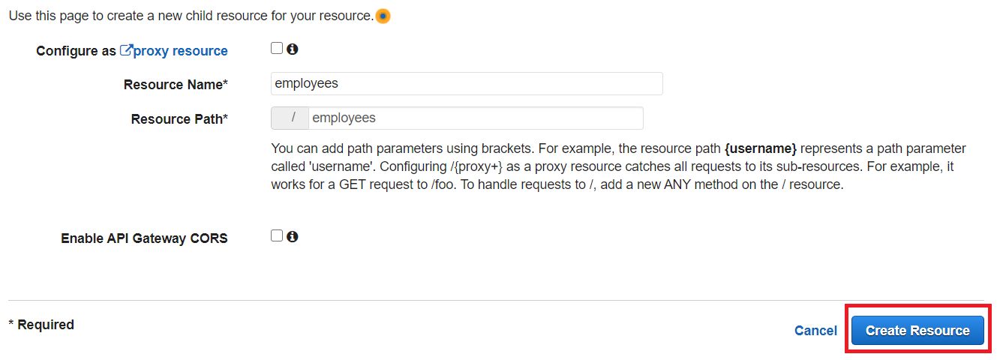

10. Choose **/employees** and then select GET from the drop down. Choose the checkmark icon. 

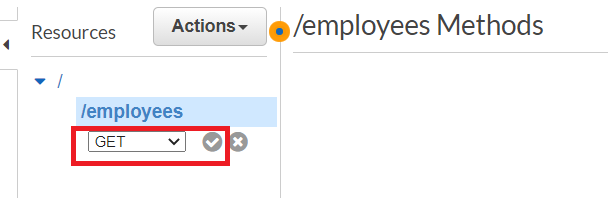

11. Choose **Lambda function** and enter **cron** as the Lambda function name. Choose **Save**.

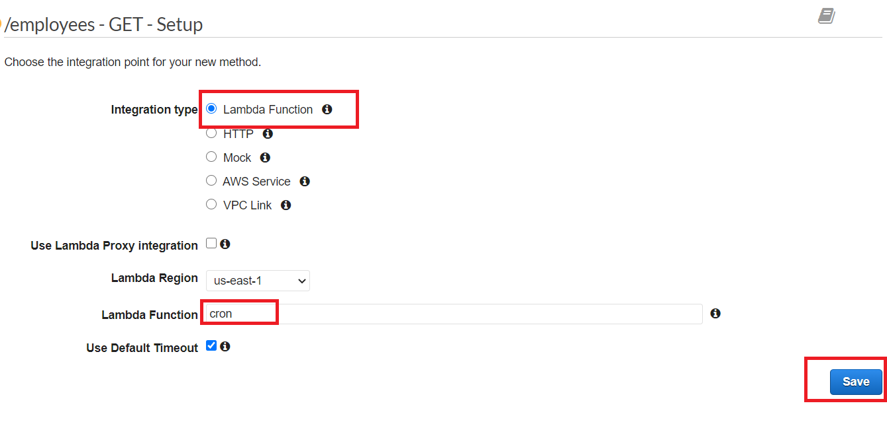

12. Choose **OK**.

### Test the Amazon API Gateway method

At this point in the tutorial, you can test the Amazon API Gateway method that invokes the **cron** Lambda function. To test the method, choose **Test**, as shown in the following illustration. 

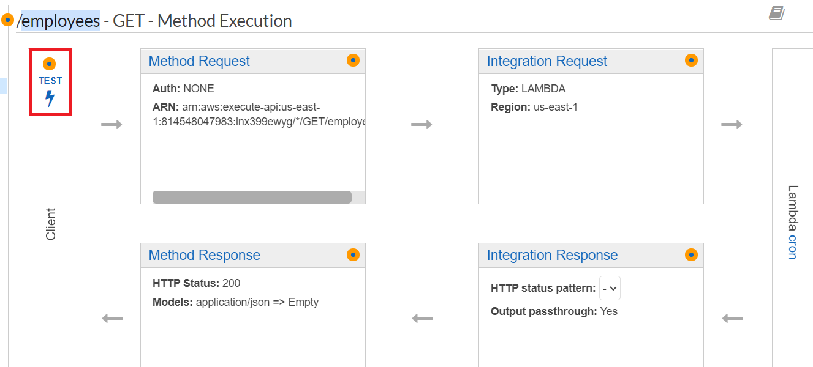

Once the Lambda function is invoked, you can view the log file to see a successful message. 

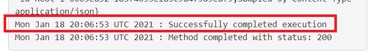

### Deploying the API

After the test is successful, you can deploy the method from the AWS Management Console. 

1. Choose **Get**.

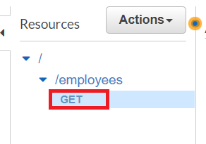

2. From the **Actions** dropdown, select **Deploy API**.

3. Fill in the Deploy API form and choose **Deploy**.

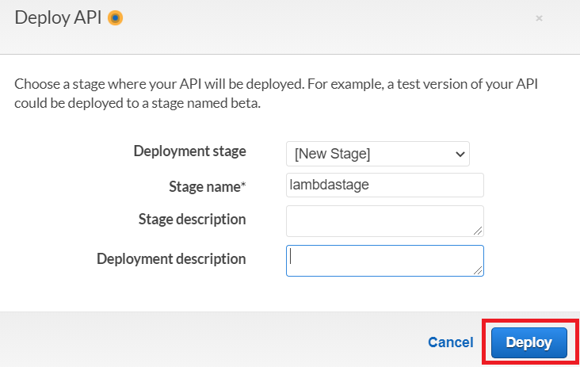

4. Notice that a URL s displayed.

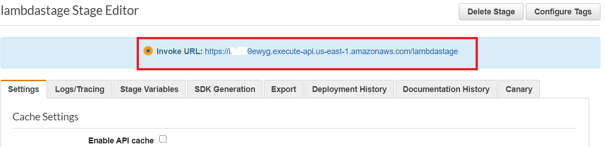

5.	Choose **Save Changes**.

6. Choose **Get** again and notice that the URL changes. This is the invocation URL that you can use to invoke the Lambda function.

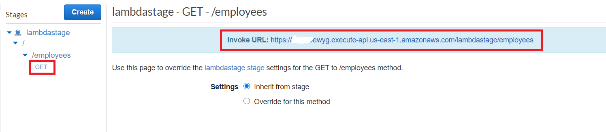

### Next steps
Congratulations, you have created an AWS Lambda function that is invoked by using an Amazon Gateway API method. As stated at the beginning of this tutorial, be sure to terminate all of the resources you created while going through this tutorial to ensure that you’re not charged.

For more AWS multiservice examples, see
[usecases](https://github.com/awsdocs/aws-doc-sdk-examples/tree/master/javav2/usecases).


