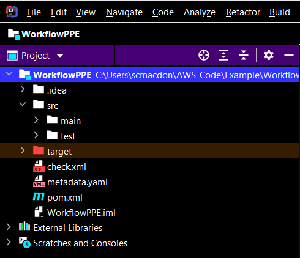
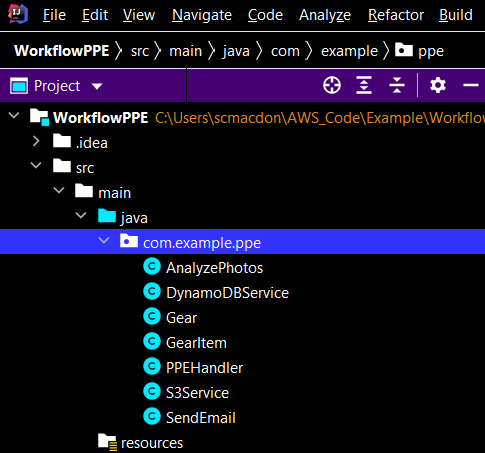
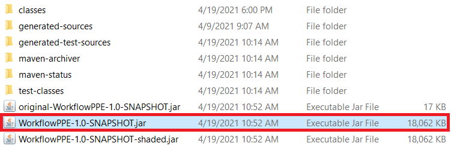

#  Creating an AWS Lambda function that detects images with Personal Protective Equipment

## Purpose

You can create an AWS Lambda function that detects personal protective equipment (PPE) in images located in an Amazon Simple Storage Service (Amazon S3) bucket. For example, assume you run the Lambda function and you have this image in an Amazon S3 bucket. 


After you execute the Lambda function, it detects PPE information in the image using the Amazon Rekognition service and creates a record in an Amazon DynamoDB table, as shown in this illustration.


In addition, the Lambda function creates a list of all images with PPE and emails the list by using the Amazon Simple Email (Amazon SES) service, as shown in this illustration. 


As an Amazon Web Services API developer, you can create a Lambda function by using the AWS Lambda Java runtime API. Lambda is a compute service that enables you to run code without provisioning or managing servers. You can create Lambda functions in various programming languages. For more information about AWS Lambda, see
[What is AWS Lambda](https://docs.aws.amazon.com/lambda/latest/dg/welcome.html).

This tutorial shows you how to use the AWS SDK for Java V2 API to invoke these AWS services: 

- Amazon S3 service
- Amazon Rekognition service
- DynamoDB service
- Amazon Simple Email service

#### Topics
+	Prerequisites.
+	Create an AWS Identity and Access Management (IAM) role that is used to execute Lambda functions.
+	Create an IntelliJ project.
+	Add the POM dependencies to your project.
+	Create a Lambda function by using the Lambda runtime API.
+	Package the project that contains the Lambda function.
+	Deploy the Lambda function.

## Prerequisites
To follow along with this tutorial, you need the following:

+ An AWS Account with proper credentials.
+ A Java IDE (for this tutorial, the IntelliJ IDE is used).
+ Java 1.8 JDK.
+ Maven 3.6 or higher.

### Important

+ The AWS services included in this document are included in the [AWS Free Tier](https://aws.amazon.com/free/?all-free-tier.sort-by=item.additionalFields.SortRank&all-free-tier.sort-order=asc).
+  This code has not been tested in all AWS Regions. Some AWS services are available only in specific regions. For more information, see [AWS Regional Services](https://aws.amazon.com/about-aws/global-infrastructure/regional-product-services). 
+ Running this code might result in charges to your AWS account. 
+ Be sure to terminate all of the resources you create while going through this tutorial to ensure that you’re not charged.

### Creating the resources

Create an Amazon S3 bucket with 5-7 PPE images. These images are read by the Lambda function. 

Create an Amazon DynamoDB table named **Gear** with a key named **id**. For information, see [Create a table](https://docs.aws.amazon.com/amazondynamodb/latest/developerguide/SampleData.CreateTables.html).


## Create an AWS Identity and Access Management (IAM) role that's used to execute Lambda functions

Create the following IAM role:

+ **lambda-support** - Used to invoke Lamdba functions.

This tutorial uses the Amazon Rekognition, DynamoDB, Amazon SES, and Amazon S3 services. The **lambda-support** role has to have policies that enable it to invoke these services.  

#### To create an IAM role

1. Open the AWS Management Console. When the page loads, enter **IAM** in the search box, and then choose **IAM** to open the IAM console.

2. In the navigation pane, choose **Roles**, and on the **Roles** page, choose **Create Role**.

3. Choose **AWS service**, and then choose **Lambda**.

4. Choose **Permissions**.

5. Search for **AWSLambdaBasicExecutionRole**.

6. Choose **Next Tags**.

7. Choose **Review**.

8. Name the role **lambda-support**.

9. Choose **Create role**.

10. Choose **lambda-support** to view the overview page.

11. Choose **Attach Policies**.

12. Search for **AmazonRekognitionFullAccess**, and then choose **Attach policy**.

13. Search for **AmazonS3FullAccess**, and then choose **Attach policy**. 

14. Search for **AmazonDynamoDBFullAccess**, and then choose **Attach policy**. 

15. Search for **AmazonSESFullAccess**, and then choose **Attach policy**. When you're done, you can see the permissions.


## Create an IntelliJ project

1. In the IntelliJ IDE, choose **File**, **New**, **Project**.

2. In the **New Project** dialog box, choose **Maven**, and then choose **Next**.

3. For **GroupId**, enter **WorkflowPPE**.

4. For **ArtifactId**, enter **WorkflowPPE**.

5. Choose **Next**.

6. Choose **Finish**.

## Add the POM dependencies to your project

At this point, you have a new project named **WorkflowPPE**.



Make sure that your project's pom.xml file looks like the following.

```xml
     <?xml version="1.0" encoding="UTF-8"?>
     <project xmlns="http://maven.apache.org/POM/4.0.0"
         xmlns:xsi="http://www.w3.org/2001/XMLSchema-instance"
         xsi:schemaLocation="http://maven.apache.org/POM/4.0.0 http://maven.apache.org/xsd/maven-4.0.0.xsd">
      <modelVersion>4.0.0</modelVersion>
      <groupId>org.example</groupId>
      <artifactId>WorkflowPPE</artifactId>
      <version>1.0-SNAPSHOT</version>
      <properties>
        <project.build.sourceEncoding>UTF-8</project.build.sourceEncoding>
        <maven.compiler.source>1.8</maven.compiler.source>
        <maven.compiler.target>1.8</maven.compiler.target>
      </properties>
      <dependencyManagement>
        <dependencies>
            <dependency>
                <groupId>software.amazon.awssdk</groupId>
                <artifactId>bom</artifactId>
                <version>2.15.14</version>
                <type>pom</type>
                <scope>import</scope>
            </dependency>
        </dependencies>
       </dependencyManagement>
       <dependencies>
        <dependency>
            <groupId>com.amazonaws</groupId>
            <artifactId>aws-lambda-java-core</artifactId>
            <version>1.2.1</version>
        </dependency>
        <dependency>
            <groupId>com.google.code.gson</groupId>
            <artifactId>gson</artifactId>
            <version>2.8.6</version>
        </dependency>
        <dependency>
            <groupId>org.apache.logging.log4j</groupId>
            <artifactId>log4j-api</artifactId>
            <version>2.10.0</version>
        </dependency>
        <dependency>
            <groupId>org.apache.logging.log4j</groupId>
            <artifactId>log4j-core</artifactId>
            <version>2.13.0</version>
            <scope>test</scope>
        </dependency>
        <dependency>
            <groupId>org.apache.logging.log4j</groupId>
            <artifactId>log4j-slf4j18-impl</artifactId>
            <version>2.13.3</version>
            <scope>test</scope>
        </dependency>
        <dependency>
            <groupId>org.junit.jupiter</groupId>
            <artifactId>junit-jupiter-api</artifactId>
            <version>5.6.0</version>
            <scope>test</scope>
        </dependency>
        <dependency>
            <groupId>org.junit.jupiter</groupId>
            <artifactId>junit-jupiter-engine</artifactId>
            <version>5.6.0</version>
            <scope>test</scope>
        </dependency>
        <dependency>
            <groupId>com.googlecode.json-simple</groupId>
            <artifactId>json-simple</artifactId>
            <version>1.1.1</version>
        </dependency>
        <dependency>
            <groupId>software.amazon.awssdk</groupId>
            <artifactId>s3</artifactId>
        </dependency>
        <dependency>
            <groupId>software.amazon.awssdk</groupId>
            <artifactId>s3</artifactId>
        </dependency>
        <dependency>
            <groupId>software.amazon.awssdk</groupId>
            <artifactId>dynamodb</artifactId>
            <version>2.5.10</version>
        </dependency>
        <dependency>
            <groupId>software.amazon.awssdk</groupId>
            <artifactId>dynamodb-enhanced</artifactId>
            <version>2.11.4-PREVIEW</version>
        </dependency>
        <dependency>
            <groupId>software.amazon.awssdk</groupId>
            <artifactId>rekognition</artifactId>
        </dependency>
        <dependency>
            <groupId>javax.mail</groupId>
            <artifactId>javax.mail-api</artifactId>
            <version>1.5.5</version>
        </dependency>
        <dependency>
            <groupId>com.sun.mail</groupId>
            <artifactId>javax.mail</artifactId>
            <version>1.5.5</version>
        </dependency>
        <dependency>
            <groupId>software.amazon.awssdk</groupId>
            <artifactId>ses</artifactId>
        </dependency>
      </dependencies>
      <build>
        <plugins>
            <plugin>
                <artifactId>maven-surefire-plugin</artifactId>
                <version>2.22.2</version>
            </plugin>
            <plugin>
                <groupId>org.apache.maven.plugins</groupId>
                <artifactId>maven-shade-plugin</artifactId>
                <version>3.2.2</version>
                <configuration>
                    <createDependencyReducedPom>false</createDependencyReducedPom>
                </configuration>
                <executions>
                    <execution>
                        <phase>package</phase>
                        <goals>
                            <goal>shade</goal>
                        </goals>
                    </execution>
                </executions>
            </plugin>
            <plugin>
                <groupId>org.apache.maven.plugins</groupId>
                <artifactId>maven-compiler-plugin</artifactId>
                <version>3.8.1</version>
                <configuration>
                    <source>1.8</source>
                    <target>1.8</target>
                </configuration>
            </plugin>
        </plugins>
      </build>
     </project>
```
    
## Create a Lambda function by using the AWS Lambda runtime Java API

Use the AWS Lambda runtime Java API to create the Java class that defines the Lamdba function. In this example, there is one Java class for the Lambda function named **PPEHandler** and additional classes required for this use case. The following figure shows the Java classes in the project. Notice that all Java classes are located in a package named **com.example.ppe**. 



Create these Java classes:

+ **AnalyzePhotos** - uses the Amazon Rekognition API to analyze the images and detect PPE images.
+ **DynamoDBService** - uses the Amazon DynamoDB API to insert PPE records in the DynamoDB table. 
+ **Gear** - defines a model that is used with the DynamoDB enhanced client. 
+ **GearItem** - defines a model that stores PPE information.
+ **PPEHandler** - uses the Lambda Java run-time API and performs the use case described in this AWS tutorial. The executable application logic is in the **handleRequest** method. 
+ **S3Service** - uses the Amazon S3 API to perform S3 operations.
+ **SendEmail** - uses the SES API to send email messages. 


### AnalyzePhotos class

The following Java code represents the **AnalyzePhotos** class. This class uses the Amazon Rekognition API to analyze the images and detect PPE information.

```java
    package com.example.ppe;

    import software.amazon.awssdk.core.SdkBytes;
    import software.amazon.awssdk.regions.Region;
    import software.amazon.awssdk.services.rekognition.RekognitionClient;
    import software.amazon.awssdk.services.rekognition.model.Image;
    import software.amazon.awssdk.services.rekognition.model.*;
    import software.amazon.awssdk.services.rekognition.model.RekognitionException;
    import java.util.ArrayList;
    import java.util.List;

    public class AnalyzePhotos {

    // Returns a list of GearItem objects that contains PPE information.
    public ArrayList<GearItem> detectLabels(byte[] bytes, String key) {

        Region region = Region.US_EAST_2;
        RekognitionClient rekClient = RekognitionClient.builder()
                .region(region)
                .build();

        ArrayList<GearItem> gearList = new ArrayList<>();

        try {

            SdkBytes sourceBytes = SdkBytes.fromByteArray(bytes);

            // Create an Image object for the source image.
            Image souImage = Image.builder()
                    .bytes(sourceBytes)
                    .build();

            ProtectiveEquipmentSummarizationAttributes summarizationAttributes = ProtectiveEquipmentSummarizationAttributes.builder()
                    .minConfidence(80F)
                    .requiredEquipmentTypesWithStrings("FACE_COVER", "HAND_COVER", "HEAD_COVER")
                    .build();

            DetectProtectiveEquipmentRequest request = DetectProtectiveEquipmentRequest.builder()
                    .image(souImage)
                    .summarizationAttributes(summarizationAttributes)
                    .build();

            DetectProtectiveEquipmentResponse result = rekClient.detectProtectiveEquipment(request);
            List<ProtectiveEquipmentPerson> persons = result.persons();

            // Create a GearItem object
            GearItem gear;

            for (ProtectiveEquipmentPerson person : persons) {

                System.out.println("ID: " + person.id());
                List<ProtectiveEquipmentBodyPart> bodyParts = person.bodyParts();
                if (bodyParts.isEmpty()) {
                    System.out.println("\tNo body parts detected");
                } else
                    for (ProtectiveEquipmentBodyPart bodyPart : bodyParts) {

                        List<EquipmentDetection> equipmentDetections = bodyPart.equipmentDetections();

                        if (equipmentDetections.isEmpty()) {
                            System.out.println("\t\tNo PPE Detected on " + bodyPart.name());
                        } else {
                            for (EquipmentDetection item : equipmentDetections) {

                                // Set the objcet here
                                gear = new GearItem();
                                gear.setKey(key);

                                String itemType = item.type().toString();
                                String confidence = item.confidence().toString();
                                String myDesc = "Item: " + item.type() + ". Confidence: " + item.confidence().toString();
                                String bodyPartDes = "Covers body part: "
                                        + item.coversBodyPart().value().toString() + ". Confidence: " + item.coversBodyPart().confidence().toString();

                                gear.setName(itemType);
                                gear.setConfidence(confidence);
                                gear.setItemDescription(myDesc);
                                gear.setBodyCoverDescription(bodyPartDes);

                                //push the object
                                gearList.add(gear);
                            }
                        }
                    }
            }

            if (gearList.isEmpty())
                    return null ;
            else
                return gearList;

        } catch (RekognitionException e) {
            System.out.println(e.getMessage());
            System.exit(1);
        }
        return null;
       }
      }
```

### DynamoDBService class

The **DynamoDBService** class uses the AWS SDK for Java V2 DynamoDB API to add a record to the **Gear** table by using the enhanced client. For more information about the enhanced client, see [Map items in DynamoDB tables](https://docs.aws.amazon.com/sdk-for-java/latest/developer-guide/examples-dynamodb-enhanced.html).

```java
     package com.example.ppe;

     import software.amazon.awssdk.enhanced.dynamodb.*;
     import software.amazon.awssdk.regions.Region;
     import software.amazon.awssdk.services.dynamodb.DynamoDbClient;
     import software.amazon.awssdk.services.dynamodb.model.*;
     import java.time.Instant;
     import java.time.LocalDateTime;
     import java.time.ZoneOffset;
     import java.util.ArrayList;
     import java.util.List;
     import java.util.UUID;

    public class DynamoDBService {

    private DynamoDbClient getClient() {

        // Create a DynamoDbClient object.
        Region region = Region.US_EAST_1;
        DynamoDbClient ddb = DynamoDbClient.builder()
                .region(region)
                .build();

        return ddb;
    }


    // Persist the PPE items into the Gear table.
    public void persistItem(List<ArrayList<GearItem>> gearList) {
        DynamoDbClient ddb = getClient();

        try {

            DynamoDbEnhancedClient enhancedClient = DynamoDbEnhancedClient.builder()
                    .dynamoDbClient(ddb)
                    .build();

            DynamoDbTable<Gear> gearTable = enhancedClient.table("Gear", TableSchema.fromBean(Gear.class));
            Gear gearRecord;

            // Create an Instant object.
            LocalDateTime now = LocalDateTime.now(); // current date and time
            LocalDateTime timeVal = now.toLocalDate().atStartOfDay();
            Instant instant = timeVal.toInstant(ZoneOffset.UTC);

            // Persist the data into a DynamoDB table.
            for (Object o : gearList) {

                //Need to get the WorkItem from each list.
                List innerList = (List) o;

                for (Object value : innerList) {

                    gearRecord = new Gear();
                    UUID uuid = UUID.randomUUID();
                    GearItem gearItem = (GearItem) value;

                    gearRecord.setId(uuid.toString());
                    gearRecord.setKey(gearItem.getKey());
                    gearRecord.setDate(instant.toString());
                    gearRecord.setItem(gearItem.getName());
                    gearRecord.setCoverDescription(gearItem.getBodyCoverDescription());
                    gearRecord.setItemDescription(gearItem.getItemDescription());
                    gearRecord.setConfidence(gearItem.getConfidence());

                    // Put the PPE data into a DynamoDB table.
                    gearTable.putItem(gearRecord);
                }
            }

        } catch (DynamoDbException e) {
            System.err.println(e.getMessage());
            System.exit(1);
        }

        }
      }
  ```

### Gear class 

The **Gear** class is responsible for mapping an object to the Gear table using the enhanced client. Notice the use of the **@DynamoDbBean** annotation. 

```java
       package com.example.ppe;
       import software.amazon.awssdk.enhanced.dynamodb.mapper.annotations.DynamoDbBean;
       import software.amazon.awssdk.enhanced.dynamodb.mapper.annotations.DynamoDbPartitionKey;

       @DynamoDbBean
      public class Gear {

      private String id;
      private String date;
      private String item ;
      private String key;
      private String itemDescription;
      private String coverDescription ;
      private String confidence ;

      @DynamoDbPartitionKey
      public String getId() {
        return this.id;
     }

     public void setId(String id) {

        this.id = id;
     }

     public void setKey(String key) {

        this.key = key;
     }

    public String getKey() {
        return this.key;
    }

    public void setDate(String date) {

        this.date = date;
    }

    public String getDate() {
        return this.date;
    }

    public String getItem() {
        return this.item;
    }

    public void setItem(String item) {

        this.item = item;
    }

    public String getItemDescription() {
        return this.itemDescription;
    }

    public void setItemDescription(String itemDescription) {

        this.itemDescription = itemDescription;
    }

    public String getCoverDescription() {
        return this.coverDescription;
    }

    public void setCoverDescription(String coverDescription) {

        this.coverDescription = coverDescription;
    }

    public String getConfidence() {
        return this.confidence;
    }

    public void setConfidence(String confidence) {

        this.confidence = confidence;
      }
     }
 ```

### GearItem class

The **GearIten** class represents the model in this use case. Its stores data retrieved from the Amazon Rekognition service. 

 ```java
    package com.example.ppe;

     public class GearItem {

     private String key;
     private String name;
     private String itemDescription;
     private String bodyCoverDescription;
     private String confidence ;

     public void setItemDescription (String itemDescription) {

        this.itemDescription = itemDescription;
     }

     public String getItemDescription() {

        return this.itemDescription;
     }

     public void setBodyCoverDescription (String bodyCoverDescription) {
        this.bodyCoverDescription = bodyCoverDescription;
     }

     public String getBodyCoverDescription() {

        return this.bodyCoverDescription;
    }

    public void setKey (String key) {
        this.key = key;
    }

    public String getKey() {
        return this.key;
    }

    public void setName (String name) {
        this.name = name;
    }

    public String getName() {
        return this.name;
    }

    public void setConfidence (String confidence) {
        this.confidence = confidence;
    }

    public String getConfidence() {
        return this.confidence;
     }
    }
```

### PPEHandler class

This Java code represents the **PPEHandler** class. This class reads a value that specifies which Amazon S3 bucket to read the images from. The **s3Service.ListBucketObjects** method returns a **List** object where each element is a string value that represents the object key. For each image in the bucket, the **s3Service.getObjectBytes** method returns a byte array. Then an **ArrayList** is obtained by calling the **photos.detectLabels** method. Finally the **ArrayList** object is added to another collection and the data that specifies PPE gear is persisted in a DynamoDB table and emailed to a user. 

The following Java code represents the **PPEHandler** class. 

```java
    package com.example.ppe;

    import com.amazonaws.services.lambda.runtime.Context;
    import com.amazonaws.services.lambda.runtime.RequestHandler;
    import com.amazonaws.services.lambda.runtime.LambdaLogger;
    import java.util.List;
    import java.util.Map;
    import java.util.ArrayList;
    import java.util.Set;
    import java.util.HashSet;

    public class PPEHandler implements RequestHandler<Map<String,String>, String> {

    @Override
    public String handleRequest(Map<String, String> event, Context context) {
        LambdaLogger logger = context.getLogger();
        String bucketName = event.get("bucketName");
        logger.log("Bucket name is: " + bucketName);

        S3Service s3Service = new S3Service() ;
        DynamoDBService ddb = new DynamoDBService();
        AnalyzePhotos photos = new AnalyzePhotos();
        SendEmail email = new SendEmail();

        List<String> items = s3Service.listBucketObjects(bucketName);
        List<ArrayList<GearItem>> myList = new ArrayList<>();
        for (String item : items) {

            byte[] keyData = s3Service.getObjectBytes(bucketName, item);

            // Analyze the photo and return a list where each element is a GearItem.
            ArrayList<GearItem> gearItem = photos.detectLabels(keyData, item);

            // Only add a list with items
            if (gearItem != null)
                myList.add(gearItem);
        }

        ddb.persistItem(myList);

        // Create a new list with only unique keys to email.
        Set<String> unqiueKeys = createUniqueList(myList);
        email.sendMsg(unqiueKeys);
        logger.log("Updated the DynamoDB table with PPE data");
        return bucketName;
    }

    // Create a list of unique keys.
    private static Set<String> createUniqueList(List<ArrayList<GearItem>> gearList) {


        List<String> keys = new ArrayList<>();

        // Persist the data into a DynamoDB table.
        for (Object o : gearList) {

            //Need to get the WorkItem from each list.
            List innerList = (List) o;

            for (Object value : innerList) {
                GearItem gearItem = (GearItem) value;
                keys.add(gearItem.getKey());
            }
        }

        // Create list without duplicates.
        Set<String> uniqueKeys = new HashSet<String>(keys);
        return uniqueKeys;
      }
     }
```

### S3Service class

The following class uses the Amazon S3 API to perform S3 operations. For example, the **getObjectBytes** method returns a byte array that represents the image. Likewise, the **listBucketObjects** method returns a List object where each element is a string value that specifies the key name.

```java
    package com.example.ppe;

    import software.amazon.awssdk.core.ResponseBytes;
    import software.amazon.awssdk.regions.Region;
    import software.amazon.awssdk.services.s3.S3Client;
    import software.amazon.awssdk.services.s3.model.GetObjectRequest;
    import software.amazon.awssdk.services.s3.model.GetObjectResponse;
    import software.amazon.awssdk.services.s3.model.S3Exception;
    import software.amazon.awssdk.services.s3.model.ListObjectsResponse;
    import software.amazon.awssdk.services.s3.model.S3Object;
    import software.amazon.awssdk.services.s3.model.ListObjectsRequest;
    import java.util.ArrayList;
    import java.util.List;

    public class S3Service {

    private S3Client getClient() {

        Region region = Region.US_WEST_2;
        return S3Client.builder()
                .region(region)
                .build();
    }

    public byte[] getObjectBytes(String bucketName, String keyName) {

        S3Client s3 = getClient();

        try {

            GetObjectRequest objectRequest = GetObjectRequest
                    .builder()
                    .key(keyName)
                    .bucket(bucketName)
                    .build();

            // Return the byte[] from this object.
            ResponseBytes<GetObjectResponse> objectBytes = s3.getObjectAsBytes(objectRequest);
            return objectBytes.asByteArray();

        } catch (S3Exception e) {
            System.err.println(e.awsErrorDetails().errorMessage());
            System.exit(1);
        }
        return null;
    }

    // Returns the names of all images in the given bucket.
    public List<String> listBucketObjects(String bucketName) {

        S3Client s3 = getClient();
        String keyName;

        List<String> keys = new ArrayList<>();

        try {
            ListObjectsRequest listObjects = ListObjectsRequest
                    .builder()
                    .bucket(bucketName)
                    .build();

            ListObjectsResponse res = s3.listObjects(listObjects);
            List<S3Object> objects = res.contents();

            for (S3Object myValue: objects) {
                keyName = myValue.key();
                keys.add(keyName);
            }
            return keys;

        } catch (S3Exception e) {
            System.err.println(e.awsErrorDetails().errorMessage());
            System.exit(1);
        }
        return null;
        }
      }
 ```
 
 ### SendEmail class
The following class uses the Amazon SES Java API to send email messages that specify which images contain PPE. 

```java
    package com.example.ppe;

    import software.amazon.awssdk.regions.Region;
    import software.amazon.awssdk.services.ses.SesClient;
    import software.amazon.awssdk.services.ses.model.*;
    import software.amazon.awssdk.services.ses.model.Message;
    import software.amazon.awssdk.services.ses.model.Body;
    import java.util.Set;

    public class SendEmail {

    public void sendMsg(Set<String> unqiueKeys) {

        Region region = Region.US_EAST_1;
        SesClient client = SesClient.builder()
                .region(region)
                .build();

        String sender = "<Enter the sender email address>"; 
        String recipient = "<Enter the recipient email address>"; 
        
        // Set the HTML body.
        String bodyHTML = "<html> <head></head> <body><p> The following images contains PPE gear " +
                    "<ol> ";

        // Persist the data into a DynamoDB table.
        for (String myKey : unqiueKeys) {
            bodyHTML = bodyHTML + "<li> " + myKey + "</li>";

        }

        bodyHTML = bodyHTML + "</ol></p></body></html>" ;
        Destination destination = Destination.builder()
                .toAddresses(recipient)
                .build();

        Content content = Content.builder()
                .data(bodyHTML)
                .build();

        Content sub = Content.builder()
                .data("PPE Information")
                .build();

        Body body = Body.builder()
                .html(content)
                .build();

        Message msg = Message.builder()
                .subject(sub)
                .body(body)
                .build();

        SendEmailRequest emailRequest = SendEmailRequest.builder()
                .destination(destination)
                .message(msg)
                .source(sender)
                .build();

        try {
            System.out.println("Attempting to send an email through Amazon SES " + "using the AWS SDK for Java...");
            client.sendEmail(emailRequest);

        } catch (SesException e) {
            System.err.println(e.awsErrorDetails().errorMessage());
            System.exit(1);
        }
       }
     }
```

**Note**: Set email addresses for the **sender** and **recipient** variables. 

## Package the project that contains the Lambda functions

Package up the project into a .jar (JAR) file that you can deploy as a Lambda function by using the following Maven command.

    mvn package

The JAR file is located in the **target** folder (which is a child folder of the project folder).



**Note**: Notice the use of the **maven-shade-plugin** in the project’s POM file. This plugin is responsible for creating a JAR that contains the required dependencies. If you attempt to package up the project without this plugin, the required dependencies are not included in the JAR file and you will encounter a **ClassNotFoundException**. 

## Deploy the Lambda function

1. Open the Lambda console at https://us-east-1.console.aws.amazon.com/lambda/home.

2. Choose **Create Function**.

3. Choose **Author from scratch**.

4. In the **Basic** information section, enter **PPEGear** as the name.

5. In the **Runtime**, choose **Java 8**.

6. Choose **Use an existing role**, and then choose **lambda-support** (the IAM role that you created).

7. Choose **Create function**.

8. For **Code entry type**, choose **Upload a .zip or .jar file**.

9. Choose **Upload**, and then browse to the JAR file that you created.  

10. For **Handler**, enter the fully qualified name of the function, for example, **com.example.ppe.PPEHandler:handleRequest** (**com.example.ppe** specifies the package, **PPEHandler** is the class followed by :: and method name).

11. Choose **Save.**


### Test the Lambda method

At this point in the tutorial, you can test the Lambda function. Click the **Test** tab and then enter the following JSON.

     {
    "bucketName": "<Bucket name>"
     }

**Note**: Be sure that you specify the name of the Amazon S3 bucket that contains the PPE images. 

Choose the **Invoke** button. After the Lambda function is invoked, you see a successful message. 


**Note**: You may have to set a longer timeout period for the Lambda function. For information, see [Configuring functions in the console](https://docs.aws.amazon.com/lambda/latest/dg/configuration-console.html). 

### Next steps
Congratulations, you have created an AWS Lambda function that detects PPE in images located in an Amazon S3 bucket. As stated at the beginning of this tutorial, be sure to terminate all of the resources you created while going through this tutorial to ensure that you’re not charged.

For more AWS multiservice examples, see
[usecases](https://github.com/awsdocs/aws-doc-sdk-examples/tree/master/javav2/usecases).


