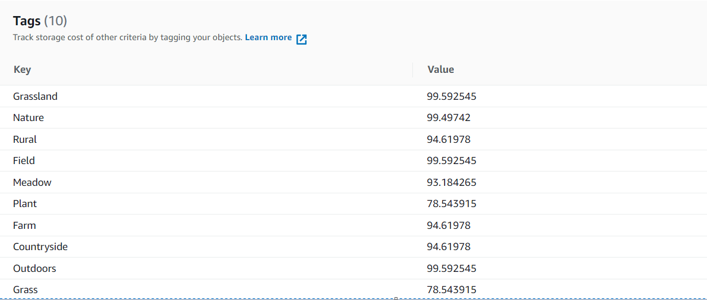
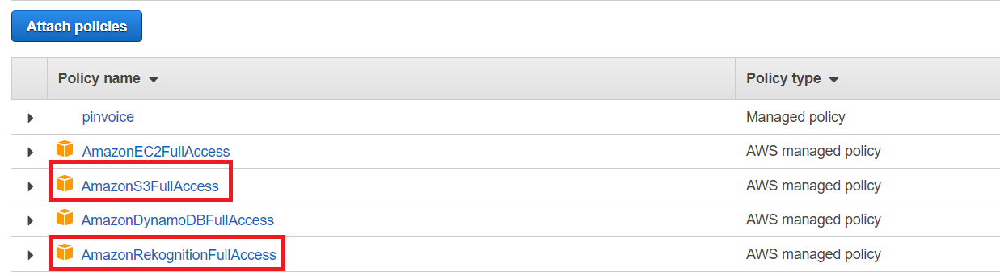
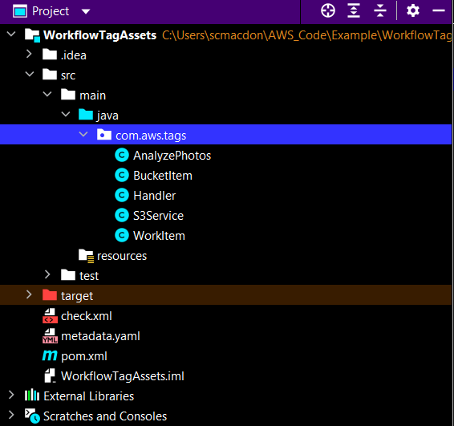
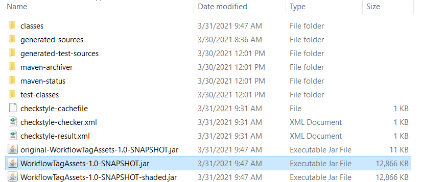
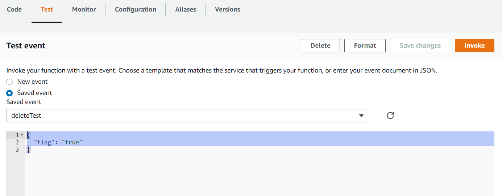
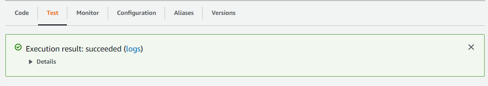

#  Creating an AWS Lambda function that tags digital assets located in an Amazon S3 bucket

## Overview

| Heading      | Description |
| ----------- | ----------- |
| Description | Discusses how to develop an AWS Lambda function that automatically tags digital assets located in an Amazon Simple Storage Service (Amazon S3) bucket by using the AWS SDK for Java (v2).   |
| Audience   |  Developer (beginner)        |
| Updated   | 5/5/2022        |
| Required skills   | Java, Maven  |

## Purpose
You can create an AWS Lambda function that automatically tags digital assets located in an Amazon Simple Storage Service (Amazon S3) bucket. This example invokes different AWS services to perform this specific use case. For example, assume you run the Lambda function and you have the following image in an S3 bucket. 


The Lambda function reads this image in a given S3 bucket and passes it to the Amazon Rekognition service to geneate a series of labels. Each label is used to create a tag that is applied to the image. After you execute the Lambda function, each image has multiple tags, as shown in the following illustration.



Tagging an object has benefits such as providing a way to categorize storage. For more information about object tagging, see [Categorizing your storage using tags](https://docs.aws.amazon.com/AmazonS3/latest/userguide/object-tagging.html).

**Note**: Lambda is a compute service that you can use to run code without provisioning or managing servers. You can create Lambda functions in various programming languages. For more information about Lambda, see
[What is AWS Lambda](https://docs.aws.amazon.com/lambda/latest/dg/welcome.html).
  
In addition to applying tags to images, this Lambda function also supports removing tags from images. For example, if you execute the Lambda function and set an input variable to **false**, the Lambda function removes all object tags from the given bucket.     

**Note**: Be sure to delete all of the resources after you complete this tutorial so that you won't be charged.

To perform this use case, you use the following AWS services:

+ Lambda
+ Amazon S3
+ Amazon Rekognition

#### Topics
+	Prerequisites
+	Create an AWS Identity and Access Management (IAM) role that is used to execute Lambda functions
+	Create an IntelliJ project
+	Add the POM dependencies to your project
+	Create a Lambda function by using the Lambda runtime API
+	Package the project that contains the Lambda function
+	Deploy the Lambda function

## Prerequisites
To follow along with this tutorial, you need the following:
+ An AWS account with proper credentials.
+ A Java IDE. (For this tutorial, the IntelliJ IDE is used.)
+ Java 1.8 JDK.
+ Maven 3.6 or higher.
+ An S3 bucket with 5-7 nature images in it.  

### Important

+ The AWS services included in this document are included in the [AWS Free Tier](https://aws.amazon.com/free/?all-free-tier.sort-by=item.additionalFields.SortRank&all-free-tier.sort-order=asc).
+  This code has not been tested in all AWS Regions. Some AWS services are available only in specific Regions. For more information, see [AWS Regional Services](https://aws.amazon.com/about-aws/global-infrastructure/regional-product-services). 
+ Running this code might result in charges to your AWS account. 
+ Be sure to delete all of the resources that you create during this tutorial so that you won't be charged.

### Creating the resources

Create an S3 bucket with 5-7 nature images in it. These images are read by the Lambda function. For more information, see [Creating a bucket](https://docs.aws.amazon.com/AmazonS3/latest/userguide/create-bucket-overview.html).

## Create an IAM role that's used to execute Lambda functions

Create the following IAM role:

+ **lambda-support** - Used to invoke Lamdba functions.

This tutorial uses the Amazon Rekognition and Amazon S3 services. The **lambda-support** role has to have policies that allow it to invoke these services from a Lambda function.  

#### To create an IAM role

1. Open the AWS Management Console. When the page loads, enter **IAM** in the search box, and then choose **IAM** to open the IAM console.

2. In the navigation pane, choose **Roles**, and on the **Roles** page, choose **Create Role**.

3. Choose **AWS service**, and then choose **Lambda**.

4. Choose **Permissions**.

5. Search for **AWSLambdaBasicExecutionRole**.

6. Choose **Next Tags**.

7. Choose **Review**.

8. Name the role **lambda-support**.

9. Choose **Create role**.

10. Choose **lambda-support** to view the overview page.

11. Choose **Attach Policies**.

12. Search for **AmazonRekognitionFullAccess**, and then choose **Attach policy**.

13. Search for **AmazonS3FullAccess**, and then choose **Attach policy**. When you're done, you can see the permissions.



## Create an IntelliJ project

1. In the IntelliJ IDE, choose **File**, **New**, **Project**.

2. In the **New Project** dialog box, choose **Maven**, and then choose **Next**.

3. For **GroupId**, enter **WorkflowTagAssets**.

4. For **ArtifactId**, enter **WorkflowTagAssets**.

5. Choose **Next**.

6. Choose **Finish**.

## Add the POM dependencies to your project

At this point, you have a new project named **WorkflowTagAssets**. Make sure that your project's pom.xml file looks like the following.

```xml
     <?xml version="1.0" encoding="UTF-8"?>
<project xmlns="http://maven.apache.org/POM/4.0.0"
         xmlns:xsi="http://www.w3.org/2001/XMLSchema-instance"
         xsi:schemaLocation="http://maven.apache.org/POM/4.0.0 http://maven.apache.org/xsd/maven-4.0.0.xsd">
    <modelVersion>4.0.0</modelVersion>
    <groupId>org.example</groupId>
    <artifactId>WorkflowTagAssets</artifactId>
    <version>1.0-SNAPSHOT</version>
    <packaging>jar</packaging>
    <name>java-basic-function</name>
    <properties>
        <project.build.sourceEncoding>UTF-8</project.build.sourceEncoding>
        <maven.compiler.source>1.8</maven.compiler.source>
        <maven.compiler.target>1.8</maven.compiler.target>
    </properties>
    <dependencyManagement>
        <dependencies>
            <dependency>
                <groupId>software.amazon.awssdk</groupId>
                <artifactId>bom</artifactId>
                <version>2.17.136</version>
                <type>pom</type>
                <scope>import</scope>
            </dependency>
        </dependencies>
    </dependencyManagement>
    <dependencies>
       <dependency>
            <groupId>com.amazonaws</groupId>
            <artifactId>aws-lambda-java-core</artifactId>
            <version>1.2.1</version>
        </dependency>
        <dependency>
            <groupId>com.google.code.gson</groupId>
            <artifactId>gson</artifactId>
            <version>2.9.0</version>
        </dependency>
        <dependency>
            <groupId>org.apache.logging.log4j</groupId>
            <artifactId>log4j-api</artifactId>
            <version>2.17.2</version>
        </dependency>
        <dependency>
            <groupId>org.apache.logging.log4j</groupId>
            <artifactId>log4j-core</artifactId>
            <version>2.17.2</version>
            <scope>test</scope>
        </dependency>
        <dependency>
            <groupId>org.apache.logging.log4j</groupId>
            <artifactId>log4j-slf4j18-impl</artifactId>
            <version>2.17.2</version>
            <scope>test</scope>
        </dependency>
        <dependency>
            <groupId>org.junit.jupiter</groupId>
            <artifactId>junit-jupiter-api</artifactId>
            <version>5.8.2</version>
            <scope>test</scope>
        </dependency>
        <dependency>
            <groupId>org.junit.jupiter</groupId>
            <artifactId>junit-jupiter-engine</artifactId>
            <version>5.8.2</version>
            <scope>test</scope>
        </dependency>
        <dependency>
            <groupId>com.googlecode.json-simple</groupId>
            <artifactId>json-simple</artifactId>
            <version>1.1.1</version>
        </dependency>
        <dependency>
            <groupId>software.amazon.awssdk</groupId>
            <artifactId>s3</artifactId>
        </dependency>
        <dependency>
            <groupId>software.amazon.awssdk</groupId>
            <artifactId>rekognition</artifactId>
        </dependency>
    </dependencies>
    <build>
        <plugins>
            <plugin>
                <artifactId>maven-surefire-plugin</artifactId>
                <version>2.22.2</version>
            </plugin>
            <plugin>
                <groupId>org.apache.maven.plugins</groupId>
                <artifactId>maven-shade-plugin</artifactId>
                <version>3.2.2</version>
                <configuration>
                    <createDependencyReducedPom>false</createDependencyReducedPom>
                </configuration>
                <executions>
                    <execution>
                        <phase>package</phase>
                        <goals>
                            <goal>shade</goal>
                        </goals>
                    </execution>
                </executions>
            </plugin>
            <plugin>
                <groupId>org.apache.maven.plugins</groupId>
                <artifactId>maven-compiler-plugin</artifactId>
                <version>3.8.1</version>
                <configuration>
                    <source>1.8</source>
                    <target>1.8</target>
                </configuration>
            </plugin>
        </plugins>
    </build>
</project>
```
    
## Create a Lambda function by using the Lambda runtime Java API

Use the Lambda runtime Java API to create the Java class that defines the Lamdba function. In this example, there is one Java class for the Lambda function named **Handler** and additional classes required for this use case. The following figure shows the Java classes in the project. All Java classes are located in a package named **com.aws.tags**. 



Create the following Java classes:

+ **Handler** - Uses the Lambda Java runtime API and performs the use case described in this AWS tutorial. The application logic that's executed is located in the **handleRequest** method. 
+ **S3Service** - Uses the Amazon S3 API to perform Amazon S3 operations.
+ **AnalyzePhotos** - Uses the Amazon Rekognition API to analyze the images.
+ **BucketItem** - Defines a model that stores S3 bucket information.
+ **WorkItem** - Defines a model that stores Amazon Rekognition data.

### Handler class

This Java code represents the **Handler** class. The class reads a flag that is passed to the Lambda function. The **s3Service.ListBucketObjects** method returns a **List** object where each element is a string value that represents the object key. If the flag value is **true**, then tags are applied by iterating through the list and applying tags to each object by calling the **s3Service.tagAssets** method. If the flag value is **false**, then the **s3Service.deleteTagFromObject** method is invoked that deletes the tags. You can also log messages to Amazon CloudWatch Logs by using a **LambdaLogger** object.

```java
    package com.aws.tags;

    import com.amazonaws.services.lambda.runtime.Context;
    import com.amazonaws.services.lambda.runtime.RequestHandler;
    import com.amazonaws.services.lambda.runtime.LambdaLogger;
    import java.util.ArrayList;
    import java.util.List;
    import java.util.Map;

    public class Handler implements RequestHandler<Map<String,String>, String> {

    @Override
    public String handleRequest(Map<String, String> event, Context context) {
        LambdaLogger logger = context.getLogger();
        String delFag = event.get("flag");
        logger.log("FLAG IS: " + delFag);
        S3Service s3Service = new S3Service();
        AnalyzePhotos photos = new AnalyzePhotos();

        String bucketName = "<Enter your bucket name>";
        List<String> myKeys = s3Service.listBucketObjects(bucketName);
        if (delFag.compareTo("true") == 0) {

            // Create a List to store the data.
            List<ArrayList<WorkItem>> myList = new ArrayList<>();

            // Loop through each element in the List and tag the assets.
            for (String key : myKeys) {

                byte[] keyData = s3Service.getObjectBytes(bucketName, key);

                // Analyze the photo and return a list where each element is a WorkItem.
                ArrayList<WorkItem> item = photos.detectLabels(keyData, key);
                myList.add(item);
            }

            s3Service.tagAssets(myList, bucketName);
            logger.log("All Assets in the bucket are tagged!");

        } else {

            // Delete all object tags.
            for (String key : myKeys) {
                s3Service.deleteTagFromObject(bucketName, key);
                logger.log("All Assets in the bucket are deleted!");
            }
         }
        return delFag;
      }
     }
```

**Note**: Make sure that you assign your bucket name to the **bucketName** variable. 

### AnalyzePhotos class

The following Java code represents the **AnalyzePhotos** class. This class uses the Amazon Rekognition API to analyze the images.

```java
    package com.aws.tags;

    import software.amazon.awssdk.auth.credentials.EnvironmentVariableCredentialsProvider;
    import software.amazon.awssdk.core.SdkBytes;
    import software.amazon.awssdk.regions.Region;
    import software.amazon.awssdk.services.rekognition.RekognitionClient;
    import software.amazon.awssdk.services.rekognition.model.Image;
    import software.amazon.awssdk.services.rekognition.model.DetectLabelsRequest;
    import software.amazon.awssdk.services.rekognition.model.DetectLabelsResponse;
    import software.amazon.awssdk.services.rekognition.model.Label;
    import software.amazon.awssdk.services.rekognition.model.RekognitionException;
    import java.util.ArrayList;
    import java.util.List;

    public class AnalyzePhotos {

     // Return a list of WorkItem objects that contain labels.
     public ArrayList<WorkItem> detectLabels(byte[] bytes, String key) {

        Region region = Region.US_EAST_2;
        RekognitionClient rekClient = RekognitionClient.builder()
                .credentialsProvider(EnvironmentVariableCredentialsProvider.create())
                .region(region)
                .build();

        try {

            SdkBytes sourceBytes = SdkBytes.fromByteArray(bytes);

            // Create an Image object for the source image.
            Image souImage = Image.builder()
                    .bytes(sourceBytes)
                    .build();

            DetectLabelsRequest detectLabelsRequest = DetectLabelsRequest.builder()
                    .image(souImage)
                    .maxLabels(10)
                    .build();

            DetectLabelsResponse labelsResponse = rekClient.detectLabels(detectLabelsRequest);

            // Write the results to a WorkItem instance.
            List<Label> labels = labelsResponse.labels();
            ArrayList<WorkItem> list = new ArrayList<>();
            WorkItem item ;
            for (Label label: labels) {
                item = new WorkItem();
                item.setKey(key); // identifies the photo.
                item.setConfidence(label.confidence().toString());
                item.setName(label.name());
                list.add(item);
            }
            return list;

        } catch (RekognitionException e) {
            System.out.println(e.getMessage());
            System.exit(1);
        }
        return null ;
      }
    }
```


### BucketItem class

The following Java code represents the **BucketItem** class that stores Amazon S3 object data.

```java
    package com.aws.tags;

    public class BucketItem {

     private String key;
     private String owner;
     private String date ;
     private String size ;


     public void setSize(String size) {
        this.size = size ;
     }

     public String getSize() {
        return this.size ;
     }

     public void setDate(String date) {
        this.date = date ;
     }

     public String getDate() {
        return this.date ;
     }

     public void setOwner(String owner) {
        this.owner = owner ;
     }

     public String getOwner() {
        return this.owner ;
     }

     public void setKey(String key) {
        this.key = key ;
     }

     public String getKey() {
        return this.key ;
     }
    }
 ```
    
 ### S3Service class
The following class uses the Amazon S3 API to perform Amazon S3 operations. For example, the **getObjectBytes** method returns a byte array that represents the image. Likewise, the **listBucketObjects** method returns a **List** object where each element is a string value that specifies the key name.  

```java
     package com.aws.tags;

     import software.amazon.awssdk.core.ResponseBytes;
     import software.amazon.awssdk.regions.Region;
     import software.amazon.awssdk.services.s3.S3Client;
     import software.amazon.awssdk.services.s3.model.GetObjectRequest;
     import software.amazon.awssdk.services.s3.model.PutObjectTaggingRequest;
     import software.amazon.awssdk.services.s3.model.GetObjectResponse;
     import software.amazon.awssdk.services.s3.model.S3Exception;
     import software.amazon.awssdk.services.s3.model.ListObjectsResponse;
     import software.amazon.awssdk.services.s3.model.S3Object;
     import software.amazon.awssdk.services.s3.model.GetObjectTaggingResponse;
     import software.amazon.awssdk.services.s3.model.ListObjectsRequest;
     import java.util.ArrayList;
     import java.util.List;
     import software.amazon.awssdk.services.s3.model.Tagging;
     import software.amazon.awssdk.services.s3.model.Tag;
     import software.amazon.awssdk.services.s3.model.GetObjectTaggingRequest;
     import software.amazon.awssdk.services.s3.model.DeleteObjectTaggingRequest;

     public class S3Service {

     private S3Client getClient() {

        Region region = Region.US_WEST_2;
        return S3Client.builder()
                .region(region)
                .build();
     }

     public byte[] getObjectBytes(String bucketName, String keyName) {

        S3Client s3 = getClient();

        try {

            GetObjectRequest objectRequest = GetObjectRequest
                    .builder()
                    .key(keyName)
                    .bucket(bucketName)
                    .build();

            // Return the byte[] from this object.
            ResponseBytes<GetObjectResponse> objectBytes = s3.getObjectAsBytes(objectRequest);
            return objectBytes.asByteArray();

        } catch (S3Exception e) {
            System.err.println(e.awsErrorDetails().errorMessage());
            System.exit(1);
        }
        return null;
     }

     // Return the names of all images in the given bucket.
     public List<String> listBucketObjects(String bucketName) {

        S3Client s3 = getClient();
        String keyName;

        List<String> keys = new ArrayList<>();

        try {
            ListObjectsRequest listObjects = ListObjectsRequest
                    .builder()
                    .bucket(bucketName)
                    .build();

            ListObjectsResponse res = s3.listObjects(listObjects);
            List<S3Object> objects = res.contents();

            for (S3Object myValue: objects) {
                keyName = myValue.key();
                keys.add(keyName);
            }
            return keys;

        } catch (S3Exception e) {
            System.err.println(e.awsErrorDetails().errorMessage());
            System.exit(1);
        }
        return null;
     }

     // Tag assets with labels in the given list.
     public void tagAssets(List myList, String bucketName) {

        try {

            S3Client s3 = getClient();
            int len = myList.size();

            String assetName = "";
            String labelName = "";
            String labelValue = "";

            // Tag all the assets in the list.
            for (Object o : myList) {

                // Need to get the WorkItem from each list.
                List innerList = (List) o;
                for (Object value : innerList) {

                    WorkItem workItem = (WorkItem) value;
                    assetName = workItem.getKey();
                    labelName = workItem.getName();
                    labelValue = workItem.getConfidence();
                    tagExistingObject(s3, bucketName, assetName, labelName, labelValue);
                }
            }

        } catch (S3Exception e) {
            System.err.println(e.awsErrorDetails().errorMessage());
            System.exit(1);
        }
     }

     // This method tags an existing object.
     private void tagExistingObject(S3Client s3, String bucketName, String key, String label, String LabelValue) {

        try {

            // First, you need to get the existing tag set. Otherwise, the existing tags are overwritten.
            GetObjectTaggingRequest getObjectTaggingRequest = GetObjectTaggingRequest.builder()
                    .bucket(bucketName)
                    .key(key)
                    .build();

            GetObjectTaggingResponse response = s3.getObjectTagging(getObjectTaggingRequest);

            // Get the existing immutable list. You cannot modify this list.
            List<Tag> existingList = response.tagSet();
            ArrayList<Tag> newTagList = new ArrayList(new ArrayList<>(existingList));

            // Create a new tag.
            Tag myTag = Tag.builder()
                    .key(label)
                    .value(LabelValue)
                    .build();

            // Push the new tag to the list.
            newTagList.add(myTag);
            Tagging tagging = Tagging.builder()
                    .tagSet(newTagList)
                    .build();

            PutObjectTaggingRequest taggingRequest = PutObjectTaggingRequest.builder()
                    .key(key)
                    .bucket(bucketName)
                    .tagging(tagging)
                    .build();

            s3.putObjectTagging(taggingRequest);
            System.out.println(key + " was tagged with " + label);

        } catch (S3Exception e) {
            System.err.println(e.awsErrorDetails().errorMessage());
            System.exit(1);
        }
      }

     // Delete tags from the given object.
     public void deleteTagFromObject(String bucketName, String key) {

        try {

            DeleteObjectTaggingRequest deleteObjectTaggingRequest = DeleteObjectTaggingRequest.builder()
                    .key(key)
                    .bucket(bucketName)
                    .build();

            S3Client s3 = getClient();
            s3.deleteObjectTagging(deleteObjectTaggingRequest);

        } catch (S3Exception e) {
            System.err.println(e.awsErrorDetails().errorMessage());
            System.exit(1);
        }
      }
    }
```

### WorkItem class
The following Java code represents the **WorkItem** class.

```java
     package com.aws.tags;

     public class WorkItem {

     private String key;
     private String name;
     private String confidence ;

    public void setKey (String key) {
        this.key = key;
    }

    public String getKey() {
        return this.key;
    }

    public void setName (String name) {
        this.name = name;
    }

    public String getName() {
        return this.name;
    }

    public void setConfidence (String confidence) {
        this.confidence = confidence;
    }

    public String getConfidence() {
        return this.confidence;
    }
   }
```

## Package the project that contains the Lambda functions

Package up the project into a .jar (JAR) file by using the following Maven command.

    mvn package

The .jar file is located in the **target** folder (which is a child folder of the project folder). 



**Note**: The **maven-shade-plugin** is used in the project’s POM file. This plugin is responsible for creating a .jar file that contains the required dependencies. If you attempt to package up the project without this plugin, the required dependences are not included in the .jar file and you will encounter a **ClassNotFoundException**. 

## Deploy the Lambda function

1. Open the Lambda console at https://us-east-1.console.aws.amazon.com/lambda/home.

2. Choose **Create Function**.

3. Choose **Author from scratch**.

4. In the **Basic** information section, enter **cron** as the name.

5. For **Runtime**, choose **Java 8**.

6. Choose **Use an existing role**, and then choose **lambda-support** (the IAM role that you created).

7. Choose **Create function**.

8. For **Code entry type**, choose **Upload a .zip or .jar file**.

9. Choose **Upload**, and then browse to the .jar file that you created.  

10. For **Handler**, enter the fully qualified name of the function, for example, **com.aws.tags.Handler::handleRequest**. (**com.aws.tags** specifies the package, and **Handler** is the class followed by :: and the method name.)

11. Choose **Save.**

**Note**: Increase the timeout value for this Lambda function so that it doesn't timeout while it tags the digital assets. 

### Test the Lambda method

At this point in the tutorial, you can test the Lambda function. Choose the **Test** tab and then enter the following JSON.

     {
    "flag": "true"
     }



**Note**: Passing **true** tags the digital assets, and passing **false** deletes the tags. 

Choose the **Invoke** button. After the Lambda function is invoked, you see a successful message. 



### Next steps
Congratulations, you have created a Lambda function that automatically applies tags to digital assets located in an S3 bucket. As stated at the beginning of this tutorial, be sure to delete all of the resources that you created during this tutorial so that you won't be charged.

For more AWS multiservice examples, see
[usecases](https://github.com/awsdocs/aws-doc-sdk-examples/tree/master/javav2/usecases).


