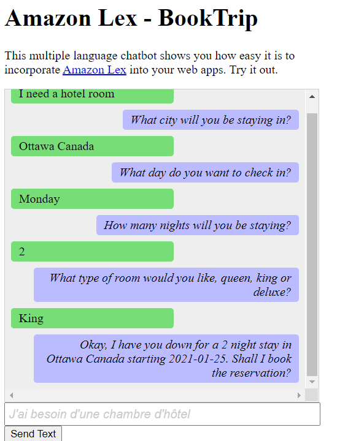
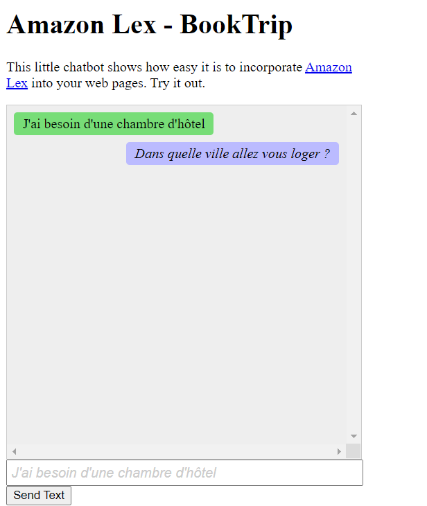
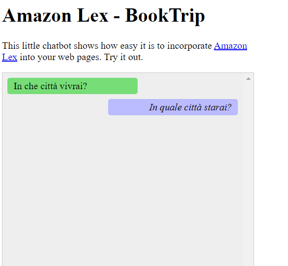
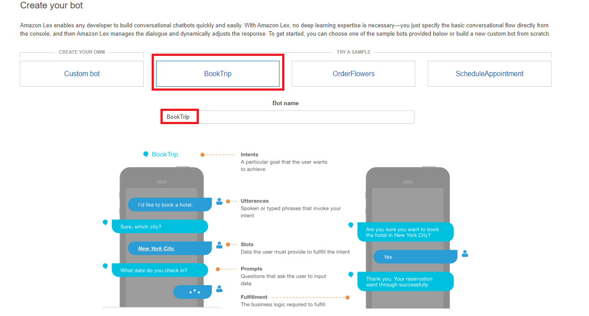
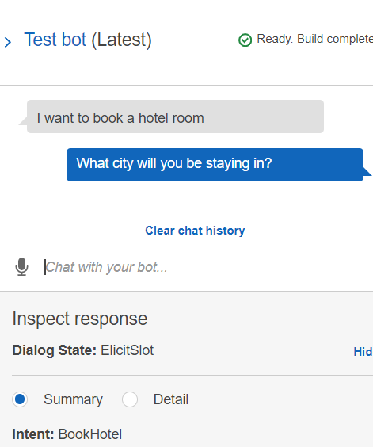
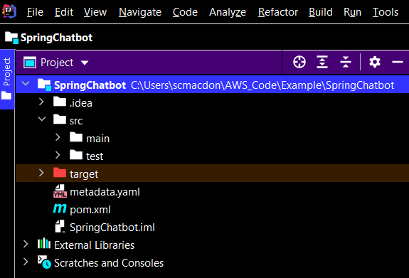
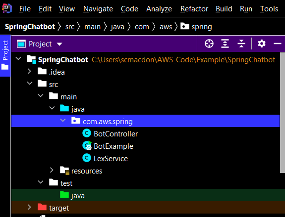

# Building an Amazon Lex Chatbot that engages users in multiple languages

## Overview

| Heading      | Description |
| ----------- | ----------- |
| Description |  Discusses how to create an Amazon Lex Chatbot by using the AWS SDK for Java v2.     |
| Audience   |  Developer (beginner / intermediate)        |
| Updated   | 5/10/2022        |
| Required skills   | Java, Maven  |

## Purpose
You can create an Amazon Lex Chatbot within a web application to engage your web site visitors. An Amazon Lex Chatbot is functionality that performs on-line chat conversation with users without providing direct contact with a person. For example, the following illustration shows an Amazon Lex Chatbot that engages a user about booking a hotel room. 



The Amazon Lex Chatbot created in this AWS tutorial is able to handle multiple languages. For example, a user who speaks French can enter French text and get back a response in French. 



Likewise, a user can communicate with the Amazon Lex chatbot in Italian.



This AWS tutorial guides you through creating an Amazon Lex chatbot and integrating it into a Spring Boot web application. The AWS SDK for Java (version 2) is used to invoke these  AWS services:

+ Amazon Lex
+ Amazon Comprehend
+ Amazon Translate

#### Topics

+ Prerequisites
+ Create an Amazon Lex bot
+ Create an IntelliJ project
+ Add POM dependencies to your project
+ Create the Java classes for your project
+ Create the HTML files

## Prerequisites

To complete the tutorial, you need the following:

+ An AWS account
+ A Java IDE (this tutorial uses the IntelliJ IDE)
+ Java JDK 1.8
+ Maven 3.6 or later

### Important

+ The AWS services included in this document are included in the [AWS Free Tier](https://aws.amazon.com/free/?all-free-tier.sort-by=item.additionalFields.SortRank&all-free-tier.sort-order=asc).
+  This code has not been tested in all AWS Regions. Some AWS services are available only in specific regions. For more information, see [AWS Regional Services](https://aws.amazon.com/about-aws/global-infrastructure/regional-product-services). 
+ Running this code might result in charges to your AWS account. 
+ Be sure to terminate all of the resources you create while going through this tutorial to ensure that you’re not charged.


## Create an Amazon Lex bot

The first step is to create an Amazon Lex chatbot by using the AWS Management Console. In this example, the Amazon Lex **BookTrip** example is used. For more information, see [Book Trip](https://docs.aws.amazon.com/lex/latest/dg/ex-book-trip.html).

1. Sign in to the AWS Management Console and open the Amazon Lex console at https://console.aws.amazon.com/lex/.

2. On the Bots page, choose **Create**.

3. Choose **BookTrip** blueprint (leave the default bot name **BookTrip**).



4. Fill in the default settings and choose **Create** (the console shows the **BookTrip** bot). On the Editor tab, review the details of the preconfigured intents.

5. Test the bot in the test window. Start the test by typing *I want to book a hotel room*. 



6. Choose **Publish** and specify an alias name (you will need this value when using the AWS SDK for Java). 

**Note**: You need to reference the **bot name** and the **bot alias** in your Java code. 

## Create an IntelliJ project named SpringChatbot

Create an IntelliJ project that is used to create a web site that uses the Amazon Lex chatbot.

1. In the IntelliJ IDE, choose **File**, **New**, **Project**.

2. In the New Project dialog box, choose **Maven**.

3. Choose **Next**.

4. In **GroupId**, enter **spring-aws**.

5. In **ArtifactId**, enter **SpringChatbot**.

6. Choose **Next**.

7. Choose **Finish**.

## Add POM dependencies to your project

At this point, you have a new project named **SpringChatbot**.



Ensure that the pom.xml file resembles the following code.

```xml
   <?xml version="1.0" encoding="UTF-8"?>
<project xmlns="http://maven.apache.org/POM/4.0.0"
         xmlns:xsi="http://www.w3.org/2001/XMLSchema-instance"
         xsi:schemaLocation="http://maven.apache.org/POM/4.0.0 http://maven.apache.org/xsd/maven-4.0.0.xsd">
    <modelVersion>4.0.0</modelVersion>
    <groupId>SpringChatbot</groupId>
    <artifactId>SpringChatbot</artifactId>
    <version>1.0-SNAPSHOT</version>
    <parent>
        <groupId>org.springframework.boot</groupId>
        <artifactId>spring-boot-starter-parent</artifactId>
        <version>2.6.1</version>
        <relativePath/>
    </parent>
    <properties>
        <java.version>1.8</java.version>
    </properties>
    <dependencyManagement>
        <dependencies>
            <dependency>
                <groupId>software.amazon.awssdk</groupId>
                <artifactId>bom</artifactId>
                <version>2.17.136</version>
                <type>pom</type>
                <scope>import</scope>
            </dependency>
        </dependencies>
    </dependencyManagement>
    <dependencies>
        <dependency>
            <groupId>org.springframework.boot</groupId>
            <artifactId>spring-boot-starter-web</artifactId>
        </dependency>
        <dependency>
            <groupId>org.springframework.boot</groupId>
            <artifactId>spring-boot-starter-thymeleaf</artifactId>
        </dependency>
         <dependency>
            <groupId>software.amazon.awssdk</groupId>
            <artifactId>lexruntime</artifactId>
         </dependency>
        <dependency>
            <groupId>software.amazon.awssdk</groupId>
            <artifactId>translate</artifactId>
        </dependency>
        <dependency>
            <groupId>software.amazon.awssdk</groupId>
            <artifactId>comprehend</artifactId>
        </dependency>
        <dependency>
            <groupId>org.springframework.boot</groupId>
            <artifactId>spring-boot-starter-test</artifactId>
            <scope>test</scope>
            <exclusions>
                <exclusion>
                    <groupId>org.junit.vintage</groupId>
                    <artifactId>junit-vintage-engine</artifactId>
                </exclusion>
            </exclusions>
        </dependency>
       </dependencies>
    <build>
        <plugins>
            <plugin>
                <groupId>org.springframework.boot</groupId>
                <artifactId>spring-boot-maven-plugin</artifactId>
            </plugin>
        </plugins>
    </build>
</project>
```     

 ## Create the Java classes
 
 Create a Java package in the main/java folder named **com.aws.spring**. The Java files go into this package.
 
  
 
 Create these Java classes:

+ **BotExample** - The base class for the Spring Boot application.
+ **BotController** - The Spring Boot controller that handles HTTP requests.
+ **LexService** - The class that uses the AWS SDK for Java (V2) to invoke AWS Services to perform this use case. 

### BotExample class

The following Java code represents the **BotExample** class.

```java
     package com.aws.spring;

     import org.springframework.boot.SpringApplication;
     import org.springframework.boot.autoconfigure.SpringBootApplication;

     @SpringBootApplication
     public class BotExample {

     public static void main(String[] args) {
        SpringApplication.run(BotExample.class, args);
     }
    }
```

### BotController class

The following Java code represents the **BotController** class.

```java
     package com.aws.spring;

     import org.springframework.beans.factory.annotation.Autowired;
     import org.springframework.stereotype.Controller;
     import org.springframework.ui.Model;
     import org.springframework.web.bind.annotation.GetMapping;
     import org.springframework.web.bind.annotation.RequestMapping;
     import org.springframework.web.bind.annotation.RequestMethod;
     import org.springframework.web.bind.annotation.ResponseBody;
     import javax.servlet.http.HttpServletRequest;
     import javax.servlet.http.HttpServletResponse;

     @Controller
     public class BotController {

     @Autowired
     LexService lex;

     @GetMapping("/")
     public String greetingForm(Model model) {
        return "index";
     }

     // Handles a string posted from the client. 
     @RequestMapping(value = "/text", method = RequestMethod.POST)
     @ResponseBody
     String addItems(HttpServletRequest request, HttpServletResponse response) {

       String text = request.getParameter("text");
       String message = lex.getText(text);
       return message;
     }
    }
```

### LexService class

The **LexService** class uses the AWS SDK for Java (v2) to handle all text submitted from the client. This class contains a method named **getText** that accepts the text posted from the client. The first task this method does is to invoke the **ComprehendClient** object's **detectDominantLanguage** to determine the language of the text. For example, if the posted text was french, then this method returns **fr**. After the language is determined, the next thing that occurs is the text is translated from the given language to english by invoking the **TranslateClient** object's **translateText** method. Finally when the text is translated to english, the **LexRuntimeClient** object's **postText** method is invoked. This method returns a text response from the Amazon Lex service. 

If the text was in another language, then the text is translated back into the original language and passed back to the client where it's displayed in the Web UI. The following Java code represents the **LexService** class.

```java
     package com.aws.spring;

     import software.amazon.awssdk.auth.credentials.EnvironmentVariableCredentialsProvider;
     import software.amazon.awssdk.regions.Region;
     import software.amazon.awssdk.services.lexruntime.LexRuntimeClient;
     import org.springframework.stereotype.Component;
     import software.amazon.awssdk.services.lexruntime.model.LexRuntimeException;
     import software.amazon.awssdk.services.lexruntime.model.PostTextRequest;
     import software.amazon.awssdk.services.comprehend.ComprehendClient;
     import software.amazon.awssdk.services.comprehend.model.ComprehendException;
     import software.amazon.awssdk.services.comprehend.model.DetectDominantLanguageRequest;
     import software.amazon.awssdk.services.comprehend.model.DetectDominantLanguageResponse;
     import software.amazon.awssdk.services.comprehend.model.DominantLanguage;
     import software.amazon.awssdk.services.translate.TranslateClient;
     import software.amazon.awssdk.services.translate.model.TranslateTextRequest;
     import software.amazon.awssdk.services.translate.model.TranslateTextResponse;
     import software.amazon.awssdk.services.translate.model.TranslateException;
     import java.util.*;
     import software.amazon.awssdk.services.lexruntime.model.PostTextResponse;

     @Component
     public class LexService {

     public String getText(String text) {

        Region region = Region.US_EAST_1;
        LexRuntimeClient lexRuntimeClient = LexRuntimeClient.builder()
                .region(region)
                .build();

        String engMessage ="";
        try {

            // Need to determine the language.
            String lanCode = DetectLanguage(text);

            // If the lanCode is NOT Eng - then we need to translate the message to English to pass to Amazon Lex.
            if (lanCode.compareTo("en")  !=0)
                engMessage = textTranslateToEn(lanCode, text);
            else
                engMessage=text;

             String userId =  "chatbot-demo" ;

            Map<String,String> sessionAttributes = new HashMap<>();
            PostTextRequest textRequest = PostTextRequest.builder()
                    .botName("BookTrip")
                    .botAlias("<ENTER YOUR BOT ALIAS>")
                    .inputText(engMessage)
                    .userId(userId)
                    .sessionAttributes(sessionAttributes)
                    .build();

            PostTextResponse textResponse = lexRuntimeClient.postText(textRequest);
            String message = textResponse.message();

            // If not EN, we need to translate the text back
            String outputText ="";
            if (lanCode.compareTo("en")  !=0)
                outputText = textTranslateFromEn(lanCode, message);
            else
                outputText = message;

            return outputText ;

        } catch (LexRuntimeException e) {
            System.err.println(e.getMessage());
            System.exit(1);
        }
        return "";
       }

      private String DetectLanguage(String text) {

        Region region = Region.US_EAST_1;
        ComprehendClient comClient = ComprehendClient.builder()
                .region(region)
                .build();

        try {

            String lanCode = "";
            DetectDominantLanguageRequest request = DetectDominantLanguageRequest.builder()
                    .text(text)
                    .build();

            DetectDominantLanguageResponse resp = comClient.detectDominantLanguage(request);
            List<DominantLanguage> allLanList = resp.languages();
            Iterator<DominantLanguage> lanIterator = allLanList.iterator();

            while (lanIterator.hasNext()) {
                DominantLanguage lang = lanIterator.next();
                lanCode = lang.languageCode();
            }

            return lanCode;

         } catch (ComprehendException e) {
            System.err.println(e.awsErrorDetails().errorMessage());
            System.exit(1);
         }
         return "";
        }

       public String textTranslateToEn(String lanCode, String text) {

        Region region = Region.US_EAST_1;
        TranslateClient translateClient = TranslateClient.builder()
                .credentialsProvider(EnvironmentVariableCredentialsProvider.create())
                .region(region)
                .build();
         try {
            TranslateTextRequest textRequest = TranslateTextRequest.builder()
                    .sourceLanguageCode(lanCode)
                    .targetLanguageCode("en")
                    .text(text)
                    .build();

            TranslateTextResponse textResponse = translateClient.translateText(textRequest);
            return textResponse.translatedText();

         } catch (TranslateException e) {
            System.err.println(e.getMessage());
            System.exit(1);
         }
         return "";
       }


      public String textTranslateFromEn(String lanCode, String text) {

        Region region = Region.US_EAST_1;
        TranslateClient translateClient = TranslateClient.builder()
                .credentialsProvider(EnvironmentVariableCredentialsProvider.create())
                .region(region)
                .build();
        try {
            TranslateTextRequest textRequest = TranslateTextRequest.builder()
                    .sourceLanguageCode("en")
                    .targetLanguageCode(lanCode)
                    .text(text)
                    .build();

            TranslateTextResponse textResponse = translateClient.translateText(textRequest);
            return textResponse.translatedText();

         } catch (TranslateException e) {
            System.err.println(e.getMessage());
            System.exit(1);
         }
         return "";
       }
      }
```

**Note**: Ensure that you specify the bot name and the bot alias when creating the **PostTextRequest** object.  

## Create the HTML file

At this point, you have created all of the Java files required for this example Spring Boot application. Now you create a HTML file that is required for the application's view. Under the resource folder, create a **templates** folder, and then create the following HTML file:

+ index.html

The **index.html** file is the application's home view that displays the Amazon Lex bot. The following HTML represents the **index.html** file. 

```html
    <!DOCTYPE html>
    <html xmlns:th="https://www.thymeleaf.org">

    <head>
     <title>Amazon Lex - Sample Application (BookTrip)</title>
      <script th:src="|https://code.jquery.com/jquery-1.12.4.min.js|"></script>
     <style language="text/css">
        input#wisdom {
            padding: 4px;
            font-size: 1em;
            width: 400px
        }

        input::placeholder {
            color: #ccc;
            font-style: italic;
        }

        p.userRequest {
            margin: 4px;
            padding: 4px 10px 4px 10px;
            border-radius: 4px;
            min-width: 50%;
            max-width: 85%;
            float: left;
            background-color: #7d7;
        }

        p.lexResponse {
            margin: 4px;
            padding: 4px 10px 4px 10px;
            border-radius: 4px;
            text-align: right;
            min-width: 50%;
            max-width: 85%;
            float: right;
            background-color: #bbf;
            font-style: italic;
        }

        p.lexError {
            margin: 4px;
            padding: 4px 10px 4px 10px;
            border-radius: 4px;
            text-align: right;
            min-width: 50%;
            max-width: 85%;
            float: right;
            background-color: #f77;
        }
        </style>
       </head>

      <body>
      <h1 style="text-align:  left">Amazon Lex - BookTrip</h1>
      <p style="width: 400px">
      This multiple language chatbot shows you how easy it is to incorporate
      <a href="https://aws.amazon.com/lex/" title="Amazon Lex (product)" target="_new">Amazon Lex</a> into your web apps.  Try it out.
     </p>
     <div id="conversation" style="width: 400px; height: 400px; border: 1px solid #ccc; background-color: #eee; padding: 4px; overflow: scroll"></div>
     <input type="text" id="wisdom" size="80" value="I need a hotel room">
     <br>
     <button onclick="pushChat()">Send Text</button>

    <script type="text/javascript">

     var g_text = "";
    // set the focus to the input box
     document.getElementById("wisdom").focus();

     function pushChat() {

        // if there is text to be sent...
        var wisdomText = document.getElementById('wisdom');
        if (wisdomText && wisdomText.value && wisdomText.value.trim().length > 0) {

            // disable input to show we're sending it
            var wisdom = wisdomText.value.trim();
            wisdomText.value = '...';
            wisdomText.locked = true;
            handletext(wisdom);
        }
      }

     function showRequest(daText) {
            var conversationDiv = document.getElementById('conversation');
            var requestPara = document.createElement("P");
            requestPara.className = 'userRequest';
            requestPara.appendChild(document.createTextNode(g_text));
            conversationDiv.appendChild(requestPara);
            conversationDiv.scrollTop = conversationDiv.scrollHeight;
        }

        function showResponse(lexResponse) {

            var conversationDiv = document.getElementById('conversation');
            var responsePara = document.createElement("P");
            responsePara.className = 'lexResponse';


           var lexTextResponse = lexResponse;
           responsePara.appendChild(document.createTextNode(lexTextResponse));
           responsePara.appendChild(document.createElement('br'));
           conversationDiv.appendChild(responsePara);
           conversationDiv.scrollTop = conversationDiv.scrollHeight;
        }

        function handletext(text) {

            g_text = text
            $.ajax('/text', {
                type: 'POST',
                data: 'text=' + text,
                success: function (data, status, xhr) {

                   showRequest();
                   showResponse(data);

                    // re-enable input
                    var wisdomText = document.getElementById('wisdom');
                    wisdomText.value = '';
                    wisdomText.locked = false;
                },
                error: function (jqXhr, textStatus, errorMessage) {
                    $('p').append('Error' + errorMessage);
                }
            });
        }

     </script>
     </body>
     </html>
```

## Run the application

Using the IntelliJ IDE, you can run your application. The first time you run the Spring Boot application, click the run icon in the Spring Boot main class, as shown in this illustration. 


**Note**: You can deploy this Spring Boot application by using AWS Elastic Beanstalk. If you do deploy this application to AWS Elastic Beanstalk, you need to set up an additional inbound rule. For information about deploying a web application, see [Creating your first AWS Java web application](https://github.com/awsdocs/aws-doc-sdk-examples/tree/main/javav2/usecases/creating_first_project).

### Next steps
Congratulations! You have created a Spring Boot application that uses Amazon Lex to create an interactive user experience. As stated at the beginning of this tutorial, be sure to terminate all of the resources you create while going through this tutorial to ensure that you’re not charged.

For more AWS multiservice examples, see
[usecases](https://github.com/awsdocs/aws-doc-sdk-examples/tree/master/javav2/usecases).
