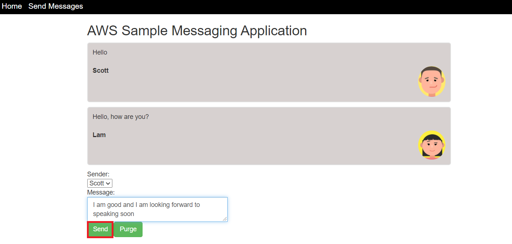
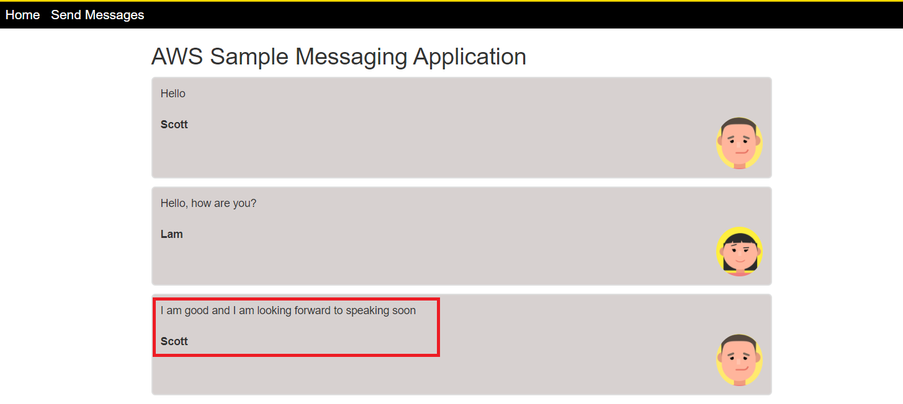
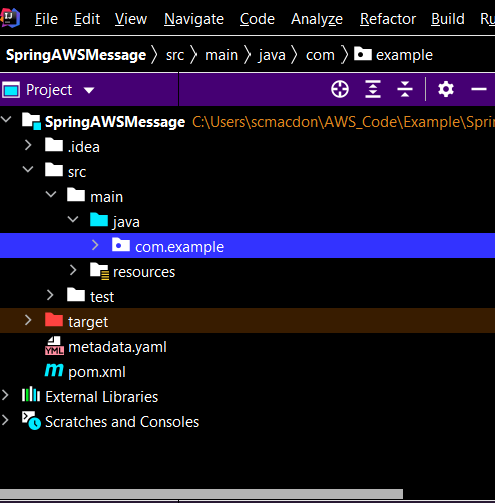
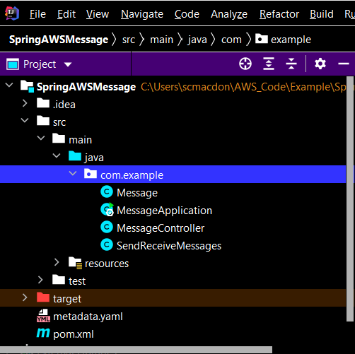

# Creating an example messaging application using the AWS SDK for Java

## Purpose

You can create a dynamic web application that sends and retrieves messages by using the AWS SDK for Java and Amazon Simple Queue Service (Amazon SQS). Messages are stored in a first in, first out (FIFO) queue that ensures that the order of the messages is consistent. For example, the first message that's stored in the queue is the first message read from the queue.

**Note:** For more information about Amazon SQS, see [What is Amazon Simple Queue Service?](https://docs.aws.amazon.com/AWSSimpleQueueService/latest/SQSDeveloperGuide/welcome.html)

In this tutorial, you create a Spring Boot application named AWS Messaging. The Spring Boot APIs are used to build a model, different views, and a controller. For information, see [Spring Boot](https://spring.io/projects/spring-boot).

#### Topics

+ Prerequisites
+ Understand the AWS Messaging application
+ Create an IntelliJ project named SpringAWSMessage
+ Add the POM dependencies to your project
+ Create the Java classes
+ Create the HTML files
+ Create the script files
+ Package the project into a JAR file
+ Deploy the application to AWS Elastic Beanstalk

## Prerequisites

To complete the tutorial, you need the following:

+ An AWS account
+ A Java IDE (this tutorial uses the IntelliJ IDE)
+ Java JDK 1.8
+ Maven 3.6 or later+ 

## Important

+ The AWS services included in this document are included in the [AWS Free Tier](https://aws.amazon.com/free/?all-free-tier.sort-by=item.additionalFields.SortRank&all-free-tier.sort-order=asc).
+  This code has not been tested in all AWS Regions. Some AWS services are available only in specific regions. For more information, see [AWS Regional Services](https://aws.amazon.com/about-aws/global-infrastructure/regional-product-services). 
+ Running this code might result in charges to your AWS account. 
+ Be sure to terminate all of the resources you create while going through this tutorial to ensure that you’re not charged.

### Creating the resources

Create A FIFO queue named **Message.fifo**. For information, see [Creating an Amazon SQS queue](https://docs.aws.amazon.com/AWSSimpleQueueService/latest/SQSDeveloperGuide/sqs-configure-create-queue.html). 

## Understand the AWS Messaging application

To send a message to a SQS queue, enter the message into the application and choose **Send**.



After the message is sent, the application displays the message, as shown in this figure.




You can choose **Purge** to purge the messages from the FIFO queue. This results in an empty queue, and no messages are displayed in the application.  

The following describes how the application handles a message:

1. The message and user values are posted to a Spring controller.
2. The Spring controller creates a custom **Message** object that stores the message ID value (a GUID), the message text, and the user.
3. The Spring controller passes the **Message** object to a message service that uses the **software.amazon.awssdk.services.sqs.SqsClient** client object to store the data into a FIFO queue.
4. The Spring controller invokes the message service’s **getMessages** method to read all of the messages in the queue. This method returns an XML document that contains all messages.
5. The XML is passed back to the view, where the messages are parsed and displayed in the view.  

## Create an IntelliJ project named SpringAWSMessage

1. In the IntelliJ IDE, choose **File**, **New**, **Project**.
2. In the **New Project** dialog box, choose **Maven**, and then choose **Next**.
3. For **GroupId**, enter **aws-springmessage**.
4. For **ArtifactId**, enter **SpringAWSMessage**.
6. Choose **Next**.
7. Choose **Finish**.

## Add the POM dependencies to your project

At this point, you have a new project named **SpringAWSMessage**.


Add the following dependency for the Amazon SQS API (AWS SDK for Java version 2).

    <dependency>
       <groupId>software.amazon.awssdk</groupId>
       <artifactId>sqs</artifactId>
    </dependency>

**Note:** Ensure that you are using Java 1.8, as shown in the following **pom.xml** file.    

  Add the Spring Boot dependencies. The **pom.xml** file looks like the following.

```xml
    <?xml version="1.0" encoding="UTF-8"?>
    <project xmlns="http://maven.apache.org/POM/4.0.0"
         xmlns:xsi="http://www.w3.org/2001/XMLSchema-instance"
         xsi:schemaLocation="http://maven.apache.org/POM/4.0.0 http://maven.apache.org/xsd/maven-4.0.0.xsd">
    <modelVersion>4.0.0</modelVersion>

    <groupId>SpringAWSMessage</groupId>
    <artifactId>SpringAWSMessage</artifactId>
    <version>1.0-SNAPSHOT</version>
    <parent>
        <groupId>org.springframework.boot</groupId>
        <artifactId>spring-boot-starter-parent</artifactId>
        <version>2.2.5.RELEASE</version>
        <relativePath/> <!-- look up parent from repository -->
    </parent>

    <properties>
        <java.version>1.8</java.version>
    </properties>
    <dependencyManagement>
        <dependencies>
            <dependency>
                <groupId>software.amazon.awssdk</groupId>
                <artifactId>bom</artifactId>
                <version>2.10.54</version>
                <type>pom</type>
                <scope>import</scope>
            </dependency>
        </dependencies>
    </dependencyManagement>
    <dependencies>
        <dependency>
            <groupId>software.amazon.awssdk</groupId>
            <artifactId>sqs</artifactId>
        </dependency>
        <dependency>
            <groupId>org.springframework.boot</groupId>
            <artifactId>spring-boot-starter-thymeleaf</artifactId>
        </dependency>
        <dependency>
            <groupId>org.springframework.boot</groupId>
            <artifactId>spring-boot-starter-web</artifactId>
        </dependency>
        <dependency>
            <groupId>org.springframework.boot</groupId>
            <artifactId>spring-boot-starter-test</artifactId>
            <scope>test</scope>
            <exclusions>
                <exclusion>
                    <groupId>org.junit.vintage</groupId>
                    <artifactId>junit-vintage-engine</artifactId>
                </exclusion>
            </exclusions>
        </dependency>
        <dependency>
            <groupId>software.amazon.awssdk</groupId>
            <artifactId>dynamodb-enhanced</artifactId>
            <version>2.11.0-PREVIEW</version>
        </dependency>
        <dependency>
            <groupId>software.amazon.awssdk</groupId>
            <artifactId>dynamodb</artifactId>
            <version>2.5.10</version>
        </dependency>
        <dependency>
            <groupId>software.amazon.awssdk</groupId>
            <artifactId>sns</artifactId>
        </dependency>
    </dependencies>
    <build>
        <plugins>
            <plugin>
                <groupId>org.springframework.boot</groupId>
                <artifactId>spring-boot-maven-plugin</artifactId>
            </plugin>
        </plugins>
     </build>
    </project>
```

## Create the Java classes

Create a Java package in the **main/java** folder named **com.example**.



The Java files must go into this package.



Create the following Java classes:

+ **Message** - Used as the model for this application.
+ **MessageApplication** - Used as the base class for the Spring Boot application.
+ **MessageController** - Used as the Spring Boot controller that handles HTTP requests.
+ **SendReceiveMessages** - Uses the Amazon SQS API to process messages.  

### Message class

The **Message** class represents the application’s model.

```java
     package com.example;

    public class Message {

    private String id;
    private String body;
    private String name;


    public String getName() {
        return this.name;
    }

    public void setName(String name) {
        this.name = name;
    }

    public String getId() {
        return id;
    }

    public void setId(String id) {
        this.id = id;
    }

    public String getBody() {
        return this.body;
    }

    public void setBody(String body) {
        this.body = body;
     }
    }
```

### MessageApplication class

The following Java code represents the **MessageApplication** class. This class represents the entry point into the Spring Boot application.

```java
     package com.example;

     import org.springframework.boot.SpringApplication;
     import org.springframework.boot.autoconfigure.SpringBootApplication;

     @SpringBootApplication
     public class MessageApplication {

    public static void main(String[] args) {
        SpringApplication.run(MessageApplication.class, args);
     }
    }
```

### MessageController class

The following Java code represents the **MainController** class that handles HTTP requests. For example, when a new message is posted, the **addItems** method handles the request.  

```java
     package com.example;

     import org.springframework.beans.factory.annotation.Autowired;
     import org.springframework.stereotype.Controller;
     import org.springframework.ui.Model;
     import org.springframework.web.bind.annotation.*;

     import javax.servlet.http.HttpServletRequest;
     import javax.servlet.http.HttpServletResponse;
     import java.util.UUID;

     @Controller
     public class MessageController {

    @Autowired
    SendReceiveMessages msgService;

    @GetMapping("/")
    public String root() {
        return "index";
    }

    //  Purge the queue
    @RequestMapping(value = "/purge", method = RequestMethod.GET)
    @ResponseBody
    String purgeMessages(HttpServletRequest request, HttpServletResponse response) {

        msgService.purgeMyQueue();
        return "Queue is purged";
    }


    // Get messages
    @RequestMapping(value = "/populate", method = RequestMethod.GET)
    @ResponseBody
    String getItems(HttpServletRequest request, HttpServletResponse response) {

       String xml= msgService.getMessages();
       return xml;
    }

    // Create a message
    @RequestMapping(value = "/add", method = RequestMethod.POST)
    @ResponseBody
    String addItems(HttpServletRequest request, HttpServletResponse response) {

        String user = request.getParameter("user");
        String message = request.getParameter("message");

        // Generate the ID
        UUID uuid = UUID.randomUUID();
        String msgId = uuid.toString();

        Message messageOb = new Message();
        messageOb.setId(msgId);
        messageOb.setName(user);
        messageOb.setBody(message);

        msgService.processMessage(messageOb);
        String xml= msgService.getMessages();

        return xml;
        }

      @GetMapping("/message")
      public String greetingForm(Model model) {
        model.addAttribute("greeting", new Message());
        return "message";
       }
      }
```

### SendReceiveMessages class

The following class uses the Amazon SQS API to send and retrieve messages. For example, the **getMessages** method retrieves a message from the queue. Likewise, the **processMessage** method sends a message to a queue.

```java
        package com.example;

        import org.springframework.stereotype.Component;
        import software.amazon.awssdk.auth.credentials.EnvironmentVariableCredentialsProvider;
        import software.amazon.awssdk.regions.Region;
        import software.amazon.awssdk.services.sqs.SqsClient;
        import software.amazon.awssdk.services.sqs.model.*;
        import software.amazon.awssdk.services.sqs.model.ReceiveMessageRequest;
        import software.amazon.awssdk.services.sqs.model.Message;
        import software.amazon.awssdk.services.sqs.model.PurgeQueueRequest;
        import org.w3c.dom.Document;
        import javax.xml.parsers.DocumentBuilder;
        import javax.xml.parsers.DocumentBuilderFactory;
        import javax.xml.parsers.ParserConfigurationException;
        import javax.xml.transform.Transformer;
        import javax.xml.transform.TransformerException;
        import javax.xml.transform.TransformerFactory;
        import javax.xml.transform.dom.DOMSource;
        import javax.xml.transform.stream.StreamResult;
        import org.w3c.dom.Element;
        import java.io.StringWriter;
        import java.util.*;

        @Component
        public class SendReceiveMessages {

        private final String QUEUE_NAME = "Message.fifo";

        private SqsClient getClient() {
            SqsClient sqsClient = SqsClient.builder()
             .region(Region.US_WEST_2)
             .credentialsProvider(EnvironmentVariableCredentialsProvider.create())
             .build();

        return sqsClient;
        }


        public void purgeMyQueue() {

        SqsClient sqsClient = getClient();

        GetQueueUrlRequest getQueueRequest = GetQueueUrlRequest.builder()
                .queueName(QUEUE_NAME)
                .build();

        PurgeQueueRequest queueRequest = PurgeQueueRequest.builder()
                .queueUrl(sqsClient.getQueueUrl(getQueueRequest).queueUrl())
                .build();

        sqsClient.purgeQueue(queueRequest);
        }

        public String getMessages() {

        List attr = new ArrayList<String>();
        attr.add("Name");

        SqsClient sqsClient = getClient();

        try {

        GetQueueUrlRequest getQueueRequest = GetQueueUrlRequest.builder()
                .queueName(QUEUE_NAME)
                .build();

        String queueUrl = sqsClient.getQueueUrl(getQueueRequest).queueUrl();

        // Receive messages from the queue
        ReceiveMessageRequest receiveRequest = ReceiveMessageRequest.builder()
                .queueUrl(queueUrl)
                .maxNumberOfMessages(10)
                .messageAttributeNames(attr)
                .build();
        List<Message> messages = sqsClient.receiveMessage(receiveRequest).messages();

        com.example.Message myMessage;

        List allMessages = new ArrayList<com.example.Message>();

        // Push the messages to a list
        for (Message m : messages) {

            myMessage=new com.example.Message();
            myMessage.setBody(m.body());

            Map map = m.messageAttributes();
            MessageAttributeValue val=(MessageAttributeValue)map.get("Name");
            myMessage.setName(val.stringValue());

            allMessages.add(myMessage);
        }

        return convertToString(toXml(allMessages));

        } catch (SqsException e) {
            e.getStackTrace();
        }
        return "";
        }

        public void processMessage(com.example.Message msg) {

        SqsClient sqsClient = SqsClient.builder()
                .region(Region.US_WEST_2)
                .build();

        try {

            // Get user
            MessageAttributeValue attributeValue = MessageAttributeValue.builder()
                    .stringValue(msg.getName())
                    .dataType("String")
                    .build();

            Map myMap = new HashMap<String, MessageAttributeValue>();
            myMap.put("Name", attributeValue);


            GetQueueUrlRequest getQueueRequest = GetQueueUrlRequest.builder()
                    .queueName(QUEUE_NAME)
                    .build();

            String queueUrl = sqsClient.getQueueUrl(getQueueRequest).queueUrl();

            // Generate the work item ID
            UUID uuid = UUID.randomUUID();
            String msgId1 = uuid.toString();

            SendMessageRequest sendMsgRequest = SendMessageRequest.builder()
                    .queueUrl(queueUrl)
                    .messageAttributes(myMap)
                    .messageGroupId("GroupA")
                    .messageDeduplicationId(msgId1)
                    .messageBody(msg.getBody())
                    .build();
            sqsClient.sendMessage(sendMsgRequest);


        } catch (SqsException e) {
             e.getStackTrace();
        }
        }

        // Convert item data retrieved from the message queue
        // into XML to pass back to the view
        private Document toXml(List<com.example.Message> itemList) {


        try {
            DocumentBuilderFactory factory = DocumentBuilderFactory.newInstance();
            DocumentBuilder builder = factory.newDocumentBuilder();
            Document doc = builder.newDocument();

            // Start building the XML
            Element root = doc.createElement( "Messages" );
            doc.appendChild( root );

            // Get the elements from the collection
            int custCount = itemList.size();

            // Iterate through the collection
            for ( int index=0; index < custCount; index++) {

                // Get the WorkItem object from the collection
                com.example.Message myMessage = itemList.get(index);

                Element item = doc.createElement( "Message" );
                root.appendChild( item );

                // Set the ID
                Element id = doc.createElement( "Data" );
                id.appendChild( doc.createTextNode(myMessage.getBody()));
                item.appendChild( id );

                // Set the name
                Element name = doc.createElement( "User" );
                name.appendChild( doc.createTextNode(myMessage.getName() ) );
                item.appendChild( name );

             }

                return doc;
            } catch(ParserConfigurationException e) {
            e.printStackTrace();
            }
            return null;
            }

        private String convertToString(Document xml) {
            try {
            Transformer transformer = TransformerFactory.newInstance().newTransformer();
            StreamResult result = new StreamResult(new StringWriter());
            DOMSource source = new DOMSource(xml);
            transformer.transform(source, result);
            return result.getWriter().toString();

        } catch(TransformerException ex) {
            ex.printStackTrace();
        }
        return null;
       }
     }
```


**Note:** The **EnvironmentVariableCredentialsProvider** is used to create an **SqsClient** because this application will be deployed to Elastic Beanstalk. You can set up environment variables on Elastic Beanstalk so that the **SqsClient** is successfully created.

## Create the HTML files

At this point, you have created all of the Java files required for the AWS Messaging application. Now you create the HTML files that are required for the application's graphical user interface (GUI). Under the **resource** folder, create a **templates** folder, and then create the following HTML files:

+ index.html
+ message.html
+ layout.html

The **index.html** file is the application's home view. The **message.html** file represents the view for sending messages. The **layout.html** file represents the menu that's visible in all views.

### index.html

The following HTML represents the **index.html** file.

```html
     <!DOCTYPE html>
     <html xmlns:th="http://www.thymeleaf.org" xmlns:sec="http://www.thymeleaf.org/thymeleaf-extras-springsecurity3">
     <head>
    <meta charset="utf-8" />
    <meta http-equiv="X-UA-Compatible" content="IE=edge" />
    <meta name="viewport" content="width=device-width, initial-scale=1" />

    <link rel="stylesheet" th:href="|https://maxcdn.bootstrapcdn.com/bootstrap/3.3.7/css/bootstrap.min.css|"/>
    <link rel="stylesheet" href="../public/css/styles.css" th:href="@{/css/styles.css}" />
    <link rel="icon" href="../public/images/favicon.ico" th:href="@{/images/favicon.ico}" />

    <title>AWS Messaging</title>
    </head>

    <body>
    <header th:replace="layout :: site-header"/>
    <div class="container">

    <h2>AWS Messaging application</h2>

    <p>The AWS Messaging application is an example application that uses Amazon SQS and other AWS services and the AWS SDK for Java version 2 API.
     Working with messages has never been easier. Just perform these steps:<p>

       <ol>

        <li>You can send a new message by choosing the <b>Send Messages</b> menu item. Select a user from the form, enter a message, and then choose <b>Send</b>.</li>
        <li>The AWS Messaging application stores the message in a FIFO queue. This queue ensures that the order of the messages is consistent.</li>
        <li>The AWS Messaging application polls the queue for all messages in the FIFO queue.</li>
        <li>The AWS Messaging application displays the message data in the view. The message body, user name, and an avatar are displayed.</li>
        <li>You can send and view multiple messages by using the AWS Messaging application. </li>
         <li>You can purge the queue. </li>
        </ol>
     <div>
    </body>
    </html>
```
### message.html

The following is the HTML for the **message.html** file.

```html
     <!DOCTYPE HTML>
     <html xmlns:th="https://www.thymeleaf.org">
     <head>
     <meta name="viewport" content="width=device-width, initial-scale=1">
     <script th:src="|https://code.jquery.com/jquery-1.12.4.min.js|"></script>
     <script th:src="|https://code.jquery.com/ui/1.11.4/jquery-ui.min.js|"></script>
     <script src="../public/js/message.js" th:src="@{/js/message.js}"></script>
     <link rel="stylesheet" th:href="|https://maxcdn.bootstrapcdn.com/bootstrap/3.3.7/css/bootstrap.min.css|"/>
     <link rel="stylesheet" href="../public/css/styles.css" th:href="@{/css/styles.css}" />
     <link rel="icon" href="../public/images/favicon.ico" th:href="@{/images/favicon.ico}" />

     <style>
        .messageelement {
            margin: auto;
            border: 2px solid #dedede;
            background-color: #D7D1D0 ;
            border-radius: 5px;
            max-width: 800px;
            padding: 10px;
            margin: 10px 0;
        }

        .messageelement::after {
            content: "";
            clear: both;
            display: table;
        }

        .messageelement img {
            float: left;
            max-width: 60px;
            width: 100%;
            margin-right: 20px;
            border-radius: 50%;
        }

        .messageelement img.right {
            float: right;
            margin-left: 20px;
            margin-right:0;
        }
     </style>
     </head>
     <body>
     <header th:replace="layout :: site-header"/>

    <div class="container">
     <h2>AWS Messaging application</h2>
    <div id="messages">
    </div>

    <div class="input-group mb-3">
    <div class="input-group-prepend">
        <span class="input-group-text" id="basic-addon1">Sender:</span>
    </div>
    <select name="cars" id="username">
        <option value="Scott">Scott</option>
        <option value="Lam">Lam</option>
    </select>
    </div>

    <div class="input-group">
     <div class="input-group-prepend">
        <span class="input-group-text">Message:</span>
     </div>
     <textarea class="form-control" id="textarea" aria-label="With textarea"></textarea>
     <button type="button" onclick="pushMessage()" id="send" class="btn btn-success">Send</button>
     <button type="button" onclick="purge()" id="refresh" class="btn btn-success">Purge</button>
     </div>
    </div>

    <!-- All of these child items are hidden and only displayed in a FancyBox ------------------------------------------------------>
    <div id="hide" style="display: none">

    <div id="base" class="messageelement">
        
        <p id="text">Excellent! So, what do you want to do today?</p>
        <span class="time-right">11:02</span>
     </div>

    </div>
    </body>
    </html>
```
### layout.html

The following is the HTML for the **layout.html** file that represents the application's menu.

```html
     <!DOCTYPE html>
     <html xmlns:th="http://www.thymeleaf.org">
     <head th:fragment="site-head">
     <meta charset="UTF-8" />
     <link rel="icon" href="../public/images/favicon.ico" th:href="@{/images/favicon.ico}" />
     <script th:src="|https://code.jquery.com/jquery-1.12.4.min.js|"></script>
    <meta th:include="this :: head" th:remove="tag"/>
    </head>
    <body>
    <!-- th:hef calls a controller method - which returns the view -->
    <header th:fragment="site-header">
     <a href="index.html" th:href="@{/}"></a>
     <a href="#" style="color: white" th:href="@{/}">Home</a>
     <a href="#" style="color: white" th:href="@{/message}">Send messages</a>
    </header>
    <h1>Welcome</h1>
    <body>
    <p>Welcome to the AWS Messaging example application that uses Amazon SQS.</p>
    </body>
    </html>
```

## Create script files

Create a script file named **message.js** that communicates with the Spring controller. This file is used by the **message.html** view. Place the script file in the following path.

**resources\public\js**

The following code represents this **.js** file.

```javascript
    $(function() {

     populateChat()
   } );

  function populateChat() {

    $.ajax('/populate', {
        type: 'GET',
        success: function (data, status, xhr) {
            var xml = data;

            $("#messages").children().remove();

            $(xml).find('Message').each(function () {

                var $field = $(this);
                var body = $field.find('Data').text();
                var name = $field.find('User').text();

                //Set the view
                var userText = body +'<br><br><b>' + name  ;

                var myTextNode = $("#base").clone();

                myTextNode.text(userText) ;
                var image_url;

                var n = name.localeCompare("Scott");
                if (n == 0)
                    image_url = "../images/av1.png";
                else
                    image_url = "../images/av2.png";
                var images_div = "";

                myTextNode.html(userText) ;
                myTextNode.append(images_div);
                $("#messages").append(myTextNode);
            });

        },
        error: function (jqXhr, textStatus, errorMessage) {
            $('p').append('Error' + errorMessage);
        }
     });
    }

    function purge() {

     $.ajax('/purge', {
        type: 'GET',
        success: function (data, status, xhr) {
            alert(data);
            populateChat();
            $('#textarea').val("");
        },
        error: function (jqXhr, textStatus, errorMessage) {
            $('p').append('Error' + errorMessage);
        }
      });
     }

   function pushMessage() {

    var user =  $('#username').val();
    var message = $('#textarea').val();

    $.ajax('/add', {
        type: 'POST',
        data: 'user=' + user + '&message=' + message,
        success: function (data, status, xhr) {
            var xml = event.target.responseText;
            $('#textarea').val("");
            $("#messages").children().remove();

            $(xml).find('Message').each(function () {

                var $field = $(this);
                var body = $field.find('Data').text();
                var name = $field.find('User').text();

                //Set the view
                var userText = body +'<br><br><b>' + name  ;

                var myTextNode = $("#base").clone();

                myTextNode.text(userText) ;
                var image_url;

                var n = name.localeCompare("Scott");
                if (n == 0)
                    image_url = "../images/av1.png";
                else
                    image_url = "../images/av2.png";
                var images_div = "";

                myTextNode.html(userText) ;
                myTextNode.append(images_div);
                $("#messages").append(myTextNode);
            });
          },
         error: function (jqXhr, textStatus, errorMessage) {
            $('p').append('Error' + errorMessage);
         }
       });
      }

```

**Note:** Be sure to include the CSS and image files located on the GitHub website in your project.

## Package the project into an executable JAR file

Package up the project into an executable **.jar** (JAR) file by using the following Maven command.

     mvn package

The JAR file is located in the target folder.


The POM file contains the **spring-boot-maven-plugin** that builds an executable JAR file which includes the dependencies. (Without the dependencies, the application does not run on Elastic Beanstalk.) For more information, see [Spring Boot Maven Plugin](https://www.baeldung.com/executable-jar-with-maven).

## Deploy to Elastic Beanstalk

The final step is to deploy the Spring application to Elastic Beanstalk. To learn how, see [Creating your first AWS Java web application](https://github.com/awsdocs/aws-doc-sdk-examples/tree/master/javav2/usecases/creating_first_project).

### Next steps
Congratulations! You have created and deployed the Spring application named AWS Messaging that uses Amazon SQS. As stated at the beginning of this tutorial, be sure to terminate all of the resources you create while going through this tutorial to ensure that you’re no longer charged for them.

For more AWS multiservice examples, see
[usecases](https://github.com/awsdocs/aws-doc-sdk-examples/tree/master/javav2/usecases).
