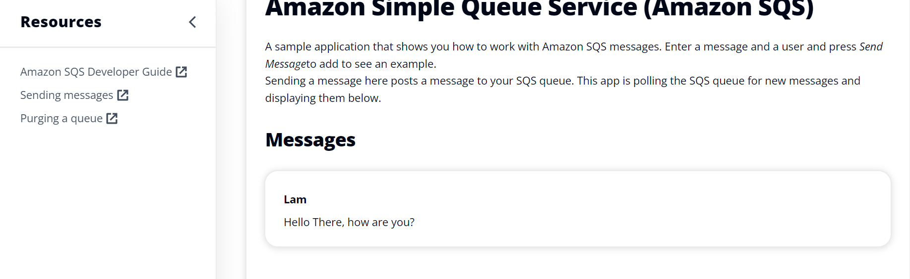
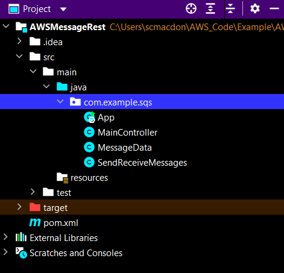
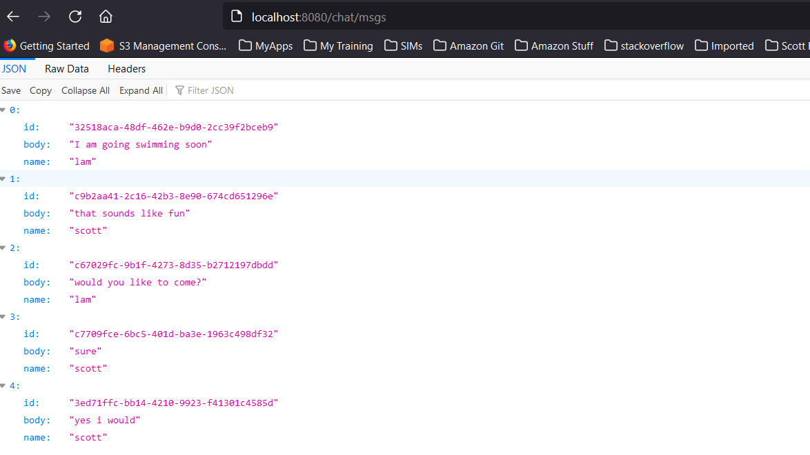

# Create a React and Spring REST application that handles Amazon SQS messages

## Overview

| Heading      | Description |
| ----------- | ----------- |
| Description | Discusses how to develop a Spring REST API that sends and retrieves messages by using the AWS SDK for Java (v2) and Amazon Simple Queue Service (Amazon SQS). This application also detects the language code of the posted message by using Amazon Comprehend. The Spring REST API is used by a React application that displays the data.   |
| Audience   |  Developer (intermediate)        |
| Updated   | 8/02/2022        |
| Required skills   | Java, Maven, JavaScript  |


## Purpose

You can create a React application that sends and retrieves messages by using the AWS SDK for Java (v2) and Amazon Simple Queue Service (Amazon SQS). Messages are stored in a first in, first out (FIFO) queue that ensures that the order of the messages is consistent. For example, the first message that's stored in the queue is the first message read from the queue.

**Note:** For more information about Amazon SQS, see [What is Amazon Simple Queue Service?](https://docs.aws.amazon.com/AWSSimpleQueueService/latest/SQSDeveloperGuide/welcome.html)

The application you create is a decoupled React application that uses a Spring REST API to return Amazon SQS data. That is, the React application is a single-page application (SPA) that interacts with a Spring REST API by making RESTful GET and POST requests. The Spring REST API uses an **SqsClient** object to handle messages. Then, the Spring REST API returns JSON data in an HTTP response, as shown in the following illustration.


#### Topics

+ Prerequisites
+ Understand the AWS Messaging application
+ Create an IntelliJ project
+ Add the POM dependencies to your project
+ Create the Java classes
+ Package the project into a JAR file
+ Deploy the application to AWS Elastic Beanstalk
+ Create the React front end

## Prerequisites

To complete the tutorial, you need the following:

+ An AWS account
+ A Java IDE (this tutorial uses the IntelliJ IDE)
+ Java JDK 1.8
+ Maven 3.6 or later+ 

## Important

+ The AWS services included in this document are included in the [AWS Free Tier](https://aws.amazon.com/free/?all-free-tier.sort-by=item.additionalFields.SortRank&all-free-tier.sort-order=asc).
+  This code has not been tested in all AWS Regions. Some AWS services are available only in specific Regions. For more information, see [AWS Regional Services](https://aws.amazon.com/about-aws/global-infrastructure/regional-product-services). 
+ Running this code might result in charges to your AWS account. 
+ Be sure to terminate all of the resources you create while going through this tutorial so that you won't be charged.

### Create the resources

Create a FIFO queue named **Message.fifo**. For more information, see [Creating an Amazon SQS queue](https://docs.aws.amazon.com/AWSSimpleQueueService/latest/SQSDeveloperGuide/sqs-configure-create-queue.html). 

Add some items to the *Message.fifo* queue in the AWS console. After creating the queue, select the queue, then select 
**Send and receive messages**. On the **Send and receive messages** page, enter sample data below,
selecting **Send message** after data is entered for each row.

| Message body               | Message group ID | Message deduplication ID | Message Attributes |
|----------------------------|------------------|--------------------------|--------------------|
| "I am going swimming soon" | 1                | 1                        | "Name":"lam"       |
| "that sounds like fun"     | 2                | 2                        | "Name":"scott"     |
| "would you like to come?"  | 3                | 3                        | "Name":"lam"       |
| "sure"                     | 4                | 4                        | "Name":"scott"     |


## Understand the AWS Messaging React application

The React application shows you how to work with Amazon SQS messages. The application posts a message to your Amazon SQS queue and it polls the Amazon SQS queue for new messages and displays them. You can enter a message and a user and then click **Send Message**.


After the message is sent, the application displays the message, as shown in the following figure.



The following describes how the application handles a message:

1. The message and user values are posted to a Spring REST endpoint.
2. The Spring controller creates a custom **MessageData** object that stores the message ID value (a GUID), the message text, and the user.
3. The Spring controller passes the **MessageData** object to a message service that uses the **software.amazon.awssdk.services.sqs.SqsClient** client object to store the data into a FIFO queue.
4. The Spring REST endpoint invokes the message service’s **getMessages** method to read all of the messages in the queue. A list of **MessageData** objects is returned and displayed in the React application. 


## Create an IntelliJ project named AWSMessageRest

1. In the IntelliJ IDE, choose **File**, **New**, **Project**.
2. In the **New Project** dialog box, choose **Maven**, and then choose **Next**.
3. For **GroupId**, enter **aws-springmessage**.
4. For **ArtifactId**, enter **AWSMessageRest**.
6. Choose **Next**.
7. Choose **Finish**.

## Add the POM dependencies to your project

At this point, you have a new project named **AWSMessageRest**. Add the following dependency for the Amazon SQS API (AWS SDK for Java (v2)).

    <dependency>
       <groupId>software.amazon.awssdk</groupId>
       <artifactId>sqs</artifactId>
    </dependency>

**Note:** Make sure to use Java 1.8, as shown in the following **pom.xml** file.    

The **pom.xml** file looks like the following.

```xml
    <?xml version="1.0" encoding="UTF-8"?>
    <project xmlns="http://maven.apache.org/POM/4.0.0"
         xmlns:xsi="http://www.w3.org/2001/XMLSchema-instance"
         xsi:schemaLocation="http://maven.apache.org/POM/4.0.0 http://maven.apache.org/xsd/maven-4.0.0.xsd">
    <modelVersion>4.0.0</modelVersion>
    <groupId>org.example</groupId>
    <artifactId>AWSMessageRest</artifactId>
    <version>1.0-SNAPSHOT</version>
    <parent>
        <groupId>org.springframework.boot</groupId>
        <artifactId>spring-boot-starter-parent</artifactId>
        <version>2.0.4.RELEASE</version>
        <relativePath /> <!-- lookup parent from repository -->
    </parent>
    <properties>
        <project.build.sourceEncoding>UTF-8</project.build.sourceEncoding>
        <java.version>1.8</java.version>
    </properties>
    <dependencyManagement>
        <dependencies>
            <dependency>
                <groupId>software.amazon.awssdk</groupId>
                <artifactId>bom</artifactId>
                <version>2.17.230</version>
                <type>pom</type>
                <scope>import</scope>
            </dependency>
        </dependencies>
    </dependencyManagement>
    <dependencies>
        <dependency>
            <groupId>org.junit.jupiter</groupId>
            <artifactId>junit-jupiter-api</artifactId>
            <version>5.8.2</version>
            <scope>test</scope>
        </dependency>
        <dependency>
            <groupId>org.junit.jupiter</groupId>
            <artifactId>junit-jupiter-engine</artifactId>
            <version>5.8.2</version>
            <scope>test</scope>
        </dependency>
        <dependency>
            <groupId>org.junit.platform</groupId>
            <artifactId>junit-platform-commons</artifactId>
            <version>1.8.2</version>
        </dependency>
        <dependency>
            <groupId>org.junit.platform</groupId>
            <artifactId>junit-platform-launcher</artifactId>
            <version>1.8.2</version>
            <scope>test</scope>
        </dependency>
        <dependency>
            <groupId>software.amazon.awssdk</groupId>
            <artifactId>ses</artifactId>
        </dependency>
        <dependency>
            <groupId>org.assertj</groupId>
            <artifactId>assertj-core</artifactId>
            <version>3.22.0</version>
            <scope>test</scope>
        </dependency>
        <dependency>
            <groupId>software.amazon.awssdk</groupId>
            <artifactId>sqs</artifactId>
        </dependency>
        <dependency>
            <groupId>software.amazon.awssdk</groupId>
            <artifactId>comprehend</artifactId>
        </dependency>
        <dependency>
            <groupId>software.amazon.awssdk</groupId>
            <artifactId>protocol-core</artifactId>
        </dependency>
        <dependency>
            <groupId>jakarta.mail</groupId>
            <artifactId>jakarta.mail-api</artifactId>
            <version>2.0.1</version>
        </dependency>
        <dependency>
            <groupId>com.sun.mail</groupId>
            <artifactId>jakarta.mail</artifactId>
            <version>1.6.5</version>
        </dependency>
         <dependency>
            <groupId>net.sourceforge.jexcelapi</groupId>
            <artifactId>jxl</artifactId>
            <version>2.6.10</version>
        </dependency>
        <dependency>
            <groupId>commons-io</groupId>
            <artifactId>commons-io</artifactId>
            <version>2.6</version>
        </dependency>
        <dependency>
            <groupId>org.springframework.boot</groupId>
            <artifactId>spring-boot-starter-web</artifactId>
        </dependency>
        <dependency>
            <groupId>org.springframework.boot</groupId>
            <artifactId>spring-boot-starter-test</artifactId>
            <scope>test</scope>
            <exclusions>
                <exclusion>
                    <groupId>org.junit.vintage</groupId>
                    <artifactId>junit-vintage-engine</artifactId>
                </exclusion>
            </exclusions>
        </dependency>
      </dependencies>
      <build>
        <plugins>
            <plugin>
                <groupId>org.springframework.boot</groupId>
                <artifactId>spring-boot-maven-plugin</artifactId>
            </plugin>
        </plugins>
    </build>
   </project>
```

## Create the Java classes

Create a Java package in the **main/java** folder named **com.example.sqs**. The Java files must go into this package.



Create the following Java classes:

+ **MessageData** - Used as the model for this application.
+ **App** - Used as the base class for the Spring Boot application.
+ **MessageController** - Used as the Spring Boot controller that handles HTTP requests.
+ **SendReceiveMessages** - Uses the Amazon SQS API to process messages.  

### MessageData class

The **MessageData** class represents the application’s model.

```java
package com.example.sqs;

public class MessageData {

    private String id;
    private String body;
    private String name;


    public String getName() {
        return this.name;
    }

    public void setName(String name) {
        this.name = name;
    }

    public String getId() {
        return id;
    }

    public void setId(String id) {
        this.id = id;
    }

    public String getBody() {
        return this.body;
    }

    public void setBody(String body) {
        this.body = body;
    }
}
```

### App class

The following Java code represents the **App** class. This class represents the entry point into the Spring Boot application.

```java
package com.example.sqs;

import org.springframework.boot.SpringApplication;
import org.springframework.boot.autoconfigure.SpringBootApplication;

@SpringBootApplication
public class App {
        public static void main(String[] args) throws Throwable {
                SpringApplication.run(App.class, args);
        }
}
```

### MessageController class

The following Java code represents the **MainController** class that handles HTTP requests. For example, when a new message is posted, the **addItems** method handles the request.  

```java
  package com.example.sqs;

import org.springframework.beans.factory.annotation.Autowired;
import org.springframework.web.bind.annotation.CrossOrigin;
import org.springframework.web.bind.annotation.RequestMethod;
import org.springframework.web.bind.annotation.ResponseBody;
import org.springframework.web.bind.annotation.RestController;
import org.springframework.web.bind.annotation.RequestMapping;
import org.springframework.web.bind.annotation.PostMapping;
import javax.servlet.http.HttpServletRequest;
import javax.servlet.http.HttpServletResponse;
import java.util.List;
import java.util.UUID;

@CrossOrigin(origins = "*")
@RestController
@RequestMapping("/chat")
public class MainController {

    @Autowired
    SendReceiveMessages msgService;

    // Add a new message.
    @PostMapping("/add")
    List<MessageData> addItems(HttpServletRequest request, HttpServletResponse response) {
        String user = request.getParameter("user");
        String message = request.getParameter("message");

        // Generate the ID.
        UUID uuid = UUID.randomUUID();
        String msgId = uuid.toString();

        MessageData messageOb = new MessageData();
        messageOb.setId(msgId);
        messageOb.setName(user);
        messageOb.setBody(message);
        msgService.processMessage(messageOb);
        return msgService.getMessages();
    }

    // Purge the queue.
    @RequestMapping(value = "/purge", method = RequestMethod.GET)
    @ResponseBody
    String purgeMessages(HttpServletRequest request, HttpServletResponse response) {
        msgService.purgeMyQueue();
        return "Queue is purged";
    }

    // Get messages.
    @RequestMapping(value = "/msgs", method = RequestMethod.GET)
    @ResponseBody
    List<MessageData> getItems(HttpServletRequest request, HttpServletResponse response) {
        List<MessageData> data =  msgService.getMessages();
        return data;
    }
}


```

### SendReceiveMessages class

The following class uses the Amazon SQS API to send and retrieve messages. For example, the **getMessages** method retrieves a message from the queue. Likewise, the **processMessage** method sends a message to a queue. Amazon Comprehend is used in the following code example to detect the language code of the new message. 

```java
package com.example.sqs;

import org.springframework.stereotype.Component;
import software.amazon.awssdk.auth.credentials.EnvironmentVariableCredentialsProvider;
import software.amazon.awssdk.regions.Region;
import software.amazon.awssdk.services.comprehend.ComprehendClient;
import software.amazon.awssdk.services.comprehend.model.DetectDominantLanguageRequest;
import software.amazon.awssdk.services.comprehend.model.DetectDominantLanguageResponse;
import software.amazon.awssdk.services.comprehend.model.DominantLanguage;
import software.amazon.awssdk.services.sqs.SqsClient;
import software.amazon.awssdk.services.sqs.model.GetQueueUrlRequest;
import software.amazon.awssdk.services.sqs.model.MessageAttributeValue;
import software.amazon.awssdk.services.sqs.model.ReceiveMessageRequest;
import software.amazon.awssdk.services.sqs.model.Message;
import software.amazon.awssdk.services.sqs.model.PurgeQueueRequest;
import software.amazon.awssdk.services.sqs.model.SendMessageRequest;
import software.amazon.awssdk.services.sqs.model.SqsException;
import java.util.ArrayList;
import java.util.HashMap;
import java.util.List;
import java.util.Map;

@Component
public class SendReceiveMessages {

    private final String queueName = "Message.fifo";

    private SqsClient getClient() {
        return SqsClient.builder()
            .region(Region.US_WEST_2)
            .credentialsProvider(EnvironmentVariableCredentialsProvider.create())
            .build();
    }

    // Get a Comprehend client.
    private ComprehendClient getComClient() {

        return ComprehendClient.builder()
            .region(Region.US_WEST_2)
            .credentialsProvider(EnvironmentVariableCredentialsProvider.create())
            .build();
    }

    public void purgeMyQueue() {
        SqsClient sqsClient = getClient();
        GetQueueUrlRequest getQueueRequest = GetQueueUrlRequest.builder()
            .queueName(queueName)
            .build();

        PurgeQueueRequest queueRequest = PurgeQueueRequest.builder()
            .queueUrl(sqsClient.getQueueUrl(getQueueRequest).queueUrl())
            .build();

        sqsClient.purgeQueue(queueRequest);
    }

    public List<MessageData> getMessages() {
        List<String> attr = new ArrayList<>();
        attr.add("Name");
        SqsClient sqsClient = getClient();

        try {
            GetQueueUrlRequest getQueueRequest = GetQueueUrlRequest.builder()
                .queueName(queueName)
                .build();

            String queueUrl = sqsClient.getQueueUrl(getQueueRequest).queueUrl();
            ReceiveMessageRequest receiveRequest = ReceiveMessageRequest.builder()
                .queueUrl(queueUrl)
                .maxNumberOfMessages(10)
                .waitTimeSeconds(20)
                .messageAttributeNames(attr)
                .build();

            List<Message> messages = sqsClient.receiveMessage(receiveRequest).messages();
            MessageData myMessage;
            List<MessageData> allMessages = new ArrayList<>();

            // Push the messages to a list.
            for (Message m : messages) {
                myMessage=new MessageData();
                myMessage.setBody(m.body());
                myMessage.setId(m.messageId());

                Map<String, MessageAttributeValue> map = m.messageAttributes();
                MessageAttributeValue val= map.get("Name");
                myMessage.setName(val.stringValue());
                allMessages.add(myMessage);
            }

            return allMessages;

        } catch (SqsException e) {
            e.getStackTrace();
        }
        return null;
    }

    public void processMessage(MessageData msg) {
        SqsClient sqsClient = getClient();

        try {
            MessageAttributeValue attributeValue = MessageAttributeValue.builder()
                .stringValue(msg.getName())
                .dataType("String")
                .build();

            Map<String, MessageAttributeValue> myMap = new HashMap<>();
            myMap.put("Name", attributeValue);
            GetQueueUrlRequest getQueueRequest = GetQueueUrlRequest.builder()
                .queueName(queueName)
                .build();

            // We will get the language code for the incoming message.
            ComprehendClient comClient =  getComClient();

            // Specify the Langauge code of the incoming message.
            String lanCode = "" ;
            DetectDominantLanguageRequest request = DetectDominantLanguageRequest.builder()
                .text(msg.getBody())
                .build();

            DetectDominantLanguageResponse resp = comClient.detectDominantLanguage(request);
            List<DominantLanguage> allLanList = resp.languages();
            for (DominantLanguage lang : allLanList) {
                System.out.println("Language is " + lang.languageCode());
                lanCode = lang.languageCode();
            }

            String queueUrl = sqsClient.getQueueUrl(getQueueRequest).queueUrl();
            SendMessageRequest sendMsgRequest = SendMessageRequest.builder()
                .queueUrl(queueUrl)
                .messageAttributes(myMap)
                .messageGroupId("GroupA_"+lanCode)
                .messageDeduplicationId(msg.getId())
                .messageBody(msg.getBody())
                .build();

            sqsClient.sendMessage(sendMsgRequest);

        } catch (SqsException e) {
            e.getStackTrace();
        }
    }
}

```

**Note:** The **EnvironmentVariableCredentialsProvider** is used to create an **SqsClient** because this application will be deployed to Elastic Beanstalk. You can set up environment variables on Elastic Beanstalk so that the **SqsClient** is successfully created.

## Run the application
Using the IntelliJ IDE, you can run your Spring REST API. The first time you run it, choose the run icon in the main class. The Spring API supports the following URLs:

- /chat/msgs - A GET request that returns all messages in the queue. 
- /chat/add - A POST request that adds a new message to the queue. 
- /api/purge - A GET request that deletes messages from the queue. 

Note: The React SPA created in a following section consumes all of these URLs.

Confirm that the Spring REST API works by viewing the messages. Enter the following URL into a browser.

http://localhost:8080/chat/msgs

The following image shows the JSON data returned from the Spring REST API.



## Package the project into an executable JAR file

Package up the project into an executable **.jar** (JAR) file by using the following Maven command.

     mvn package

The JAR file is located in the target folder.

The POM file contains the **spring-boot-maven-plugin** that builds an executable JAR file which includes the dependencies. (Without the dependencies, the application does not run on Elastic Beanstalk.) For more information, see [Spring Boot Maven Plugin](https://www.baeldung.com/executable-jar-with-maven).

## Deploy to Elastic Beanstalk

Deploy the Spring application to Elastic Beanstalk. To learn how, see [Creating your first AWS Java web application](https://github.com/awsdocs/aws-doc-sdk-examples/tree/master/javav2/usecases/creating_first_project).

## Create the React front end

Create the React SPA that consumes the JSON data returned from the Spring REST API. To create the React SPA, you can download files from the following GitHub repository [Resources](https://github.com/awsdocs/aws-doc-sdk-examples/tree/main/resources).  

You must modify the **AwsService.js** file so that your React requests work with your Java backend. Update this file to include the following code.

```javascript

import axios from 'axios'
import configData from './config.json'


export const getMessages =  async() => {
    return await axios.get(`${configData.BASE_URL}/chat/msgs`);
  };


export const postMessage =  async(item) => {

    let user = item.username;
    let message = item.message;
    await axios.post(`${configData.BASE_URL}/chat/add?user=`+ user + `&message=`+ message);
  };
```

### Next steps
Congratulations! You have created and deployed the Spring application named AWS Messaging that uses Amazon SQS. As stated at the beginning of this tutorial, be sure to terminate all of the resources you create while going through this tutorial so that you won't continue to be charged for them.

For more AWS multiservice examples, see
[usecases](https://github.com/awsdocs/aws-doc-sdk-examples/tree/master/javav2/usecases).
