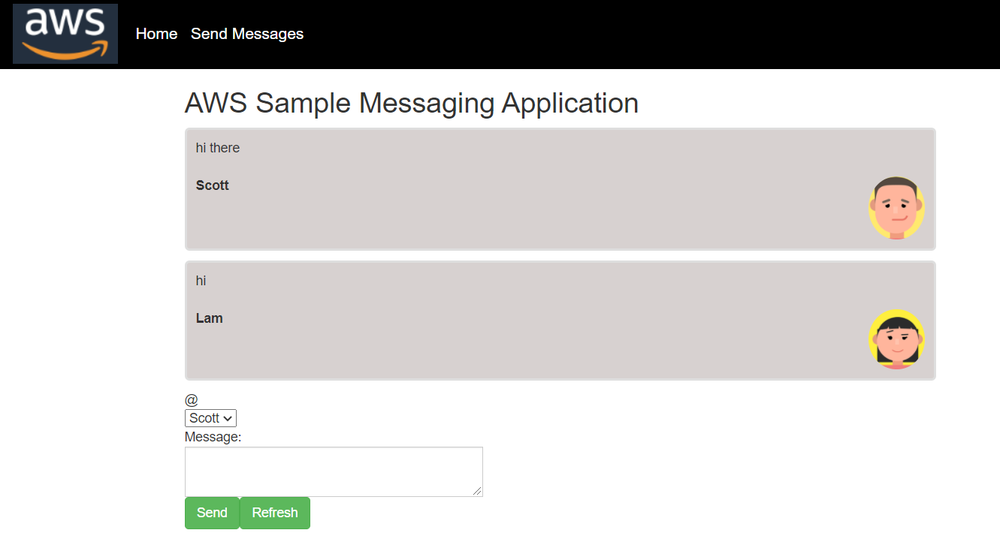

# Creating Sample Messaging Applications using the AWS SDK for Java

You can create an AWS application that sends and retrieves messages by using the AWS Java SDK and the Simple Queue Service (SQS). Messages are stored in a First in First out (FIFO) queue that ensures that the order of the messages are consistent. For example, the first message that is stored in the queue is the first message read from the queue.

**Note:** For more information about the SQS, see [What is Amazon Simple Queue Service?](https://docs.aws.amazon.com/AWSSimpleQueueService/latest/SQSDeveloperGuide/welcome.html). 

In this tutorial, you create a Spring Boot application named AWS Message application. The Spring Boot APIs are used to build a model, different views, and a controller. The following figure shows the AWS Message application.

**Cost to complete:** The AWS services you'll use in this example are part of the AWS Free Tier.

**Note:** When you're done developing the application, be sure to terminate all of the resources you created to ensure that you're  no longer charged.
