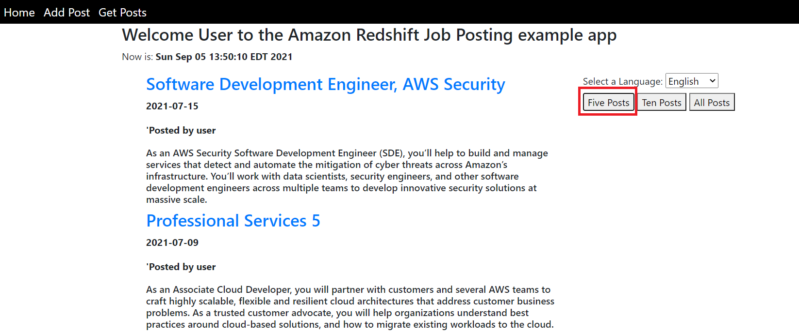
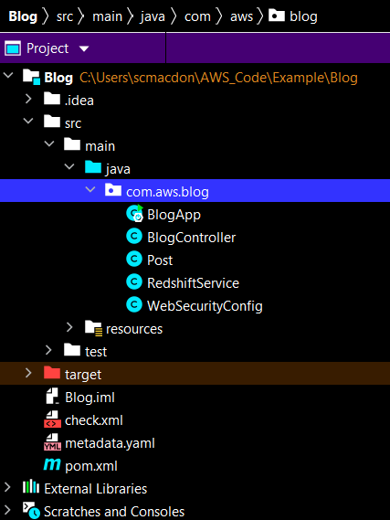
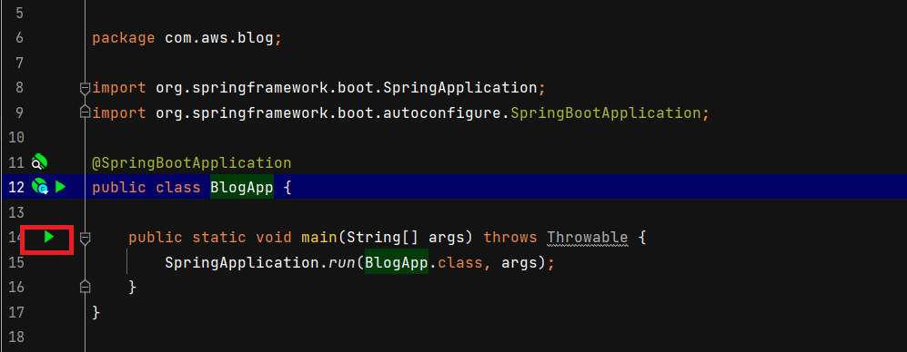

# Creating a Job Posting application using Amazon Redshift and Amazon Translate Services

## Overview

| Heading      | Description |
| ----------- | ----------- |
| Description | Discusses how to develop a dynamic web application that stores and queries data by using the Amazon Redshift service.     |
| Audience   |  Developer (beginner / intermediate)        |
| Updated   | 3/15/2022        |
| Required skills   | Java, Maven  |

## Purpose
You can create a dynamic web application that stores and queries data by using the Amazon Redshift service and the Amazon Redshift Java API V2. To interact with an Amazon Redshift table, use [software.amazon.awssdk.services.redshiftdata.RedshiftDataClient](https://sdk.amazonaws.com/java/api/latest/software/amazon/awssdk/services/redshiftdata/RedshiftDataClient.html). The application created in this AWS tutorial is a job posting web application that lets an employer, an administrator, or human resources staff alert employees or the public about a job opening within a company.

**Note**: Amazon Redshift is a fully managed, petabyte-scale data warehouse service in the cloud. You can start with just a few hundred gigabytes of data and scale to a petabyte or more. This enables you to use your data to acquire new insights for your business and customers. For more information, see [What is Amazon Redshift?](https://docs.aws.amazon.com/redshift/latest/mgmt/welcome.html).

#### Topics

1. Prerequisites
2. Understand the Job Posting application
3. Create an IntelliJ project 
4. Add the POM dependencies to your project
5. Set up the Java packages in your project
6. Create the Java classes
7. Create the HTML files
8. Run the application


## Prerequisites

To complete the tutorial, you need the following:

+ An AWS account
+ A Java IDE (this tutorial uses the IntelliJ IDE)
+ Java JDK 1.8
+ Maven 3.6 or later

### Important

+ The AWS services included in this document are included in the [AWS Free Tier](https://aws.amazon.com/free/?all-free-tier.sort-by=item.additionalFields.SortRank&all-free-tier.sort-order=asc).
+  This code has not been tested in all AWS Regions. Some AWS services are available only in specific regions. For more information, see [AWS Regional Services](https://aws.amazon.com/about-aws/global-infrastructure/regional-product-services). 
+ Running this code might result in charges to your AWS account. 
+ Be sure to terminate all of the resources you create while going through this tutorial to ensure that you’re not charged.

### Creating the resources

Create an Amazon Redshift table named **blog** that contains the fields described in this tutorial. For information about creating an Amazon Redshift table, see [Getting started using databases](https://docs.aws.amazon.com/redshift/latest/dg/c_intro_to_admin.html).

In addition, make sure that you set up your Java developer environment before following along with this tutorial. For more information, see [Get started with the AWS SDK for Java 2.x](https://docs.aws.amazon.com/sdk-for-java/latest/developer-guide/get-started.html). 

## Understand the Job Posting application

The data is stored in a Redshift table named **blog**, as shown in this illustration. 


The **blog** table contains these fields: 

- **idblog**- a varchar field that stores a GUID value and represents the PK.
- **date**- a date field that represents the date when the record was added. 
- **title**- a varchar field that represents the title. 
- **body**- a varchar field that represents the body. 
- **author**-a varchar field that represents the author. 

**Note**: For more information about supported field data types, see [Data types](https://docs.aws.amazon.com/redshift/latest/dg/c_Supported_data_types.html). 

The application you create uses Spring Boot APIs to build a model, different views, and a controller. This web application lets a user submit a new job posting that is then stored in the **blog** table, as shown in this illustration. 


This application lets a user view the posts by choosing the **Get Posts** menu item and choosing one of the available buttons. For example, you can view five recent posts by choosing the **Five Posts** button, as shown in the following illustration.



This application also supports viewing the result set in different languages. For example, if a user wants to view the result set in Spanish, they can choose Spanish from the dropdown field and the data is translated to the given language by using Amazon Translate, as shown in this illustration. 


## Create an IntelliJ project named Blog

Create an IntelliJ project that is used to create the web application.

1. In the IntelliJ IDE, choose **File**, **New**, **Project**.

2. In the New Project dialog box, choose **Maven**.

3. Choose **Next**.

4. In **GroupId**, enter **spring-aws**.

5. In **ArtifactId**, enter **Blog**.

6. Choose **Next**.

7. Choose **Finish**.

## Add the POM dependencies to your project

At this point, you have a new project named **Blog**. Ensure that the pom.xml file resembles the following code.

```xml
     <?xml version="1.0" encoding="UTF-8"?>
     <project xmlns="http://maven.apache.org/POM/4.0.0"
         xmlns:xsi="http://www.w3.org/2001/XMLSchema-instance"
         xsi:schemaLocation="http://maven.apache.org/POM/4.0.0 http://maven.apache.org/xsd/maven-4.0.0.xsd">
     <modelVersion>4.0.0</modelVersion>
    <groupId>aws-spring</groupId>
    <artifactId>Blog</artifactId>
    <version>1.0-SNAPSHOT</version>
    <packaging>jar</packaging>
    <parent>
        <groupId>org.springframework.boot</groupId>
        <artifactId>spring-boot-starter-parent</artifactId>
        <version>2.0.4.RELEASE</version>
        <relativePath /> <!-- lookup parent from repository -->
    </parent>
    <properties>
        <project.build.sourceEncoding>UTF-8</project.build.sourceEncoding>
        <java.version>1.8</java.version>
    </properties>
    <dependencyManagement>
        <dependencies>
            <dependency>
                <groupId>software.amazon.awssdk</groupId>
                <artifactId>bom</artifactId>
                <version>2.15.14</version>
                <type>pom</type>
                <scope>import</scope>
            </dependency>
        </dependencies>
    </dependencyManagement>
    <dependencies>
        <dependency>
            <groupId>software.amazon.awssdk</groupId>
            <artifactId>ses</artifactId>
        </dependency>
         <dependency>
            <groupId>org.assertj</groupId>
            <artifactId>assertj-core</artifactId>
            <version>3.8.0</version>
            <scope>test</scope>
        </dependency>
         <dependency>
            <groupId>org.springframework.boot</groupId>
            <artifactId>spring-boot-starter-thymeleaf</artifactId>
        </dependency>
        <dependency>
            <groupId>software.amazon.awssdk</groupId>
            <artifactId>redshift</artifactId>
        </dependency>
        <dependency>
            <groupId>software.amazon.awssdk</groupId>
            <artifactId>translate</artifactId>
        </dependency>
        <dependency>
            <groupId>software.amazon.awssdk</groupId>
            <artifactId>redshiftdata</artifactId>
        </dependency>
        <dependency>
            <groupId>org.webjars</groupId>
            <artifactId>bootstrap</artifactId>
            <version>3.3.7</version>
        </dependency>
        <dependency>
            <groupId>org.webjars</groupId>
            <artifactId>jquery</artifactId>
            <version>3.2.1</version>
        </dependency>
        <dependency>
            <groupId>mysql</groupId>
            <artifactId>mysql-connector-java</artifactId>
            <scope>runtime</scope>
        </dependency>
        <dependency>
            <groupId>net.sourceforge.jexcelapi</groupId>
            <artifactId>jxl</artifactId>
            <version>2.6.10</version>
        </dependency>
        <dependency>
            <groupId>commons-io</groupId>
            <artifactId>commons-io</artifactId>
            <version>2.6</version>
        </dependency>
        <dependency>
            <groupId>org.springframework.boot</groupId>
            <artifactId>spring-boot-starter-web</artifactId>
        </dependency>
        <dependency>
            <groupId>org.springframework.boot</groupId>
            <artifactId>spring-boot-starter-security</artifactId>
        </dependency>
        <dependency>
            <groupId>org.springframework.security</groupId>
            <artifactId>spring-security-test</artifactId>
            <scope>test</scope>
        </dependency>
        <dependency>
            <groupId>org.springframework.boot</groupId>
            <artifactId>spring-boot-starter-test</artifactId>
            <scope>test</scope>
            <exclusions>
                <exclusion>
                    <groupId>org.junit.vintage</groupId>
                    <artifactId>junit-vintage-engine</artifactId>
                </exclusion>
            </exclusions>
        </dependency>
    </dependencies>
    <build>
        <plugins>
            <plugin>
                <groupId>org.springframework.boot</groupId>
                <artifactId>spring-boot-maven-plugin</artifactId>
            </plugin>
        </plugins>
    </build>
</project>
```

 ## Create the Java classes
 
 Create a Java package in the main/java folder named **com.aws.blog**. The Java classes go into this package. 
 
 
 
 Create these Java classes:

+ **BlogApp** - The base class for the Spring Boot application.
+ **BlogController** - The Spring Boot controller that handles HTTP requests. 
+ **Post** - The application's model that stores data.
+ **RedshiftService** - The Spring Service that uses the Amazon Redshift Java API V2 and Amazon Translate Java API V2. 
+ **WebSecurityConfig** - Sets up an in-memory user store that contains a single user (the user name is **user** and the password is **password**).

### BlogApp class

The following Java code represents the **BlogApp** class.

```java
     package com.aws.blog;

     import org.springframework.boot.SpringApplication;
     import org.springframework.boot.autoconfigure.SpringBootApplication;

     @SpringBootApplication
     public class BlogApp {

     public static void main(String[] args) throws Throwable {
        SpringApplication.run(BlogApp.class, args);
      }
     }
```

### BlogController class

The following Java code represents the **BlogController** class.

```java
     package com.aws.blog;

     import org.springframework.security.core.context.SecurityContextHolder;
     import org.springframework.stereotype.Controller;
     import org.springframework.ui.Model;
     import org.springframework.web.bind.annotation.GetMapping;
     import org.springframework.web.bind.annotation.RequestMapping;
     import org.springframework.web.bind.annotation.ResponseBody;
     import org.springframework.web.bind.annotation.RequestMethod;
     import javax.servlet.http.HttpServletRequest;
     import javax.servlet.http.HttpServletResponse;
     import org.springframework.beans.factory.annotation.Autowired;

    @Controller
    public class BlogController {

    @Autowired
    RedshiftService rs;

    @GetMapping("/")
    public String root() {
        return "index";
    }

    @GetMapping("/add")
    public String add() {
        return "add";
    }


    @GetMapping("/posts")
    public String post() {
        return "post";
    }

    @GetMapping("/login")
    public String login(Model model) {
        return "login";
    }

    // Adds a new item to the database.
    @RequestMapping(value = "/addPost", method = RequestMethod.POST)
    @ResponseBody
    String addItems(HttpServletRequest request, HttpServletResponse response) {

        String name = getLoggedUser();
        String title = request.getParameter("title");
        String body = request.getParameter("body");
        return rs.addRecord(name, title, body);
    }


    // Queries items from the Redshift database.
    @RequestMapping(value = "/getPosts", method = RequestMethod.POST)
    @ResponseBody
    String getFivePosts(HttpServletRequest request, HttpServletResponse response) {

        String num = request.getParameter("number");
        String lang = request.getParameter("lang");
        return rs.getPosts(lang,Integer.parseInt(num)) ;
     }

    private String getLoggedUser() {

        org.springframework.security.core.userdetails.User user2 = (org.springframework.security.core.userdetails.User) SecurityContextHolder.getContext().getAuthentication().getPrincipal();
        return user2.getUsername();
     }
     }
```

### Post class

The following Java code represents the **Post** class.

```java
    package com.aws.blog;

    public class Post {

    private String id;
    private String title;
    private String body;
    private String author;
    private String date ;

    public void setDate(String date) {
        this.date = date;
    }

    public String getDate() {
        return this.date ;
    }


    public void setAuthor(String author) {
        this.author = author;
    }

    public String getAuthor() {
        return this.author ;
    }


    public void setBody(String body) {
        this.body = body;
    }

    public String getBody() {
        return this.body ;
    }

    public void setTitle(String title) {
        this.title = title;
    }

    public String getTitle() {
        return this.title ;
    }

    public void setId(String id) {
        this.id = id;
    }

    public String getId() {
        return this.id ;
     }
    }
```

### RedshiftService class

The following Java code represents the **RedshiftService** class. This class uses the Amazon Redshift Java API (V2) to interact with data located the **blog** table.  For example, the **getPosts** method returns a result set that is queried from the **blog** table and displayed in the view. Likewise, the **addRecord** method adds a new record to the **blog** table. This class also uses the Amazon Translate Java V2 API to translate the result set if requested by the user. 

```java
     package com.aws.blog;

     import org.springframework.stereotype.Component;
     import software.amazon.awssdk.regions.Region;
     import software.amazon.awssdk.services.redshiftdata.model.*;
     import software.amazon.awssdk.services.redshiftdata.RedshiftDataClient;
     import org.w3c.dom.Document;
     import org.w3c.dom.Element;
     import software.amazon.awssdk.services.translate.TranslateClient;
     import software.amazon.awssdk.services.translate.model.TranslateException;
     import software.amazon.awssdk.services.translate.model.TranslateTextRequest;
     import software.amazon.awssdk.services.translate.model.TranslateTextResponse;
     import javax.xml.parsers.DocumentBuilder;
     import javax.xml.parsers.DocumentBuilderFactory;
     import javax.xml.parsers.ParserConfigurationException;
     import javax.xml.transform.Transformer;
     import javax.xml.transform.TransformerException;
     import javax.xml.transform.TransformerFactory;
     import javax.xml.transform.dom.DOMSource;
     import javax.xml.transform.stream.StreamResult;
     import java.io.StringWriter;
     import java.text.ParseException;
     import java.text.SimpleDateFormat;
     import java.time.LocalDateTime;
     import java.time.format.DateTimeFormatter;
     import java.util.ArrayList;  
     import java.util.Date;
     import java.util.List;
     import java.util.UUID;

    @Component
    public class RedshiftService {

    String clusterId = "<Enter your Cluster ID>";
    String database = "<Enter your database name>";
    String dbUser = "<Enter your dbUser value>";

    private RedshiftDataClient getClient() {

        Region region = Region.US_WEST_2;
        RedshiftDataClient redshiftDataClient = RedshiftDataClient.builder()
                .credentialsProvider(EnvironmentVariableCredentialsProvider.create())
                .region(region)
                .build();

        return redshiftDataClient;
    }

    // Returns a collection from the Redshift table.
    public String getPosts(String lang, int num) {

        try {

            RedshiftDataClient redshiftDataClient = getClient();
            String sqlStatement="";
            if (num ==5)
                sqlStatement = "SELECT TOP 5 * FROM blog ORDER BY date DESC";
            else if (num ==10)
                sqlStatement = "SELECT TOP 10 * FROM blog ORDER BY date DESC";
            else
                sqlStatement = "SELECT * FROM blog ORDER BY date DESC" ;

            ExecuteStatementRequest statementRequest = ExecuteStatementRequest.builder()
                    .clusterIdentifier(clusterId)
                    .database(database)
                    .dbUser(dbUser)
                    .sql(sqlStatement)
                    .build();

            ExecuteStatementResponse response = redshiftDataClient.executeStatement(statementRequest);
            String myId = response.id();
            checkStatement(redshiftDataClient,myId );
            List<Post> posts = getResults(redshiftDataClient, myId, lang);
            return convertToString(toXml(posts));

        } catch (RedshiftDataException e) {
            System.err.println(e.getMessage());
            System.exit(1);
        }
        return "";
    }

    // Add a new record to the Amazon Redshift table.
    public String addRecord(String author, String title, String body) {

        try {

            RedshiftDataClient redshiftDataClient = getClient();
            UUID uuid = UUID.randomUUID();
            String id = uuid.toString();

            // Date conversion.
            DateTimeFormatter dtf = DateTimeFormatter.ofPattern("yyyy/MM/dd HH:mm:ss");
            LocalDateTime now = LocalDateTime.now();
            String sDate1 = dtf.format(now);
            Date date1 = new SimpleDateFormat("yyyy/MM/dd").parse(sDate1);
            java.sql.Date sqlDate = new java.sql.Date( date1.getTime());


            // Inject an item into the system.
            String sqlStatement = "INSERT INTO blog (idblog, date, title, body, author) VALUES( '"+uuid+"' ,'"+sqlDate +"','"+title +"' , '"+body +"', '"+author +"');";
            ExecuteStatementRequest statementRequest = ExecuteStatementRequest.builder()
                    .clusterIdentifier(clusterId)
                    .database(database)
                    .dbUser(dbUser)
                    .sql(sqlStatement)
                    .build();

            redshiftDataClient.executeStatement(statementRequest);
            return id;

        } catch (RedshiftDataException | ParseException e) {
            System.err.println(e.getMessage());
            System.exit(1);
        }
        return null;
    }

    public void checkStatement(RedshiftDataClient redshiftDataClient,String sqlId ) {

        try {

            DescribeStatementRequest statementRequest = DescribeStatementRequest.builder()
                    .id(sqlId)
                    .build() ;

            // Wait until the sql statement processing is finished.
            boolean finished = false;
            String status = "";
            while (!finished) {

                DescribeStatementResponse response = redshiftDataClient.describeStatement(statementRequest);
                status = response.statusAsString();
                System.out.println("..."+status);

                if (status.compareTo("FINISHED") == 0) {
                    break;
                }
                Thread.sleep(500);
            }

            System.out.println("The statement is finished!");

        } catch (RedshiftDataException | InterruptedException e) {
            System.err.println(e.getMessage());
            System.exit(1);
        }
    }

    public List<Post> getResults(RedshiftDataClient redshiftDataClient, String statementId, String lang) {

        try {

            List<Post>records = new ArrayList<>();
            GetStatementResultRequest resultRequest = GetStatementResultRequest.builder()
                    .id(statementId)
                    .build();

            GetStatementResultResponse response = redshiftDataClient.getStatementResult(resultRequest);

            // Iterate through the List element where each element is a List object.
            List<List<Field>> dataList = response.records();

            Post post ;
            int index = 0 ;
            // Print out the records.
            for (List list: dataList) {

                // new Post object here
                post = new Post();
                index = 0 ;
                for (Object myField:list) {

                    Field field = (Field) myField;
                    String value = field.stringValue();

                    if (index == 0)
                        post.setId(value);

                    else if (index == 1)
                        post.setDate(value);

                    else if (index == 2) {

                        if (!lang.equals("English"))
                            value = translateText(value, lang);

                        post.setTitle(value);
                    }

                    else if (index == 3) {
                        if (!lang.equals("English"))
                             value = translateText(value, lang);

                        post.setBody(value);
                    }

                    else if (index == 4)
                        post.setAuthor(value);

                    // Increment the index.
                    index ++;
               }

                // Push the Post object to the List.
                records.add(post);
            }

            return records;

        } catch (RedshiftDataException e) {
            System.err.println(e.getMessage());
            System.exit(1);
        }

        return null ;
    }

    // Convert the list to XML to pass back to the view.
    private Document toXml(List<Post> itemsList) {

        try {
            DocumentBuilderFactory factory = DocumentBuilderFactory.newInstance();
            DocumentBuilder builder = factory.newDocumentBuilder();
            Document doc = builder.newDocument();

            // Start building the XML.
            Element root = doc.createElement("Items");
            doc.appendChild(root);

            // Iterate through the collection.
            for (Post post : itemsList) {

                    Element item = doc.createElement("Item");
                    root.appendChild(item);

                    // Set Id.
                    Element id = doc.createElement("Id");
                    id.appendChild(doc.createTextNode(post.getId()));
                    item.appendChild(id);

                    // Set Date.
                    Element name = doc.createElement("Date");
                    name.appendChild(doc.createTextNode(post.getDate()));
                    item.appendChild(name);

                    // Set Title.
                    Element date = doc.createElement("Title");
                    date.appendChild(doc.createTextNode(post.getTitle()));
                    item.appendChild(date);

                    // Set Content.
                    Element desc = doc.createElement("Content");
                    desc.appendChild(doc.createTextNode(post.getBody()));
                    item.appendChild(desc);

                    // Set Author.
                    Element guide = doc.createElement("Author");
                    guide.appendChild(doc.createTextNode(post.getAuthor()));
                    item.appendChild(guide);
             }

            return doc;

        }catch(ParserConfigurationException e){
            e.printStackTrace();
        }
        return null;
    }

    private String convertToString(Document xml) {
        try {
            Transformer transformer = TransformerFactory.newInstance().newTransformer();
            StreamResult result = new StreamResult(new StringWriter());
            DOMSource source = new DOMSource(xml);
            transformer.transform(source, result);
            return result.getWriter().toString();

        } catch(TransformerException ex) {
            ex.printStackTrace();
        }
        return null;
    }

    private String translateText(String text, String lang) {

        Region region = Region.US_WEST_2;
        TranslateClient translateClient = TranslateClient.builder()
                .credentialsProvider(EnvironmentVariableCredentialsProvider.create())
                .region(region)
                .build();
        String transValue = "";
        try {

            if (lang.compareTo("French")==0) {

                TranslateTextRequest textRequest = TranslateTextRequest.builder()
                        .sourceLanguageCode("en")
                        .targetLanguageCode("fr")
                        .text(text)
                        .build();

                TranslateTextResponse textResponse = translateClient.translateText(textRequest);
                transValue = textResponse.translatedText();

            } else if (lang.compareTo("Russian")==0) {

                TranslateTextRequest textRequest = TranslateTextRequest.builder()
                        .sourceLanguageCode("en")
                        .targetLanguageCode("ru")
                        .text(text)
                        .build();

                TranslateTextResponse textResponse = translateClient.translateText(textRequest);
                transValue = textResponse.translatedText();


            } else if (lang.compareTo("Japanese")==0) {

                TranslateTextRequest textRequest = TranslateTextRequest.builder()
                        .sourceLanguageCode("en")
                        .targetLanguageCode("ja")
                        .text(text)
                        .build();

                TranslateTextResponse textResponse = translateClient.translateText(textRequest);
                transValue = textResponse.translatedText();


            } else if (lang.compareTo("Spanish")==0) {

                TranslateTextRequest textRequest = TranslateTextRequest.builder()
                        .sourceLanguageCode("en")
                        .targetLanguageCode("es")
                        .text(text)
                        .build();

                TranslateTextResponse textResponse = translateClient.translateText(textRequest);
                transValue = textResponse.translatedText();

            } else {

                TranslateTextRequest textRequest = TranslateTextRequest.builder()
                        .sourceLanguageCode("en")
                        .targetLanguageCode("zh")
                        .text(text)
                        .build();

                TranslateTextResponse textResponse = translateClient.translateText(textRequest);
                transValue = textResponse.translatedText();
            }

        return transValue;

        } catch (TranslateException e) {
            System.err.println(e.getMessage());
            System.exit(1);
        }

        return "";
       }
      }
```

**Note**: Be sure to assign applicable values to the **clusterId**, **database**, and **dbUser** variables. Otherwise, your code does not work.

### WebSecurityConfig class

The following Java code represents the **WebSecurityConfig** class. The role of this class is to ensure only authenticated users can view the application.
```java

     package com.aws.blog;

     import org.springframework.context.annotation.Bean;
     import org.springframework.context.annotation.Configuration;
     import org.springframework.security.config.annotation.authentication.builders.AuthenticationManagerBuilder;
     import org.springframework.security.config.annotation.web.builders.HttpSecurity;
     import org.springframework.security.config.annotation.web.configuration.EnableWebSecurity;
     import org.springframework.security.config.annotation.web.configuration.WebSecurityConfigurerAdapter;
     import org.springframework.security.crypto.bcrypt.BCryptPasswordEncoder;
     import org.springframework.security.crypto.password.PasswordEncoder;
     import org.springframework.security.web.util.matcher.AntPathRequestMatcher;

     @Configuration
     @EnableWebSecurity
     public class WebSecurityConfig extends WebSecurityConfigurerAdapter {
    
    @Override
    protected void configure(HttpSecurity http) throws Exception {
        http
                .authorizeRequests()
                .antMatchers(
                        "/js/**",
                        "/css/**",
                        "/img/**",
                        "/webjars/**").permitAll()
                .anyRequest().authenticated()
                .and()
                .formLogin()
                .loginPage("/login")
                .permitAll()
                .and()
                .logout()
                .invalidateHttpSession(true)
                .clearAuthentication(true)
                .logoutRequestMatcher(new AntPathRequestMatcher("/logout"))
                .logoutSuccessUrl("/login?logout")
                .permitAll();

          http.csrf().disable();
         }


       @Override
       protected void configure(AuthenticationManagerBuilder auth) throws Exception {
        auth.inMemoryAuthentication()
                .passwordEncoder(passwordEncoder())
                .withUser("user")
                .password(passwordEncoder().encode("password"))
                .roles("USER");
       }

      @Bean
      public PasswordEncoder passwordEncoder() {
        return new BCryptPasswordEncoder();
      }
     }
```

**Note**: In this example, the user credentials to log into the application are **user** and **password**.    

## Create the HTML file

At this point, you have created all of the Java files required for this example application. Now create HTML files that are required for the application's view. Under the resource folder, create a **templates** folder, and then create the following HTML files:

+ index.html
+ layout.html
+ post.html
+ add.html
+ login.html

### index.html

The **index.html** file is the application's home view. 

```html
    <!DOCTYPE html>
    <html xmlns:th="http://www.thymeleaf.org" xmlns:sec="http://www.thymeleaf.org/thymeleaf-extras-springsecurity3">

    <head>
     <meta charset="utf-8" />
     <meta name="viewport" content="width=device-width, initial-scale=1" />
     <script th:src="|https://code.jquery.com/jquery-1.12.4.min.js|"></script>
     <script th:src="|https://cdnjs.cloudflare.com/ajax/libs/popper.js/1.12.9/umd/popper.min.js|"></script>
     <script th:src="|https://maxcdn.bootstrapcdn.com/bootstrap/4.0.0/js/bootstrap.min.js|"></script>
     <link rel="stylesheet" th:href="|https://maxcdn.bootstrapcdn.com/bootstrap/4.5.2/css/bootstrap.min.css|"/>
     <link rel="stylesheet" href="../public/css/styles.css" th:href="@{/css/styles.css}" />
     <title>AWS Job Posting Example</title>
    </head>

    <body>
     <header th:replace="layout :: site-header"/>
     <div class="container">

     <h3>Welcome <span sec:authentication="principal.username">User</span> to the Amazon Redshift Job Posting example app</h3>
     <p>Now is: <b th:text="${execInfo.now.time}"></b></p>
     <p>The Amazon Redshift Job Posting Example application uses multiple AWS Services and the Java V2 API. Perform these steps:<p>
     <ol>
        <li>Enter work items into the system by choosing the <i>Add Posts</i> menu item. Fill in the form and then choose <i>Create Item</i>.</li>
        <li>The sample application stores the data by using the Amazon Redshift Java API V2.</li>
        <li>You can view the items by choosing the <i>Get Posts</i> menu item. Next, select a language.</li>
        <li>You can view the items by chooing either the <b>Five Posts</b>, <b>Ten Posts</b>, or <b>All Posts</b> button. </li>
        <li>The items appear in the page from newest to oldest.</li>
     </ol>
     <div>
     </body>
    </html>
```  
	   
### layout.html

The following code represents the **layout.html** file that represents the application's menu.

```html
     <!DOCTYPE html>
     <html xmlns:th="http://www.thymeleaf.org">
     <head th:fragment="site-head">
     <meta charset="UTF-8" />
     <link rel="icon" href="../public/img/favicon.ico" th:href="@{/img/favicon.ico}" />
     <script th:src="|https://code.jquery.com/jquery-1.12.4.min.js|"></script>
     <meta th:include="this :: head" th:remove="tag"/>
    </head>
    <body>
    <!-- th:hef calls a controller method - which returns the view -->
    <header th:fragment="site-header">
     <a href="#" style="color: white" th:href="@{/}">Home</a>
     <a href="#" style="color: white" th:href="@{/add}">Add Post</a>
     <a href="#"  style="color: white" th:href="@{/posts}">Get Posts</a>
     <div id="logged-in-info">
        <form method="post" th:action="@{/logout}">
            <input type="submit"  value="Logout"/>
        </form>
    </div>
   </header>
  </html>
```	     

### add.html

The **add.html** file is the application's view that lets users post new items. 

```html	     
    <!DOCTYPE html>
     <html xmlns:th="http://www.thymeleaf.org" xmlns:sec="http://www.thymeleaf.org/thymeleaf-extras-springsecurity3">

     <head>
     <meta charset="UTF-8" />
     <title>Blog</title>
     <script th:src="|https://code.jquery.com/jquery-1.12.4.min.js|"></script>
     <script th:src="|https://cdnjs.cloudflare.com/ajax/libs/popper.js/1.12.9/umd/popper.min.js|"></script>
     <script th:src="|https://maxcdn.bootstrapcdn.com/bootstrap/4.0.0/js/bootstrap.min.js|"></script>
     <link rel="stylesheet" th:href="|https://maxcdn.bootstrapcdn.com/bootstrap/4.5.2/css/bootstrap.min.css|"/>
     <script src="../public/js/contact_me.js" th:src="@{/js/contact_me.js}"></script>
     <link rel="stylesheet" href="../public/css/styles.css" th:href="@{/css/styles.css}" />
     <link rel="icon" href="../public/img/favicon.ico" th:href="@{/img/favicon.ico}" />
    </head>

    <body>
    <header th:replace="layout :: site-header"/>
    <div class="container">
    <h3>Welcome <span sec:authentication="principal.username">User</span> to the Amazon Redshift Job Posting example app</h3>
    <p>Now is: <b th:text="${execInfo.now.time}"></b></p>
    <p>Add a new job posting by filling in this table and clicking <i>Create Item</i></p>


                <div class="control-group">
                    <div class="form-group floating-label-form-group controls mb-0 pb-2">
                        <label>Title</label>
                        <input class="form-control" id="title" placeholder="Title" required="required" data-validation-required-message="Please enter the AWS Guide.">
                        <p class="help-block text-danger"></p>
                    </div>
                </div>
                <div class="control-group">
                    <div class="form-group floating-label-form-group controls mb-0 pb-2">
                        <label>Body</label>
                        <textarea class="form-control" id="body" rows="5" placeholder="Body" required="required" data-validation-required-message="Please enter a description."></textarea>
                        <p class="help-block text-danger"></p>
                    </div>
                </div>
                <br>
                <button type="submit" class="btn btn-primary btn-xl" id="SendButton">Create Item</button>
            </div>
      </body>
     </html>
```

### post.html
The **post.html** file is the application's view that displays the job items in the specific language. 

```html
   <!DOCTYPE html>
    <html xmlns:th="http://www.thymeleaf.org" xmlns:sec="http://www.thymeleaf.org/thymeleaf-extras-springsecurity3">
     <head>
     <meta charset="UTF-8" />
     <title>Blog</title>
     <script th:src="|https://code.jquery.com/jquery-1.12.4.min.js|"></script>
     <script th:src="|https://cdnjs.cloudflare.com/ajax/libs/popper.js/1.12.9/umd/popper.min.js|"></script>
     <script th:src="|https://maxcdn.bootstrapcdn.com/bootstrap/4.0.0/js/bootstrap.min.js|"></script>
     <link rel="stylesheet" th:href="|https://maxcdn.bootstrapcdn.com/bootstrap/4.5.2/css/bootstrap.min.css|"/>
     <script src="../public/js/contact_me.js" th:src="@{/js/contact_me.js}"></script>
     <link rel="stylesheet" href="../public/css/styles.css" th:href="@{/css/styles.css}" />
    </head>
    <body>
    <header th:replace="layout :: site-header"/>
    <div class="container">
     <h3>Welcome <span sec:authentication="principal.username">User</span> to the Amazon Redshift Job Posting example app</h3>
     <p>Now is: <b th:text="${execInfo.now.time}"></b></p>
     <div  id ="progress"  class="progress">
        <div class="progress-bar progress-bar-striped progress-bar-animated" style="width:90%">
            Retrieving Amazon Redshift Data...
        </div>
     </div>
     <div class="row">
        <div class="col-8">
            <div class="clearfix mt-40">
                <ul class="xsearch-items">
                </ul>
            </div>
        </div>
        <div class="col-4">
            <label for="lang">Select a Language:</label>
            <select name="lang" id="lang">
                <option>English</option>
                <option>French</option>
                <option>Spanish</option>
                <option>Russian</option>
                <option>Chinese</option>
                <option>Japanese</option>
            </select>
           <div>
                <button type="button" onclick="getPosts(5)">Five Posts</button>
                <button type="button" onclick="getPosts(10)">Ten Posts</button>
                <button type="button" onclick="getPosts(0)">All Posts</button>
            </div>
         </div>
       </div>
      </body>
     </html>
```

### login.html
The **login.html** file is the application's login page. 

```html
     <!DOCTYPE html>
     <html xmlns="http://www.w3.org/1999/xhtml" xmlns:th="https://www.thymeleaf.org">

    <head>
     <title>AWS Blog Example</title>
     <style>
        body {font-family: Arial, Helvetica, sans-serif;}
        form {border: 3px solid #f1f1f1;}

        input[type=text], input[type=password] {
            width: 100%;
            padding: 12px 20px;
            margin: 8px 0;
            display: inline-block;
            border: 1px solid #ccc;
            box-sizing: border-box;
        }

        button {
            background-color: #4CAF50;
            color: white;
            padding: 14px 20px;
            margin: 8px 0;
            border: none;
            cursor: pointer;
            width: 100%;
        }

        button:hover {
            opacity: 0.8;
        }

        .cancelbtn {
            width: auto;
            padding: 10px 18px;
            background-color: #f44336;
        }

        .imgcontainer {
            text-align: center;
            margin: 24px 0 12px 0;
        }

        img.avatar {
            width: 40%;
            border-radius: 50%;
        }

        .container {
            padding: 16px;
        }

        span.psw {
            float: right;
            padding-top: 16px;
        }

        /* Change styles for span and cancel button on extra small screens */
        @media screen and (max-width: 300px) {
            span.psw {
                display: block;
                float: none;
            }
            .cancelbtn {
                width: 100%;
            }
        }
    </style>
    </head>
    <body>
    <div th:if="${param.error}">
     Invalid username and password.
    </div>
    <div th:if="${param.logout}">
     You have been logged out.
    </div>
    <form th:action="@{/login}" method="post">
     <div class="container">
        <label for="username"><b>Username</b></label>
        <input type="text" placeholder="Enter Username" id="username" name="username" value ="user" required>

        <label for="password"><b>Password</b></label>
        <input type="password" placeholder="Enter Password" id ="password" name="password" value ="password" required>

        <button type="submit">Login</button>

     </div>

     <div class="container" style="background-color:#f1f1f1">
        <button type="button" class="cancelbtn">Cancel</button>
        <span class="psw">Forgot <a href="#">password?</a></span>
      </div>
    </form>
    </body>
    </html>
```

### Create the JS File

This application has a **contact_me.js** file that is used to send requests to the Spring Controller. Place this file in the **resources\public\js** folder. 

```javascript	
      $(function() {

       $('#progress').hide();
       $("#SendButton" ).click(function($e) {

         var title = $('#title').val();
         var body = $('#body').val();

        $.ajax('/addPost', {
            type: 'POST',  // http method
            data: 'title=' + title + '&body=' + body ,  // data to submit
            success: function (data, status, xhr) {

                alert("You have successfully added an item")

                $('#title').val("");
                $('#body').val("");

            }
        });

      } );// END of the Send button click
     } );

     function getPosts(num){

     $('.xsearch-items').empty()
     $('#progress').show();
     var lang = $('#lang option:selected').text();

     $.ajax('/getPosts', {
        type: 'POST',  // http method
        data: 'lang=' + lang+"&number=" + num ,  // data to submit
        success: function (data, status, xhr) {

            var xml = data;
            $('#progress').hide();
            $(xml).find('Item').each(function () {

                var $field = $(this);
                var id = $field.find('Id').text();
                var date = $field.find('Date').text();
                var title = $field.find('Title').text();
                var body = $field.find('Content').text();
                var author = $field.find('Author').text();

                // Append this data to the main list.
                $('.xsearch-items').append("<className='search-item'>");
                $('.xsearch-items').append("<div class='search-item-content'>");
                $('.xsearch-items').append("<h3 class='search-item-caption'><a href='#'>" + title + "</a></h3>");
                $('.xsearch-items').append("<className='search-item-meta mb-15'>");
                $('.xsearch-items').append("<className='list-inline'>");
                $('.xsearch-items').append("<p><b>" + date + "</b></p>");
                $('.xsearch-items').append("<p><b>'Posted by " + author + "</b></p>");
                $('.xsearch-items').append("<div>");
                $('.xsearch-items').append("<h6>" + body + "</h6>");
                $('.xsearch-items').append("</div>");
            });
         }
        });
      }
```
	
## Run the application

Using the IntelliJ IDE, you can run your application. The first time you run the Spring Boot application, click the run icon in the Spring Boot main class, as shown in this illustration. 



**Note**: You can deploy this Spring Boot application by using AWS Elastic Beanstalk. For information about deploying a web application, see [Creating your first AWS Java web application](https://github.com/awsdocs/aws-doc-sdk-examples/tree/main/javav2/usecases/creating_first_project).

### Next steps
Congratulations! You have created a Spring Boot application that uses the Amazon Redshift data client to create an example job posting application. As stated earlier, be sure to delete all of the resources that you created during this tutorial so that you won't continue to be charged.

For more AWS cross service examples, see
[usecases](https://github.com/awsdocs/aws-doc-sdk-examples/tree/master/javav2/usecases).
