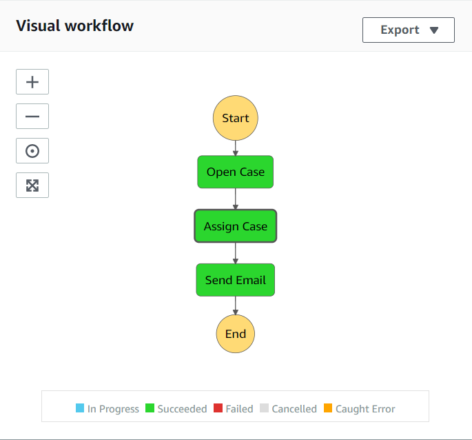
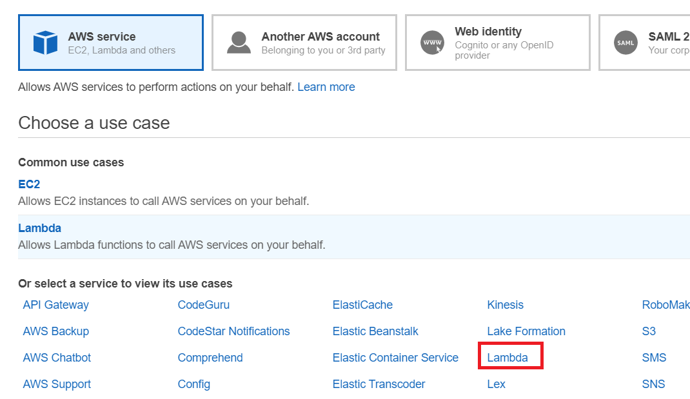
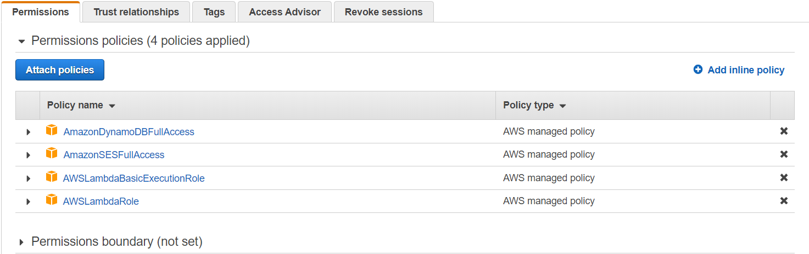

#  Create AWS Serverless workflows using the Java SDK

You can create an AWS Serverless workflow by using the AWS Java SDK and AWS Step Functions. 
Each workflow step is implemented by using a Lambda function. AWS Lambda is a compute service that lets you run 
code without provisioning or managing servers.

**Note**: You can create Lambda functions in various programming languages. For this tutorial, Lambda functions are 
implemented by using the Lambda Java API. For more information about Lambda, see 
[What is AWS Lambda](https://docs.aws.amazon.com/lambda/latest/dg/welcome.html).

In this tutorial, you create a workflow that creates support tickets for an organization. Each workflow step performs an operation on the ticket. This tutorial teaches you how process workflow data by using Java. For example, you will learn how to read data that is passed to the workflow, how to pass data between steps, and how to invoke AWS Services from a workflow. 

#### Prerequisites
To follow along with the tutorial, you need the following:
+ An AWS Account.
+ A Java IDE (for this tutorial, the IntelliJ IDE is used).
+ Java 1.8 JDK. 
+ Maven 3.6 or higher.

**Cost to complete**: The AWS Services included in this document are included in the [AWS Free Tier](https://aws.amazon.com/free/?all-free-tier.sort-by=item.additionalFields.SortRank&all-free-tier.sort-order=asc). 

**Note**: Be sure to terminate all of the resources you create while going through this tutorial to ensure that you’re no longer charged.

#### Topics

+ Understand the workflow.
+ Create an IAM role that is used to execute Lambda functions.
+	Create a workflow by using AWS Step functions.
+	Create an IntelliJ project named LambdaFunctions.
+	Add the POM dependencies to your project.
+	Create Lambda functions by using the Java Lambda API.
+	Package the project that contains Lambda functions. 
+	Deploy Lambda functions.
+	Add Lambda functions to workflows.
+ Invoke the workflow from the AWS Console.

**Note**: Before following this tutorial, create an Amazon DynamoDB table named Cases with a key named Id. To learn how to create a DynamoDB table, see [Create a Table](https://docs.aws.amazon.com/amazondynamodb/latest/developerguide/getting-started-step-1.html).

## Understand the workflow

The following figure shows the workflow that is created by following this tutorial. 

The following describes each step: 
+	**Open Case** – Handles a support ticket Id value (the id value is passed to the workflow). 
+	**Assign Case** – Assigns the support case to an employee and stores the data in a DynamoDB table. 
+	**Send Email** – Sends the employee an email message by using the Amazon Simple Email Service (SES) to inform them there is a new ticket. 

## Create an IAM role that is used to execute Lambda functions

Create two IAM roles:
+ **lambda-support** - Used to invoke Lamdba functions.
+ **workflow-support** - Used to AWS Step functions to invoke workflow.

The AWS Services used in this tutorial are Amazon DynamoDB and Amazon SES. The lambda-support role has to have policies that enables it to invoke these services. This is how you can invoke AWS Services from a Lambda function. 

#### Create an IAM role

1. Open the AWS Management Console. When the screen loads, type **IAM** in the search bar, then select **IAM** to open the service console.
2.  Choose **Roles** from the left column, and then choose **Create Role**. 
3.	Choose **AWS Service** and choose **Lambda**.

4.	Choose **Permissions**. 
5.	Search for **AWSLambdaBasicExecutionRole**.
6.	Choose **Next Tags**.
7.	Choose **Review**. 
8.	Name the role **lambda-support**.

9.	Choose **Create role**. 
10.	Click on **lambda-support** to view the overview page. 
11.	Choose **Attach Policies**.
12.	Search for **AmazonDynamoDBFullAccess** and choose **Attach policy**.
13.	Search for **AmazonSESFullAccess** and choose **Attach policy**. Once done, you will see the permissions. 

**Note**: Repeat this process to create **workflow-support**. For step three, instead of choosing **Lambda**, choose **Step Functions**. It’s not necessary to perform steps 11-13. 

## Create a serverless workflow by using AWS Step functions

