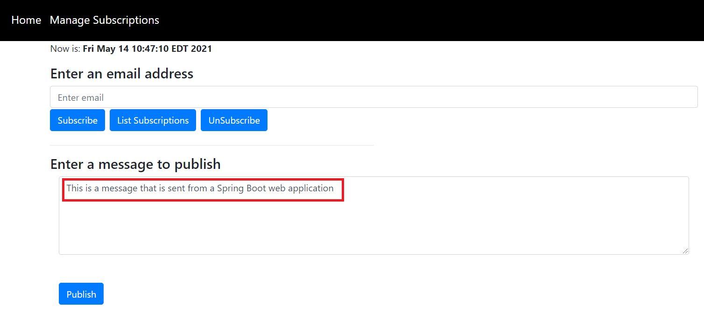
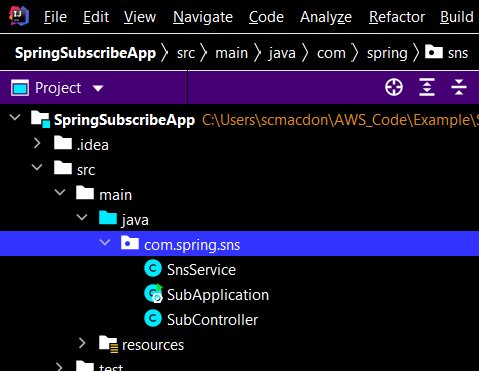
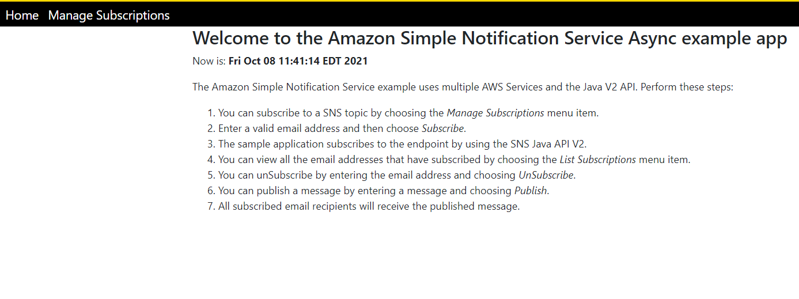

# Creating an asynchronous publish/subscription web application that translates messages using the AWS SDK for Java

## Purpose

You can create a web application that has subscription and publish functionality by using the Amazon Simple Notification Service (Amazon SNS). The application created in this AWS tutorial is a Spring Boot web application that lets a user subscribe to an Amazon SNS topic by entering a valid email address. A user can enter many emails and all of them are subscribed to the given SNS topic (once the email recipients confirm the subscription). The user can publish a message that results in all subscribed emails receiving the message. 

**Note**: Amazon SNS is a managed service that provides message delivery from publishers to subscribers (also known as producers and consumers). For more information, see [What is Amazon SNS?](https://docs.aws.amazon.com/sns/latest/dg/welcome.html)

**Note**: This example application uses the Asynchronous client that belongs to the AWS SDK for Java V2 for the Amazon SNS and Amazon Translate services. For more information, see [Asynchronous programming in the AWS SDK for Java 2.x](https://docs.aws.amazon.com/sdk-for-java/latest/developer-guide/asynchronous.html).


#### Topics

+ Prerequisites
+ Understand the Publish/Subscription application
+ Create an IntelliJ project 
+ Add the POM dependencies to your project
+ Create the Java classes
+ Create the HTML files
+ Package the application into a JAR file
+ Deploy the application to Elastic Beanstalk

## Prerequisites

To complete the tutorial, you need the following:

+ An AWS account
+ A Java IDE (this tutorial uses the IntelliJ IDE)
+ Java JDK 1.8
+ Maven 3.6 or later

## Important

+ The AWS services included in this document are included in the [AWS Free Tier](https://aws.amazon.com/free/?all-free-tier.sort-by=item.additionalFields.SortRank&all-free-tier.sort-order=asc).
+  This code has not been tested in all AWS Regions. Some AWS services are available only in specific regions. For more information, see [AWS Regional Services](https://aws.amazon.com/about-aws/global-infrastructure/regional-product-services). 
+ Running this code might result in charges to your AWS account. 
+ Be sure to terminate all of the resources you create while going through this tutorial to ensure that you’re not charged.

### Creating the resources

Create an Amazon SNS queue that is used in the Java code. For information, see [Creating an Amazon SNS topic](https://docs.aws.amazon.com/sns/latest/dg/sns-create-topic.html). 

## Understand the Publish/Subscription application

To subscribe to an Amazon SNS topic, the user enters a valid email address into the web application. 


The specified email address recieves an email message that lets the recipient confirm the subscription. 


Once the email recipient accepts the confirmation, that email is subscribed to the specific SNS topic and recieves published messages. To publish a message, a user enters the message into the web applicaiton and then chooses the **Publish** button. 



This application lets a user specify the language of the message that is sent. For example, the user can select **French** from the dropdown field and then the message appears in that language to all subscribed users. 


**Note**: The Amazon Translate Service is used to translate the body of the message. The code is shown later in this document. 

This example application lets you view all of the subscribed email recipients by choosing the **List Subscriptions** button, as shown in the following illustration.


## Create an IntelliJ project

Create an IntelliJ project that is used to create the web application.

1. In the IntelliJ IDE, choose **File**, **New**, **Project**.

2. In the New Project dialog box, choose **Maven**.

3. Choose **Next**.

4. In **GroupId**, enter **spring-aws**.

5. In **ArtifactId**, enter **SpringSubscribeApp**.

6. Choose **Next**.

7. Choose **Finish**.

## Add the POM dependencies to your project

At this point, you have a new project named **SpringSubscribeApp**. Ensure that the pom.xml file resembles the following code.

```xml
     <?xml version="1.0" encoding="UTF-8"?>
     <project xmlns="http://maven.apache.org/POM/4.0.0"
         xmlns:xsi="http://www.w3.org/2001/XMLSchema-instance"
         xsi:schemaLocation="http://maven.apache.org/POM/4.0.0 http://maven.apache.org/xsd/maven-4.0.0.xsd">
    <modelVersion>4.0.0</modelVersion>
    <groupId>org.example</groupId>
    <artifactId>SpringSubscribeApp</artifactId>
    <version>1.0-SNAPSHOT</version>
    <description>Demo project for Spring Boot that shows Pub/Sub functionality</description>
    <parent>
        <groupId>org.springframework.boot</groupId>
        <artifactId>spring-boot-starter-parent</artifactId>
        <version>2.2.5.RELEASE</version>
        <relativePath/> <!-- lookup parent from repository -->
    </parent>
    <properties>
        <java.version>1.8</java.version>
    </properties>
    <dependencyManagement>
        <dependencies>
            <dependency>
                <groupId>software.amazon.awssdk</groupId>
                <artifactId>bom</artifactId>
                <version>2.16.29</version>
                <type>pom</type>
                <scope>import</scope>
            </dependency>
        </dependencies>
    </dependencyManagement>
    <dependencies>
        <dependency>
            <groupId>org.springframework.boot</groupId>
            <artifactId>spring-boot-starter-thymeleaf</artifactId>
        </dependency>
        <dependency>
            <groupId>org.springframework.boot</groupId>
            <artifactId>spring-boot-starter-web</artifactId>
        </dependency>
        <dependency>
            <groupId>org.springframework.boot</groupId>
            <artifactId>spring-boot-starter-test</artifactId>
            <scope>test</scope>
            <exclusions>
                <exclusion>
                    <groupId>org.junit.vintage</groupId>
                    <artifactId>junit-vintage-engine</artifactId>
                </exclusion>
            </exclusions>
        </dependency>
        <dependency>
            <groupId>software.amazon.awssdk</groupId>
            <artifactId>sns</artifactId>
        </dependency>
        <dependency>
            <groupId>software.amazon.awssdk</groupId>
            <artifactId>translate</artifactId>
        </dependency>
     </dependencies>
     <build>
        <plugins>
            <plugin>
                <groupId>org.springframework.boot</groupId>
                <artifactId>spring-boot-maven-plugin</artifactId>
                <version>${project.parent.version}</version>
            </plugin>
        </plugins>
      </build>
    </project>
```  

 ## Create the Java classes
 
 Create a Java package in the main/java folder named **com.spring.sns**. The Java classes go into this package. 
 
 
 
 Create these Java classes:

+ **SubApplication** - Used as the base class for the Spring Boot application.
+ **SubController** - Used as the Spring Boot controller that handles HTTP requests. 
+ **SnsService** - Used to invoke Amazon SNS operations by using the Amazon SNS **SnsAsyncClient**.  

### SubApplication class

The following Java code represents the **SubApplication** class.

```java
     package com.spring.sns;

     import org.springframework.boot.SpringApplication;
     import org.springframework.boot.autoconfigure.SpringBootApplication;

     @SpringBootApplication
     public class SubApplication {

     public static void main(String[] args) {
        SpringApplication.run(SubApplication.class, args);
     }
    }
```

### SubController class

The following Java code represents the **SubController** class.

```java
     package com.spring.sns;

     import org.springframework.beans.factory.annotation.Autowired;
     import org.springframework.stereotype.Controller;
     import org.springframework.web.bind.annotation.*;
     import javax.servlet.http.HttpServletRequest;
     import javax.servlet.http.HttpServletResponse;

     @Controller
     public class SubController {

     @Autowired
     SnsService sns;

     @GetMapping("/")
     public String root() {
        return "index";
     }


     @GetMapping("/subscribe")
     public String add() {
        return "sub";
     }

     @RequestMapping(value = "/addEmail", method = RequestMethod.POST)
     @ResponseBody
     String addItems(HttpServletRequest request, HttpServletResponse response) {

        String email = request.getParameter("email");
        return sns.subEmail(email);
     }

     @RequestMapping(value = "/delSub", method = RequestMethod.POST)
     @ResponseBody
     String delSub(HttpServletRequest request, HttpServletResponse response) {

        String email = request.getParameter("email");
        sns.unSubEmail(email);
        return email +" was successfully deleted!";
     }

     @RequestMapping(value = "/addMessage", method = RequestMethod.POST)
     @ResponseBody
     String addMessage(HttpServletRequest request, HttpServletResponse response) {

        String body = request.getParameter("body");
        String lang = request.getParameter("lang");
        return sns.pubTopic(body,lang);
     }

     @RequestMapping(value = "/getSubs", method = RequestMethod.GET)
     @ResponseBody
     String getSubs(HttpServletRequest request, HttpServletResponse response) {

        String mySub = sns.getAllSubscriptions();
        return mySub;
     }
    }
```

### SnsService class

The following Java code represents the **SnsService** class. This class uses the Java V2 **SnsAsyncClient** object to interact with Amazon SNS. For example, the **subEmail** method uses the email address to subscribe to the Amazon SNS topic. Likewise, the **unSubEmail** method unsubscibes from the Amazon SNS topic. The **pubTopic** publishes a message.

When working with the **SnsAsyncClient**, you use a **CompletableFuture** object that allows you to access the response when it’s ready. You can access the **resp** object by calling the **futureGet.whenComplete** method. Then you can get service data by invoking the applicable method that belongs to the **resp** object. For example, you can get the subscription Arn value by invoking the **resp.subscriptionArn()** method. 

To return data that you read from the **resp** object (for example, a subscription Arn value), you must use an AtomicReference object. You cannot return data from within the **futureGet.whenComplete** method. If you attempt to perform this task, you get a compile error. You can set the data by using the **AtomicReference** object's **set** method. You can then access the **AtomicReference** object from outside the **futureGet.whenComplete** method to get the data by using the **AtomicReference** object's **get** method. Then you can return the data from a Java method, as shown in the following Java code example.

```java
     package com.spring.sns;

     import org.springframework.stereotype.Component;
     import org.w3c.dom.Document;
     import org.w3c.dom.Element;
     import software.amazon.awssdk.auth.credentials.EnvironmentVariableCredentialsProvider;
     import software.amazon.awssdk.services.sns.model.ListSubscriptionsByTopicRequest;
     import software.amazon.awssdk.regions.Region;
     import software.amazon.awssdk.services.sns.SnsAsyncClient;
     import software.amazon.awssdk.services.sns.model.*;
     import software.amazon.awssdk.services.translate.TranslateAsyncClient;
     import software.amazon.awssdk.services.translate.model.TranslateTextRequest;
     import software.amazon.awssdk.services.translate.model.TranslateTextResponse;
     import javax.xml.parsers.DocumentBuilder;
     import javax.xml.parsers.DocumentBuilderFactory;
     import javax.xml.parsers.ParserConfigurationException;
     import javax.xml.transform.Transformer;
     import javax.xml.transform.TransformerException;
     import javax.xml.transform.TransformerFactory;
     import javax.xml.transform.dom.DOMSource;
     import javax.xml.transform.stream.StreamResult;
     import java.io.StringWriter;
     import java.util.ArrayList;
     import java.util.List;
     import java.util.concurrent.CompletableFuture;
     import java.util.concurrent.atomic.AtomicReference;

    @Component
    public class SnsService {

    String topicArn = "<ENTER YOUR TOPIC ARN VALUE>";

    private SnsAsyncClient getSnsClient() {

        Region region = Region.US_WEST_2;
        SnsAsyncClient snsAsyncClient = SnsAsyncClient.builder()
                .credentialsProvider(EnvironmentVariableCredentialsProvider.create())
                .region(region)
                .build();

        return snsAsyncClient;
    }

    public void unSubEmail(String emailEndpoint) {

        try {

            String subscriptionArn = getTopicArnValue(emailEndpoint);
            SnsAsyncClient snsAsyncClient = getSnsClient();

            UnsubscribeRequest request = UnsubscribeRequest.builder()
                    .subscriptionArn(subscriptionArn)
                    .build();

            snsAsyncClient.unsubscribe(request);

        } catch (SnsException e) {
            System.err.println(e.awsErrorDetails().errorMessage());
            System.exit(1);
        }
    }

    // Returns the Sub ARN based on the given endpoint
    private String getTopicArnValue(String endpoint){

        final AtomicReference<String> reference = new AtomicReference<>();
        SnsAsyncClient snsAsyncClient = getSnsClient();
        try {
            String subArn = "";
            ListSubscriptionsByTopicRequest request = ListSubscriptionsByTopicRequest.builder()
                    .topicArn(topicArn)
                    .build();

            CompletableFuture<ListSubscriptionsByTopicResponse> futureGet  = snsAsyncClient.listSubscriptionsByTopic(request);
            futureGet.whenComplete((resp, err) -> {

                List<Subscription> allSubs  = resp.subscriptions();
                for (Subscription sub: allSubs) {

                    if (sub.endpoint().compareTo(endpoint)==0)
                             reference.set(sub.subscriptionArn());
                }
            });
            futureGet.join();
            return reference.get();

        } catch (SnsException e) {
            System.err.println(e.awsErrorDetails().errorMessage());
            System.exit(1);
        }
        return "";
    }

    // Create a Subscription.
    public String subEmail(String email) {

        final AtomicReference<String> reference = new AtomicReference<>();
        try {
            SnsAsyncClient snsAsyncClient = getSnsClient();
            SubscribeRequest request = SubscribeRequest.builder()
                    .protocol("email")
                    .endpoint(email)
                    .returnSubscriptionArn(true)
                    .topicArn(topicArn)
                    .build();

            CompletableFuture<SubscribeResponse> futureGet  = snsAsyncClient.subscribe(request);
            futureGet.whenComplete((resp, err) -> {

                String subscriptionArn = resp.subscriptionArn();
                reference.set(subscriptionArn);
            });
            futureGet.join();

            return reference.get();

        } catch (SnsException e) {
            System.err.println(e.awsErrorDetails().errorMessage());
            System.exit(1);
        }
        return "";
    }

    public String getAllSubscriptions() {

        final AtomicReference<List<String>> reference = new AtomicReference<>();
        List subList = new ArrayList<String>() ;

        try {
            SnsAsyncClient snsAsyncClient = getSnsClient();
            ListSubscriptionsByTopicRequest request = ListSubscriptionsByTopicRequest.builder()
                    .topicArn(topicArn)
                    .build();

            CompletableFuture<ListSubscriptionsByTopicResponse> futureGet  = snsAsyncClient.listSubscriptionsByTopic(request);
            futureGet.whenComplete((resp, err) -> {

                List<Subscription> allSubs  = resp.subscriptions();
                for (Subscription sub: allSubs) {
                    subList.add(sub.endpoint());
                }
                reference.set(subList);
            });
            futureGet.join();

        } catch (SnsException e) {
            System.err.println(e.awsErrorDetails().errorMessage());
            System.exit(1);
        }

        return convertToString(toXml(reference.get()));
    }

    // Convert the list to XML to pass back to the view.
    private Document toXml(List<String> subsList) {

        try {
            DocumentBuilderFactory factory = DocumentBuilderFactory.newInstance();
            DocumentBuilder builder = factory.newDocumentBuilder();
            Document doc = builder.newDocument();

            // Start building the XML.
            Element root = doc.createElement("Subs");
            doc.appendChild(root);

            // Iterate through the collection.
            for (String sub : subsList) {

                Element item = doc.createElement("Sub");
                root.appendChild(item);

                // Set email
                Element email = doc.createElement("email");
                email.appendChild(doc.createTextNode(sub));
                item.appendChild(email);
            }

            return doc;

        }catch(ParserConfigurationException e){
            e.printStackTrace();
        }
        return null;
    }

    private String convertToString(Document xml) {
        try {
            Transformer transformer = TransformerFactory.newInstance().newTransformer();
            StreamResult result = new StreamResult(new StringWriter());
            DOMSource source = new DOMSource(xml);
            transformer.transform(source, result);
            return result.getWriter().toString();

        } catch(TransformerException ex) {
            ex.printStackTrace();
        }
        return null;
    }

    public String pubTopic(String message, String lang) {

        final AtomicReference<Integer> reference = new AtomicReference<>();
            String body;

            if (lang.compareTo("English")==0)
                body = message;
            else if(lang.compareTo("French")==0)
                body = translateBody(message, "fr");
            else
                body = translateBody(message, "es");

        try {
            SnsAsyncClient snsAsyncClient = getSnsClient();
            PublishRequest request = PublishRequest.builder()
                    .message(body)
                    .topicArn(topicArn)
                    .build();

            CompletableFuture<PublishResponse> futureGet  = snsAsyncClient.publish(request);
            futureGet.whenComplete((resp, err) -> {
               reference.set(resp.sdkHttpResponse().statusCode());
            });
            futureGet.join();
            return " Message sent in " +lang +". Status was " + reference.get();

        } catch (SnsException e) {
            System.err.println(e.awsErrorDetails().errorMessage());
            System.exit(1);
        }
        return "Error - msg not sent";
    }

    private String translateBody(String message, String lan)
    {
        final AtomicReference<String> reference = new AtomicReference<>();
        Region region = Region.US_WEST_2;
        TranslateAsyncClient translateClient = TranslateAsyncClient.builder()
                .credentialsProvider(EnvironmentVariableCredentialsProvider.create())
                .region(region)
                .build();

        TranslateTextRequest textRequest = TranslateTextRequest.builder()
                .sourceLanguageCode("en")
                .targetLanguageCode(lan)
                .text(message)
                .build();

        CompletableFuture<TranslateTextResponse> futureGet = translateClient.translateText(textRequest);;
        futureGet.whenComplete((resp, err) -> {
            reference.set(resp.translatedText());
        });
        futureGet.join();
        return reference.get();
       }
     }

```

**Note:** Make sure that you assign the SNS topic ARN to the **topicArn** data member. Otherwise, your code does not work. 

## Create the HTML file

At this point, you have created all of the Java files required for this example application. Now create HTML files that are required for the application's view. Under the resource folder, create a **templates** folder, and then create the following HTML files:

+ index.html
+ layout.html
+ sub.html

### index.html
The **index.html** file is the application's home view. 

```html
    <!DOCTYPE html>
    <html xmlns:th="https://www.thymeleaf.org">
    <head>
     <meta charset="utf-8" />
     <meta http-equiv="X-UA-Compatible" content="IE=edge" />
     <meta name="viewport" content="width=device-width, initial-scale=1" />
     <script th:src="|https://maxcdn.bootstrapcdn.com/bootstrap/4.0.0/js/bootstrap.min.js|"></script>
     <link rel="stylesheet" th:href="|https://maxcdn.bootstrapcdn.com/bootstrap/4.5.2/css/bootstrap.min.css|"/>
     <link rel="stylesheet" href="../public/css/styles.css" th:href="@{/css/styles.css}" />
     <link rel="icon" href="../public/img/favicon.ico" th:href="@{/img/favicon.ico}" />

    <title>AWS Job Posting Example</title>
    </head> 

     <body>
     <header th:replace="layout :: site-header"/>
     <div class="container">

     <h3>Welcome to the Amazon Simple Notification Service example app</h3>
     <p>Now is: <b th:text="${execInfo.now.time}"></b></p>
     <p>The Amazon Simple Notification Service example uses multiple AWS Services and the Java V2 API. Perform these steps:<p>
     <ol>
        <li>You can subscribe to a SNS topic by choosing the <i>Manage Subscriptions</i> menu item.</li>
        <li>Enter a valid email address and then choose <i>Subscribe</i>.</li>
        <li>The sample application subscribes to the endpoint by using the SNS Java API V2.</li>
        <li>You can view all the email addresses that have subscribed by choosing the <i>List Subscriptions</i> menu item.</li>
        <li>You can unSubscribe by entering the email address and choosing <i>UnSubscribe</i>. </li>
        <li>You can publish a message by entering a message and choosing <i>Publish</i>.
        <li>All subscribed email recipients will receive the published message.</li>
       </ol>
      <div>
     </body>
    </html>
```
	   	

### layout.html
The following code represents the **layout.html** file that represents the application's menu.

```html
      <!DOCTYPE html>
      <html xmlns:th="http://www.thymeleaf.org">
     <head th:fragment="site-head">
     <meta charset="UTF-8" />
     <link rel="icon" href="../public/img/favicon.ico" th:href="@{/img/favicon.ico}" />
     <script th:src="|https://code.jquery.com/jquery-1.12.4.min.js|"></script>
     <meta th:include="this :: head" th:remove="tag"/>
    </head>
    <header th:fragment="site-header">
     <a href="#" style="color: white" th:href="@{/}">Home</a>
     <a href="#" style="color: white" th:href="@{/subscribe}">Manage Subscriptions</a>
     </header>
    </html>
```

### add.html
The **sub.html** file is the application's view that manages Amazon SNS Subscriptions. 

```html
     <!DOCTYPE html>
     <html xmlns:th="https://www.thymeleaf.org" lang="">
    <head>
     <meta charset="UTF-8" />
     <title>Subscription</title>

     <script th:src="|https://code.jquery.com/jquery-1.12.4.min.js|"></script>
     <script th:src="|https://maxcdn.bootstrapcdn.com/bootstrap/4.0.0/js/bootstrap.min.js|"></script>
     <link rel="stylesheet" th:href="|https://maxcdn.bootstrapcdn.com/bootstrap/4.5.2/css/bootstrap.min.css|"/>
     <script src="../public/js/contact_me.js" th:src="@{/js/contact_me.js}"></script>
      <link rel="stylesheet" href="../public/css/styles.css" th:href="@{/css/styles.css}" />
    </head>
    <body>
    <header th:replace="layout :: site-header"/>
    <div class="container">
     <p>Now is: <b th:text="${execInfo.now.time}"></b></p>
     <div class="row">
         <div class="col">
            <h4>Enter an email address<h3>
                <input type="email" class="form-control" id="inputEmail1" aria-describedby="emailHelp" placeholder="Enter email">
                <div class="clearfix mt-40">

                    <!-- Button trigger modal -->
                    <button type="button"  onclick="subEmail() "class="btn btn-primary" >
                        Subscribe
                    </button>
                    <button type="button" class="btn btn-primary" onclick="getSubs()">
                        List Subscriptions
                    </button>
                    <button type="button" onclick="delSub()" class="btn btn-primary" >
                        UnSubscribe
                    </button>

                    <!-- Modal -->
                    <div class="modal fade" id="myModal" tabindex="-1" role="dialog" aria-labelledby="exampleModalLongTitle" aria-hidden="true">
                        <div class="modal-dialog" role="document">
                            <div class="modal-content">
                                <div class="modal-header">
                                    <h5 class="modal-title" id="exampleModalLongTitle">SNS Email Subscriptions</h5>
                                    <button type="button" class="close" data-dismiss="modal" aria-label="Close">
                                        <span aria-hidden="true">&times;</span>
                                    </button>
                                </div>
                                <div class="modal-body">

                                </div>
                                <div class="modal-footer">
                                    <button type="button" class="btn btn-secondary" data-dismiss="modal">Close</button>
                                </div>
                            </div>
                        </div>
                    </div>
                </div>
           </div>
         </div>
         <hr style="width:50%;text-align:left;margin-left:0">
         <h4>Enter a message to publish</h4>
        <div class="col-lg-12 mx-auto">
        <div class="control-group">
            <div class="form-group floating-label-form-group controls mb-0 pb-2">
                <textarea class="form-control" id="body" rows="5" placeholder="Body" required="required" data-validation-required-message="Please enter a description."></textarea>
                <p class="help-block text-danger"></p>
            </div>
        </div>
        <br>
        <div>
            <label for="lang">Select a Language:</label>
            <select name="lang" id="lang">
                <option>English</option>
                <option>French</option>
                <option>Spanish</option>
            </select>
        </div>
        <button type="submit" class="btn btn-primary btn-xl" id="SendButton">Publish</button>
    </div>
    </div>
    </body>
    </html>
  ```
### Create the JS File

This application has a **contact_me.js** file that is used to send requests to the Spring Controller. Place this file in the **resources\public\js** folder. 

```javascript
    $(function() {
    $("#SendButton" ).click(function($e) {

        var body = $('#body').val();
        var lang = $('#lang option:selected').text();
        if (body == '' ){
            alert("Please enter text");
            return;
        }

        $.ajax('/addMessage', {
            type: 'POST',
            data: 'lang=' + lang+'&body=' + body,
            success: function (data, status, xhr) {

                alert(data)
                $('#body').val("");
            },
            error: function (jqXhr, textStatus, errorMessage) {
                $('p').append('Error' + errorMessage);
            }
        });
      } );
    } );
    
    function subEmail(){
     var mail = $('#inputEmail1').val();
     var result = validate(mail)
     if (result == false) {
        alert (mail + " is not valid. Please specify a valid email.");
        return;
     }

     $.ajax('/addEmail', {
        type: 'POST',
        data: 'email=' + mail,
        success: function (data, status, xhr) {
            alert("Subscription validation is "+data)
        },
        error: function (jqXhr, textStatus, errorMessage) {
            $('p').append('Error' + errorMessage);
        }
      });
     }

     function getSubs() {
      $.ajax('/getSubs', {
        type: 'GET', 
        success: function (data, status, xhr) {

            $('.modal-body').empty();
            var xml = data;
            $(xml).find('Sub').each(function ()  {

                var $field = $(this);
                var email = $field.find('email').text();

                // Append this data to the main list.
                $('.modal-body').append("<p><b>"+email+"</b></p>");
            });
            $("#myModal").modal();
        },
        error: function (jqXhr, textStatus, errorMessage) {
            $('p').append('Error' + errorMessage);
        }
       });
      }

     function delSub(event) {
       var mail = $('#inputEmail1').val();
       var result = validate(mail)

      if (result == false) {
       alert (mail + " is not valid. Please specify a valid email");
       return;
      }

     $.ajax('/delSub', {
        type: 'POST',  // http GET method
        data: 'email=' + mail,
        success: function (data, status, xhr) {

            alert("Subscription validation is "+data);
        },
        error: function (jqXhr, textStatus, errorMessage) {
            $('p').append('Error' + errorMessage);
        }
      });
    }

     function validateEmail(email) {
       const re = /^(([^<>()[\]\\.,;:\s@\"]+(\.[^<>()[\]\\.,;:\s@\"]+)*)|(\".+\"))@((\[[0-9]{1,3}\.[0-9]{1,3}\.[0-9]{1,3}\.[0-9]{1,3}\])|(([a-zA-Z\-0-9]+\.)+[a-zA-Z]{2,}))$/;
       return re.test(email);
      }

     function validate(email) {
      const $result = $("#result");

     if (validateEmail(email)) {
        return true ;
      } else {
        return false ;
     }
    }
 ```

## Run the application

Using IntelliJ, you can run your application. After it starts, you will see the HOME page, as shown in this illustration. 



### Next steps
Congratulations! You have created a Spring Boot application that contains subscription and publish functionality. As stated at the beginning of this tutorial, be sure to terminate all of the resources you create while going through this tutorial to ensure that you’re not charged.

For more AWS multiservice examples, see
[usecases](https://github.com/awsdocs/aws-doc-sdk-examples/tree/master/javav2/usecases).

