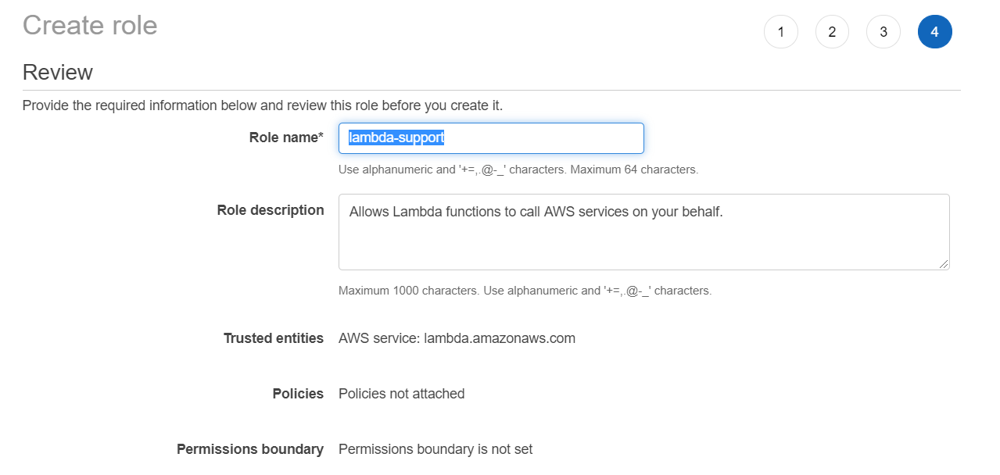
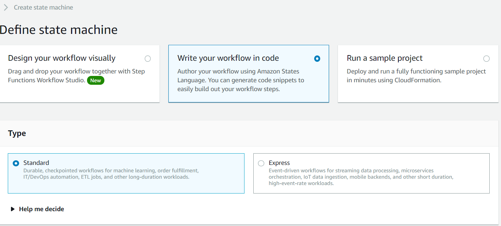
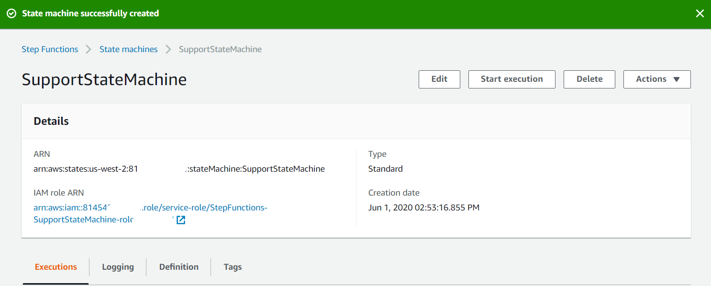
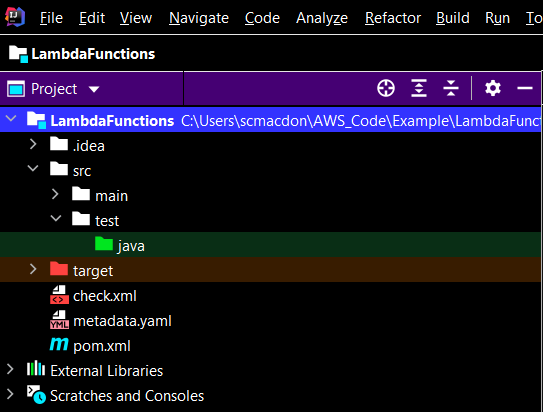
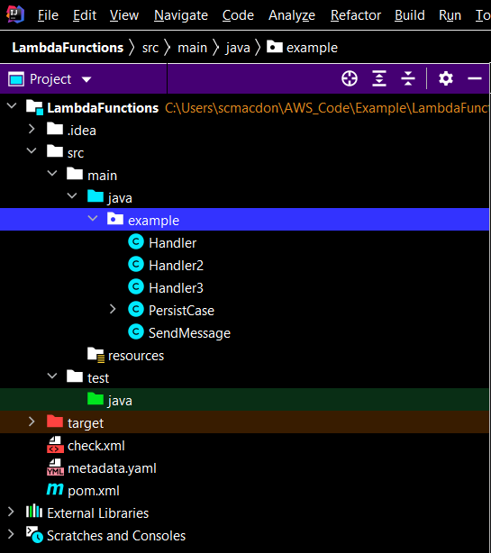
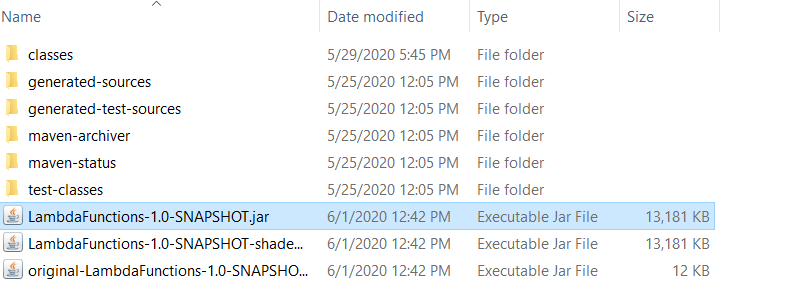
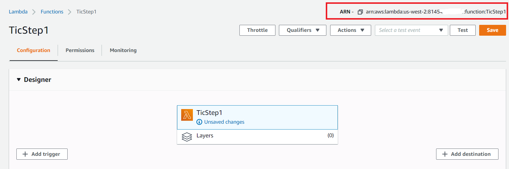
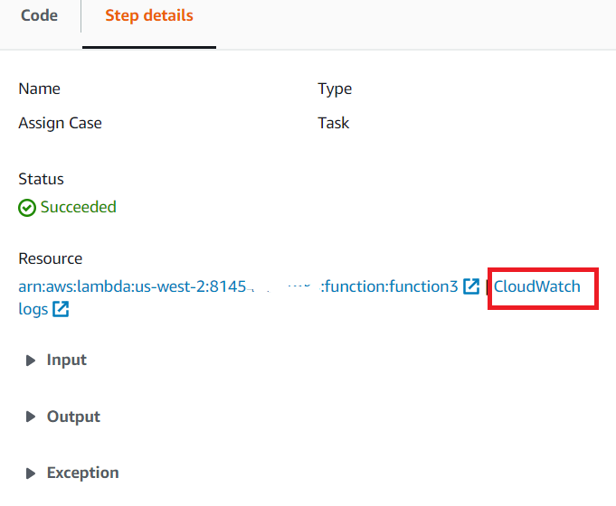
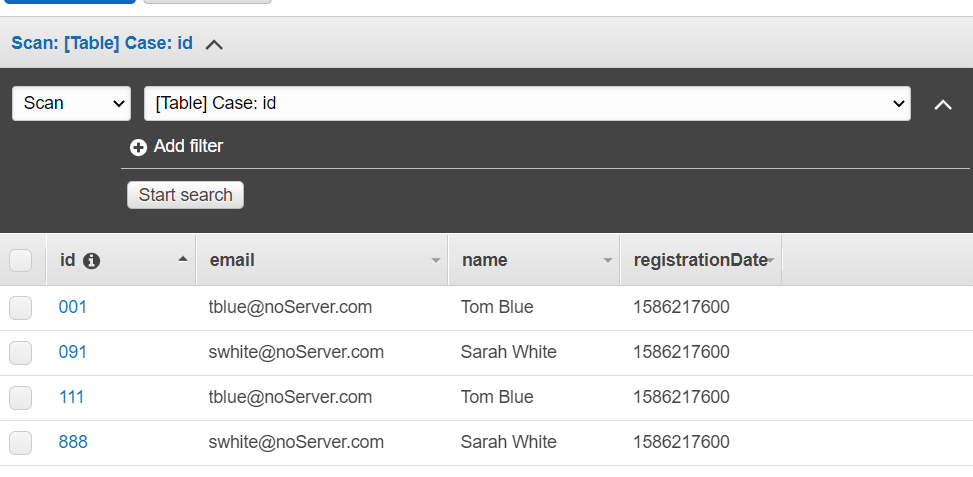

#  Create AWS serverless workflows by using the AWS SDK for Java

## Purpose
You can create an AWS serverless workflow by using the AWS SDK for Java Version 2 and AWS Step Functions.
Each workflow step is implemented by using an AWS Lambda function. Lambda is a compute service that enables you to run
code without provisioning or managing servers.

**Note:** You can create Lambda functions in various programming languages. For this tutorial, Lambda functions are
implemented by using the Lambda Java API. For more information about Lambda, see
[What is AWS Lambda](https://docs.aws.amazon.com/lambda/latest/dg/welcome.html).

In this tutorial, you create a workflow that creates support tickets for an organization. Each workflow step performs an operation on the ticket. This tutorial shows you how to use Java to process workflow data. For example, you'll learn how to read data that's passed to the workflow, how to pass data between steps, and how to invoke AWS services from the workflow.

#### Topics

+ Prerequisites
+ Understand the workflow
+ Create an IAM role that is used to execute Lambda functions
+ Create a workflow by using AWS Step functions
+ Create an IntelliJ project named LambdaFunctions
+ Add the POM dependencies to your project
+ Create Lambda functions by using the Lambda API in the AWS SDK for Java
+ Package the project that contains Lambda functions
+ Deploy Lambda functions
+ Add Lambda functions to workflows
+ Invoke the workflow from the AWS Console

## Prerequisites

To complete the tutorial, you need the following:

+ An AWS account
+ A Java IDE (this tutorial uses the IntelliJ IDE)
+ Java JDK 1.8
+ Maven 3.6 or later

### Important

+ The AWS services included in this document are included in the [AWS Free Tier](https://aws.amazon.com/free/?all-free-tier.sort-by=item.additionalFields.SortRank&all-free-tier.sort-order=asc).
+  This code has not been tested in all AWS Regions. Some AWS services are available only in specific regions. For more information, see [AWS Regional Services](https://aws.amazon.com/about-aws/global-infrastructure/regional-product-services). 
+ Running this code might result in charges to your AWS account. 
+ Be sure to terminate all of the resources you create while going through this tutorial to ensure that you’re not charged.

### Creating the resources

An Amazon DynamoDB table named **Case** with a key named **Id**. To learn how to create a DynamoDB table, see [Create a Table](https://docs.aws.amazon.com/amazondynamodb/latest/developerguide/getting-started-step-1.html).

## Understand the workflow

The following figure shows the workflow you'll create with this tutorial.


The following is what happens at each step in the workflow:
+ **Start** -  Initiates the workflow.
+ **Open Case** – Handles a support ticket ID value by passing it to the workflow.
+ **Assign Case** – Assigns the support case to an employee and stores the data in a DynamoDB table.
+ **Send Email** – Sends the employee an email message by using the Amazon Simple Email Service (Amazon SES) to inform them there is a new ticket.
+ **End** - Stops the workflow.

## Create an IAM role that's used to execute Lambda functions

Create the following two IAM roles:
+ **lambda-support** - Used to invoke Lamdba functions.
+ **workflow-support** - Used to enable AWS Step Functions to invoke the workflow.

This tutorial uses the DynamoDB and Amazon SES services. The **lambda-support** role has to have policies that enable it to invoke these services from a Lambda function.  

#### To create an IAM role

1. Open the AWS Management Console. When the page loads, enter **IAM** in the search box, and then choose **IAM** to open the IAM console.

2. In the navigation pane, choose **Roles**, and on the **Roles** page, choose **Create Role**.

3. Choose **AWS service**, and then choose **Lambda**.


4. Choose **Permissions**.

5. Search for **AWSLambdaBasicExecutionRole**.

6. Choose **Next Tags**.

7. Choose **Review**.

8. Name the role **lambda-support**.



9. Choose **Create role**.

10. Choose **lambda-support** to view the overview page.

11. Choose **Attach Policies**.

12. Search for **AmazonDynamoDBFullAccess**, and then choose **Attach policy**.

13. Search for **AmazonSESFullAccess**, and then choose **Attach policy**. When you're done, you can see the permissions.


14. Repeat this process to create **workflow-support**. For step three, instead of choosing **Lambda**, choose **Step Functions**. You don't need to perform steps 11-13.  

## Create a serverless workflow by using Step functions

You can create a workflow that processes support tickets. To define a workflow by using Step Functions, you create an Amazon States Language (JSON-based) document to define your state machine. An Amazon States Language document describes each step. After you define the document, Step functions provides a visual representation of the workflow. The following figure shows the Amazon States Language document and the visual representation of the workflow.


Workflows can pass data between steps. For example, the **Open Case** step processes a case ID value (passed to the workflow) and passes that value to the **Assign Case** step. Later in this tutorial, you'll create application logic in the Lambda function to read and process the data values.  

#### To create a workflow

1. Open the AWS Step Functions console at https://us-west-2.console.aws.amazon.com/states/home.

2. Choose **Create State Machine**.

3. Choose **Write your workflow in code**. In the **Type** area, choose **Standard**.



4. Specify the Amazon States Language document by entering the following code.

```json
        {
        "Comment": "A simple AWS Step Functions state machine that automates a call center support session.",
        "StartAt": "Open Case",
        "States": {
        "Open Case": {
        "Type": "Task",
        "Resource": "arn:aws:lambda:REGION:ACCOUNT_ID:function:FUNCTION_NAME",
        "Next": "Assign Case"
          },
         "Assign Case": {
         "Type": "Task",
         "Resource": "arn:aws:lambda:REGION:ACCOUNT_ID:function:FUNCTION_NAME",
         "Next": "Send Email"
         },
         "Send Email": {
         "Type": "Task",
         "Resource": "arn:aws:lambda:REGION:ACCOUNT_ID:function:FUNCTION_NAME",
         "End": true
          }
          }
         
```
**Note:** Don't worry about the errors related to the Lambda resource values. You'll update these values later in this tutorial.

5. Choose **Next**.

6. In the name field, enter **SupportStateMachine**.

7. In the **Permission** section, choose **Choose an existing role**.  

8. Choose **workflow-support** (the IAM role that you created).


9. Choose **Create state machine**. A message appears that states the state machine was successfully created.



## Create an IntelliJ project named LambdaFunctions

1. In the IntelliJ IDE, choose **File**, **New**, **Project**.

2. In the **New Project** dialog box, choose **Maven**, and then choose **Next**.

3. For **GroupId**, enter **LambdaFunctions**.

4. For **ArtifactId**, enter **LambdaFunctions**.

5. Choose **Next**.

6. Choose **Finish**.

## Add the POM dependencies to your project

At this point, you have a new project named **LambdaFunctions**.



Add the following code to your pom.xml file.

```xml
      <?xml version="1.0" encoding="UTF-8"?>
	<project xmlns="http://maven.apache.org/POM/4.0.0"
         xmlns:xsi="http://www.w3.org/2001/XMLSchema-instance"
         xsi:schemaLocation="http://maven.apache.org/POM/4.0.0 http://maven.apache.org/xsd/maven-4.0.0.xsd">
     <modelVersion>4.0.0</modelVersion>
     <groupId>LambdaFunctions</groupId>
     <artifactId>LambdaFunctions</artifactId>
     <version>1.0-SNAPSHOT</version>
     <packaging>jar</packaging>
      <name>java-basic-function</name>
     <properties>
        <project.build.sourceEncoding>UTF-8</project.build.sourceEncoding>
        <maven.compiler.source>1.8</maven.compiler.source>
        <maven.compiler.target>1.8</maven.compiler.target>
     </properties>
     <dependencies>
        <!-- https://mvnrepository.com/artifact/com.amazonaws/aws-lambda-java-core -->
        <dependency>
            <groupId>com.amazonaws</groupId>
            <artifactId>aws-lambda-java-core</artifactId>
            <version>1.2.1</version>
        </dependency>
        <dependency>
            <groupId>com.google.code.gson</groupId>
            <artifactId>gson</artifactId>
            <version>2.8.6</version>
        </dependency>
        <!-- https://mvnrepository.com/artifact/org.apache.logging.log4j/log4j-api -->
        <dependency>
            <groupId>org.apache.logging.log4j</groupId>
            <artifactId>log4j-api</artifactId>
            <version>2.10.0</version>
        </dependency>
        <dependency>
            <groupId>org.apache.logging.log4j</groupId>
            <artifactId>log4j-core</artifactId>
            <version>2.13.0</version>
            <scope>test</scope>
        </dependency>
        <dependency>
            <groupId>org.apache.logging.log4j</groupId>
            <artifactId>log4j-slf4j18-impl</artifactId>
            <version>2.13.3</version>
            <scope>test</scope>
        </dependency>
        <dependency>
            <groupId>org.junit.jupiter</groupId>
            <artifactId>junit-jupiter-api</artifactId>
            <version>5.6.0</version>
            <scope>test</scope>
        </dependency>
        <dependency>
            <groupId>org.junit.jupiter</groupId>
            <artifactId>junit-jupiter-engine</artifactId>
            <version>5.6.0</version>
            <scope>test</scope>
        </dependency>
        <dependency>
            <groupId>com.googlecode.json-simple</groupId>
            <artifactId>json-simple</artifactId>
            <version>1.1.1</version>
        </dependency>
        <dependency>
            <groupId>software.amazon.awssdk</groupId>
            <artifactId>dynamodb-enhanced</artifactId>
            <version>2.11.4-PREVIEW</version>
        </dependency>
        <dependency>
            <groupId>software.amazon.awssdk</groupId>
            <artifactId>dynamodb</artifactId>
            <version>2.10.41</version>
        </dependency>
        <dependency>
            <groupId>software.amazon.awssdk</groupId>
            <artifactId>ses</artifactId>
            <version>2.10.41</version>
        </dependency>
        <dependency>
            <groupId>javax.mail</groupId>
            <artifactId>javax.mail-api</artifactId>
            <version>1.5.5</version>
        </dependency>
        <dependency>
            <groupId>com.sun.mail</groupId>
            <artifactId>javax.mail</artifactId>
            <version>1.5.5</version>
        </dependency>
     </dependencies>
     <build>
        <plugins>
               <plugin>
                <artifactId>maven-surefire-plugin</artifactId>
                <version>2.22.2</version>
            </plugin>
            <plugin>
                <groupId>org.apache.maven.plugins</groupId>
                <artifactId>maven-shade-plugin</artifactId>
                <version>3.2.2</version>
                <configuration>
                    <createDependencyReducedPom>false</createDependencyReducedPom>
                </configuration>
                <executions>
                    <execution>
                        <phase>package</phase>
                        <goals>
                            <goal>shade</goal>
                        </goals>
                    </execution>
                </executions>
            </plugin>
            <plugin>
                <groupId>org.apache.maven.plugins</groupId>
                <artifactId>maven-compiler-plugin</artifactId>
                <version>3.8.1</version>
                <configuration>
                    <source>1.8</source>
                    <target>1.8</target>
                </configuration>
            </plugin>
        </plugins>
       </build>
     </project>
```

## Create Lambda functions by using the AWS SDK for Java Lambda API

Use the Lambda runtime API to create the Java classes that define the Lamdba functions. In this example, there are three workflow steps that each correspond to a Java class. There are also two extra classes that invoke the Amazon DynamoDB service and the Amazon SES service.  

The following figure shows the Java classes in the project. Notice that all Java classes are located in a package named **example**.



To create a Lambda function by using the Lambda runtime API, you implement **com.amazonaws.services.lambda.runtime.RequestHandler**. The application logic that's executed when the workflow step is invoked is located in the **handleRequest** method. The return value of this method is passed to the next step in a workflow.

Create these Java classes, which are described in the following sections:
+ **Handler** - Used as the first step in the workflow that processes the ticket ID value.  
+ **Handler2** - Used as the second step in the workflow that assigns the ticket to an employee and stores the data in a database.
+ **Handler3** - Used as the third step in the workflow that sends an email message to the employee to notify them about the ticket.
+ **PersistCase** - Uses the Amazon DynamoDB API to store the data in a DynamoDB table.
+ **SendMessage** - Uses the Amazon SES API to send an email message.

### Handler class

This Java code represents the **Handler** class. The class creates a Lamdba function that reads the ticket ID value that is passed to the workflow. Notice that you can log messages to Amazon CloudWatch logs by using a **LambdaLogger** object. The **handleRequest** method returns the ticket ID value that is passed to the second step in the workflow.

```java
     package example;

     import com.amazonaws.services.lambda.runtime.Context;
     import com.amazonaws.services.lambda.runtime.RequestHandler;
     import com.amazonaws.services.lambda.runtime.LambdaLogger;
     import com.google.gson.Gson;
     import com.google.gson.GsonBuilder;
     import java.util.Map;

     // Handler value: example.Handler
     public class Handler implements RequestHandler<Map<String,String>, String>{

    @Override
    public String handleRequest(Map<String,String> event, Context context)
    {
        LambdaLogger logger = context.getLogger();
        Gson gson = new GsonBuilder().create();

        // Log execution details
        logger.log("ENVIRONMENT VARIABLES: " + gson.toJson(System.getenv()));
        logger.log("CONTEXT: " + gson.toJson(context));
        // process event
        logger.log("EVENT Data: " + gson.toJson(event));

        String myCaseID = event.get("inputCaseID");
        logger.log("CaseId: " + myCaseID);
        return myCaseID;
       }
      }
```

### Handler2 class

The **Handler2** class is the second step in the workflow and uses basic Java application logic to select an employee to assign the ticket. Then a **PersistCase** object is created and used to store the ticket data in a DynamoDB table named **Case**. The email address of the employee is passed to the third step.

```java
      package example;

      import com.amazonaws.services.lambda.runtime.Context;
      import com.amazonaws.services.lambda.runtime.LambdaLogger;
      import com.amazonaws.services.lambda.runtime.RequestHandler;

      // Handler value: example.Handler
     public class Handler2 implements RequestHandler<String, String> {

    @Override
    public String handleRequest(String event, Context context)
    {

        PersistCase perCase = new PersistCase();

        LambdaLogger logger = context.getLogger();
        String val = event ;
       logger.log("CASE is about to be assigned " +val);

       // Create very simple logic to assign case to an employee
        int tmp = (Math.random() <= 0.5) ? 1 : 2;

        logger.log("TMP IS " +tmp);

        String emailEmp= "";

        if (tmp == 1) {
            // assign to tblue
            emailEmp = "tblue@noServer.com";
            perCase.putRecord(val, "Tom Blue", emailEmp );
        } else {
            // assign to swhite
            emailEmp = "swhite@noServer.com";
            perCase.putRecord(val, "Sarah White", emailEmp);
        }

        logger.log("emailEmp IS " +emailEmp);
        //return email - used in the next step
        return emailEmp;
        }
      }
```

### Handler3 class

The **Handler3** class is the third step in the workflow and creates a **SendMessage** object. An email message is sent to the employee to notify them about the new ticket. The email address that is passed from the second step is used.

 ```java
       package example;

       import com.amazonaws.services.lambda.runtime.Context;
       import com.amazonaws.services.lambda.runtime.LambdaLogger;
       import com.amazonaws.services.lambda.runtime.RequestHandler;
       import java.io.IOException;

       // Handler value: example.Handler
       public class Handler3 implements RequestHandler<String, String> {

       @Override
       public String handleRequest(String event, Context context)
       {
        LambdaLogger logger = context.getLogger();
        String email = event ;

	// log execution details
        logger.log("Email value " + email);
        SendMessage msg = new SendMessage();

       try {
           msg.sendMessage(email);

       } catch (IOException e)
       {
           e.getStackTrace();
       }

        return "";
     }
  }
```

### PersistCase class

The following class uses the Amazon DynamoDB API to store the data in a table. For more information, see [DynamoDB examples using the AWS SDK for Java](https://docs.aws.amazon.com/sdk-for-java/v2/developer-guide/examples-dynamodb.html).

```java
       package example;

       import software.amazon.awssdk.enhanced.dynamodb.DynamoDbEnhancedClient;
       import software.amazon.awssdk.enhanced.dynamodb.DynamoDbTable;
       import software.amazon.awssdk.enhanced.dynamodb.TableSchema;
       import software.amazon.awssdk.enhanced.dynamodb.mapper.annotations.DynamoDbSortKey;
       import software.amazon.awssdk.regions.Region;
       import software.amazon.awssdk.services.dynamodb.DynamoDbClient;
       import software.amazon.awssdk.services.dynamodb.model.DynamoDbException;
       import software.amazon.awssdk.enhanced.dynamodb.mapper.annotations.DynamoDbBean;
       import software.amazon.awssdk.enhanced.dynamodb.mapper.annotations.DynamoDbPartitionKey;
       import java.time.Instant;
       import java.time.LocalDate;
       import java.time.LocalDateTime;
       import java.time.ZoneOffset;

       /*
        Prior to running this code example, create a table named Case with a PK named id
       */

      public class PersistCase {

      // Puts an item into a DynamoDB table
      public void putRecord(String caseId, String employeeName, String email) {

        // Create a DynamoDbClient object
        Region region = Region.US_WEST_2;
        DynamoDbClient ddb = DynamoDbClient.builder()
                .region(region)
                .build();

        // Create a DynamoDbEnhancedClient and use the DynamoDbClient object
        DynamoDbEnhancedClient enhancedClient = DynamoDbEnhancedClient.builder()
                .dynamoDbClient(ddb)
                .build();

        try {
            // Create a DynamoDbTable object
            DynamoDbTable<Case> caseTable = enhancedClient.table("Case", TableSchema.fromBean(Case.class));

            // Create an Instant object
            LocalDate localDate = LocalDate.parse("2020-04-07");
            LocalDateTime localDateTime = localDate.atStartOfDay();
            Instant instant = localDateTime.toInstant(ZoneOffset.UTC);

            // Populate the table
            Case caseRecord = new Case();
            caseRecord.setName(employeeName);
            caseRecord.setId(caseId);
            caseRecord.setEmail(email);
            caseRecord.setRegistrationDate(instant) ;

            // Put the case data into a DynamoDB table
            caseTable.putItem(caseRecord);

        } catch (DynamoDbException e) {
            System.err.println(e.getMessage());
            System.exit(1);
        }
        System.out.println("done");
    }


    // Create the Case table to track open cases created in the workflow
    @DynamoDbBean
    public static class Case {

        private String id;
        private String name;
        private String email;
        private Instant regDate;

        @DynamoDbPartitionKey
        public String getId() {
            return this.id;
        };

        public void setId(String id) {

            this.id = id;
        }

        @DynamoDbSortKey
        public String getName() {
            return this.name;

        }

        public void setName(String name) {

            this.name = name;
        }

        public String getEmail() {
            return this.email;
        }

        public void setEmail(String email) {

            this.email = email;
        }

        public Instant getRegistrationDate() {
            return regDate;
        }
        public void setRegistrationDate(Instant registrationDate) {

            this.regDate = registrationDate;
        }
       }
      }
```

### SendMessage class

The following Java class represents the **SendMessage** class. This class uses the Amazon SES API to send an email message to the employee. An email address that you send an email message to must be verified. For information, see [Verifying an email address](https://docs.aws.amazon.com/ses/latest/DeveloperGuide//verify-email-addresses-procedure.html).

 ```java
       package example;

       import software.amazon.awssdk.regions.Region;
       import software.amazon.awssdk.services.ses.SesClient;
       import javax.mail.Message;
       import javax.mail.MessagingException;
       import javax.mail.Session;
       import javax.mail.internet.AddressException;
       import javax.mail.internet.InternetAddress;
       import javax.mail.internet.MimeMessage;
       import javax.mail.internet.MimeMultipart;
       import javax.mail.internet.MimeBodyPart;
       import java.io.ByteArrayOutputStream;
       import java.io.IOException;
       import java.nio.ByteBuffer;
       import java.util.Properties;
       import software.amazon.awssdk.core.SdkBytes;
       import software.amazon.awssdk.services.ses.model.SendRawEmailRequest;
       import software.amazon.awssdk.services.ses.model.RawMessage;
       import software.amazon.awssdk.services.ses.model.SesException;

       public class SendMessage {

        public void sendMessage(String email) throws IOException {

        //Sender
        String sender = "SPECIFY an email address" ; // REPLACE WITH AN EMAIL ADDRESSS

        String subject = "New Case";

        // The email body for recipients with non-HTML email clients.
        String bodyText = "Hello,\r\n" + "You are assigned a new case";

        // The HTML body of the email.
        String bodyHTML = "<html>" + "<head></head>" + "<body>" + "<h1>Hello!</h1>"
                + "<p>Please check the database for new ticket assigned to you.</p>" + "</body>" + "</html>";

        Region region = Region.US_WEST_2;
        SesClient client = SesClient.builder()
                .region(region)
                .build();

        try {
            send(client, sender,email, subject,bodyText,bodyHTML);

        } catch (IOException | MessagingException e) {
            e.getStackTrace();
        }
      }

    public static void send(SesClient client,
                            String sender,
                            String recipient,
                            String subject,
                            String bodyText,
                            String bodyHTML
    ) throws AddressException, MessagingException, IOException {

        Session session = Session.getDefaultInstance(new Properties());

        // Create a new MimeMessage object.
        MimeMessage message = new MimeMessage(session);

        // Add subject, from and to lines.
        message.setSubject(subject, "UTF-8");
        message.setFrom(new InternetAddress(sender));
        message.setRecipients(Message.RecipientType.TO, InternetAddress.parse(recipient));

        // Create a multipart/alternative child container.
        MimeMultipart msgBody = new MimeMultipart("alternative");

        // Create a wrapper for the HTML and text parts.
        MimeBodyPart wrap = new MimeBodyPart();

        // Define the text part.
        MimeBodyPart textPart = new MimeBodyPart();
        textPart.setContent(bodyText, "text/plain; charset=UTF-8");

        // Define the HTML part.
        MimeBodyPart htmlPart = new MimeBodyPart();
        htmlPart.setContent(bodyHTML, "text/html; charset=UTF-8");

        // Add the text and HTML parts to the child container.
        msgBody.addBodyPart(textPart);
        msgBody.addBodyPart(htmlPart);

        // Add the child container to the wrapper object.
        wrap.setContent(msgBody);

        // Create a multipart/mixed parent container.
        MimeMultipart msg = new MimeMultipart("mixed");

        // Add the parent container to the message.
        message.setContent(msg);

        // Add the multipart/alternative part to the message.
        msg.addBodyPart(wrap);

        try {
            System.out.println("Attempting to send an email through Amazon SES " + "using the AWS SDK for Java...");

            ByteArrayOutputStream outputStream = new ByteArrayOutputStream();
            message.writeTo(outputStream);

            ByteBuffer buf = ByteBuffer.wrap(outputStream.toByteArray());

            byte[] arr = new byte[buf.remaining()];
            buf.get(arr);

            SdkBytes data = SdkBytes.fromByteArray(arr);

            RawMessage rawMessage = RawMessage.builder()
                    .data(data)
                    .build();

            SendRawEmailRequest rawEmailRequest = SendRawEmailRequest.builder()
                    .rawMessage(rawMessage)
                    .build();

            client.sendRawEmail(rawEmailRequest);

          } catch (SesException e) {
            System.err.println(e.awsErrorDetails().errorMessage());
            System.exit(1);
          }
         }
       }
 ```
 
## Package the project that contains the Lambda functions

Package up the project into a .jar (JAR) file that you can deploy as a Lambda function by using the following Maven command.

    mvn package

The JAR file is located in the **target** folder (which is a child folder of the project folder).



## Deploy the Lambda functions

1. Open the Lambda console at https://us-west-2.console.aws.amazon.com/lambda/home.

2. Choose **Create Function**.

3. Choose **Author from scratch**.

4. In the **Basic** information section, enter **TicStep1** as the name.

5. In the **Runtime**, choose **Java 8**.

6. Choose **Use an existing role**, and then choose **lambda-support** (the IAM role that you created).


7. Choose **Create function**.

8. For **Code entry type**, choose **Upload a .zip or .jar file**.

9. Choose **Upload**, and then browse to the JAR file that you created.  

10. For **Handler**, enter the fully qualified name of the function, for example, **example.Handler::handleRequest** (**example.Handler** specifies the package and class followed by :: and method name).


11. Choose **Save.**

12. Repeat this procedure for the **Handler2** and **Handler3** classes. Name the corresponding Lambda functions **TicStep2** and **TicStep3**. When you finish, you will have three Lambda functions that you can reference in the Amazon States Language document.  

## Add the Lambda functions to workflows

Open the Lambda console. Notice that you can view the Lambda Amazon Resource Name (ARN) value in the upper-right corner.



Copy the value and then paste it into step 1 of the Amazon States Language document, located in the Step Functions console.


Update the Resource for the **Assign Case** and **Send Email** steps. This is how you hook in Lambda functions created by using the AWS SDK for Java into a workflow created by using Step Functions.

## Execute your workflow by using the Step Functions console

You can invoke the workflow on the Step Functions console.  An execution receives JSON input. For this example, you can pass the following JSON data to the workflow.  

     {
	"inputCaseID": "001"
     }


#### To execute your workflow

1. On the Step Functions console, choose **Start execution**.

2. In the **Input** section, pass the JSON data. View the workflow. As each step is completed, it turns green.


If the step turns red, an error occurred. You can click the step and view the logs that are accessible from the right side.



When the workflow is finished, you can view the data in the DynamoDB table.



### Next steps
Congratulations, you have created an AWS serverless workflow by using the AWS SDK for Java. As stated at the beginning of this tutorial, be sure to terminate all of the resources you create while going through this tutorial to ensure that you’re no longer charged.

For more AWS multiservice examples, see
[usecases](https://github.com/awsdocs/aws-doc-sdk-examples/tree/master/javav2/usecases).
