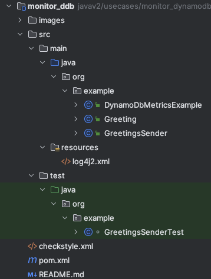
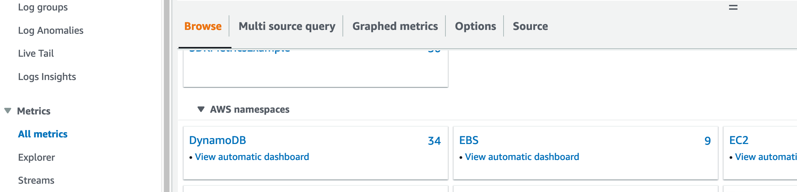
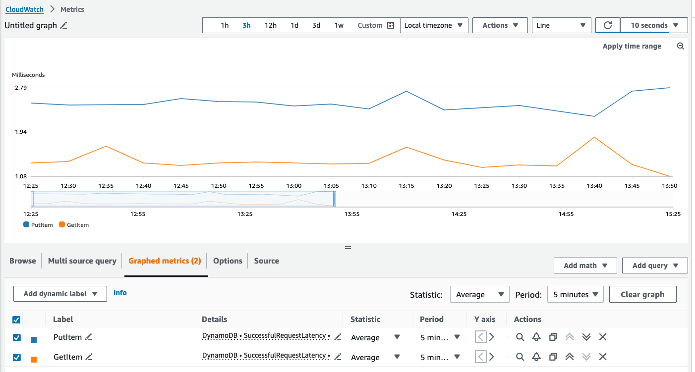
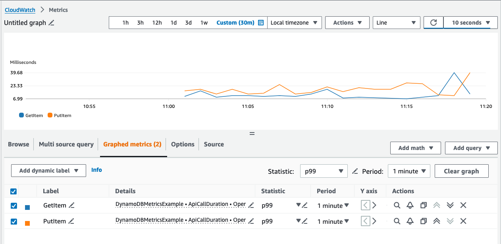
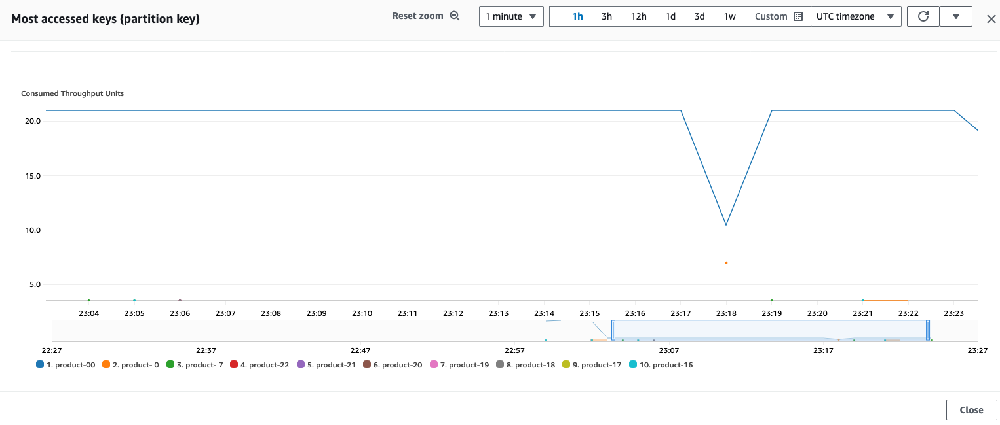

# Monitor performance of a DynamoDB application

## Overview
|                 |                                                                                                                                        |
|-----------------|----------------------------------------------------------------------------------------------------------------------------------------|
| Description     | This tutorial shows users how to configure an application's use of DynamoDB to monitor performance by using the AWS SDK for Java (v2). |
| Audience        | Developer (beginner)                                                                                                                   |
| Required skills | Java, Maven                                                                                                                            |

## Purpose

In an application that uses DynamoDB, it can be important to understand and monitor DynamoDB’s contributions to
the application's performance. This tutorial discusses the following ways to monitor performance.
* Configure client-side performance metrics.
* View metrics from DynamoDB and from the SDK in Amazon CloudWatch.
* Set up alarms on those metrics.
* Set up CloudWatch contributor insights for DynamoDB to dive into specific issues with usage patterns. 
 
This tutorial does not cover general best-practices for DynamoDB. For information on best practices see [Best practices for designing
and architecting with DynamoDB](https://docs.aws.amazon.com/amazondynamodb/latest/developerguide/best-practices.html).
This tutorial uses the DynamoDB enhanced client, for more information see the [DynamoDB Enhanced Client API topic](https://docs.aws.amazon.com/sdk-for-java/latest/developer-guide/dynamodb-enhanced-client.html)
in the AWS SDK for Java 2.x Developer Guide.

In this tutorial, we create a sample application that uses DynamoDB that demonstrates how to monitor DynamoDB
performance.

This tutorial uses the following AWS services.

- Amazon DynamoDB
- Amazon CloudWatch

## Prerequisites

To complete the tutorial, you need the following:

+ Access to AWS services
+ A Java IDE (this tutorial uses IntelliJ version 2023.3.6)
+ Java version 8 (or higher) SDK

> [!IMPORTANT]
> + The AWS services used in this tutorial are included in the [AWS Free Tier](https://aws.amazon.com/free/?all-free-tier.sort-by=item.additionalFields.SortRank&all-free-tier.sort-order=asc).
> + This code has not been tested in all AWS Regions. Some AWS services are available only in specific Regions. For more information, see [AWS Regional Services](https://aws.amazon.com/about-aws/global-infrastructure/regional-greeting-services).
> + Running this code might result in charges to your AWS account.
> + Be sure to delete all the resources that you create while going through this tutorial so that you won't be charged.

### Set up your development environment
Make sure that you have properly set up your development environment. For information, see
[Set up the AWS SDK for Java 2.x](https://docs.aws.amazon.com/sdk-for-java/latest/developer-guide/setup.html).

## Create a sample application
### Create an IntelliJ project
As a first step, create an IntelliJ project.

1. From the IntelliJ IDE menu, choose **File** -> **New** -> **Project ...**.
2. Fill in a project name. We use `monitor_ddb` in this tutorial, but you can choose a different name.
3. In the **New Project** dialog box, choose **Java** and **Maven**. Select your Java JDK version.
4. Open **Advanced Settings**
   4. In **GroupId**, enter `org.example`.
   5. In **ArtifactId**, enter `monitor_ddb`.
5. Select **Create**.

> [!NOTE]
> As an alternative to building the project, you can copy the code from [in this project](https://github.com/awsdocs/aws-doc-sdk-examples/aws-doc-sdk-examples/tree/main/javav2/usecases/monitor_dynamodb)
> or [clone the repository](https://github.com/awsdocs/aws-doc-sdk-examples).

### Add the SDK dependencies to your Maven pom.xml file

Make sure that your project's **pom.xml** contains the same content as the following **pom.xml** file.
<details>
<summary>POM file</summary>

You can ignore the Junit and Checkstyle dependencies if you want to simply run the application.

```xml
<?xml version="1.0" encoding="UTF-8"?>
<project xmlns="http://maven.apache.org/POM/4.0.0"
         xmlns:xsi="http://www.w3.org/2001/XMLSchema-instance"
         xsi:schemaLocation="http://maven.apache.org/POM/4.0.0 http://maven.apache.org/xsd/maven-4.0.0.xsd">
    <modelVersion>4.0.0</modelVersion>

    <groupId>org.example</groupId>
    <artifactId>monitor_dynamodb</artifactId>
    <version>1.0</version>
    <packaging>jar</packaging>
    <description>Example for DynamoDB performance monitoring.</description>
    <properties>
        <project.build.sourceEncoding>UTF-8</project.build.sourceEncoding>
        <java.version>17</java.version>
        <maven.compiler.target>17</maven.compiler.target>
        <maven.compiler.source>17</maven.compiler.source>
    </properties>
    <dependencyManagement>
        <dependencies>
            <dependency>
                <groupId>software.amazon.awssdk</groupId>
                <artifactId>bom</artifactId>
                <version>2.25.39</version>
                <type>pom</type>
                <scope>import</scope>
            </dependency>
            <dependency>
                <groupId>org.apache.logging.log4j</groupId>
                <artifactId>log4j-bom</artifactId>
                <version>2.23.1</version>
                <type>pom</type>
                <scope>import</scope>
            </dependency>
        </dependencies>
    </dependencyManagement>
    <dependencies>
        <dependency>
            <groupId>software.amazon.awssdk</groupId>
            <artifactId>dynamodb-enhanced</artifactId>
        </dependency>
        <dependency>
            <groupId>software.amazon.awssdk</groupId>
            <artifactId>dynamodb</artifactId>
        </dependency>
        <dependency>
            <groupId>software.amazon.awssdk</groupId>
            <artifactId>cloudwatch-metric-publisher</artifactId>
        </dependency>
        <dependency>
            <groupId>software.amazon.awssdk</groupId>
            <artifactId>cloudwatch</artifactId>
        </dependency>
        <dependency>
            <groupId>software.amazon.awssdk</groupId>
            <artifactId>sso</artifactId>
        </dependency>
        <dependency>
            <groupId>software.amazon.awssdk</groupId>
            <artifactId>ssooidc</artifactId>
        </dependency>
        <dependency>
            <groupId>org.apache.logging.log4j</groupId>
            <artifactId>log4j-slf4j-impl</artifactId>
        </dependency>
        <dependency>
            <groupId>org.junit.jupiter</groupId>
            <artifactId>junit-jupiter</artifactId>
            <version>5.8.1</version>
            <scope>test</scope>
        </dependency>
    </dependencies>
    <build>
        <plugins>
            <plugin>
                <groupId>org.apache.maven.plugins</groupId>
                <artifactId>maven-checkstyle-plugin</artifactId>
                <version>3.3.1</version>
                <configuration>
                    <configLocation>checkstyle.xml</configLocation>
                </configuration>
                <dependencies>
                    <dependency>
                        <groupId>com.puppycrawl.tools</groupId>
                        <artifactId>checkstyle</artifactId>
                        <version>10.15.0</version>
                    </dependency>
                </dependencies>
            </plugin>
        </plugins>
    </build>
</project>
```
</details>


### Create a Java package in your project

In the **src/main/java** folder, create a Java package named `org.example`. The Java files go into
this package.



The following Java files go into this package:

- **DynamoDbMetricsExample.java**. This class is the entry point for this sample application.
- **Greeting.java**. This data model class is a DynamoDb bean. We can use this DynamoDb bean to map data
to/from the DynamoDB table.
- **GreetingsSender.java**. The class contains the logic for our application and creates the service clients.

### Create the Java classes

#### Create the `Greetings` class

This model class has a `@DynamoDbBean` annotation that identifies it as a bean that the SDK can use
to generate a table schema.
The bean's getter/setter names become the DynamoDB attribute names. The `@DynamoDbPartitionKey`
annotation marks the `id` field as the table's partition key. For more information about annotated data model
beans for DynamoDB mapping, visit the [DynamoDB Enhanced Client API Get Started section](https://docs.aws.amazon.com/sdk-for-java/latest/developer-guide/ddb-en-client-gs-tableschema.html).

```java
package org.example;

import software.amazon.awssdk.enhanced.dynamodb.mapper.annotations.DynamoDbBean;
import software.amazon.awssdk.enhanced.dynamodb.mapper.annotations.DynamoDbPartitionKey;

@DynamoDbBean
public class Greeting {
    private String id;
    private String name;

    public String getId() {
        return id;
    }

    @DynamoDbPartitionKey
    public void setId(String id) {
        this.id = id;
    }

    public String getName() {
        return name;
    }

    public void setName(String name) {
        this.name = name;
    }

    @Override
    public String toString() {
        return String.format(
                "%s[id=%s, name=%s]",
                getClass().getSimpleName(), id, name
        );
    }
}
```

#### Create the `GreetingSender` class

The `GreetingSender` class forms the core of the sample application. The definition is shown in the following
code block.

In the constructor, this class instantiates the following service client types.
* `CloudWatchAsyncClient` - sends metric data to CloudWatch
* `CloudWatchMetricPublisher` - aggregates metric data
* `DynamoDbClient` - used by the DynamoDb enhanced client to work with the DynamoDb service
* `DynamoDbEnhancedClient` - entry-point class for client-side mapping

The last statement of the constructor creates a `DynamoDbTable` (identified as `greetingsTable`) that 
works with the `Greetings` DynamoDB table. A `DynamoDbTable` instance is a client-side representation of a physical 
DynamoDB table.

Note that the service clients are instantiated at application start-up and released at application close. By reusing 
the same clients across requests, we reuse that client's connections--`DynamoDbClient's` connections to DynamoDB and
`CloudWatchAsyncClient's` connections to CloudWatch. The reuse of connections is a best practice for service clients.
If we had instantiated a new client for each request, we would pay a significant performance penalty to establish 
a connection on each request.

The `sendGreetings` method runs a loop that creates a new greeting, writes it, and reads it from DynamoDB. 
To give us metrics for a longer period, we delay the run of each loop. 

The code also writes and retrieves the first item (with id `greeting-00`) in each loop. This is to give us a 
noticeable imbalance in partition key utilization that
easily shows up [when CloudWatch Contributor Insights is enabled](#understanding-application-partition-usage-with-cloudwatch-contributor-insights). In a real application you should aim to spread
utilization across the partitions of a DynamoDB table.

The `putGreeting` and `getGreeting` methods send and retrieve the data. These methods also show how to get the request ID
if there is a problem on the service end of the request. The request ID can be useful in troubleshooting 
support cases.

The class definition ends with methods to create and delete the `Greetings` table and to close service clients.


```java
package org.example;

import org.slf4j.Logger;
import org.slf4j.LoggerFactory;
import software.amazon.awssdk.core.exception.SdkException;
import software.amazon.awssdk.core.exception.SdkServiceException;
import software.amazon.awssdk.core.metrics.CoreMetric;
import software.amazon.awssdk.enhanced.dynamodb.DynamoDbEnhancedClient;
import software.amazon.awssdk.enhanced.dynamodb.DynamoDbTable;
import software.amazon.awssdk.enhanced.dynamodb.TableSchema;
import software.amazon.awssdk.metrics.MetricPublisher;
import software.amazon.awssdk.metrics.publishers.cloudwatch.CloudWatchMetricPublisher;
import software.amazon.awssdk.regions.Region;
import software.amazon.awssdk.services.cloudwatch.CloudWatchAsyncClient;
import software.amazon.awssdk.services.dynamodb.DynamoDbClient;
import software.amazon.awssdk.services.dynamodb.waiters.DynamoDbWaiter;

import java.time.Duration;
import java.util.Objects;
import java.util.Optional;

public class GreetingsSender implements AutoCloseable {
    public static final Logger LOGGER = LoggerFactory.getLogger(GreetingsSender.class);
    static final String TABLE_NAME = "Greetings";
    private final DynamoDbTable<Greeting> greetingsTable;
    private final DynamoDbClient dynamoDbClient;
    private final CloudWatchAsyncClient cloudWatchAsyncClient;
    private final MetricPublisher metricPublisher;

    public GreetingsSender(final Region region, Duration uploadFrequency, String namespace) {
        cloudWatchAsyncClient = CloudWatchAsyncClient.builder()
                .region(region)
                .build();

        metricPublisher = CloudWatchMetricPublisher.builder()
                .cloudWatchClient(cloudWatchAsyncClient)
                .uploadFrequency(uploadFrequency)
                .namespace(namespace)
                .detailedMetrics(
                        CoreMetric.API_CALL_DURATION)
                .build();

        dynamoDbClient = DynamoDbClient.builder()
                .region(region)
                .overrideConfiguration(c -> c.addMetricPublisher(metricPublisher))
                .build();

        DynamoDbEnhancedClient enhancedClient = DynamoDbEnhancedClient.builder()
                .dynamoDbClient(dynamoDbClient)
                .build();

        greetingsTable = enhancedClient.table(TABLE_NAME, TableSchema.fromBean(Greeting.class));
    }

    public void sendGreetings(Integer numberOfGreetings, Long timeBetweenSendsInMillis) throws InterruptedException {
        final String greetingZeroId = "greeting-00";
        final Greeting greetingZero = new Greeting();
        greetingZero.setId(greetingZeroId);
        greetingZero.setName(greetingZeroId);

        for (int i = 0; i < numberOfGreetings; i++) {
            LOGGER.info("Sending greeting #{}", i + 1);
            final String greetingId = String.format("greeting-%2d", i);
            final Greeting greeting = new Greeting();
            greeting.setId(greetingId);
            greeting.setName(greetingId);

            putGreeting(greeting);
            putGreeting(greetingZero);
            getGreeting(greetingId);
            getGreeting(greetingZeroId);

            // Briefly pause the loop to extend the requests over a longer period to generate metrics
            // for this example.
            Thread.sleep(timeBetweenSendsInMillis);
        }
    }

    private void putGreeting(final Greeting greeting) {
        if (Objects.isNull(greeting)) {
            throw new NullPointerException("Attempted to put a null greeting.");
        }

        LOGGER.debug("Persisting the following greeting to DynamoDB. {}.", greeting);

        try {
            greetingsTable.putItem(greeting);
        } catch (SdkException exception) {
            // The SDK exception will be an `SdkServiceException` in the case that the exception returned from the
            // service, in this case DynamoDB. Otherwise, e.g. in the case of connection timeouts, there will not be
            // a request ID.
            String requestId = "NONE";
            if (exception instanceof SdkServiceException) {
                requestId = ((SdkServiceException) exception).requestId();
            }
            LOGGER.error(
                    "Encountered an exception with DynamoDB when attempting to put the following greeting. {}."
                            + "Request ID: {}.", greeting, requestId, exception
            );
            throw exception;
        }
    }

    private Optional<Greeting> getGreeting(final String greetingId) {
        if (Objects.isNull(greetingId)) {
            throw new NullPointerException("Attempted to get a greeting with a null ID.");
        }

        LOGGER.debug("Looking up the following greeting from DynamoDB. {}.", greetingId);

        final Greeting lookup = new Greeting();
        lookup.setId(greetingId);

        try {
            final Greeting returned = greetingsTable.getItem(lookup);
            return Optional.ofNullable(returned);
        } catch (SdkException exception) {
            String requestId = "NONE";
            if (exception instanceof SdkServiceException) {
                requestId = ((SdkServiceException) exception).requestId();
            }
            LOGGER.error(
                    "Encountered an exception with DynamoDB when attempting to retrieve the following greeting. {}."
                            + "Request ID: {}", greetingId, requestId, exception
            );
            throw exception;
        }
    }

    public void createTable() {
        LOGGER.info("Creating {} table.", TABLE_NAME);
        greetingsTable.createTable();
        try (DynamoDbWaiter waiter = DynamoDbWaiter.builder().client(dynamoDbClient).build()) {
            waiter.waitUntilTableExists(b -> b.tableName(TABLE_NAME));
        }
        LOGGER.info("{} table created.", TABLE_NAME);

    }

    public void deleteTable() {
        LOGGER.info("Deleting {} table.", TABLE_NAME);
        greetingsTable.deleteTable();
        try (DynamoDbWaiter waiter = DynamoDbWaiter.builder().client(dynamoDbClient).build()) {
            waiter.waitUntilTableNotExists(b -> b.tableName(TABLE_NAME));
        }
        LOGGER.info("{} table deleted.", TABLE_NAME);
    }

    @Override
    public void close() {
        metricPublisher.close();
        cloudWatchAsyncClient.close();
        dynamoDbClient.close();
    }
}
```

#### Create the `DynamoDbMetricsExample` class

This class provides the entry point to the sample application. The class performs the following steps.
* Configures the core `GreetingsSender` instance.
* Creates the DynamoDB table.
* Initiates the write/read loop.
* Deletes the DynamoDB table. If you intend to [review CloudWatch Contributor Insights](#Understanding-application-partition-usage-with-CloudWatch-Contributor-Insights), 
comment out the `greetingsSender.deleteTable();` statement. Remember to delete the table later.
* Calls `close()` on the `GreetingsSender` instance to close down the service clients.

```java
package org.example;

import org.slf4j.Logger;
import org.slf4j.LoggerFactory;
import software.amazon.awssdk.core.exception.SdkException;
import software.amazon.awssdk.regions.Region;

import java.time.Duration;


public class DynamoDbMetricsExample {
    private static final Logger LOGGER = LoggerFactory.getLogger(DynamoDbMetricsExample.class);

    public static void main(String[] args) {
        String namespace = "DynamoDBMetricsExample";

        GreetingsSender greetingsSender = new GreetingsSender(Region.US_EAST_1,
                Duration.ofMinutes(1L),
                namespace);
        // Create the DynamoDB table, if it doesn't already exist.
        greetingsSender.createTable();

        try {
            greetingsSender.sendGreetings(999, 10000L);
        } catch (InterruptedException | SdkException e) {
            LOGGER.error("Error", e);
        } finally {
            // Comment out the following statement if you intend to review CloudWatch Contributor Insights.
            greetingsSender.deleteTable();
            greetingsSender.close();
        }
    }
}
```
## Run the application
Run the application from the IntelliJ IDE.
* In the Project window, right-click on the `DynamoDbMetricsExample` class file and select **Run ...**.

If you configured logging with the [log4j2.xml](#log4j-configuration-in-the-example-application) file, you should see logging statements on the console right
after the application starts.

The application is configured to loop 1000 times and pause 10 seconds between each loop. With these values,
the application runs and generates metrics for over 2.5 hours.

After the application has been running for at least 15 minutes, you should be able to view metrics as described in
the next section.

## Monitor DynamoDB
### View metrics

#### DynamoDB metrics
All DynamoDB tables publish metrics, including latency metrics, to CloudWatch. You can find these metrics in the console
by navigating to **CloudWatch** in a region for which you have DynamoDB tables. Select **Metrics -> All metrics** in the 
left navigation panel, then in the **Browse** tab, you find a tile for **DynamoDB**. The tile for **DynamoDB** is under
the **AWS namespaces** heading after running this sample application.



##### To view the DynamoDB-generated latency metrics

After the sample application has been running for at least around 15 minutes, go to the [CloudWatch console](https://console.aws.amazon.com/cloudwatch).
* Select **Metrics -> All metrics** in the navigation panel and the **Browse** tab. Be sure you are using the same Region
that contains the `Greetings` table.
* Select the **DynamoDB** tile under the **AWS namespaces** heading (see previous image).
* Select the **Table Operation Metrics** tile.
* Scroll the list and select the row with **Greetings** table name, **GetItem** operation, and **SuccessfulRequestLatency** metric.
* Also select the row with **Greetings** table name, **PutItem** operation, and **SuccessfulRequestLatency** metric.
* Select the **Graphed metrics (2)** tab and in the header section of the table, select `Average` for the **Statistic**.

Depending on how long the application has been running, you may need to adjust time range at the top of the graph view
more data points.

Your graph will look different from the following image, but you should see lines for **PutItem** and **GetItem** operations
against the `Greetings` table. These lines represent the average latency reported by DynamoDB for each operation.



Note that these are DynamoDB server-side metrics. Because they are server-side metrics, the latency does 
not reflect the full client experience. For example, the time spent over the network and in SDK/client-side activity
are not included. Additionally, server-side metrics include only summary statistics (minimum, maximum, sum, 
average, and sample count) and do not currently provide percentile metrics, for example p99 metrics. 
For more information about the metrics that are available for DynamoDB, see [Monitoring metrics with Amazon
CloudWatch](https://docs.aws.amazon.com/amazondynamodb/latest/developerguide/Monitoring-metrics-with-Amazon-CloudWatch.html).

#### SDK metrics
By configuring [SDK metric publishing](https://docs.aws.amazon.com/sdk-for-java/latest/developer-guide/metrics.html) at the client end,
and in particular by configuring detailed metrics, you can get metrics that capture time spent over the wire and
include percentile metrics. 

In our sample application, we configured the metric publisher to send **ApiCallDuration** metrics for each request to CloudWatch
as shown in the following snippet. The **ApiCallDuration** metric is the total time taken to finish a request (inclusive of all retries).
```java
        metricPublisher = CloudWatchMetricPublisher.builder()
                .cloudWatchClient(cloudWatchAsyncClient)
                .uploadFrequency(uploadFrequency)
                .namespace(fullNamespace)
                .detailedMetrics(
                        CoreMetric.API_CALL_DURATION)
                .build();
```
The [metric section of the AWS SDK for Java 2.x Develop Guide](https://docs.aws.amazon.com/sdk-for-java/latest/developer-guide/metrics-list.html) 
lists the metrics that can be published.

##### To view the SDK-generated latency metrics

You can find the SDK-generated metrics under the **Custom namespaces** heading on the CloudWatch console.
In this tutorial, we configured the namespace of `DynamoDBMetricsExample`. If you don't specify a namespace, `AwsSdk/JavaSdk2` is used.

After the sample application has been running for at least around 15 minutes, go to the [CloudWatch console](https://console.aws.amazon.com/cloudwatch).
* Select **Metrics -> All metrics** in the navigation panel and the **Browse** tab.
* Select the **DynamoDBMetricsExample** tile.
* Select the tile that shows `OperationName, ServiceId`.
* Scroll the list of operation/metric combinations until you find **GetItem** and **ApiCallDuration**. Select
  the checkbox.
* Select the checkbox for **PutItem** and **ApiCallDuration** also.
* Select the **Graphed metrics (2)** tab and in the header section of the table, select `p99` for the **Statistic**.

Depending on how long the application has been running, you may need to adjust time range at the top of the graph view
more data points.

The following graph shows the **p99 ApiCallDuration** metrics after the application has been running for about 20 minutes.



### Create dashboards and alarms on DynamoDB

The metrics described in the previous section help you understand the contribution that DynamoDB--both the service and
the SDK--makes to the performance of your application. To get the most out of these metrics, you should consider adding
client-side DynamoDB latency and error metrics available to a [CloudWatch dashboard](https://docs.aws.amazon.com/AmazonCloudWatch/latest/monitoring/CloudWatch_Dashboards.html).


Similarly, it is a good practice to configure alarms on exceptions and latency spikes in your application's
services to quickly understand when performance is degraded because of a service. Therefore, you should consider
[creating an alarm](https://docs.aws.amazon.com/AmazonCloudWatch/latest/monitoring/AlarmThatSendsEmail.html) on client-side DynamoDB latency and error metrics.

### Log information

#### SDK logging
As a best practice, you should log exceptions from DynamoDB. 
This tutorial shows how to log the AWS Request ID for requests that throw exceptions. 
The request ID is useful if you need to engage AWS support in
debugging an issue with DynamoDB performance.

The following Log4j configuration file generates the logged output for the application.

<details>
<summary>

##### Log4j configuration in the example application

</summary>

```xml
<Configuration status="WARN">
    <Appenders>
        <Console name="ConsoleAppender" target="SYSTEM_OUT">
            <PatternLayout pattern="%d{YYYY-MM-dd HH:mm:ss} [%t] %-5p %c:%L - %m%n" />
        </Console>
    </Appenders>

    <Loggers>
        <Root level="WARN">
            <AppenderRef ref="ConsoleAppender"/>
        </Root>
        <Logger name="org.example" level="INFO"/>
        <Logger name="software.amazon.awssdk.request" level="DEBUG" />
        <Logger name="software.amazon.awssdk.metrics.publishers.cloudwatch" level="TRACE"/>
    </Loggers>
</Configuration>
```
The **org.example** logger outputs application information.

The **software.amazon.awssdk.request** outputs summary request/response information including the request ID.

The **software.amazon.awssdk.metrics.publishers.cloudwatch** logger shows the data that is sent to CloudWatch.
</details>


#### AWS CloudTrail logging
You may also want to consider [configuring AWS CloudTrail](https://docs.aws.amazon.com/amazondynamodb/latest/developerguide/logging-using-cloudtrail.html)
to automatically log all DynamoDB access.

### Understanding application partition usage with CloudWatch Contributor Insights

DynamoDB applications perform better when reads and writes are more uniformly spread across a table's partition keys.
For more information about partition key design see [Best practices for designing and using partition keys
effectively](https://docs.aws.amazon.com/amazondynamodb/latest/developerguide/bp-partition-key-design.html). 

Therefore, in order to optimize DynamoDB performance for your application, it is helpful to 
know if your tables have "hot" (frequently accessed) partitions. [CloudWatch Contributor Insights](https://docs.aws.amazon.com/amazondynamodb/latest/developerguide/contributorinsights.html) 
provides a way to view your top accessed partition keys.

For this tutorial, you can enable CloudWatch Contributor Insights in the [DynamoDB console](https://console.aws.amazon.com/dynamodb) in the **Monitoring** tab 
for the `Greetings` table. After you enable this feature and rerun this example program, you should see a graph similar
to the following.



For our tutorial application, we created this uneven access pattern on purpose. In a real application, uneven 
accesses can be hard to track down and might be the result of emerging customer usage and table design.

> [!NOTE]
> If you commented out the statement that deletes the `Greetings` table in the [`DynamoDbMetricsExample` class](#create-the-dynamodbmetricsexample-class),
> you need to delete the table. You can do this in the [DynamoDB console](https://console.aws.amazon.com/dynamodb).