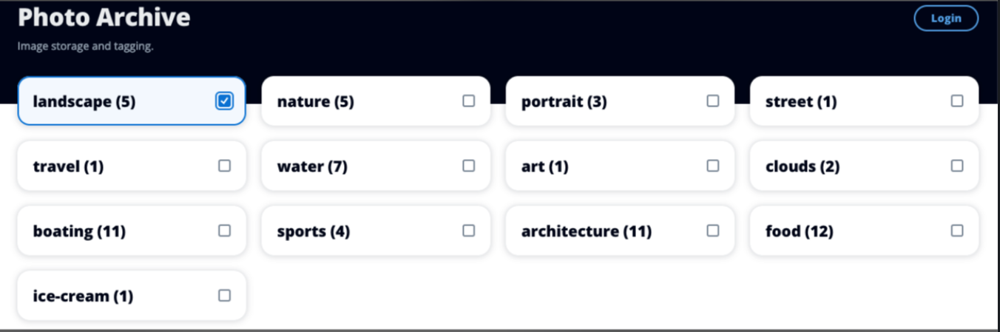
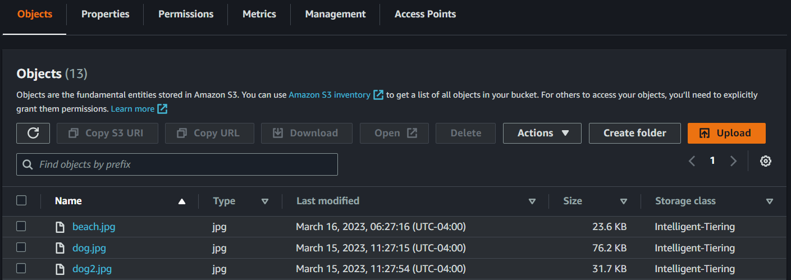
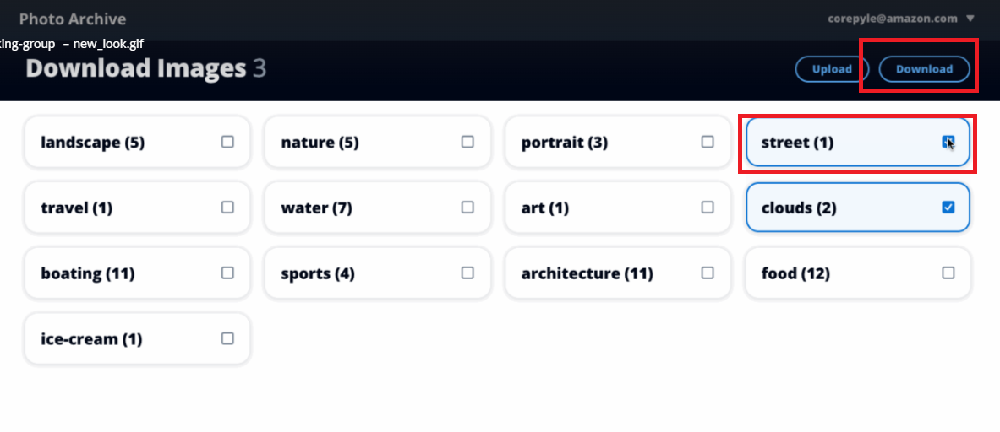
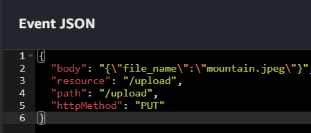

#  Creating a photo asset management application using the AWS SDK for Java

## Overview

| Heading      | Description |
| -----------  | ----------- |
| Description  | Discusses how to develop a photo asset management application that lets users manage photos using labels. This application is developed by using the AWS SDK for Java (v2).     |
| Audience     |  Developer (beginner / intermediate)        |
| Updated      | 3/29/2023        |
| Required skills   | Java, Maven  |

## Purpose

You can create a Photo Asset Management (PAM) application that lets users upload images. The images are sent to Amazon Rekognition, which detects labels. Then, the images are stored using Amazon Simple Storage Service (Amazon S3) Intelligent-Tiering for cost savings. The labels are stored in an Amazon DynamoDB table. Later, users can request a bundle of images matching those labels. When images are requested, they are retrieved from Amazon S3, placed into a zip file, and a link to the zip file is sent to the user by using Amazon Simple Notification Service (Amazon SNS).

The following illustration shows the AWS services used in the PAM application. 


As displayed in this illustration, the PAM application uses the following AWS services:

* Amazon Rekognition
* Amazon DynamoDB 
* Amazon S3
* Amazon SNS
* AWS Lambda 
* Amazon Cognito
* Amazon API Gateway

#### Topics

+ Prerequisites
+ Understand the photo asset management application
+ Create an IntelliJ project named SpringPhotoAnalyzer
+ Add the POM dependencies to your project
+ Create the Java classes
+ Deploy the AWS resources

## Prerequisites

To complete the tutorial, you need the following:

+ An AWS account
+ A Java IDE (this tutorial uses the IntelliJ IDE)
+ Java JDK 11
+ Maven 3.6 or later

### Important

+ The AWS services included in this document are included in the [AWS Free Tier](https://aws.amazon.com/free/?all-free-tier.sort-by=item.additionalFields.SortRank&all-free-tier.sort-order=asc).
+  This code has not been tested in all AWS Regions. Some AWS services are available only in specific Regions. For more information, see [AWS Regional Services](https://aws.amazon.com/about-aws/global-infrastructure/regional-product-services). 
+ Running this code might result in charges to your AWS account. 
+ Be sure to delete all of the resources you create while going through this tutorial so that you won't be charged.
+ Also make sure to properly set up your development environment. For information, see [Setting up the AWS SDK for Java 2.x](https://docs.aws.amazon.com/sdk-for-java/latest/developer-guide/setup.html).

### Creating the resources

The required AWS resources are created by using an AWS Cloud Development Kit (AWS CDK) script. This is discussed later in the document. There is no need to create any resources by using the AWS Management Console. 

## Understand the photo asset management application

The front end of the PAM application is a React application that uses the [Cloudscape Design System](https://cloudscape.design/). The application supports uploading images to an S3 bucket by sending a request that generates a presigned Amazon S3 URL. The presigned URL is returned to the application and is used to upload an image. 

After a user authenticates by using Amazon Cognito, the application displays all labels and the corresponding label count. 



### What happens after an image is uploaded to an S3 bucket

After an image is uploaded into the storage bucket, an AWS Lambda function is automatically triggered that performs the following tasks:

1. Sends the image to Amazon Rekognition, which creates a series of labels.
2. Stores the label data in an Amazon DynamoDB table. 

The following illustration shows the Amazon DynamoDB table storing label data. A label is the partition key which means it can only be added once. Each time an existing tag is detected, the count column is incremented.


The PAM application uses a lifecycle rule that places all images into an **Intelligent-Tiering** storage class at midnight. An Amazon S3 lifecycle configuration is a set of rules that define actions that Amazon S3 applies to a group of objects. For more information about an Amazon S3 lifecycle, see [Managing your storage lifecycle](https://docs.aws.amazon.com/AmazonS3/latest/userguide/object-lifecycle-mgmt.html).

The following illustration shows Amazon S3 objects that are stored in the storage class. 



**Note**: For more information about Amazon S3 storage classes, see [Amazon S3 Storage Classes](https://aws.amazon.com/s3/storage-classes/).

To retrieve images, select the given labels and choose **Download**. 



The application dynamically creates a .zip file, stores the file in the Amazon S3 working bucket, presigns the file, and sends a notification message by using Amazon SNS. The message contains the presigned URL that's used to download the file.


### Understand the AWS resources used by the PAM application 	

This section describes the AWS resources that the PAM application uses. You do not have to manually deploy any of these AWS resources, such as the AWS Lambda functions, by using the AWS Management Console. Instead, you can deploy all of them by running a provided AWS CDK script. Instructions on how to deploy these AWS resources are provided later in this document. 

#### AWS Lambda functions

The backend of the PAM application is implemented by using these AWS Lambda functions:

- **Upload** - Uploads an image to an S3 bucket by using a presigned URL. 
- **DetectLabelsFn** - An Amazon S3 trigger function that is invoked when an image is uploaded or copied to the S3 storage bucket.
- **LabelsFn** - Returns the labels and label count of images in the S3 storage bucket. 
- **PrepareDowload** - Retrieves the keys of all images that corresponds to the labels in the JSON data. Places all images in a zip file, presigns the zip file, and sends a notification message using Amazon SNS. The message contains a link to the zip file.

**Note**: These AWS Lambda names are short names. The full names that appear in the AWS Management Console depend on how you configure the provided AWS CDK script. Full names appear as {PAM_NAME}{Function Name}. For example, **MyApp-LambdasDetectLabelsFn**.

The following table describes the AWS Lambda functions used by this application. 
| Function        |Trigger                 | Input                            | Output                                      | Uses                                |
| -------------   | ---------------------- | ---------------------------------| --------------------------------------------| ------------------------------------|
| Upload          | APIG PUT /upload       | See following example            | See following example                       | Storage bucket                      |  
| DetectLabels    | S3 PutObject jpeg      | See following example            | N/A                                         | Label table                         | 
| PrepareDowload  | APIG POST /download    | {"labels": ["Mountain", "Lake"]} | N/A                                         | Labels table / Working bucket       |
| LabelsFn        | APIG GET /labels       | N/A                              | {"labels": {"maintain": {"count": 5}}       | Storage bucket, Label table         |   
|                 |                        |                                  |                                             |                                     |  

	
**Note**: The Java application logic required to build these AWS Lambda functions is located later in this document.  	

**Upload**

The following JSON represents the input for the **UploadFn** Lambda function.

```xml
{
  "body": "{\"file_name\":\"mountain.jpg\"}",
  "resource": "/upload",
  "path": "/upload",
  "httpMethod": "PUT"
}

```	
You need to use this JSON if you want to test your AWS Lambda function by using the AWS Management Console. You specify the JSON in the **Event JSON** section, as shown in the following illustration. 



This Lambda function returns JSON that contains the presigned URL that can be used to upload the .jpg file specified in the URL (in this example, mountain.jpg). 

```xml
{
  "statusCode": 200,
  "headers": {
    "Access-Control-Allow-Origin": "*"
  },
  "body": "{\"url\":\"https://xxxxxxxxxxxx.amazonaws.com/xxxxxxxxxxxxxxx-mountain.jpg?X-Amz-Security-xxxxxxxxxxxxxxxxxxx\"}",
  "isBase64Encoded": false
 }
```	
 **LabelsFn**

The following JSON represents the input for the **LabelsFn** Lambda function.

```xml
  {
   "tags": "{}",
   "resource": "/labels",
   "path": "/labels",
   "httpMethod": "GET"
  }

```	

#### API Gateway
API Gateway provides HTTP API routes for the **UploadFn**, **LabelsFn**, **Labels**, and **DowloadFn** AWS Lambda functions. Parameters for all routes are provided in the body of the request in a JSON object. The following table describes the API Gateway routes.	
	
| Method        | Route            | Parameters                | Example response                                                | Lambda                      |
| ------------- | -----------------| --------------------------| --------------------------------------------------------------- | ----------------------------|
| PUT           | /upload          | filename: string          | {"url": "presigned URL"}                                        | UploadFn                    | 
| GET           | /labels          | N/A                       | {"labels": {"maintain": {"count": 5}, "lake": {"count": 3}}}    | LabelsFn                    |
| POST          | /download        | labels: string[]          | {} (event)                                                      | DowloadFn                   |  


#### S3 Buckets

The PAM application uses two S3 buckets: 

- **{NAME}-sdk-code-examples-pam-storage-bucket** - Used as the storage bucket.
- **{NAME}-sdk-code-examples-pam-working-bucket** - Used as the working bucket and provides zip download storage.
	
**Note**: The name value is defined when you run the AWS CDK script to setup the resources. This is discussed later in this document. 	

#### Amazon DynamoDB

The PAM application uses a DynamoDB table to track data. The Labels table naned **{NAME}-SDKCodeExamplesPAM-Labels** table contains the labels found by Amazon Rekognition. It has a simple primary key named **Label** with an attribute Label of type S. 
	
**Note**: This Amazon DynamoDB table is created when you run the AWS CDK script to set up the resources. This is discussed later in this document. 		
	
## Create an IntelliJ project named PhotoAssetRestSDK

1. In the IntelliJ IDE, choose **File**, **New**, **Project**.
2. In the **New Project** dialog box, choose **Maven**, and then choose **Next**.
3. For **GroupId**, enter **aws-spring**.
4. For **ArtifactId**, enter **PhotoAssetRestSDK**.
6. Choose **Next**.
7. Choose **Finish**.

## Add the POM dependencies to your project

At this point, you have a new project named **PhotoAssetRestSDK**.

**Note:** Be sure to use Java 11 (as shown in the following **pom.xml** file).

Make sure that the **pom.xml** file looks like the following.

```xml
   <?xml version="1.0" encoding="UTF-8"?>
<project xmlns="http://maven.apache.org/POM/4.0.0"
         xmlns:xsi="http://www.w3.org/2001/XMLSchema-instance"
         xsi:schemaLocation="http://maven.apache.org/POM/4.0.0 http://maven.apache.org/xsd/maven-4.0.0.xsd">
    <modelVersion>4.0.0</modelVersion>
    <groupId>org.example</groupId>
    <artifactId>PhotoAssetRestSDK</artifactId>
    <version>1.0-SNAPSHOT</version>
    <parent>
        <groupId>org.springframework.boot</groupId>
        <artifactId>spring-boot-starter-parent</artifactId>
        <version>2.7.4</version>
        <relativePath/> <!-- lookup parent from repository -->
    </parent>
    <properties>
        <java.version>11</java.version>
    </properties>
    <dependencyManagement>
        <dependencies>
            <dependency>
                <groupId>software.amazon.awssdk</groupId>
                <artifactId>bom</artifactId>
                <version>2.20.11</version>
                <type>pom</type>
                <scope>import</scope>
            </dependency>
        </dependencies>
    </dependencyManagement>
    <dependencies>
        <dependency>
            <groupId>software.amazon.awssdk</groupId>
            <artifactId>dynamodb</artifactId>
        </dependency>
        <dependency>
            <groupId>software.amazon.awssdk</groupId>
            <artifactId>dynamodb-enhanced</artifactId>
        </dependency>
        <dependency>
            <groupId>org.springframework.boot</groupId>
            <artifactId>spring-boot-starter-web</artifactId>
        </dependency>
        <dependency>
            <groupId>net.sourceforge.jexcelapi</groupId>
            <artifactId>jxl</artifactId>
            <version>2.6.12</version>
        </dependency>
        <dependency>
            <groupId>javax.mail</groupId>
            <artifactId>javax.mail-api</artifactId>
            <version>1.6.2</version>
        </dependency>
        <dependency>
            <groupId>com.sun.mail</groupId>
            <artifactId>javax.mail</artifactId>
            <version>1.6.2</version>
        </dependency>
        <dependency>
            <groupId>software.amazon.awssdk</groupId>
            <artifactId>s3-transfer-manager</artifactId>
            <version>2.19.8</version>
        </dependency>
        <dependency>
            <groupId>org.springframework.boot</groupId>
            <artifactId>spring-boot-starter-test</artifactId>
            <scope>test</scope>
            <exclusions>
                <exclusion>
                    <groupId>org.junit.vintage</groupId>
                    <artifactId>junit-vintage-engine</artifactId>
                </exclusion>
            </exclusions>
        </dependency>
        <dependency>
            <groupId>software.amazon.awssdk</groupId>
            <artifactId>ses</artifactId>
        </dependency>
        <dependency>
            <groupId>software.amazon.awssdk</groupId>
            <artifactId>rekognition</artifactId>
        </dependency>
        <dependency>
            <groupId>com.amazonaws</groupId>
            <artifactId>aws-lambda-java-events</artifactId>
            <version>3.9.0</version>
        </dependency>
        <dependency>
            <groupId>software.amazon.awssdk</groupId>
            <artifactId>s3</artifactId>
        </dependency>
        <dependency>
            <groupId>software.amazon.awssdk</groupId>
            <artifactId>s3control</artifactId>
        </dependency>
        <dependency>
            <groupId>com.amazonaws</groupId>
            <artifactId>aws-lambda-java-core</artifactId>
            <version>1.2.1</version>
        </dependency>
        <dependency>
            <groupId>org.json</groupId>
            <artifactId>json</artifactId>
            <version>20220924</version>
        </dependency>
        <dependency>
            <groupId>software.amazon.awssdk</groupId>
            <artifactId>sns</artifactId>
        </dependency>
        <dependency>
            <groupId>org.apache.maven.surefire</groupId>
            <artifactId>surefire-booter</artifactId>
            <version>3.0.0-M3</version>
        </dependency>
        <dependency>
            <groupId>com.google.code.gson</groupId>
            <artifactId>gson</artifactId>
            <version>2.10.1</version>
        </dependency>
        <dependency>
            <groupId>commons-io</groupId>
            <artifactId>commons-io</artifactId>
            <version>2.5</version>
        </dependency>
        <dependency>
            <groupId>com.googlecode.json-simple</groupId>
            <artifactId>json-simple</artifactId>
            <version>1.1</version>
        </dependency>
    </dependencies>
    <build>
        <plugins>
            <plugin>
                <artifactId>maven-surefire-plugin</artifactId>
                <version>2.22.2</version>
            </plugin>
            <plugin>
                <groupId>org.apache.maven.plugins</groupId>
                <artifactId>maven-shade-plugin</artifactId>
                <version>3.3.0</version>
                <configuration>
                    <createDependencyReducedPom>false</createDependencyReducedPom>
                </configuration>
                <executions>
                    <execution>
                        <phase>package</phase>
                        <goals>
                            <goal>shade</goal>
                        </goals>
                    </execution>
                </executions>
            </plugin>
        </plugins>
    </build>
</project>
```

## Create the Java classes

Create a Java package in the **main/java** folder named **com.example.photo**.

The Java files go into these packages.


### Handlers package

Create these Java classes in the **com.example.photo.handlers** package. These Java classes use the AWS Lambda Java runtime API to build the AWS Lambda functions described earlier in this document. Each class represents a handler for a separate AWS Lambda function. For more information about the AWS Lambda Java runtime API, see [AWS Lambda function handler in Java](https://docs.aws.amazon.com/lambda/latest/dg/java-handler.html).

+ **GetHandler** - The handler for the **LabelsFn** Lambda function. 
+ **RestoreHandler** - The handler for the **PrepareDowload** Lambda function.
+ **S3Trigger** - The handler for the **DetectLabelsFn** Lambda function. 
+ **UploadHandler** -The handler for the **UploadFn** Lambda function. 

#### GetHandler class

The following Java code represents the **GetHandler** class. 

```java
package com.example.photo.handlers;

import com.amazonaws.services.lambda.runtime.Context;
import com.amazonaws.services.lambda.runtime.RequestHandler;
import com.amazonaws.services.lambda.runtime.events.APIGatewayProxyRequestEvent;
import com.amazonaws.services.lambda.runtime.events.APIGatewayProxyResponseEvent;
import com.example.photo.WorkCount;
import com.example.photo.services.DynamoDBService;

import java.util.Map;
import java.util.TreeMap;

import static com.example.photo.PhotoApplicationResources.makeResponse;

public class GetHandler implements RequestHandler<APIGatewayProxyRequestEvent, APIGatewayProxyResponseEvent> {
    @Override
    public APIGatewayProxyResponseEvent handleRequest(APIGatewayProxyRequestEvent input, Context context) {
        context.getLogger().log("In Labels handler");

        DynamoDBService dbService = new DynamoDBService();
        Map<String, WorkCount> map = dbService.scanPhotoTable();

        context.getLogger().log("Retrieved photos: " + map.size());

        Map<String, Map<String, WorkCount>> data = new TreeMap<>();
        data.put("labels", map);

        return makeResponse(data);
    }
}

```

#### RestoreHandler class

The following Java code represents the **RestoreHandler** class. 
```java
package com.example.photo.handlers;

import com.amazonaws.services.lambda.runtime.Context;
import com.amazonaws.services.lambda.runtime.RequestHandler;
import com.amazonaws.services.lambda.runtime.events.APIGatewayProxyRequestEvent;
import com.amazonaws.services.lambda.runtime.events.APIGatewayProxyResponseEvent;
import com.example.photo.endpoints.DownloadEndpoint;
import com.example.photo.services.DynamoDBService;
import com.example.photo.services.S3Service;
import com.example.photo.services.SnsService;
import org.json.JSONObject;
import java.util.List;
import java.util.Map;
import java.util.stream.Collectors;

import static com.example.photo.PhotoApplicationResources.toJson;
import static com.example.photo.PhotoApplicationResources.CORS_HEADER_MAP;

public class RestoreHandler implements RequestHandler<APIGatewayProxyRequestEvent, APIGatewayProxyResponseEvent> {

  @Override
  public APIGatewayProxyResponseEvent handleRequest(APIGatewayProxyRequestEvent input, Context context) {
    try {
      context.getLogger().log("RestoreHandler handleRequest" + toJson(input));
      JSONObject body = new JSONObject(input.getBody());
      List<String> labels = body.getJSONArray("tags")
          .toList()
          .stream()
          .filter(String.class::isInstance)
          .map(String.class::cast)
          .collect(Collectors.toList());
      context.getLogger().log("Restoring labels " + toJson(labels));

      DownloadEndpoint restoreEndpoint = new DownloadEndpoint(new DynamoDBService(), new S3Service(), new SnsService());
      String url = restoreEndpoint.download("notify", labels);

      context.getLogger().log("Labels archived to URL " + url);

      Map<String, String> headersMap = Map.of(
          "Access-Control-Allow-Origin", "*");

      return new APIGatewayProxyResponseEvent()
          .withStatusCode(200)
          .withHeaders(headersMap)
          .withBody("{}")
          .withIsBase64Encoded(false);
    } catch (Exception e) {
      return new APIGatewayProxyResponseEvent()
          .withStatusCode(500)
          .withHeaders(CORS_HEADER_MAP)
          .withBody(toJson(e))
          .withIsBase64Encoded(false);
    }
  }
}

```

### S3Trigger class

The following is the **S3Trigger** class. Notice the use of **S3Event**. You can use this object to get access to the object that was placed into an S3 bucket. For more information, see [Class S3Event](https://javadoc.io/doc/com.amazonaws/aws-lambda-java-events/2.2.2/com/amazonaws/services/lambda/runtime/events/S3Event.html).

```java
 package com.example.photo.handlers;

import com.amazonaws.services.lambda.runtime.events.S3Event;
import com.amazonaws.services.lambda.runtime.Context;
import com.amazonaws.services.lambda.runtime.RequestHandler;
import com.example.photo.endpoints.UploadEndpoint;
import com.example.photo.services.AnalyzePhotos;
import com.example.photo.services.DynamoDBService;
import com.example.photo.services.S3Service;

// Tags the object after it's uploaded into the storage bucket.
public class S3Trigger implements RequestHandler<S3Event, String> {

    @Override
    public String handleRequest(S3Event event, Context context) {
        // Get the S3 bucket and object key from the Amazon S3 event.
        String bucketName = event.getRecords().get(0).getS3().getBucket().getName();
        String objectKey = event.getRecords().get(0).getS3().getObject().getKey();

        // Log the S3 bucket and object key in the log file.
        context.getLogger().log("S3 object name: s3://" + bucketName + "/" + objectKey);

        AnalyzePhotos photos = new AnalyzePhotos();
        DynamoDBService dbService = new DynamoDBService();
        S3Service s3Service = new S3Service();

        // Tag the file.
        UploadEndpoint endpoint = new UploadEndpoint(photos, dbService, s3Service);
        endpoint.tagAfterUpload(objectKey);

        context.getLogger().log("Tagged image");
        return "OK"; // Unused response.
    }
}

```

### UploadHandler class

The following Java code represents the **UploadHandler** class. 

```java
package com.example.photo.handlers;

import com.amazonaws.services.lambda.runtime.Context;
import com.amazonaws.services.lambda.runtime.RequestHandler;
import com.amazonaws.services.lambda.runtime.events.APIGatewayProxyRequestEvent;
import com.amazonaws.services.lambda.runtime.events.APIGatewayProxyResponseEvent;
import com.example.photo.services.S3Service;
import java.util.UUID;

import org.json.JSONObject;

import static com.example.photo.PhotoApplicationResources.makeResponse;
import static com.example.photo.PhotoApplicationResources.CORS_HEADER_MAP;

public class UploadHandler implements RequestHandler<APIGatewayProxyRequestEvent, APIGatewayProxyResponseEvent> {

    @Override
    public APIGatewayProxyResponseEvent handleRequest(APIGatewayProxyRequestEvent input, Context context) {
        JSONObject body = new JSONObject(input.getBody());
        context.getLogger().log("Got body: " + body);
        String fileName = body.getString("file_name");
        context.getLogger().log("Building URL for " + fileName);

        if (fileName == null || fileName.equals("")) {
            return new APIGatewayProxyResponseEvent()
                    .withStatusCode(400)
                    .withHeaders(CORS_HEADER_MAP)
                    .withBody("{\"error\":\"Missing filename\"}")
                    .withIsBase64Encoded(false);
        }
        UUID uuid = UUID.randomUUID();
        String uniqueFileName = uuid + "-" + fileName;

        S3Service s3Service = new S3Service();
        String signedURL = s3Service.signObjectToUpload(uniqueFileName);
        UploadResponse data = UploadResponse.from(signedURL);
        return makeResponse(data);
    }
}

class UploadResponse {
    private final String url;

    static UploadResponse from(String url) {
        return new UploadResponse(url);
    }

    private UploadResponse(String url) {
        this.url = url;
    }

    public String getURL() {
        return url;
    }
}
```

### Services package

Create these Java classes in the **com.example.photo.services** package. These Java classes use the AWS SDK for Java (v2) service clients to perform various AWS operations. For example, the **AnalyzePhotos** class generates labels given images stored in the S3 storage bucket.  

+ **AnalyzePhotos** - Uses the **RekognitionClient** to generate labels.  
+ **DynamoDBService** - Uses the **DynamoDbEnhancedClient** to perform CRUD operations on an Amazon DynamoDB table.  
+ **S3Service** -  Uses the **S3Client** to perform Amazon S3 operations.
+ **SnsService** - Uses the **SnsClient** to send a notification to the end user of the PAM application. 

 ### AnalyzePhotos class

 The following Java code represents the **AnalyzePhotos** class.

```java
package com.example.photo.services;

import com.example.photo.PhotoApplicationResources;
import com.example.photo.LabelCount;
import software.amazon.awssdk.services.rekognition.RekognitionClient;
import software.amazon.awssdk.services.rekognition.model.Image;
import software.amazon.awssdk.services.rekognition.model.DetectLabelsRequest;
import software.amazon.awssdk.services.rekognition.model.DetectLabelsResponse;
import software.amazon.awssdk.services.rekognition.model.Label;
import software.amazon.awssdk.services.rekognition.model.RekognitionException;
import java.util.ArrayList;
import java.util.List;
import software.amazon.awssdk.services.rekognition.model.S3Object;

public class AnalyzePhotos {
    public ArrayList<LabelCount> detectLabels(String bucketName, String key) {
        RekognitionClient rekClient = RekognitionClient.builder()
                .region(PhotoApplicationResources.REGION)
                .build();
        try {
            S3Object s3Object = S3Object.builder()
                    .bucket(bucketName)
                    .name(key)
                    .build();

            Image souImage = Image.builder()
                    .s3Object(s3Object)
                    .build();

            DetectLabelsRequest detectLabelsRequest = DetectLabelsRequest.builder()
                    .image(souImage)
                    .maxLabels(10)
                    .build();

            DetectLabelsResponse labelsResponse = rekClient.detectLabels(detectLabelsRequest);
            List<Label> labels = labelsResponse.labels();
            System.out.println("Detected labels for the given photo");
            ArrayList<LabelCount> list = new ArrayList<>();
            LabelCount item;
            for (Label label : labels) {
                item = new LabelCount();
                item.setKey(key); // identifies the photo
                item.setName(label.name());
                list.add(item);
            }
            return list;

        } catch (RekognitionException e) {
            System.out.println(e.getMessage());
            System.exit(1);
        }
        return null;
    }
}
```

### DynamoDBService class

The following Java code represents the **DynamoDBService** class. This class uses the Amazon DynamoDB Enhanced Client to perform updates to the DynamoDB table that the PAM application uses. For information about the Enhanced Client, see [Mapping items in DynamoDB tables](https://docs.aws.amazon.com/sdk-for-java/latest/developer-guide/examples-dynamodb-enhanced.html).

Furthermore, notice the **addSingleRecord** method. This adds a new item to the table. Notice that the count item is not updated using Java code. This is because the **count** field is updated automatically by using the **@DynamoDbAtomicCounter** located in the **Photo** class. Each time the **table.updateItem()** is invoked, the **count** field is incremented by one. For more information, see [Using atomic counters in the Enhanced DynamoDB AWS SDK for Java 2.x client](https://aws.amazon.com/blogs/developer/using-atomic-counters-in-the-enhanced-dynamodb-aws-sdk-for-java-2-x-client/).

```java
  package com.example.photo.services;

import com.example.photo.PhotoApplicationResources;
import com.example.photo.Label;
import com.example.photo.WorkCount;
import com.example.photo.LabelCount;
import software.amazon.awssdk.enhanced.dynamodb.DynamoDbEnhancedClient;
import software.amazon.awssdk.enhanced.dynamodb.DynamoDbTable;
import software.amazon.awssdk.enhanced.dynamodb.Key;
import software.amazon.awssdk.enhanced.dynamodb.TableSchema;
import software.amazon.awssdk.enhanced.dynamodb.model.QueryConditional;
import software.amazon.awssdk.services.dynamodb.DynamoDbClient;
import java.util.ArrayList;
import java.util.HashMap;
import java.util.Iterator;
import java.util.List;
import java.util.Map;

public class DynamoDBService {
    private DynamoDbClient getClient() {
        return DynamoDbClient.builder()
            .region(PhotoApplicationResources.REGION)
            .build();
    }

    // Insert label data into an Amazon DynamoDB table.
    public void putRecord(List<LabelCount> list) {
        DynamoDbEnhancedClient enhancedClient = DynamoDbEnhancedClient.builder()
            .dynamoDbClient(getClient())
            .build();

        DynamoDbTable<com.example.photo.Label> table = enhancedClient.table(PhotoApplicationResources.LABELS_TABLE,
            TableSchema.fromBean(Label.class));

        for (LabelCount count : list) {
            addSingleRecord(table, count.getName(), count.getKey());
        }
    }

    private void addSingleRecord(DynamoDbTable<Label> table, String label, String key) {
        // Check to see if the label exists in the Amazon DynamoDB table.
        // The count item uses an @DynamoDbAtomicCounter which means it is
        // updated automatically. No need to manually set this value when the record is
        // created or updated.
        if (!checkLabelExists(table, label)) {
            Label photoRec = new Label();
            photoRec.setId(label);
            List<String> keyList = new ArrayList<>();
            keyList.add(key);
            photoRec.setImages(keyList);
            table.putItem(photoRec);
        } else {
            // The label exists in the table.
            Key myKey = Key.builder()
                .partitionValue(label)
                .build();

            // Add the file name to the list.
            Label myPhoto = table.getItem(myKey);
            Label updatedPhoto = new Label();
            List<String> imageList = myPhoto.getImages();
            imageList.add(key);
            updatedPhoto.setId(label);
            updatedPhoto.setImages(imageList);
            table.updateItem(updatedPhoto);
        }
    }

    private Boolean checkLabelExists(DynamoDbTable<Label> table, String label) {
        QueryConditional queryConditional = QueryConditional.keyEqualTo(Key.builder()
            .partitionValue(label)
            .build());

        Iterator<Label> results = table.query(queryConditional).items().iterator();
        return results.hasNext();
    }

    public List<String> getImagesByLabel(String label) {
        DynamoDbEnhancedClient enhancedClient = DynamoDbEnhancedClient.builder()
            .dynamoDbClient(getClient())
            .build();

        DynamoDbTable<com.example.photo.Label> table = enhancedClient.table(PhotoApplicationResources.LABELS_TABLE,
            TableSchema.fromBean(Label.class));
        Key key = Key.builder()
            .partitionValue(label)
            .build();

        // Get the item by using the key.
        Label result = table.getItem(r -> r.key(key));
        return (result == null) ? List.of() : result.getImages();
    }

    // Scan the table and send data back to the client.
    public Map<String, WorkCount> scanPhotoTable() {
        Map<String, WorkCount> myMap = new HashMap<>();
        DynamoDbEnhancedClient enhancedClient = DynamoDbEnhancedClient.builder()
            .dynamoDbClient(getClient())
            .build();

        DynamoDbTable<Label> table = enhancedClient.table(PhotoApplicationResources.LABELS_TABLE,
            TableSchema.fromBean(Label.class));

        for (Label photo : table.scan().items()) {
            WorkCount wc = new WorkCount();
            wc.setCount(photo.getCount());
            myMap.put(photo.getId(), wc);
        }

        return myMap;
    }
}
```

 ### S3Service class

 The following Java code represents the **S3Service** class.

```java
package com.example.photo.services;

import com.example.photo.PhotoApplicationResources;
import software.amazon.awssdk.auth.credentials.EnvironmentVariableCredentialsProvider;
import software.amazon.awssdk.core.ResponseBytes;
import software.amazon.awssdk.core.sync.RequestBody;
import software.amazon.awssdk.services.s3.S3Client;
import software.amazon.awssdk.services.s3.model.*;
import software.amazon.awssdk.services.s3.presigner.S3Presigner;
import software.amazon.awssdk.services.s3.presigner.model.GetObjectPresignRequest;
import software.amazon.awssdk.services.s3.presigner.model.PresignedGetObjectRequest;
import software.amazon.awssdk.services.s3.presigner.model.PresignedPutObjectRequest;
import software.amazon.awssdk.services.s3.presigner.model.PutObjectPresignRequest;
import java.io.ByteArrayOutputStream;
import java.io.IOException;
import java.time.Duration;
import java.util.*;
import java.util.zip.ZipEntry;
import java.util.zip.ZipOutputStream;

public class S3Service {
    // Create the S3Client object.
    private S3Client getClient() {
        return S3Client.builder()
            .region(PhotoApplicationResources.REGION)
            .build();
    }

    public byte[] getObjectBytes(String bucketName, String keyName) {
        S3Client s3 = getClient();
        try {
            GetObjectRequest objectRequest = GetObjectRequest
                .builder()
                .key(keyName)
                .bucket(bucketName)
                .build();

            ResponseBytes<GetObjectResponse> objectBytes = s3.getObjectAsBytes(objectRequest);
            return objectBytes.asByteArray();
        } catch (S3Exception e) {
            System.err.println(e.awsErrorDetails().errorMessage());
            e.printStackTrace();
            throw e;
        }
    }

    // Returns the names of all images in the given bucket.
    public List<String> listBucketObjects(String bucketName) {
        S3Client s3 = getClient();
        String keyName;
        List<String> keys = new ArrayList<>();
        try {
            ListObjectsRequest listObjects = ListObjectsRequest
                .builder()
                .bucket(bucketName)
                .build();

            ListObjectsResponse res = s3.listObjects(listObjects);
            List<S3Object> objects = res.contents();
            for (S3Object myValue : objects) {
                keyName = myValue.key();
                keys.add(keyName);
            }

            return keys;
        } catch (S3Exception e) {
            System.err.println(e.awsErrorDetails().errorMessage());
            e.printStackTrace();
            throw e;
        }
    }

    // Places an image into a S3 bucket.
    public void putObject(byte[] data, String bucketName, String objectKey) {
        S3Client s3 = getClient();
        try {
            s3.putObject(PutObjectRequest.builder()
                    .bucket(bucketName)
                    .key(objectKey)
                    .build(),
                RequestBody.fromBytes(data));
        } catch (S3Exception e) {
            System.err.println(e.getMessage());
            e.printStackTrace();
            throw e;
        }
    }

    // Pass a map and get back a byte[] that represents a ZIP of all images.
    public byte[] listBytesToZip(Map<String, byte[]> mapReport) throws IOException {
        ByteArrayOutputStream baos = new ByteArrayOutputStream();
        ZipOutputStream zos = new ZipOutputStream(baos);
        for (Map.Entry<String, byte[]> report : mapReport.entrySet()) {
            ZipEntry entry = new ZipEntry(report.getKey());
            entry.setSize(report.getValue().length);
            zos.putNextEntry(entry);
            zos.write(report.getValue());
        }
        zos.closeEntry();
        zos.close();
        return baos.toByteArray();
    }

    // Copy objects from the source bucket to storage bucket.
    public int copyFiles(String sourceBucket) {
        S3Client s3 = getClient();

        int count = 0;
        // Only move .jpg images.
        ListObjectsV2Request request = ListObjectsV2Request.builder()
            .bucket(sourceBucket)
            .build();

        ListObjectsV2Response response = s3.listObjectsV2(request);
        for (S3Object s3Object : response.contents()) {
            // Check to make sure the object does not exist in the bucket. If the object
            // exists it will not be copied again.
            String key = s3Object.key();
            if (checkS3ObjectDoesNotExist(key)) {
                System.out.println("Object exists in the bucket.");
            } else if ((key.endsWith(".jpg")) || (key.endsWith(".jpeg"))) {
                System.out.println("JPG object found and will be copied: " + key);
                copyS3Object(sourceBucket, key);
                count++;
            }
        }

        return count;
    }

    // Returns true if object exists.
    public boolean checkS3ObjectDoesNotExist(String keyName) {
        S3Client s3 = getClient();
        HeadObjectRequest headObjectRequest = HeadObjectRequest.builder()
            .bucket(PhotoApplicationResources.STORAGE_BUCKET)
            .key(keyName)
            .build();

        try {
            HeadObjectResponse response = s3.headObject(headObjectRequest);
            String contentType = response.contentType();
            if (contentType.length() > 0)
                return true;
        } catch (S3Exception e) {
            System.err.println(e.awsErrorDetails().errorMessage());
            e.printStackTrace();
            throw e;
        }
        return false;
    }

    public void copyS3Object(String sourceBucket, String objectKey) {
        S3Client s3 = getClient();

        CopyObjectRequest copyReq = CopyObjectRequest.builder()
            .sourceBucket(sourceBucket)
            .sourceKey(objectKey)
            .destinationBucket(PhotoApplicationResources.STORAGE_BUCKET)
            .destinationKey(objectKey)
            .build();

        try {
            s3.copyObject(copyReq);
        } catch (S3Exception e) {
            System.err.println(e.awsErrorDetails().errorMessage());
            e.printStackTrace();
            throw e;
        }
    }

    // New method to sign an object prior to uploading it.
    public String signObjectToDownload(String bucketName, String keyName) {
        S3Presigner presignerOb = S3Presigner.builder()
            .region(PhotoApplicationResources.REGION)
            .credentialsProvider(EnvironmentVariableCredentialsProvider.create())
            .build();

        try {
            GetObjectRequest getObjectRequest = GetObjectRequest.builder()
                .bucket(bucketName)
                .key(keyName)
                .build();

            GetObjectPresignRequest getObjectPresignRequest = GetObjectPresignRequest.builder()
                .signatureDuration(Duration.ofMinutes(1440))
                .getObjectRequest(getObjectRequest)
                .build();

            PresignedGetObjectRequest presignedGetObjectRequest = presignerOb.presignGetObject(getObjectPresignRequest);

            return presignedGetObjectRequest.url().toString();
        } catch (S3Exception e) {
            System.err.println(e.getMessage());
            e.printStackTrace();
            throw e;
        }
    }

    public String signObjectToUpload(String keyName) {
        S3Presigner presigner = S3Presigner.builder()
            .region(PhotoApplicationResources.REGION)
            .build();

        try {
            PutObjectRequest objectRequest = PutObjectRequest.builder()
                .bucket(PhotoApplicationResources.STORAGE_BUCKET)
                .key(keyName)
                .contentType("image/jpeg")
                .build();

            PutObjectPresignRequest presignRequest = PutObjectPresignRequest.builder()
                .signatureDuration(Duration.ofMinutes(5))
                .putObjectRequest(objectRequest)
                .build();

            PresignedPutObjectRequest presignedRequest = presigner.presignPutObject(presignRequest);
            return presignedRequest.url().toString();
        } catch (S3Exception e) {
            System.err.println(e.getMessage());
            e.printStackTrace();
            throw e;
        }
    }
}
```

### SnsService class

The following Java code represents the **SnsService** class.

```java
 package com.example.photo.services;

import com.example.photo.PhotoApplicationResources;
import software.amazon.awssdk.auth.credentials.EnvironmentVariableCredentialsProvider;
import software.amazon.awssdk.services.sns.SnsClient;
import software.amazon.awssdk.services.sns.model.CreateTopicRequest;
import software.amazon.awssdk.services.sns.model.CreateTopicResponse;
import software.amazon.awssdk.services.sns.model.PublishRequest;
import software.amazon.awssdk.services.sns.model.PublishResponse;
import software.amazon.awssdk.services.sns.model.SnsException;
import software.amazon.awssdk.services.sns.model.SubscribeRequest;

public class SnsService {
    private SnsClient getClient() {
        return SnsClient.builder()
            .credentialsProvider(EnvironmentVariableCredentialsProvider.create())
            .region(PhotoApplicationResources.REGION)
            .build();
    }

    public String createNotificationTopic(String notify, String jobId) {
        CreateTopicResponse response = getClient().createTopic(
            CreateTopicRequest.builder()
                .name(jobId + "-notify-" + notify)
                .build());
        String topicArn = response.topicArn();

        getClient().subscribe(
            SubscribeRequest.builder()
                .topicArn(topicArn)
                .protocol(notify.contains("@") ? "email" : "sms")
                .endpoint(notify)
                .build());

        return topicArn;
    }

    public PublishResponse subTextSNS(String phoneNumber, String presignedURL) {
        try {
            String message = "Your Archived images can be located here " + presignedURL;
            PublishRequest request = PublishRequest.builder()
                .message(message)
                .phoneNumber(phoneNumber)
                .build();

            PublishResponse result = getClient().publish(request);
            System.out.println(result.messageId() + " Message sent. Status was " + result.sdkHttpResponse().statusCode());
            return result;
        } catch (SnsException e) {
            System.err.println(e.awsErrorDetails().errorMessage());
            e.printStackTrace();
            throw e;
        }
    }

    public PublishResponse pubTopic(String message) {
        PublishRequest request = PublishRequest.builder()
            .message(message)
            .topicArn(PhotoApplicationResources.TOPIC_ARN)
            .build();

        return getClient().publish(request);
    }
}

```

### Endpoints package

Create these Java classes in the **com.example.photo.endpoints** package.   

+ **DownloadEndpoint** - Contains application logic to download an archive zip file.  
+ **UploadEndpoint** - Contains application logic to upload an image file, including storing the image in the S3 storage bucket.    

### DownloadEndpoint class

The following Java code represents the **DownloadEndpoint** class.

```java
 package com.example.photo.endpoints;

import com.example.photo.PhotoApplicationResources;
import com.example.photo.services.DynamoDBService;
import com.example.photo.services.S3Service;
import com.example.photo.services.SnsService;
import java.io.IOException;
import java.util.HashMap;
import java.util.List;
import java.util.Map;
import java.util.Set;
import java.util.stream.Collectors;

public class DownloadEndpoint {
    final DynamoDBService dbService;
    final S3Service s3Service;
    final SnsService snsService;

    public DownloadEndpoint(DynamoDBService dynamoDBService, S3Service s3Service, SnsService snsService) {
        this.dbService = dynamoDBService;
        this.s3Service = s3Service;
        this.snsService = snsService;
    }

    public String download(List<String> labels) {
        try {
            // Now that there's an image list, place the images into a ZIP and presign it.
            Set<String> images = labels.stream().parallel().flatMap(
                (label) -> this.dbService.getImagesByLabel(label).stream())
                .collect(Collectors.toSet());
            Map<String, byte[]> imageMap = new HashMap<>();

            for (String imageName : images) {
                byte[] imageBytes = this.s3Service.getObjectBytes(PhotoApplicationResources.STORAGE_BUCKET, imageName);
                imageMap.put(imageName, imageBytes);
                System.out.println("Add " + imageName + " to the map.");
            }

            // Now ZIP the images.
            byte[] zipFile = this.s3Service.listBytesToZip(imageMap);
            String uuid = java.util.UUID.randomUUID().toString();
            String zipName = uuid + ".zip";

            // Place the zip file into the working bucket and get back a presigned URL.
            s3Service.putObject(zipFile, PhotoApplicationResources.WORKING_BUCKET, zipName);
            String presignedURL = s3Service.signObjectToDownload(PhotoApplicationResources.WORKING_BUCKET, zipName);
            String message = "Your Archived images can be located here " + presignedURL;
            this.snsService.pubTopic(message);
            return presignedURL;
        } catch (IOException e) {
            e.getMessage();
        }
        return null;
    }
}

```

### UploadEndpoint class

The following Java code represents the **UploadEndpoint** class.

```java
package com.example.photo.endpoints;

import com.example.photo.PhotoApplicationResources;
import com.example.photo.LabelCount;
import com.example.photo.services.AnalyzePhotos;
import com.example.photo.services.DynamoDBService;
import com.example.photo.services.S3Service;

import java.util.List;

public class UploadEndpoint {
    final AnalyzePhotos analyzePhotos;
    final DynamoDBService dbService;
    final S3Service s3Service;

    public UploadEndpoint(AnalyzePhotos analyzePhotos, DynamoDBService dynamoDBService, S3Service s3Service) {
        this.analyzePhotos = analyzePhotos;
        this.dbService = dynamoDBService;
        this.s3Service = s3Service;
    }

    // This method has changed as the JPG has been placed into the bucket using a
    // presigned URL.
    public void tagAfterUpload(String name) {
        List<LabelCount> labels = analyzePhotos.detectLabels(PhotoApplicationResources.STORAGE_BUCKET, name);
        dbService.putRecord(labels);
    }

    // This method is only invoked from the Spring Controller and not the AWS Lambda
    // handler.
    public void upload(byte[] bytes, String name) {
        // Put the file into the bucket.
        s3Service.putObject(bytes, PhotoApplicationResources.STORAGE_BUCKET, name);
        this.tagAfterUpload(name);
    }

    // Copy every object in source bucket with suffix .jpe?g to Storage Bucket.
    public int copyFiles(String source) {
        return s3Service.copyFiles(source);
    }
}

```

### Photo package

Create these Java classes in the **com.example.photo** package.   

+ **Label** - Used as the DynamoDbBean for the enhanced client.  
+ **LabelCount** - Stores the values that are placed into the Amazon DynamoDB table. 
+ **PhotoApplicationResources** - Stores various values, such as the name of the S3 storage bucket for the application.
+ **WorkCount** - Stores label count for the application.

### Label class

The following Java code represents the **Label** class.

```java
package com.example.photo;

import software.amazon.awssdk.enhanced.dynamodb.extensions.annotations.DynamoDbAtomicCounter;
import software.amazon.awssdk.enhanced.dynamodb.mapper.annotations.DynamoDbAttribute;
import software.amazon.awssdk.enhanced.dynamodb.mapper.annotations.DynamoDbBean;
import software.amazon.awssdk.enhanced.dynamodb.mapper.annotations.DynamoDbPartitionKey;
import java.util.List;

@DynamoDbBean
public class Label {
    private String id;
    private Integer count;
    private List<String> images;

    @DynamoDbPartitionKey
    @DynamoDbAttribute("Label")
    public String getId() {
        return this.id;
    };

    public void setId(String id) {
        this.id = id;
    }

    @DynamoDbAtomicCounter(startValue = 1)
    public Integer getCount() {
        return this.count;
    }

    public void setCount(Integer count) {
        this.count = count;
    }

    public List<String> getImages() {
        return this.images;
    }

    public void setImages(List<String> images) {
        this.images = images;
    }
}


```

### LabelCount class

The following Java code represents the **LabelCount** class.

```java
package com.example.photo;

public class LabelCount {

    private String key;
    private String name;
    private int count;

    public void setKey(String key) {
        this.key = key;
    }

    public String getKey() {
        return this.key;
    }

    public void setName(String name) {
        this.name = name;
    }

    public String getName() {
        return this.name;
    }

    public int getCount() {
        return this.count;
    }

    public void setCount(int count) {
        this.count = count;
    }
}

```

### PhotoApplicationResources class

The following Java code represents the **PhotoApplicationResources** class.

```java
package com.example.photo;

import java.util.Map;

import com.amazonaws.services.lambda.runtime.events.APIGatewayProxyResponseEvent;
import com.google.gson.Gson;
import software.amazon.awssdk.regions.Region;

public class PhotoApplicationResources {

    public static final Region REGION = Region.of(System.getenv("AWS_REGION"));

    public static final String STORAGE_BUCKET = System.getenv("STORAGE_BUCKET_NAME");
    public static final String WORKING_BUCKET = System.getenv("WORKING_BUCKET_NAME");

    public static final String LABELS_TABLE = System.getenv("LABELS_TABLE_NAME");
    public static final String JOBS_TABLE = System.getenv("JOBS_TABLE_NAME");

    public static final String TOPIC_ARN = System.getenv("NOTIFICATION_TOPIC");

    public static final Map<String, String> CORS_HEADER_MAP = Map.of(
            "Access-Control-Allow-Origin", "*");
    public static final Gson gson = new Gson();

    public static String toJson(Object src) {
        return gson.toJson(src);
    }

    public static APIGatewayProxyResponseEvent makeResponse(Object src) {
        return new APIGatewayProxyResponseEvent()
                .withStatusCode(200)
                .withHeaders(CORS_HEADER_MAP)
                .withBody(toJson(src))
                .withIsBase64Encoded(false);
    }
}
```

### WorkCount class

The following Java code represents the **WorkCount** class.

```java
package com.example.photo;

public class WorkCount {

    private int count;

    public int getCount() {
        return this.count;
    }
    public void setCount(int count) {
        this.count = count;
    }
}
```


## Deploy the AWS resources

At this point, you have completed all of the application business logic required for the PAM application to work. Now you need to deploy the AWS resources, including the AWS Lambda functions and API Gateway endpoints in order for the application to work. Instead of deploying all of the resources manually by using the AWS Management Console, you can use a provided AWS CDK script. Using the CDK script makes it more efficient to deploy the resources. 

**Note**: For information about the AWS CDK, see [What is the AWS CDK](https://docs.aws.amazon.com/cdk/v2/guide/home.html).
		
For complete instuctions on how to run the supplied AWS CDK script, see [PAM CDK](https://github.com/awsdocs/aws-doc-sdk-examples/tree/main/resources/cdk/photo_asset_manager).

### Run the application

When you run the AWS CDK script, you can run the client application by using the Amazon Cloudfront distribution URL as specified in the supplied AWS CDK instructions. 

### Next steps
Congratulations! You have created and deployed the Photo Asset Management application. As stated at the beginning of this tutorial, be sure to delete all of the resources by following the AWS CDK instructions so that you won't continue to be charged for them.

For more AWS multiservice examples, see
[usecases](https://github.com/awsdocs/aws-doc-sdk-examples/tree/master/javav2/usecases).
