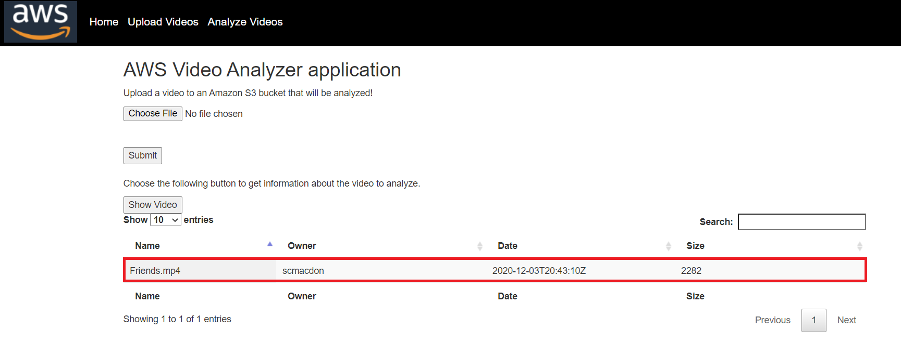
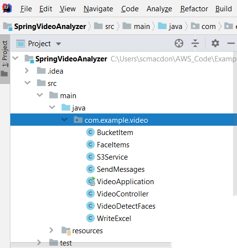

#  Creating AWS video analyzer applications using the AWS SDK for Java

## Purpose
You can create a Java web application that analyzes videos for label detection by using the Java SDK for Java version 2. The application created in this AWS tutorial lets you upload a video (MP4 file) to an Amazon Simple Storage Service (Amazon S3) bucket. Then the appliction uses the Amazon Rekognition service to analyze the video. The results are used to populate a data model and then a report is generated and emailed to a specific user by using the Amazon Simple Email Service (SES).

The following illustration shows a report that is generated after the application completes analyzing the video.


In this tutorial, you create a Spring Boot application that invokes various AWS services. The Spring Boot APIs are used to build a model, different views, and a controller. For more information, see [Spring Boot](https://spring.io/projects/spring-boot).

This application uses the following AWS services:
*	Amazon Rekognition
*	Amazon S3
*	Amazon SES
*	AWS Elastic Beanstalk

#### Topics

+ Prerequisites
+ Understand the AWS Video Analyzer application
+ Create an IntelliJ project named SpringVideoAnalyzer
+ Add the POM dependencies to your project
+ Create the Java classes
+ Create the HTML files
+ Create the script files
+ Package the project into a JAR file
+ Deploy the application to AWS Elastic Beanstalk

## Prerequisites

To complete the tutorial, you need the following:

+ An AWS account
+ A Java IDE (this tutorial uses the IntelliJ IDE)
+ Java JDK 1.8
+ Maven 3.6 or later

### Important

+ The AWS services included in this document are included in the [AWS Free Tier](https://aws.amazon.com/free/?all-free-tier.sort-by=item.additionalFields.SortRank&all-free-tier.sort-order=asc).
+  This code has not been tested in all AWS Regions. Some AWS services are available only in specific regions. For more information, see [AWS Regional Services](https://aws.amazon.com/about-aws/global-infrastructure/regional-product-services). 
+ Running this code might result in charges to your AWS account. 
+ Be sure to terminate all of the resources you create while going through this tutorial to ensure that you’re not charged.

### Creating the resources

An Amazon S3 bucket named **video[somevalue]**. Be sure to use this bucket name in your Amazon S3 Java code. For information, see [Creating a bucket](https://docs.aws.amazon.com/AmazonS3/latest/gsg/CreatingABucket.html).

You must create an IAM role and a valid SNS topic. You need to reference these values in the **VideoDetectFaces** class. If you do not set these values, the application that you create does not work. For information, see [Configuring Amazon Rekognition Video](https://docs.aws.amazon.com/rekognition/latest/dg/api-video-roles.html).  


## Understand the AWS Video Analyzer application

The AWS Video Analyzer application supports uploading a video (MP4 file) to an Amazon S3 bucket. After the video is uploaded, you can confirm that the video is located in the Amazon S3 bucket by choosing the **Show Video** button.



To generate a report, enter an email address and choose **Analyze Video**. A mask is displayed to let the user know the report is being created. 


**Note** Depending upon the size of the video, this may take a few minutes. To test this functionality, keep the video under 20 seconds. Also, there can only be one video in the Amazon S3 bucket. 

## Create an IntelliJ project named SpringVideoAnalyzer

1. In the IntelliJ IDE, choose **File**, **New**, **Project**.
2. In the **New Project** dialog box, choose **Maven**, and then choose **Next**.
3. For **GroupId**, enter **aws-spring**.
4. For **ArtifactId**, enter **SprinVideoAnalyzer**.
6. Choose **Next**.
7. Choose **Finish**.

## Add the POM dependencies to your project

At this point, you have a new project named **SpringVideoAnalyzer**.


Add the following dependencies for the Amazon services (AWS SDK for Java version 2).

    <dependency>
      <groupId>software.amazon.awssdk</groupId>
      <artifactId>ses</artifactId>
    </dependency>
    <dependency>
      <groupId>software.amazon.awssdk</groupId>
      <artifactId>rekognition</artifactId>
     </dependency>
     <dependency>
      <groupId>software.amazon.awssdk</groupId>
      <artifactId>s3</artifactId>
     </dependency>

   **Note:** Ensure that you are using Java 1.8 (as shown in the following **pom.xml** file).

   Add the Spring Boot dependencies. The **pom.xml** file looks like the following.

```xml
     <?xml version="1.0" encoding="UTF-8"?>
     <project xmlns="http://maven.apache.org/POM/4.0.0" xmlns:xsi="http://www.w3.org/2001/XMLSchema-instance"
         xsi:schemaLocation="http://maven.apache.org/POM/4.0.0 https://maven.apache.org/xsd/maven-4.0.0.xsd">
      <modelVersion>4.0.0</modelVersion>
      <groupId>SpringVideoAnalyzer</groupId>
      <artifactId>SpringVideoAnalyzer</artifactId>
      <version>1.0-SNAPSHOT</version>
     <parent>
        <groupId>org.springframework.boot</groupId>
        <artifactId>spring-boot-starter-parent</artifactId>
        <version>2.0.4.RELEASE</version>
        <relativePath/> <!-- lookup parent from repository -->
     </parent>
     <properties>
        <java.version>1.8</java.version>
     </properties>
     <dependencyManagement>
        <dependencies>
            <dependency>
                <groupId>software.amazon.awssdk</groupId>
                <artifactId>bom</artifactId>
                <version>2.10.54</version>
                <type>pom</type>
                <scope>import</scope>
            </dependency>
        </dependencies>
     </dependencyManagement>
     <dependencies>
        <dependency>
            <groupId>org.springframework.boot</groupId>
            <artifactId>spring-boot-starter-thymeleaf</artifactId>
        </dependency>
        <dependency>
            <groupId>org.springframework.boot</groupId>
            <artifactId>spring-boot-starter-web</artifactId>
        </dependency>
        <dependency>
            <groupId>net.sourceforge.jexcelapi</groupId>
            <artifactId>jxl</artifactId>
            <version>2.6.10</version>
        </dependency>
        <dependency>
            <groupId>commons-io</groupId>
            <artifactId>commons-io</artifactId>
            <version>2.6</version>
        </dependency>
        <dependency>
            <groupId>javax.mail</groupId>
            <artifactId>javax.mail-api</artifactId>
            <version>1.6.2</version>
        </dependency>
        <dependency>
            <groupId>javax.mail</groupId>
            <artifactId>javax.mail-api</artifactId>
            <version>1.5.5</version>
        </dependency>
        <dependency>
            <groupId>com.sun.mail</groupId>
            <artifactId>javax.mail</artifactId>
            <version>1.5.5</version>
        </dependency>
        <dependency>
            <groupId>org.springframework.boot</groupId>
            <artifactId>spring-boot-starter-test</artifactId>
            <scope>test</scope>
            <exclusions>
                <exclusion>
                    <groupId>org.junit.vintage</groupId>
                    <artifactId>junit-vintage-engine</artifactId>
                </exclusion>
            </exclusions>
        </dependency>
         <dependency>
            <groupId>software.amazon.awssdk</groupId>
            <artifactId>dynamodb</artifactId>
        </dependency>
        <dependency>
            <groupId>software.amazon.awssdk</groupId>
            <artifactId>ses</artifactId>
        </dependency>
        <dependency>
            <groupId>software.amazon.awssdk</groupId>
            <artifactId>rekognition</artifactId>
        </dependency>
        <dependency>
            <groupId>software.amazon.awssdk</groupId>
            <artifactId>s3</artifactId>
        </dependency>
      </dependencies>
      <build>
        <plugins>
            <plugin>
                <groupId>org.springframework.boot</groupId>
                <artifactId>spring-boot-maven-plugin</artifactId>
            </plugin>
        </plugins>
      </build>
     </project>
```

## Create the Java classes

Create a Java package in the **main/java** folder named **com.example.video**.


The Java files go into this package.



Create these Java classes:

+ **BucketItem** - Used as a model that stores Amazon S3 bucket information.   
+ **FaceItem** - Used as a model that stores details obtained by analyzing the video.
+ **S3Service** - Uses the Amazon S3 API to perform S3 operations.
+ **SendMessages** - Uses the Amazon SES API to send an email message with an attachment.
+ **VideoApplication** - Used as the base class for the Spring Boot application.
+ **VideoController** - Used as the Spring Boot controller that handles HTTP requests.
+ **VideoDetectFaces** - Uses the Amazon Rekognition API to analyze the video.
+ **WriteExcel** – Uses the JXL API (this is not an AWS API) to dynamically generate a report.     

### BucketItem class

The following Java code represents the **BucketItem** class that stores S3 object data.

```java
    package com.example.photo;

    public class BucketItem {

    private String key;
    private String owner;
    private String date ;
    private String size ;


    public void setSize(String size) {
        this.size = size ;
    }

    public String getSize() {
        return this.size ;
    }

    public void setDate(String date) {
        this.date = date ;
    }

    public String getDate() {
        return this.date ;
    }

    public void setOwner(String owner) {
        this.owner = owner ;
    }

    public String getOwner() {
        return this.owner ;
    }


    public void setKey(String key) {
        this.key = key ;
    }

    public String getKey() {
        return this.key ;
    }
    }
```    
    
### FaceItems class

The following Java code represents the **FaceItems** class that stores data returned by the Amazon Rekognition service.

```java
    package com.example.video;

    // Represents a model that stores labels detected in a video
    public class FaceItems {

    private String  ageRange;
    private String beard;
    private String eyeglasses;
    private String eyesOpen;
    private String mustache;
    private String smile;

    public String getAgeRange() {
        return this.ageRange ;
    }

    public void setAgeRange(String age) {
        this.ageRange = age ;
    }

    public String getBeard() {
        return this.beard ;
    }

    public void setBeard(String beard) {
             this.beard = beard ;
    }

    public String getEyesOpen() {
        return this.eyesOpen ;
    }

    public void setEyesOpen(String eyesOpen) {
        this.eyesOpen = eyesOpen ;
    }

    public String getEyeglasses() {
        return this.eyeglasses ;
    }

    public void setEyeglasses(String eyeglasses) {
        this.eyeglasses = eyeglasses ;
    }

    public String gettMustache() {
        return this.mustache ;
    }

    public void setMustache(String mustache) {

        this.mustache = mustache ;
    }

    public String gettSmile() {
        return this.smile ;
    }

    public void setSmile(String smile) {
        this.smile = smile ;
    }
   }
```

### S3Service class

The following class uses the Amazon S3 API to perform S3 operations. For example, the **putObject** method places the video into the specified Amazon S3 bucket. Be sure to replace the bucket name in this code example with your bucket name.

```java
    package com.example.video;

    import org.springframework.stereotype.Component;
    import org.w3c.dom.Document;
    import org.w3c.dom.Element;
    import software.amazon.awssdk.auth.credentials.EnvironmentVariableCredentialsProvider;
    import software.amazon.awssdk.core.sync.RequestBody;
    import software.amazon.awssdk.regions.Region;
    import software.amazon.awssdk.services.s3.S3Client;
    import software.amazon.awssdk.services.s3.model.*;
    import javax.xml.parsers.DocumentBuilder;
    import javax.xml.parsers.DocumentBuilderFactory;
    import javax.xml.parsers.ParserConfigurationException;
    import javax.xml.transform.Transformer;
    import javax.xml.transform.TransformerException;
    import javax.xml.transform.TransformerFactory;
    import javax.xml.transform.dom.DOMSource;
    import javax.xml.transform.stream.StreamResult;
    import java.io.StringWriter;
    import java.time.Instant;
    import java.util.ArrayList;
    import java.util.List;
    import java.util.ListIterator;

    @Component
    public class S3Service {

    private  S3Client s3 ;

    private S3Client getClient() {

        Region region = Region.US_EAST_1;
        S3Client s3 = S3Client.builder()
                .credentialsProvider(EnvironmentVariableCredentialsProvider.create())
                .region(region)
                .build();
        return s3;
    }

      // Places an image into a S3 bucket
      public String putObject(byte[] data, String bucketName, String objectKey) {

        s3 = getClient();

        // Delete the existing video - this use case can only have 1 MP4 file
        String objectName= getKeyName(bucketName);
        ArrayList<ObjectIdentifier> toDelete = new ArrayList<ObjectIdentifier>();
        toDelete.add(ObjectIdentifier.builder().key(objectName).build());

        try {

            DeleteObjectsRequest objectsRequest = DeleteObjectsRequest.builder()
                    .bucket(bucketName)
                    .delete(Delete.builder().objects(toDelete).build())
                    .build();
            s3.deleteObjects(objectsRequest);

            // Put a MP4 into the bucket
            PutObjectResponse response = s3.putObject(PutObjectRequest.builder()
                            .bucket(bucketName)
                            .key(objectKey)
                            .build(),
                    RequestBody.fromBytes(data));

            return response.eTag();

        } catch (S3Exception e) {
            System.err.println(e.getMessage());
            System.exit(1);
        }
        return "";
    }
    public String ListAllObjects(String bucketName) {

        s3 = getClient();
        long sizeLg;
        Instant DateIn;
        BucketItem myItem ;

        List bucketItems = new ArrayList<BucketItem>();
        try {
            ListObjectsRequest listObjects = ListObjectsRequest
                    .builder()
                    .bucket(bucketName)
                    .build();

            ListObjectsResponse res = s3.listObjects(listObjects);
            List<S3Object> objects = res.contents();

            for (ListIterator iterVals = objects.listIterator(); iterVals.hasNext(); ) {
                S3Object myValue = (S3Object) iterVals.next();
                myItem = new BucketItem();
                myItem.setKey(myValue.key());
                myItem.setOwner(myValue.owner().displayName());
                sizeLg = myValue.size() / 1024 ;
                myItem.setSize(String.valueOf(sizeLg));
                DateIn = myValue.lastModified();
                myItem.setDate(String.valueOf(DateIn));

                // Push the items to the list
                bucketItems.add(myItem);
            }

            return convertToString(toXml(bucketItems));

        } catch (S3Exception e) {
            System.err.println(e.awsErrorDetails().errorMessage());
            System.exit(1);
        }
        return null ;
     }

    public String getKeyName(String bucketName) {

            s3 = getClient();
            String keyName="";

            try {
                ListObjectsRequest listObjects = ListObjectsRequest
                        .builder()
                        .bucket(bucketName)
                        .build();

                ListObjectsResponse res = s3.listObjects(listObjects);
                List<S3Object> objects = res.contents();

                for (ListIterator iterVals = objects.listIterator(); iterVals.hasNext(); ) {
                    S3Object myValue = (S3Object) iterVals.next();
                    keyName = myValue.key();
                }

                return keyName;

            } catch (S3Exception e) {
                System.err.println(e.awsErrorDetails().errorMessage());
                System.exit(1);
            }
            return null ;
        }

     // Convert Bucket item data into XML to pass back to the view
     private Document toXml(List<BucketItem> itemList) {

        try {
            DocumentBuilderFactory factory = DocumentBuilderFactory.newInstance();
            DocumentBuilder builder = factory.newDocumentBuilder();
            Document doc = builder.newDocument();

            // Start building the XML
            Element root = doc.createElement( "Items" );
            doc.appendChild( root );

            // Get the elements from the collection
            int custCount = itemList.size();

            // Iterate through the collection
            for ( int index=0; index < custCount; index++) {

                // Get the WorkItem object from the collection
                BucketItem myItem = itemList.get(index);

                Element item = doc.createElement( "Item" );
                root.appendChild( item );

                // Set Key
                Element id = doc.createElement( "Key" );
                id.appendChild( doc.createTextNode(myItem.getKey()) );
                item.appendChild( id );

                // Set Owner
                Element name = doc.createElement( "Owner" );
                name.appendChild( doc.createTextNode(myItem.getOwner() ) );
                item.appendChild( name );

                // Set Date
                Element date = doc.createElement( "Date" );
                date.appendChild( doc.createTextNode(myItem.getDate() ) );
                item.appendChild( date );

                // Set Size
                Element desc = doc.createElement( "Size" );
                desc.appendChild( doc.createTextNode(myItem.getSize() ) );
                item.appendChild( desc );
            }

            return doc;
        } catch(ParserConfigurationException e) {
            e.printStackTrace();
        }
        return null;
       }

      private String convertToString(Document xml) {
        try {
            Transformer transformer = TransformerFactory.newInstance().newTransformer();
            StreamResult result = new StreamResult(new StringWriter());
            DOMSource source = new DOMSource(xml);
            transformer.transform(source, result);
            return result.getWriter().toString();

        } catch(TransformerException ex) {
            ex.printStackTrace();
        }
        return null;
       }
      }
 ```

**Note**: In this example, an **EnvironmentVariableCredentialsProvider** is used for the credentials. This is because this application is deployed to Elastic Beanstalk where environment variables are set (shown later in this tutorial).

### SendMessage class

The following Java code represents the **SendMessage** class. This class uses the Amazon SES API to send an email message with an attachment that represents the report.

```java
     package com.example.photo;

    import org.apache.commons.io.IOUtils;
    import software.amazon.awssdk.auth.credentials.EnvironmentVariableCredentialsProvider;
    import software.amazon.awssdk.regions.Region;
    import software.amazon.awssdk.services.ses.SesClient;
    import javax.activation.DataHandler;
    import javax.activation.DataSource;
    import javax.mail.Message;
    import javax.mail.MessagingException;
    import javax.mail.Session;
    import javax.mail.internet.InternetAddress;
    import javax.mail.internet.MimeMessage;
    import javax.mail.internet.MimeMultipart;
    import javax.mail.internet.MimeBodyPart;
    import javax.mail.util.ByteArrayDataSource;
    import java.io.ByteArrayOutputStream;
    import java.io.IOException;
    import java.io.InputStream;
    import java.nio.ByteBuffer;
    import java.util.Properties;
    import software.amazon.awssdk.core.SdkBytes;
    import software.amazon.awssdk.services.ses.model.SendRawEmailRequest;
    import software.amazon.awssdk.services.ses.model.RawMessage;
    import software.amazon.awssdk.services.ses.model.SesException;
    import org.springframework.stereotype.Component;

    @Component
    public class SendMessages {

    private String sender = "<enter email address>";

    // The subject line for the email.
    private String subject = "Analyzed Video report";

    // The email body for recipients with non-HTML email clients.
    private String bodyText = "Hello,\r\n" + "Please see the attached file for the analyzed video report.";

    // The HTML body of the email.
    private String bodyHTML = "<html>" + "<head></head>" + "<body>" + "<h1>Hello!</h1>"
            + "<p>Please see the attached file for the report that analyzed a video in the Amazon S3 bucket.</p>" + "</body>" + "</html>";

    public void sendReport(InputStream is, String emailAddress ) throws IOException {

        // Convert the InputStream to a byte[]
        byte[] fileContent = IOUtils.toByteArray(is);

        try {
            send(fileContent,emailAddress);
        } catch (MessagingException e) {
            e.getStackTrace();
        }
     }

     public void send(byte[] attachment, String emailAddress) throws MessagingException, IOException {

        MimeMessage message = null;
        Session session = Session.getDefaultInstance(new Properties());

        // Create a new MimeMessage object
        message = new MimeMessage(session);

        // Add subject, from, and to lines
        message.setSubject(subject, "UTF-8");
        message.setFrom(new InternetAddress(sender));
        message.setRecipients(Message.RecipientType.TO, InternetAddress.parse(emailAddress));

        // Create a multipart/alternative child container
        MimeMultipart msgBody = new MimeMultipart("alternative");

        // Create a wrapper for the HTML and text parts
        MimeBodyPart wrap = new MimeBodyPart();

        // Define the text part
        MimeBodyPart textPart = new MimeBodyPart();
        textPart.setContent(bodyText, "text/plain; charset=UTF-8");

        // Define the HTML part
        MimeBodyPart htmlPart = new MimeBodyPart();
        htmlPart.setContent(bodyHTML, "text/html; charset=UTF-8");

        // Add the text and HTML parts to the child container
        msgBody.addBodyPart(textPart);
        msgBody.addBodyPart(htmlPart);

        // Add the child container to the wrapper object
        wrap.setContent(msgBody);

        // Create a multipart/mixed parent container
        MimeMultipart msg = new MimeMultipart("mixed");

        // Add the parent container to the message
        message.setContent(msg);

        // Add the multipart/alternative part to the message
        msg.addBodyPart(wrap);

        // Define the attachment
        MimeBodyPart att = new MimeBodyPart();
        DataSource fds = new ByteArrayDataSource(attachment, "application/vnd.openxmlformats-officedocument.spreadsheetml.sheet");
        att.setDataHandler(new DataHandler(fds));

        String reportName = "VideoReport.xls";
        att.setFileName(reportName);

        // Add the attachment to the message
        msg.addBodyPart(att);

        // Try to send the email
        try {
            System.out.println("Attempting to send an email through Amazon SES " + "using the AWS SDK for Java...");

            Region region = Region.US_WEST_2;
            SesClient client = SesClient.builder()
                    .credentialsProvider(EnvironmentVariableCredentialsProvider.create())
                    .region(region)
                    .build();

            ByteArrayOutputStream outputStream = new ByteArrayOutputStream();
            message.writeTo(outputStream);
            ByteBuffer buf = ByteBuffer.wrap(outputStream.toByteArray());
            byte[] arr = new byte[buf.remaining()];
            buf.get(arr);

            SdkBytes data = SdkBytes.fromByteArray(arr);
            RawMessage rawMessage = RawMessage.builder()
                    .data(data)
                    .build();

            SendRawEmailRequest rawEmailRequest = SendRawEmailRequest.builder()
                    .rawMessage(rawMessage)
                    .build();

            client.sendRawEmail(rawEmailRequest);

        } catch (SesException e) {
            System.err.println(e.awsErrorDetails().errorMessage());
            System.exit(1);
        }
        System.out.println("Email sent with attachment.");
        }
       }
```

 ### VideoApplication class

 The following Java code represents the **VideoApplication** class.

```java
     package com.example.video;

    import org.springframework.boot.SpringApplication;
    import org.springframework.boot.autoconfigure.SpringBootApplication;

    @SpringBootApplication
    public class VideoApplication {

    public static void main(String[] args) {
        SpringApplication.run(VideoApplication.class, args);
     }
    }
 ```

### VideoController class

The following Java code represents the **VideoController** class that handles HTTP requests. For example, when a new video is uploaded to an Amazon S3 bucket, the **singleFileUpload** method handles the request.

```java
     package com.example.video;

    import org.springframework.beans.factory.annotation.Autowired;
    import org.springframework.stereotype.Controller;
    import org.springframework.web.bind.annotation.*;
    import javax.servlet.http.HttpServletRequest;
    import javax.servlet.http.HttpServletResponse;
    import org.springframework.web.servlet.ModelAndView;
    import org.springframework.web.multipart.MultipartFile;
    import org.springframework.web.servlet.view.RedirectView;
    import java.io.IOException;
    import java.io.InputStream;
    import java.util.*;

    @Controller
    public class VideoController {

    @Autowired
    S3Service s3Client;

    @Autowired
    WriteExcel excel ;

    @Autowired
    SendMessages sendMessage;

    @Autowired
    VideoDetectFaces detectFaces;

    @GetMapping("/")
    public String root() {
        return "index";
    }

    @GetMapping("/video")
    public String photo() {
        return "upload";
    }

    @GetMapping("/process")
    public String process() {
        return "process";
    }
    
    private String bucketName = "<Enter your bucket name>";

    @RequestMapping(value = "/getvideo", method = RequestMethod.GET)
    @ResponseBody
    String getImages(HttpServletRequest request, HttpServletResponse response) {

        return s3Client.ListAllObjects("scottexamplevideo");
    }

    // Upload a MP4 to an Amazon S3 bucket
    @RequestMapping(value = "/upload", method = RequestMethod.POST)
    @ResponseBody
    public ModelAndView singleFileUpload(@RequestParam("file") MultipartFile file) {

        try {
            byte[] bytes = file.getBytes();
            String name =  file.getOriginalFilename() ;

            // Put the MP4 file into an Amazon S3 bucket
            int yy = 0;
            s3Client.putObject(bytes, bucketName, name);
            // return "You have placed " +name + " into the S3 bucket";
        } catch (IOException e) {
            e.printStackTrace();
        }
        return new ModelAndView(new RedirectView("video"));
     }

     // generates a report after analyzing a video in an Amazon S3 bucket
     @RequestMapping(value = "/report", method = RequestMethod.POST)
     @ResponseBody
     String report(HttpServletRequest request, HttpServletResponse response) {

        String email = request.getParameter("email");
        String myKey = s3Client.getKeyName(bucketName);
        String jobNum = detectFaces.StartFaceDetection(bucketName, myKey);
        List<FaceItems> items = detectFaces.GetFaceResults(jobNum);
        InputStream excelData = excel.exportExcel(items);

        try {
            //email the report
            sendMessage.sendReport(excelData, email);

        } catch (Exception e) {

            e.printStackTrace();
        }
        return "The "+ myKey +" video has been successfully analyzed and the report is sent to "+email;
      } 
     }
```

**Note**: Change the **bucketName** variable to match your bucket. 

### VideoDetectFaces class
The following Java code represents the **VideoDetectFaces** class. This class uses the Amazon Rekognition API to analyze the video obtained from an Amazon S3 bucket. In this example, the video is analyzed by invoking the **RekognitionClient** object’s **startFaceDetection** method. This returns a **StartFaceDetectionResponse** object. You can get the job id number by invoking the **StartFaceDetectionResponse** object’s **jobId** method.

You can get the results of the job by invoking the **GetFaceResults** method. Notice in this code example, a while loop is used to wait until the job is finished. This method returns a list where each element is a **FaceItems** object. 

```java
    package com.example.video;

    import org.springframework.stereotype.Component;
    import software.amazon.awssdk.auth.credentials.EnvironmentVariableCredentialsProvider;
    import software.amazon.awssdk.regions.Region;
    import software.amazon.awssdk.services.rekognition.RekognitionClient;
    import software.amazon.awssdk.services.rekognition.model.*;
    import software.amazon.awssdk.services.rekognition.model.S3Object;
    import java.util.ArrayList;
    import java.util.List;

    @Component
    public class VideoDetectFaces {

    String topicArn = "<enter a topic ARN>";
    String roleArn = "<enter your role ARN>"

    private RekognitionClient getRecClient() {
        Region region = Region.US_EAST_1;
        RekognitionClient rekClient = RekognitionClient.builder()
                .credentialsProvider(EnvironmentVariableCredentialsProvider.create())
                .region(region)
                .build();
        return rekClient;
    }

    private NotificationChannel getChannel() {

        NotificationChannel channel = NotificationChannel.builder()
                .snsTopicArn(topicArn)
                .roleArn(roleArn)
                .build();
        return channel;
    }

    public String StartFaceDetection(String bucket, String video) {

     String startJobId="";

        try {

            RekognitionClient rekClient = getRecClient();
            software.amazon.awssdk.services.rekognition.model.S3Object s3Obj = S3Object.builder()
                    .bucket(bucket)
                    .name(video)
                    .build();

            Video vidOb = Video.builder()
                    .s3Object(s3Obj)
                    .build();

            StartFaceDetectionRequest faceDetectionRequest = StartFaceDetectionRequest.builder()
                    .jobTag("Faces")
                    .notificationChannel(getChannel())
                    .faceAttributes(FaceAttributes.ALL)
                    .video(vidOb)
                    .build();

            StartFaceDetectionResponse startLabelDetectionResult = rekClient.startFaceDetection(faceDetectionRequest);
            startJobId=startLabelDetectionResult.jobId();
            return startJobId;

        } catch(RekognitionException e) {
            System.out.println(e.getMessage());
            System.exit(1);
        }
        return "";
     }

     // Processes the Job and returns of List of labels
     public List<FaceItems> GetFaceResults(String startJobId) {

        List<FaceItems> items =new ArrayList<>();
        try {
            RekognitionClient rekClient = getRecClient();
            String paginationToken=null;
            GetFaceDetectionResponse faceDetectionResponse=null;
            Boolean finished = false;
            String status="";
            int yy=0 ;

            do{
                if (faceDetectionResponse !=null)
                    paginationToken = faceDetectionResponse.nextToken();

                GetFaceDetectionRequest recognitionRequest = GetFaceDetectionRequest.builder()
                        .jobId(startJobId)
                        .nextToken(paginationToken)
                        .maxResults(10)
                        .build();

                // Wait until the job succeeds
                while (!finished) {

                    faceDetectionResponse = rekClient.getFaceDetection(recognitionRequest);
                    status = faceDetectionResponse.jobStatusAsString();

                    if (status.compareTo("SUCCEEDED") == 0)
                        finished = true;
                    else {
                        System.out.println(yy + " status is: " + status);
                        Thread.sleep(1000);
                    }
                    yy++;
                }

                finished = false;

                // Push face information to the list
                List<FaceDetection> faces= faceDetectionResponse.faces();

                FaceItems faceItem;
                for (FaceDetection face: faces) {

                    faceItem = new FaceItems();

                    String age = face.face().ageRange().toString();
                    String beard = face.face().beard().toString();
                    String eyeglasses = face.face().eyeglasses().toString();
                    String eyesOpen = face.face().eyesOpen().toString();
                    String mustache = face.face().mustache().toString();
                    String smile = face.face().smile().toString();

                    faceItem.setAgeRange(age);
                    faceItem.setBeard(beard);
                    faceItem.setEyeglasses(eyeglasses);
                    faceItem.setEyesOpen(eyesOpen);
                    faceItem.setMustache(mustache);
                    faceItem.setSmile(smile);

                    items.add(faceItem);
                   }

            } while (faceDetectionResponse !=null && faceDetectionResponse.nextToken() != null);

            return items;


        } catch(RekognitionException | InterruptedException e) {
            System.out.println(e.getMessage());
            System.exit(1);
        }
        return null;
       }
      }
 ```

**Note**: Specifiy valid **topicArn** and **roleArn** values. See the **Prerequisites** section at the start of this tutorial. 

### WriteExcel class

The following Java code represents the **WriteExcel** class.

```java
     package com.example.video;

    import jxl.CellView;
    import jxl.Workbook;
    import jxl.WorkbookSettings;
    import jxl.format.UnderlineStyle;
    import jxl.write.Label;
    import jxl.write.Number;
    import jxl.write.WritableCellFormat;
    import jxl.write.WritableFont;
    import jxl.write.WritableSheet;
    import jxl.write.WritableWorkbook;
    import jxl.write.WriteException;
    import org.springframework.stereotype.Component;
    import java.io.IOException;
    import java.util.List;
    import java.util.Locale;

    @Component
    public class WriteExcel {

    private WritableCellFormat timesBoldUnderline;
    private WritableCellFormat times;

    // Returns an InputStream that represents the Excel Report
    public java.io.InputStream exportExcel( List<FaceItems> list) {

        try {
            java.io.InputStream is = write(list);
            return is ;
        } catch(WriteException | IOException e) {
            e.printStackTrace();
        }
        return null;
    }

    // Generates the report and returns an inputstream
    public java.io.InputStream write( List<FaceItems> list) throws IOException, WriteException {
        java.io.OutputStream os = new java.io.ByteArrayOutputStream() ;
        WorkbookSettings wbSettings = new WorkbookSettings();

        wbSettings.setLocale(new Locale("en", "EN"));

        // Create a Workbook - pass the OutputStream
        WritableWorkbook workbook = Workbook.createWorkbook(os, wbSettings);

        //Need to get the WorkItem from each list
        workbook.createSheet("Video Analyzer Sheet", 0);
        WritableSheet excelSheet = workbook.getSheet(0);
        createLabel(excelSheet);
        createContent(excelSheet, list);

        // Close the workbook
        workbook.write();
        workbook.close();

        // Get an inputStram that represents the Report
        java.io.ByteArrayOutputStream stream = new java.io.ByteArrayOutputStream();
        stream = (java.io.ByteArrayOutputStream)os;
        byte[] myBytes = stream.toByteArray();
        java.io.InputStream is = new java.io.ByteArrayInputStream(myBytes) ;

        return is ;
      }

     // Create Headings in the Excel spreadsheet
     private void createLabel(WritableSheet sheet)
            throws WriteException {
        // Create a times font
        WritableFont times10pt = new WritableFont(WritableFont.TIMES, 10);
        // Define the cell format
        times = new WritableCellFormat(times10pt);
        // Lets automatically wrap the cells
        times.setWrap(true);

        // create create a bold font with unterlines
        WritableFont times10ptBoldUnderline = new WritableFont(WritableFont.TIMES, 10, WritableFont.BOLD, false,
                UnderlineStyle.SINGLE);
        timesBoldUnderline = new WritableCellFormat(times10ptBoldUnderline);
        // Lets automatically wrap the cells
        timesBoldUnderline.setWrap(true);

        CellView cv = new CellView();
        cv.setFormat(times);
        cv.setFormat(timesBoldUnderline);
        cv.setAutosize(true);

        // Write a few headers
        addCaption(sheet, 0, 0, "Age Range");
        addCaption(sheet, 1, 0, "Beard");
        addCaption(sheet, 2, 0, "Eye glasses");
        addCaption(sheet, 3, 0, "Eyes open");
        addCaption(sheet, 4, 0, "Mustache");
        addCaption(sheet, 4, 0, "Smile");
     }

     // Write the Work Item Data to the Excel Report
     private int createContent(WritableSheet sheet, List<FaceItems> list) throws WriteException {

        int size = list.size() ;

        //  list
        for (int i = 0; i < size; i++) {

            FaceItems fi = (FaceItems)list.get(i);

            //Get tne item values
            String age = fi.getAgeRange();
            String beard = fi.getBeard();
            String eyeglasses = fi.getEyeglasses();
            String eyesOpen = fi.getEyesOpen();
            String mustache = fi.gettMustache();
            String smile = fi.gettSmile();

            addLabel(sheet, 0, i + 2, age);
            addLabel(sheet, 1, i + 2, beard);
            addLabel(sheet, 2, i + 2, eyeglasses);
            addLabel(sheet, 3, i + 2, eyesOpen);
            addLabel(sheet, 4, i + 2, mustache);
            addLabel(sheet, 5, i + 2, smile);
         }
        return size;
       }

     private void addCaption(WritableSheet sheet, int column, int row, String s)
            throws WriteException {
        Label label;
        label = new Label(column, row, s, timesBoldUnderline);

        int cc = countString(s);
        sheet.setColumnView(column, cc);
        sheet.addCell(label);
     }

    private void addNumber(WritableSheet sheet, int column, int row,
                           Integer integer) throws WriteException {
        Number number;
        number = new Number(column, row, integer, times);
        sheet.addCell(number);
     }

    private void addLabel(WritableSheet sheet, int column, int row, String s)
            throws WriteException {
        Label label;
        label = new Label(column, row, s, times);
        int cc = countString(s);
        if (cc > 200)
            sheet.setColumnView(column, 150);
        else
            sheet.setColumnView(column, cc+6);

        sheet.addCell(label);

     }

    private int countString (String ss) {
        int count = 0;
        //Counts each character except space
        for(int i = 0; i < ss.length(); i++) {
            if(ss.charAt(i) != ' ')
                count++;
        }
        return count;
      }
     }
 ```

## Create the HTML files

At this point, you have created all of the Java files required for the AWS Video Analyzer application. Now you create the HTML files that are required for the application's graphical user interface (GUI). Under the **resource** folder, create a **templates** folder, and then create the following HTML files:

+ index.html
+ process.html
+ upload.html
+ layout.html

The **index.html** file is the application's home view. The **process.html** file represents the view for creating a report. The **upload.html** file represents the view for uploading a MP4 file to an Amazon S3 bucket. The **layout.html** file represents the menu that's visible in all views.

### index.html

The following HTML represents the **index.html** file.

```html
    <!DOCTYPE html>
    <html xmlns:th="http://www.thymeleaf.org" >

    <head>
     <meta charset="utf-8" />
     <meta http-equiv="X-UA-Compatible" content="IE=edge" />
     <meta name="viewport" content="width=device-width, initial-scale=1" />
     <link rel="stylesheet" th:href="|https://maxcdn.bootstrapcdn.com/bootstrap/3.3.7/css/bootstrap.min.css|"/>
     <script th:src="|https://code.jquery.com/jquery-1.12.4.min.js|"></script>
     <script th:src="|https://code.jquery.com/ui/1.11.4/jquery-ui.min.js|"></script>
     <link rel="stylesheet" href="../public/css/styles.css" th:href="@{/css/styles.css}" />
     <link rel="icon" href="../public/images/favicon.ico" th:href="@{/images/favicon.ico}" />

    <title>AWS Video Analyzer</title>
    </head>
    <body>
     <header th:replace="layout :: site-header"/>
      <div class="container">

     <h2>AWS Video Analyzer application</h2>

     <p>The AWS Video Analyzer example application uses the Amazon Rekognition service and other AWS services, and the AWS SDK for Java version 2.
        Analyzing your videos in real-time has never been easier! Just perform these steps:<p>

     <ol>
        <li>Upload a video (.MP4) to an Amazon S3 bucket by choosing the <b>Upload Video</b> menu item.</li>
        <li>Choose <b>Choose Video File</b> and browse to a video located on your desktop.</li>
        <li>Choose <b>Upload</b> to upload your video to an Amazon S3 bucket.</li>
        <li>Choose <b>Get Video</b> to view the video located in the S3 bucket. Only 1 video can be in the bucket.</li>
        <li>Analyze the video and produce a report by choosing the <b>Analyze Video</b> menu item. </li>
        <li>Enter an email address in the email field and choose <b>Analyze Video</b>.  </li>
        <li>Amazon SES is used to send an email with an Excel report to the specified email recipient.</li>
     </ol>
    </div>
    </body>
    </html>
```

### process.html

The following HTML represents the **process.html** file.

```html
    <!DOCTYPE html>
     <html xmlns:th="http://www.thymeleaf.org">
     <head>
     <meta charset="utf-8" />
     <meta http-equiv="X-UA-Compatible" content="IE=edge" />
     <meta name="viewport" content="width=device-width, initial-scale=1" />

     <link rel="stylesheet" th:href="|https://maxcdn.bootstrapcdn.com/bootstrap/4.5.2/css/bootstrap.min.css|"/>
     <script th:src="|https://code.jquery.com/jquery-1.12.4.min.js|"></script>
     <script th:src="|https://code.jquery.com/ui/1.11.4/jquery-ui.min.js|"></script>
     <script th:src="|https://maxcdn.bootstrapcdn.com/bootstrap/4.5.2/js/bootstrap.min.js|"></script>
     <script th:src="|https://cdnjs.cloudflare.com/ajax/libs/popper.js/1.16.0/umd/popper.min.js|"></script>
     <script src="../public/js/message.js" th:src="@{/js/message.js}"></script>

     <link rel="stylesheet" href="../public/css/styles.css" th:href="@{/css/styles.css}" />
     <link rel="icon" href="../public/images/favicon.ico" th:href="@{/images/favicon.ico}" />

     <title>AWS Photo Analyzer</title>

     <script>
        function myFunction() {
            alert("The form was submitted");
        }
    </script>
    </head>
    <body>
    <header th:replace="layout :: site-header"/>

    <div class="container">

     <h2>AWS Video Analyzer Sample Application</h2>
     <p>You can generate a report that analyzes a video in an Amazon S3 bucket. You can send the report to the following email address. </p>
     <label for="email">Email address:</label><br>
     <input type="text" id="email" name="email" value=""><br>

      <div>
        <br>

        <p>Click the following button to analyze the video and obtain a report</p>
        <button id="button" onclick="ProcessImages()">Analyze Video</button>
       </div>
       <div id="spinner">
        <p>Report is being generated:</p>
        <div class="spinner-border"></div>
       </div>
      </div>
     </body>
     </html>
```

### upload.html

The following HTML represents the **upload.html** file.

```html
    <!DOCTYPE html>
     <html xmlns:th="http://www.thymeleaf.org" >
     <script th:src="|https://code.jquery.com/jquery-1.12.4.min.js|"></script>
     <script th:src="|https://code.jquery.com/ui/1.11.4/jquery-ui.min.js|"></script>
     <script th:src="|https://cdn.datatables.net/v/dt/dt-1.10.20/datatables.min.js|"></script>
     <script src="../public/js/items.js" th:src="@{/js/items.js}"></script>

     <link rel="stylesheet" th:href="|https://maxcdn.bootstrapcdn.com/bootstrap/3.3.7/css/bootstrap.min.css|"/>
     <link rel="stylesheet" th:href="|https://cdn.datatables.net/v/dt/dt-1.10.20/datatables.min.css|"/>
     <link rel="stylesheet" href="../public/css/styles.css" th:href="@{/css/styles.css}" />
     <link rel="icon" href="../public/images/favicon.ico" th:href="@{/images/favicon.ico}" />

     <title>AWS Video Analyzer</title>

     <script>
      function myFunction() {
        alert("The video was submitted");
       }
    </script>
    </head>

    <body>
    <header th:replace="layout :: site-header"/>

    <div class="container">
    <h2>AWS Video Analyzer application</h2>
    <p>Upload a video to an Amazon S3 bucket that will be analyzed!</p>

    <form method="POST" onsubmit="myFunction()" action="/upload" enctype="multipart/form-data">
        <input type="file" name="file" /><br/><br/>
        <input type="submit" value="Submit" />
    </form>
    <div>
        <br>

        <p>Choose the following button to get information about the video to analyze.</p>

        <button onclick="getVideo()">Show Video</button>
        <table id="myTable" class="display" style="width:100%">
            <thead>
            <tr>
                <th>Name</th>
                <th>Owner</th>
                <th>Date</th>
                <th>Size</th>
            </tr>
            </thead>
            <tbody>
            <tr>
                <td>No Data</td>
                <td>No Data</td>
                <td>No Data </td>
                <td>No Data</td>
            </tr>
            </tbody>
            <tfoot>
            <tr>
                <th>Name</th>
                <th>Owner</th>
                <th>Date</th>
                <th>Size</th>
            </tr>
            </tfoot>
            <div id="success3"></div>
        </table>
       </div>
      </div>
     </body>
     </html>
```

### layout.html

The following HTML represents the **layout.html** file for the application's menu.

```html
     <!DOCTYPE html>
      <html xmlns:th="http://www.thymeleaf.org">
      <head th:fragment="site-head">
      <meta charset="UTF-8" />
       <link rel="icon" href="../public/images/favicon.ico" th:href="@{/images/favicon.ico}" />
       <script th:src="|https://code.jquery.com/jquery-1.12.4.min.js|"></script>
       <meta th:include="this :: head" th:remove="tag"/>
     </head>
     <body>
      <!-- th:hef calls a controller method - which returns the view -->
     <header th:fragment="site-header">
     <a href="index.html" th:href="@{/}"></a>
     <a href="#" style="color: white" th:href="@{/}">Home</a>
     <a href="#" style="color: white" th:href="@{/video}">Upload Videos</a>
     <a href="#"  style="color: white" th:href="@{/process}">Analyze Videos</a>

    </header>
    <h1>Welcome</h1>
    <body>
    <p>Welcome to  AWS Video Analyzer.</p>
    </body>
    </html>
```
          
## Create script files

Both the upload and process views use script files to communicate with the Spring controller. You have to ensure that these files are part of your project; otherwise, your application won't work.

+ items.js
+ message.js

Both files contain application logic that sends a request to the Spring controller. In addition, these files handle the response and set the data in the view.

### items.js

The following JavaScript represents the **items.js** file.

```javascript
    $(function() {

    $('#myTable').DataTable( {
        scrollY:        "500px",
        scrollX:        true,
        scrollCollapse: true,
        paging:         true,
        columnDefs: [
            { width: 200, targets: 0 }
        ],
        fixedColumns: true
     } );
     } );


    function getVideo() {
     var xhr = new XMLHttpRequest();
     xhr.addEventListener("load", handlevideo, false);
     xhr.open("GET", "../getvideo", true);
     xhr.setRequestHeader("Content-type", "application/x-www-form-urlencoded");//necessary
     xhr.send();
    }

    function handlevideo() {

     var xml = event.target.responseText;
     var oTable = $('#myTable').dataTable();
     oTable.fnClearTable(true);
     $(xml).find('Item').each(function () {

        var $field = $(this);
        var key = $field.find('Key').text();
        var name = $field.find('Owner').text();
        var date = $field.find('Date').text();
        var size = $field.find('Size').text();

        //Set the new data
        oTable.fnAddData( [
            key,
            name,
            date,
            size,,]
        );
        });
        }
```

### message.js

The following JavaScript represents the **message.js** file. The **ProcessImages** function sends a request to the **/report** handler in the controller that generates a report. Notice that an email address is posted to the **Controller** method.

```javascript
   $(function() {

    $('#spinner').hide();

   } );

    function ProcessImages() {

     //Post the values to the controller
     var email =  $('#email').val();
     $('#spinner').show();
     $('#button').prop("disabled",true);

     var xhr = new XMLHttpRequest();
     xhr.addEventListener("load", handle, false);
     xhr.open("POST", "../report", true);   //buildFormit -- a Spring MVC controller
     xhr.setRequestHeader("Content-type", "application/x-www-form-urlencoded");//necessary
     xhr.send("email=" + email);
    }

    function handle(event) {

     var res = event.target.responseText;
     $('#spinner').hide();
     $('#button').prop("disabled",false);
     alert(res) ;
    }
```

**Note:** There are other CSS files located in the GitHub repository that you must add to your project. Ensure all of the files under the **resources** folder are included in your project.   

## Increase the timeout value for Elastic Beanstalk

When a request is made by the application to analyze a video, it may take longer then the default timeout value. You can increase the timeout setting for Elastic Beanstalk by placing a .config file in a **.ebextensions** folder in the root of your project. The following file can be used to increase the timeout value.

      option_settings:
        - namespace: aws:elasticbeanstalk:command
          option_name: Timeout
          value: 1800

For more information, see  [Advanced environment customization with configuration files](https://docs.aws.amazon.com/elasticbeanstalk/latest/dg/ebextensions.html).

## Package the project

Package up the project into a .jar (JAR) file that you can deploy to AWS Elastic Beanstalk by using the following Maven command.

    mvn package

The JAR file is located in the target folder.    

The POM file contains the **spring-boot-maven-plugin** that builds an executable JAR file which includes the dependencies. (Without the dependencies, the application does not run on Elastic Beanstalk.) For more information, see [Spring Boot Maven Plugin](https://www.baeldung.com/executable-jar-with-maven).

## Deploy to AWS Elastic Beanstalk

Sign in to the AWS Management Console, and then open the AWS Elastic Beanstalk console. An application is the top-level container in AWS Elastic Beanstalk that contains one or more application environments. To learn how to deploy a Spring Boot application, see [Creating your first AWS Java web application](https://github.com/awsdocs/aws-doc-sdk-examples/tree/master/javav2/usecases/creating_first_project).


### Next steps
Congratulations! You have created and deployed the AWS Video Analyzer application. As stated at the beginning of this tutorial, be sure to terminate all of the resources you create while going through this tutorial to ensure that you’re no longer charged for them.

For more AWS multiservice examples, see
[usecases](https://github.com/awsdocs/aws-doc-sdk-examples/tree/master/javav2/usecases).

