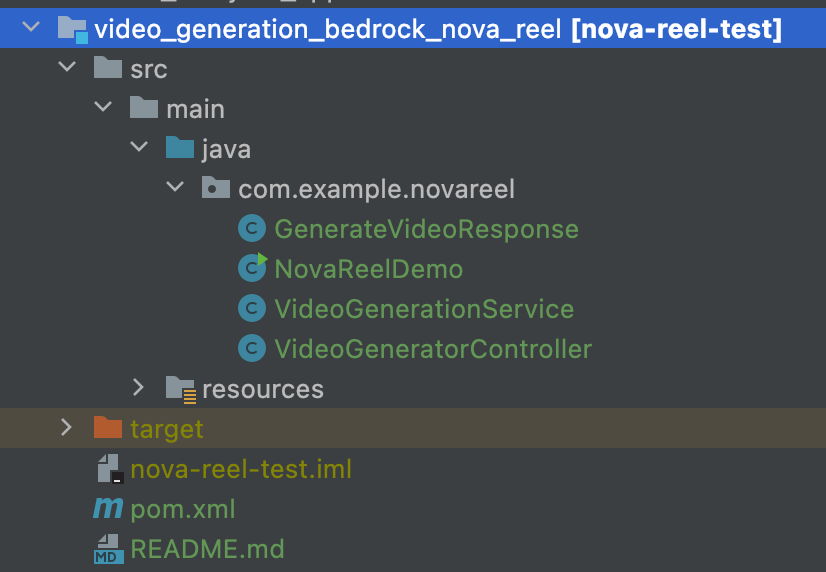

# NovaReel Video Generation Service

This is a Spring Boot application that provides a REST API to generate videos from text prompts using Amazon Bedrock and the Nova-Reel model.

## Overview

The application enables asynchronous video generation using AWS Bedrock's `amazon.nova-reel-v1:0` model and stores the generated videos in an S3 bucket.

It consists of:
- A REST controller for handling API requests
- A service class to interact with Amazon Bedrock
- A response model for encapsulating result data

## Project Structure

- **NovaReelDemo.java** Main class to bootstrap the Spring Boot app  
- **GenerateVideoResponse.java** Response DTO with fields: executionArn, s3Bucket, status  
- **VideoGenerationService.java** Service for interacting with Amazon Bedrock  
- **VideoGeneratorController.java** REST controller exposing /video endpoints

## Functionality

### 1. Generate Video  
**Endpoint:** POST /video/generate  
**Query Param:** prompt (string)  
**Description:**  
- Takes a text prompt  
- Sends an async request to `amazon.nova-reel-v1:0` using Bedrock  
- The generated video will be stored in the specified S3 bucket in 3-5 mins  
- Returns the executionArn 

### 2. Check Status  
**Endpoint:** POST /video/check  
**Query Param:** invocationArn (string)  
**Description:**  
- Checks the generation status of a video using invocationArn  
- Returns the current status 

## Configuration

### Prerequisites

- AWS account with access to Amazon Bedrock  
- AWS credentials configured via named profile (e.g. `~/.aws/credentials`)  
- A valid S3 bucket for output (currently hardcoded)

### Modify S3 Bucket

In `VideoGenerationService.java`, update the following line:  
`String s3Bucket = "s3://add_your_bucket_here";`  
Replace with your own S3 bucket URI where videos should be saved.

### AWS Credentials

By default, credentials are loaded from a named profile using:  
`ProfileCredentialsProvider.create()`  
Make sure you have the profile set in your `~/.aws/config` or override it as needed.

### IAM Permissions
Because Amazon Bedrock writes a file to an Amazon S3 bucket on your behalf, the AWS role that you use needs permissions configured to allow the appropriate Amazon Bedrock and Amazon S3 actions 
The minimum action permissions required to execute this application are:

```
bedrock:InvokeModel
s3:PutObject
bedrock:GetAsyncInvoke
bedrock:ListAsyncInvokes
```


## How to Run

1. Clone the repo  
2. Update the S3 bucket in `VideoGenerationService.java`  
3. Set up AWS credentials  
4. Build and run the Spring Boot application:  
   `./mvnw spring-boot:run`  
5. Use an API client (e.g. Postman or curl) to interact with the endpoints

## Example Requests

### Generate Video
```
curl -X POST "http://localhost:8080/video/generate?prompt=A cat surfing on a pizza in space"
```

### Check Status
```
curl -X POST "http://localhost:8080/video/check?invocationArn=<your-arn-here>"
```
when status is Completed - video generated and stored in S3 bucket

## Dependencies

- Spring Boot Web  
- AWS SDK v2 (Bedrock Runtime)  
- Jackson / JSON  
- Maven or Gradle for build  


## Future Improvements

- Make S3 bucket configurable via `application.yml`  
- Add status polling endpoint that waits until generation is complete  
- Integrate with frontend or S3 browser to retrieve the generated video  

## Additional Materials

- [Amazon Bedrock Overview](https://aws.amazon.com/bedrock/)
- [Amazon Nova Reel - AWS AI Service Cards](https://docs.aws.amazon.com/ai/responsible-ai/nova-reel/overview.html)
