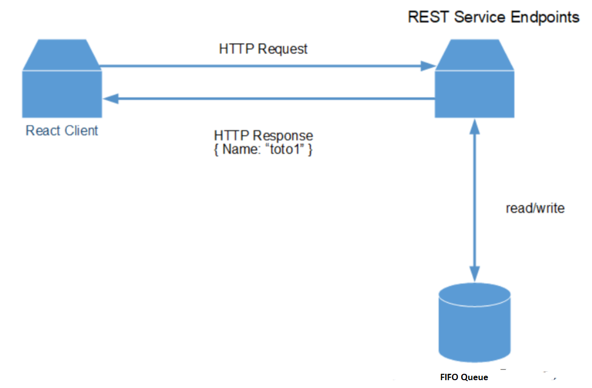

# Create a React and Spring REST application that handles Amazon SQS messages

## Overview

| Heading      | Description |
| ----------- | ----------- |
| Description | Discusses how to develop a Spring REST API that sends and retrieves messages by using the AWS SDK for Kotlin and Amazon Simple Queue Service (Amazon SQS). This application also detects the language code of the posted message by using Amazon Comprehend. The Spring REST API is used by a React application that displays the data.   |
| Audience   |  Developer (intermediate)        |
| Updated   | 9/15/2022        |
| Required skills   | Kotlin, Gradle, JavaScript  |


## Purpose

You can create a React application that sends and retrieves messages by using the AWS SDK for Kotlin and Amazon Simple Queue Service (Amazon SQS). Messages are stored in a first in, first out (FIFO) queue to keep the message order consistent. For example, the first message that's stored in the queue is the first message that's read from the queue.

**Note:** For more information about Amazon SQS, see [What is Amazon Simple Queue Service?](https://docs.aws.amazon.com/AWSSimpleQueueService/latest/SQSDeveloperGuide/welcome.html)

The application you create is a decoupled React application that uses a Spring REST API to return Amazon SQS data. That is, the React application is a single-page application (SPA) that interacts with a Spring REST API by making RESTful GET and POST requests. The Spring REST API uses an **SqsClient** object to handle messages. Then, the Spring REST API returns JSON data in an HTTP response, as shown in the following illustration.



#### Topics

+ Prerequisites
+ Understand the AWS Messaging application
+ Create an IntelliJ project 
+ Add the dependencies to your project
+ Create the Kotlin classes
+ Run the application
+ Create the React front end

## Prerequisites

To complete the tutorial, you need the following:

+ An AWS account.
+ A Kotlin IDE. (This tutorial uses the IntelliJ IDE.)
+ Java 1.8 JDK.
+ Gradle 6.8 or higher.
+ A Kotlin development environment setup. For more information, see [Setting up the AWS SDK for Kotlin](https://docs.aws.amazon.com/sdk-for-kotlin/latest/developer-guide/setup.html).

**Note**: Make sure that you have installed the Kotlin plug-in for IntelliJ. 
## Important

+ The AWS services included in this document are included in the [AWS Free Tier](https://aws.amazon.com/free/?all-free-tier.sort-by=item.additionalFields.SortRank&all-free-tier.sort-order=asc).
+  This code has not been tested in all AWS Regions. Some AWS services are available only in specific Regions. For more information, see [AWS Regional Services](https://aws.amazon.com/about-aws/global-infrastructure/regional-product-services). 
+ Running this code might result in charges to your AWS account. 
+ Be sure to delete all of the resources you create during this tutorial so that you won't be charged.

### Create the resources

Create a FIFO queue named **Message.fifo**. For more information, see [Creating an Amazon SQS queue](https://docs.aws.amazon.com/AWSSimpleQueueService/latest/SQSDeveloperGuide/sqs-configure-create-queue.html). 

Add some items to the *Message.fifo* queue in the AWS console. After creating the queue, select the queue, then select 
**Send and receive messages**. On the **Send and receive messages** page, enter sample data below,
selecting **Send message** after data is entered for each row.

| Message body               | Message group ID | Message deduplication ID | Message Attributes |
|----------------------------|------------------|--------------------------|--------------------|
| "I am going swimming soon" | 1                | 1                        | "Name":"lam"       |
| "that sounds like fun"     | 2                | 2                        | "Name":"scott"     |
| "would you like to come?"  | 3                | 3                        | "Name":"lam"       |
| "sure"                     | 4                | 4                        | "Name":"scott"     |


## Understand the AWS Messaging React application

The React application shows you how to work with Amazon SQS messages. The application posts a message to your Amazon SQS queue and it polls the Amazon SQS queue for new messages and displays them. You can enter a message and a user and then choose **Send Message**.


After the message is sent, the application displays the message, as shown in the following figure.


The following describes how the application handles a message:

1. The message and user values are posted to a Spring REST endpoint.
2. The Spring controller creates a custom **MessageData** object that stores the message ID value (a GUID), the message text, and the user.
3. The Spring controller passes the **MessageData** object to a message service that uses the **aws.sdk.kotlin.services.sqs.SqsClient** client object to store the data into a FIFO queue.
4. The Spring REST endpoint invokes the message service’s **receiveMessage** method to read all of the messages in the queue. A list of **MessageData** objects is returned and displayed in the React application. 


## Create an IntelliJ project named AWSMessageRestKotlin

1. In the IntelliJ IDE, choose **File**, **New**, **Project**.
2. In the **New Project** dialog box, choose **Kotlin**.
3. Enter the name **AWSMessageRestKotlin**. 
4. Select **Gradle Kotlin** for the Build System.
5. Select your JVM option and choose **Next**.
6. Choose **Finish**.

## Add the dependencies to your Gradle build file

At this point, you have a new project named **AWSMessageRestKotlin**. Confirm that the **build.gradle.kts** file looks like the following.

```yaml
 import org.jetbrains.kotlin.gradle.tasks.KotlinCompile

plugins {
    kotlin("jvm") version "1.7.10"
    application
}

group = "me.scmacdon"
version = "1.0-SNAPSHOT"

buildscript {
    repositories {
        maven("https://plugins.gradle.org/m2/")
    }
    dependencies {
        classpath("org.jlleitschuh.gradle:ktlint-gradle:10.3.0")
    }
}

repositories {
    mavenCentral()
    jcenter()
}
apply(plugin = "org.jlleitschuh.gradle.ktlint")
dependencies {
    implementation("org.springframework.boot:spring-boot-starter-web:2.7.3")
    implementation("com.fasterxml.jackson.module:jackson-module-kotlin:2.13.3")
    implementation("org.jetbrains.kotlin:kotlin-reflect")
    implementation("org.jetbrains.kotlin:kotlin-stdlib-jdk8")
    implementation("aws.sdk.kotlin:sqs:0.17.1-beta")
    implementation("aws.sdk.kotlin:comprehend:0.17.1-beta")
    testImplementation("org.springframework.boot:spring-boot-starter-test:2.7.3")
}

tasks.withType<KotlinCompile> {
    kotlinOptions {
        freeCompilerArgs = listOf("-Xjsr305=strict")
        jvmTarget = "1.8"
    }
}

tasks.withType<Test> {
    useJUnitPlatform()
}

```

## Create the Kotlin classes

Create a package in the **main/kotlin** folder named **com.example.sqs**. The Kotlin files must go into this package.

Create the following Kotlin classes:

+ **MessageData** - Used as the model for this application.
+ **App** - Used as the base class for the Spring Boot application.
+ **MessageResource** - Used as the Spring Boot controller that handles HTTP requests.
+ **SendReceiveMessages** - Uses the Amazon SQS API to process messages.  

**Note** The MessageResource class is located in the same file as App.kt.

### MessageData class

The **MessageData** class represents the application’s model.

```java
package com.example.sqs

class MessageData {
    var id: String? = null
    var body: String? = null
    var name: String? = null
}
```

### App class

The following Kotlin code represents the **App** and the **MessageResource** classes. Notice that **App** uses the **@SpringBootApplication** annotation, while the **MessageResource** class uses the **@RestController** annotation. In addition, the Spring Controller uses **runBlocking**, which is part of Kotlin Coroutine functionality. For more information, see [Coroutines basics](https://kotlinlang.org/docs/coroutines-basics.html).  

```java
package com.example.sqs

import kotlinx.coroutines.runBlocking
import org.springframework.boot.autoconfigure.SpringBootApplication
import org.springframework.boot.runApplication
import org.springframework.web.bind.annotation.CrossOrigin
import org.springframework.web.bind.annotation.GetMapping
import org.springframework.web.bind.annotation.PostMapping
import org.springframework.web.bind.annotation.RequestMapping
import org.springframework.web.bind.annotation.RestController
import java.util.UUID
import javax.servlet.http.HttpServletRequest
import javax.servlet.http.HttpServletResponse


@SpringBootApplication
open class App

    fun main(args: Array<String>) {
        runApplication<App>(*args)
    }

    @CrossOrigin(origins = ["*"])
    @RestController
    @RequestMapping("chat/")
    class MessageResource {

        // Get messages from the FIFO queue.
        @GetMapping("msgs")
        fun getItems(request: HttpServletRequest?, response: HttpServletResponse?): List<MessageData?>? = runBlocking {
            val msgService = SendReceiveMessages()
            return@runBlocking msgService.getMessages()
        }

        //  Purge the queue.
        @GetMapping("purge")
        fun purgeMessages(request: HttpServletRequest?, response: HttpServletResponse?): String? = runBlocking {
            val msgService = SendReceiveMessages()
            msgService.purgeMyQueue()
            return@runBlocking "Queue is purged"
        }

        // Add a new message to the FIFO queue.
        @PostMapping("add")
        fun addItems(request: HttpServletRequest, response: HttpServletResponse?): List<MessageData?>? = runBlocking {
            val user = request.getParameter("user")
            val message = request.getParameter("message")
            val msgService = SendReceiveMessages()

            // Generate the ID.
            val uuid = UUID.randomUUID()
            val msgId = uuid.toString()
            val messageOb = MessageData()
            messageOb.id = msgId
            messageOb.name = user
            messageOb.body = message
            msgService.processMessage(messageOb)
            return@runBlocking msgService.getMessages()
        }
    }


```

### SendReceiveMessages class

The following class uses the Amazon SQS API to send and retrieve messages. For example, the **getMessages** method retrieves a message from the queue. Likewise, the **processMessage** method sends a message to a queue. Amazon Comprehend is used in the following code example to detect the language code of the new message. 

```java
package com.example.sqs

import aws.sdk.kotlin.services.comprehend.ComprehendClient
import aws.sdk.kotlin.services.comprehend.model.DetectDominantLanguageRequest
import aws.sdk.kotlin.services.sqs.SqsClient
import aws.sdk.kotlin.services.sqs.model.GetQueueUrlRequest
import aws.sdk.kotlin.services.sqs.model.MessageAttributeValue
import aws.sdk.kotlin.services.sqs.model.PurgeQueueRequest
import aws.sdk.kotlin.services.sqs.model.ReceiveMessageRequest
import aws.sdk.kotlin.services.sqs.model.SendMessageRequest
import org.springframework.stereotype.Component

@Component
class SendReceiveMessages {
    private val queueNameVal = "Message.fifo"

    // Purge the queue.
    suspend fun purgeMyQueue() {
        var queueUrlVal: String
        val getQueueRequest = GetQueueUrlRequest {
            queueName = queueNameVal
        }
        SqsClient { region = "us-west-2" }.use { sqsClient ->
            queueUrlVal = sqsClient.getQueueUrl(getQueueRequest).queueUrl.toString()
            val queueRequest = PurgeQueueRequest {
                queueUrl = queueUrlVal
            }
            sqsClient.purgeQueue(queueRequest)
        }
    }

    // Retrieve messages from the FIFO queue.
    suspend fun getMessages(): List<MessageData>? {
        val attr: MutableList<String> = ArrayList()
        attr.add("Name")

        val getQueueRequest = GetQueueUrlRequest {
            queueName = queueNameVal
        }

        SqsClient { region = "us-west-2" }.use { sqsClient ->
            val queueUrlVal = sqsClient.getQueueUrl(getQueueRequest).queueUrl

            val receiveRequest = ReceiveMessageRequest {
                queueUrl = queueUrlVal
                maxNumberOfMessages = 10
                waitTimeSeconds = 20
                messageAttributeNames = attr
            }

            val messages = sqsClient.receiveMessage(receiveRequest).messages
            var myMessage: MessageData
            val allMessages = mutableListOf<MessageData>()

            // Push the messages to a list.
            if (messages != null) {
                for (m in messages) {
                    myMessage = MessageData()
                    myMessage.body = m.body
                    myMessage.id = m.messageId
                    val map = m.messageAttributes
                    val `val` = map?.get("Name")
                    if (`val` != null) {
                        myMessage.name = `val`.stringValue
                    }
                    allMessages.add(myMessage)
                }
            }
            return allMessages
        }
    }

    // Add a new message to the FIFO queue.
    suspend fun processMessage(msg: MessageData) {
        val attributeValue = MessageAttributeValue {
            stringValue = msg.name
            dataType = "String"
        }

        val myMap: MutableMap<String, MessageAttributeValue> = HashMap()
        myMap["Name"] = attributeValue

        val getQueueRequest = GetQueueUrlRequest {
            queueName = queueNameVal
        }

        // Get the language code of the incoming message.
        var lanCode = ""
        val request = DetectDominantLanguageRequest {
            text = msg.body
        }

        ComprehendClient { region = "us-west-2" }.use { comClient ->
            val resp = comClient.detectDominantLanguage(request)
            val allLanList = resp.languages
            if (allLanList != null) {
                for (lang in allLanList) {
                    println("Language is " + lang.languageCode)
                    lanCode = lang.languageCode.toString()
                }
            }
        }

        // Send the message to the FIFO queue.
        SqsClient { region = "us-west-2" }.use { sqsClient ->
            val queueUrlVal: String? = sqsClient.getQueueUrl(getQueueRequest).queueUrl
            val sendMsgRequest = SendMessageRequest {
                queueUrl = queueUrlVal
                messageAttributes = myMap
                messageGroupId = "GroupA_$lanCode"
                messageDeduplicationId = msg.id
                messageBody = msg.body
            }
            sqsClient.sendMessage(sendMsgRequest)
        }
      }
   }

```

## Run the application
Using the IntelliJ IDE, you can run your Spring REST API. The first time you run it, choose the run icon in the main class. The Spring API supports the following URLs:

- /chat/msgs - A GET request that returns all messages in the queue. 
- /chat/add - A POST request that adds a new message to the queue. 
- /api/purge - A GET request that deletes messages from the queue. 

**Note:** The React SPA that is created in a following section consumes all of the preceding URLs.

Confirm that the Spring REST API works by viewing the messages. Enter the following URL into a browser.

http://localhost:8080/chat/msgs

The following image shows the JSON data that is returned from the Spring REST API.


## Create the React front end

Create the React SPA that consumes the JSON data returned from the 
Spring REST API. To start, download files from the 
following GitHub repository. Included in this repository are instructions 
on how to set up the project. Click the following link to access the 
GitHub location [sqs-chat web client](https://github.com/awsdocs/aws-doc-sdk-examples/blob/main/resources/clients/react/elwing/src/plugins/sqs-chat/README.md).

In the instructions for the React app, you'll see directions to replace the `BASE_URL` value.
The React app uses the `BASE_URL` value to communicate with the Spring app.
Be sure you use the same port you used to start the Spring app above. For example, use `http://localhost:8082/`
for the `BASE_URL` value, if that is the port you used.

You must modify the **AwsService.js** file so that your React requests work with your Java backend. Update this file to include the following code.

```javascript

import axios from "axios";
import configData from "./config.json";

export const getMessages = async () => {
  return await axios.get(`${configData.BASE_URL}/chat/msgs`);
};

export const postMessage = async (item) => {
  let user = item.username;
  let message = item.message;
  await axios.post(
    `${configData.BASE_URL}/chat/add?user=` + user + `&message=` + message
  );
};

export const purgeMessages = async () => {
  await axios.get(`${configData.BASE_URL}/chat/purge`)
}
```

### Next steps
Congratulations! You have created and deployed the Spring application named AWS Messaging that uses Amazon SQS. As stated at the beginning of this tutorial, be sure to delete all of the resources you create during this tutorial so that you won't continue to be charged for them.

For more AWS multiservice examples, see
[usecases](https://github.com/awsdocs/aws-doc-sdk-examples/tree/master/javav2/usecases).

