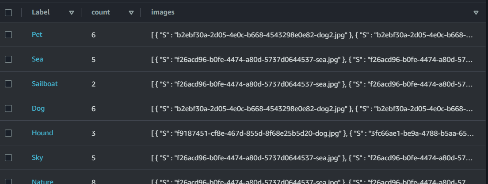
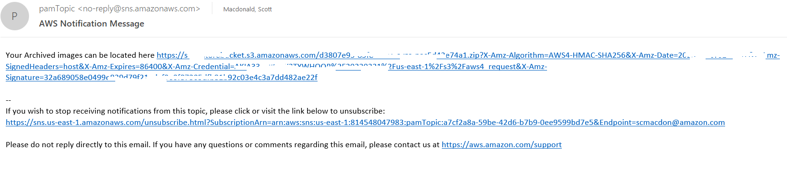
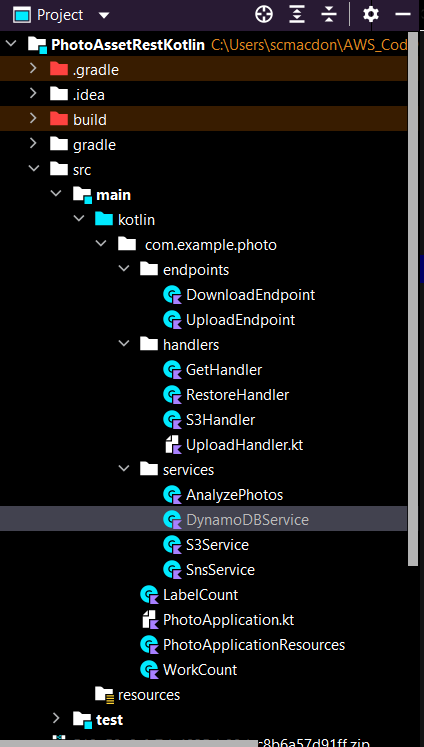
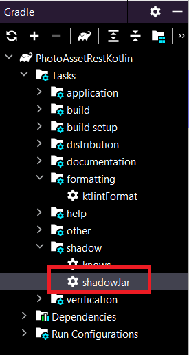
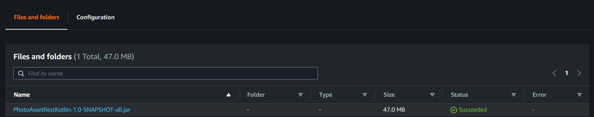
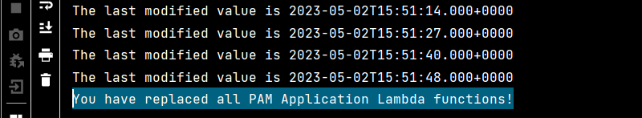

#  Create a photo asset management application using the SDK for Kotlin

## Overview

| Heading      | Description |
| -----------  | ----------- |
| Description  | Discusses how to develop a photo asset management application for users to manage photos with labels. This application is developed by using the AWS SDK for Kotlin.     |
| Audience     |  Developer (beginner / intermediate)        |
| Updated      | 11/14/2023        |
| Required skills   | Kotlin, Gradle  |

## Purpose

You can create a Photo Asset Management (PAM) application that lets users upload images. The images are sent to Amazon Rekognition, which detects labels. Then, the images are stored using Amazon Simple Storage Service (Amazon S3) Intelligent-Tiering for cost savings. The labels are stored in an Amazon DynamoDB table. Later, users can request a bundle of images matching those labels. When images are requested, they are retrieved from Amazon S3, placed into a zip file, and a link to the zip file is sent to the user by using Amazon Simple Notification Service (Amazon SNS).

The following illustration shows the AWS services used in the PAM application. 


As displayed in this illustration, the PAM application uses the following AWS services:

* Amazon Rekognition
* Amazon DynamoDB 
* Amazon S3
* Amazon SNS
* AWS Lambda 
* Amazon Cognito
* Amazon API Gateway

#### Topics

+ Prerequisites
+ Understand the photo asset management application
+ Create an IntelliJ project
+ Add the dependencies to your Gradle build file
+ Create the Kotlin classes
+ Deploy the AWS resources

## Prerequisites

To complete the tutorial, you need the following:

+ An AWS account.
+ A Kotlin IDE. (This tutorial uses the IntelliJ IDE with the Kotlin plugin).
+ Java JDK 17.
+ Gradle 8.1 or higher.
+ You must also set up your Kotlin development environment. For more information, see [Get started with the SDK for Kotlin](https://docs.aws.amazon.com/sdk-for-kotlin/latest/developer-guide/setup.html).

### Important

+ The AWS services included in this document are included in the [AWS Free Tier](https://aws.amazon.com/free/?all-free-tier.sort-by=item.additionalFields.SortRank&all-free-tier.sort-order=asc).
+  This code has not been tested in all AWS Regions. Some AWS services are available only in specific Regions. For more information, see [AWS Regional Services](https://aws.amazon.com/about-aws/global-infrastructure/regional-product-services). 
+ Running this code might result in charges to your AWS account. 
+ Be sure to delete all of the resources you create while going through this tutorial so that you won't be charged.
+ Also make sure to properly set up your development environment. For information, see [Setting up the AWS SDK for Java 2.x](https://docs.aws.amazon.com/sdk-for-java/latest/developer-guide/setup.html).

### Create the resources

The required AWS resources are created by using an AWS Cloud Development Kit (AWS CDK) script. This is discussed later in the document. You don't need to use the AWS Management Console to create any resources. 

## Understand the PAM application

The front end of the PAM application is a React application that uses the [Cloudscape Design System](https://cloudscape.design/). The application supports uploading images to an S3 bucket by sending a request that generates a presigned Amazon S3 URL. The presigned URL is returned to the application and is used to upload an image. 

After a user authenticates by using Amazon Cognito, the application displays all labels and the corresponding label count. 


### What happens after an image is uploaded to an S3 bucket

After an image is uploaded into the storage bucket, an AWS Lambda function is automatically triggered. The function performs the following tasks:

1. Sends the image to Amazon Rekognition, which creates a series of labels.
2. Stores the label data in an Amazon DynamoDB table. 

The following illustration shows the Amazon DynamoDB table storing label data. A label is the partition key, which means it can only be added once. Each time an existing tag is detected, the count column is incremented.



The PAM application uses a lifecycle rule that places all images into an **Intelligent-Tiering** storage class at midnight. An Amazon S3 lifecycle configuration is a set of rules that define actions that Amazon S3 applies to a group of objects. For more information about an Amazon S3 lifecycle, see [Managing your storage lifecycle](https://docs.aws.amazon.com/AmazonS3/latest/userguide/object-lifecycle-mgmt.html).

The following illustration shows Amazon S3 objects that are stored in the storage class. 


**Note**: For more information about Amazon S3 storage classes, see [Amazon S3 Storage Classes](https://aws.amazon.com/s3/storage-classes/).

To retrieve images, select the given labels and choose **Download**. 


The application dynamically creates a .zip file, stores the file in the S3 working bucket, presigns the file, and sends a notification message by using Amazon SNS. The message contains the presigned URL that's used to download the file.



### Understand the AWS resources used by the PAM application 	

This section describes the AWS resources that the PAM application uses. You don't need to manually deploy any of these AWS resources, such as the AWS Lambda functions, by using the AWS Management Console. Instead, you can deploy all of them by running a provided AWS CDK script. Instructions for deploying these AWS resources are provided later in this document. 

#### Lambda functions

The backend of the PAM application is implemented by using the following AWS Lambda functions:

- **Upload** - Uploads an image to an S3 bucket by using a presigned URL. 
- **DetectLabelsFn** - An Amazon S3 trigger function that is invoked when an image is uploaded or copied to the S3 storage bucket.
- **LabelsFn** - Returns the labels and label count of images in the S3 storage bucket. 
- **PrepareDownload** - Retrieves the keys of all images that correspond to the labels in the JSON data. Places all images in a zip file, presigns the zip file, and sends a notification message with Amazon SNS. The message contains a link to the zip file.

**Note**: These AWS Lambda names are short names. The full names that appear in the AWS Management Console depend on how you configure the provided AWS CDK script. Full names appear as {PAM_NAME}{Function Name}. For example, **MyApp-LambdasDetectLabelsFn**.

The following table describes the AWS Lambda functions used by this application. 

| Function        |Trigger                 | Input                            | Output                                      | Uses                                |
| -------------   | ---------------------- | ---------------------------------| --------------------------------------------| ------------------------------------|
| Upload          | APIG PUT /upload       | See following example            | See following example                       | Storage bucket                      |   | DetectLabels    | S3 PutObject jpeg      | See following example            | N/A                                         | Label table                         |
| LabelsFn        | APIG GET /labels       | N/A                              | {"labels": {"maintain": {"count": 5}}       | Storage bucket, Label table         |
| PrepareDowload  | APIG POST /download    | {"labels": ["Mountain", "Lake"]} | N/A                                         | Labels table / Working bucket       |  

	
**Note**: The Java application logic required to build these AWS Lambda functions appears later in this document.  	

**Upload**

The following JSON represents the input for the **UploadFn** Lambda function.

```xml
{
  "body": "{\"file_name\":\"mountain.jpg\"}",
  "resource": "/upload",
  "path": "/upload",
  "httpMethod": "PUT"
}

```	
You need to use this JSON if you want to test your AWS Lambda function by using the AWS Management Console. You specify the JSON in the **Event JSON** section, as shown in the following illustration. 


This Lambda function returns JSON that contains the presigned URL that can be used to upload the .jpg file specified in the URL (in this example, mountain.jpg). 

```xml
{
  "statusCode": 200,
  "headers": {
    "Access-Control-Allow-Origin": "*"
  },
  "body": "{\"url\":\"https://xxxxxxxxxxxx.amazonaws.com/xxxxxxxxxxxxxxx-mountain.jpg?X-Amz-Security-xxxxxxxxxxxxxxxxxxx\"}",
  "isBase64Encoded": false
 }
```	
 **LabelsFn**

The following JSON represents the input for the **LabelsFn** Lambda function.

```xml
  {
   "tags": "{}",
   "resource": "/labels",
   "path": "/labels",
   "httpMethod": "GET"
  }

```	

	
#### API Gateway
API Gateway provides HTTP API routes for the **Upload**, **Copy**, **Archive**, **LabelsFn**, and **PrepareDowload** AWS Lambda functions. Parameters for all routes are provided in the body of the request in a JSON object. The following table describes the API Gateway routes.	
	
| Method        | Route            | Parameters                | Example response                                                | Lambda                      |
| ------------- | -----------------| --------------------------| --------------------------------------------------------------- | ----------------------------|
| PUT           | /upload          | filename: string          | {"url": "presigned URL"}                                        | UploadFn                    | 
| GET           | /labels          | N/A                       | {"labels": {"maintain": {"count": 5}, "lake": {"count": 3}}}    | LabelsFn                    |
| POST          | /download        | labels: string[]          | {} (event)                                                      | DowloadFn                   |  


#### S3 buckets

The PAM application uses two S3 buckets: 

- **{NAME}-sdk-code-examples-pam-storage-bucket** - Used as the storage bucket.
- **{NAME}-sdk-code-examples-pam-working-bucket** - Used as the working bucket and provides zip download storage.
	
**Note**: The name value is defined when you run the AWS CDK script to set up the resources. This is discussed later in this document. 	

#### Amazon DynamoDB

The PAM application uses a DynamoDB table to track data. The Labels table, named **{NAME}-SDKCodeExamplesPAM-Labels**, contains the labels found by Amazon Rekognition. It has a simple primary key named **Label** with an attribute label of type S. 
	
**Note**: This Amazon DynamoDB table is created when you run the AWS CDK script to set up the resources. This is discussed later in this document. 		
	
## Create an IntelliJ project named PhotoAssetKotlin

1. In the IntelliJ IDE, choose **File**, **New**, **Project**.
2. In the New Project dialog box, choose **Kotlin**.
3. Enter the name **PhotoAssetKotlin**.
4. Select **Gradle Kotlin** for the Build System.
5. Select your JVM option and choose **Next**.
6. Choose **Finish**.

## Add the dependencies to your Gradle build file

At this point, you have a new project named **PhotoAssetKotlin**.

Add the following dependencies to your Gradle build file.

```xml
 import org.jetbrains.kotlin.gradle.tasks.KotlinCompile

plugins {
    kotlin("jvm") version "1.9.0"
    id("com.github.johnrengelman.shadow") version "7.1.0"
    application
}

group = "me.scmacdon"
version = "1.0-SNAPSHOT"

java {
    sourceCompatibility = JavaVersion.VERSION_17
    targetCompatibility = JavaVersion.VERSION_17
}

buildscript {
    repositories {
        maven("https://plugins.gradle.org/m2/")
    }
    dependencies {
        classpath("org.jlleitschuh.gradle:ktlint-gradle:10.3.0")
    }
}

repositories {
    mavenCentral()
    gradlePluginPortal()
}

apply(plugin = "org.jlleitschuh.gradle.ktlint")
dependencies {
    implementation("aws.sdk.kotlin:dynamodb:1.0.0")
    implementation("aws.sdk.kotlin:s3:1.0.0")
    implementation("aws.sdk.kotlin:sns:1.0.0")
    implementation("aws.sdk.kotlin:rekognition:1.0.0")
    implementation("aws.smithy.kotlin:http-client-engine-okhttp:0.28.0")
    implementation("aws.smithy.kotlin:http-client-engine-crt:0.28.0")
    implementation("org.springframework.boot:spring-boot-starter-web:2.7.5")
    implementation("com.fasterxml.jackson.module:jackson-module-kotlin:2.13.3")
    implementation("org.jetbrains.kotlin:kotlin-reflect")
    implementation("com.amazonaws:aws-java-sdk-lambda:1.12.429")
    implementation("com.amazonaws:aws-lambda-java-core:1.2.2")
    implementation("com.amazonaws:aws-lambda-java-events:3.11.1")
    implementation("org.jetbrains.kotlin:kotlin-stdlib-jdk8")
    implementation("javax.mail:javax.mail-api:1.6.2")
    implementation("com.sun.mail:javax.mail:1.6.2")
    implementation("com.google.code.gson:gson:2.10")
    implementation("org.json:json:20230227")
    implementation("com.googlecode.json-simple:json-simple:1.1.1")
    testImplementation("org.springframework.boot:spring-boot-starter-test:2.7.3")
}

application {
    mainClassName = "com.example.photo.PhotoApplication"
}

tasks.withType<KotlinCompile> {
    kotlinOptions {
        freeCompilerArgs = listOf("-Xjsr305=strict")
        jvmTarget = "17"
    }
}

tasks.withType<Test> {
    useJUnitPlatform()
}


```

## Create the Kotlin classes

Create a package in the **main/kotlin** folder named **com.example.photo**.

The Kotlin files go into these packages.



### Handlers package

Create these Kotlin classes in the **com.example.photo.handlers** package. These classes use the AWS Lambda runtime API to build the AWS Lambda functions described earlier in this document. Each class represents a handler for a separate AWS Lambda function. For more information about the AWS Lambda runtime API, see [AWS Lambda function handler in Java](https://docs.aws.amazon.com/lambda/latest/dg/java-handler.html).

+ **GetHandler** - The handler for the **LabelsFn** Lambda function. 
+ **RestoreHandler** - The handler for the **PrepareDowload** Lambda function.
+ **S3Handler** - The handler for the **DetectLabelsFn** Lambda function. 
+ **UploadHandler** - The handler for the **UploadFn** Lambda function. 

#### GetHandler class

The following Kotlin code represents the **GetHandler** class. 

```java

package com.example.photo.handlers

import com.amazonaws.services.lambda.runtime.Context
import com.amazonaws.services.lambda.runtime.RequestHandler
import com.amazonaws.services.lambda.runtime.events.APIGatewayProxyRequestEvent
import com.amazonaws.services.lambda.runtime.events.APIGatewayProxyResponseEvent
import com.example.photo.WorkCount
import com.example.photo.services.DynamoDBService
import com.google.gson.Gson
import kotlinx.coroutines.runBlocking
import java.util.TreeMap

class GetHandler : RequestHandler<APIGatewayProxyRequestEvent?, APIGatewayProxyResponseEvent?> {
    val CORS_HEADER_MAP: Map<String, String> = java.util.Map.of(
        "Access-Control-Allow-Origin", "*"
    )

    fun toJson(src: Any?): String? {
        val gson = Gson()
        return gson.toJson(src)
    }

    override fun handleRequest(input: APIGatewayProxyRequestEvent?, context: Context): APIGatewayProxyResponseEvent = runBlocking {
        context.getLogger().log("In Labels handler")
        val dbService = DynamoDBService()
        val map: Map<String, WorkCount> = dbService.scanPhotoTable()
        context.getLogger().log("Retrieved photos: " + map.size)
        val data: MutableMap<String, Map<String, WorkCount>> = TreeMap()
        data["labels"] = map
        return@runBlocking makeResponse(data)
    }

    fun makeResponse(src: Any?): APIGatewayProxyResponseEvent {
        return APIGatewayProxyResponseEvent()
            .withStatusCode(200)
            .withHeaders(CORS_HEADER_MAP)
            .withBody(toJson(src))
            .withIsBase64Encoded(false)
    }
}

```

#### RestoreHandler class

The following Kotlin code represents the **RestoreHandler** class. 
```java
package com.example.photo.handlers

import com.amazonaws.services.lambda.runtime.Context
import com.amazonaws.services.lambda.runtime.RequestHandler
import com.example.photo.endpoints.DownloadEndpoint
import com.google.gson.Gson
import kotlinx.coroutines.runBlocking
import org.json.JSONException
import org.json.JSONObject
import java.util.stream.Collectors

class RestoreHandler : RequestHandler<MutableMap<String, Any>, String> {
    fun toJson(src: Any?): String? {
        val gson = Gson()
        return gson.toJson(src)
    }

    override fun handleRequest(input: MutableMap<String, Any>?, context: Context?): String = runBlocking {
        try {
            if (context != null) {
                context.getLogger().log("***** RestoreHandler handleRequest" + toJson(input))
                val body = JSONObject(input)
                context.logger.log(body.toString())

                val labels = body.getJSONArray("labels")
                    .toList()
                    .stream()
                    .filter { o: Any? -> String::class.java.isInstance(o) }
                    .map { obj: Any? -> String::class.java.cast(obj) }
                    .collect(Collectors.toList())

                context.logger.log("Restoring labels " + toJson(labels))
                val downloadEndpoint = DownloadEndpoint()
                val url: String = downloadEndpoint.downloadFiles(labels)
                return@runBlocking "Labels archived to URL $url"
            }
        } catch (e: JSONException) {
            if (context != null) {
                context.logger.log(e.message)
            }
        }
        return@runBlocking ""
    }
}


```

### S3Handler class

The following is the **S3Handler** class. Notice the use of **S3Event**. You can use this object to get access to the object that was placed into an S3 bucket. For more information, see [Class S3Event](https://javadoc.io/doc/com.amazonaws/aws-lambda-java-events/2.2.2/com/amazonaws/services/lambda/runtime/events/S3Event.html).

```java
 package com.example.photo.handlers

import com.amazonaws.services.lambda.runtime.Context
import com.amazonaws.services.lambda.runtime.RequestHandler
import com.amazonaws.services.lambda.runtime.events.S3Event
import com.example.photo.PhotoApplicationResources
import com.example.photo.services.AnalyzePhotos
import com.example.photo.services.DynamoDBService
import kotlinx.coroutines.runBlocking

class S3Handler : RequestHandler<S3Event, String> {

    override fun handleRequest(event: S3Event, context: Context): String? = runBlocking {
        // Get the S3 bucket and object key from the Amazon S3 event.
        val bucketName = event.records[0].s3.bucket.name
        val objectKey = event.records[0].s3.getObject().key

        // Log the S3 bucket and object key in the log file.
        context.logger.log("S3 object name: s3://$bucketName/$objectKey")
        val photos = AnalyzePhotos()
        val dbService = DynamoDBService()

        // Tag the file.
        val labels = photos.detectLabels(PhotoApplicationResources.STORAGE_BUCKET, objectKey)
        dbService.putRecord(labels)
        context.logger.log("Tagged image")
        return@runBlocking "OK"
    }
}


```

### UploadHandler class

The following Kotlin code represents the **UploadHandler** class. 

```java
package com.example.photo.handlers

import com.amazonaws.services.lambda.runtime.Context
import com.amazonaws.services.lambda.runtime.RequestHandler
import com.amazonaws.services.lambda.runtime.events.APIGatewayProxyRequestEvent
import com.amazonaws.services.lambda.runtime.events.APIGatewayProxyResponseEvent
import com.example.photo.services.S3Service
import com.google.gson.Gson
import kotlinx.coroutines.runBlocking
import java.util.UUID

class UploadHandler : RequestHandler<APIGatewayProxyRequestEvent?, APIGatewayProxyResponseEvent?> {
    val CORS_HEADER_MAP: Map<String, String> = java.util.Map.of(
        "Access-Control-Allow-Origin", "*"
    )

    fun toJson(src: Any?): String? {
        val gson = Gson()
        return gson.toJson(src)
    }

    override fun handleRequest(input: APIGatewayProxyRequestEvent?, context: Context): APIGatewayProxyResponseEvent = runBlocking {
        context.getLogger().log("In UploadHandler handler")
        val body: org.json.JSONObject = org.json.JSONObject(input!!.body)
        context.logger.log("Got body: $body")
        val fileName = body.getString("file_name")
        context.logger.log("Building URL for $fileName")

        if (fileName == null || fileName == "") {
            return@runBlocking APIGatewayProxyResponseEvent()
                .withStatusCode(400)
                .withHeaders(CORS_HEADER_MAP)
                .withBody("{\"error\":\"Missing filename\"}")
                .withIsBase64Encoded(false)
        }

        val uuid = UUID.randomUUID()
        val uniqueFileName = "$uuid-$fileName"
        val s3Service = S3Service()
        val signedURL = s3Service.signObjectToUpload(uniqueFileName)
        val data = UploadResponse.from(signedURL)
        return@runBlocking makeResponse(data)
    }

    fun makeResponse(src: Any?): APIGatewayProxyResponseEvent {
        return APIGatewayProxyResponseEvent()
            .withStatusCode(200)
            .withHeaders(CORS_HEADER_MAP)
            .withBody(toJson(src))
            .withIsBase64Encoded(false)
    }
}

internal class UploadResponse private constructor(val uRL: String) {
    companion object {
        fun from(url: String): UploadResponse {
            return UploadResponse(url)
        }
    }
}

```

### Services package

Create these Kotlin classes in the **com.example.photo.services** package. These Kotlin classes use the SDK for Kotlin service clients to perform various AWS operations. For example, the **AnalyzePhotos** class generates labels for the images that are stored in the S3 storage bucket.  

+ **AnalyzePhotos** - Uses the **RekognitionClient** to generate labels.  
+ **DynamoDBService** - Uses the **DynamoDbEnhancedClient** to perform CRUD operations on an Amazon DynamoDB table.  
+ **S3Service** -  Uses the **S3Client** to perform Amazon S3 operations.
+ **SnsService** - Uses the **SnsClient** to send a notification to the end user of the PAM application. 

 ### AnalyzePhotos class

 The following Kotlin code represents the **AnalyzePhotos** class.

```java
package com.example.photo.services

import aws.sdk.kotlin.services.rekognition.RekognitionClient
import aws.sdk.kotlin.services.rekognition.model.DetectLabelsRequest
import aws.sdk.kotlin.services.rekognition.model.Image
import aws.sdk.kotlin.services.rekognition.model.S3Object
import com.example.photo.LabelCount

class AnalyzePhotos {
    suspend fun detectLabels(bucketName: String?, key: String?): ArrayList<LabelCount> {
        val s3Ob = S3Object {
            bucket = bucketName
            name = key
        }

        val souImage = Image {
            s3Object = s3Ob
        }

        val detectLabelsRequest = DetectLabelsRequest {
            image = souImage
            maxLabels = 10
        }

        RekognitionClient { region = "us-east-1" }.use { rekClient ->
            val labelsResponse = rekClient.detectLabels(detectLabelsRequest)
            val labels = labelsResponse.labels
            println("Detected labels for the given photo")
            val list = ArrayList<LabelCount>()
            var item: LabelCount
            if (labels != null) {
                for (label in labels) {
                    item = LabelCount()
                    item.setKey(key)
                    item.setName(label.name)
                    list.add(item)
                }
            }
            return list
        }
    }
}

```

### DynamoDBService class

The following Kotlin code represents the **DynamoDBService** class. This class uses the Amazon DynamoDB service client to perform updates to the DynamoDB table that the PAM application uses. For information, see [DynamoDbClient](https://sdk.amazonaws.com/kotlin/api/latest/dynamodb/aws.sdk.kotlin.services.dynamodb/-dynamo-db-client/index.html).

Furthermore, notice the **updateCount** method. Notice that the count item is updated by using an expression. For more information about using expressions, see [Using expressions in DynamoDB](https://docs.aws.amazon.com/amazondynamodb/latest/developerguide/Expressions.html).

```java
  package com.example.photo.services

import aws.sdk.kotlin.services.dynamodb.DynamoDbClient
import aws.sdk.kotlin.services.dynamodb.model.AttributeValue
import aws.sdk.kotlin.services.dynamodb.model.PutItemRequest
import aws.sdk.kotlin.services.dynamodb.model.QueryRequest
import aws.sdk.kotlin.services.dynamodb.model.QueryResponse
import aws.sdk.kotlin.services.dynamodb.model.ScanRequest
import aws.sdk.kotlin.services.dynamodb.model.UpdateItemRequest
import com.example.photo.LabelCount
import com.example.photo.PhotoApplicationResources
import com.example.photo.WorkCount
import java.util.Collections

class DynamoDBService {
    // Put the tags in the given list into an Amazon DynamoDB table.
    suspend fun putRecord(list: ArrayList<LabelCount>) {
        for (count in list) {
            val label = count.getName()
            val key = count.getKey()
            if ((label != null) && (key != null)) {
                addSingleRecord(label, key)
            }
        }
    }

    suspend fun addSingleRecord(label: String, keyVal: String) {
        // Check to see if the label exists in the Amazon DynamoDB table.
        val scanResult = scanLabelTable(PhotoApplicationResources.LABELS_TABLE)
        if (scanResult == 0) {
            // There are no records in the table.
            addNewLabel(PhotoApplicationResources.LABELS_TABLE, label)
            updateCount(PhotoApplicationResources.LABELS_TABLE, label)
            updateTableList(PhotoApplicationResources.LABELS_TABLE, label, keyVal)
        } else {
            // There are records. Check to see if Label exists.
            val labelCount = checkTagExists(label)
            if (labelCount > 0) {
                // The Label exists in the table.
                updateCount(PhotoApplicationResources.LABELS_TABLE, label)
                updateTableList(PhotoApplicationResources.LABELS_TABLE, label, keyVal)
            } else {
                // The Label doesn't exist in the table.
                addNewLabel(PhotoApplicationResources.LABELS_TABLE, label)
                updateCount(PhotoApplicationResources.LABELS_TABLE, label)
                updateTableList(PhotoApplicationResources.LABELS_TABLE, label, keyVal)
            }
        }
        println("All Data added to the Amazon DynamoDB table")
    }

    // Scan table before looking for Labels.
    suspend fun scanLabelTable(tableNameVal: String): Int {
        val request = ScanRequest {
            tableName = tableNameVal
        }

        DynamoDbClient { region = "us-east-1" }.use { ddb ->
            val response = ddb.scan(request)
            println("${response.count}")
            return response.count
        }
    }

    suspend fun checkTagExists(tag: String): Int {
        val tableNameVal = PhotoApplicationResources.LABELS_TABLE
        val partitionKeyName = "Label"
        val partitionKeyVal = tag
        val partitionAlias = "#a"

        val attrNameAlias = mutableMapOf<String, String>()
        attrNameAlias[partitionAlias] = partitionKeyName

        // Set up mapping of the partition name with the value.
        val attrValues = mutableMapOf<String, AttributeValue>()
        attrValues[":$partitionKeyName"] = AttributeValue.S(partitionKeyVal)

        val request = QueryRequest {
            tableName = tableNameVal
            keyConditionExpression = "$partitionAlias = :$partitionKeyName"
            expressionAttributeNames = attrNameAlias
            this.expressionAttributeValues = attrValues
        }

        var count: Int
        DynamoDbClient { region = "us-east-1" }.use { ddb ->
            val response = ddb.query(request)
            count = response.count
            println("$count")
        }
        return count
    }

    suspend fun updateCount(tableNameVal: String, label: String) {
        // Specify the item key.
        val keyMap: MutableMap<String, AttributeValue> = HashMap()
        keyMap["Label"] = AttributeValue.S(label)

        // Create a map to hold the update expression attributes.
        val expressionAttributeValuesMap: MutableMap<String, AttributeValue> = HashMap()
        expressionAttributeValuesMap[":countval"] = AttributeValue.N("1")

        // Specify the update item request with an expression.
        val request = UpdateItemRequest {
            tableName = tableNameVal
            key = keyMap
            updateExpression = "ADD #count :countval"
            expressionAttributeNames = Collections.singletonMap("#count", "count")
            expressionAttributeValues = expressionAttributeValuesMap
        }

        // Update the item in the table.
        DynamoDbClient { region = "us-east-1" }.use { ddb ->
            ddb.updateItem(request)
            println("Item in $tableNameVal was updated")
        }
    }

    suspend fun updateTableList(tableNameVal: String, keyVal: String, updateVal: String) {
        // Build the item key for the DynamoDB update request.
        val itemKey: MutableMap<String, AttributeValue> = java.util.HashMap()
        itemKey["Label"] = AttributeValue.S(keyVal)

        // Build the updated values for the "images" column.
        val updatedValues = mutableMapOf<String, AttributeValue>()
        val myFileList = ArrayList<AttributeValue>()
        myFileList.add(AttributeValue.S(updateVal))
        updatedValues["images"] = AttributeValue.L(myFileList)

        val expressionAttValues = mutableMapOf<String, AttributeValue>()
        expressionAttValues[":val"] = AttributeValue.L(myFileList)

        // Build the update request and execute it by using the DynamoDB client.
        val updateItemRequest = UpdateItemRequest {
            tableName = tableNameVal
            key = itemKey
            updateExpression = "SET images = list_append(images, :val)"
            expressionAttributeValues = expressionAttValues
        }

        DynamoDbClient { region = "us-east-1" }.use { ddb ->
            ddb.updateItem(updateItemRequest)
            println("Item in $tableNameVal was updated")
        }
    }

    suspend fun addNewLabel(tableNameVal: String, keyName: String) {
        val itemValues = mutableMapOf<String, AttributeValue>()

        // Add all content to the table.
        val emptyList = ArrayList<AttributeValue>()
        itemValues["Label"] = AttributeValue.S(keyName)
        itemValues["images"] = AttributeValue.L(emptyList)

        val request = PutItemRequest {
            tableName = tableNameVal
            item = itemValues
        }

        DynamoDbClient { region = "us-east-1" }.use { ddb ->
            ddb.putItem(request)
            println(" A new item was placed into $tableNameVal.")
        }
    }

    suspend fun scanPhotoTable(): HashMap<String, WorkCount> {
        val myMap = HashMap<String, WorkCount>()
        val request = ScanRequest {
            tableName = PhotoApplicationResources.LABELS_TABLE
        }

        DynamoDbClient { region = "us-east-1" }.use { ddb ->
            val response = ddb.scan(request)
            response.items?.forEach { item ->
                val wc = WorkCount()
                var labelName = ""
                var myCount: String
                item.keys.forEach { key ->
                    if (key.compareTo("Label") == 0) {
                        val inputString = item[key].toString()
                        val regex = Regex("=(.*?)\\)")
                        val matchResult = regex.find(inputString)
                        if (matchResult != null) {
                            labelName = matchResult.groupValues[1]
                            println(labelName)
                        }
                    }

                    if (key.compareTo("count") == 0) {
                        val inputString = item[key].toString()
                        val regex = Regex("=(.*?)\\)")
                        val matchResult = regex.find(inputString)
                        if (matchResult != null) {
                            myCount = matchResult.groupValues[1]
                            println("The value of count is $myCount")
                            val countInt = myCount.toInt()
                            wc.setCount(countInt)
                        }
                    }
                }
                myMap[labelName] = wc
            }
        }
        return myMap
    }

    suspend fun getImagesByLabel(partitionKeyVal: String): List<String> {
        val partitionAlias = "#a"
        val partitionKeyName = "Label"
        val attrNameAlias = mutableMapOf<String, String>()
        attrNameAlias[partitionAlias] = partitionKeyName

        // Set up mapping of the partition name with the value.
        val attrValues = mutableMapOf<String, AttributeValue>()
        attrValues[":$partitionKeyName"] = AttributeValue.S(partitionKeyVal)

        val request = QueryRequest {
            tableName = PhotoApplicationResources.LABELS_TABLE
            keyConditionExpression = "$partitionAlias = :$partitionKeyName"
            expressionAttributeNames = attrNameAlias
            expressionAttributeValues = attrValues
        }

        DynamoDbClient { region = "us-east-1" }.use { ddb ->
            val response = ddb.query(request)
            return processItems(response)
        }
    }

    fun processItems(queryRes: QueryResponse): List<String> {
        val allImages = queryRes.items?.get(0)
        val fileString = allImages.toString()
        val imagesValue = fileString.substringAfter("images=L(value=[").substringBefore("]),")
        return extractJpgFiles(imagesValue)
    }

    private fun extractJpgFiles(input: String): List<String> {
        val pattern =
            "S\\(value=([a-fA-F0-9]{8}-[a-fA-F0-9]{4}-[a-fA-F0-9]{4}-[a-fA-F0-9]{4}-[a-fA-F0-9]{12}-[a-zA-Z0-9]+\\.jpg)".toRegex()
        val matchResults = pattern.findAll(input)
        return matchResults.map { it.groupValues[1] }.toList()
    }
}

```

 ### S3Service class

 The following Kotlin code represents the **S3Service** class.

```java
package com.example.photo.services

import aws.sdk.kotlin.services.s3.S3Client
import aws.sdk.kotlin.services.s3.model.GetObjectRequest
import aws.sdk.kotlin.services.s3.model.PutObjectRequest
import aws.sdk.kotlin.services.s3.presigners.presignGetObject
import aws.sdk.kotlin.services.s3.presigners.presignPutObject
import aws.smithy.kotlin.runtime.content.ByteStream
import aws.smithy.kotlin.runtime.content.toByteArray
import com.example.photo.PhotoApplicationResources
import java.io.ByteArrayOutputStream
import java.net.URL
import java.util.zip.ZipEntry
import java.util.zip.ZipOutputStream
import kotlin.time.Duration.Companion.hours
import kotlin.time.Duration.Companion.minutes

class S3Service {
    // Place the upload image into an Amazon S3 bucket
    suspend fun putObject(data: ByteArray, objectKey: String) {
        val request = PutObjectRequest {
            bucket = PhotoApplicationResources.STORAGE_BUCKET
            key = objectKey
            body = ByteStream.fromBytes(data)
        }

        S3Client { region = "us-east-1" }.use { s3Client ->
            s3Client.putObject(request)
        }
    }

    // Place the upload image into an Amazon S3 bucket.
    suspend fun putZIP(data: ByteArray, objectKey: String) {
        val request = PutObjectRequest {
            bucket = PhotoApplicationResources.WORKING_BUCKET
            key = objectKey
            body = ByteStream.fromBytes(data)
        }

        S3Client { region = "us-east-1" }.use { s3Client ->
            s3Client.putObject(request)
        }
    }

    suspend fun getObjectBytes(bucketName: String?, keyName: String?): ByteArray? {
        var myBytes: ByteArray? = null
        val objectRequest = GetObjectRequest {
            key = keyName
            bucket = bucketName
        }

        S3Client { region = "us-east-1" }.use { s3Client ->
            s3Client.getObject(objectRequest) { resp ->
                myBytes = resp.body?.toByteArray()
            }
            return myBytes
        }
    }

    // Pass a map and get back a byte[] that represents a ZIP of all images.
    fun createZipFile(files: HashMap<String, ByteArray>): ByteArray {
        val byteArrayOutputStream = ByteArrayOutputStream()
        val zipOutputStream = ZipOutputStream(byteArrayOutputStream)
        for ((fileName, fileData) in files) {
            if (fileName == null) {
                continue
            }
            val entry = ZipEntry(fileName)
            zipOutputStream.putNextEntry(entry)
            zipOutputStream.write(fileData)
            zipOutputStream.closeEntry()
        }
        zipOutputStream.close()
        return byteArrayOutputStream.toByteArray()
    }

    suspend fun signObjectToDownload(keyName: String?): String? {
        S3Client { region = "us-east-1" }.use { s3Client ->
            val unsignedRequest = GetObjectRequest {
                bucket = PhotoApplicationResources.WORKING_BUCKET
                key = keyName
            }

            // Presign the GetObject request.
            val presignedRequest = s3Client.presignGetObject(unsignedRequest, 1.hours)
            val presignedUrl = URL(presignedRequest.url.toString()).readText()
            println(presignedUrl)
            return presignedUrl
        }
    }

    suspend fun signObjectToUpload(keyName: String?): String {
        S3Client { region = "us-east-1" }.use { s3Client ->
            val presignedUrl = PutObjectRequest {
                bucket = PhotoApplicationResources.WORKING_BUCKET
                key = keyName
                contentType = "image/jpeg"
            }

            val presignedRequest = s3Client.presignPutObject(presignedUrl, 5L.minutes)
            println(presignedRequest.url.toString())
            return presignedRequest.url.toString()
        }
    }
}


```

### SnsService class

The following Kotlin code represents the **SnsService** class.

```java
 package com.example.photo.services

import aws.sdk.kotlin.services.sns.SnsClient
import aws.sdk.kotlin.services.sns.model.PublishRequest
import com.example.photo.PhotoApplicationResources

class SnsService {
    suspend fun pubTopic(messageVal: String?) {
        val request = PublishRequest {
            message = messageVal
            topicArn = PhotoApplicationResources.TOPIC_ARN
        }
        SnsClient { region = "us-east-1" }.use { snsClient ->
            snsClient.publish(request)
        }
    }
}

```

### Endpoints package

Create these Kotlin classes in the **com.example.photo.endpoints** package.   

+ **DownloadEndpoint** - Contains application logic to download an archive zip file.  
+ **UploadEndpoint** - Contains application logic to upload an image file, including storing the image in the S3 storage bucket.    

### DownloadEndpoint class

The following Kotlin code represents the **DownloadEndpoint** class.

```java
 package com.example.photo.endpoints

import com.example.photo.PhotoApplicationResources
import com.example.photo.services.DynamoDBService
import com.example.photo.services.S3Service
import com.example.photo.services.SnsService
import kotlinx.coroutines.Dispatchers
import kotlinx.coroutines.flow.asFlow
import kotlinx.coroutines.flow.flatMapConcat
import kotlinx.coroutines.flow.toSet
import kotlinx.coroutines.withContext
import java.util.UUID

class DownloadEndpoint {
    suspend fun downloadFiles(labels: List<String>): String {
        println("We have the tags")
        val dbService = DynamoDBService()
        val s3Service = S3Service()
        val snsService = SnsService()
        val imageMap: HashMap<String, ByteArray> = HashMap()

        // Now that there's an image list, place the images into a ZIP and presign it.
        val images = labels.asFlow()
            .flatMapConcat { label ->
                withContext(Dispatchers.IO) {
                    dbService.getImagesByLabel(label)
                }.asFlow()
            }
            .toSet()

        val uuid = UUID.randomUUID().toString()
        val zipName = "$uuid.zip"
        // Populate a Kotlin Collection with the byte[].
        for (image in images) {
            val imageBytes = s3Service.getObjectBytes(PhotoApplicationResources.STORAGE_BUCKET, image)
            if (imageBytes != null) {
                imageMap.put(image, imageBytes)
                println("Added $image to the map")
            }
        }

        // Place the ZIP file into the working bucket and get back a presigned URL.
        val myZipStream = s3Service.createZipFile(imageMap)
        s3Service.putZIP(myZipStream, zipName)
        val presignUrl = s3Service.signObjectToDownload(zipName)
        val message = "Find your Archived images here $presignUrl"
        snsService.pubTopic(message)
        return presignUrl.toString()
    }
}


```

### UploadEndpoint class

The following Kotlin code represents the **UploadEndpoint** class.

```java
package com.example.photo.endpoints

import com.example.photo.PhotoApplicationResources
import com.example.photo.services.AnalyzePhotos
import com.example.photo.services.DynamoDBService
import com.example.photo.services.S3Service

class UploadEndpoint {
    suspend fun upload(bytes: ByteArray, name: String) {
        // Put the file into the bucket.
        val s3Service = S3Service()
        val analyzePhotos = AnalyzePhotos()
        val dbService = DynamoDBService()

        s3Service?.putObject(bytes, name)
        val labels = analyzePhotos.detectLabels(PhotoApplicationResources.STORAGE_BUCKET, name)
        dbService.putRecord(labels)
    }
}


```

### Photo package

Create these Kotlin classes in the **com.example.photo** package.   

+ **Label** - Used as the DynamoDbBean for the enhanced client.  
+ **LabelCount** - Stores the values that are placed into the Amazon DynamoDB table. 
+ **PhotoApplicationResources** - Stores various values, such as the name of the S3 storage bucket for the application.
+ **WorkCount** - Stores label count for the application.

### LabelCount class

The following Kotlin code represents the **LabelCount** class.

```java
package com.example.photo

class LabelCount {
    private var key: String? = null
    private var name: String? = null
    private var count = 0

    fun setKey(key: String?) {
        this.key = key
    }

    fun getKey(): String? {
        return key
    }

    fun setName(name: String?) {
        this.name = name
    }

    fun getName(): String? {
        return name
    }

    fun getCount(): Int {
        return count
    }

    fun setCount(count: Int) {
        this.count = count
    }
}

```

### PhotoApplicationResources class

The following Kotlin code represents the **PhotoApplicationResources** class.

```java
package com.example.photo

import com.google.gson.Gson
import java.util.Map

class PhotoApplicationResources {

    companion object {
        //val REGION = Region.of(System.getenv("AWS_REGION"))
        val STORAGE_BUCKET = System.getenv("STORAGE_BUCKET_NAME")
        val WORKING_BUCKET = System.getenv("WORKING_BUCKET_NAME")
        val LABELS_TABLE = System.getenv("LABELS_TABLE_NAME")
        val JOBS_TABLE = System.getenv("JOBS_TABLE_NAME")
        val TOPIC_ARN = System.getenv("NOTIFICATION_TOPIC")

        val CORS_HEADER_MAP = Map.of(
            "Access-Control-Allow-Origin", "*"
        )
        val gson = Gson()
    }
}

```

### WorkCount class

The following Kotlin code represents the **WorkCount** class.

```java
package com.example.photo

class WorkCount {
    private var count = 0

    fun getCount(): Int {
        return count
    }

    fun setCount(count: Int) {
        this.count = count
    }
}
```


## Deploy the AWS resources

At this point, you have completed all of the application business logic required for the PAM application to work. Now you need to deploy the AWS resources, including the AWS Lambda functions and API Gateway endpoints, so that the application can work. Instead of deploying all of the resources manually by using the AWS Management Console, you can use a provided AWS CDK script. Using the CDK script makes it more efficient to deploy the resources. 

**Note**: For information about the AWS CDK, see [What is the AWS CDK](https://docs.aws.amazon.com/cdk/v2/guide/home.html).
		
For complete instuctions on how to run the supplied AWS CDK script, see [PAM CDK](https://github.com/awsdocs/aws-doc-sdk-examples/tree/main/resources/cdk/photo_asset_manager).

### Update the Lambda functions

After you execute the AWS CDK script, the Lambda functions are created. However, you need to replace the ones installed using the AWS CDK with the ones you created by using the AWS SDK for Kotlin. To perform this task, you can run Kotlin code that automatically updates the Lambda functions using a FAT JAR created by using the Kotlin SDK. Perform the following tasks:

1. Update the PhotoApplicationResources with the AWS resource names that the AWS CDK script created. Make sure to update the **LABELS_TABLE**, **STORAGE_BUCKET**, **WORKING_BUCKET**, and **TOPIC_ARN** values. 

2. Create the FAT JAR by running **shadowJar**, as shown in the following illustration.  



3. Use the AWS Management Console to place the FAT JAR into the Amazon S3 bucket named **pambucketsstoragebucket**. (This was created by the AWS CDK script.)  



4. Create a new Kotlin project. For information about the gradle dependencies, see [Lambda code examples for the SDK for Kotlin](https://github.com/awsdocs/aws-doc-sdk-examples/tree/main/kotlin/services/lambda).
 
5. Add the following Kotlin code to the project and update the Kotlin variable names with the resources created by the AWS CDK script. Make sure to specify the exact names, which are provided in the AWS Lambda console. Otherwise, the code does not work. Run the following code.  

```java
package com.pam

import aws.sdk.kotlin.services.lambda.LambdaClient
import aws.sdk.kotlin.services.lambda.model.UpdateFunctionCodeRequest
import aws.sdk.kotlin.services.lambda.waiters.waitUntilFunctionUpdated

suspend fun main() {
    val key = "PhotoAssetRestKotlin-1.0-SNAPSHOT-all.jar"
    val bucketName = "<Update value>"
    val functionNamesLabels = "<Update value>"
    val uploadFunction = "<Update value>"
    val downloadFunction = "<Update value>"
    val s3Handle = "<Update value>"

    // Replace all four AWS Lambda functions.
    updateFunctionCode(functionNamesLabels, bucketName, key)
    updateFunctionCode( uploadFunction, bucketName, key)
    updateFunctionCode(downloadFunction, bucketName, key)
    updateFunctionCode(s3Handle, bucketName, key)
    println("You have replaced all PAM Application Lambda functions!")
}

suspend fun updateFunctionCode(functionNameVal: String?, bucketName: String?, key: String?) {
    val functionCodeRequest = UpdateFunctionCodeRequest {
        functionName = functionNameVal
        publish = true
        s3Bucket = bucketName
        s3Key = key
    }

    LambdaClient { region = "us-east-1" }.use { awsLambda ->
        val response = awsLambda.updateFunctionCode(functionCodeRequest)
        awsLambda.waitUntilFunctionUpdated {
            functionName = functionNameVal
        }
        println("The last modified value is " + response.lastModified)
    }
}

```

When done, you see a message that the AWS Lambda functions have been updated with the Kotlin FAT JAR. 




### Run the application

After you run the AWS CDK script and update the resources as described in the previous section, you can run the client application by using the Amazon CloudFront distribution URL as specified in the supplied AWS CDK instructions. 

### Next steps
Congratulations! You have created and deployed the Photo Asset Management application. As stated at the beginning of this tutorial, be sure to delete all of the resources by following the AWS CDK instructions so that you won't continue to be charged.

For more AWS multiservice examples, see
[usecases](https://github.com/awsdocs/aws-doc-sdk-examples/tree/master/javav2/usecases).

