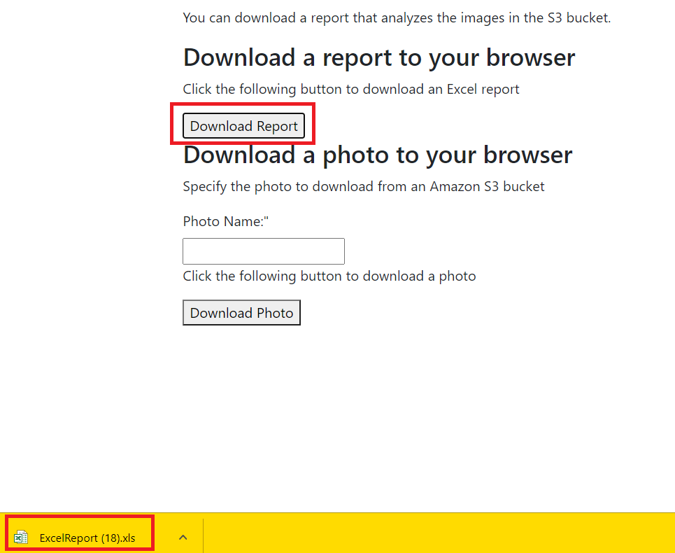
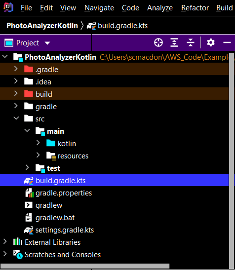
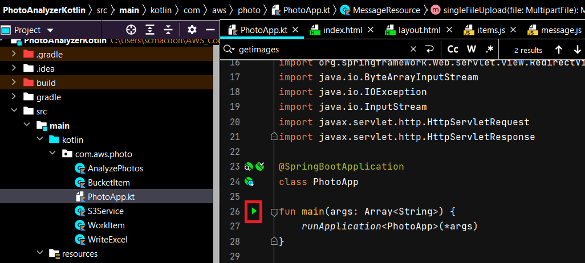

#  Creating an example Photo analyzer application using the AWS SDK for Kotlin

## Purpose
You can create a dynamic web application that analyzes nature images located in an Amazon Simple Storage Service (Amazon S3) bucket by using the Amazon Rekognition service and the AWS SDK for Kotlin. The web application can analyze many images and generate data that breaks down each image into a series of labels. For example, the following image shows a lake during sun rise.


After the application analyzes this image, it creates this data:

- Nature: 99.78323
- Outdoors: 99.51909
- Sky: 96.96809
- Sun: 95.20841
- Sunset: 93.49569
- Water: 93.12023
- Sunrise: 91.42855
- Sunlight: 87.80009
- Flare: 74.46313
- Scenery: 58.72791

In this tutorial, you create a Spring Boot application named **Kotlin Photo Analyzer**. The Spring Boot APIs are used to build a model, different views, and a controller. For more information, see [Spring Boot Tutorial](https://www.tutorialspoint.com/spring_boot/index.htm).

This application uses the following AWS services:
*	Amazon Rekognition
*	Amazon S3	

#### Topics

+ Prerequisites
+ Understand the Kotlin Photo Analyzer application
+ Create an IntelliJ project
+ Add the dependencies to your Gradle build file
+ Create the Kotlin classes
+ Create the HTML files
+ Create the script files
+ Run the application

## Prerequisites

To complete the tutorial, you need the following:

+ An AWS account
+ A Java IDE (this tutorial uses the IntelliJ IDE)
+ Java JDK 1.8
+ Gradle 6.8 or higher

### ⚠️ Important

+ The AWS services included in this document are included in the [AWS Free Tier](https://aws.amazon.com/free/?all-free-tier.sort-by=item.additionalFields.SortRank&all-free-tier.sort-order=asc).
+  This code has not been tested in all AWS Regions. Some AWS services are available only in specific regions. For more information, see [AWS Regional Services](https://aws.amazon.com/about-aws/global-infrastructure/regional-product-services). 
+ Running this code might result in charges to your AWS account. 
+ Be sure to terminate all of the resources you create while going through this tutorial to ensure that you’re not charged.

### Creating the resources

Create an Amazon S3 bucket named **photos[somevalue]**. Be sure to use this bucket name in your Amazon S3 Java code. For information, see [Creating a bucket](https://docs.aws.amazon.com/AmazonS3/latest/gsg/CreatingABucket.html).

## Understand the Kotlin Photo Analyzer application

The AWS Photo Analyzer application supports uploading images to an Amazon S3 bucket. After the images are uploaded, you can view the images to be analyzed.


To generate a report, choose the **Analyze Photos** menu option and then choose the **Download Report** button.



The following figure shows the report that is generated. Notice that image data is located in a separate sheet.


You can also download a given image from the Amazon S3 bucket by using this application. Simply specify the image name and choose the **Download Photo** button. The image is downloaded to your browser, as shown in this illustration. 


## Create an IntelliJ project named PhotoAnalyzerKotlin

The following figure shows the project options.


Perform these steps.

1. In the IntelliJ IDE, choose **File**, **New**, **Project**.
2. In the New Project dialog box, choose **Kotlin**.
3. Enter the name **PhotoAnalyzerKotlin**.
4. Select **Gradle Kotlin** for the Build System.
5. Select your JVM option and choose **Next**.
6. Choose **Finish**.

## Add the dependencies to your Gradle build file

At this point, you have a new project named **PhotoAnalyzerKotlin**.



Add the following dependencies to your Gradle buidle file.

```yaml
     import org.jetbrains.kotlin.gradle.tasks.KotlinCompile

     plugins {
      id("org.springframework.boot") version "2.5.2"
      id("io.spring.dependency-management") version "1.0.11.RELEASE"
      kotlin("jvm") version "1.5.20"
      kotlin("plugin.spring") version "1.5.20"
     }

    group = "com.example"
    version = "0.0.1-SNAPSHOT"
    java.sourceCompatibility = JavaVersion.VERSION_1_8

    repositories {
      mavenCentral()
      mavenLocal()
     }

    dependencies {
      implementation("org.springframework.boot:spring-boot-starter-thymeleaf")
      implementation("org.springframework.boot:spring-boot-starter-web")
      implementation("com.fasterxml.jackson.module:jackson-module-kotlin")
      implementation("org.jetbrains.kotlin:kotlin-reflect")
      implementation("org.jetbrains.kotlin:kotlin-stdlib-jdk8")
      implementation("net.sourceforge.jexcelapi:jxl:2.6.10")
      implementation("aws.sdk.kotlin:s3:0.9.4-beta")
      implementation("aws.sdk.kotlin:rekognition:0.9.4-beta")
      implementation("commons-io:commons-io:2.10.0")
      testImplementation("org.springframework.boot:spring-boot-starter-test")
     }

    tasks.withType<KotlinCompile> {
      kotlinOptions {
        freeCompilerArgs = listOf("-Xjsr305=strict")
        jvmTarget = "1.8"
     }
    }

    tasks.withType<Test> {
     useJUnitPlatform()
    }
```

## Create the Kotlin classes

Create a package in the **main/java** folder named **com.aws.photo**. The Kotlin files go into this package.


Create these Kotlin classes:

+ **AnalyzePhotos** - Uses the Amazon Rekognition Kotlin API to analyze the images.
+ **BucketItem** - Used as a model that stores Amazon S3 bucket information.   
+ **PhotoApp** - Used as the base class for the Spring Boot application.
+ **MessageResource** - Used as the Spring Boot controller that handles HTTP requests.
+ **S3Service** - Uses the Amazon S3 Kotlin API to perform S3 operations.
+ **WorkItem** - Used as a model that stores Amazon Rekognition data.
+ **WriteExcel** – Uses the JXL API (this is not an AWS API) to dynamically generate a report.     

**Note** The **MessageResource** class is located in the **PhotoApp** file. 

### AnalyzePhotos class

The following Kotlin code represents the **AnalyzePhotos** class that uses the Amazon Rekognition API to analyze the images.

```kotlin
    package com.aws.photo

    import aws.sdk.kotlin.services.rekognition.RekognitionClient
    import aws.sdk.kotlin.services.rekognition.model.DetectLabelsRequest
    import aws.sdk.kotlin.services.rekognition.model.Image
    import org.springframework.stereotype.Component

    @Component
    class AnalyzePhotos {

    suspend fun DetectLabels(bytesVal: ByteArray?, key: String?): MutableList<WorkItem>? {

        // Create an Image object for the source image.
        val souImage = Image {
            bytes = bytesVal
        }

        val detectLabelsRequest = DetectLabelsRequest {
            image = souImage
            maxLabels = 10
        }

        RekognitionClient { region = "us-west-2" }.use { rekClient ->
            val response = rekClient.detectLabels(detectLabelsRequest)

            // Write the results to a WorkItem instance.
            val list = mutableListOf<WorkItem>()
            println("Detected labels for the given photo")
            response.labels?.forEach { label ->
                val item = WorkItem()
                item.key = key // identifies the photo.
                item.confidence = label.confidence.toString()
                item.name = label.name
                list.add(item)
            }
            return list
        }
      }
    }
```

### BucketItem class

The following Java code represents the **BucketItem** class that stores S3 object data.

```kotlin
    package com.aws.photo

    class BucketItem {

     var key: String? = null
     var owner: String? = null
     var date: String? = null
     var size: String? = null
    }
```

### PhotoApp class

The following Java code represents the **PhotoApplication** class.

```kotlin
    package com.aws.photo

    import kotlinx.coroutines.runBlocking
    import org.springframework.beans.factory.annotation.Autowired
    import org.springframework.boot.autoconfigure.SpringBootApplication
    import org.springframework.boot.runApplication
    import org.springframework.stereotype.Controller
    import org.springframework.web.bind.annotation.*
    import org.springframework.web.multipart.MultipartFile
    import org.springframework.web.servlet.ModelAndView
    import org.springframework.web.servlet.view.RedirectView
    import java.io.ByteArrayInputStream
    import java.io.IOException
    import java.io.InputStream
    import javax.servlet.http.HttpServletRequest
    import javax.servlet.http.HttpServletResponse

    @SpringBootApplication
    class PhotoApp

    fun main(args: Array<String>) {
     runApplication<PhotoApp>(*args)
     }

    @Controller
    class MessageResource {

     // Change to your Bucket Name.
     private val bucketName = "<BUCKETNAME>"

     @Autowired
     var s3Service: S3Service? = null

     @Autowired
     var recService: AnalyzePhotos? = null

     @Autowired
     var excel: WriteExcel? = null

     @GetMapping("/process")
     fun process(): String? {
        return "process"
     }

     @GetMapping("/photo")
     fun photo(): String? {
        return "upload"
     }

     @GetMapping("/")
     fun root(): String? {
        return "index"
     }

     @RequestMapping(value = ["/getimages"], method = [RequestMethod.GET])
     @ResponseBody
     fun getImages(request: HttpServletRequest?, response: HttpServletResponse?): String? = runBlocking{
        return@runBlocking s3Service?.ListAllObjects(bucketName)
     }

     // Generates a report that analyzes photos in a given bucket.
     @RequestMapping(value = ["/report"], method = [RequestMethod.GET])
     @ResponseBody
     fun report(request: HttpServletRequest, response: HttpServletResponse) = runBlocking {

        // Get a list of key names in the given bucket.
        val myKeys = s3Service?.listBucketObjects(bucketName)

        // loop through each element in the List.
        val myList = mutableListOf<List<*>>()
        val len = myKeys?.size
        for (z in 0 until len!!) {
            val key = myKeys?.get(z) as String
            val keyData = s3Service?.getObjectBytes(bucketName, key)

            //Analyze the photo.
            val item = recService?.DetectLabels(keyData, key)
            if (item != null) {
                myList.add(item)
            }
          }

        // Now we have a list of WorkItems describing the photos in the S3 bucket.
        val excelData = excel?.exportExcel(myList)
        try {

            // Download the report.
            val reportName  = "ExcelReport.xls"
            response.contentType  = "application/vnd.ms-excel"
            response.setHeader("Content-disposition", "attachment; filename=$reportName")
            org.apache.commons.io.IOUtils.copy(excelData, response?.outputStream)
            response.flushBuffer()

        } catch (e: Exception) {
            e.printStackTrace()
         }
       }

     // Downloads the given image from the Amazon S3 bucket.
     @RequestMapping(value = ["/downloadphoto"], method = [RequestMethod.GET])
     fun fileDownload(request: HttpServletRequest, response: HttpServletResponse)  = runBlocking {
        try {
            val photoKey = request.getParameter("photoKey")
            val photoBytes: ByteArray? = s3Service?.getObjectBytes(bucketName, photoKey)
            val `is`: InputStream = ByteArrayInputStream(photoBytes)

            // Define the required information here.
            response.contentType = "image/png"
            response.setHeader("Content-disposition", "attachment; filename=$photoKey")
            org.apache.commons.io.IOUtils.copy(`is`, response.outputStream)
            response.flushBuffer()
        
        } catch (e: Exception) {
            e.printStackTrace()
        }
      }

     // Upload a photo to an Amazon S3 bucket.
     @RequestMapping(value = ["/upload"], method = [RequestMethod.POST])
     @ResponseBody
     fun singleFileUpload(@RequestParam("file") file: MultipartFile): ModelAndView? = runBlocking {
        try {
            val bytes = file.bytes
            val name = file.originalFilename

            // Put the file into the bucket.
            s3Service?.putObject(bytes, bucketName, name)
        } catch (e: IOException) {
            e.printStackTrace()
        }
        return@runBlocking ModelAndView(RedirectView("photo"))
       }
     }
```

**Note**: Be sure to replace the bucket name in this code example with your bucket name.

### S3Service class

The following class uses the Amazon S3 Kotlin API to perform S3 operations. For example, the **getObjectBytes** method returns a byte array that represents the image. 

```kotlin
    package com.aws.photo

    import aws.sdk.kotlin.services.s3.S3Client
    import aws.sdk.kotlin.services.s3.model.*
    import aws.smithy.kotlin.runtime.content.ByteStream
    import aws.smithy.kotlin.runtime.content.toByteArray
    import org.springframework.stereotype.Component
    import org.w3c.dom.Document
    import java.io.StringWriter
    import javax.xml.parsers.DocumentBuilderFactory
    import javax.xml.parsers.ParserConfigurationException
    import javax.xml.transform.TransformerException
    import javax.xml.transform.TransformerFactory
    import javax.xml.transform.dom.DOMSource
    import javax.xml.transform.stream.StreamResult
    import kotlin.system.exitProcess

    @Component
    class S3Service {

    var myBytes: ByteArray? = null

    // Returns the names of all images in the given bucket.
    suspend fun listBucketObjects(bucketName: String?): List<*>? {

        var keyName: String
        val keys  = mutableListOf<String>()

        val listObjects = ListObjectsRequest {
            bucket = bucketName
        }

        S3Client { region = "us-west-2" }.use { s3Client ->
            val response = s3Client.listObjects(listObjects)
            response.contents?.forEach { myObject ->
                   keyName = myObject.key.toString()
                   keys.add(keyName)
            }
            return keys
        }
    }

    // Returns the names of all images and data within an XML document.
    suspend fun ListAllObjects(bucketName: String?): String? {

        var sizeLg: Long
        var dateIn: aws.smithy.kotlin.runtime.time.Instant?
        val bucketItems = mutableListOf<BucketItem>()

        val listObjects = ListObjectsRequest {
            bucket = bucketName
         }

        S3Client { region = "us-west-2" }.use { s3Client ->
            val res = s3Client.listObjects(listObjects)
            res.contents?.forEach { myObject ->
                val myItem = BucketItem()
                myItem.key = myObject.key
                myItem.owner = myObject.owner?.displayName.toString()
                sizeLg = (myObject.size / 1024)
                myItem.size = (sizeLg.toString())
                dateIn = myObject.lastModified
                myItem.date = dateIn.toString()

                // Push the items to the list.
                bucketItems.add(myItem)
            }
            return convertToString(toXml(bucketItems))
        }
      }

     // Places an image into an Amazon S3 bucket.
     suspend fun putObject(data: ByteArray, bucketName: String?, objectKey: String?): String? {
        val request =  PutObjectRequest{
                bucket = bucketName
                key = objectKey
                body = ByteStream.fromBytes(data)
         }

        S3Client { region = "us-west-2" }.use { s3Client ->
            val response = s3Client.putObject(request)
            return response.eTag
        }
      }

     // Get the byte[] from this Amazon S3 object.
     suspend fun getObjectBytes(bucketName: String?, keyName: String?): ByteArray? {
           val objectRequest = GetObjectRequest {
                key = keyName
                bucket = bucketName
            }

           S3Client { region = "us-west-2" }.use { s3Client ->
             s3Client.getObject(objectRequest) { resp ->
                myBytes = resp.body?.toByteArray()
             }
            return myBytes
           }
     }

     // Convert items into XML to pass back to the view.
     private fun toXml(itemList: List<BucketItem>): Document {
        try {
            val factory = DocumentBuilderFactory.newInstance()
            val builder = factory.newDocumentBuilder()
            val doc = builder.newDocument()

            // Start building the XML.
            val root = doc.createElement("Items")
            doc.appendChild(root)

            // Get the elements from the collection.
            val custCount = itemList.size

            // Iterate through the collection.
            for (index in 0 until custCount) {

                // Get the WorkItem object from the collection.
                val myItem = itemList[index]
                val item = doc.createElement("Item")
                root.appendChild(item)

                // Set Key.
                val id = doc.createElement("Key")
                id.appendChild(doc.createTextNode(myItem.key))
                item.appendChild(id)

                // Set Owner.
                val name = doc.createElement("Owner")
                name.appendChild(doc.createTextNode(myItem.owner))
                item.appendChild(name)

                // Set Date.
                val date = doc.createElement("Date")
                date.appendChild(doc.createTextNode(myItem.date))
                item.appendChild(date)

                // Set Size.
                val desc = doc.createElement("Size")
                desc.appendChild(doc.createTextNode(myItem.size))
                item.appendChild(desc)
            }
            return doc
        } catch (e: ParserConfigurationException) {
            e.printStackTrace()
            exitProcess(0)
        }
     }

    private fun convertToString(xml: Document): String {
        try {
            val transformer = TransformerFactory.newInstance().newTransformer()
            val result = StreamResult(StringWriter())
            val source = DOMSource(xml)
            transformer.transform(source, result)
            return result.writer.toString()

        } catch (ex: TransformerException) {
            ex.printStackTrace()
            exitProcess(0)
        }
     }
    }
```

 ### WorkItem class

 The following Kotlin code represents the **WorkItem** class.

```kotlin
    package com.aws.photo

    class WorkItem {

     var key: String? = null
     var name: String? = null
     var confidence: String? = null
     }
 ```

### WriteExcel class

The following Kotlin code represents the **WriteExcel** class.

```kotlin
    package com.aws.photo

    import jxl.CellView
    import jxl.Workbook
    import jxl.WorkbookSettings
    import jxl.format.UnderlineStyle
    import jxl.write.*
    import jxl.write.Number
    import org.springframework.stereotype.Component
    import java.io.*
    import java.util.*

    @Component
    class WriteExcel {
     private var timesBoldUnderline: WritableCellFormat? = null
     private var times: WritableCellFormat? = null

     // Returns an InputStream that represents the Excel Report.
     fun exportExcel(list: List<List<*>>): InputStream? {
        try {
            return write(list)
        } catch (e: WriteException) {
            e.printStackTrace()
        } catch (e: IOException) {
            e.printStackTrace()
        }
        return null
    }

    // Generates the report and returns an inputstream.
    @Throws(IOException::class, WriteException::class)
    fun write(list: List<List<*>>): InputStream {
        val os: OutputStream = ByteArrayOutputStream()
        val wbSettings = WorkbookSettings()
        wbSettings.locale = Locale("en", "EN")

        // Create a Workbook - pass the OutputStream.
        val workbook = Workbook.createWorkbook(os, wbSettings)
        val size = list.size
        for (i in 0 until size) {

            // Get the WorkItem from each list.
            val innerList = list[i]
            val wi = innerList[i] as WorkItem
            workbook.createSheet(wi.key.toString() + " Sheet ", 0)
            val excelSheet = workbook.getSheet(0)
            createLabel(excelSheet)
            createContent(excelSheet, innerList)
        }

        // Close the workbook.
        workbook.write()
        workbook.close()

        // Get an inputStram that represents the Report.
        var stream = ByteArrayOutputStream()
        stream = os as ByteArrayOutputStream
        val myBytes = stream.toByteArray()
        return ByteArrayInputStream(myBytes)
    }

    // Create Headings in the Excel spreadsheet.
    @Throws(WriteException::class)
    private fun createLabel(sheet: WritableSheet) {
        // Create a times font.
        val times10pt = WritableFont(WritableFont.TIMES, 10)
        // Define the cell format.
        times = WritableCellFormat(times10pt)
        // Lets automatically wrap the cells.
        times!!.wrap = true

        // Create create a bold font with unterlines.
        val times10ptBoldUnderline = WritableFont(
            WritableFont.TIMES, 10, WritableFont.BOLD, false,
            UnderlineStyle.SINGLE
        )
        timesBoldUnderline = WritableCellFormat(times10ptBoldUnderline)

        // Lets automatically wrap the cells.
        timesBoldUnderline!!.wrap = true
        val cv = CellView()
        cv.format = times
        cv.format = timesBoldUnderline
        cv.isAutosize = true

        // Write a few headers.
        addCaption(sheet, 0, 0, "Photo")
        addCaption(sheet, 1, 0, "Label")
        addCaption(sheet, 2, 0, "Confidence")
    }

    // Write the Work Item Data to the Excel Report.
    @Throws(WriteException::class)
    private fun createContent(sheet: WritableSheet, list: List<*>): Int {
        val size = list.size
        for (i in 0 until size) {
            val wi = list[i] as WorkItem

            // Get tne work item values.
            val key = wi.key
            val label = wi.name
            val confidence= wi.confidence

            // First column.
            addLabel(sheet, 0, i + 2, key.toString())

            // Second column.
            addLabel(sheet, 1, i + 2, label.toString())

            // Third column.
            addLabel(sheet, 2, i + 2, confidence.toString())
        }
        return size
      }

     @Throws(WriteException::class)
     private fun addCaption(sheet: WritableSheet, column: Int, row: Int, s: String) {
        val label: Label
        label = Label(column, row, s, timesBoldUnderline)
        val cc = countString(s)
        sheet.setColumnView(column, cc)
        sheet.addCell(label)
     }

     @Throws(WriteException::class)
     private fun addNumber(
        sheet: WritableSheet, column: Int, row: Int,
        integer: Int
     ) {
        val number: Number
        number = Number(column, row, integer.toDouble(), times)
        sheet.addCell(number)
    }

    @Throws(WriteException::class)
    private fun addLabel(sheet: WritableSheet, column: Int, row: Int, s: String) {
        val label: Label
        label = Label(column, row, s, times)
        val cc = countString(s)
        if (cc > 200) sheet.setColumnView(column, 150) else sheet.setColumnView(column, cc + 6)
        sheet.addCell(label)
    }

    private fun countString(ss: String): Int {
        var count = 0

        // Counts each character except space.
        for (i in 0 until ss.length) {
            if (ss[i] != ' ') count++
        }
        return count
      }
     }
```

## Create the HTML files

At this point, you have created all of the Kotlin files required for the AWS Kotlin Photo Analyzer application. Now you create the HTML files that are required for the application's graphical user interface (GUI). Under the **resource** folder, create a **templates** folder, and then create the following HTML files:

+ index.html
+ process.html
+ upload.html
+ layout.html

The **index.html** file is the application's home view. The **process.html** file represents the view for creating a report. The **upload.html** file represents the view for uploading image files to an Amazon S3 bucket. The **layout.html** file represents the menu that's visible in all views.

### index.html

The following HTML represents the **index.html** file.

```html
    <!DOCTYPE html>
    <html xmlns:th="http://www.thymeleaf.org">

   <head>
     <meta charset="utf-8" />
     <meta http-equiv="X-UA-Compatible" content="IE=edge" />
     <meta name="viewport" content="width=device-width, initial-scale=1" />
     <link rel="stylesheet" th:href="|https://maxcdn.bootstrapcdn.com/bootstrap/4.5.2/css/bootstrap.min.css|"/>
     <script th:src="|https://code.jquery.com/jquery-1.12.4.min.js|"></script>
     <script th:src="|https://code.jquery.com/ui/1.11.4/jquery-ui.min.js|"></script>
     <script th:src="|https://maxcdn.bootstrapcdn.com/bootstrap/4.5.2/js/bootstrap.min.js|"></script>
     <script th:src="|https://cdn.datatables.net/v/dt/dt-1.10.20/datatables.min.js|"></script>
     <script src="../public/js/items.js" th:src="@{/js/items.js}"></script>
     <link rel="stylesheet" th:href="|https://cdn.datatables.net/v/dt/dt-1.10.20/datatables.min.css|"/>
     <link rel="stylesheet" href="../public/css/styles.css" th:href="@{/css/styles.css}" />
     <title>AWS Kotlin Photo Analyzer Application</title>
   </head>
    <body>
     <header th:replace="layout :: site-header"/>
     <div class="container">

     <h2>AWS Kotlin Photo Analyzer Application</h2>

     <p>The Kotlin Photo Analyzer sample application uses the Amazon Rekognition Service, the Amazon S3 Service, and the AWS SDK for Kotlin.
        Analyzing nature photographs has never been easier! Simply perform these steps:<p>
     <ol>
        <li>You can upload a nature photograph to an Amazon S3 bucket by choosing the <i>Upload Photos</i> menu item.</li>
        <li>Choose <i>Choose File</i> and browse to a nature image located on your local desktop.</li>
        <li>Choose <i>Upload</i> to upload your image to an Amazon S3 bucket.</li>
        <li>You can choose <i>Get Images</i> to view the images located in the Amazon S3 bucket. All images in the Amazon S3 bucket are displayed in the table. </li>
        <li>You can analyze the photographs and produce a report by choosing the <i>Analyze Photos</i> menu item. </li>
        <li>Download a Microsoft Excel report to your web browser that contains analyzed image data.</li>
        <li>Download a specific image from an Amazon S3 bucket.</li>
     </ol>
     </div>
    </body>
    </html>
```

### process.html

The following HTML represents the **process.html** file.

```html
    <!DOCTYPE html>
    <html xmlns:th="http://www.thymeleaf.org">
    <head>
     <meta charset="utf-8" />
     <meta http-equiv="X-UA-Compatible" content="IE=edge" />
     <meta name="viewport" content="width=device-width, initial-scale=1" />
     <link rel="stylesheet" th:href="|https://maxcdn.bootstrapcdn.com/bootstrap/4.5.2/css/bootstrap.min.css|"/>
     <script th:src="|https://code.jquery.com/jquery-1.12.4.min.js|"></script>
     <script th:src="|https://code.jquery.com/ui/1.11.4/jquery-ui.min.js|"></script>
     <script th:src="|https://maxcdn.bootstrapcdn.com/bootstrap/4.5.2/js/bootstrap.min.js|"></script>
     <script src="../public/js/message.js" th:src="@{/js/message.js}"></script>
     <link rel="stylesheet" href="../public/css/styles.css" th:href="@{/css/styles.css}" />
     <title>Kotlin Photo Analyzer</title>
   </head>
    <body>
    <header th:replace="layout :: site-header"/>
    <div class="container">

    <h2>AWS Kotlin Photo Analyzer Application</h2>
    <p>You can download a report that analyzes the images in the S3 bucket. </p>
    <div>
        <h3>Download a report to your browser</h3>
        <p>Click the following button to download an Excel report</p>
        <button id="downBtn" onclick="DownloadReport()">Download Report</button>
    </div>
    <div>
        <h3>Download a photo to your browser</h3>
        <p>Specify the photo to download from an Amazon S3 bucket</p>
        <label for="photo">Photo Name:"</label><br>
        <input type="text" id="photo" name="photo" value=""><br>
        <p>Click the following button to download a photo</p>
        <button onclick="DownloadImage()">Download Photo</button>
    </div>
    </div>
    </body>
    </html>
```

### upload.html

The following HTML represents the **upload.html** file.

```html
    <!DOCTYPE html>
    <html xmlns:th="http://www.thymeleaf.org">
    <head>
     <meta charset="utf-8" />
     <meta http-equiv="X-UA-Compatible" content="IE=edge" />
     <meta name="viewport" content="width=device-width, initial-scale=1" />
     <link rel="stylesheet" th:href="|https://maxcdn.bootstrapcdn.com/bootstrap/4.5.2/css/bootstrap.min.css|"/>
     <script th:src="|https://code.jquery.com/jquery-1.12.4.min.js|"></script>
     <script th:src="|https://code.jquery.com/ui/1.11.4/jquery-ui.min.js|"></script>
     <script th:src="|https://maxcdn.bootstrapcdn.com/bootstrap/4.5.2/js/bootstrap.min.js|"></script>
     <script th:src="|https://cdn.datatables.net/v/dt/dt-1.10.20/datatables.min.js|"></script>
     <script src="../public/js/items.js" th:src="@{/js/items.js}"></script>
     <link rel="stylesheet" th:href="|https://cdn.datatables.net/v/dt/dt-1.10.20/datatables.min.css|"/>
     <link rel="stylesheet" href="../public/css/styles.css" th:href="@{/css/styles.css}" />
     <title>AWS Photo Analyzer</title>

     <script>
        function myFunction() {
            alert("The form was submitted");
        }
     </script>
    </head>

    <body>
     <header th:replace="layout :: site-header"/>
    <div class="container">
    <h2>AWS Kotlin Photo Analyzer Application</h2>
    <p>Upload images to an Amazon S3 Bucket. Each image will be analysed!</p>
    <form method="POST" onsubmit="myFunction()" action="/upload" enctype="multipart/form-data">
     <input type="file" name="file" /><br/><br/>
     <input type="submit" value="Submit" />
    </form>
    <div>
     <br>
     <p>Click the following button to determine the number of images in the Amazon S3 bucket</p>
     <button onclick="getImages()">Get Images</button>
     <table id="myTable" class="display" style="width:100%">
        <thead>
        <tr>
            <th>Name</th>
            <th>Owner</th>
            <th>Date</th>
            <th>Size</th>
        </tr>
        </thead>
        <tbody>
        <tr>
            <td>No Data</td>
            <td>No Data</td>
            <td>No Data </td>
            <td>No Data</td>
        </tr>
        </tbody>
        <tfoot>
        <tr>
            <th>Name</th>
            <th>Owner</th>
            <th>Date</th>
            <th>Size</th>
        </tr>
        </tfoot>
        <div id="success3"></div>
     </table>
    </div>
    </div>
    </body>
    </html>
```

### layout.html

The following HTML represents the **layout.html** file for the application's menu.

```html
     <!DOCTYPE html>
    <html xmlns:th="http://www.thymeleaf.org">
    <head th:fragment="site-head">
     <meta charset="UTF-8" />
     <link rel="icon" href="../public/images/favicon.ico" th:href="@{/images/favicon.ico}" />
     <script th:src="|https://code.jquery.com/jquery-1.12.4.min.js|"></script>
     <meta th:include="this :: head" th:remove="tag"/>
    </head>
    <header th:fragment="site-header">
      <a href="#" style="color: white" th:href="@{/}">Home</a>
      <a href="#" style="color: white" th:href="@{/photo}">Upload Photos</a>
      <a href="#"  style="color: white" th:href="@{/process}">Analyze Photos</a>
    </header>
    </html>
```

## Create script files

Both the upload and process views use script files to communicate with the Spring controller. You have to ensure that these files are part of your project; otherwise, your application won't work.

+ items.js
+ message.js

Both files contain application logic that sends a request to the Spring controller. In addition, these files handle the response and set the data in the view.

### items.js

The following JavaScript represents the **items.js** file.

```javascript
    $(function() {

    $('#myTable').DataTable( {
        scrollY:        "500px",
        scrollX:        true,
        scrollCollapse: true,
        paging:         true,
        columnDefs: [
            { width: 200, targets: 0 }
        ],
        fixedColumns: true
      } );
    } );


    function getImages() {

     $.ajax('/getimages', {
        type: 'GET',  // http GET method
        success: function (data, status, xhr) {

            var xml = data
            var oTable = $('#myTable').dataTable();
            oTable.fnClearTable(true);
            $(xml).find('Item').each(function () {

                var $field = $(this);
                var key = $field.find('Key').text();
                var name = $field.find('Owner').text();
                var date = $field.find('Date').text();
                var size = $field.find('Size').text();

                //Set the new data
                oTable.fnAddData( [
                    key,
                    name,
                    date,
                    size,,]
                );
             });
          },
         error: function (jqXhr, textStatus, errorMessage) {
            $('p').append('Error' + errorMessage);
        }
       });
     }
```

### message.js

The following JavaScript represents the **message.js** file. The **ProcessImages** function sends a request to the **/report** handler in the controller that generates a report. Notice that an email address is posted to the **Controller** method.

```javascript
    $(function() {

    } );

    function DownloadImage(e){
      var photo =  $('#photo').val();
      window.location ="../downloadphoto?photoKey=" + photo ;
    }

    function DownloadReport(e){
        window.location="../report" ;
    }
```

### Create the CSS File
This application uses a CSS file named **styles.css** file that is used for the menu.

```css 
  body>header {
     background: #000;
     padding: 5px;
  }

  body>header>a>img, body>header a {
     display: inline-block;
     vertical-align: middle;
     padding: 0px 5px;
     font-size: 1.2em;
  }

  body>footer {
    background: #eee;
    padding: 5px;
    margin: 10px 0;
    text-align: center;
 }

 #logged-in-info {
    float: right;
    margin-top: 18px;
 }

 #logged-in-info form {
    display: inline-block;
    margin-right: 10px;
 }
```
## Run the application

Using the IntelliJ IDE, you can run your application. The first time you run the Spring Boot application, you can run the application by clicking the run icon in the Spring Boot main class, as shown in this illustration. 




### Next steps
Congratulations! You have created and deployed the AWS Photo Analyzer application. As stated at the beginning of this tutorial, be sure to terminate all of the resources you create while going through this tutorial to ensure that you’re no longer charged for them.
