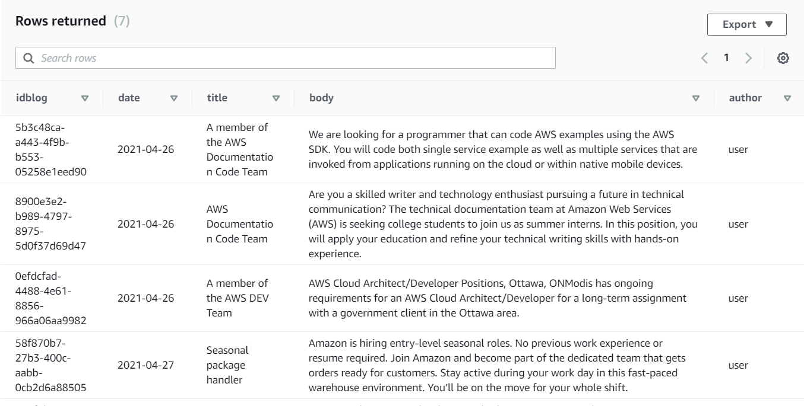
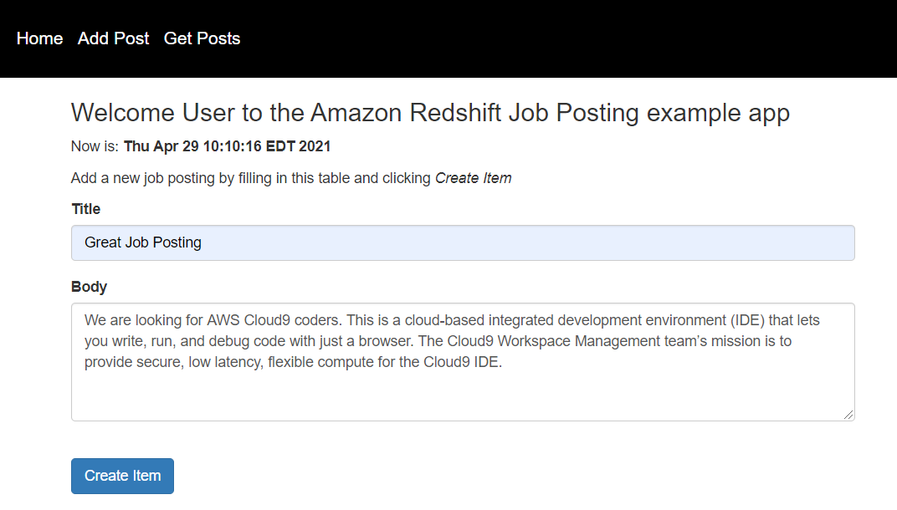
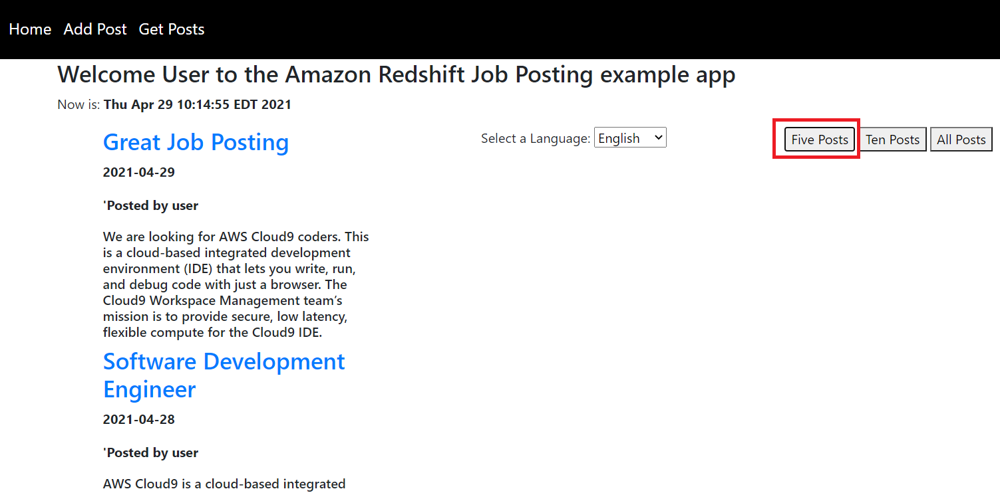
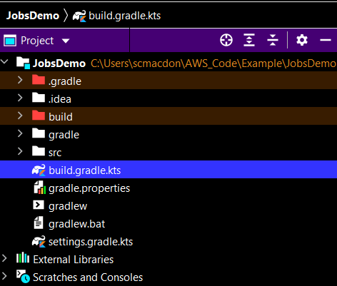
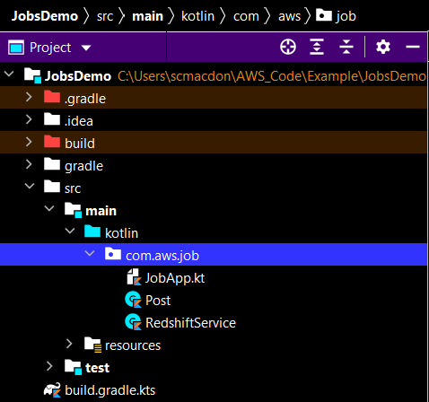

# Create a Job Posting Site using Amazon Redshift and the AWS SDK for Kotlin

## Purpose
You can create a dynamic web application that stores and queries data by using the Amazon Redshift service and the Amazon Redshift Kotlin API. To interact with an Amazon Redshift table, you can use a **RedshiftDataClient** object. The application created in this AWS tutorial is a job posting web application that lets an employer, an administrator, or human resources staff alert employees or the public about a job opening within a company.

**Note**: Amazon Redshift is a fully managed, petabyte-scale data warehouse service in the cloud. You can start with just a few hundred gigabytes of data and scale to a petabyte or more. This enables you to use your data to acquire new insights for your business and customers. For more information, see [What is Amazon Redshift?](https://docs.aws.amazon.com/redshift/latest/mgmt/welcome.html).

The data is stored in a Redshift table named **blog**, as shown in this illustration. 



The **blog** table contains these fields: 

- **idblog**- a varchar field that stores a GUID value and represents the PK.
- **date**- a date field that represents the date when the record was added. 
- **title**- a varchar field that represents the title. 
- **body**- a varchar field that represents the body. 
- **author**-a varchar field that represents the author. 

**Note**: For more information about supported field data types, see [Data types](https://docs.aws.amazon.com/redshift/latest/dg/c_Supported_data_types.html). 

The application you create uses Spring Boot APIs to build a model, different views, and a controller. For more information, see [Spring Boot](https://www.tutorialspoint.com/spring_boot/index.htm).

This web application also lets a user submit a new job posting that is then stored into the **blog** table, as shown in this illustration. 



This example application lets you view the posts by choosing the **Get Posts** menu item and choosing one of the available buttons. For example, you can view five recent posts by choosing the **Five Posts** button, as shown in the following illustration.



This application also supports viewing the result set in different languages. For example, if a user wants to view the result set in Spanish, they can choose Spanish from the dropdown field and the data is translated to the given language by using Amazon Translate, as shown in this illustration. 


#### Topics

1. Prerequisites
2. Create an IntelliJ project 
3. Add the dependencies to your Gradle build file
4. Create the Kotlin classes
6. Create the HTML files
7. Run the application. 

## Prerequisites

To complete the tutorial, you need the following:

+ An AWS account
+ A Kotlin IDE (this tutorial uses the IntelliJ IDE)
+ Java 1.8 JDK
+ Gradle 6.8 or higher
+ Setup your development environment. For information, see [Get started with the AWS SDK for Kotlin](https://docs.aws.amazon.com/sdk-for-kotlin/latest/developer-guide/get-started.html). 

**Note**: Make sure that you have installed the Kotlin plug-in for IntelliJ. 

### ⚠️ Important

+ The AWS services included in this document are included in the [AWS Free Tier](https://aws.amazon.com/free/?all-free-tier.sort-by=item.additionalFields.SortRank&all-free-tier.sort-order=asc).
+  This code has not been tested in all AWS Regions. Some AWS services are available only in specific regions. For more information, see [AWS Regional Services](https://aws.amazon.com/about-aws/global-infrastructure/regional-product-services). 
+ Running this code might result in charges to your AWS account. 
+ Be sure to terminate all of the resources you create while going through this tutorial to ensure that you’re not charged.

### Creating the resources

Create an Amazon Redshift table named **blog** that contains the fields described in this tutorial. For information about creating an Amazon Redshift table, see [Getting started using databases](https://docs.aws.amazon.com/redshift/latest/dg/c_intro_to_admin.html). 

## Create an IntelliJ project named JobsDemo

The following figure shows the project options.


Perform these steps. 

1. In the IntelliJ IDE, choose **File**, **New**, **Project**.
2. In the **New Project** dialog box, choose **Kotlin**.
3. Enter the name **JobsDemo**. 
4. Select **Gradle Kotlin** for the Build System.
5. Select your JVM option and choose **Next**.
6. Choose **Finish**.

## Add the dependencies to your project

At this point, you have a new project named **JobsDemo** with a Gradle build file.



Ensure that the Gradle build file resembles the following code.

```yaml
    import org.jetbrains.kotlin.gradle.tasks.KotlinCompile

    plugins {
     id("org.springframework.boot") version "2.5.2"
     id("io.spring.dependency-management") version "1.0.11.RELEASE"
     kotlin("jvm") version "1.5.20"
     kotlin("plugin.spring") version "1.5.20"
     }

    group = "com.example"
    version = "0.0.1-SNAPSHOT"
    java.sourceCompatibility = JavaVersion.VERSION_1_8

    repositories {
     mavenCentral()
     mavenLocal()
     }

     dependencies {
      implementation("org.springframework.boot:spring-boot-starter-thymeleaf")
      implementation("org.springframework.boot:spring-boot-starter-web")
      implementation("com.fasterxml.jackson.module:jackson-module-kotlin")
      implementation("org.jetbrains.kotlin:kotlin-reflect")
      implementation("org.jetbrains.kotlin:kotlin-stdlib-jdk8")
      implementation("aws.sdk.kotlin:redshiftdata:0.9.4-beta")
      implementation("aws.sdk.kotlin:translate:0.9.4-beta")
      testImplementation("org.springframework.boot:spring-boot-starter-test")
    }
   
    tasks.withType<KotlinCompile> {
     kotlinOptions {
        freeCompilerArgs = listOf("-Xjsr305=strict")
        jvmTarget = "1.8"
     }
    }

    tasks.withType<Test> {
    useJUnitPlatform()
    }

```

 ## Create the Kotlin classes
 
 Create a package in the main/kotlin folder named **com.aws.job**. The Kotlin classes go into this package. 
 
 
 
 Create these classes:

+ **JobApp** - Used as the base class for the Spring Boot application.
+ **MessageResource** - Used as the Spring Boot controller that handles HTTP requests. 
+ **Post** - Used as the applications model that stores application data.
+ **RedshiftService** - Used as the Spring Service that uses the Amazon Redshift Kotlin API and Amazon Translate Kotlin API.  

### JobApp class

The following Kotlin code represents the **JobApp** and the **MessageResource** classes. Notice that the **JobApp** uses the **@SpringBootApplication** annotation while the **MessageResource** class uses the **@Controller** annotation. In addition, the Spring Controller uses **runBlocking** and **@runBlocking**. Both are required and part of Kotlin Coroutine functionality. For more information, see [Coroutines basics](https://kotlinlang.org/docs/coroutines-basics.html).  

```kotlin
     package com.aws.job

     import kotlinx.coroutines.runBlocking
     import org.springframework.beans.factory.annotation.Autowired
     import org.springframework.boot.autoconfigure.SpringBootApplication
     import org.springframework.boot.runApplication
     import org.springframework.stereotype.Controller
     import org.springframework.web.bind.annotation.*
     import javax.servlet.http.HttpServletRequest
     import javax.servlet.http.HttpServletResponse

     @SpringBootApplication
     class JobApp

    fun main(args: Array<String>) {
        runApplication<JobApp>(*args)
    }

    @Controller
    class MessageResource {

    @Autowired
    var rs: RedshiftService? = null

    @GetMapping("/")
    fun root(): String? {
        return "index"
    }

    @GetMapping("/add")
    fun add(): String? {
        return "add"
    }

    @GetMapping("/posts")
    fun post(): String? {
        return "post"
    }

    // Adds a new item to the database.
    @RequestMapping(value = ["/addPost"], method = [RequestMethod.POST])
    @ResponseBody
    fun addItems(request: HttpServletRequest, response: HttpServletResponse?): String? = runBlocking{
        val name: String = "user"
        val title = request.getParameter("title")
        val body = request.getParameter("body")
        val myId = rs?.addRecord(name, title, body)
        return@runBlocking myId
    }

    // Queries items from the Redshift database.
    @RequestMapping(value = ["/getPosts"], method = [RequestMethod.POST])
    @ResponseBody
    fun getFivePosts(request: HttpServletRequest, response: HttpServletResponse?): String?  = runBlocking{
        val num = request.getParameter("number")
        val lang = request.getParameter("lang")
        return@runBlocking rs!!.getPosts(lang, num.toInt())
     }
     }
```

### Post class

The following Kotlin code represents the **Post** class.

```kotlin
    package com.aws.job

    class Post {
     var id: String? = null
     var title: String? = null
     var body: String? = null
     var author: String? = null
     var date: String? = null
    }
```

### RedshiftService class

The following Kotlin code represents the **RedshiftService** class. This class uses the Amazon Redshift Kotlin API to interact with data located in the **blog** table.  For example, the **getPosts** method returns a result set that is queried from the **blog** table and displayed in the view. Likewise, the **addRecord** method adds a new record to the **blog** table. This class also uses the Amazon Translate Kotlin API to translate the result set if requested by the user. 

```kotlin
    package com.aws.job

    import org.springframework.stereotype.Component
    import java.util.*
    import aws.sdk.kotlin.services.redshiftdata.RedshiftDataClient
    import aws.sdk.kotlin.services.redshiftdata.model.*
    import org.w3c.dom.Document
    import java.io.StringWriter
    import javax.xml.parsers.DocumentBuilderFactory
    import javax.xml.parsers.ParserConfigurationException
    import javax.xml.transform.TransformerException
    import javax.xml.transform.TransformerFactory
    import javax.xml.transform.dom.DOMSource
    import javax.xml.transform.stream.StreamResult
    import aws.sdk.kotlin.services.translate.TranslateClient
    import aws.sdk.kotlin.services.translate.model.TranslateTextRequest
    import kotlinx.coroutines.delay
    import java.sql.Date
    import java.text.SimpleDateFormat
    import java.time.LocalDateTime
    import java.time.format.DateTimeFormatter
    import kotlin.system.exitProcess

    @Component
    class RedshiftService {
     val clusterId = "redshift-cluster-1"
     val databaseVal = "dev"
     val dbUserVal = "awsuser"


     // Add a new record to the Amazon Redshift table.
     suspend fun addRecord(author: String, title: String, body: String): String? {

        val uuid = UUID.randomUUID()
        val id = uuid.toString()

        // Date conversion.
        val dtf = DateTimeFormatter.ofPattern("yyyy/MM/dd HH:mm:ss")
        val now = LocalDateTime.now()
        val sDate1 = dtf.format(now)
        val date1 = SimpleDateFormat("yyyy/MM/dd").parse(sDate1)
        val sqlDate = Date(date1.time)

        // Inject an item into the system.
        val sqlStatement = "INSERT INTO blog (idblog, date, title, body, author) VALUES( '$uuid' ,'$sqlDate','$title' , '$body', '$author');"
        val statementRequest = ExecuteStatementRequest {
            clusterIdentifier = clusterId
            database = databaseVal
            dbUser = dbUserVal
            sql = sqlStatement
         }

        RedshiftDataClient { region = "us-west-2" }.use { redshiftDataClient ->
            redshiftDataClient.executeStatement(statementRequest)
            return id
        }
     }

     // Returns a collection that returns the latest five posts from the Redshift table.
     suspend fun getPosts(lang: String, num: Int): String? {

        val sqlStatement = if (num == 5) "SELECT TOP 5 * FROM blog ORDER BY date DESC" else if (num == 10) "SELECT TOP 10 * FROM blog ORDER BY date DESC" else "SELECT * FROM blog ORDER BY date DESC"
        val statementRequest = ExecuteStatementRequest {
            clusterIdentifier = clusterId
            database = databaseVal
            dbUser = dbUserVal
            sql = sqlStatement
        }

        RedshiftDataClient { region = "us-west-2" }.use { redshiftDataClient ->
            val response = redshiftDataClient.executeStatement(statementRequest)
            val myId = response.id
            checkStatement(redshiftDataClient, myId)
            val posts = getResults(redshiftDataClient, myId, lang)!!
            redshiftDataClient.close()
            return convertToString(toXml(posts))
        }
     }

     suspend fun getResults(redshiftDataClient: RedshiftDataClient, statementId: String?, lang: String): List<Post>? {

        val records = mutableListOf<Post>()
        val resultRequest = GetStatementResultRequest {
            id = statementId
        }

        val response = redshiftDataClient.getStatementResult(resultRequest)

        // Iterate through the List element where each element is a List object.
         val dataList = response.records
         var post: Post
         var index: Int

         if (dataList != null) {
                for (list in dataList) {

                    post = Post()
                    index = 0
                    for (myField in list) {
                        var value = parseValue(myField)

                        if (index == 0)
                            post.id= value
                        else if (index == 1)
                            post.date =value
                        else if (index == 2) {
                            if (lang != "English")
                                value = translateText(value, lang)
                                post.title = value
                        } else if (index == 3) {
                            if (lang != "English")
                                value = translateText(value, lang)
                                post.body = value
                        } else if (index == 4)
                            post.author= value

                        // Increment the index.
                        index++
                    }

                    // Push the Post object to the List.
                    records.add(post)
                }
            }

            return records
     }

     // Return the String value of the field.
     fun parseValue(myField:Field) :String {

        val ss = myField.toString()
        if ("StringValue" in ss) {

            var str  = ss.substringAfterLast("=")
            str = str.substring(0, str.length - 1)
            return str

        }
        return ""
    }

    suspend fun checkStatement(redshiftDataClient: RedshiftDataClient, sqlId: String?) {

        val statementRequest = DescribeStatementRequest {
            id = sqlId
        }

        // Wait until the sql statement processing is finished.
        val finished = false
        var status: String
        while (!finished) {
             val response = redshiftDataClient.describeStatement(statementRequest)
             status = response.status.toString()
             println("...$status")
            if (status.compareTo("FINISHED") == 0) {
                break
            }
               delay(500)
            }
            println("The statement is finished!")
     }

     // Convert the list to XML to pass back to the view.
     private fun toXml(itemsList: List<Post>): Document {
        try {
            val factory = DocumentBuilderFactory.newInstance()
            val builder = factory.newDocumentBuilder()
            val doc = builder.newDocument()

            // Start building the XML.
            val root = doc.createElement("Items")
            doc.appendChild(root)

            // Iterate through the collection.
            for (post in itemsList) {
                val item = doc.createElement("Item")
                root.appendChild(item)

                // Set Id.
                val id = doc.createElement("Id")
                id.appendChild(doc.createTextNode(post.id))
                item.appendChild(id)

                // Set Date.
                val name = doc.createElement("Date")
                name.appendChild(doc.createTextNode(post.date))
                item.appendChild(name)

                // Set Title.
                val date = doc.createElement("Title")
                date.appendChild(doc.createTextNode(post.title))
                item.appendChild(date)

                // Set Content.
                val desc = doc.createElement("Content")
                desc.appendChild(doc.createTextNode(post.body))
                item.appendChild(desc)

                // Set Author.
                val guide = doc.createElement("Author")
                guide.appendChild(doc.createTextNode(post.author))
                item.appendChild(guide)
            }
            return doc
        } catch (e: ParserConfigurationException) {
            e.printStackTrace()
            exitProcess(1)
        }
     }

     private fun convertToString(xml: Document): String? {
        try {
            val transformer = TransformerFactory.newInstance().newTransformer()
            val result = StreamResult(StringWriter())
            val source = DOMSource(xml)
            transformer.transform(source, result)
            return result.writer.toString()
        } catch (ex: TransformerException) {
            ex.printStackTrace()
        }
        return null
    }

    private suspend fun translateText(textVal: String, lang: String): String {

        val transValue: String
        if (lang.compareTo("French") == 0) {

                val textRequest = TranslateTextRequest {
                    sourceLanguageCode = "en"
                    targetLanguageCode = "fr"
                    text = textVal
                }

                TranslateClient { region = "us-east-1" }.use { translateClient ->
                    val textResponse = translateClient.translateText(textRequest)
                    transValue = textResponse.translatedText.toString()
                    return transValue
                }
        } else if (lang.compareTo("Russian") == 0) {

                val textRequest = TranslateTextRequest {
                    sourceLanguageCode = "en"
                    targetLanguageCode = "ru"
                    text = textVal
                }

               TranslateClient { region = "us-east-1" }.use { translateClient ->
                   val textResponse = translateClient.translateText(textRequest)
                   transValue = textResponse.translatedText.toString()
                   return transValue
               }
        } else if (lang.compareTo("Japanese") == 0) {

                val textRequest = TranslateTextRequest {
                    sourceLanguageCode = "en"
                    targetLanguageCode = "ja"
                    text = textVal
                }
                TranslateClient { region = "us-east-1" }.use { translateClient ->
                  val textResponse = translateClient.translateText(textRequest)
                   transValue = textResponse.translatedText.toString()
                   return transValue
                }
        } else if (lang.compareTo("Spanish") == 0) {

                val textRequest = TranslateTextRequest {
                    sourceLanguageCode = "en"
                    targetLanguageCode = "es"
                    text = textVal
                }

               TranslateClient { region = "us-east-1" }.use { translateClient ->
                  val textResponse = translateClient.translateText(textRequest)
                  transValue = textResponse.translatedText.toString()
                  return transValue
               }

        } else {

                val textRequest = TranslateTextRequest {
                    sourceLanguageCode = "en"
                    targetLanguageCode = "zh"
                    text = textVal
                }

               TranslateClient { region = "us-east-1" }.use { translateClient ->
                val textResponse = translateClient.translateText(textRequest)
                transValue = textResponse.translatedText.toString()
                  return transValue
               }
        }
      }
     }
```

## Create the HTML file

At this point, you have created all of the Kotlin files required for this example application. Now create HTML files that are required for the application's view. Under the resource folder, create a **templates** folder, and then create the following HTML files:

+ index.html
+ layout.html
+ post.html
+ add.html


### index.html
The **index.html** file is the application's home view. 

```html
    <!DOCTYPE html>
    <html xmlns:th="http://www.thymeleaf.org" >
     <head>
       <meta charset="utf-8" />
       <meta http-equiv="X-UA-Compatible" content="IE=edge" />
       <meta name="viewport" content="width=device-width, initial-scale=1" />
       <script th:src="|https://code.jquery.com/jquery-1.12.4.min.js|"></script>
       <script th:src="|https://cdnjs.cloudflare.com/ajax/libs/popper.js/1.12.9/umd/popper.min.js|"></script>
       <script th:src="|https://maxcdn.bootstrapcdn.com/bootstrap/4.0.0/js/bootstrap.min.js|"></script>
       <link rel="stylesheet" th:href="|https://maxcdn.bootstrapcdn.com/bootstrap/4.5.2/css/bootstrap.min.css|"/>
       <link rel="stylesheet" href="../public/css/styles.css" th:href="@{/css/styles.css}" />
       <title>AWS Job Posting Example</title>
      </head>

     <body>
      <header th:replace="layout :: site-header"/>
      <div class="container">

      <h3>Welcome to the Amazon Redshift Job Posting example app</h3>
      <p>Now is: <b th:text="${execInfo.now.time}"></b></p>

      <h2>Amazon Redshift Job Posting Example</h2>
      <p>The Amazon Redshift Job Posting Example application uses multiple AWS Services and the Kotlin API. Perform these steps:<p>
      <ol>
        <li>Enter work items into the system by choosing the <i>Add Posts</i> menu item. Fill in the form and then choose <i>Create Item</i>.</li>
        <li>The sample application stores the data by using the Amazon Redshift Kotlin API.</li>
        <li>You can view the items by choosing the <i>Get Posts</i> menu item. Next, select a language.</li>
        <li>You can view the items by chooing either the <b>Five Posts</b>, <b>Ten Posts</b>, or <b>All Posts</b> button. </li>
        <li>The items appear in the page from newest to oldest.</li>
      </ol>
      <div>
      </body>
     </html>
```
        
### layout.html
The following code represents the **layout.html** file that represents the application's menu.

```html
     <!DOCTYPE html>
     <html xmlns:th="http://www.thymeleaf.org">
     <head th:fragment="site-head">
     <meta charset="UTF-8" />
     <link rel="icon" href="../public/img/favicon.ico" th:href="@{/img/favicon.ico}" />
     <script th:src="|https://code.jquery.com/jquery-1.12.4.min.js|"></script>
     <meta th:include="this :: head" th:remove="tag"/>
    </head>
    <body>
     <!-- th:hef calls a controller method - which returns the view -->
     <header th:fragment="site-header">
      <a href="#" style="color: white" th:href="@{/}">Home</a>
      <a href="#" style="color: white" th:href="@{/add}">Add Post</a>
      <a href="#"  style="color: white" th:href="@{/posts}">Get Posts</a>
      <div id="logged-in-info">
     </div>
    </header>
    <h1>Welcome</h1>
    <body>
    <p>Welcome to  AWS Jop Board App</p>
    </body>
   </html>
```
         
### add.html
The **add.html** file is the application's view that lets users post new items. 

```html
  <!DOCTYPE html>
  <html xmlns:th="http://www.thymeleaf.org" >

   <head>
    <meta charset="UTF-8" />
    <title>Job Board</title>
    <script th:src="|https://code.jquery.com/jquery-1.12.4.min.js|"></script>
    <script th:src="|https://cdnjs.cloudflare.com/ajax/libs/popper.js/1.12.9/umd/popper.min.js|"></script>
    <script src="../public/js/contact_me.js" th:src="@{/js/contact_me.js}"></script>
    <link rel="stylesheet" href="../public/css/styles.css" th:href="@{/css/styles.css}" />
    <link rel="icon" href="../public/img/favicon.ico" th:href="@{/img/favicon.ico}" />

    <link rel="stylesheet" th:href="|https://maxcdn.bootstrapcdn.com/bootstrap/4.5.2/css/bootstrap.min.css|"/>
  </head>

  <body>
  <header th:replace="layout :: site-header"/>
   <div class="container">
    <h3>Welcome to the Amazon Redshift Job Posting example app</h3>
    <p>Now is: <b th:text="${execInfo.now.time}"></b></p>
    <p>Add a new job posting by filling in this table and clicking <i>Create Item</i></p>

    <div class="form-group">
            <label>Title</label>
            <input class="form-control" id="title" placeholder="Title" required="required" data-validation-required-message="Please enter the AWS Guide.">
            <p class="help-block text-danger"></p>
        </div>
        <div class="form-group">
            <label>Body</label>
            <textarea class="form-control" id="body" rows="5" placeholder="Body" required="required" data-validation-required-message="Please enter a description."></textarea>
            <p class="help-block text-danger"></p>
        </div>
        <button id ="SendButton" type="submit" class="btn btn-primary">Submit</button>

    </div>
    </body>
    </html>
```

### post.html
The **post.html** file is the application's view that displays the items in the specific language. 

```html
    <!DOCTYPE html>
    <html xmlns:th="http://www.thymeleaf.org">
    <head>
     <meta charset="UTF-8" />
     <title>Job Board</title>
     <script th:src="|https://code.jquery.com/jquery-1.12.4.min.js|"></script>
     <script th:src="|https://cdnjs.cloudflare.com/ajax/libs/popper.js/1.12.9/umd/popper.min.js|"></script>
     <script th:src="|https://maxcdn.bootstrapcdn.com/bootstrap/4.0.0/js/bootstrap.min.js|"></script>
     <link rel="stylesheet" th:href="|https://maxcdn.bootstrapcdn.com/bootstrap/4.5.2/css/bootstrap.min.css|"/>
     <script src="../public/js/contact_me.js" th:src="@{/js/contact_me.js}"></script>
     <link rel="stylesheet" href="../public/css/styles.css" th:href="@{/css/styles.css}" />
     <link rel="icon" href="../public/img/favicon.ico" th:href="@{/img/favicon.ico}" />
    </head>
    <body>
    <header th:replace="layout :: site-header"/>

    <div class="container">
     <h3>Welcome <span sec:authentication="principal.username">User</span> to the Amazon Redshift Job Posting example app</h3>
     <p>Now is: <b th:text="${execInfo.now.time}"></b></p>

    <div  id ="progress"  class="progress">
        <div class="progress-bar progress-bar-striped progress-bar-animated" style="width:90%">
            Retrieving Amazon Redshift Data...
        </div>
    </div>
    </div>
    <div class="row">
        <div class="col">
            <div class="col-lg-10">
                <div class="clearfix mt-40">
                    <ul class="xsearch-items">
                    </ul>
                </div>
            </div>
        </div>
        <div class="col-4">
            <label for="lang">Select a Language:</label>
            <select name="lang" id="lang">
                <option>English</option>
                <option>French</option>
                <option>Spanish</option>
                <option>Russian</option>
                <option>Chinese</option>
                <option>Japanese</option>
            </select>
        </div>
        <div>
            <button type="button" onclick="getPosts(5)">Five Posts</button>
            <button type="button" onclick="getPosts(10)">Ten Posts</button>
            <button type="button" onclick="getPosts(0)">All Posts</button>
        </div>
     </div>
    </div>
    </div>
    </body>
    </html>
```
    
### Create the JS File

This application has a **contact_me.js** file that is used to send requests to the Spring Controller. Place this file in the **resources\public\js** folder. 

```javascript
      $(function() {

       $('#progress').hide();
       $("#SendButton" ).click(function($e) {

        var title = $('#title').val();
        var body = $('#body').val();
        
        if (!$(title).val() ) {
            alert("Please enter a title value");
            return;
        }

        if (!$(body).val() ) {
            alert("Please enter a body value");
            return;
        }

        $.ajax('/addPost', {
            type: 'POST',  // http method
            data: 'title=' + title + '&body=' + body,  // data to submit
            success: function (data, status, xhr) {
                var msg = event.target.responseText;
                alert("You have successfully added item "+msg)

                $('#title').val("");
                $('#body').val("");
            },
            error: function (jqXhr, textStatus, errorMessage) {
                $('p').append('Error' + errorMessage);
            }
        });

     } );// END of the Send button click
    } );

    function getPosts(num){

     $('.xsearch-items').empty()
     $('#progress').show();
     var lang = $('#lang option:selected').text();

     $.ajax('/getPosts', {
        type: 'POST',  // http method
        data: 'lang=' + lang +'&number=' + num,
        success: function (data, status, xhr) {

            var xml = data
            $(xml).find('Item').each(function ()  {

                    var $field = $(this);
                    var id = $field.find('Id').text();
                    var date = $field.find('Date').text();
                    var title = $field.find('Title').text();
                    var body = $field.find('Content').text();
                    var author = $field.find('Author').text();

                    $('#progress').hide();

                    // Append this data to the main list.
                    $('.xsearch-items').append("<className='search-item'>");
                    $('.xsearch-items').append("<div class='search-item-content'>");
                    $('.xsearch-items').append("<h3 class='search-item-caption'><a href='#'>"+title+"</a></h3>");
                    $('.xsearch-items').append("<className='search-item-meta mb-15'>");
                    $('.xsearch-items').append("<className='list-inline'>");
                    $('.xsearch-items').append("<p><b>"+date+"</b></p>");
                    $('.xsearch-items').append("<p><b>'Posted by "+author+"</b></p>");
                    $('.xsearch-items').append("<div>");
                    $('.xsearch-items').append("<h6>"+body +"</h6>");
                    $('.xsearch-items').append("</div>");
            })
        },
        error: function (jqXhr, textStatus, errorMessage) {
            $('p').append('Error' + errorMessage);
        }
       });
     }
```
### Create the CSS File
This application uses a CSS file named **styles.css** file that is used for the menu.

```css 
  body>header {
     background: #000;
     padding: 5px;
  }

  body>header>a>img, body>header a {
     display: inline-block;
     vertical-align: middle;
     padding: 0px 5px;
     font-size: 1.2em;
  }

  body>footer {
    background: #eee;
    padding: 5px;
    margin: 10px 0;
    text-align: center;
 }

 #logged-in-info {
    float: right;
    margin-top: 18px;
 }

 #logged-in-info form {
    display: inline-block;
    margin-right: 10px;
 }
```

## Run the application

Using the IntelliJ IDE, you can run your application. The first time you run the Spring Boot application, you can run the application by clicking the run icon in the Spring Boot main class, as shown in this illustration. 


### Next steps
Congratulations! You have created a Spring Boot application that uses the Amazon Redshift Data Client to create an example job posting application. As stated at the beginning of this tutorial, be sure to terminate all of the resources you create while going through this tutorial to ensure that you’re not charged.
