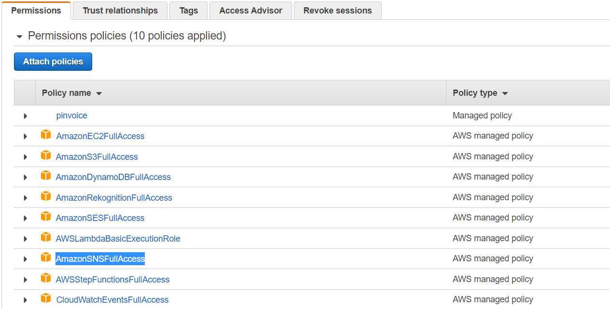
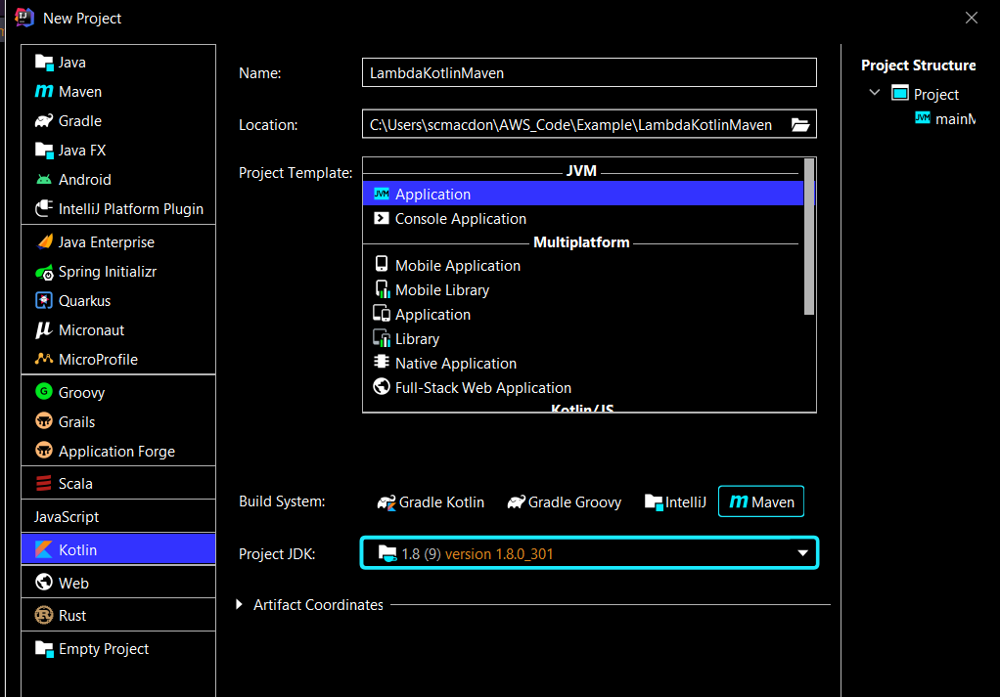
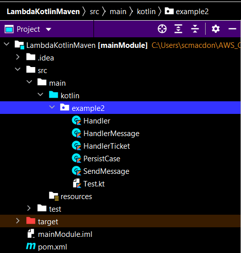
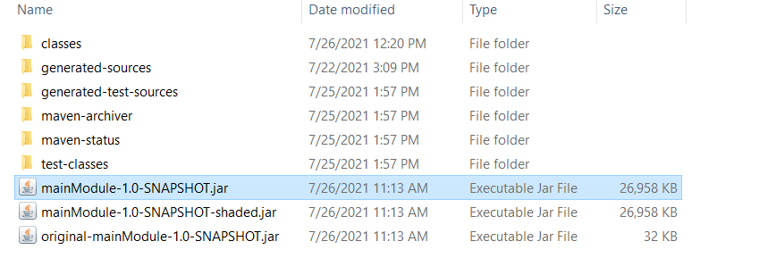
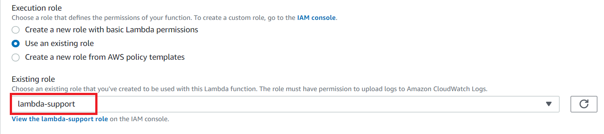
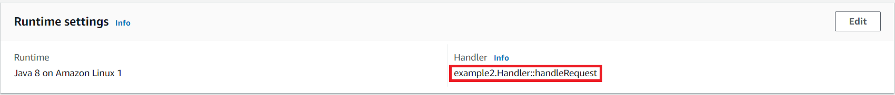
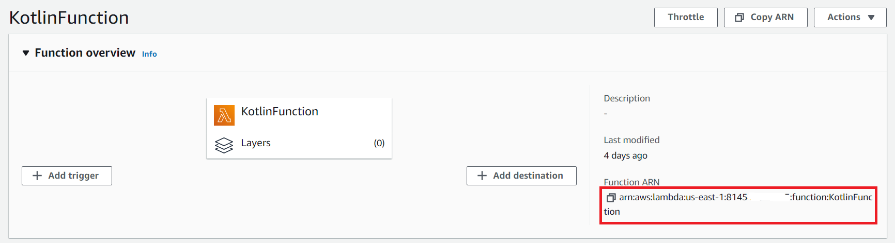
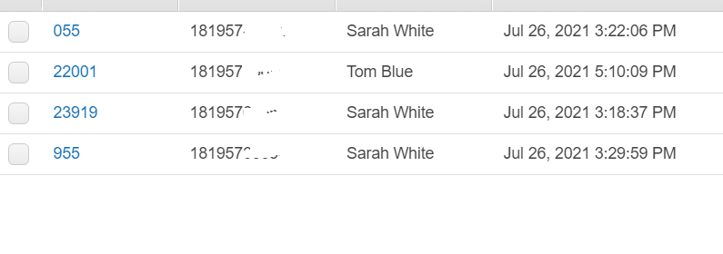

#  Create AWS serverless workflows by using the AWS SDK for Kotlin

## Purpose
You can create an AWS serverless workflow by using the AWS SDK for Kotlin and AWS Step Functions.
Each workflow step is implemented by using an AWS Lambda function. Lambda is a compute service that enables you to run
code without provisioning or managing servers.

**Note:** You can create Lambda functions in various programming languages. For this tutorial, Lambda functions are
implemented by using the Lambda runtime API and the AWS SDK for Kotlin. For more information about Lambda, see
[What is AWS Lambda](https://docs.aws.amazon.com/lambda/latest/dg/welcome.html).

In this tutorial, you create a workflow that creates support tickets for an organization. Each workflow step performs an operation on the ticket. This tutorial shows you how to use the AWS SDK for Kotlin to create a workflow. For example, you'll learn how to read data that's passed to the workflow, how to pass data between steps, and how to invoke AWS services from the workflow.

#### Topics

+ Prerequisites
+ Understand the workflow
+ Create an IAM role that is used to execute Lambda functions
+ Create a workflow by using AWS Step functions
+ Create an IntelliJ project
+ Add the POM dependencies to your project
+ Create Lambda functions by using the AWS SDK for Kotlin
+ Package the project that contains Lambda functions
+ Deploy Lambda functions
+ Add Lambda functions to workflows
+ Invoke the workflow from the AWS Console

## Prerequisites
To follow along with the tutorial, you need the following:
+ An AWS Account.
+ A Java IDE (for this tutorial, the IntelliJ IDE is used that has the Kotlin plug-in installed).
+ Java 1.8 JDK.
+ Maven 3.6 or higher.+ 

### ⚠️ Important

+ The AWS services included in this document are included in the [AWS Free Tier](https://aws.amazon.com/free/?all-free-tier.sort-by=item.additionalFields.SortRank&all-free-tier.sort-order=asc).
+  This code has not been tested in all AWS Regions. Some AWS services are available only in specific regions. For more information, see [AWS Regional Services](https://aws.amazon.com/about-aws/global-infrastructure/regional-product-services). 
+ Running this code might result in charges to your AWS account. 
+ Be sure to terminate all of the resources you create while going through this tutorial to ensure that you’re not charged.

### Creating the resources

Create an Amazon DynamoDB table named **Case** that contains a partition key named **id**. For information about creating an Amazon DynamoDB table, see [Create a Table](https://docs.aws.amazon.com/amazondynamodb/latest/developerguide/getting-started-step-1.html). 

## Understand the workflow

The following figure shows the workflow you'll create with this tutorial.


The following is what happens at each step in the workflow:

+ **Start** -  Initiates the workflow.
+ **Open Case** – Handles a support ticket ID value by passing it to the workflow.
+ **Assign Case** – Assigns the support case to an employee and stores the data in an Amazon DynamoDB table using the Kotlin API .
+ **Send Email** – Sends the employee a mobile text message by using the Amazon Simple Notification Service (Amazon SNS) Kotlin API to inform them there is a new ticket.
+ **End** - Stops the workflow.

## Create an IAM role that's used to execute Lambda functions

Create the following two IAM roles:
+ **lambda-support** - Used to invoke Lamdba functions.
+ **workflow-support** - Used to enable AWS Step Functions to invoke the workflow.

This tutorial uses the DynamoDB and Amazon SNS services. The **lambda-support** role has to have policies that enable it to invoke these services from a Lambda function.  

#### To create an IAM role

1. Open the AWS Management Console. When the page loads, enter **IAM** in the search box, and then choose **IAM** to open the IAM console.

2. In the navigation pane, choose **Roles**, and on the **Roles** page, choose **Create Role**.

3. Choose **AWS service**, and then choose **Lambda**.

4. Choose **Permissions**.

5. Search for **AWSLambdaBasicExecutionRole**.

6. Choose **Next Tags**.

7. Choose **Review**.

8. Name the role **lambda-support**.

9. Choose **Create role**.

10. Choose **lambda-support** to view the overview page.

11. Choose **Attach Policies**.

12. Search for **AmazonDynamoDBFullAccess**, and then choose **Attach policy**.

13. Search for **AmazonSNSFullAccess**, and then choose **Attach policy**. When you're done, you can see the permissions.



14. Repeat this process to create **workflow-support**. For step three, instead of choosing **Lambda**, choose **Step Functions**. You don't need to perform steps 11-13.  

## Create a serverless workflow by using Step functions

You can create a workflow that processes support tickets. To define a workflow by using Step Functions, you create an Amazon States Language (JSON-based) document to define your state machine. An Amazon States Language document describes each step. After you define the document, Step functions provides a visual representation of the workflow. The following figure shows the Amazon States Language document and the visual representation of the workflow.


Workflows can pass data between steps. For example, the **Open Case** step processes a case ID value (passed to the workflow) and passes that value to the **Assign Case** step. Later in this tutorial, you'll create application logic in the Lambda function to read and process the data values.  

#### To create a workflow

1. Open the AWS Step Functions console at https://us-west-2.console.aws.amazon.com/states/home.

2. Choose **Create State Machine**.

3. Choose **Write your workflow in code**. In the **Type** area, choose **Standard**.


4. Specify the Amazon States Language document by entering the following code.

        {
        "Comment": "A simple AWS Step Functions state machine that automates a call center support session.",
        "StartAt": "Open Case",
        "States": {
        "Open Case": {
        "Type": "Task",
        "Resource": "arn:aws:lambda:REGION:ACCOUNT_ID:function:FUNCTION_NAME",
        "Next": "Assign Case"
          },
         "Assign Case": {
         "Type": "Task",
         "Resource": "arn:aws:lambda:REGION:ACCOUNT_ID:function:FUNCTION_NAME",
         "Next": "Send Text Message"
         },
         "Send Text Message": {
         "Type": "Task",
         "Resource": "arn:aws:lambda:REGION:ACCOUNT_ID:function:FUNCTION_NAME",
         "End": true
          }
          }
         }

**Note:** Don't worry about the errors related to the Lambda resource values. You'll update these values later in this tutorial.

5. Choose **Next**.

6. In the name field, enter **KotlinStateMachine**.

7. In the **Permission** section, choose **Choose an existing role**.  

8. Choose **workflow-support** (the IAM role that you created).

9. Choose **Create state machine**. A message appears that states the state machine was successfully created.

## Create an IntelliJ project named LambdaKotlinMaven

The following illustration shows the project options. 



1. In the IntelliJ IDE, choose **File**, **New**, **Project**.

2. In the **New Project** dialog box, choose **Kotlin**.

3. In the **Name** field, specify **LambdaKotlinMaven**.

4. For **Build System**, specify **Maven**. Also select a valid JDK.

5. Choose **Next**.

6. Choose **Finish**.

## Add the POM dependencies to your project

At this point, you have a new project named **LambdaKotlinMaven**.


Make sure that the pom.xml file looks like the following.

```xml
     <?xml version="1.0" encoding="UTF-8"?>
     <project xmlns:xsi="http://www.w3.org/2001/XMLSchema-instance"
         xmlns="http://maven.apache.org/POM/4.0.0"
         xsi:schemaLocation="http://maven.apache.org/POM/4.0.0 http://maven.apache.org/xsd/maven-4.0.0.xsd">
    <modelVersion>4.0.0</modelVersion>
    <artifactId>mainModule</artifactId>
    <groupId>me.scmacdon</groupId>
    <version>1.0-SNAPSHOT</version>
    <packaging>jar</packaging>
    <name>mainModule</name>
    <properties>
        <project.build.sourceEncoding>UTF-8</project.build.sourceEncoding>
        <kotlin.code.style>official</kotlin.code.style>
        <kotlin.compiler.jvmTarget>1.8</kotlin.compiler.jvmTarget>
        <kotlin.version>1.5.21</kotlin.version>
    </properties>
    <build>
        <sourceDirectory>src/main/kotlin</sourceDirectory>
        <testSourceDirectory>src/test/kotlin</testSourceDirectory>
        <plugins>
            <plugin>
                <artifactId>maven-surefire-plugin</artifactId>
                <version>2.22.2</version>
            </plugin>
            <plugin>
                <groupId>org.apache.maven.plugins</groupId>
                <artifactId>maven-shade-plugin</artifactId>
                <version>3.2.2</version>
                <configuration>
                    <createDependencyReducedPom>false</createDependencyReducedPom>
                </configuration>
                <executions>
                    <execution>
                        <phase>package</phase>
                        <goals>
                            <goal>shade</goal>
                        </goals>
                    </execution>
                </executions>
            </plugin>
            <plugin>
                <groupId>org.apache.maven.plugins</groupId>
                <artifactId>maven-compiler-plugin</artifactId>
                <version>3.8.1</version>
                <configuration>
                    <source>1.8</source>
                    <target>1.8</target>
                </configuration>
            </plugin>
            <plugin>
                <groupId>org.jetbrains.kotlin</groupId>
                <artifactId>kotlin-maven-plugin</artifactId>
                <version>1.4.32</version>
                <executions>
                    <execution>
                        <id>compile</id>
                        <phase>compile</phase>
                        <goals>
                            <goal>compile</goal>
                        </goals>
                    </execution>
                    <execution>
                        <id>test-compile</id>
                        <phase>test-compile</phase>
                        <goals>
                            <goal>test-compile</goal>
                        </goals>
                    </execution>
                </executions>
            </plugin>
            <plugin>
                <artifactId>maven-surefire-plugin</artifactId>
                <version>2.22.2</version>
            </plugin>
        </plugins>
    </build>
    <dependencies>
        <dependency>
            <groupId>org.jetbrains.kotlin</groupId>
            <artifactId>kotlin-stdlib</artifactId>
            <version>1.5.21</version>
        </dependency>
        <dependency>
            <groupId>org.apache.logging.log4j</groupId>
            <artifactId>log4j-slf4j-impl</artifactId>
            <version>2.1</version>
            <scope>test</scope>
        </dependency>
        <dependency>
            <groupId>org.jetbrains.kotlin</groupId>
            <artifactId>kotlin-test-junit</artifactId>
            <version>1.5.21</version>
            <scope>test</scope>
        </dependency>
        <dependency>
            <groupId>org.jetbrains.kotlin</groupId>
            <artifactId>kotlin-stdlib-jdk8</artifactId>
            <version>1.5.21</version>
        </dependency>
        <dependency>
            <groupId>aws.sdk.kotlin</groupId>
            <artifactId>dynamodb</artifactId>
            <version>0.4.0-alpha</version>
        </dependency>
        <dependency>
            <groupId>aws.sdk.kotlin</groupId>
            <artifactId>sns</artifactId>
            <version>0.4.0-alpha</version>
        </dependency>
        <dependency>
            <groupId>aws.smithy.kotlin</groupId>
            <artifactId>runtime-core-jvm</artifactId>
            <version>0.4.0-alpha</version>
        </dependency>
        <dependency>
            <groupId>aws.smithy.kotlin</groupId>
            <artifactId>http-jvm</artifactId>
            <version>0.4.0-alpha</version>
        </dependency>
        <dependency>
            <groupId>aws.smithy.kotlin</groupId>
            <artifactId>serde-json-jvm</artifactId>
            <version>0.4.0-alpha</version>
        </dependency>
        <dependency>
            <groupId>aws.smithy.kotlin</groupId>
            <artifactId>serde-jvm</artifactId>
            <version>0.4.0-alpha</version>
        </dependency>
        <dependency>
            <groupId>aws.smithy.kotlin</groupId>
            <artifactId>serde-form-url</artifactId>
            <version>0.4.0-alpha</version>
        </dependency>
        <dependency>
            <groupId>aws.smithy.kotlin</groupId>
            <artifactId>serde-form-url-jvm</artifactId>
            <version>0.4.0-alpha</version>
        </dependency>
        <dependency>
            <groupId>aws.smithy.kotlin</groupId>
            <artifactId>serde-xml</artifactId>
            <version>0.4.0-alpha</version>
        </dependency>
        <dependency>
            <groupId>aws.smithy.kotlin</groupId>
            <artifactId>serde-xml-jvm</artifactId>
            <version>0.4.0-alpha</version>
        </dependency>
        <dependency>
            <groupId>com.amazonaws</groupId>
            <artifactId>aws-lambda-java-core</artifactId>
            <version>1.2.1</version>
        </dependency>
        <dependency>
            <groupId>com.google.code.gson</groupId>
            <artifactId>gson</artifactId>
            <version>2.8.6</version>
        </dependency>
     </dependencies>
    </project>
```

## Create Lambda functions by using the AWS SDK for Lambda API

Use the Lambda runtime API to create the Kotlin classes that define the Lamdba functions. In this example, there are three workflow steps that each correspond to a Kotlin class. There are also two extra classes that invoke the Amazon DynamoDB service and the Amazon SES service by using the AWS Kotlin SDK.  

The following figure shows the Kotlin classes in the project. Notice that all classes are located in a package named **example2**.



To create a Lambda function by using the Lambda runtime API, you implement **com.amazonaws.services.lambda.runtime.RequestHandler**. The application logic that's executed when the workflow step is invoked is located in the **handleRequest** method. The return value of this method is passed to the next step in a workflow. 

Create these Kotlin classes, which are described in the following sections:

+ **Handler** - Used as the first step in the workflow that processes the ticket ID value.  
+ **HandlerTicket** - Used as the second step in the workflow that assigns the ticket to an employee and stores the data in an Amazon DynamoDB table.
+ **HandlerMessage** - Used as the third step in the workflow that sends a text message to the employee to notify them about the ticket.
+ **PersistCase** - Uses the Amazon DynamoDB Kotlin API to store the data in an Amazon DynamoDB table.
+ **SendMessage** - Uses the Amazon SNS Kotlin API to send a text message.

### Handler class

This Kotlin code represents the **Handler** class that creates a Lamdba function that reads the ticket ID value that is passed to the workflow. Notice that you can log messages to Amazon CloudWatch logs by using a **LambdaLogger** object. The **handleRequest** method returns the ticket ID value that is passed to the second step in the workflow. Notice that the **handleRequest** method uses **runBlocking** and the return vlaue uses **return@runBlocking**. These are required when creating a Lambda function by using the AWS SDK for Kotlin. 

```kotlin   
    package example2

     import com.amazonaws.services.lambda.runtime.Context
     import com.amazonaws.services.lambda.runtime.LambdaLogger
     import com.amazonaws.services.lambda.runtime.RequestHandler
     import com.google.gson.Gson
     import com.google.gson.GsonBuilder
     import kotlinx.coroutines.runBlocking

     // Handler value: example.Handler
     class Handler : RequestHandler<Map<String?, String>, String> {

     override fun handleRequest(event: Map<String?, String>, context: Context): String = runBlocking {
        val logger = context.logger
        val gson = GsonBuilder().create()

        // Log execution details
        logger.log("ENVIRONMENT VARIABLES: " + gson.toJson(System.getenv()))
        logger.log("CONTEXT: " + gson.toJson(context))
        // process event
        logger.log("EVENT Data: " + gson.toJson(event))
        val myCaseID = event["inputCaseID"]!!
        logger.log("Case number: $myCaseID")
        return@runBlocking myCaseID
    }
}
```

 ### HandlerTicket class

The **HandlerTicket** class is the second step in the workflow and uses basic Kotlin application logic to select an employee to assign the ticket. Then a **PersistCase** object is created and used to store the ticket data in a DynamoDB table named **Case**. The phone address of the employee is passed to the third step.

```kotlin   
      package example2

      import com.amazonaws.services.lambda.runtime.Context
      import com.amazonaws.services.lambda.runtime.RequestHandler
      import com.google.gson.GsonBuilder
      import kotlinx.coroutines.runBlocking

      class HandlerTicket: RequestHandler<String, String> {
      override fun handleRequest(event: String, context: Context): String = runBlocking {
        
        var phoneNum = "<SPECIFY Phone number>"
        var phoneNum2 = "<SPECIFY Phone number>"
        val logger = context.logger
        val gson = GsonBuilder().create()

        val value: String = event
        logger.log("CASE is about to be assigned $value")

        // Create very simple logic to assign case to an employee
        val tmp = if (Math.random() <= 0.5) 1 else 2
        val perCase = PersistCase()
        logger.log("TMP IS $tmp")

        var phone = ""

        if (tmp == 1) {
            // assign to tblue
            phone = phoneNum
            perCase.putItemInTable(value, "Tom Blue", phone)
        } else {
            // assign to swhite
            phone = phoneNum2
            perCase.putItemInTable(value, "Sarah White", phone)
        }

        logger.log("Phone num IS $phone")
        return@runBlocking phone
       }
     }
  ```
     
**Note**: Be sure to specify a valid phone number for the two variables. 

### HandlerMessage class

The **HandlerMessage** class is the third step in the workflow and creates a **SendMessage** object. A text message is sent to the employee to notify them about the new ticket. The phone number is passed from the second step.

```kotlin   
       package example2

      import com.amazonaws.services.lambda.runtime.Context
      import com.amazonaws.services.lambda.runtime.RequestHandler
      import kotlinx.coroutines.runBlocking
      import java.io.IOException

     class HandlerMessage : RequestHandler<String, String> {

      override fun handleRequest(event: String, context: Context): String = runBlocking {
        val logger = context.logger

        val phone = event
        logger.log("Phone value $phone")
        val msg = SendMessage()

        try {
            msg.send(event)
        } catch (e: IOException) {
            e.stackTrace
        }
        return@runBlocking phone
      }
     }
```

### PersistCase class

The following class uses the Amazon DynamoDB Kotlin API to store the data in a table. 

```kotlin   
       package example2

      import aws.sdk.kotlin.services.dynamodb.DynamoDbClient
      import aws.sdk.kotlin.services.dynamodb.model.AttributeValue
      import aws.sdk.kotlin.services.dynamodb.model.PutItemRequest
      import java.text.SimpleDateFormat
      import java.util.*
      import kotlin.system.exitProcess

     class PersistCase {
     suspend fun putItemInTable(caseId:String, employeeName:String, email:String){

        val ddb = DynamoDbClient{ region = "us-west-2" }
        val date = Calendar.getInstance().time
        val formatter = SimpleDateFormat.getDateTimeInstance()
        val formatedDate = formatter.format(date)

        val itemValues = mutableMapOf<String, AttributeValue>()

        // Add all content to the table.
        itemValues["id"] = AttributeValue.S(caseId)
        itemValues["email"] = AttributeValue.S(email)
        itemValues["name"] =  AttributeValue.S(employeeName)
        itemValues["registrationDate"] = AttributeValue.S(formatedDate)

        val request = PutItemRequest {
            tableName="Case"
            item = itemValues
        }

        try {
            ddb.putItem(request)
            println(" A new item was placed into Case")

        } catch (ex: Exception) {
            println(ex.message)
            ddb.close()
            exitProcess(0)
        }
      }
     }
```

### SendMessage class

The following Java class represents the **SendMessage** class. This class uses the Amazon SNS Kotlin API to send a text message to the employee. 

```kotlin   
       package example2

       import aws.sdk.kotlin.services.sns.SnsClient
       import aws.sdk.kotlin.services.sns.model.PublishRequest
       import aws.sdk.kotlin.services.sns.model.SnsException
       import kotlin.system.exitProcess

       class SendMessage {

        suspend fun send(phone: String ) {
        val snsClient = SnsClient{ region = "us-east-1" }

        try {
            val request = PublishRequest {
                message = "Hello, please check the database for new ticket assigned to you"
                phoneNumber = phone
            }

            val result = snsClient.publish(request)
            println("${result.messageId} message sent.")

        } catch (e: SnsException) {
            println(e.message)
         snsClient.close()
            exitProcess(0)
        }
       }
     }
  ```

## Package the project that contains the Lambda functions

Package up the project into a .jar (JAR) file that you can deploy as a Lambda function by using the following Maven command.

    mvn package

The JAR file is located in the **target** folder (which is a child folder of the project folder).



## Deploy the Lambda functions

1. Open the Lambda console at https://us-west-2.console.aws.amazon.com/lambda/home.

2. Choose **Create Function**.

3. Choose **Author from scratch**.

4. In the **Basic** information section, enter **KotlinOpenCase** as the name.

5. In the **Runtime**, choose **Java 8**.

6. Choose **Use an existing role**, and then choose **lambda-support** (the IAM role that you created).



7. Choose **Create function**.

8. For **Code entry type**, choose **Upload a .zip or .jar file**.

9. Choose **Upload**, and then browse to the JAR file that you created.  

10. For **Handler**, enter the fully qualified name of the function, for example, **example2.Handler::handleRequest** (**example2.Handler** specifies the package and class followed by :: and method name).



11. Choose **Save.**

12. Repeat this procedure for the **HandlerTicket** and **HandlerMessage** classes. Name the corresponding Lambda functions **KotlinOpenCase** and **KotlinMessage**. When you finish, you will have three Lambda functions that you can reference in the Amazon States Language document.  

## Add the Lambda functions to workflows

Open the Lambda console. Notice that you can view the Lambda Amazon Resource Name (ARN) value.



Copy the value and then paste it into step 1 of the Amazon States Language document, located in the Step Functions console.


Update the Resource for the **Assign Case** and **Send Email** steps. This is how you hook in Lambda functions created by using the AWS SDK for Java into a workflow created by using Step Functions.

## Execute your workflow by using the Step Functions console

You can invoke the workflow on the Step Functions console.  An execution receives JSON input. For this example, you can pass the following JSON data to the workflow.  

     {
	"inputCaseID": "001"
     }


#### To execute your workflow

1. On the Step Functions console, choose **Start execution**.

2. In the **Input** section, pass the JSON data. View the workflow. As each step is completed, it turns green.


If the step turns red, an error occurred. You can click the step and view the logs that are accessible from the right side. When the workflow is finished, you can view the data in the DynamoDB table.



### Next steps
Congratulations, you have created an AWS serverless workflow by using the AWS SDK for Kotlin. As stated at the beginning of this tutorial, be sure to terminate all of the resources you create while going through this tutorial to ensure that you’re no longer charged.
