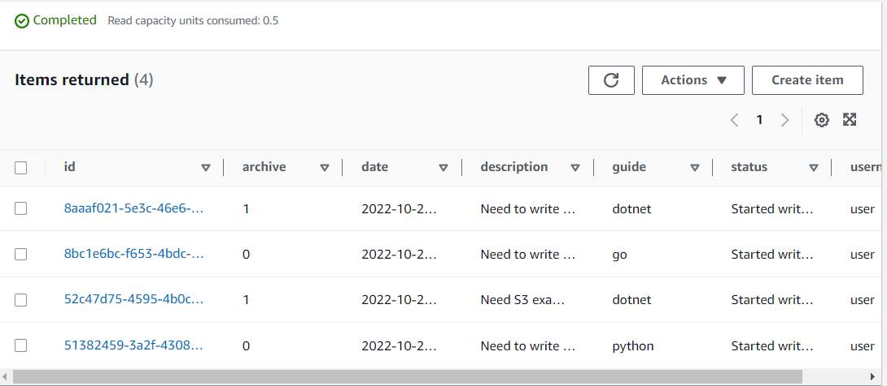
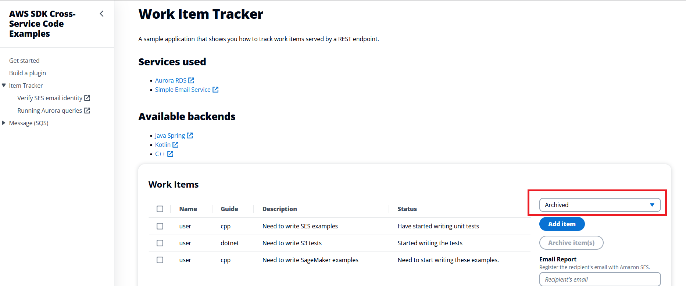
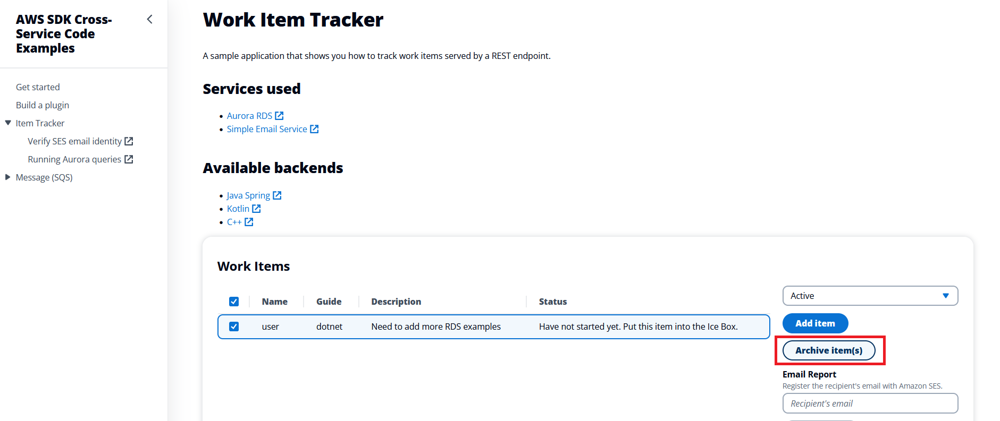
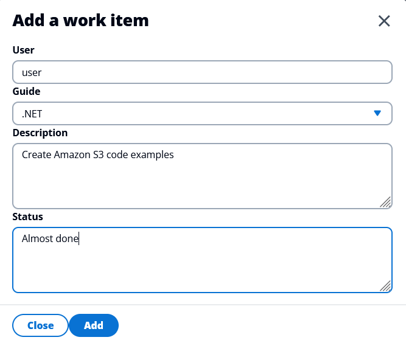

# Create a React and Spring REST application that queries Amazon DynamoDB data using the AWS SDK for Kotlin

## Overview

| Heading      | Description |
| ----------- | ----------- |
| Description | Discusses how to develop a Spring Boot application that queries Amazon DynamoDB data. The Spring Boot application uses the AWS SDK for Kotlin to invoke AWS services and is used by a React application that displays the data. The React application uses Cloudscape. For information, see [Cloudscape](https://cloudscape.design/).    |
| Audience   |  Developer (intermediate)        |
| Updated   | 11/14/2022        |
| Required skills   | Kotlin, Gradle, JavaScript  |

## Purpose

You can develop a dynamic web application that tracks and reports on work items by using the following AWS services:

+ Amazon DynamoDB.
+ Amazon Simple Email Service (Amazon SES). 

The application you create is a decoupled React application that uses a Spring REST API to return Amazon DynamoDB data. That is, the React application interacts with a Spring API by making RESTful GET and POST requests. The Spring API uses a [DynamoDbClient](https://sdk.amazonaws.com/kotlin/api/latest/dynamodb/aws.sdk.kotlin.services.dynamodb/-dynamo-db-client/index.html) object to perform CRUD operations on the Amazon DynamoDB database. Then, the Spring REST API returns JSON data in an HTTP response, as shown in the following illustration. 


#### Topics

+ Prerequisites
+ Understand the AWS Tracker application
+ Create an IntelliJ Kotlin project 
+ Add the dependencies to your Gradle build file
+ Create the Kotlin classes
+ Create the React front end

## Prerequisites

To complete the tutorial, you need the following:

+ An AWS account
+ A Kotlin IDE (this tutorial uses the IntelliJ IDE)
+ Java 1.8 JDK
+ Gradle 6.8 or higher
+ Set up your development environment. For more information, 
see [Get started with the SDK for Kotlin](https://docs.aws.amazon.com/sdk-for-kotlin/latest/developer-guide/get-started.html). 

### Important

+ The AWS services in this document are included in the [AWS Free Tier](https://aws.amazon.com/free/?all-free-tier.sort-by=item.additionalFields.SortRank&all-free-tier.sort-order=asc).
+  This code has not been tested in all AWS Regions. Some AWS services are available only in specific Regions. For more information, see [AWS Regional Services](https://aws.amazon.com/about-aws/global-infrastructure/regional-product-services). 
+ Running this code might result in charges to your AWS account. 
+ Be sure to delete all of the resources that you create during this tutorial so that you won't be charged.

### Creating the DynamoDB table and add some items

Using the AWS Management Console, create an Amazon DynamoDB table named **Work** with a partition key named **id** of type String. 

After creating the **Work** table with the **id** partition key, select the table in the Console, then under
the **Actions** menu, select **Create item** to enter more columns and values (Attributes is the term used with Amazon DynamoDB).

As you are creating an item for the first time, you will both define the attributes in your table as well 
as add values. Enter the attributes and values as shown in the table below. Enter 'Open' as the
value for the **archive** attribute. Select **Create item** to create
your first item (row).

The **Work** table attributes

| Attribute name | What the attribute value represents                                          |
|----------------|------------------------------------------------------------------------------|
| id             | the primary key; enter a random string of text no longer than 20 characters  |
| date           | date the work item was performed                                             |
| description    | description of the work being done                                           |
| guide          | name of the guide the work is for                                            |
| status         | status of the work, e.g., 'started', 'in review'                             |
 | username       | user name who worked performed the work item                                 |
| archive        | a numeric value of 0 (Open) or 1 (Closed) to indicate if the item is active or archived |

Enter at least two more items (rows). This time, since you have already defined all the attributes
needed for this example, select the first item you created by activating the item's checkbox, then select
**Duplicate item** under the **Actions** menu. Select **Create item** when you are finished changing the values.

Duplicate one more item so that you have a total of three items.

The following illustration shows an example of the Work table. 



For additional information about how to create an Amazon DynamoDB table using the AWS Management Console 
and how to add data, see [Create a Table](https://docs.aws.amazon.com/amazondynamodb/latest/developerguide/getting-started-step-1.html).
(The table created in that example is different from the one we are using in this example.)

Now that the table is created and populated with some data, when we start up the Spring Boot app for 
the REST API, there will data to display.  

## Understand the AWS Tracker React application 

A user can perform the following tasks using the React application:

+ View all active items.
+ View archived items that are complete.
+ Add a new item. 
+ Convert an active item into an archived item.
+ Send a report to an email recipient.

The React application displays *active* and *archive* items. For example, the following illustration shows the React application displaying active data.


Likewise, the following illustration shows the React application displaying archived data.



The React application lets a user convert an active item to an archived item by clicking the following button. 



The React application also lets a user enter a new item. 



The user can enter an email recipient into the text field and choose **Send Report**.


The application queries active items from the database and sends the data to the selected email recipient. 

## Create an IntelliJ project 

Perform these steps. 

1. In the IntelliJ IDE, choose **File**, **New**, **Project**.
2. In the **New Project** dialog box, choose **Kotlin**.
3. Enter the name **ItemTrackerKotlinDynamoDBRest**. 
4. Select **Gradle Kotlin** for the Build System.
5. Select your JVM option and choose **Next**.
6. Choose **Finish**.

## Add the dependencies to your Gradle build file

At this point, you have a new project. Ensure that the **build.gradle.kts** file looks like the following.

```yaml
import org.jetbrains.kotlin.gradle.tasks.KotlinCompile

plugins {
    kotlin("jvm") version "1.7.10"
    application
}

group = "me.scmacdon"
version = "1.0-SNAPSHOT"

buildscript {
    repositories {
        maven("https://plugins.gradle.org/m2/")
    }
    dependencies {
        classpath("org.jlleitschuh.gradle:ktlint-gradle:10.3.0")
    }
}

repositories {
    mavenCentral()
    jcenter()
}
apply(plugin = "org.jlleitschuh.gradle.ktlint")
dependencies {
    implementation("org.springframework.boot:spring-boot-starter-web:2.7.5")
    implementation("com.fasterxml.jackson.module:jackson-module-kotlin:2.13.3")
    implementation("org.jetbrains.kotlin:kotlin-reflect")
    implementation("org.jetbrains.kotlin:kotlin-stdlib-jdk8")
    implementation("javax.mail:javax.mail-api:1.6.2")
    implementation("com.sun.mail:javax.mail:1.6.2")
    implementation("aws.sdk.kotlin:dynamodb:0.17.1-beta")
    implementation("aws.sdk.kotlin:ses:0.17.1-beta")
    testImplementation("org.springframework.boot:spring-boot-starter-test:2.7.3")
}

tasks.withType<KotlinCompile> {
    kotlinOptions {
        freeCompilerArgs = listOf("-Xjsr305=strict")
        jvmTarget = "1.8"
    }
}

tasks.withType<Test> {
    useJUnitPlatform()
}

```


## Create the Kotlin classes

Create a new package in the **main/kotlin** folder named **com.aws.rest**. The following Kotlin classes go into this package.

+ **App** - Used as the base class and Controller for the Spring Boot application. 
+ **DynamoDBService** - Uses the **DynamoDbClient** object to perform CRUD operations on the database. 
+ **SendMessage** - Uses the **SesClient** object to send email messages.
+ **WorkItem** - Represents the application model.

**Note:** The **MessageResource** class is located in the **App** file.

### App class 

The following Kotlin code represents the **App** class. This is the entry point into a Spring boot application.  

```kotlin
/*
   Copyright Amazon.com, Inc. or its affiliates. All Rights Reserved.
   SPDX-License-Identifier: Apache-2.0
*/

package com.aws.rest

import kotlinx.coroutines.runBlocking
import org.springframework.beans.factory.annotation.Autowired
import org.springframework.boot.autoconfigure.SpringBootApplication
import org.springframework.boot.runApplication
import org.springframework.http.HttpStatus
import org.springframework.web.bind.annotation.CrossOrigin
import org.springframework.web.bind.annotation.GetMapping
import org.springframework.web.bind.annotation.PathVariable
import org.springframework.web.bind.annotation.PostMapping
import org.springframework.web.bind.annotation.PutMapping
import org.springframework.web.bind.annotation.RequestBody
import org.springframework.web.bind.annotation.RequestParam
import org.springframework.web.bind.annotation.ResponseStatus
import org.springframework.web.bind.annotation.RestController
import java.io.IOException

@SpringBootApplication
open class App

fun main(args: Array<String>) {
    runApplication<App>(*args)
}

@CrossOrigin(origins = ["*"])
@RestController
class MessageResource {

    @Autowired
    private lateinit var dbService: DynamoDBService

    @Autowired
    private lateinit var sendMsg: SendMessage

    // Add a new item to the Amazon DynamoDB database.
    @PostMapping("api/items")
    fun addItems(@RequestBody payLoad: Map<String, Any>): String = runBlocking {
        val nameVal = "user"
        val guideVal = payLoad.get("guide").toString()
        val descriptionVal = payLoad.get("description").toString()
        val statusVal = payLoad.get("status").toString()

        // Create a Work Item object.
        val myWork = WorkItem()
        myWork.guide = guideVal
        myWork.description = descriptionVal
        myWork.status = statusVal
        myWork.name = nameVal
        val id = dbService.putItemInTable(myWork)
        return@runBlocking "Item $id added successfully!"
    }

    // Retrieve items.
    @GetMapping("api/items")
    fun getItems(@RequestParam(required = false) archived: String?): MutableList<WorkItem> = runBlocking {
        val list: MutableList<WorkItem>
        if (archived == "false") {
            list = dbService.getOpenItems(false)
        } else if (archived == "true") {
            list = dbService.getOpenItems(true)
        } else {
            list = dbService.getAllItems()
        }
        return@runBlocking list
    }

    // Flip an item from Active to Archive.
    @PutMapping("api/items/{id}:archive")
    @ResponseStatus(value = HttpStatus.NO_CONTENT)
    fun modUser(@PathVariable id: String) = runBlocking {
        dbService.archiveItemEC(id)
        return@runBlocking
    }

    @PostMapping("api/items:report")
    @ResponseStatus(value = HttpStatus.NO_CONTENT)
    fun sendReport(@RequestBody body: Map<String, String>) = runBlocking {
        val email = body.get("email")
        val xml = dbService.getOpenReport(false)
        try {
            if (email != null) {
                sendMsg.send(email, xml)
            }
        } catch (e: IOException) {
            e.stackTrace
        }
        return@runBlocking
    }
}


```    

### DynamoDBService class
The following Kotlin code represents the **DynamoDBService** class that uses the **DynamoDbClient** client to perform operations on the Amazon DynamoDB Work table. For example, the **getAllItems** method returns all items in the Work table. Notice the **getOpenItems** method uses a **filterExpression** to query either active or archive items. This represents how you can filter Amazon DynamoDB items when using the AWS SDK for Kotlin.

```kotlin
package com.aws.rest
import aws.sdk.kotlin.services.dynamodb.DynamoDbClient
import aws.sdk.kotlin.services.dynamodb.model.AttributeAction
import aws.sdk.kotlin.services.dynamodb.model.AttributeValue
import aws.sdk.kotlin.services.dynamodb.model.AttributeValueUpdate
import aws.sdk.kotlin.services.dynamodb.model.PutItemRequest
import aws.sdk.kotlin.services.dynamodb.model.ScanRequest
import aws.sdk.kotlin.services.dynamodb.model.UpdateItemRequest
import org.springframework.stereotype.Component
import org.w3c.dom.Document
import java.io.StringWriter
import java.text.SimpleDateFormat
import java.util.Calendar
import java.util.UUID
import javax.xml.parsers.DocumentBuilderFactory
import javax.xml.parsers.ParserConfigurationException
import javax.xml.transform.TransformerException
import javax.xml.transform.TransformerFactory
import javax.xml.transform.dom.DOMSource
import javax.xml.transform.stream.StreamResult
import kotlin.collections.HashMap

/*
Before running this code example, create an Amazon DynamoDB table named Work with a primary key named id.
*/
@Component
class DynamoDBService {

    // Archive an item.
    suspend fun archiveItemEC(id: String) {
        val tableNameVal = "Work"
        val itemKey = mutableMapOf<String, AttributeValue>()
        itemKey["id"] = AttributeValue.S(id)

        val updatedValues = mutableMapOf<String, AttributeValueUpdate>()
        updatedValues["archive"] = AttributeValueUpdate {
            value = AttributeValue.N("1")
            action = AttributeAction.Put
        }

        val request = UpdateItemRequest {
            tableName = tableNameVal
            key = itemKey
            attributeUpdates = updatedValues
        }

        DynamoDbClient { region = "us-east-1" }.use { dynamoDBClient ->
            dynamoDBClient.updateItem(request)
        }
    }

    // Get items from the Amazon DynamoDB table.
    suspend fun getOpenItems(myArc: Boolean): MutableList<WorkItem> {
        val tableNameVal = "Work"
        val myList = mutableListOf<WorkItem>()
        val myMap = HashMap<String, String>()
        myMap.put("#archive2", "archive")
        val myExMap = mutableMapOf<String, AttributeValue>()
        if (myArc) {
            myExMap.put(":val", AttributeValue.N("1"))
        } else {
            myExMap.put(":val", AttributeValue.N("0"))
        }

        val scanRequest = ScanRequest {
            expressionAttributeNames = myMap
            expressionAttributeValues = myExMap
            tableName = tableNameVal
            filterExpression = "#archive2 = :val"
        }

        DynamoDbClient { region = "us-east-1" }.use { dynamoDBClient ->
            val response = dynamoDBClient.scan(scanRequest)
            for (item in response.items!!) {
                val keys = item.keys
                val myItem = WorkItem()

                for (key in keys) {
                    when (key) {
                        "date" -> {
                            myItem.date = splitMyString(item[key].toString())
                        }

                        "status" -> {
                            myItem.status = splitMyString(item[key].toString())
                        }

                        "username" -> {
                            myItem.name = "user"
                        }

                        "archive" -> {
                            myItem.arc = splitMyString(item[key].toString())
                        }

                        "description" -> {
                            myItem.description = splitMyString(item[key].toString())
                        }
                        "id" -> {
                            myItem.id = splitMyString(item[key].toString())
                        }
                        else -> {
                            myItem.guide = splitMyString(item[key].toString())
                            myList.add(myItem)
                        }
                    }
                }
            }
            return myList
        }
    }

    // Get items from the Amazon DynamoDB table.
    suspend fun getAllItems(): MutableList<WorkItem> {
        val tableNameVal = "Work"
        val myList = mutableListOf<WorkItem>()
        val scanRequest = ScanRequest {
           tableName = tableNameVal
       }

        DynamoDbClient { region = "us-east-1" }.use { dynamoDBClient ->
            val response = dynamoDBClient.scan(scanRequest)
            for (item in response.items!!) {
                val keys = item.keys
                val myItem = WorkItem()

                for (key in keys) {
                    when (key) {
                        "date" -> {
                            myItem.date = splitMyString(item[key].toString())
                        }

                        "status" -> {
                            myItem.status = splitMyString(item[key].toString())
                        }

                        "username" -> {
                            myItem.name = "user"
                        }

                        "archive" -> {
                            myItem.arc = splitMyString(item[key].toString())
                        }

                        "description" -> {
                            myItem.description = splitMyString(item[key].toString())
                        }
                        "id" -> {
                            myItem.id = splitMyString(item[key].toString())
                        }
                        else -> {
                            myItem.guide = splitMyString(item[key].toString())
                            myList.add(myItem)
                        }
                    }
                }
            }
            return myList
        }
    }


    // Get items to go into the email report.
    suspend fun getOpenReport(myArc: Boolean): String? {
        val tableNameVal = "Work"
        val myList = mutableListOf<WorkItem>()
        val myMap = HashMap<String, String>()
        myMap.put("#archive2", "archive")
        val myExMap = mutableMapOf<String, AttributeValue>()
        if (myArc) {
            myExMap.put(":val", AttributeValue.N("1"))
        } else {
            myExMap.put(":val", AttributeValue.N("0"))
        }

        val scanRequest = ScanRequest {
            expressionAttributeNames = myMap
            expressionAttributeValues = myExMap
            tableName = tableNameVal
            filterExpression = "#archive2 = :val"
        }

        DynamoDbClient { region = "us-east-1" }.use { dynamoDBClient ->
            val response = dynamoDBClient.scan(scanRequest)
            for (item in response.items!!) {
                val keys = item.keys
                val myItem = WorkItem()

                for (key in keys) {
                    when (key) {
                        "date" -> {
                            myItem.date = splitMyString(item[key].toString())
                        }

                        "status" -> {
                            myItem.status = splitMyString(item[key].toString())
                        }

                        "username" -> {
                            myItem.name = "user"
                        }

                        "archive" -> {
                            myItem.arc = splitMyString(item[key].toString())
                        }

                        "description" -> {
                            myItem.description = splitMyString(item[key].toString())
                        }
                        "id" -> {
                            myItem.id = splitMyString(item[key].toString())
                        }
                        else -> {
                            myItem.guide = splitMyString(item[key].toString())
                            myList.add(myItem)
                        }
                    }
                }
            }
            return toXml(myList)?.let { convertToString(it) }
        }
    }

    // Put an item into an Amazon DynamoDB table.
    suspend fun putItemInTable(itemOb: WorkItem): String {
        val tableNameVal = "Work"

        // Get all the values to store in the Amazon DynamoDB table.
        val myGuid = UUID.randomUUID().toString()
        val user = itemOb.name
        val desc = itemOb.description
        val status = itemOb.status
        val guide = itemOb.guide

        val date = Calendar.getInstance().time
        val formatter = SimpleDateFormat.getDateTimeInstance()
        val formatedDate = formatter.format(date)

        // Add the data to the DynamoDB table.
        val itemValues = mutableMapOf<String, AttributeValue>()
        itemValues["id"] = AttributeValue.S(myGuid)
        itemValues["username"] = AttributeValue.S(user.toString())
        itemValues["archive"] = AttributeValue.N("0")
        itemValues["date"] = AttributeValue.S(formatedDate)
        itemValues["description"] = AttributeValue.S(desc.toString())
        itemValues["guide"] = AttributeValue.S(guide.toString())
        itemValues["status"] = AttributeValue.S(status.toString())

        val request = PutItemRequest {
            tableName = tableNameVal
            item = itemValues
        }

        DynamoDbClient { region = "us-east-1" }.use { dynamoDBClient ->
            dynamoDBClient.putItem(request)
            return myGuid
        }
    }
}

// Split the item[key] value.
fun splitMyString(str: String): String {
    val del1 = "="
    val del2 = ")"
    val parts = str.split(del1, del2)
    val myVal = parts[1]
    return myVal
}

// Convert Work item data into XML to pass back to the view.
private fun toXml(itemList: MutableList<WorkItem>): Document? {
    try {
        val factory = DocumentBuilderFactory.newInstance()
        val builder = factory.newDocumentBuilder()
        val doc = builder.newDocument()

        // Start building the XML.
        val root = doc.createElement("Items")
        doc.appendChild(root)

        // Get the elements from the collection.
        val custCount = itemList.size

        // Iterate through the collection.
        for (index in 0 until custCount) {
            // Get the WorkItem object from the collection.
            val myItem = itemList[index]
            val item = doc.createElement("Item")
            root.appendChild(item)

            // Set Id.
            val id = doc.createElement("Id")
            id.appendChild(doc.createTextNode(myItem.id))
            item.appendChild(id)

            // Set Name.
            val name = doc.createElement("Name")
            name.appendChild(doc.createTextNode(myItem.name))
            item.appendChild(name)

            // Set Date.
            val date = doc.createElement("Date")
            date.appendChild(doc.createTextNode(myItem.date))
            item.appendChild(date)

            // Set Description.
            val desc = doc.createElement("Description")
            desc.appendChild(doc.createTextNode(myItem.description))
            item.appendChild(desc)

            // Set Guide.
            val guide = doc.createElement("Guide")
            guide.appendChild(doc.createTextNode(myItem.guide))
            item.appendChild(guide)

            // Set Status.
            val status = doc.createElement("Status")
            status.appendChild(doc.createTextNode(myItem.status))
            item.appendChild(status)
        }
        return doc
    } catch (e: ParserConfigurationException) {
        e.printStackTrace()
    }
    return null
}

private fun convertToString(xml: Document): String? {
    try {
        val transformer = TransformerFactory.newInstance().newTransformer()
        val result = StreamResult(StringWriter())
        val source = DOMSource(xml)
        transformer.transform(source, result)
        return result.writer.toString()
    } catch (ex: TransformerException) {
        ex.printStackTrace()
    }
    return null
}


```

### SendMessage class
The **SendMessage** class uses the [SesClient](https://sdk.amazonaws.com/kotlin/api/latest/ses/aws.sdk.kotlin.services.ses/-ses-client/index.html) client to send an email message. 

Before you can send the email message, the email address that you're sending it to must be verified. For more information, see [Verifying an email address](https://docs.aws.amazon.com/ses/latest/DeveloperGuide//verify-email-addresses-procedure.html).

The following Kotlin code represents the **SendMessage** class. 

```kotlin
package com.example.demo

import kotlin.system.exitProcess
import aws.sdk.kotlin.services.ses.SesClient
import aws.sdk.kotlin.services.ses.model.SesException
import aws.sdk.kotlin.services.ses.model.Destination
import aws.sdk.kotlin.services.ses.model.Content
import aws.sdk.kotlin.services.ses.model.Body
import aws.sdk.kotlin.services.ses.model.Message
import aws.sdk.kotlin.services.ses.model.SendEmailRequest

class SendMessage {

    suspend fun send(
        recipient: String,
        strValue: String?
    ) {
        val sesClient = SesClient { region = "us-east-1" }
        // The HTML body of the email.
        val bodyHTML = ("<html>" + "<head></head>" + "<body>" + "<h1>Amazon RDS Items!</h1>"
                + "<textarea>$strValue</textarea>" + "</body>" + "</html>")

        val destinationOb = Destination {
            toAddresses = listOf(recipient)
        }

        val contentOb = Content {
            data = bodyHTML
        }

        val subOb = Content {
            data = "Item Report"
        }

        val bodyOb= Body {
            html = contentOb
        }

        val msgOb = Message {
            subject = subOb
            body = bodyOb
        }

        val emailRequest = SendEmailRequest {
            destination = destinationOb
            message = msgOb
            source = "<Enter email>"
        }

        try {
            println("Attempting to send an email through Amazon SES using the AWS SDK for Kotlin...")
            sesClient.sendEmail(emailRequest)

        } catch (e: SesException) {
            println(e.message)
            sesClient.close()
            exitProcess(0)
        }
    }
}
```

**Note:** You must update the email **sender** address with a verified email address. Otherwise, the email is not sent. For more information, see [Verifying email addresses in Amazon SES](https://docs.aws.amazon.com/ses/latest/DeveloperGuide/verify-email-addresses.html).       


### WorkItem class

The following Kotlin code represents the **WorkItem** class.   

```kotlin
package com.example.demo

class WorkItem {
    var id: String? = null
    var arc: String? = null
    var name: String? = null
    var guide: String? = null
    var date: String? = null
    var description: String? = null
    var status: String? = null
}
```

## Run the application 

Using the IntelliJ IDE, you can run your Spring REST API. The first time you run it, choose the run icon in the main class. The Spring API supports the following URLs. 

- /api/items - A GET request that returns all data items from the **Work** table. 
- /api/items?archived=true - A GET request that returns either active or archive data items from the **Work** table. 
- /api/items/{id}:archive - A PUT request that converts the specified data item to an archived item. 
- /api/items - A POST request that adds a new item to the database. 
- api/items:report - A POST request that creates a report of active items and emails the report. 

**Note**: The React application created in the next section consumes all of these URLs. 

Confirm that the Spring REST API works by viewing the Active items. Enter the following URL into a browser. 

http://localhost:8080/api/items

The following illustration shows the JSON data returned from the Spring REST API. 


## Create the React front end

You can create the React application that consumes the JSON data returned from the Spring REST API. To create the React application, you can download files from the following GitHub repository. Included in this repository are instructions on how to set up the project. Click the following link to access the GitHub location [Work item tracker web client](https://github.com/awsdocs/aws-doc-sdk-examples/tree/main/resources/clients/react/elwing).  

### Update BASE_URL

You must ensure that the **BASE_URL** is correct. In the **config.json** file, ensure this value references your Spring application.

```javascript
{
  "BASE_URL": "http://localhost:8080/api"
}
```
  
### Next steps
Congratulations, you have created a decoupled React application that consumes data from a Spring REST API. The Spring REST API uses the AWS SDK for Java (v2) to invoke AWS services. As stated at the beginning of this tutorial, be sure to delete all of the resources that you create during this tutorial so that you won't continue to be charged.


